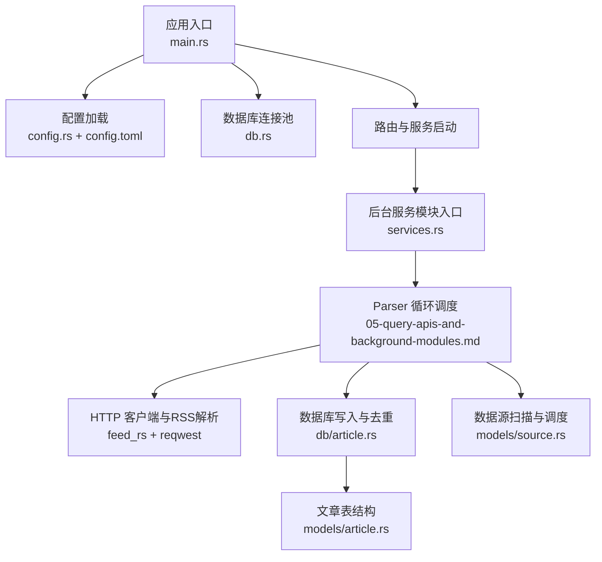
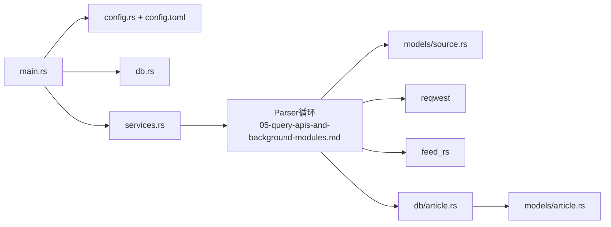

# Parser解析模块

<cite>
**本文引用的文件**
- [main.rs](file://src/main.rs)
- [config.rs](file://src/config.rs)
- [config.toml](file://config.toml)
- [db.rs](file://src/db.rs)
- [article.rs](file://src/db/article.rs)
- [source.rs](file://src/models/source.rs)
- [article_model.rs](file://src/models/article.rs)
- [05-query-apis-and-background-modules.md](file://docs/plans/05-query-apis-and-background-modules.md)
- [parser-module/spec.md](file://openspec/changes/query-apis-and-background-modules/specs/parser-module/spec.md)
</cite>

## 目录
1. [简介](#简介)
2. [项目结构](#项目结构)
3. [核心组件](#核心组件)
4. [架构总览](#架构总览)
5. [详细组件分析](#详细组件分析)
6. [依赖关系分析](#依赖关系分析)
7. [性能考量](#性能考量)
8. [故障排查指南](#故障排查指南)
9. [结论](#结论)
10. [附录](#附录)

## 简介
本文件为 Parser 解析模块的技术文档，聚焦 RSS/Atom 内容采集的完整实现流程，涵盖数据源配置、内容抓取机制、去重逻辑与数据库写入过程；同时阐述 Parser 模块的运行周期、调度策略与性能优化方案，解析 RSS/Atom 格式解析算法、内容提取规则、时间戳处理与编码转换策略，并提供配置参数说明、错误处理机制、重试策略与监控指标建议，以及数据采集频率设置、并发控制与资源限制的最佳实践。文末给出扩展新数据源类型与自定义解析规则的实际代码示例路径。

## 项目结构
Parser 模块在当前仓库中以“计划文档”和“规范说明”的形式定义，核心实现位于后台服务模块入口处，通过配置驱动与数据库交互完成周期性抓取与入库。关键文件与职责如下：
- 配置层：应用配置结构体与 TOML 配置文件，定义 Parser 的并发上限、默认 UA 与超时等参数
- 数据模型：数据源与文章的数据结构，用于查询、插入与状态管理
- 数据库层：文章表的插入、查询与去重逻辑，以及连接池初始化
- 后台服务：Parser 循环调度、并发限流、错误日志与成功更新 last_fetched_at
- 规范与计划：定义了 Parser 的行为契约、调度间隔、并发限制、RSS 解析与去重策略



图表来源
- [main.rs:63-96](file://src/main.rs#L63-L96)
- [config.rs:52-59](file://src/config.rs#L52-L59)
- [config.toml:12-16](file://config.toml#L12-L16)
- [db.rs:11-25](file://src/db.rs#L11-L25)
- [services.rs:1-6](file://src/services.rs#L1-L6)
- [05-query-apis-and-background-modules.md:429-502](file://docs/plans/05-query-apis-and-background-modules.md#L429-L502)
- [article.rs:6-29](file://src/db/article.rs#L6-L29)
- [article_model.rs:5-16](file://src/models/article.rs#L5-L16)
- [source.rs:5-19](file://src/models/source.rs#L5-L19)

章节来源
- [main.rs:63-96](file://src/main.rs#L63-L96)
- [config.rs:52-59](file://src/config.rs#L52-L59)
- [config.toml:12-16](file://config.toml#L12-L16)
- [db.rs:11-25](file://src/db.rs#L11-L25)
- [services.rs:1-6](file://src/services.rs#L1-L6)

## 核心组件
- 应用配置（AppConfig）：包含 server、database、auth、parser、filter、pusher 等分段配置，Parser 相关参数包括最大并发抓取数、默认 User-Agent、默认超时秒数
- 数据源模型（DataSource）：记录数据源类型、名称、URL、配置、启用状态、采集间隔、上次采集时间等
- 文章模型（Article）：记录文章字段，含去重键 link 与 fetched_at 时间戳
- 数据库层（db/article.rs）：提供按 link 去重的插入接口、未处理文章查询、标记已处理、统计与分页查询
- 后台服务（Parser 循环）：基于定时器扫描满足条件的数据源，使用信号量限制并发，调用 Parser trait 抽象执行抓取与解析，写入数据库并更新 last_fetched_at

章节来源
- [config.rs:30-35](file://src/config.rs#L30-L35)
- [source.rs:5-19](file://src/models/source.rs#L5-L19)
- [article_model.rs:5-16](file://src/models/article.rs#L5-L16)
- [article.rs:6-29](file://src/db/article.rs#L6-L29)
- [05-query-apis-and-background-modules.md:429-502](file://docs/plans/05-query-apis-and-background-modules.md#L429-L502)

## 架构总览
Parser 模块采用“配置驱动 + 异步后台循环 + 并发限流 + SQL 去重”的架构设计。整体流程如下：
- 应用启动后加载配置与数据库，初始化连接池并执行迁移
- 后台服务启动 Parser 循环，每 30 秒扫描一次满足采集条件的数据源
- 对每个待采集源，使用信号量限制并发，发起 HTTP 请求并解析 RSS/Atom
- 将解析出的文章按 link 去重写入数据库，成功后更新该数据源的 last_fetched_at
- 失败时记录错误日志并继续下一个数据源

```mermaid
sequenceDiagram
participant App as "应用入口<br/>main.rs"
participant Svc as "后台服务<br/>services.rs"
participant Loop as "Parser循环<br/>05-query-apis-and-background-modules.md"
participant DS as "数据源模型<br/>models/source.rs"
participant HTTP as "HTTP客户端<br/>reqwest"
participant Parser as "解析器<br/>feed_rs"
participant DB as "数据库<br/>db/article.rs"
App->>Svc : 初始化配置与数据库
Svc->>Loop : 启动 Parser 循环
Loop->>Loop : 定时器 tick(30s)
Loop->>DS : 查询启用且到达采集时间的数据源
Loop->>Loop : 获取信号量许可
Loop->>HTTP : 发起请求(带UA与超时)
HTTP-->>Loop : 返回字节流
Loop->>Parser : 解析RSS/Atom
Parser-->>Loop : 返回文章列表
Loop->>DB : 按link去重插入文章
DB-->>Loop : 插入结果
Loop->>DS : 更新last_fetched_at
Loop-->>Loop : 继续下一批数据源
```

图表来源
- [main.rs:63-96](file://src/main.rs#L63-L96)
- [services.rs:1-6](file://src/services.rs#L1-L6)
- [05-query-apis-and-background-modules.md:429-502](file://docs/plans/05-query-apis-and-background-modules.md#L429-L502)
- [source.rs:5-19](file://src/models/source.rs#L5-L19)
- [article.rs:6-29](file://src/db/article.rs#L6-L29)

## 详细组件分析

### 配置系统与参数
- Parser 配置项
  - max_concurrent_fetches：最大并发抓取数，用于限制同时进行的 HTTP 请求
  - default_user_agent：默认 User-Agent，便于目标站点识别与友好抓取
  - default_timeout_seconds：默认超时秒数，避免长时间阻塞
- 其他相关配置
  - 数据库路径：用于初始化 SQLite 连接池
  - 服务器监听地址与端口：用于 API 服务（Parser 为后台任务）

章节来源
- [config.rs:30-35](file://src/config.rs#L30-L35)
- [config.toml:12-16](file://config.toml#L12-L16)
- [db.rs:11-25](file://src/db.rs#L11-L25)
- [main.rs:88-92](file://src/main.rs#L88-L92)

### 数据源模型与扫描逻辑
- 数据源模型包含：类型、名称、URL、配置、启用状态、采集间隔、上次采集时间等字段
- 扫描条件：启用状态为真，且满足“从未采集过”或“距离上次采集已超过 interval_seconds”
- 扫描周期：每 30 秒检查一次

章节来源
- [source.rs:5-19](file://src/models/source.rs#L5-L19)
- [05-query-apis-and-background-modules.md:442-450](file://docs/plans/05-query-apis-and-background-modules.md#L442-L450)

### RSS/Atom 解析与内容提取
- 使用 feed_rs 解析 RSS/Atom 流，提取条目字段
- 提取字段：链接、标题、摘要；发布时间优先取 published，否则回退到 updated
- 当前实现仅提取基础字段，content 字段为空，后续可扩展正文抽取

章节来源
- [05-query-apis-and-background-modules.md:359-416](file://docs/plans/05-query-apis-and-background-modules.md#L359-L416)

### 去重逻辑与数据库写入
- 去重键：文章链接（link）
- 写入策略：使用 INSERT ... ON CONFLICT(link) DO NOTHING 或 INSERT OR IGNORE，确保不重复
- 成功写入后，更新对应数据源的 last_fetched_at
- 未处理文章查询：按 fetched_at 升序取出，供后续过滤/推送模块使用

章节来源
- [article.rs:6-29](file://src/db/article.rs#L6-L29)
- [article.rs:107-125](file://src/db/article.rs#L107-L125)
- [05-query-apis-and-background-modules.md:467-491](file://docs/plans/05-query-apis-and-background-modules.md#L467-L491)

### 并发控制与调度策略
- 并发控制：使用信号量限制最大并发抓取数，避免对远端站点造成压力
- 调度策略：固定 30 秒 tick，扫描满足条件的数据源并异步并发抓取
- 错误处理：单个数据源失败不影响整体循环，记录错误日志后继续

章节来源
- [05-query-apis-and-background-modules.md:429-502](file://docs/plans/05-query-apis-and-background-modules.md#L429-L502)

### 时间戳处理与编码转换
- 时间戳处理：解析器优先使用 published，回退到 updated；统一转换为 UTC 的 NaiveDateTime 存储
- 编码转换：HTTP 响应字节流由 feed_rs 解析，底层依赖 encoding_rs，自动处理常见编码

章节来源
- [05-query-apis-and-background-modules.md:401-403](file://docs/plans/05-query-apis-and-background-modules.md#L401-L403)
- [Cargo.lock:1621-1658](file://Cargo.lock#L1621-L1658)

### 扩展新数据源类型与自定义解析规则
- Parser trait：定义统一的异步抓取与解析接口，便于新增解析器类型
- RssParser 实现：基于 feed_rs 与 reqwest 的具体实现
- 新增步骤：实现 Parser trait 的 fetch_and_parse 方法，注册到调度循环中

章节来源
- [parser-module/spec.md:46-54](file://openspec/changes/query-apis-and-background-modules/specs/parser-module/spec.md#L46-L54)
- [05-query-apis-and-background-modules.md:359-416](file://docs/plans/05-query-apis-and-background-modules.md#L359-L416)

## 依赖关系分析
- 应用入口依赖配置与数据库初始化，启动后台服务
- Parser 循环依赖数据源模型、HTTP 客户端与解析库、数据库写入接口
- 数据库层提供去重与统计能力，支撑上层业务逻辑



图表来源
- [main.rs:63-96](file://src/main.rs#L63-L96)
- [config.rs:52-59](file://src/config.rs#L52-L59)
- [config.toml:12-16](file://config.toml#L12-L16)
- [db.rs:11-25](file://src/db.rs#L11-L25)
- [services.rs:1-6](file://src/services.rs#L1-L6)
- [05-query-apis-and-background-modules.md:429-502](file://docs/plans/05-query-apis-and-background-modules.md#L429-L502)
- [source.rs:5-19](file://src/models/source.rs#L5-L19)
- [article.rs:6-29](file://src/db/article.rs#L6-L29)
- [article_model.rs:5-16](file://src/models/article.rs#L5-L16)

章节来源
- [main.rs:63-96](file://src/main.rs#L63-L96)
- [services.rs:1-6](file://src/services.rs#L1-L6)
- [05-query-apis-and-background-modules.md:429-502](file://docs/plans/05-query-apis-and-background-modules.md#L429-L502)

## 性能考量
- 并发控制：通过信号量将并发抓取限制在 max_concurrent_fetches，避免网络与远端服务压力过大
- 超时设置：default_timeout_seconds 控制单次抓取最长等待时间，防止阻塞
- 数据库写入：使用 ON CONFLICT(link) DO NOTHING，减少重复写入开销
- 扫描频率：固定 30 秒 tick，兼顾及时性与系统负载
- 连接池：SQLite 连接池默认最大连接数为 5，结合 WAL 模式与外键约束提升并发稳定性

章节来源
- [config.rs:30-35](file://src/config.rs#L30-L35)
- [config.toml:12-16](file://config.toml#L12-L16)
- [article.rs:6-29](file://src/db/article.rs#L6-L29)
- [db.rs:11-25](file://src/db.rs#L11-L25)
- [05-query-apis-and-background-modules.md:429-502](file://docs/plans/05-query-apis-and-background-modules.md#L429-L502)

## 故障排查指南
- 无法连接数据库：检查 database.path 是否存在且可写，确认 WAL 与外键设置是否生效
- 抓取超时或失败：调整 default_timeout_seconds，检查网络连通性与目标站点可用性
- 并发过高导致失败：降低 max_concurrent_fetches，观察日志中的错误信息
- 无新文章入库：确认数据源的 interval_seconds 设置合理，last_fetched_at 是否被正确更新
- 日志定位：关注 Parser 循环中的错误日志输出，定位具体失败的数据源与错误原因

章节来源
- [db.rs:11-25](file://src/db.rs#L11-L25)
- [config.toml:12-16](file://config.toml#L12-L16)
- [05-query-apis-and-background-modules.md:495-498](file://docs/plans/05-query-apis-and-background-modules.md#L495-L498)

## 结论
Parser 解析模块通过配置驱动、异步循环与并发限流，实现了对 RSS/Atom 数据源的稳定采集与入库。其去重策略与数据库写入逻辑保证了数据一致性，同时具备良好的扩展性以便支持更多数据源类型。建议在生产环境中根据目标站点的负载能力与网络状况，动态调整并发与超时参数，并持续监控日志与数据库写入情况。

## 附录

### 配置参数说明
- parser.max_concurrent_fetches：最大并发抓取数
- parser.default_user_agent：默认请求头 User-Agent
- parser.default_timeout_seconds：默认超时秒数
- database.path：SQLite 数据库文件路径
- server.host/port：API 服务监听地址与端口

章节来源
- [config.rs:30-35](file://src/config.rs#L30-L35)
- [config.toml:12-16](file://config.toml#L12-L16)
- [db.rs:11-25](file://src/db.rs#L11-L25)
- [main.rs:88-92](file://src/main.rs#L88-L92)

### 错误处理与重试策略
- 错误处理：单个数据源抓取失败仅记录错误日志并继续下一个数据源
- 重试策略：当前实现未内置指数退避重试，可在 Parser trait 的具体实现中增加重试逻辑（例如基于错误类型与最大重试次数）

章节来源
- [05-query-apis-and-background-modules.md:495-498](file://docs/plans/05-query-apis-and-background-modules.md#L495-L498)

### 监控指标建议
- 采集成功率：成功插入的文章数 / 总抓取条目数
- 并发利用率：活跃抓取数 / 最大并发数
- 错误率：抓取失败次数 / 总抓取次数
- 延迟分布：单次抓取耗时分位数
- 数据库写入速率：单位时间内写入条目数

章节来源
- [05-query-apis-and-background-modules.md:464-494](file://docs/plans/05-query-apis-and-background-modules.md#L464-L494)

### 数据采集频率与并发控制最佳实践
- 初始并发：从较小值开始（如 5），逐步提高至 max_concurrent_fetches
- 采集间隔：根据数据源更新频率设置 interval_seconds，避免过于频繁导致限流
- 超时设置：为不同站点设置差异化超时，或根据历史响应时间动态调整

章节来源
- [config.toml:12-16](file://config.toml#L12-L16)
- [05-query-apis-and-background-modules.md:429-502](file://docs/plans/05-query-apis-and-background-modules.md#L429-L502)

### 扩展新数据源类型的代码示例路径
- Parser trait 接口定义与方法签名
  - [parser-module/spec.md:46-49](file://openspec/changes/query-apis-and-background-modules/specs/parser-module/spec.md#L46-L49)
- RssParser 实现（HTTP 请求、RSS 解析、字段提取）
  - [05-query-apis-and-background-modules.md:359-416](file://docs/plans/05-query-apis-and-background-modules.md#L359-L416)
- Parser 循环调度与并发控制
  - [05-query-apis-and-background-modules.md:429-502](file://docs/plans/05-query-apis-and-background-modules.md#L429-L502)