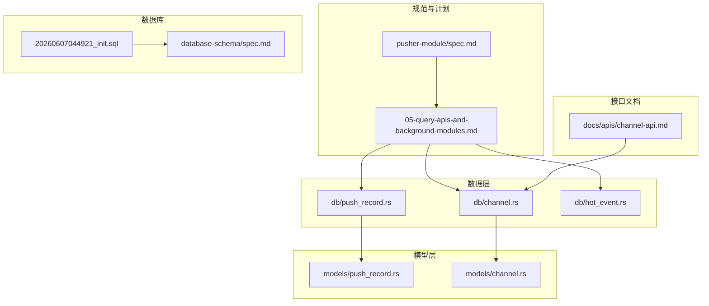
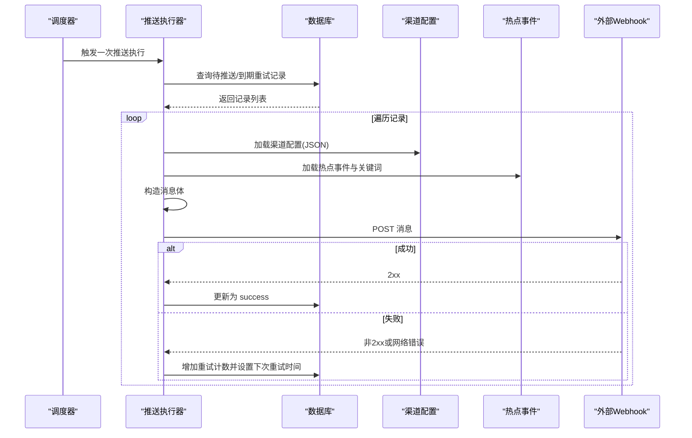
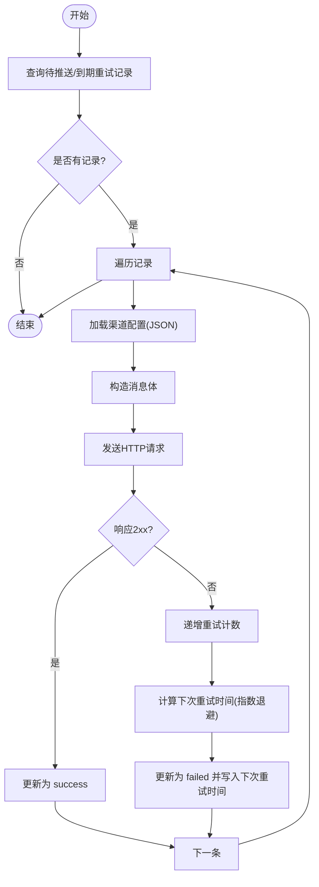
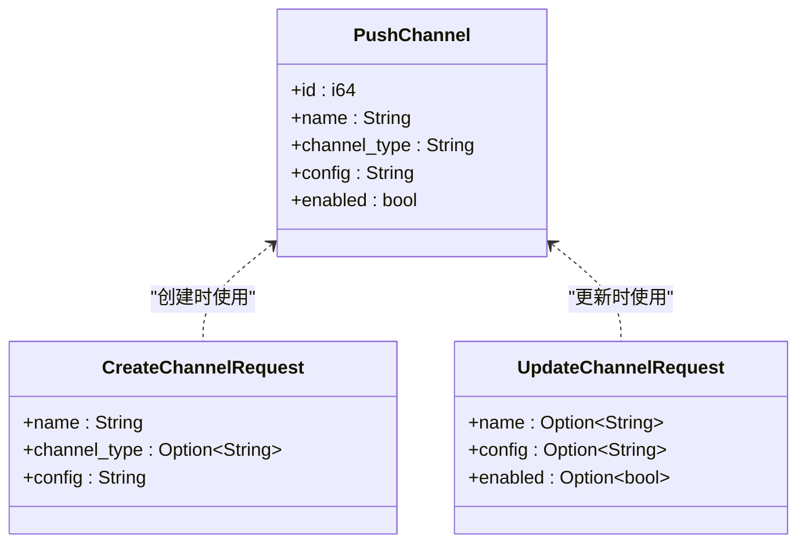
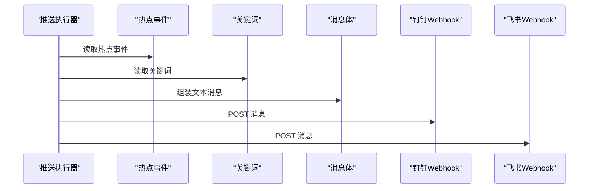
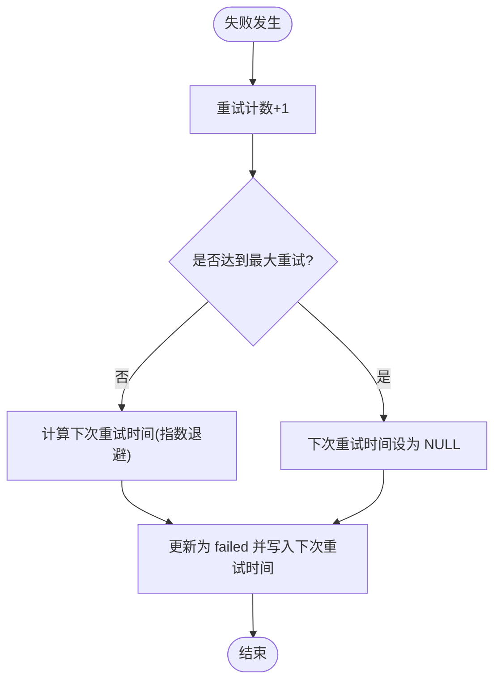
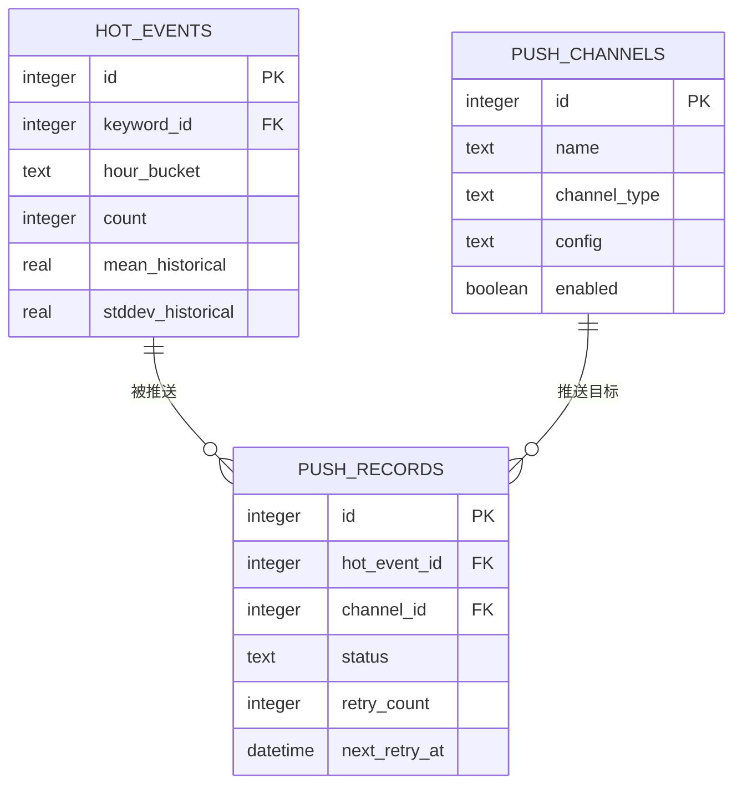

# Pusher推送模块

<cite>
**本文档引用的文件**
- [pusher-module/spec.md](file://openspec/changes/query-apis-and-background-modules/specs/pusher-module/spec.md)
- [05-query-apis-and-background-modules.md](file://docs/plans/05-query-apis-and-background-modules.md)
- [push_record.rs](file://src/db/push_record.rs)
- [channel.rs](file://src/db/channel.rs)
- [push_record.rs](file://src/models/push_record.rs)
- [channel.rs](file://src/models/channel.rs)
- [hot_event.rs](file://src/db/hot_event.rs)
- [20260607044921_init.sql](file://docs/migrations/20260607044921_init.sql)
- [channel-api.md](file://docs/apis/channel-api.md)
- [spec.md](file://openspec/specs/database-schema/spec.md)
</cite>

## 目录
1. [简介](#简介)
2. [项目结构](#项目结构)
3. [核心组件](#核心组件)
4. [架构总览](#架构总览)
5. [详细组件分析](#详细组件分析)
6. [依赖关系分析](#依赖关系分析)
7. [性能考虑](#性能考虑)
8. [故障排查指南](#故障排查指南)
9. [结论](#结论)
10. [附录](#附录)

## 简介
本文件系统性梳理并解释 Pusher 推送模块的完整实现，涵盖以下方面：
- Webhook 推送的完整流程：从待推送记录查询、渠道解析、消息构造到发送与结果处理
- 推送队列管理、并发控制与批量处理机制
- 重试机制设计：指数退避、最大重试次数、超时与失败回调
- 推送记录管理系统：历史追踪、状态标记与清理策略
- 企业通讯工具集成：钉钉、飞书等的 API 适配与消息格式转换
- 配置管理、URL 校验、认证方式与安全策略
- 扩展与最佳实践：新增推送渠道、自定义模板、扩展规则、性能监控与故障恢复

## 项目结构
Pusher 相关代码主要分布在以下位置：
- 规范与计划：openspec/changes/query-apis-and-background-modules/specs/pusher-module/spec.md、docs/plans/05-query-apis-and-background-modules.md
- 数据层：src/db/push_record.rs、src/db/channel.rs、src/db/hot_event.rs
- 模型层：src/models/push_record.rs、src/models/channel.rs
- 数据库迁移：docs/migrations/20260607044921_init.sql
- API 文档：docs/apis/channel-api.md
- 数据库规范：openspec/specs/database-schema/spec.md

**图表来源**
- [pusher-module/spec.md:47-94](file://openspec/changes/query-apis-and-background-modules/specs/pusher-module/spec.md#L47-L94)
- [05-query-apis-and-background-modules.md:753-909](file://docs/plans/05-query-apis-and-background-modules.md#L753-L909)
- [push_record.rs:1-125](file://src/db/push_record.rs#L1-L125)
- [channel.rs:1-93](file://src/db/channel.rs#L1-L93)
- [hot_event.rs:1-54](file://src/db/hot_event.rs#L1-L54)
- [20260607044921_init.sql:118-145](file://docs/migrations/20260607044921_init.sql#L118-L145)
- [spec.md:156-173](file://openspec/specs/database-schema/spec.md#L156-L173)
- [channel-api.md:1-122](file://docs/apis/channel-api.md#L1-L122)

**章节来源**
- [pusher-module/spec.md:47-94](file://openspec/changes/query-apis-and-background-modules/specs/pusher-module/spec.md#L47-L94)
- [05-query-apis-and-background-modules.md:753-909](file://docs/plans/05-query-apis-and-background-modules.md#L753-L909)
- [push_record.rs:1-125](file://src/db/push_record.rs#L1-L125)
- [channel.rs:1-93](file://src/db/channel.rs#L1-L93)
- [hot_event.rs:1-54](file://src/db/hot_event.rs#L1-L54)
- [20260607044921_init.sql:118-145](file://docs/migrations/20260607044921_init.sql#L118-L145)
- [channel-api.md:1-122](file://docs/apis/channel-api.md#L1-L122)
- [spec.md:156-173](file://openspec/specs/database-schema/spec.md#L156-L173)

## 核心组件
- 推送记录模型与数据库操作
  - PushRecord：包含推送记录的标识、关联热点事件与渠道、状态、重试计数与下次重试时间等字段
  - push_record.rs 提供插入、批量插入、查询待推送与到期重试记录、乐观更新等方法
- 渠道模型与数据库操作
  - PushChannel：包含渠道名称、类型、JSON 配置与启用状态
  - channel.rs 提供创建、列出、按条件筛选、更新与删除等操作
- 热点事件模型与数据库操作
  - HotEvent：包含关键词、小时桶、计数与历史均值/标准差等
  - hot_event.rs 提供插入、查询最近与按关键词查询等
- 推送执行器
  - run_pusher_once：单次推送执行，负责查询待处理记录、解析渠道配置、构造消息、发送并处理结果
  - start_pusher_loop：基于定时器的后台循环调度
  - handle_push_failure：统一处理失败场景，计算下一次重试时间并更新记录

**章节来源**
- [push_record.rs:1-125](file://src/db/push_record.rs#L1-L125)
- [push_record.rs:1-15](file://src/models/push_record.rs#L1-L15)
- [channel.rs:1-93](file://src/db/channel.rs#L1-L93)
- [channel.rs:1-25](file://src/models/channel.rs#L1-L25)
- [hot_event.rs:1-54](file://src/db/hot_event.rs#L1-L54)
- [05-query-apis-and-background-modules.md:753-909](file://docs/plans/05-query-apis-and-background-modules.md#L753-L909)

## 架构总览
Pusher 的整体工作流如下：
- 当热点事件产生时，系统为每个启用渠道生成一条推送记录（状态为 pending）
- 后台循环定期扫描待推送与到期重试记录
- 对每条记录加载对应渠道配置，构造消息体，通过 HTTP POST 发送到目标 webhook
- 根据响应状态与网络错误进行分类处理：成功则标记 success；失败则递增重试计数并按指数退避设置下次重试时间
- 使用乐观锁避免并发重复推送

**图表来源**
- [05-query-apis-and-background-modules.md:753-909](file://docs/plans/05-query-apis-and-background-modules.md#L753-L909)
- [pusher-module/spec.md:47-94](file://openspec/changes/query-apis-and-background-modules/specs/pusher-module/spec.md#L47-L94)
- [push_record.rs:45-125](file://src/db/push_record.rs#L45-L125)
- [channel.rs:1-93](file://src/db/channel.rs#L1-L93)
- [hot_event.rs:1-54](file://src/db/hot_event.rs#L1-L54)

## 详细组件分析

### 推送记录管理
- 记录状态与生命周期
  - pending：初始状态，等待推送
  - success：推送成功
  - failed：推送失败，支持指数退避重试
- 重试策略
  - 指数退避：next_retry_at = now + retry_count × retry_base_seconds
  - 最大重试次数：由配置决定，达到上限后不再重试
- 并发控制
  - 采用乐观锁：仅当当前状态与期望状态一致时才更新，避免并发重复推送
- 查询与索引
  - 通过 status 字段建立索引，提升查询效率
  - 支持查询 pending 与到期重试记录，按时间排序

**图表来源**
- [05-query-apis-and-background-modules.md:753-909](file://docs/plans/05-query-apis-and-background-modules.md#L753-L909)
- [pusher-module/spec.md:62-88](file://openspec/changes/query-apis-and-background-modules/specs/pusher-module/spec.md#L62-L88)
- [push_record.rs:45-125](file://src/db/push_record.rs#L45-L125)

**章节来源**
- [push_record.rs:1-125](file://src/db/push_record.rs#L1-L125)
- [spec.md:156-173](file://openspec/specs/database-schema/spec.md#L156-L173)
- [pusher-module/spec.md:62-94](file://openspec/changes/query-apis-and-background-modules/specs/pusher-module/spec.md#L62-L94)

### 渠道与配置管理
- 渠道类型与配置
  - channel_type：支持 webhook、feishu 等类型
  - config：以 JSON 字符串存储，常见字段为 url
- CRUD API
  - 列表、创建、更新、删除接口均需 Bearer Token 认证
  - 创建时可指定 channel_type，默认为 webhook
- URL 校验与安全
  - 推送前检查配置中的 url 是否存在
  - 若缺失，直接标记失败并记录日志

**图表来源**
- [channel.rs:1-25](file://src/models/channel.rs#L1-L25)
- [channel.rs:1-93](file://src/db/channel.rs#L1-L93)
- [channel-api.md:1-122](file://docs/apis/channel-api.md#L1-L122)

**章节来源**
- [channel.rs:1-93](file://src/db/channel.rs#L1-L93)
- [channel.rs:1-25](file://src/models/channel.rs#L1-L25)
- [channel-api.md:1-122](file://docs/apis/channel-api.md#L1-L122)
- [pusher-module/spec.md:57-61](file://openspec/changes/query-apis-and-background-modules/specs/pusher-module/spec.md#L57-L61)

### 消息构造与企业通讯工具集成
- 消息构造
  - 从热点事件与关键词中提取关键字与计数，拼装文本消息
  - 示例消息体包含 msgtype 与 text.content 字段
- 钉钉与飞书集成
  - 两者均通过 webhook URL 接收消息
  - 在 config.url 中配置对应的机器人地址
  - 可根据需要扩展消息格式（例如富文本、卡片等），但当前实现为基础文本消息

**图表来源**
- [05-query-apis-and-background-modules.md:753-909](file://docs/plans/05-query-apis-and-background-modules.md#L753-L909)

**章节来源**
- [05-query-apis-and-background-modules.md:753-909](file://docs/plans/05-query-apis-and-background-modules.md#L753-L909)
- [channel-api.md:1-122](file://docs/apis/channel-api.md#L1-L122)

### 重试机制与失败处理
- 指数退避
  - next_retry_at = now + retry_count × retry_base_seconds
  - 第一次重试：延迟 retry_base_seconds 秒
  - 第二次重试：延迟 2×retry_base_seconds 秒
- 最大重试次数
  - 达到配置上限后不再重试，next_retry_at 设为 NULL
- 失败回调
  - 非 2xx 响应与网络错误均视为失败，统一进入失败处理逻辑

**图表来源**
- [05-query-apis-and-background-modules.md:870-894](file://docs/plans/05-query-apis-and-background-modules.md#L870-L894)
- [pusher-module/spec.md:62-88](file://openspec/changes/query-apis-and-background-modules/specs/pusher-module/spec.md#L62-L88)

**章节来源**
- [05-query-apis-and-background-modules.md:870-894](file://docs/plans/05-query-apis-and-background-modules.md#L870-L894)
- [pusher-module/spec.md:62-88](file://openspec/changes/query-apis-and-background-modules/specs/pusher-module/spec.md#L62-L88)

### 并发控制与批量处理
- 并发控制
  - 乐观锁更新：仅当当前状态与期望状态一致时才更新，避免重复推送
- 批量处理
  - 单次执行会批量处理所有待处理与到期重试记录，减少数据库往返
- 调度策略
  - 基于定时器的循环调度，周期由配置决定

**章节来源**
- [push_record.rs:90-113](file://src/db/push_record.rs#L90-L113)
- [05-query-apis-and-background-modules.md:896-909](file://docs/plans/05-query-apis-and-background-modules.md#L896-L909)

### 推送配置管理、URL 校验与安全策略
- 配置管理
  - 渠道配置以 JSON 字符串存储，支持扩展字段
  - 默认类型为 webhook，可通过 channel_type 指定其他类型
- URL 校验
  - 推送前校验配置中的 url 字段是否存在
  - 缺失时直接标记失败并记录错误日志
- 安全策略
  - 所有渠道 API 均需 Bearer Token 认证
  - 建议在生产环境为 webhook 地址启用 HTTPS，并限制访问来源

**章节来源**
- [channel.rs:1-93](file://src/db/channel.rs#L1-L93)
- [channel-api.md:1-122](file://docs/apis/channel-api.md#L1-L122)
- [pusher-module/spec.md:57-61](file://openspec/changes/query-apis-and-background-modules/specs/pusher-module/spec.md#L57-L61)

### 具体代码示例路径
- 新增推送渠道
  - 创建渠道：POST /api/v1/channels
  - 更新渠道：POST /api/v1/channels/{id}/update
  - 删除渠道：POST /api/v1/channels/{id}/delete
  - 参考：[channel-api.md:60-122](file://docs/apis/channel-api.md#L60-L122)
- 自定义消息模板
  - 修改消息构造逻辑：参考 [05-query-apis-and-background-modules.md:814-825](file://docs/plans/05-query-apis-and-background-modules.md#L814-L825)
- 扩展推送规则
  - 在 run_pusher_once 中增加条件判断与消息体扩展：参考 [05-query-apis-and-background-modules.md:765-868](file://docs/plans/05-query-apis-and-background-modules.md#L765-L868)

**章节来源**
- [channel-api.md:60-122](file://docs/apis/channel-api.md#L60-L122)
- [05-query-apis-and-background-modules.md:765-868](file://docs/plans/05-query-apis-and-background-modules.md#L765-L868)

## 依赖关系分析
- 数据模型依赖
  - PushRecord 依赖 HotEvent 与 PushChannel
  - HotEvent 依赖 Keyword
- 数据库依赖
  - push_records 表通过外键关联 hot_events 与 push_channels
  - 通过 status 字段建立索引，优化查询
- 外部依赖
  - HTTP 客户端用于向 webhook 发送消息
  - 日志库用于记录成功/警告/错误信息

**图表来源**
- [20260607044921_init.sql:118-145](file://docs/migrations/20260607044921_init.sql#L118-L145)
- [spec.md:156-173](file://openspec/specs/database-schema/spec.md#L156-L173)

**章节来源**
- [20260607044921_init.sql:118-145](file://docs/migrations/20260607044921_init.sql#L118-L145)
- [spec.md:156-173](file://openspec/specs/database-schema/spec.md#L156-L173)

## 性能考虑
- 查询优化
  - 为 push_records.status 建立索引，提升按状态查询效率
- 批量处理
  - 单次执行批量处理多条记录，减少数据库往返
- 并发控制
  - 乐观锁避免重复推送，降低竞争开销
- 调度间隔
  - 合理设置循环间隔，避免过于频繁的轮询造成资源浪费

[本节为通用建议，无需特定文件引用]

## 故障排查指南
- 常见问题
  - 渠道无 webhook URL：推送直接标记失败并记录错误日志
  - 非 2xx 响应：计入失败并按指数退避重试
  - 网络错误：计入失败并按指数退避重试
  - 并发重复推送：乐观锁导致部分记录跳过，属于预期行为
- 排查步骤
  - 检查 push_records 表中对应记录的状态与重试计数
  - 核对 push_channels 中的 config.url 是否正确
  - 查看日志中关于成功/警告/错误的输出
  - 确认数据库索引是否生效

**章节来源**
- [pusher-module/spec.md:47-94](file://openspec/changes/query-apis-and-background-modules/specs/pusher-module/spec.md#L47-L94)
- [05-query-apis-and-background-modules.md:832-864](file://docs/plans/05-query-apis-and-background-modules.md#L832-L864)
- [push_record.rs:90-113](file://src/db/push_record.rs#L90-L113)

## 结论
Pusher 推送模块通过清晰的记录状态机、指数退避重试与乐观锁并发控制，实现了稳定可靠的 Webhook 推送能力。结合灵活的渠道配置与 API，能够快速适配钉钉、飞书等企业通讯工具。建议在生产环境中配合完善的监控与告警体系，持续优化调度间隔与消息模板，确保高可用与高性能。

[本节为总结性内容，无需特定文件引用]

## 附录
- API 参考
  - 列出渠道：GET /api/v1/channels
  - 创建渠道：POST /api/v1/channels
  - 更新渠道：POST /api/v1/channels/{id}/update
  - 删除渠道：POST /api/v1/channels/{id}/delete
  - 参考：[channel-api.md:1-122](file://docs/apis/channel-api.md#L1-L122)
- 数据库初始化
  - 初始化脚本包含 push_channels 与 push_records 表定义及索引
  - 参考：[20260607044921_init.sql:118-145](file://docs/migrations/20260607044921_init.sql#L118-L145)

**章节来源**
- [channel-api.md:1-122](file://docs/apis/channel-api.md#L1-L122)
- [20260607044921_init.sql:118-145](file://docs/migrations/20260607044921_init.sql#L118-L145)