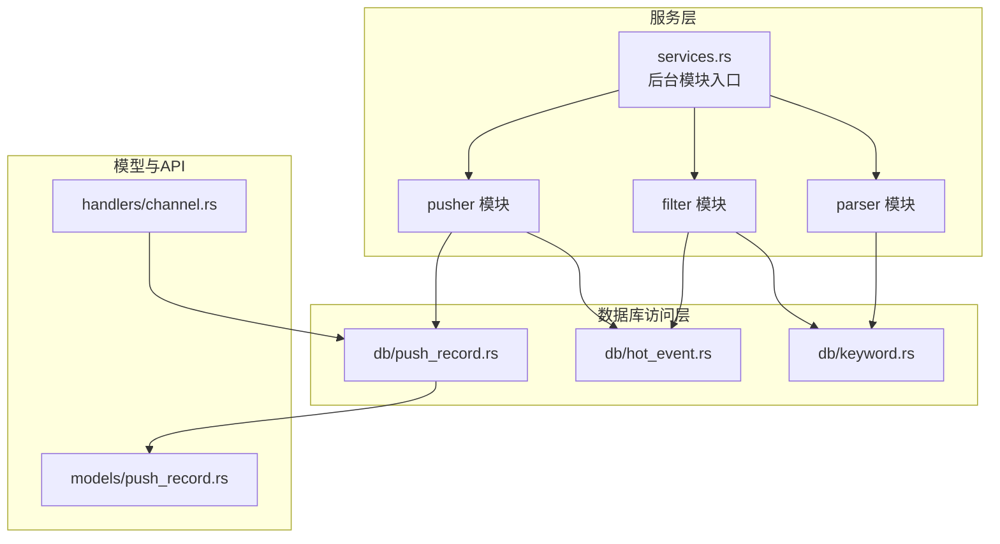
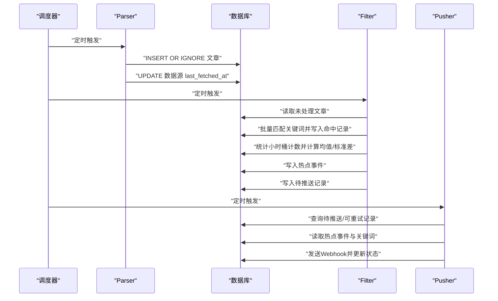
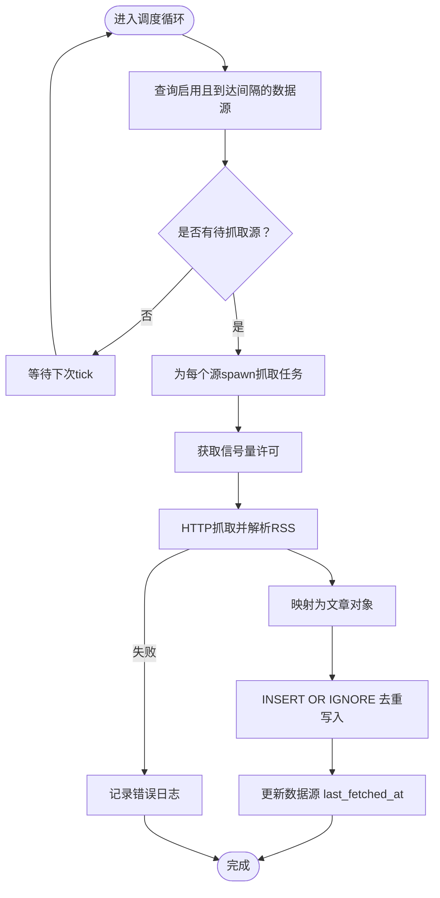
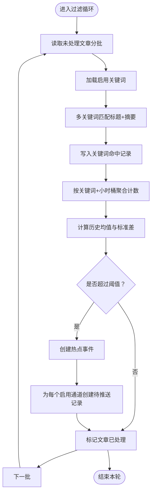
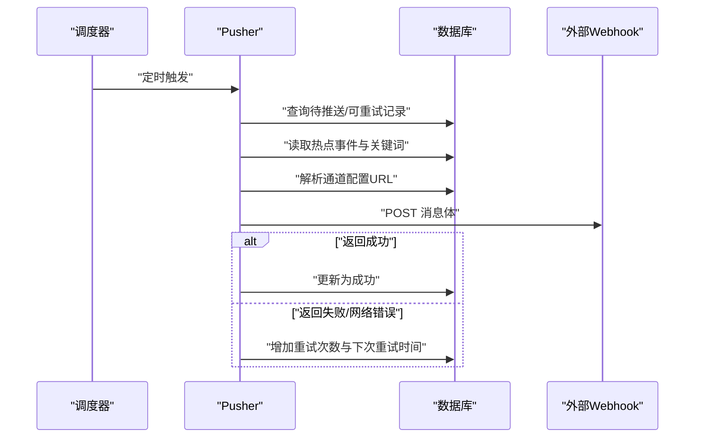
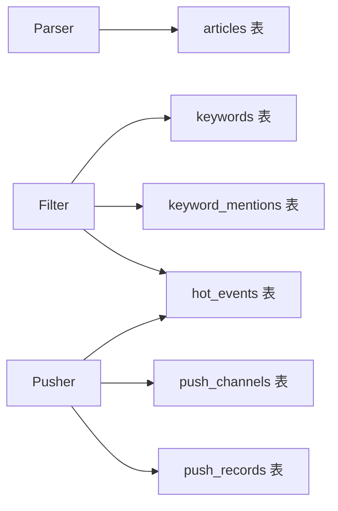

# 核心模块

<cite>
**本文引用的文件**
- [05-query-apis-and-background-modules.md](file://docs/plans/05-query-apis-and-background-modules.md)
- [database-schema/spec.md](file://openspec/specs/database-schema/spec.md)
- [database-schema/spec.md（归档版）](file://openspec/changes/archive/2026-06-07-db-migrations-and-models/specs/database-schema/spec.md)
- [services.rs](file://src/services.rs)
- [hot_event.rs](file://src/db/hot_event.rs)
- [keyword.rs](file://src/db/keyword.rs)
- [push_record.rs](file://src/db/push_record.rs)
- [push_record 模型](file://src/models/push_record.rs)
- [channel.rs](file://src/handlers/channel.rs)
</cite>

## 目录
1. [简介](#简介)
2. [项目结构](#项目结构)
3. [核心组件](#核心组件)
4. [架构总览](#架构总览)
5. [详细组件分析](#详细组件分析)
6. [依赖关系分析](#依赖关系分析)
7. [性能考量](#性能考量)
8. [故障排查指南](#故障排查指南)
9. [结论](#结论)
10. [附录](#附录)

## 简介
本文件面向AI趋势监控系统的核心后台模块，围绕以下三部分展开：
- Parser模块：负责RSS内容采集、解析与去重入库，维持稳定的抓取节奏与并发控制。
- Filter模块：基于关键词自动匹配与统计方法进行“突发检测”，生成热点事件并驱动后续推送。
- Pusher模块：按通道配置发送Webhook推送，并实现带指数退避的重试机制。

文档将从运行周期、数据处理流程、性能优化策略、模块间协调与错误处理等方面进行深入说明，并给出可操作的配置参数、监控指标与扩展建议。

## 项目结构
后端服务采用模块化组织，后台模块入口位于服务层，数据库模型与查询封装在db子模块，API路由与处理器在handlers子模块，配置与计划文档在docs与openspec目录。

图示来源
- [services.rs:1-5](file://src/services.rs#L1-L5)
- [05-query-apis-and-background-modules.md:913-959](file://docs/plans/05-query-apis-and-background-modules.md#L913-L959)
- [hot_event.rs:62-80](file://src/db/hot_event.rs#L62-L80)
- [keyword.rs:1-47](file://src/db/keyword.rs#L1-L47)
- [push_record.rs:41-125](file://src/db/push_record.rs#L41-L125)
- [push_record 模型:1-15](file://src/models/push_record.rs#L1-L15)
- [channel.rs:1-32](file://src/handlers/channel.rs#L1-L32)

章节来源
- [services.rs:1-5](file://src/services.rs#L1-L5)
- [05-query-apis-and-background-modules.md:913-959](file://docs/plans/05-query-apis-and-background-modules.md#L913-L959)

## 核心组件
- Parser模块：定时扫描启用的数据源，限制并发，抓取RSS并插入去重后的文章，更新抓取时间戳。
- Filter模块：批量处理未处理文章，使用关键词匹配与统计方法检测突发，生成热点事件并创建待推送记录。
- Pusher模块：轮询待推送与可重试记录，按通道类型发送Webhook，实现指数退避重试与状态更新。

章节来源
- [05-query-apis-and-background-modules.md:357-503](file://docs/plans/05-query-apis-and-background-modules.md#L357-L503)
- [05-query-apis-and-background-modules.md:507-742](file://docs/plans/05-query-apis-and-background-modules.md#L507-L742)
- [05-query-apis-and-background-modules.md:753-909](file://docs/plans/05-query-apis-and-background-modules.md#L753-L909)

## 架构总览
整体工作流如下：Parser抓取文章并去重入库；Filter对未处理文章进行关键词匹配与突发检测，生成热点事件；Pusher根据热点事件与通道配置进行Webhook推送并维护重试状态。

图示来源
- [05-query-apis-and-background-modules.md:429-502](file://docs/plans/05-query-apis-and-background-modules.md#L429-L502)
- [05-query-apis-and-background-modules.md:507-742](file://docs/plans/05-query-apis-and-background-modules.md#L507-L742)
- [05-query-apis-and-background-modules.md:753-909](file://docs/plans/05-query-apis-and-background-modules.md#L753-L909)

## 详细组件分析

### Parser模块
- 运行周期：固定间隔扫描启用的数据源，若距离上次抓取时间已达到设定间隔则触发抓取。
- 并发控制：使用信号量限制最大并发抓取数量，避免对上游RSS源造成过大压力。
- 数据处理流程：
  - 查询启用且到达抓取间隔的数据源；
  - 异步并发抓取，解析RSS条目为文章对象；
  - 使用“插入或忽略”策略写入文章表，依据链接唯一性去重；
  - 成功后更新该数据源的最后抓取时间。
- 性能优化策略：
  - 限流并发，避免资源争用；
  - 使用HTTP客户端超时与用户代理配置；
  - 数据库索引覆盖抓取时间与来源字段，加速筛选。
- 错误处理：
  - 抓取失败时记录错误日志，不影响其他数据源；
  - 未处理异常通过tokio任务传播，确保主循环持续运行。

图示来源
- [05-query-apis-and-background-modules.md:429-502](file://docs/plans/05-query-apis-and-background-modules.md#L429-L502)

章节来源
- [05-query-apis-and-background-modules.md:357-503](file://docs/plans/05-query-apis-and-background-modules.md#L357-L503)

### Filter模块
- 运行周期：固定间隔扫描未处理文章，按批次处理以控制内存占用。
- 匹配与统计：
  - 加载启用的关键词；
  - 使用多关键词自动机对标题与摘要进行高效匹配；
  - 记录命中明细到关键词命中表；
  - 按关键词+小时桶聚合计数；
  - 基于历史N小时计数计算均值与标准差，判定是否为热点事件。
- 热点检测规则：
  - 当前小时计数大于“历史均值 + 标准差×倍数”且不低于最小阈值时，视为热点。
- 推送触发：
  - 为每个热点事件与启用的推送通道生成一条待推送记录，状态初始为“待推送”。

图示来源
- [05-query-apis-and-background-modules.md:507-742](file://docs/plans/05-query-apis-and-background-modules.md#L507-L742)
- [hot_event.rs:62-80](file://src/db/hot_event.rs#L62-L80)
- [keyword.rs:21-35](file://src/db/keyword.rs#L21-L35)

章节来源
- [05-query-apis-and-background-modules.md:507-742](file://docs/plans/05-query-apis-and-background-modules.md#L507-L742)
- [hot_event.rs:62-80](file://src/db/hot_event.rs#L62-L80)
- [keyword.rs:21-35](file://src/db/keyword.rs#L21-L35)

### Pusher模块
- 运行周期：固定间隔扫描待推送与可重试记录。
- 推送逻辑：
  - 查询状态为“待推送”或满足重试条件的记录；
  - 读取通道配置（当前仅支持Webhook），构造消息体；
  - 发送HTTP请求，成功则标记为“成功”，失败则进入重试流程。
- 重试机制：
  - 失败时增加重试次数与下次重试时间；
  - 采用线性递增的延迟（重试次数×基础秒数），超过最大重试次数则放弃。
- 状态管理：
  - 使用乐观锁更新状态，避免竞态；
  - 支持查询待推送与可重试记录，便于运维与监控。

图示来源
- [05-query-apis-and-background-modules.md:753-909](file://docs/plans/05-query-apis-and-background-modules.md#L753-L909)
- [push_record.rs:41-125](file://src/db/push_record.rs#L41-L125)
- [push_record 模型:1-15](file://src/models/push_record.rs#L1-L15)

章节来源
- [05-query-apis-and-background-modules.md:753-909](file://docs/plans/05-query-apis-and-background-modules.md#L753-L909)
- [push_record.rs:41-125](file://src/db/push_record.rs#L41-L125)
- [push_record 模型:1-15](file://src/models/push_record.rs#L1-L15)

## 依赖关系分析
- 模块耦合：
  - Parser仅依赖数据源配置与数据库写入；
  - Filter依赖关键词、文章与热点事件表，输出热点事件与推送记录；
  - Pusher依赖热点事件、关键词与推送记录表，输出外部Webhook。
- 数据一致性：
  - 文章表通过链接唯一约束实现去重；
  - 关键词命中表与热点事件表分别承载匹配与统计结果；
  - 推送记录表承载推送状态与重试控制。
- 外部依赖：
  - HTTP客户端用于RSS抓取与Webhook发送；
  - SQLite作为本地存储，配合索引提升查询效率。

图示来源
- [database-schema/spec.md（归档版）:61-148](file://openspec/changes/archive/2026-06-07-db-migrations-and-models/specs/database-schema/spec.md#L61-L148)
- [database-schema/spec.md:94-129](file://openspec/specs/database-schema/spec.md#L94-L129)

章节来源
- [database-schema/spec.md（归档版）:61-148](file://openspec/changes/archive/2026-06-07-db-migrations-and-models/specs/database-schema/spec.md#L61-L148)
- [database-schema/spec.md:94-129](file://openspec/specs/database-schema/spec.md#L94-L129)

## 性能考量
- 并发与限流
  - Parser使用信号量限制并发抓取，避免对上游与本地资源造成压力。
  - Filter按批次处理未处理文章，降低内存峰值。
- 数据库优化
  - 文章表建立按来源、抓取时间与处理状态的索引，加速筛选与去重。
  - 热点事件与关键词命中表按关键词与小时桶建立索引，加速统计与查询。
- I/O与网络
  - Parser与Pusher均配置HTTP超时与用户代理，提升稳定性。
  - Pusher采用指数退避重试，避免频繁重试对下游造成冲击。
- 可观测性
  - 各模块在关键节点记录日志，便于追踪与排障。

## 故障排查指南
- Parser常见问题
  - RSS抓取失败：检查网络连通性、目标站点可用性与超时配置；查看错误日志定位具体源。
  - 并发过高导致限流：适当降低最大并发或提高抓取间隔。
- Filter常见问题
  - 匹配不生效：确认关键词大小写敏感设置与启用状态；检查文章是否被正确标记为已处理。
  - 热点检测不触发：调整标准差倍数与最小计数阈值；核对历史小时桶数据是否正常。
- Pusher常见问题
  - Webhook失败：检查通道配置中的URL是否有效；查看返回状态码与重试次数；确认最大重试次数设置。
  - 状态不更新：确认乐观锁更新逻辑与数据库事务一致性。

章节来源
- [05-query-apis-and-background-modules.md:429-502](file://docs/plans/05-query-apis-and-background-modules.md#L429-L502)
- [05-query-apis-and-background-modules.md:753-909](file://docs/plans/05-query-apis-and-background-modules.md#L753-L909)
- [push_record.rs:91-113](file://src/db/push_record.rs#L91-L113)

## 结论
本系统通过Parser、Filter与Pusher三大模块形成完整的“采集—检测—推送”闭环。模块职责清晰、边界明确，配合数据库索引与合理的并发控制，能够在保证稳定性的同时实现高吞吐的数据处理。建议在生产环境中结合业务需求调优并发与阈值参数，并完善监控与告警体系以保障长期稳定运行。

## 附录

### 配置参数说明（节选）
- Parser配置
  - 最大并发抓取数：限制同时进行的抓取任务数量。
  - 默认超时秒数：HTTP请求超时时间。
  - 默认用户代理：HTTP请求头中的UA字符串。
- Filter配置
  - 过滤器轮询间隔（秒）：每次扫描未处理文章的时间间隔。
  - 历史小时数：用于计算均值与标准差的历史窗口长度。
  - 批处理大小：单次处理的未处理文章数量上限。
- Pusher配置
  - 推送轮询间隔（秒）：每次扫描待推送/可重试记录的时间间隔。
  - 最大重试次数：失败后允许的最大重试次数。
  - 基础重试秒数：每次重试的延迟增量（线性递增）。

章节来源
- [05-query-apis-and-background-modules.md:429-502](file://docs/plans/05-query-apis-and-background-modules.md#L429-L502)
- [05-query-apis-and-background-modules.md:507-742](file://docs/plans/05-query-apis-and-background-modules.md#L507-L742)
- [05-query-apis-and-background-modules.md:753-909](file://docs/plans/05-query-apis-and-background-modules.md#L753-L909)

### 监控指标建议
- Parser
  - 抓取成功率、平均耗时、并发数、新增文章数。
- Filter
  - 匹配命中数、热点事件数、处理批次数、平均处理耗时。
- Pusher
  - 推送成功/失败数、重试次数分布、平均响应时间。

### 数据模型要点
- 文章表：按链接唯一，支持按来源与抓取时间筛选。
- 关键词表：支持大小写敏感、标准差倍数与最小计数等敏感度参数。
- 热点事件表：按关键词与小时桶统计，支持历史窗口查询。
- 推送记录表：承载状态、重试次数与下次重试时间，支持乐观锁更新。

章节来源
- [database-schema/spec.md（归档版）:61-148](file://openspec/changes/archive/2026-06-07-db-migrations-and-models/specs/database-schema/spec.md#L61-L148)
- [hot_event.rs:62-80](file://src/db/hot_event.rs#L62-L80)
- [keyword.rs:1-47](file://src/db/keyword.rs#L1-L47)
- [push_record.rs:41-125](file://src/db/push_record.rs#L41-L125)

### 扩展与定制建议
- 新增数据源：在数据源表中添加新源，设置抓取间隔与启用状态，Parser会自动纳入扫描。
- 新增关键词：在关键词表中添加新词，调整敏感度参数以适配业务场景。
- 新增推送通道：通过API创建新的推送通道，配置通道类型与参数，Pusher会自动使用。
- 自定义检测算法：可在Filter模块中替换或扩展统计方法，如引入滑动窗口或更复杂的异常检测模型。
- 自定义推送协议：在Pusher模块中扩展通道类型与消息格式，以适配更多通知平台。

章节来源
- [channel.rs:1-32](file://src/handlers/channel.rs#L1-L32)
- [05-query-apis-and-background-modules.md:753-909](file://docs/plans/05-query-apis-and-background-modules.md#L753-L909)