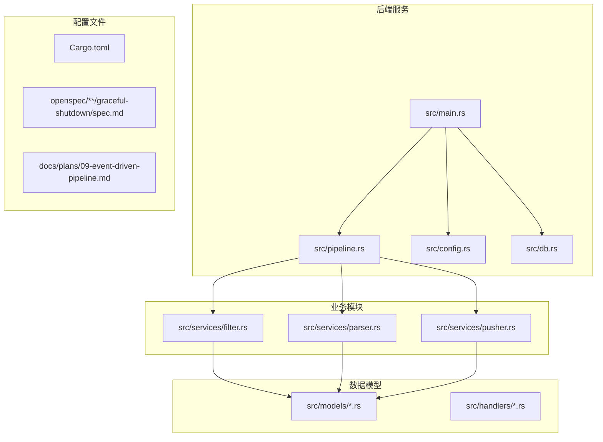
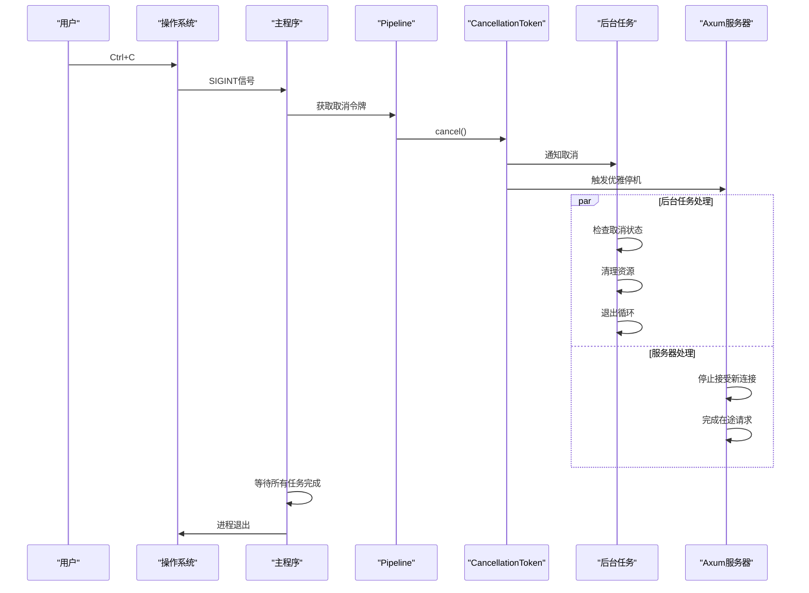
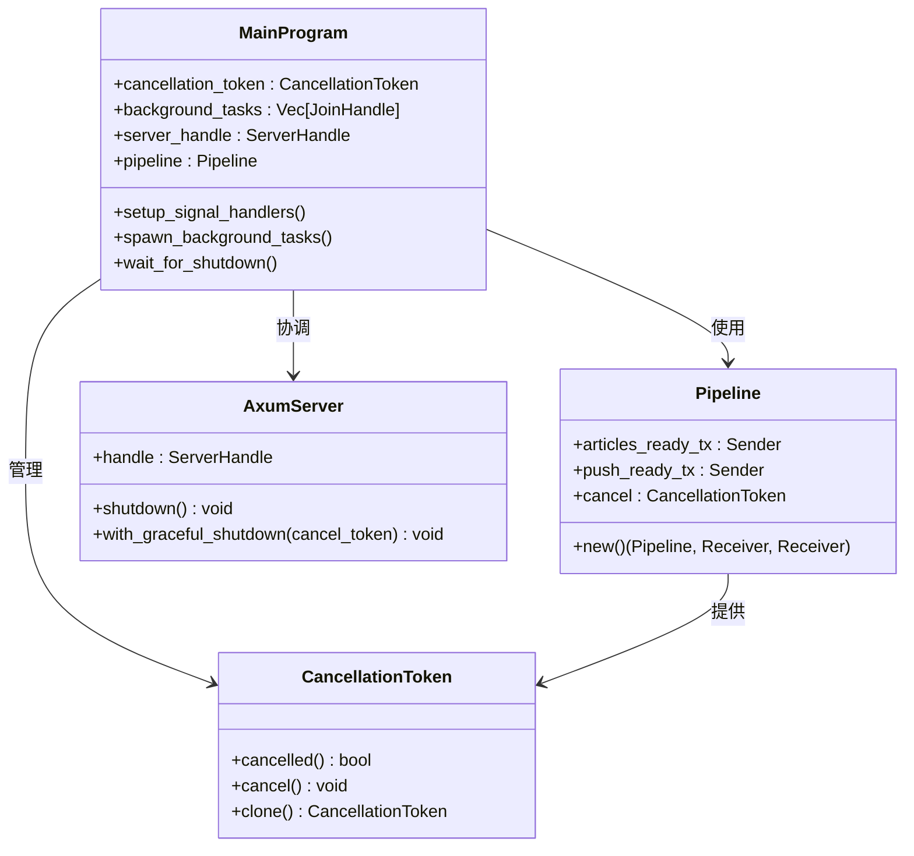
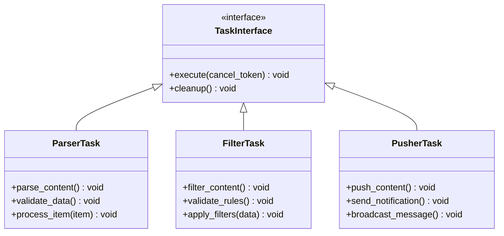
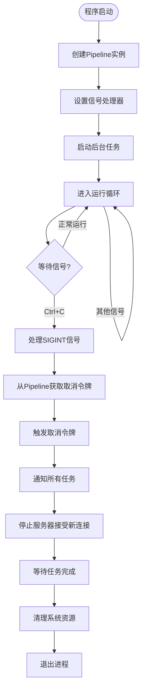
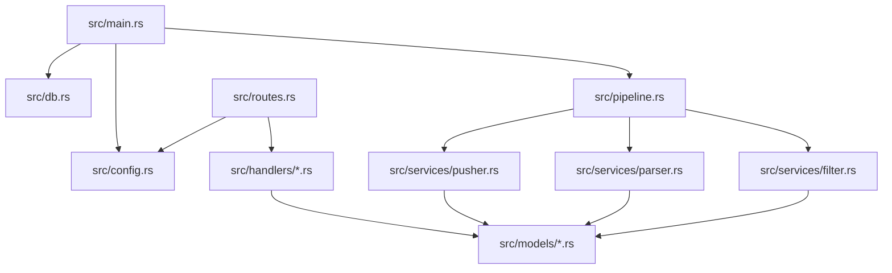

# 优雅停机机制

<cite>
**本文档引用的文件**
- [main.rs](file://src/main.rs)
- [pipeline.rs](file://src/pipeline.rs)
- [Cargo.toml](file://Cargo.toml)
- [spec.md](file://openspec/specs/graceful-shutdown/spec.md)
- [09-event-driven-pipeline.md](file://docs/plans/09-event-driven-pipeline.md)
</cite>

## 更新摘要
**所做更改**
- 更新了应用生命周期管理部分，反映新的 Pipeline 架构
- 新增了后台任务句柄捕获和等待机制的详细说明
- 完善了优雅停机处理的技术实现细节
- 增强了应用生命周期管理的架构描述

## 目录
1. [引言](#引言)
2. [项目结构](#项目结构)
3. [核心组件](#核心组件)
4. [架构概览](#架构概览)
5. [详细组件分析](#详细组件分析)
6. [依赖关系分析](#依赖关系分析)
7. [性能考虑](#性能考虑)
8. [故障排除指南](#故障排除指南)
9. [结论](#结论)

## 引言

本项目实现了基于 CancellationToken 的优雅停机机制，确保在接收到 Ctrl+C 信号时能够安全地关闭所有后台任务和服务器连接。该机制通过 tokio_util::sync::CancellationToken 协调各个组件的有序关闭，保证系统资源得到正确释放。

**更新** 本机制现已集成到全新的事件驱动管道架构中，通过 Pipeline 结构统一管理所有后台任务的生命周期和优雅停机流程。

## 项目结构

该项目采用 Rust 语言开发，主要包含以下关键目录和文件：



**图表来源**
- [main.rs:1-129](file://src/main.rs#L1-L129)
- [pipeline.rs:1-45](file://src/pipeline.rs#L1-L45)

**章节来源**
- [main.rs:1-129](file://src/main.rs#L1-L129)
- [Cargo.toml:1-73](file://Cargo.toml#L1-L73)

## 核心组件

### Pipeline 架构管理

系统采用新的 Pipeline 架构统一管理应用生命周期：

- **Pipeline 结构**: 包含事件通道和取消令牌的轻量级结构体
- **事件驱动**: 通过 mpsc::channel 实现 Parser → Filter → Pusher 的事件传递
- **统一管理**: 所有后台任务通过 Pipeline 共享取消令牌进行协调

### CancellationToken 实现

系统使用 tokio_util::sync::CancellationToken 来协调优雅停机过程：

- **信号处理**: 监听 Ctrl+C (SIGINT) 信号
- **任务协调**: 通知所有后台任务停止执行
- **服务器关闭**: 通过 with_graceful_shutdown 停止接受新连接
- **资源清理**: 等待所有任务完成后再退出进程

### 后台任务管理

三个核心后台任务（Parser、Filter、Pusher）都支持取消操作，并通过 Pipeline 统一管理：

- **Parser**: 负责解析数据源内容
- **Filter**: 执行内容过滤和验证
- **Pusher**: 处理推送和分发逻辑

每个任务都会定期检查取消状态并在检测到取消信号时优雅退出。

**章节来源**
- [spec.md:1-35](file://openspec/specs/graceful-shutdown/spec.md#L1-L35)
- [09-event-driven-pipeline.md:1-47](file://docs/plans/09-event-driven-pipeline.md#L1-L47)

## 架构概览



**图表来源**
- [spec.md:13-35](file://openspec/specs/graceful-shutdown/spec.md#L13-L35)

## 详细组件分析

### 主程序组件分析

主程序负责协调整个优雅停机流程，现在通过 Pipeline 统一管理：



**图表来源**
- [main.rs:55-129](file://src/main.rs#L55-L129)
- [pipeline.rs:12-44](file://src/pipeline.rs#L12-L44)

### 后台任务组件分析

三个核心后台任务都实现了统一的取消接口，并通过 Pipeline 共享资源：



**图表来源**
- [pipeline.rs:12-44](file://src/pipeline.rs#L12-L44)

### 信号处理流程



**图表来源**
- [spec.md:13-35](file://openspec/specs/graceful-shutdown/spec.md#L13-L35)

**章节来源**
- [main.rs:55-129](file://src/main.rs#L55-L129)
- [pipeline.rs:12-44](file://src/pipeline.rs#L12-L44)

## 依赖关系分析

### 外部依赖

项目的主要外部依赖包括：

```mermaid
graph LR
subgraph "Tokio生态系统"
Tokio[tokio 1.x]
TokioUtil[tokio-util 0.x]
Axum[axum 0.x]
Mpsc[tokio::sync::mpsc]
End
subgraph "数据库相关"
Sqlx[sqlx 0.x]
Deadpool[deadpool-sqlx 0.x]
end
subgraph "配置管理"
Config[config 0.x]
Toml[toml 0.x]
end
Main --> Tokio
Main --> TokioUtil
Main --> Axum
Main --> Mpsc
Main --> Sqlx
Main --> Deadpool
Main --> Config
Main --> Toml
```

**图表来源**
- [Cargo.toml:6-52](file://Cargo.toml#L6-L52)

### 内部模块依赖



**图表来源**
- [main.rs:55-129](file://src/main.rs#L55-L129)
- [pipeline.rs:12-44](file://src/pipeline.rs#L12-L44)

**章节来源**
- [Cargo.toml:6-52](file://Cargo.toml#L6-L52)

## 性能考虑

### 取消响应时间

- **信号延迟**: 从接收到 SIGINT 到实际开始取消的时间
- **任务检查频率**: 后台任务检查取消状态的频率
- **资源清理成本**: 各种资源清理操作的性能影响

### 内存管理

- **任务状态**: 避免在取消过程中创建大量临时对象
- **数据库连接**: 确保连接池中的连接得到正确释放
- **缓冲区管理**: 及时清理任务间的通信缓冲区

## 故障排除指南

### 常见问题及解决方案

1. **任务无法正常停止**
   - 检查任务是否正确检查取消状态
   - 确认没有阻塞操作阻止取消检查
   - 验证取消令牌的传播链路

2. **服务器无法优雅关闭**
   - 检查 with_graceful_shutdown 的实现
   - 确认在途请求的处理逻辑
   - 验证关闭超时设置

3. **资源泄漏问题**
   - 检查数据库连接的正确关闭
   - 确认文件句柄的及时释放
   - 验证网络连接的优雅断开

4. **Pipeline 事件丢失**
   - 检查 mpsc 通道的容量设置
   - 确认事件处理的及时性
   - 验证通道关闭的正确时机

**章节来源**
- [spec.md:13-35](file://openspec/specs/graceful-shutdown/spec.md#L13-L35)

## 结论

本项目的优雅停机机制通过 CancellationToken 提供了可靠的进程管理能力。该实现确保了：

- **一致性**: 所有组件都能响应取消信号
- **安全性**: 资源得到正确清理，避免数据丢失
- **可预测性**: 关闭过程是可预期和可控的
- **可靠性**: 即使在复杂的工作负载下也能正常关闭

通过标准化的取消接口和统一的信号处理机制，系统能够在各种情况下提供可靠的优雅停机行为，为生产环境部署提供了重要的保障。

**更新** 新的 Pipeline 架构进一步增强了系统的可维护性和扩展性，为未来的功能增强奠定了坚实的基础。