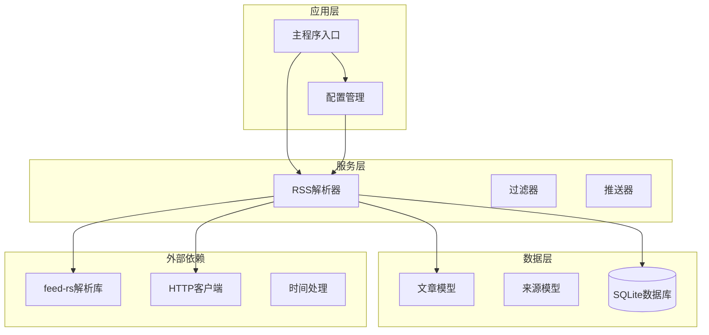
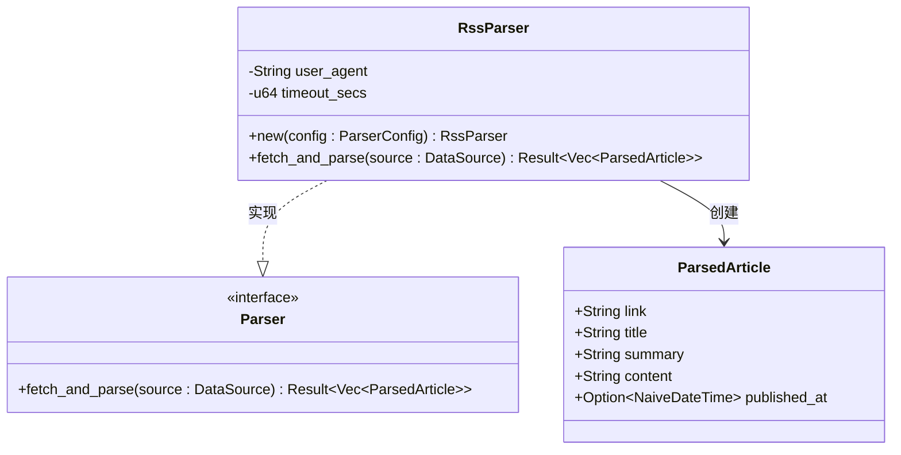
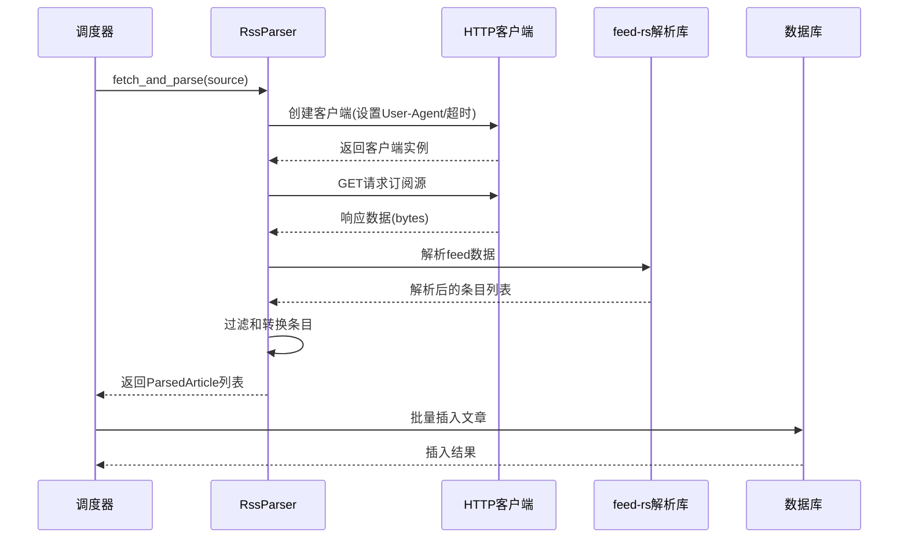
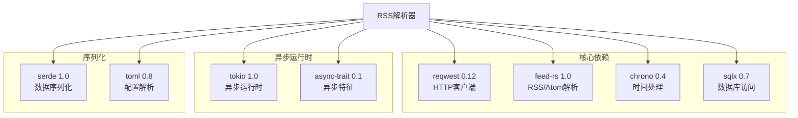
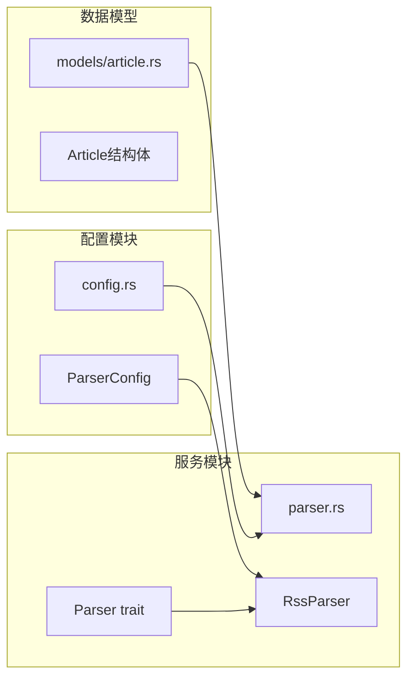

# RSS解析器实现

<cite>
**本文档引用的文件**
- [src/services/parser.rs](file://src/services/parser.rs)
- [src/models/article.rs](file://src/models/article.rs)
- [src/config.rs](file://src/config.rs)
- [Cargo.toml](file://Cargo.toml)
</cite>

## 目录
1. [简介](#简介)
2. [项目结构](#项目结构)
3. [核心组件](#核心组件)
4. [架构概览](#架构概览)
5. [详细组件分析](#详细组件分析)
6. [依赖关系分析](#依赖关系分析)
7. [性能考虑](#性能考虑)
8. [故障排除指南](#故障排除指南)
9. [结论](#结论)

## 简介

本文档详细介绍了AI趋势监控系统中的RSS解析器实现。该解析器采用异步设计，支持RSS和Atom格式的订阅源解析，具备并发控制、错误处理和数据持久化功能。系统通过feed-rs库进行格式解析，使用reqwest进行HTTP请求，结合Tokio异步运行时实现高效的并发抓取。

## 项目结构

RSS解析器位于服务层，与配置管理、数据模型和数据库操作紧密集成：



**图表来源**
- [src/services/parser.rs:1-185](file://src/services/parser.rs#L1-L185)
- [src/config.rs:1-58](file://src/config.rs#L1-L58)

**章节来源**
- [src/services/parser.rs:1-185](file://src/services/parser.rs#L1-L185)
- [src/config.rs:1-58](file://src/config.rs#L1-L58)

## 核心组件

### RssParser结构体

RssParser是RSS/Atom解析器的核心实现，负责从各种订阅源中提取文章信息：



**图表来源**
- [src/services/parser.rs:32-88](file://src/services/parser.rs#L32-L88)
- [src/services/parser.rs:11-19](file://src/services/parser.rs#L11-L19)

### ParsedArticle数据结构

ParsedArticle表示从RSS/Atom源解析出的文章对象，包含完整的内容信息：

| 字段名 | 类型 | 描述 | 时间戳处理 |
|--------|------|------|------------|
| link | String | 文章链接URL | 无 |
| title | String | 文章标题 | 无 |
| summary | String | 摘要内容 | 无 |
| content | String | 完整内容 | 无 |
| published_at | Option<NaiveDateTime> | 发布时间 | 转换为UTC时区 |

**章节来源**
- [src/services/parser.rs:11-19](file://src/services/parser.rs#L11-L19)

## 架构概览

RSS解析器采用分层架构设计，实现了高内聚低耦合的模块化结构：



**图表来源**
- [src/services/parser.rs:48-88](file://src/services/parser.rs#L48-L88)
- [src/services/parser.rs:94-184](file://src/services/parser.rs#L94-L184)

## 详细组件分析

### HTTP客户端配置

RssParser在初始化时会根据配置创建HTTP客户端，包含以下关键设置：

```mermaid
flowchart TD
Start([创建HTTP客户端]) --> Build[使用reqwest::Client::builder()]
Build --> UA[设置User-Agent: config.default_user_agent]
Build --> Timeout[设置超时: config.default_timeout_seconds秒]
Build --> Create[构建客户端实例]
Create --> Ready[客户端就绪]
Ready --> Request[发送HTTP请求]
Request --> Response[获取响应数据]
Response --> Parse[使用feed-rs解析]
Parse --> Articles[生成ParsedArticle列表]
```

**图表来源**
- [src/services/parser.rs:53-56](file://src/services/parser.rs#L53-L56)
- [src/config.rs:30-34](file://src/config.rs#L30-L34)

### fetch_and_parse方法工作流程

该方法实现了完整的RSS/Atom解析流程：

#### 步骤1：HTTP请求处理
- 使用配置的User-Agent标识客户端
- 设置超时时间防止长时间阻塞
- 发送GET请求获取订阅源内容

#### 步骤2：Feed解析
- 使用feed-rs库解析原始字节数据
- 支持RSS 2.0、Atom 1.0等多种格式
- 提取所有条目(entries)进行处理

#### 步骤3：数据转换
- 链接：使用第一条链接作为文章链接
- 标题：提取标题内容，为空时使用空字符串
- 摘要：提取摘要内容，为空时使用空字符串
- 内容：提取正文内容，为空时使用空字符串
- 时间：优先使用published时间，否则使用updated时间

#### 步骤4：时间戳处理逻辑

```mermaid
flowchart TD
Input[输入: feed-rs条目] --> Extract[提取时间字段]
Extract --> CheckPublished{存在published?}
CheckPublished --> |是| UsePublished[使用published时间]
CheckPublished --> |否| CheckUpdated{存在updated?}
CheckUpdated --> |是| UseUpdated[使用updated时间]
CheckUpdated --> |否| NoTime[返回None]
UsePublished --> Convert1[转换为UTC时间]
UseUpdated --> Convert2[转换为UTC时间]
Convert1 --> ToNaive1[转换为NaiveDateTime]
Convert2 --> ToNaive2[转换为NaiveDateTime]
ToNaive1 --> Output[输出: Some(NaiveDateTime)]
ToNaive2 --> Output
NoTime --> Output2[输出: None]
```

**图表来源**
- [src/services/parser.rs:70-74](file://src/services/parser.rs#L70-L74)

**章节来源**
- [src/services/parser.rs:48-88](file://src/services/parser.rs#L48-L88)

### 并发控制机制

系统采用信号量模式实现并发限制：

```mermaid
sequenceDiagram
participant Loop as 解析循环
participant Semaphore as 信号量
participant Task as 并发任务
participant Parser as 解析器实例
Loop->>Loop : 每30秒检查待处理源
Loop->>Semaphore : 请求并发许可
Semaphore-->>Loop : 获得许可
Loop->>Task : 启动并发抓取任务
Task->>Parser : fetch_and_parse()
Parser-->>Task : 返回解析结果
Task->>Semaphore : 释放许可
Task-->>Loop : 任务完成
```

**图表来源**
- [src/services/parser.rs:94-184](file://src/services/parser.rs#L94-L184)

**章节来源**
- [src/services/parser.rs:94-184](file://src/services/parser.rs#L94-L184)

### 错误处理策略

系统实现了多层次的错误处理机制：

1. **网络层错误**：HTTP请求失败、超时等
2. **解析层错误**：feed-rs解析失败、格式不支持
3. **数据库层错误**：插入失败、连接问题
4. **业务层错误**：重复数据、数据验证失败

错误处理遵循"记录日志但不中断整体流程"的原则，确保系统的稳定性。

**章节来源**
- [src/services/parser.rs:101-107](file://src/services/parser.rs#L101-L107)
- [src/services/parser.rs:143-149](file://src/services/parser.rs#L143-L149)
- [src/services/parser.rs:170-179](file://src/services/parser.rs#L170-L179)

## 依赖关系分析

### 外部依赖库

系统依赖以下关键库实现核心功能：



**图表来源**
- [Cargo.toml:29-46](file://Cargo.toml#L29-L46)

### 内部模块依赖



**图表来源**
- [src/config.rs:29-34](file://src/config.rs#L29-L34)
- [src/services/parser.rs:32-45](file://src/services/parser.rs#L32-L45)
- [src/models/article.rs:5-16](file://src/models/article.rs#L5-L16)

**章节来源**
- [Cargo.toml:1-67](file://Cargo.toml#L1-L67)
- [src/config.rs:1-58](file://src/config.rs#L1-L58)

## 性能考虑

### 并发优化

系统通过以下方式实现高性能并发：

1. **信号量控制**：限制最大并发请求数量，避免过度消耗系统资源
2. **批量处理**：每30秒批量处理到期的订阅源
3. **异步I/O**：使用Tokio异步运行时提高并发效率
4. **连接复用**：HTTP客户端自动复用连接减少建立开销

### 内存管理

- 使用迭代器链式处理避免中间缓冲区
- 及时释放解析后的数据结构
- 控制单次处理的条目数量

### 缓存策略

- 利用HTTP缓存头减少不必要的请求
- 数据库层面的去重避免重复存储
- 适当的超时设置平衡实时性和性能

## 故障排除指南

### 常见问题及解决方案

#### 1. HTTP请求失败
**症状**：日志显示"failed to fetch source"错误
**原因**：网络连接问题、目标服务器不可达、防火墙阻拦
**解决**：
- 检查网络连接和代理设置
- 验证订阅源URL的有效性
- 调整超时时间和User-Agent配置

#### 2. 解析失败
**症状**：feed-rs解析报错
**原因**：订阅源格式不符合标准、编码问题
**解决**：
- 验证订阅源格式兼容性
- 检查字符编码设置
- 更新feed-rs到最新版本

#### 3. 数据库写入失败
**症状**：日志显示"failed to insert article"错误
**原因**：数据库连接问题、约束冲突、磁盘空间不足
**解决**：
- 检查数据库连接状态
- 验证数据完整性约束
- 清理磁盘空间

#### 4. 并发性能问题
**症状**：CPU使用率过高、内存占用过大
**原因**：并发数设置不当、单个订阅源条目过多
**解决**：
- 调整max_concurrent_fetches配置
- 实施更严格的条目过滤规则
- 增加系统资源或优化查询

**章节来源**
- [src/services/parser.rs:101-107](file://src/services/parser.rs#L101-L107)
- [src/services/parser.rs:143-149](file://src/services/parser.rs#L143-L149)
- [src/services/parser.rs:170-179](file://src/services/parser.rs#L170-L179)

## 结论

RSS解析器实现展现了现代异步系统的设计理念，通过合理的架构分层、完善的错误处理和高效的并发控制，实现了稳定可靠的订阅源解析功能。系统的关键优势包括：

1. **模块化设计**：清晰的职责分离便于维护和扩展
2. **异步并发**：充分利用Tokio异步运行时提升性能
3. **健壮性**：多层次错误处理确保系统稳定性
4. **可配置性**：灵活的配置选项适应不同部署环境

未来可以考虑的改进方向包括：增加更多的订阅源格式支持、实施更智能的缓存策略、提供更详细的性能监控指标等。