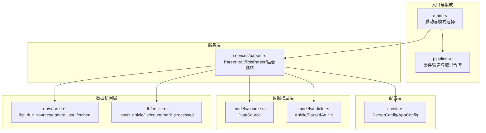
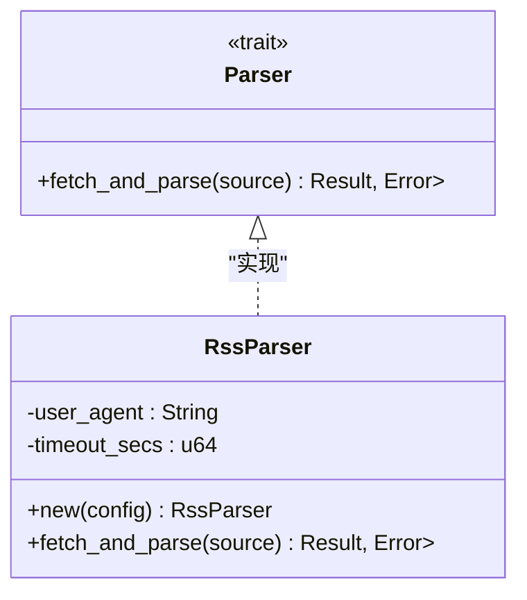
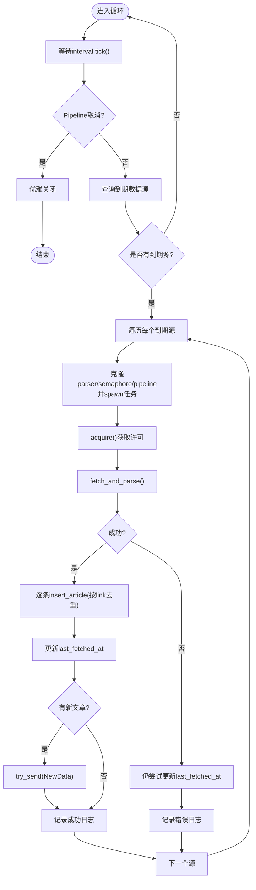
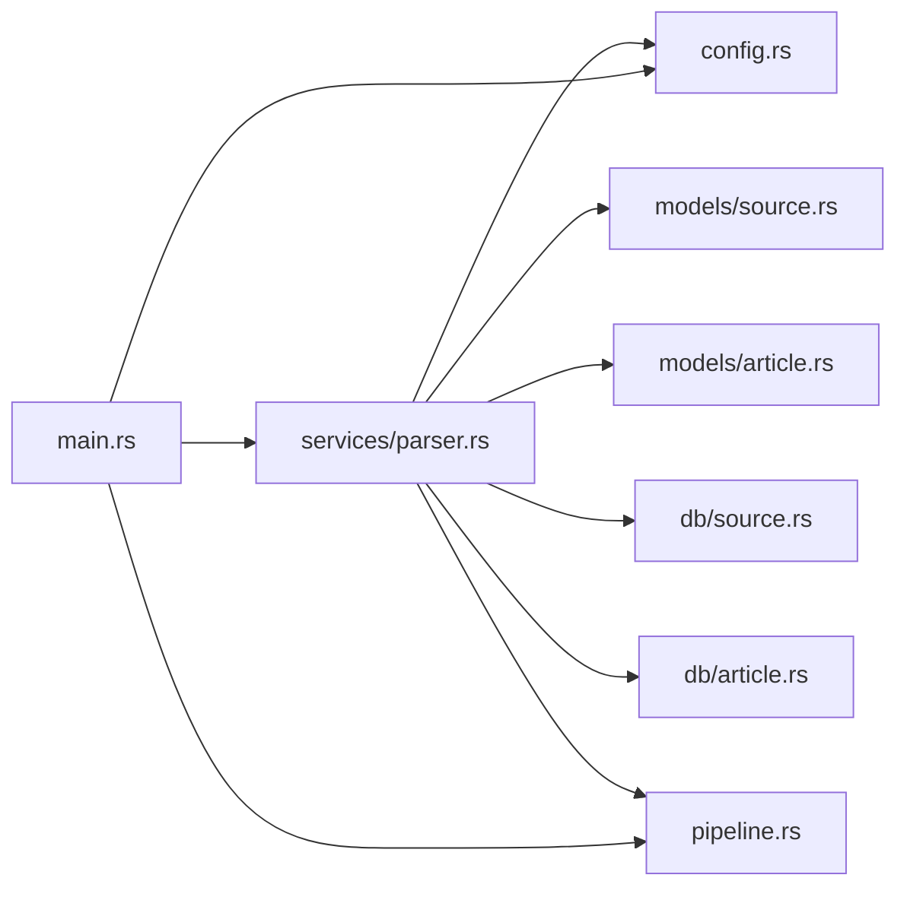

# 内容采集模块（Parser）

<cite>
**本文引用的文件**
- [src/services/parser.rs](file://src/services/parser.rs)
- [src/config.rs](file://src/config.rs)
- [src/models/article.rs](file://src/models/article.rs)
- [src/models/source.rs](file://src/models/source.rs)
- [src/db/source.rs](file://src/db/source.rs)
- [src/db/article.rs](file://src/db/article.rs)
- [src/main.rs](file://src/main.rs)
- [src/pipeline.rs](file://src/pipeline.rs)
- [Cargo.toml](file://Cargo.toml)
- [openspec/specs/parser-module/spec.md](file://openspec/specs/parser-module/spec.md)
- [docs/plans/05-query-apis-and-background-modules.md](file://docs/plans/05-query-apis-and-background-modules.md)
</cite>

## 目录
1. [简介](#简介)
2. [项目结构](#项目结构)
3. [核心组件](#核心组件)
4. [架构总览](#架构总览)
5. [组件详解](#组件详解)
6. [依赖关系分析](#依赖关系分析)
7. [性能与并发特性](#性能与并发特性)
8. [故障排除指南](#故障排除指南)
9. [结论](#结论)
10. [附录：配置参数与使用模式](#附录配置参数与使用模式)

## 简介
本技术文档聚焦于"内容采集模块（Parser）"，系统性阐述RSS/Atom内容采集机制、feed-rs库的使用方式、HTTP请求配置与超时处理策略；深入解析RssParser实现类的设计（User-Agent设置、请求头配置、错误处理）、Parser trait的可扩展性设计以及多线程并发控制机制；重点说明后台采集循环的调度算法（基于tokio::time::interval的可配置轮询、信号量并发限制、资源管理）；解释ParsedArticle数据结构的设计与字段含义；并提供配置参数说明、性能优化建议与故障排除指南，辅以代码片段路径与使用模式。

## 项目结构
Parser模块位于后端服务层，围绕以下关键文件组织：
- 服务层：负责后台调度、HTTP请求、RSS解析与入库
- 配置层：定义ParserConfig等运行参数
- 数据模型层：定义DataSource、Article等数据结构
- 数据访问层：封装SQLite查询与更新
- 入口与集成：在主程序中启动Parser后台任务
- 事件管道：新增Pipeline参数接受和通知机制



**图表来源**
- [src/main.rs:80-108](file://src/main.rs#L80-L108)
- [src/services/parser.rs:96-199](file://src/services/parser.rs#L96-L199)
- [src/config.rs:33-40](file://src/config.rs#L33-L40)
- [src/models/source.rs:5-19](file://src/models/source.rs#L5-L19)
- [src/models/article.rs:5-16](file://src/models/article.rs#L5-L16)
- [src/db/source.rs:119-132](file://src/db/source.rs#L119-L132)
- [src/db/article.rs:6-29](file://src/db/article.rs#L6-L29)

**章节来源**
- [src/main.rs:80-108](file://src/main.rs#L80-L108)
- [src/services/parser.rs:96-199](file://src/services/parser.rs#L96-L199)
- [src/config.rs:33-40](file://src/config.rs#L33-L40)
- [src/models/source.rs:5-19](file://src/models/source.rs#L5-L19)
- [src/models/article.rs:5-16](file://src/models/article.rs#L5-L16)
- [src/db/source.rs:119-132](file://src/db/source.rs#L119-L132)
- [src/db/article.rs:6-29](file://src/db/article.rs#L6-L29)

## 核心组件
- Parser trait：抽象不同Feed类型的解析接口，支持未来扩展（如Atom、JSON Feed）。
- RssParser：基于feed-rs解析RSS/Atom，使用reqwest进行HTTP请求，支持自定义User-Agent与超时。
- ParsedArticle：从Feed条目提取的结构化文章对象，用于去重与入库。
- 后台采集循环：基于tokio::time::interval的可配置轮询，每interval_seconds秒扫描到期的数据源，通过信号量限制并发，异步抓取与入库。
- 数据模型与DAO：DataSource用于调度决策，Article用于存储与查询。
- Pipeline事件管道：新增的事件驱动机制，支持Parser到Filter的异步通知。

**章节来源**
- [src/services/parser.rs:21-88](file://src/services/parser.rs#L21-L88)
- [src/models/article.rs:5-16](file://src/models/article.rs#L5-L16)
- [src/db/source.rs:119-132](file://src/db/source.rs#L119-L132)
- [src/pipeline.rs:11-44](file://src/pipeline.rs#L11-L44)

## 架构总览
Parser模块采用"调度-解析-入库"的流水线式架构，结合Tokio异步运行时、信号量实现并发控制和事件驱动的通知机制，确保高吞吐与稳定性。

```mermaid
sequenceDiagram
participant Main as "main.rs"
participant Pipeline as "Pipeline"
participant Loop as "start_parser_loop"
participant DAO as "db : : source : : list_due_sources"
participant Parser as "RssParser : : fetch_and_parse"
participant HTTP as "reqwest Client"
participant Feed as "feed-rs parser"
participant DB as "db : : article : : insert_article"
Main->>Pipeline : 创建事件管道
Main->>Loop : 启动后台循环(带Pipeline参数)
Loop->>Loop : 每interval_seconds秒tick()
Loop->>DAO : 查询到期数据源
DAO-->>Loop : 返回待抓取列表
loop 对每个数据源
Loop->>Parser : 异步抓取与解析
Parser->>HTTP : 发送GET请求(含UA/超时)
HTTP-->>Parser : 响应字节流
Parser->>Feed : 解析RSS/Atom
Feed-->>Parser : 条目集合
Parser-->>Loop : 文章列表
loop 对每篇文章
Loop->>DB : 插入(按link去重)
DB-->>Loop : 成功或跳过
end
Loop->>DAO : 更新last_fetched_at
alt 有新文章插入
Loop->>Pipeline : try_send(NewData)
end
end
```

**图表来源**
- [src/main.rs:80-108](file://src/main.rs#L80-L108)
- [src/services/parser.rs:96-199](file://src/services/parser.rs#L96-L199)
- [src/db/source.rs:119-132](file://src/db/source.rs#L119-L132)
- [src/db/article.rs:6-29](file://src/db/article.rs#L6-L29)
- [src/pipeline.rs:11-44](file://src/pipeline.rs#L11-L44)

## 组件详解

### Parser trait 的扩展性设计
- 设计目标：通过统一的异步接口抽象不同Feed格式的解析逻辑，便于后续扩展Atom、JSON Feed等类型。
- 接口约定：fetch_and_parse接收DataSource并返回Vec<ParsedArticle>，错误通过Box<dyn Error>传播，保证跨类型一致性。
- 当前实现：RssParser实现了该trait，使用feed-rs解析RSS/Atom条目。



**图表来源**
- [src/services/parser.rs:21-88](file://src/services/parser.rs#L21-L88)

**章节来源**
- [src/services/parser.rs:21-88](file://src/services/parser.rs#L21-L88)
- [openspec/specs/parser-module/spec.md:48-61](file://openspec/specs/parser-module/spec.md#L48-L61)

### RssParser 实现类设计
- HTTP客户端构建：基于reqwest::Client::builder设置User-Agent与超时，确保对目标站点友好且稳定。
- 请求头配置：仅设置User-Agent与超时，避免不必要的头部污染；如需其他头部可在扩展中添加。
- 错误处理策略：
  - 网络请求失败：记录错误日志并跳过该数据源，不中断整体循环。
  - 解析失败：记录错误日志并跳过该数据源，不中断整体循环。
  - 入库失败：记录错误日志并继续处理下一篇文章。
- 时间戳处理：优先使用published，其次updated，转换为UTC时间存入数据库。

**章节来源**
- [src/services/parser.rs:38-88](file://src/services/parser.rs#L38-L88)
- [Cargo.toml:29-36](file://Cargo.toml#L29-L36)

### ParsedArticle 数据结构
- 字段含义：
  - link：文章链接，作为去重键。
  - title：标题。
  - summary：摘要。
  - content：正文内容。
  - published_at：发布时间（UTC），可能为空。
- 设计考量：字段覆盖RSS/Atom常见字段，便于后续过滤与展示；与Article结构保持一致字段映射。

**章节来源**
- [src/models/article.rs:5-16](file://src/models/article.rs#L5-L16)
- [src/services/parser.rs:11-19](file://src/services/parser.rs#L11-L19)

### 后台采集循环调度算法
- **更新** 调度周期：基于tokio::time::interval的可配置轮询，interval_seconds来自ParserConfig，默认30秒。
- **更新** 调度机制：使用tokio::select!监听Pipeline取消信号和interval.tick()事件，实现优雅的事件驱动轮询。
- 到期判定：last_fetched_at为空或距离上次抓取超过interval_seconds。
- 并发控制：使用Arc<Semaphore>限制最大并发抓取数，每个抓取任务在acquire()后执行。
- 资源管理：每个抓取任务克隆SqlitePool、Parser实例和Pipeline通道，避免共享可变状态；成功后更新last_fetched_at，失败也尝试更新以避免立即重试。
- **新增** 事件通知：当有新文章插入时，通过pipeline.articles_ready_tx.try_send发送NewData事件给Filter模块。
- 日志与可观测性：对查询失败、抓取失败、插入失败均记录日志；统计插入与跳过的数量。



**图表来源**
- [src/services/parser.rs:96-199](file://src/services/parser.rs#L96-L199)
- [src/db/source.rs:119-132](file://src/db/source.rs#L119-L132)
- [src/db/article.rs:6-29](file://src/db/article.rs#L6-L29)
- [src/pipeline.rs:11-44](file://src/pipeline.rs#L11-L44)

**章节来源**
- [src/services/parser.rs:96-199](file://src/services/parser.rs#L96-L199)
- [src/db/source.rs:119-132](file://src/db/source.rs#L119-L132)

### Pipeline 事件管道机制
- **新增** 事件类型：PipelineEvent枚举包含NewData事件，用于通知下游模块有新数据可用。
- **新增** 管道结构：Pipeline包含两个mpsc::Sender通道和一个CancellationToken，分别用于Parser→Filter和Filter→Pusher的消息传递。
- **新增** 通知逻辑：Parser在成功插入文章后，如果插入数量大于0，则通过try_send发送NewData事件，避免阻塞式等待。
- **新增** 取消机制：所有后台任务都监听Pipeline.cancel的取消信号，实现统一的优雅关闭。

**章节来源**
- [src/pipeline.rs:4-44](file://src/pipeline.rs#L4-L44)
- [src/services/parser.rs:173-176](file://src/services/parser.rs#L173-L176)

### 数据模型与DAO
- DataSource：驱动调度与并发控制，包含id、name、url、enabled、interval_seconds、last_fetched_at等。
- Article：存储解析后的文章，包含fetched_at、processed_at等时间戳字段。
- DAO职责：
  - list_due_sources：根据enabled与last_fetched_at+interval计算到期源。
  - insert_article：按link去重插入，返回Some则新插入，None则重复跳过。
  - update_source_last_fetched：成功后更新last_fetched_at，避免立即重试。

**章节来源**
- [src/models/source.rs:5-19](file://src/models/source.rs#L5-L19)
- [src/models/article.rs:5-16](file://src/models/article.rs#L5-L16)
- [src/db/source.rs:119-132](file://src/db/source.rs#L119-L132)
- [src/db/article.rs:6-29](file://src/db/article.rs#L6-L29)

## 依赖关系分析
- 外部库依赖：
  - feed-rs：解析RSS/Atom。
  - reqwest：HTTP客户端，支持超时与User-Agent。
  - tokio：异步运行时、信号量、interval定时器和取消令牌。
  - sqlx：SQLite ORM。
  - chrono：时间处理。
  - tracing/tracing-subscriber：日志。
- 内部模块耦合：
  - services/parser.rs依赖config.rs、models/*、db/*、pipeline.rs。
  - main.rs通过命令行模式选择启动Parser后台任务，并创建Pipeline事件管道。



**图表来源**
- [src/services/parser.rs:1-10](file://src/services/parser.rs#L1-L10)
- [src/main.rs:80-108](file://src/main.rs#L80-L108)

**章节来源**
- [Cargo.toml:29-36](file://Cargo.toml#L29-L36)
- [src/services/parser.rs:1-10](file://src/services/parser.rs#L1-L10)
- [src/main.rs:80-108](file://src/main.rs#L80-L108)

## 性能与并发特性
- 并发控制：通过Arc<Semaphore>限制最大并发抓取数，避免对上游站点造成压力与自身资源耗尽。
- **更新** 调度优化：从固定的30秒sleep循环改为基于tokio::time::interval的事件驱动轮询，更精确的时间控制和更低的CPU占用。
- **新增** 事件驱动：通过Pipeline事件机制实现模块间的异步解耦，提高系统的响应性和可扩展性。
- 去重策略：按link去重，减少重复写入与索引开销。
- 超时与User-Agent：合理设置超时与User-Agent，提升成功率与友好性。
- I/O与CPU：解析与入库为I/O密集型，Tokio并发模型适合当前场景；可考虑批量入库进一步降低SQLite调用次数。

## 故障排除指南
- 抓取失败（网络/解析错误）
  - 现象：日志出现错误信息，但循环继续。
  - 排查：检查URL可达性、User-Agent是否被屏蔽、Feed格式是否受支持。
  - 参考路径：[src/services/parser.rs:185-194](file://src/services/parser.rs#L185-L194)
- 入库失败
  - 现象：单条文章插入失败但不影响整体流程。
  - 排查：检查数据库连接、表结构、唯一约束。
  - 参考路径：[src/db/article.rs:6-29](file://src/db/article.rs#L6-L29)
- 并发过高导致限速
  - 现象：上游站点返回429/5xx或响应缓慢。
  - 处理：降低max_concurrent_fetches，增加默认超时。
  - 参考路径：[src/config.rs:33-40](file://src/config.rs#L33-L40)
- **新增** 调度未触发
  - 现象：无抓取日志。
  - 排查：确认数据源enabled=true、interval_seconds设置合理、last_fetched_at未被手动重置。
  - 参考路径：[src/db/source.rs:119-132](file://src/db/source.rs#L119-L132)
- **新增** 事件通知失败
  - 现象：Filter模块未收到新文章通知。
  - 排查：检查pipeline.articles_ready_tx通道容量、Filter侧订阅状态、try_send返回值。
  - 参考路径：[src/services/parser.rs:173-176](file://src/services/parser.rs#L173-L176)

**章节来源**
- [src/services/parser.rs:185-194](file://src/services/parser.rs#L185-L194)
- [src/db/article.rs:6-29](file://src/db/article.rs#L6-L29)
- [src/config.rs:33-40](file://src/config.rs#L33-L40)
- [src/db/source.rs:119-132](file://src/db/source.rs#L119-L132)
- [src/services/parser.rs:173-176](file://src/services/parser.rs#L173-L176)

## 结论
Parser模块通过清晰的分层设计与异步并发控制，实现了稳定高效的RSS/Atom内容采集能力。Parser trait提供了良好的扩展性，RssParser结合feed-rs与reqwest满足当前需求；后台循环通过信号量与基于tokio::time::interval的事件驱动轮询实现可控并发与资源管理。**新增的Pipeline事件管道机制**进一步提升了系统的模块解耦和响应性。建议在生产环境中根据上游站点行为与硬件资源调优并发与超时参数，并持续监控日志与数据库指标以保障稳定性。

## 附录：配置参数与使用模式

### 配置参数说明
- max_concurrent_fetches：最大并发抓取数，控制信号量许可数量。
- default_user_agent：HTTP请求的User-Agent字符串。
- default_timeout_seconds：HTTP请求超时（秒）。
- **新增** interval_seconds：后台轮询间隔（秒），默认30秒。

**参考路径**
- [src/config.rs:33-40](file://src/config.rs#L33-L40)

### 使用模式
- 启动模式：
  - all/api：同时启动Parser、Filter、Pusher后台任务，并启动HTTP服务。
  - parser：仅启动Parser后台任务。
  - filter/pusher：仅启动对应后台任务。
- 触发与调试：
  - 通过CLI参数mode选择运行模式，便于开发与排障。
- 数据源管理：
  - 创建/更新数据源时设置interval_seconds，决定抓取频率。
  - 可通过DAO重置last_fetched_at以强制立即抓取。
- **新增** 事件驱动模式：
  - Parser自动检测新文章并通过Pipeline通知Filter。
  - 支持多个下游模块通过不同的事件通道进行扩展。

**参考路径**
- [src/main.rs:80-108](file://src/main.rs#L80-L108)
- [src/db/source.rs:40-91](file://src/db/source.rs#L40-L91)
- [src/db/source.rs:109-117](file://src/db/source.rs#L109-L117)

### 性能优化建议
- 合理设置max_concurrent_fetches，避免对上游站点限速或自身资源耗尽。
- 适当提高default_timeout_seconds，增强弱网环境下的稳定性。
- **更新** 调整interval_seconds参数以平衡实时性与系统负载。
- 在入库阶段考虑批量写入（当前按条插入），减少SQLite调用次数。
- **新增** 监控Pipeline通道的背压情况，确保事件通知的及时性。
- 对热点数据源可考虑本地缓存或CDN加速（需评估成本与收益）。