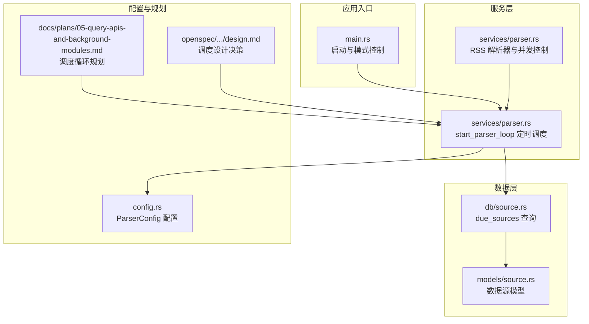
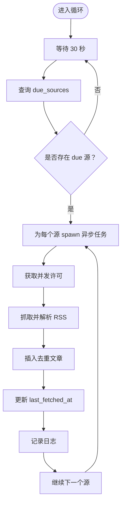
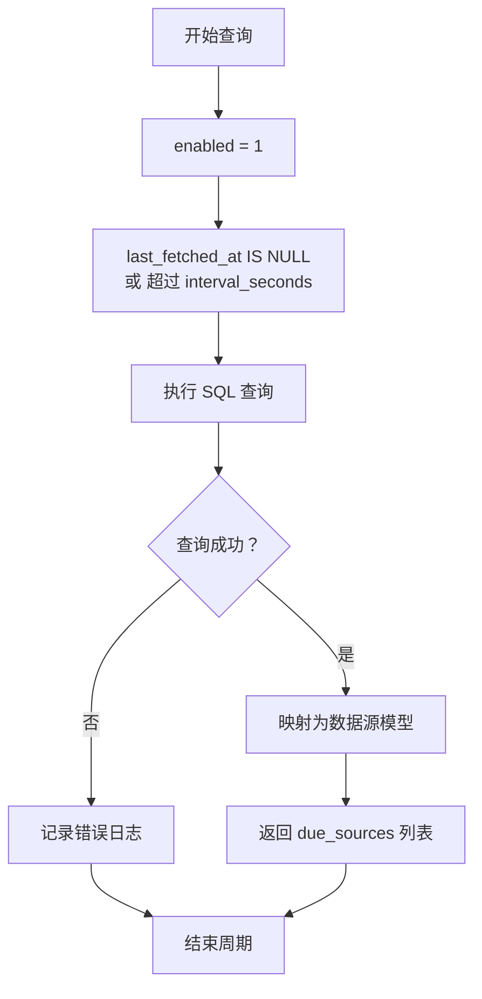
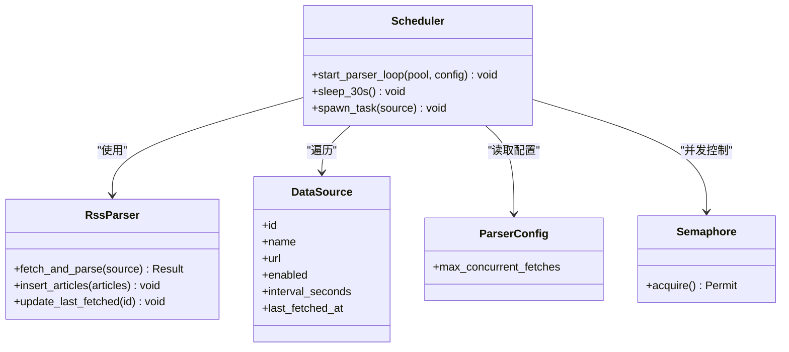
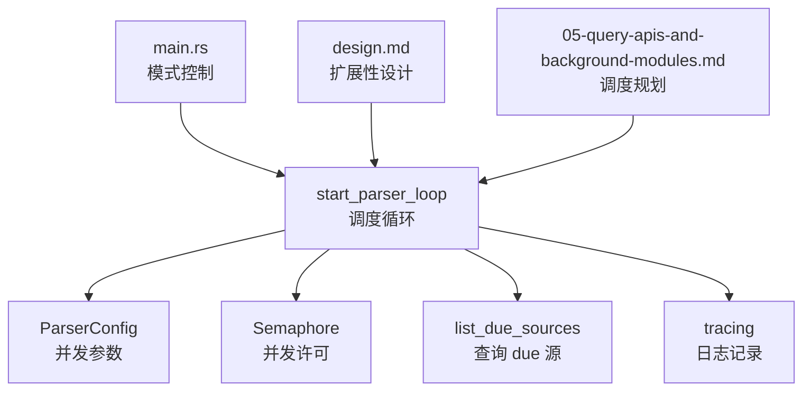

# 后台调度算法

<cite>
**本文引用的文件**
- [src/services/parser.rs](file://src/services/parser.rs)
- [src/db/source.rs](file://src/db/source.rs)
- [src/models/source.rs](file://src/models/source.rs)
- [src/config.rs](file://src/config.rs)
- [src/main.rs](file://src/main.rs)
- [docs/plans/05-query-apis-and-background-modules.md](file://docs/plans/05-query-apis-and-background-modules.md)
- [openspec/changes/archive/2026-06-07-query-apis-and-background-modules/design.md](file://openspec/changes/archive/2026-06-07-query-apis-and-background-modules/design.md)
</cite>

## 目录
1. [简介](#简介)
2. [项目结构](#项目结构)
3. [核心组件](#核心组件)
4. [架构总览](#架构总览)
5. [详细组件分析](#详细组件分析)
6. [依赖关系分析](#依赖关系分析)
7. [性能考量](#性能考量)
8. [故障排查指南](#故障排查指南)
9. [结论](#结论)
10. [附录](#附录)

## 简介
本文件围绕后台调度算法进行系统化技术文档编制，重点解析 start_parser_loop 函数的实现逻辑，涵盖定时任务调度、源列表查询、并发任务管理等关键环节；并结合 due_sources 查询逻辑与数据库交互模式，给出调度参数配置、性能监控与故障诊断的实用指南。

## 项目结构
本项目采用模块化组织方式，后台调度位于服务层（services），数据访问位于数据库层（db），模型定义在 models 层，入口在 main.rs 中启动调度循环。设计文档与规划文档提供了调度循环的高层设计与实现要点。



图表来源
- [src/main.rs](file://src/main.rs)
- [src/services/parser.rs](file://src/services/parser.rs)
- [src/db/source.rs](file://src/db/source.rs)
- [src/models/source.rs](file://src/models/source.rs)
- [src/config.rs](file://src/config.rs)
- [docs/plans/05-query-apis-and-background-modules.md](file://docs/plans/05-query-apis-and-background-modules.md)
- [openspec/changes/archive/2026-06-07-query-apis-and-background-modules/design.md](file://openspec/changes/archive/2026-06-07-query-apis-and-background-modules/design.md)

章节来源
- [src/main.rs](file://src/main.rs)
- [src/services/parser.rs](file://src/services/parser.rs)
- [src/db/source.rs](file://src/db/source.rs)
- [src/models/source.rs](file://src/models/source.rs)
- [src/config.rs](file://src/config.rs)
- [docs/plans/05-query-apis-and-background-modules.md](file://docs/plans/05-query-apis-and-background-modules.md)
- [openspec/changes/archive/2026-06-07-query-apis-and-background-modules/design.md](file://openspec/changes/archive/2026-06-07-query-apis-and-background-modules/design.md)

## 核心组件
- 定时调度与并发控制：通过 tokio 的 sleep 与信号量实现 30 秒周期调度与最大并发限制。
- 源列表查询：基于 SQLite 的 due_sources 查询，筛选已启用且到达抓取间隔的数据源。
- 并发任务执行：对每个 due 源异步抓取与解析，插入去重后的文章，并更新最后抓取时间。
- 错误处理与日志：失败时记录错误日志，成功时记录新增文章数量，保证调度循环继续运行。
- 配置驱动：ParserConfig 提供 max_concurrent_fetches 等参数，影响并发度与资源占用。

章节来源
- [src/services/parser.rs](file://src/services/parser.rs)
- [src/db/source.rs](file://src/db/source.rs)
- [src/config.rs](file://src/config.rs)

## 架构总览
下图展示调度循环从入口到数据库查询、并发执行与状态更新的整体流程。

```mermaid
sequenceDiagram
participant Main as "main.rs"
participant Loop as "start_parser_loop"
participant DB as "db : : source : : list_due_sources"
participant Tokio as "Tokio Runtime"
participant Parser as "RSS 解析器"
participant SQL as "SQLite"
Main->>Loop : 启动调度循环
Loop->>Loop : 等待 30 秒
Loop->>DB : 查询 due_sources
DB-->>Loop : 返回待抓取源列表
alt 存在 due 源
Loop->>Tokio : 为每个源 spawn 异步任务
Tokio->>Parser : acquire 并行许可后执行 fetch_and_parse
Parser->>SQL : 插入去重后的文章
Parser->>SQL : 更新 last_fetched_at
Parser-->>Tokio : 返回结果
Tokio-->>Loop : 记录日志并继续
else 无 due 源
Loop->>Loop : 继续等待下一周期
end
```

图表来源
- [src/services/parser.rs](file://src/services/parser.rs)
- [src/db/source.rs](file://src/db/source.rs)

## 详细组件分析

### start_parser_loop 实现与调度机制
- 周期调度：每 30 秒触发一次扫描，避免过于频繁的数据库压力与网络请求。
- 并发控制：使用信号量限制最大并发抓取数，防止资源争用与限流风险。
- 异常隔离：单个源的失败不影响整体循环，确保稳定性。
- 日志记录：对 due 源数量、成功插入数、错误原因进行分级记录，便于监控与排障。



图表来源
- [src/services/parser.rs](file://src/services/parser.rs)

章节来源
- [src/services/parser.rs](file://src/services/parser.rs)

### due_sources 查询逻辑与数据库交互
- 查询条件：仅选择启用的数据源，且满足“从未抓取”或“距离上次抓取已超过 interval_seconds”的条件。
- 数据库交互：通过 sqlx 执行查询，返回数据源集合；若查询失败则记录错误并跳过当前周期。
- 模型映射：查询结果映射至数据源模型，供后续并发抓取使用。



图表来源
- [src/db/source.rs](file://src/db/source.rs)
- [src/models/source.rs](file://src/models/source.rs)

章节来源
- [src/db/source.rs](file://src/db/source.rs)
- [src/models/source.rs](file://src/models/source.rs)

### 并发任务的异步执行流程
- 任务拆分：每个 due 源独立 spawn 一个异步任务，避免阻塞。
- 并发许可：通过信号量控制最大并发，acquire 失败会阻塞直到有空位。
- 抓取与解析：调用 RSS 解析器 fetch_and_parse，返回文章集合。
- 去重写入：逐条插入文章，使用“插入忽略”策略避免重复链接。
- 状态更新：成功后更新该数据源的 last_fetched_at，作为下次调度的基准。
- 错误处理：捕获异常并记录，不中断其他任务与整体循环。

```mermaid
sequenceDiagram
participant Loop as "start_parser_loop"
participant Sem as "信号量"
participant Task as "异步任务"
participant Parser as "RSS 解析器"
participant SQL as "SQLite"
Loop->>Task : spawn 任务
Task->>Sem : acquire 并发许可
Sem-->>Task : 获得许可
Task->>Parser : fetch_and_parse(source)
Parser-->>Task : 返回文章列表
Task->>SQL : INSERT OR IGNORE 文章
SQL-->>Task : 成功/忽略
Task->>SQL : UPDATE last_fetched_at
SQL-->>Task : 成功
Task-->>Loop : 记录日志并完成
```

图表来源
- [src/services/parser.rs](file://src/services/parser.rs)

章节来源
- [src/services/parser.rs](file://src/services/parser.rs)

### 类与接口关系（面向对象视角）
尽管 Rust 不使用传统类继承，但可将相关类型与职责抽象为“调度器”“解析器”“数据源模型”等概念，以类图形式帮助理解。



图表来源
- [src/services/parser.rs](file://src/services/parser.rs)
- [src/models/source.rs](file://src/models/source.rs)
- [src/config.rs](file://src/config.rs)

章节来源
- [src/services/parser.rs](file://src/services/parser.rs)
- [src/models/source.rs](file://src/models/source.rs)
- [src/config.rs](file://src/config.rs)

## 依赖关系分析
- 入口控制：main.rs 根据运行模式决定是否启动调度循环与其他后台任务。
- 设计约束：设计文档强调调度循环应支持扩展新的解析器类型，避免修改调度逻辑即可接入新格式。
- 规划一致性：计划文档中的调度循环与实际实现保持一致，包含 30 秒周期、并发许可与日志记录。



图表来源
- [src/main.rs](file://src/main.rs)
- [src/services/parser.rs](file://src/services/parser.rs)
- [src/db/source.rs](file://src/db/source.rs)
- [src/config.rs](file://src/config.rs)
- [openspec/changes/archive/2026-06-07-query-apis-and-background-modules/design.md](file://openspec/changes/archive/2026-06-07-query-apis-and-background-modules/design.md)
- [docs/plans/05-query-apis-and-background-modules.md](file://docs/plans/05-query-apis-and-background-modules.md)

章节来源
- [src/main.rs](file://src/main.rs)
- [src/services/parser.rs](file://src/services/parser.rs)
- [src/db/source.rs](file://src/db/source.rs)
- [src/config.rs](file://src/config.rs)
- [openspec/changes/archive/2026-06-07-query-apis-and-background-modules/design.md](file://openspec/changes/archive/2026-06-07-query-apis-and-background-modules/design.md)
- [docs/plans/05-query-apis-and-background-modules.md](file://docs/plans/05-query-apis-and-background-modules.md)

## 性能考量
- 调度周期：30 秒的固定间隔在稳定性和资源占用之间取得平衡，既不会过于频繁导致数据库与网络压力，也能及时响应新内容。
- 并发上限：通过 ParserConfig.max_concurrent_fetches 控制最大并发，避免过度占用 CPU、内存与网络带宽。
- 去重策略：使用“插入忽略”减少重复写入，降低数据库写放大与索引维护成本。
- I/O 密集优化：抓取与解析为 I/O 密集型操作，适合异步并发；信号量可有效防止下游服务限流。
- 监控建议：结合日志级别与指标埋点，观察 due 源数量、平均抓取耗时、新增文章数与错误率。

## 故障排查指南
- 查询失败：若 due_sources 查询报错，调度循环会记录错误并跳过当前周期，检查数据库连接与权限。
- 抓取失败：单个源失败会被记录并忽略，不影响其他源；检查网络连通性、目标站点可用性与解析器兼容性。
- 并发过高：若出现超时或限流，适当降低 max_concurrent_fetches；同时关注下游服务的速率限制。
- 日志定位：利用 info/error 级别日志快速定位问题范围，如“due 源数量”“插入数量”“错误原因”。

章节来源
- [src/services/parser.rs](file://src/services/parser.rs)
- [src/db/source.rs](file://src/db/source.rs)

## 结论
start_parser_loop 通过 30 秒周期调度、信号量并发控制与健壮的错误处理，实现了稳定高效的后台抓取能力。配合清晰的日志记录与可配置的并发参数，能够在不同规模与负载场景下保持良好性能与可维护性。设计文档与规划文档进一步明确了扩展性与一致性原则，为后续功能演进奠定基础。

## 附录
- 调度参数配置建议
  - max_concurrent_fetches：根据服务器资源与目标站点限流策略设置，建议从较低值起步逐步调优。
  - interval_seconds：与数据源更新频率匹配，避免过短导致频繁抓取或过长错过热点内容。
- 性能监控要点
  - 关注 due 源队列长度、抓取成功率、平均耗时与数据库写入延迟。
  - 对异常源建立告警阈值，定期复盘失败原因并调整策略。
- 故障诊断清单
  - 数据库连接与权限验证
  - 目标站点可达性与解析器兼容性
  - 并发参数合理性与下游限流情况
  - 日志级别与输出位置确认