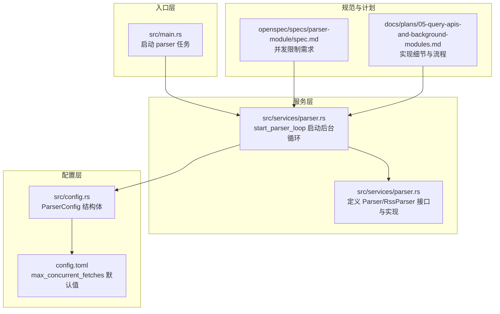
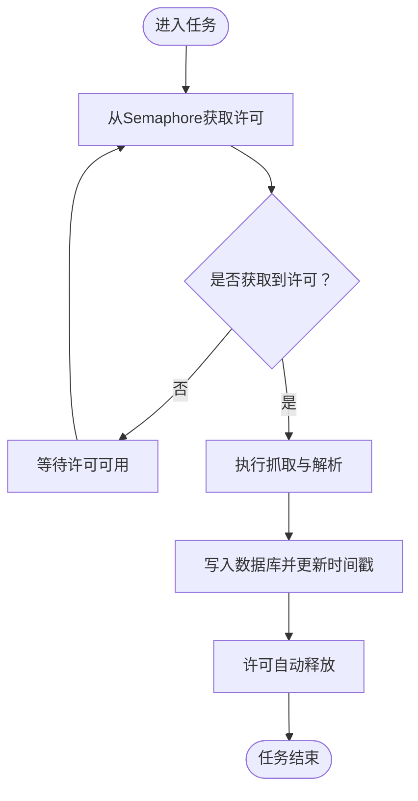
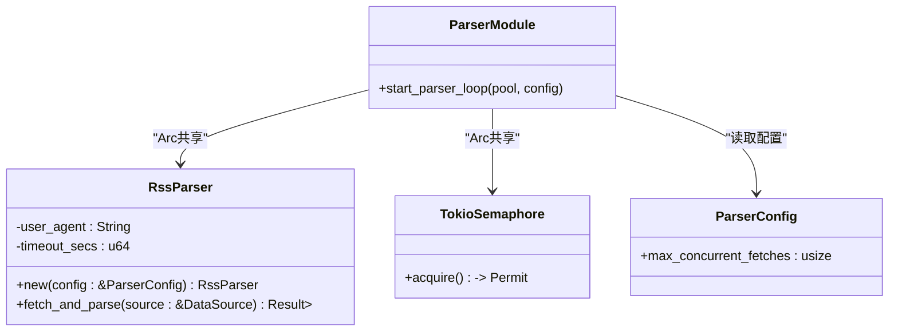
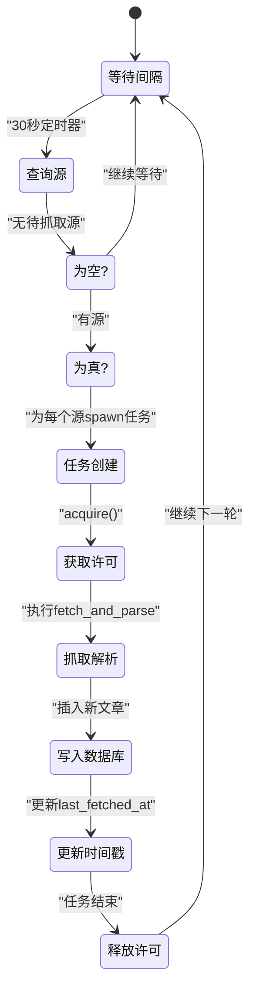
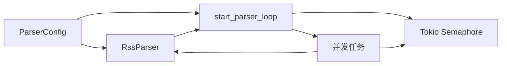

# 并发控制机制

<cite>
**本文档引用的文件**
- [src/services/parser.rs](file://src/services/parser.rs)
- [src/config.rs](file://src/config.rs)
- [src/main.rs](file://src/main.rs)
- [openspec/specs/parser-module/spec.md](file://openspec/specs/parser-module/spec.md)
- [openspec/changes/archive/2026-06-07-query-apis-and-background-modules/specs/parser-module/spec.md](file://openspec/changes/archive/2026-06-07-query-apis-and-background-modules/specs/parser-module/spec.md)
- [docs/plans/05-query-apis-and-background-modules.md](file://docs/plans/05-query-apis-and-background-modules.md)
- [config.toml](file://config.toml)
</cite>

## 目录
1. [引言](#引言)
2. [项目结构](#项目结构)
3. [核心组件](#核心组件)
4. [架构总览](#架构总览)
5. [详细组件分析](#详细组件分析)
6. [依赖关系分析](#依赖关系分析)
7. [性能考虑](#性能考虑)
8. [故障排除指南](#故障排除指南)
9. [结论](#结论)
10. [附录](#附录)

## 引言
本文件聚焦于系统中并发控制机制的设计与实现，重点阐述Tokio Semaphore在Parser模块中的应用，包括信号量初始化、并发限制设置与资源分配策略；解释Arc智能指针在共享RssParser实例与Semaphore上的使用模式；梳理并发任务的生命周期管理（创建、资源获取与释放）；并给出参数调优建议与故障排除方法。目标是帮助开发者在保证系统稳定性的同时，最大化吞吐与资源利用率。

## 项目结构
Parser模块位于服务层，负责周期性扫描数据源、并发拉取RSS/Atom订阅并解析入库。并发控制通过Tokio Semaphore与Arc共享实现，配置项来自全局ParserConfig。



**图表来源**
- [src/services/parser.rs](file://src/services/parser.rs)
- [src/config.rs](file://src/config.rs)
- [src/main.rs](file://src/main.rs)
- [openspec/specs/parser-module/spec.md](file://openspec/specs/parser-module/spec.md)
- [docs/plans/05-query-apis-and-background-modules.md](file://docs/plans/05-query-apis-and-background-modules.md)
- [config.toml](file://config.toml)

**章节来源**
- [src/services/parser.rs](file://src/services/parser.rs)
- [src/config.rs](file://src/config.rs)
- [src/main.rs](file://src/main.rs)
- [openspec/specs/parser-module/spec.md](file://openspec/specs/parser-module/spec.md)
- [docs/plans/05-query-apis-and-background-modules.md](file://docs/plans/05-query-apis-and-background-modules.md)
- [config.toml](file://config.toml)

## 核心组件
- ParserTrait：抽象的异步解析器接口，支持未来扩展新的解析器类型。
- RssParser：基于feed-rs解析RSS/Atom，使用reqwest进行HTTP请求。
- start_parser_loop：后台调度循环，按固定间隔查询待抓取的数据源，并以信号量控制并发度。
- ParserConfig：包含max_concurrent_fetches等并发相关配置。
- Arc<RssParser>与Arc<Semaphore>：在任务间共享解析器与并发许可。

这些组件共同构成“并发受控的任务执行框架”，确保系统在高负载下仍保持稳定与可预测的资源占用。

**章节来源**
- [src/services/parser.rs](file://src/services/parser.rs)
- [src/config.rs](file://src/config.rs)
- [openspec/specs/parser-module/spec.md](file://openspec/specs/parser-module/spec.md)

## 架构总览
Parser后台循环每30秒扫描一次数据库，发现待抓取源后，为每个源派生一个并发任务。任务在开始时从Semaphore获取许可，执行完成后自动释放许可，从而实现全局并发上限控制。

```mermaid
sequenceDiagram
participant Main as "主程序"
participant Loop as "start_parser_loop"
participant DB as "数据库"
participant Sem as "Tokio Semaphore"
participant Parser as "RssParser"
participant Store as "数据库写入"
Main->>Loop : 启动后台循环
Loop->>Loop : 等待30秒间隔
Loop->>DB : 查询待抓取的数据源
DB-->>Loop : 返回源列表
loop 遍历每个源
Loop->>Sem : acquire() 获取许可
Sem-->>Loop : 返回许可句柄
Loop->>Parser : fetch_and_parse(source)
Parser-->>Loop : 解析结果或错误
alt 成功
Loop->>Store : 插入新文章(去重)
Store-->>Loop : 写入完成
Loop->>DB : 更新 last_fetched_at
else 失败
Loop->>Loop : 记录错误日志
end
Loop->>Sem : 许可自动释放
end
```

**图表来源**
- [src/services/parser.rs](file://src/services/parser.rs)
- [docs/plans/05-query-apis-and-background-modules.md](file://docs/plans/05-query-apis-and-background-modules.md)

## 详细组件分析

### 组件一：Tokio Semaphore 并发控制
- 初始化：在后台循环中创建Semaphore，初始许可数等于配置的max_concurrent_fetches。
- 使用模式：每个抓取任务在启动前调用acquire()获取许可，任务结束时许可自动释放。
- 作用范围：限制同时进行的网络抓取数量，避免资源争用导致的性能抖动或超时。



**图表来源**
- [src/services/parser.rs](file://src/services/parser.rs)
- [openspec/specs/parser-module/spec.md](file://openspec/specs/parser-module/spec.md)

**章节来源**
- [src/services/parser.rs](file://src/services/parser.rs)
- [openspec/specs/parser-module/spec.md](file://openspec/specs/parser-module/spec.md)

### 组件二：Arc 智能指针共享模式
- 共享解析器：Arc<RssParser>在循环中被克隆，传递给每个任务，避免重复构建HTTP客户端与解析器。
- 共享信号量：Arc<Semaphore>同样被克隆，所有任务共享同一并发许可池。
- 生命周期：任务结束后，由于Arc计数减少，当最后一个任务退出时，共享对象自然销毁。



**图表来源**
- [src/services/parser.rs](file://src/services/parser.rs)
- [src/config.rs](file://src/config.rs)

**章节来源**
- [src/services/parser.rs](file://src/services/parser.rs)
- [src/config.rs](file://src/config.rs)

### 组件三：并发任务生命周期管理
- 创建：遍历待抓取源，为每个源spawn一个新的异步任务。
- 资源获取：任务内部调用Semaphore.acquire()获取许可。
- 执行：调用RssParser.fetch_and_parse()抓取并解析。
- 写入与更新：将新文章插入数据库（去重），并更新源的last_fetched_at。
- 释放：任务结束时，许可自动释放，允许后续任务继续执行。



**图表来源**
- [src/services/parser.rs](file://src/services/parser.rs)
- [docs/plans/05-query-apis-and-background-modules.md](file://docs/plans/05-query-apis-and-background-modules.md)

**章节来源**
- [src/services/parser.rs](file://src/services/parser.rs)
- [docs/plans/05-query-apis-and-background-modules.md](file://docs/plans/05-query-apis-and-background-modules.md)

### 组件四：并发参数与配置
- max_concurrent_fetches：决定并发抓取上限，默认值来源于配置文件。
- 调整原则：根据网络带宽、远端服务限流、本地CPU/IO能力综合评估。
- 配置位置：ParserConfig结构体与config.toml文件。

**章节来源**
- [src/config.rs](file://src/config.rs)
- [config.toml](file://config.toml)
- [openspec/specs/parser-module/spec.md](file://openspec/specs/parser-module/spec.md)

## 依赖关系分析
- start_parser_loop依赖ParserConfig读取并发上限。
- RssParser依赖ParserConfig构造HTTP客户端与超时设置。
- 任务通过Arc共享RssParser与Semaphore，降低内存占用与初始化成本。
- 规范与计划文档明确了并发限制的需求与实现路径。



**图表来源**
- [src/services/parser.rs](file://src/services/parser.rs)
- [src/config.rs](file://src/config.rs)

**章节来源**
- [src/services/parser.rs](file://src/services/parser.rs)
- [src/config.rs](file://src/config.rs)

## 性能考虑
- 并发上限与吞吐：合理设置max_concurrent_fetches，避免过度并发导致网络拥塞或远端限流。
- I/O密集优化：抓取与解析为I/O密集型，信号量可有效防止过多连接竞争。
- 资源复用：通过Arc共享RssParser，减少HTTP客户端与解析器的重复创建。
- 错误隔离：单个源失败不影响其他任务，提高整体鲁棒性。
- 定时器与抖动：固定30秒间隔简单可靠，若需更精细控制可引入指数退避或动态调整。

## 故障排除指南
- 并发任务长期阻塞
  - 检查Semaphore是否正确释放（确认任务正常结束）。
  - 核对max_concurrent_fetches是否过小导致排队过长。
- 抓取失败频繁
  - 查看网络超时与远端限流情况，适当增大超时或降低并发。
  - 关注错误日志，定位具体源的URL或格式问题。
- 数据库写入异常
  - 确认INSERT OR IGNORE逻辑与索引约束一致，避免重复键冲突。
  - 检查事务与连接池状态，必要时增加重试或降载。
- 资源泄漏
  - 确保任务内对Semaphore的acquire与释放成对出现，避免死锁。
  - 使用Arc克隆而非复制大型对象，减少内存压力。

## 结论
该并发控制方案通过Tokio Semaphore与Arc共享实现了简洁而高效的并发限制：既保证了系统在高负载下的稳定性，又避免了不必要的资源浪费。结合合理的参数配置与完善的错误处理，可在多数生产场景中取得良好效果。建议持续监控任务延迟、吞吐与错误率，并根据实际观测动态调整并发上限。

## 附录
- 相关实现参考路径
  - [后台循环与并发控制](file://src/services/parser.rs)
  - [配置结构与默认值](file://src/config.rs)
  - [入口启动与任务派生](file://src/main.rs)
  - [规范与需求说明](file://openspec/specs/parser-module/spec.md)
  - [实现计划与流程细节](file://docs/plans/05-query-apis-and-background-modules.md)
  - [配置文件示例](file://config.toml)