# 后端项目脚手架规范

<cite>
**本文档引用的文件**
- [README.md](file://README.md)
- [Cargo.toml](file://Cargo.toml)
- [src/main.rs](file://src/main.rs)
- [src/config.rs](file://src/config.rs)
- [src/db.rs](file://src/db.rs)
- [src/routes.rs](file://src/routes.rs)
- [src/pipeline.rs](file://src/pipeline.rs)
- [src/services.rs](file://src/services.rs)
- [src/middleware.rs](file://src/middleware.rs)
- [src/error.rs](file://src/error.rs)
- [src/models.rs](file://src/models.rs)
- [src/handlers.rs](file://src/handlers.rs)
- [src/services/parser.rs](file://src/services/parser.rs)
- [src/services/filter.rs](file://src/services/filter.rs)
- [src/services/pusher.rs](file://src/services/pusher.rs)
- [src/middleware/auth.rs](file://src/middleware/auth.rs)
- [src/handlers/token.rs](file://src/handlers/token.rs)
- [src/handlers/query.rs](file://src/handlers/query.rs)
- [config.toml](file://config.toml)
</cite>

## 更新摘要
**变更内容**
- 新增配置验证系统，包含完整的 validate 方法实现
- 改进服务器端口设置和主机绑定逻辑
- 增强数据库路径处理和目录创建机制
- 完善服务配置参数的严格检查机制

## 目录
1. [简介](#简介)
2. [项目结构](#项目结构)
3. [核心组件](#核心组件)
4. [架构概览](#架构概览)
5. [详细组件分析](#详细组件分析)
6. [依赖关系分析](#依赖关系分析)
7. [性能考虑](#性能考虑)
8. [故障排除指南](#故障排除指南)
9. [结论](#结论)

## 简介

这是一个基于 Rust + Axum + SQLite 的后端项目脚手架，采用了事件驱动的管道架构模式。项目实现了完整的 API 服务、认证中间件、数据库连接池管理和后台任务调度功能。**最新更新**增加了全面的配置验证系统，确保应用启动前的所有配置参数都经过严格验证。

**章节来源**
- [README.md:1-254](file://README.md#L1-L254)

## 项目结构

项目采用模块化的 Rust 项目结构，主要分为以下几个核心目录：

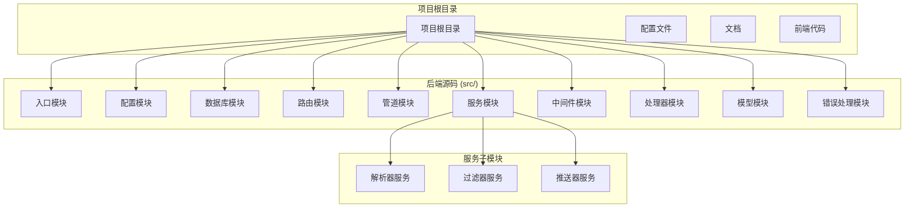

**图表来源**
- [src/main.rs:1-129](file://src/main.rs#L1-L129)
- [src/config.rs:1-93](file://src/config.rs#L1-L93)
- [src/services.rs:1-4](file://src/services.rs#L1-L4)

**章节来源**
- [README.md:196-225](file://README.md#L196-L225)

## 核心组件

### 配置管理系统

配置系统采用 TOML 格式，支持多层配置结构，并包含了完整的配置验证机制：

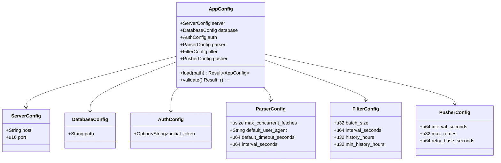

**图表来源**
- [src/config.rs:3-93](file://src/config.rs#L3-L93)

**更新** 新增了完整的配置验证机制，确保所有配置参数的有效性和完整性。

### 配置验证系统

配置验证系统在应用启动时自动执行，确保所有配置参数都符合要求：

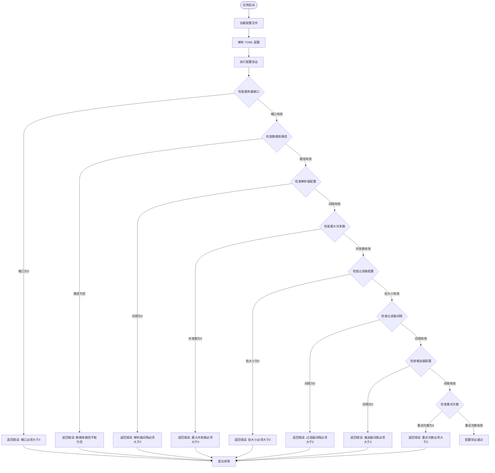

**图表来源**
- [src/config.rs:65-91](file://src/config.rs#L65-L91)

### 数据库连接池

数据库连接池采用 SQLite，配置了 WAL 模式和外键约束：

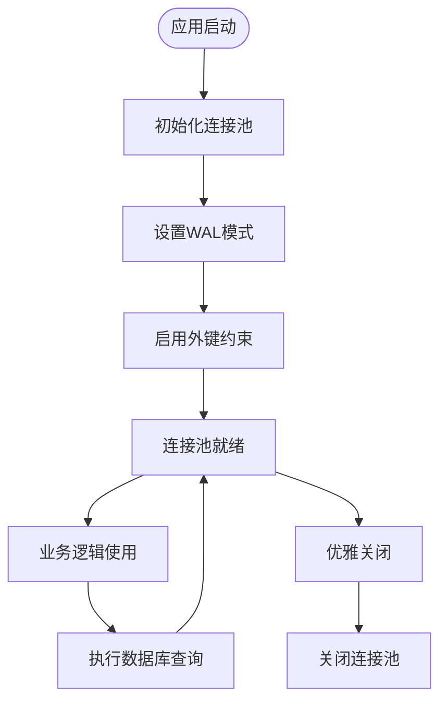

**图表来源**
- [src/db.rs:12-26](file://src/db.rs#L12-L26)

**章节来源**
- [src/config.rs:1-93](file://src/config.rs#L1-L93)
- [src/db.rs:1-27](file://src/db.rs#L1-L27)

## 架构概览

项目采用事件驱动的管道架构，三个后台模块通过消息传递进行通信：

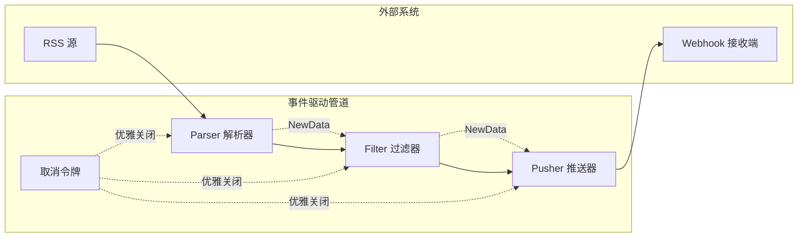

**图表来源**
- [src/pipeline.rs:4-45](file://src/pipeline.rs#L4-L45)
- [src/main.rs:92-108](file://src/main.rs#L92-L108)

### API 路由架构

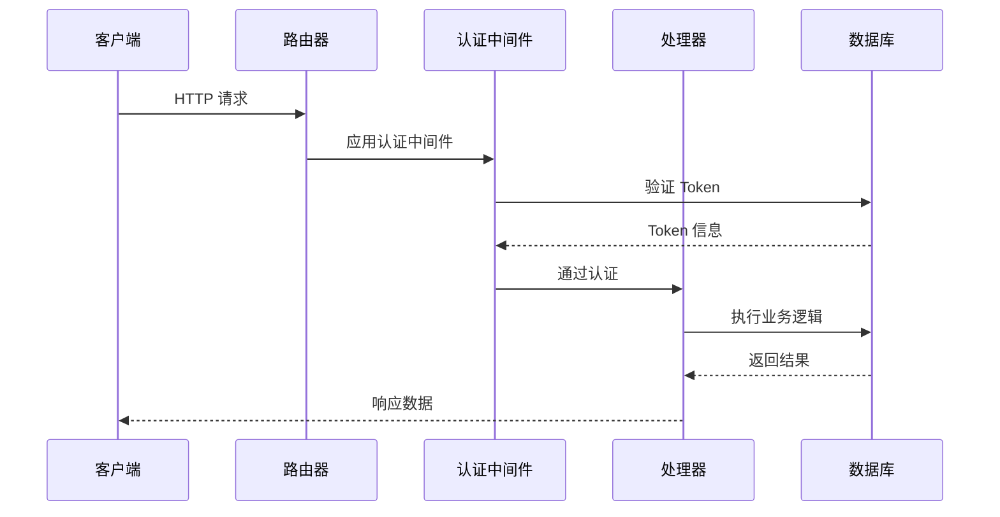

**图表来源**
- [src/routes.rs:15-61](file://src/routes.rs#L15-L61)
- [src/middleware/auth.rs:18-57](file://src/middleware/auth.rs#L18-L57)

**章节来源**
- [src/main.rs:55-129](file://src/main.rs#L55-L129)
- [src/routes.rs:1-86](file://src/routes.rs#L1-L86)

## 详细组件分析

### 认证中间件

认证中间件实现了基于 Bearer Token 的安全认证机制：

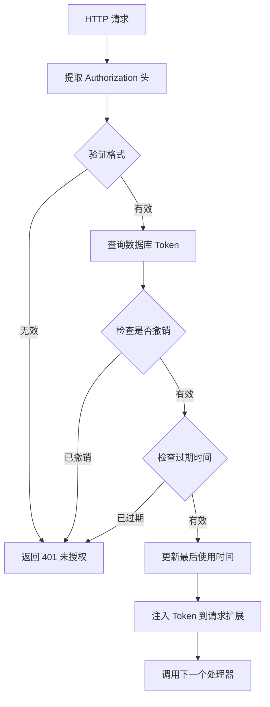

**图表来源**
- [src/middleware/auth.rs:18-57](file://src/middleware/auth.rs#L18-L57)

### Token 管理 API

Token 管理提供了完整的生命周期管理：

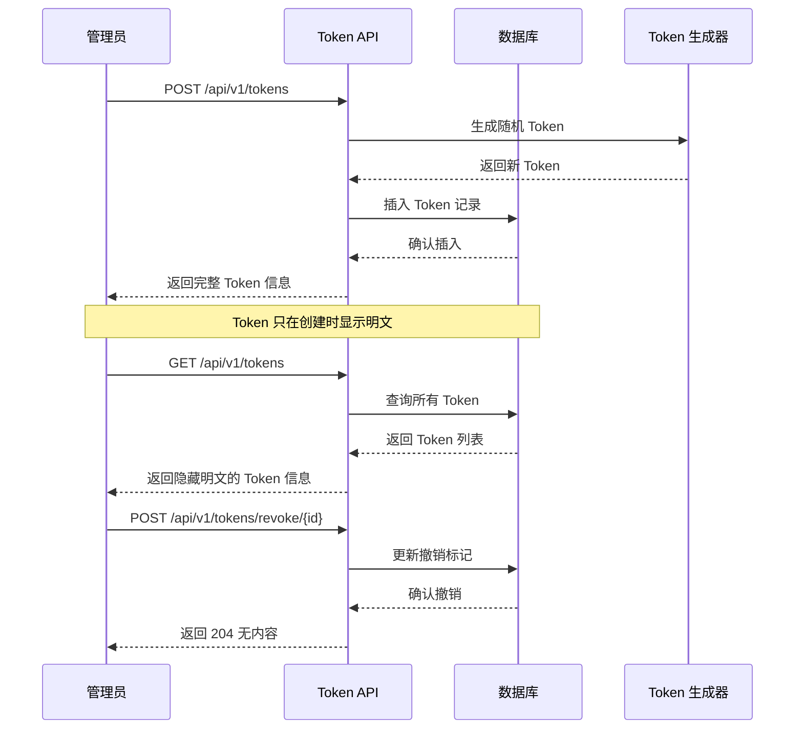

**图表来源**
- [src/handlers/token.rs:18-65](file://src/handlers/token.rs#L18-L65)

**章节来源**
- [src/middleware/auth.rs:1-58](file://src/middleware/auth.rs#L1-L58)
- [src/handlers/token.rs:1-66](file://src/handlers/token.rs#L1-L66)

### 后台服务模块

#### 解析器服务 (Parser)

解析器服务负责从 RSS 源抓取内容并进行解析：

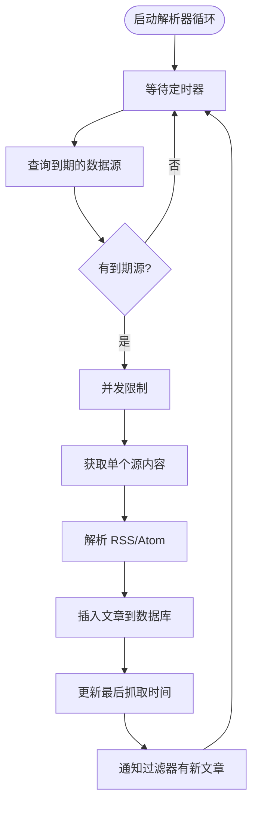

**图表来源**
- [src/services/parser.rs:96-199](file://src/services/parser.rs#L96-L199)

#### 过滤器服务 (Filter)

过滤器服务实现关键词匹配和热点检测：

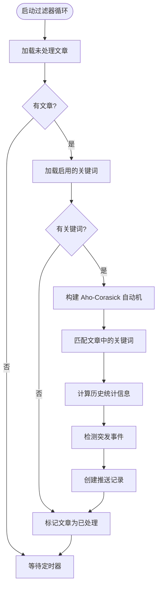

**图表来源**
- [src/services/filter.rs:18-309](file://src/services/filter.rs#L18-L309)

#### 推送器服务 (Pusher)

推送器服务负责向外部 Webhook 发送推送通知：

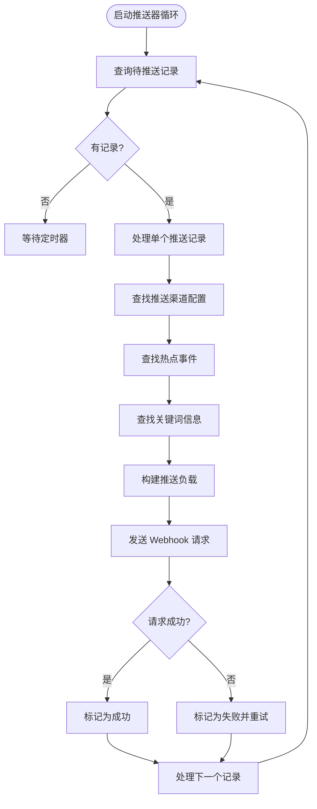

**图表来源**
- [src/services/pusher.rs:13-278](file://src/services/pusher.rs#L13-L278)

**章节来源**
- [src/services/parser.rs:1-200](file://src/services/parser.rs#L1-L200)
- [src/services/filter.rs:1-310](file://src/services/filter.rs#L1-L310)
- [src/services/pusher.rs:1-279](file://src/services/pusher.rs#L1-L279)

### 错误处理系统

统一的错误处理系统提供了标准化的错误响应格式：

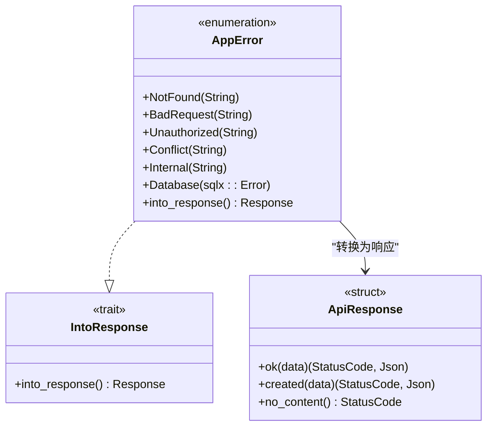

**图表来源**
- [src/error.rs:8-82](file://src/error.rs#L8-L82)

**章节来源**
- [src/error.rs:1-82](file://src/error.rs#L1-L82)

## 依赖关系分析

项目使用 Cargo 进行依赖管理，主要依赖包括：

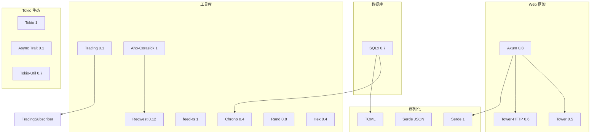

**图表来源**
- [Cargo.toml:6-47](file://Cargo.toml#L6-L47)

**章节来源**
- [Cargo.toml:1-67](file://Cargo.toml#L1-L67)

## 性能考虑

### 并发控制

项目实现了多层并发控制机制：

1. **数据库连接池**：最大连接数 5，确保数据库访问的稳定性
2. **解析器并发限制**：通过信号量控制最大并发请求数
3. **Tokio 任务调度**：异步任务的高效调度和资源管理

### 缓存策略

- **内存缓存**：关键词匹配使用 Aho-Corasick 自动机进行高效匹配
- **数据库索引**：合理设计数据库索引以优化查询性能
- **批量操作**：支持批量插入和更新操作

### 监控和日志

- **结构化日志**：使用 Tracing 进行结构化日志记录
- **性能指标**：关键操作的执行时间和成功率监控
- **错误追踪**：详细的错误堆栈和上下文信息

## 故障排除指南

### 常见问题诊断

1. **配置验证失败**
   - 检查 `config.toml` 文件中的服务器端口是否大于 0
   - 验证数据库路径是否为空且可写
   - 确认所有服务配置参数都大于 0

2. **数据库连接问题**
   - 检查数据库文件路径和权限
   - 验证 SQLite 版本兼容性
   - 确认 WAL 模式和外键约束已正确设置

3. **Token 认证失败**
   - 验证 Authorization 头格式
   - 检查 Token 是否已撤销或过期
   - 确认数据库中存在有效的 Token 记录

4. **后台服务异常**
   - 查看服务日志中的错误信息
   - 检查网络连接和外部服务可用性
   - 验证配置参数的合理性

### 调试技巧

- 使用 `--config` 参数指定配置文件路径
- 启用详细的日志级别进行调试
- 利用健康检查端点监控服务状态
- 通过手动触发端点测试特定功能

**章节来源**
- [src/main.rs:18-53](file://src/main.rs#L18-L53)
- [src/middleware/auth.rs:23-44](file://src/middleware/auth.rs#L23-L44)

## 结论

这个后端项目脚手架提供了一个完整、可扩展的基础架构，具有以下特点：

1. **模块化设计**：清晰的模块分离和职责划分
2. **事件驱动**：高效的管道架构和消息传递机制
3. **安全性**：完善的认证授权和错误处理机制
4. **可维护性**：良好的代码组织和文档结构
5. **性能优化**：合理的并发控制和资源管理
6. **配置验证**：全面的配置参数验证机制，确保应用启动前的配置完整性

**最新更新**增强了配置验证系统的可靠性，通过严格的参数检查和错误处理，大大提高了应用的稳定性和用户体验。该脚手架为后续的功能扩展提供了坚实的基础，包括 CRUD API、前端集成和可视化仪表板等功能模块的开发。