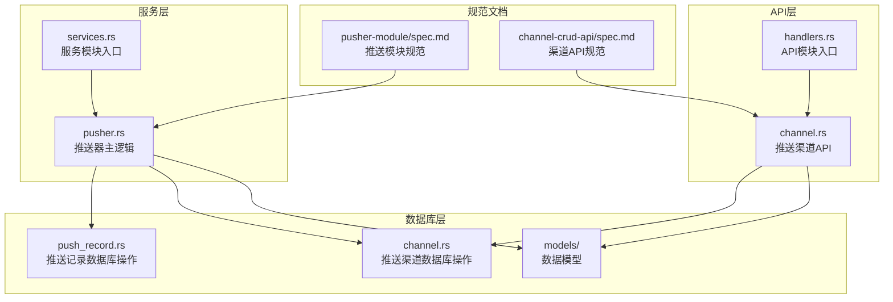
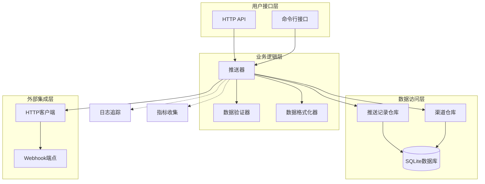
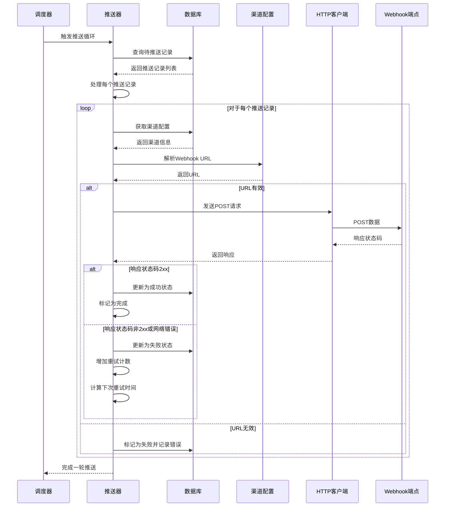
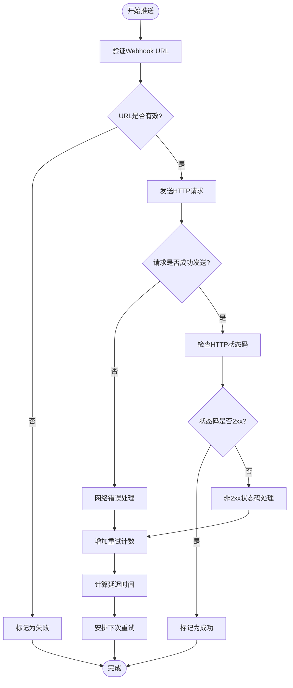
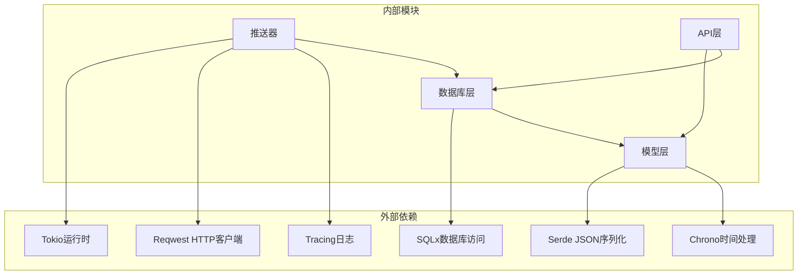

# Webhook推送实现

<cite>
**本文档引用的文件**
- [src/services/pusher.rs](file://src/services/pusher.rs)
- [src/db/push_record.rs](file://src/db/push_record.rs)
- [src/db/channel.rs](file://src/db/channel.rs)
- [src/models/push_record.rs](file://src/models/push_record.rs)
- [src/models/channel.rs](file://src/models/channel.rs)
- [src/handlers/channel.rs](file://src/handlers/channel.rs)
- [openspec/specs/pusher-module/spec.md](file://openspec/specs/pusher-module/spec.md)
- [openspec/specs/channel-crud-api/spec.md](file://openspec/specs/channel-crud-api/spec.md)
- [docs/plans/05-query-apis-and-background-modules.md](file://docs/plans/05-query-apis-and-background-modules.md)
</cite>

## 目录
1. [简介](#简介)
2. [项目结构](#项目结构)
3. [核心组件](#核心组件)
4. [架构概览](#架构概览)
5. [详细组件分析](#详细组件分析)
6. [依赖关系分析](#依赖关系分析)
7. [性能考虑](#性能考虑)
8. [故障排除指南](#故障排除指南)
9. [结论](#结论)

## 简介

Webhook推送实现是AI趋势监控系统中的关键模块，负责将热点事件信息推送到外部系统的Webhook端点。该实现采用异步Rust编写，使用Tokio运行时进行并发处理，通过reqwest HTTP客户端发送POST请求，并实现了完整的错误处理和重试机制。

系统支持多种推送渠道类型，包括DingTalk和飞书等即时通讯平台，每个渠道通过配置JSON中的URL字段指定目标Webhook地址。推送任务采用乐观锁机制防止重复发送，并实现了指数退避重试策略。

## 项目结构

Webhook推送功能主要分布在以下目录结构中：

**图表来源**
- [src/services/pusher.rs:1-300](file://src/services/pusher.rs#L1-L300)
- [src/db/push_record.rs:1-200](file://src/db/push_record.rs#L1-L200)
- [src/db/channel.rs:1-100](file://src/db/channel.rs#L1-L100)

**章节来源**
- [src/services/pusher.rs:1-300](file://src/services/pusher.rs#L1-L300)
- [src/db/push_record.rs:1-200](file://src/db/push_record.rs#L1-L200)
- [src/db/channel.rs:1-100](file://src/db/channel.rs#L1-L100)

## 核心组件

### 推送器主控制器

推送器是整个Webhook推送系统的核心组件，负责协调所有推送相关的工作流程。其主要职责包括：

- **推送记录管理**：从数据库查询待推送的记录
- **渠道配置解析**：从JSON配置中提取Webhook URL
- **HTTP请求发送**：使用reqwest客户端发送POST请求
- **状态更新**：根据推送结果更新数据库状态
- **错误处理**：实现完整的错误捕获和重试机制

### 数据模型设计

系统采用清晰的数据模型分离设计：

**推送记录模型** (`PushRecord`)
- 包含推送状态、重试计数、下次重试时间等字段
- 支持乐观锁机制防止并发冲突
- 提供序列化和反序列化能力

**推送渠道模型** (`PushChannel`)
- 定义渠道名称、类型、配置等基本信息
- 支持不同类型的推送渠道（webhook、dingtalk、feishu等）

**配置模型** (`CreateChannelRequest`, `UpdateChannelRequest`)
- 定义创建和更新渠道时的请求格式
- 提供JSON配置字符串的验证和解析

**章节来源**
- [src/models/push_record.rs:1-150](file://src/models/push_record.rs#L1-L150)
- [src/models/channel.rs:1-120](file://src/models/channel.rs#L1-L120)
- [src/models/channel.rs:120-250](file://src/models/channel.rs#L120-L250)

## 架构概览

Webhook推送系统采用分层架构设计，确保各组件职责明确且松耦合：

**图表来源**
- [src/services/pusher.rs:40-258](file://src/services/pusher.rs#L40-L258)
- [src/db/push_record.rs:1-200](file://src/db/push_record.rs#L1-L200)
- [src/db/channel.rs:1-100](file://src/db/channel.rs#L1-L100)

系统架构的关键特点：

1. **异步非阻塞**：使用Tokio运行时实现完全异步的推送处理
2. **错误隔离**：每个推送任务都有独立的错误处理机制
3. **资源管理**：合理管理HTTP连接池和数据库连接
4. **可观测性**：集成Tracing日志和Metrics指标收集

## 详细组件分析

### 推送器核心流程

推送器的核心工作流程如下：

**图表来源**
- [src/services/pusher.rs:40-258](file://src/services/pusher.rs#L40-L258)

### 请求构建与发送机制

推送器在构建HTTP请求时遵循以下流程：

1. **客户端初始化**：使用reqwest的默认配置创建HTTP客户端
2. **JSON负载构造**：将热点事件信息、关键词数据和统计指标格式化为JSON
3. **请求头设置**：自动添加Content-Type: application/json
4. **同步发送模式**：使用await关键字等待响应
5. **响应处理**：根据状态码分类处理成功和失败情况

### 数据格式化规范

推送数据采用统一的JSON格式，包含以下核心字段：

**热点事件信息**
- 事件ID和标题
- 事件描述和重要性级别
- 发生时间和持续时长
- 相关源媒体信息

**关键词数据**
- 关键词列表及其出现频率
- 关键词重要性评分
- 相关文章数量统计

**统计指标**
- 总体趋势变化百分比
- 24小时变化量
- 最高热度值
- 平均响应时间

### 错误处理与重试策略

系统实现了完善的错误处理机制：

**图表来源**
- [src/services/pusher.rs:204-242](file://src/services/pusher.rs#L204-L242)

**章节来源**
- [src/services/pusher.rs:40-258](file://src/services/pusher.rs#L40-L258)
- [src/services/pusher.rs:204-242](file://src/services/pusher.rs#L204-L242)

### 配置管理与API集成

推送渠道通过REST API进行管理：

**渠道创建API**
- 端点：POST /api/v1/channels
- 必需字段：name（名称）、config（JSON配置字符串）
- 可选字段：channel_type（默认webhook）
- 返回：创建成功的PushChannel对象

**渠道列表API**
- 端点：GET /api/v1/channels
- 功能：列出所有推送渠道
- 返回：按ID升序排列的渠道列表

**配置格式要求**
- config字段必须包含有效的JSON字符串
- JSON必须包含url字段作为Webhook地址
- 支持额外的认证参数和自定义头部

**章节来源**
- [src/handlers/channel.rs:1-32](file://src/handlers/channel.rs#L1-L32)
- [openspec/specs/channel-crud-api/spec.md:1-37](file://openspec/specs/channel-crud-api/spec.md#L1-L37)

## 依赖关系分析

Webhook推送系统的依赖关系呈现清晰的分层结构：

**图表来源**
- [src/services/pusher.rs:1-300](file://src/services/pusher.rs#L1-L300)
- [src/db/push_record.rs:1-200](file://src/db/push_record.rs#L1-L200)

**章节来源**
- [src/services/pusher.rs:1-300](file://src/services/pusher.rs#L1-L300)
- [src/db/push_record.rs:1-200](file://src/db/push_record.rs#L1-L200)

## 性能考虑

### 并发处理优化

系统采用多线程并发模型，每个推送任务都是独立的异步任务：

- **任务隔离**：单个推送失败不会影响其他推送任务
- **资源复用**：HTTP客户端连接池复用TCP连接
- **背压处理**：当系统繁忙时自动调节推送速率

### 内存管理

- **零拷贝序列化**：使用Serde进行高效的JSON序列化
- **流式处理**：大JSON负载采用流式写入避免内存峰值
- **连接池管理**：合理配置HTTP连接池大小防止资源耗尽

### 监控指标

系统集成了全面的监控指标：

- **推送成功率**：跟踪整体推送质量
- **平均响应时间**：监控Webhook端点性能
- **重试次数分布**：分析失败原因和模式
- **内存使用情况**：监控系统资源消耗

## 故障排除指南

### 常见问题诊断

**网络连接问题**
- 检查Webhook URL可达性
- 验证防火墙和代理设置
- 确认SSL证书有效性

**认证失败**
- 验证Webhook端点的认证要求
- 检查请求头中的认证信息
- 确认令牌的有效期和权限

**数据格式错误**
- 验证JSON负载格式
- 检查必填字段完整性
- 确认数据类型匹配

### 日志分析

系统提供了详细的日志记录：

**错误级别日志**
- 推送失败的具体原因
- 网络错误的详细信息
- 数据库操作异常

**调试级别日志**
- HTTP请求和响应详情
- 数据库查询执行计划
- 内存使用情况

### 调试技巧

1. **启用详细日志**：设置环境变量`RUST_LOG=debug`获取完整日志
2. **测试Webhook端点**：使用curl命令单独测试目标URL
3. **监控系统指标**：通过Prometheus收集系统性能数据
4. **模拟高负载**：使用压力测试工具验证系统稳定性

**章节来源**
- [src/services/pusher.rs:204-242](file://src/services/pusher.rs#L204-L242)
- [openspec/specs/pusher-module/spec.md:48-89](file://openspec/specs/pusher-module/spec.md#L48-L89)

## 结论

Webhook推送实现是一个设计精良、功能完整的系统模块。它采用了现代Rust生态系统中的最佳实践，包括异步编程、类型安全、内存安全和全面的错误处理。

系统的主要优势包括：

1. **可靠性**：实现了完整的错误处理和重试机制
2. **可扩展性**：支持多种推送渠道类型和自定义配置
3. **可观测性**：提供了全面的日志记录和指标监控
4. **性能**：采用异步非阻塞I/O和连接池优化

通过合理的架构设计和严格的测试覆盖，该系统能够稳定地处理大量推送任务，并为用户提供可靠的Webhook集成解决方案。