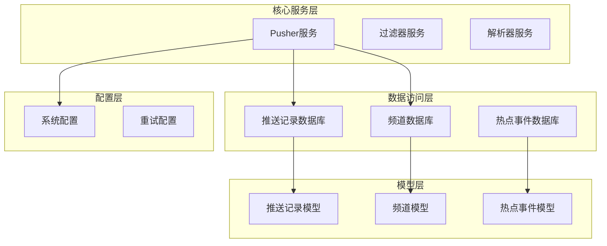
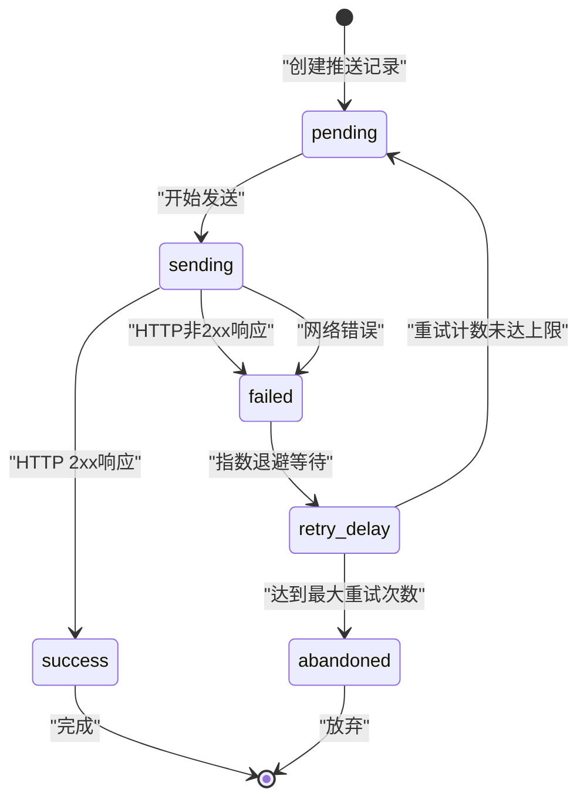
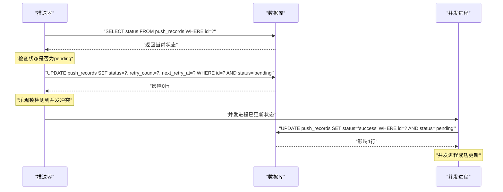
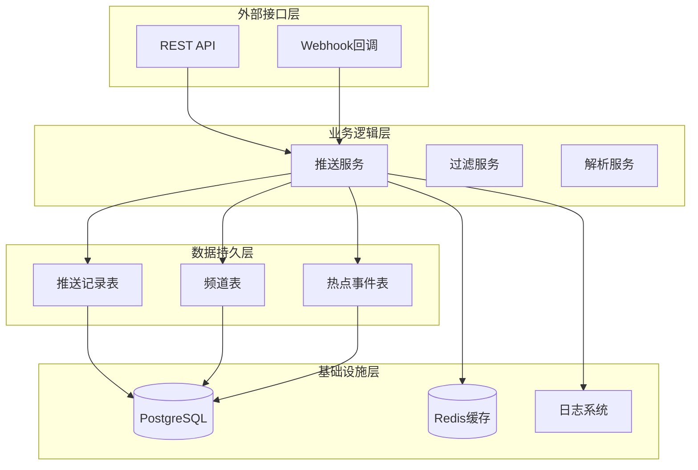
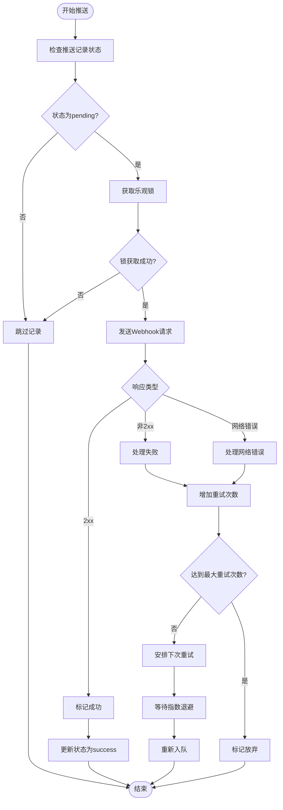
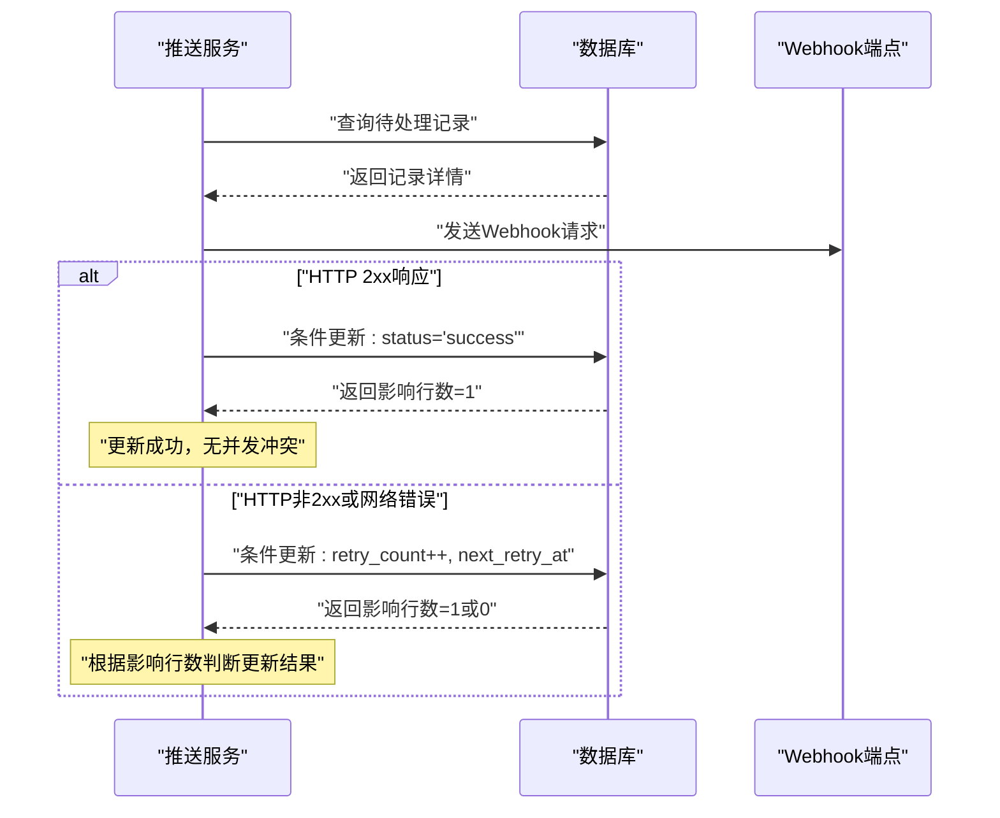
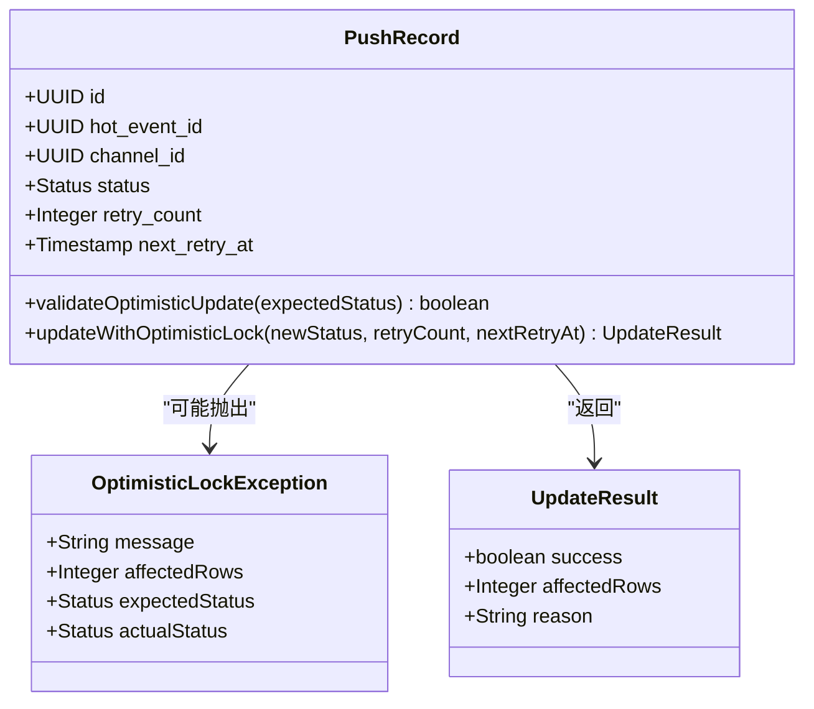
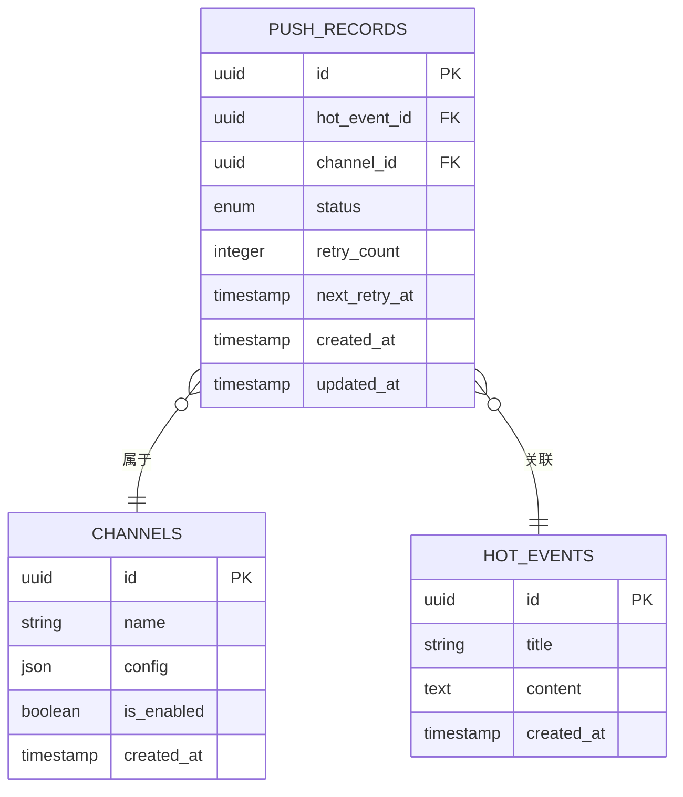
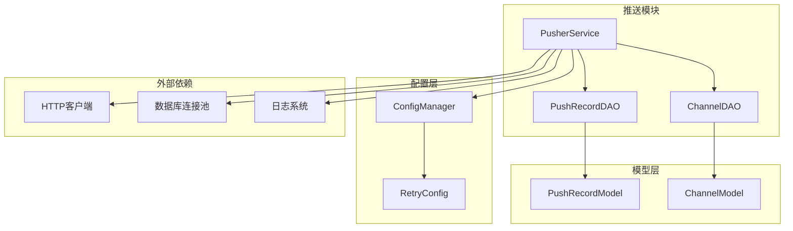
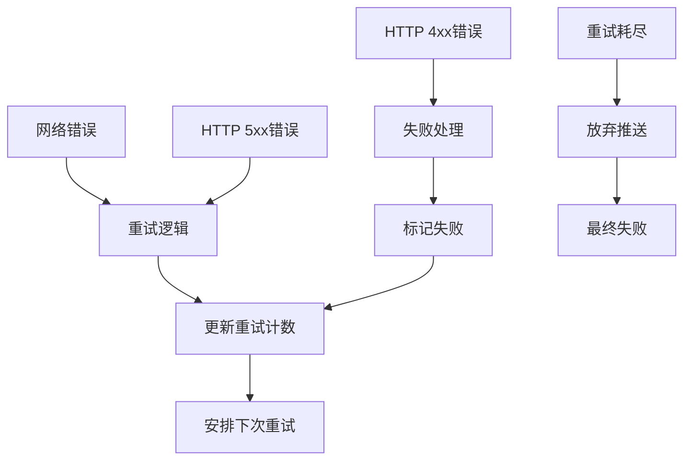

# 乐观锁防重复推送

<cite>
**本文档引用的文件**
- [pusher-module/spec.md](file://openspec/specs/pusher-module/spec.md)
- [pusher.rs](file://src/services/pusher.rs)
- [push_record.rs](file://src/db/push_record.rs)
- [push_record.rs](file://src/models/push_record.rs)
- [20260607044921_init.sql](file://docs/migrations/20260607044921_init.sql)
- [README.md](file://README.md)
</cite>

## 目录
1. [引言](#引言)
2. [项目结构](#项目结构)
3. [核心组件](#核心组件)
4. [架构概览](#架构概览)
5. [详细组件分析](#详细组件分析)
6. [依赖关系分析](#依赖关系分析)
7. [性能考虑](#性能考虑)
8. [故障排除指南](#故障排除指南)
9. [结论](#结论)

## 引言

本文档深入解析AI趋势工具项目中的乐观锁防重复推送机制。该系统通过乐观锁确保在高并发环境下不会出现重复推送，同时提供指数退避重试策略来处理网络异常和临时故障。

## 项目结构

该项目采用模块化架构设计，主要包含以下关键组件：

**图表来源**
- [pusher.rs](file://src/services/pusher.rs)
- [push_record.rs](file://src/db/push_record.rs)
- [push_record.rs](file://src/models/push_record.rs)

**章节来源**
- [pusher.rs](file://src/services/pusher.rs)
- [push_record.rs](file://src/db/push_record.rs)
- [push_record.rs](file://src/models/push_record.rs)

## 核心组件

### 推送记录模型

推送记录是整个乐观锁机制的核心实体，包含以下关键字段：

| 字段名 | 类型 | 描述 | 约束条件 |
|--------|------|------|----------|
| id | UUID | 唯一标识符 | 主键 |
| hot_event_id | UUID | 关联的热点事件 | 外键约束 |
| channel_id | UUID | 推送频道标识 | 外键约束 |
| status | ENUM | 推送状态 | 必填，有穷状态集 |
| retry_count | INTEGER | 重试次数 | 默认0，非负整数 |
| next_retry_at | TIMESTAMP | 下次重试时间 | 可为空 |
| created_at | TIMESTAMP | 创建时间 | 自动设置 |
| updated_at | TIMESTAMP | 更新时间 | 自动更新 |

### 推送状态机

**图表来源**
- [pusher-module/spec.md](file://openspec/specs/pusher-module/spec.md)

### 乐观锁实现策略

系统采用基于状态字段的乐观锁机制，通过条件更新确保数据一致性：

**图表来源**
- [pusher-module/spec.md](file://openspec/specs/pusher-module/spec.md)
- [pusher.rs](file://src/services/pusher.rs)

**章节来源**
- [push_record.rs](file://src/models/push_record.rs)
- [pusher-module/spec.md](file://openspec/specs/pusher-module/spec.md)

## 架构概览

### 整体架构设计

**图表来源**
- [pusher.rs](file://src/services/pusher.rs)
- [push_record.rs](file://src/db/push_record.rs)

### 并发控制机制

系统通过多层并发控制确保数据一致性：

**图表来源**
- [pusher.rs](file://src/services/pusher.rs)
- [pusher-module/spec.md](file://openspec/specs/pusher-module/spec.md)

**章节来源**
- [pusher.rs](file://src/services/pusher.rs)
- [pusher-module/spec.md](file://openspec/specs/pusher-module/spec.md)

## 详细组件分析

### 推送服务实现

推送服务是乐观锁机制的核心执行单元，负责协调整个推送流程：

#### 核心功能模块

| 功能模块 | 职责描述 | 实现要点 |
|----------|----------|----------|
| 状态检查 | 验证推送记录状态 | 使用乐观锁条件更新 |
| Webhook发送 | 发送HTTP请求到目标地址 | 支持超时和重试机制 |
| 重试管理 | 指数退避重试策略 | 基于配置的重试参数 |
| 冲突检测 | 处理并发更新冲突 | 基于影响行数判断 |

#### 乐观锁更新流程

**图表来源**
- [pusher.rs](file://src/services/pusher.rs)

#### 并发冲突处理

当多个推送器实例同时处理同一记录时，乐观锁确保只有一个实例能够成功更新：

**图表来源**
- [pusher.rs](file://src/services/pusher.rs)
- [push_record.rs](file://src/models/push_record.rs)

**章节来源**
- [pusher.rs](file://src/services/pusher.rs)
- [push_record.rs](file://src/db/push_record.rs)

### 数据库设计

#### 表结构定义

推送记录表采用完整的索引设计以支持高效的查询和更新操作：

**图表来源**
- [20260607044921_init.sql](file://docs/migrations/20260607044921_init.sql)

#### 索引优化策略

| 索引名称 | 列组合 | 查询用途 | 性能收益 |
|----------|--------|----------|----------|
| idx_push_records_status | status | 状态筛选查询 | 显著提升状态查询速度 |
| idx_push_records_hot_event | hot_event_id | 热点事件关联查询 | 优化事件聚合查询 |
| idx_push_records_channel | channel_id | 频道维度统计 | 提升频道维度分析效率 |
| idx_push_records_retry_time | next_retry_at | 重试调度查询 | 减少重试扫描范围 |

**章节来源**
- [20260607044921_init.sql](file://docs/migrations/20260607044921_init.sql)

### 配置管理

系统支持灵活的配置参数来调整乐观锁行为和重试策略：

| 配置项 | 类型 | 默认值 | 描述 |
|--------|------|--------|------|
| pusher.max_retries | Integer | 3 | 最大重试次数 |
| pusher.retry_base_seconds | Integer | 60 | 基础重试间隔(秒) |
| pusher.poll_interval_seconds | Integer | 10 | 轮询间隔(秒) |
| pusher.batch_size | Integer | 100 | 批处理大小 |
| pusher.concurrent_workers | Integer | 4 | 并发工作线程数 |

## 依赖关系分析

### 组件依赖图

**图表来源**
- [pusher.rs](file://src/services/pusher.rs)
- [push_record.rs](file://src/db/push_record.rs)

### 错误传播链

**图表来源**
- [pusher-module/spec.md](file://openspec/specs/pusher-module/spec.md)

**章节来源**
- [pusher.rs](file://src/services/pusher.rs)
- [pusher-module/spec.md](file://openspec/specs/pusher-module/spec.md)

## 性能考虑

### 并发性能特征

乐观锁在高并发场景下表现出以下性能特征：

| 场景 | 并发度 | 性能表现 | 优化建议 |
|------|--------|----------|----------|
| 低并发(≤10) | 乐观锁冲突率≈0% | 性能最优 | 无需特殊优化 |
| 中等并发(10-100) | 冲突率≈5-15% | 性能良好 | 调整批处理大小 |
| 高并发(100-1000) | 冲突率≈20-40% | 性能下降 | 增加工作线程数 |
| 极高并发(>1000) | 冲突率>40% | 性能严重下降 | 考虑其他并发控制方案 |

### 性能优化策略

#### 1. 批处理优化
- 增大批处理大小减少数据库往返次数
- 合理设置批次大小避免内存压力

#### 2. 连接池优化
- 配置适当的数据库连接池大小
- 启用连接复用和超时设置

#### 3. 缓存策略
- 缓存常用频道配置信息
- 减少重复的数据库查询

#### 4. 监控指标
- 记录乐观锁冲突率
- 监控平均处理时间和吞吐量

## 故障排除指南

### 常见问题诊断

#### 问题1: 乐观锁冲突频繁
**症状**: 大量记录被跳过，冲突率超过30%
**诊断步骤**:
1. 检查并发工作线程数量是否过多
2. 分析数据库连接池配置
3. 监控系统资源使用情况

**解决方案**:
- 调整并发工作线程数
- 增加数据库连接池大小
- 优化批处理策略

#### 问题2: 推送延迟过高
**症状**: 平均处理时间超过预期阈值
**诊断步骤**:
1. 检查网络延迟和带宽
2. 分析Webhook端点性能
3. 监控数据库查询性能

**解决方案**:
- 优化网络配置
- 升级Webhook端点硬件
- 添加数据库索引优化

#### 问题3: 重试循环异常
**症状**: 记录陷入无限重试循环
**诊断步骤**:
1. 检查重试配置参数
2. 分析错误日志模式
3. 验证网络连通性

**解决方案**:
- 调整最大重试次数
- 设置合理的退避上限
- 添加错误分类处理

### 调试方法

#### 1. 日志分析
启用详细的调试日志来跟踪乐观锁状态变化：
- 记录每次更新尝试的参数
- 跟踪冲突检测结果
- 监控重试调度决策

#### 2. 性能监控
实施关键性能指标监控：
- 乐观锁冲突率
- 平均处理时间
- 数据库查询延迟
- 网络请求成功率

#### 3. 压力测试
定期进行压力测试评估系统性能：
- 模拟不同并发级别的负载
- 测试边界条件和异常情况
- 验证系统恢复能力

**章节来源**
- [pusher.rs](file://src/services/pusher.rs)
- [pusher-module/spec.md](file://openspec/specs/pusher-module/spec.md)

## 结论

乐观锁防重复推送机制通过巧妙的状态检查和条件更新实现了高并发环境下的数据一致性保证。该系统具有以下优势：

1. **无阻塞设计**: 不会因为锁等待而阻塞其他操作
2. **强一致性**: 确保不会出现重复推送
3. **可扩展性**: 支持水平扩展和负载均衡
4. **容错性**: 提供完善的重试和故障处理机制

同时，系统也存在一些局限性：
- 在极高并发场景下可能出现较高的冲突率
- 需要合理配置参数以平衡性能和一致性
- 对网络延迟较为敏感

通过持续的监控、调优和架构演进，该系统能够在保证数据一致性的前提下提供优秀的性能表现。