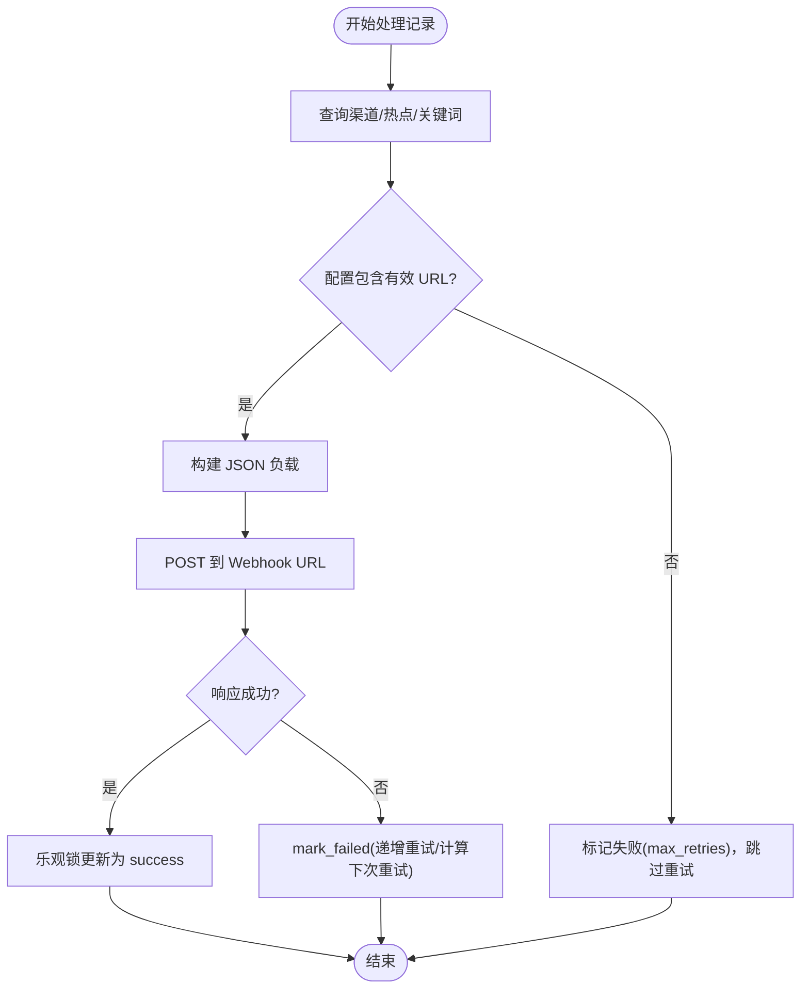
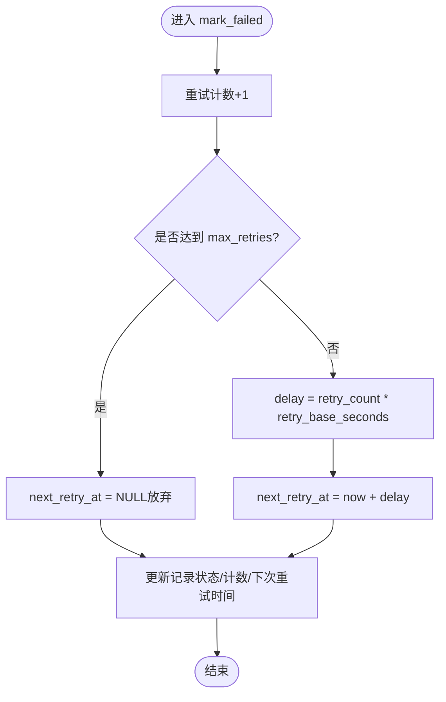
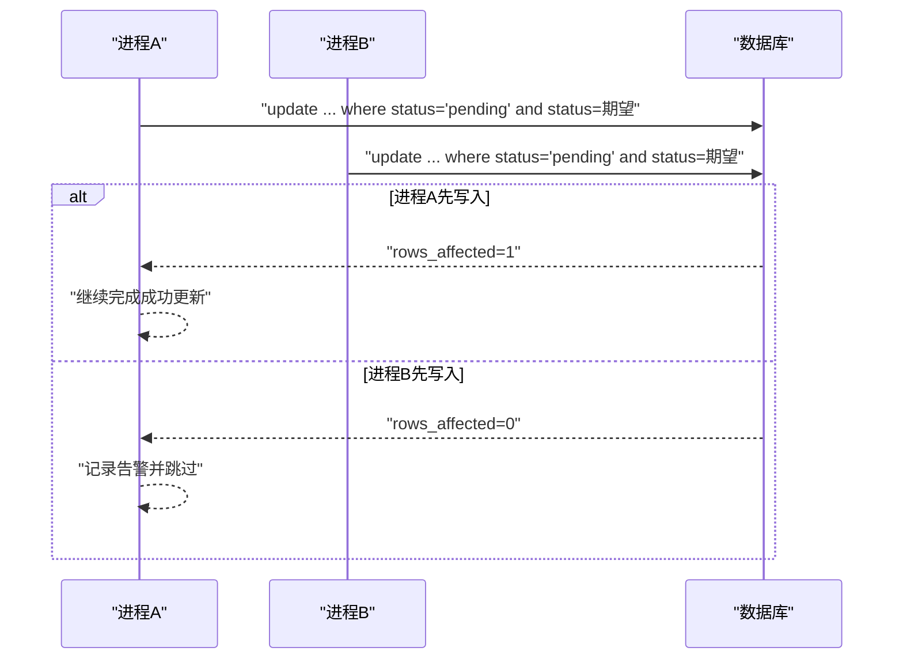
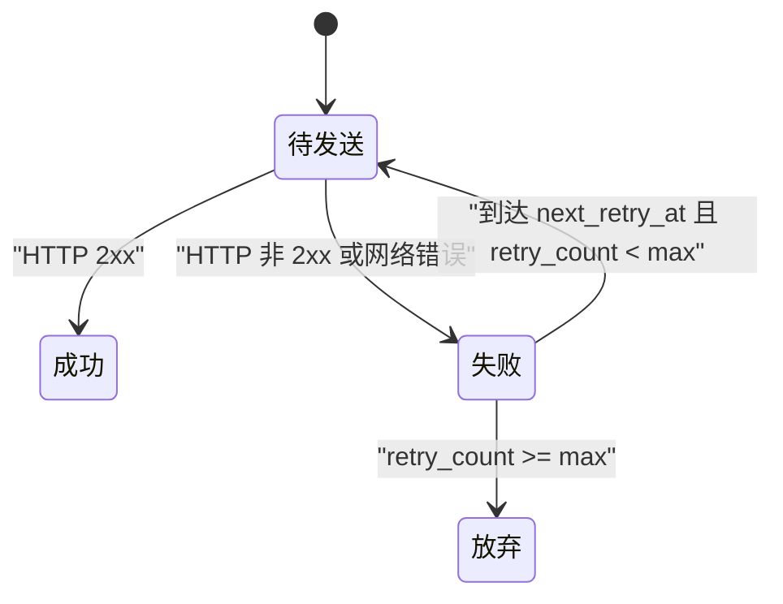
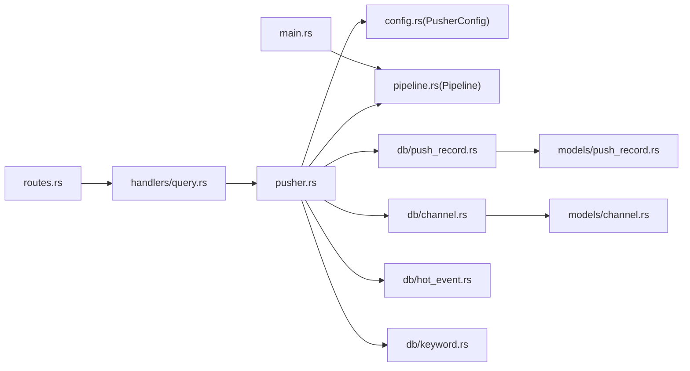

# 推送服务模块（Pusher）

<cite>
**本文引用的文件**
- [src/services/pusher.rs](file://src/services/pusher.rs)
- [src/models/push_record.rs](file://src/models/push_record.rs)
- [src/db/push_record.rs](file://src/db/push_record.rs)
- [src/config.rs](file://src/config.rs)
- [config.toml](file://config.toml)
- [src/db/channel.rs](file://src/db/channel.rs)
- [src/db/hot_event.rs](file://src/db/hot_event.rs)
- [src/db/keyword.rs](file://src/db/keyword.rs)
- [src/models/channel.rs](file://src/models/channel.rs)
- [src/pipeline.rs](file://src/pipeline.rs)
- [src/main.rs](file://src/main.rs)
- [src/handlers/query.rs](file://src/handlers/query.rs)
- [src/routes.rs](file://src/routes.rs)
- [docs/migrations/20260607044921_init.sql](file://docs/migrations/20260607044921_init.sql)
- [openspec/specs/pusher-module/spec.md](file://openspec/specs/pusher-module/spec.md)
- [openspec/changes/event-driven-pipeline/specs/pusher-module/spec.md](file://openspec/changes/event-driven-pipeline/specs/pusher-module/spec.md)
- [openspec/specs/trigger-apis/spec.md](file://openspec/specs/trigger-apis/spec.md)
</cite>

## 目录
1. [简介](#简介)
2. [项目结构](#项目结构)
3. [核心组件](#核心组件)
4. [架构总览](#架构总览)
5. [详细组件分析](#详细组件分析)
6. [依赖关系分析](#依赖关系分析)
7. [性能考量](#性能考量)
8. [故障排查指南](#故障排查指南)
9. [结论](#结论)
10. [附录](#附录)

## 简介
本文件为"推送服务模块（Pusher）"的技术文档，聚焦以下主题：
- Webhook 推送机制：HTTP 请求构建、响应处理与错误分类
- 指数退避重试算法：重试间隔计算、最大重试次数与退避因子配置
- 乐观锁防重复推送：版本号管理与并发冲突处理
- PushRecord 数据模型：状态流转与生命周期
- 推送渠道配置：URL 模板、请求头与认证方式
- **事件驱动混合模式**：基于上游通知的响应式处理与固定轮询的结合
- 错误处理策略、性能监控指标与故障恢复机制
- 实际配置示例与最佳实践

## 项目结构
推送服务位于后端服务层，围绕数据库中的热点事件与推送记录进行事件驱动的混合模式执行。系统通过 Pipeline 事件总线接收上游模块的通知，同时保留固定轮询作为后备机制，通过 HTTP Webhook 将消息推送到配置的通道。

```mermaid
graph TB
subgraph "事件驱动管道"
PIPE["src/pipeline.rs<br/>Pipeline 事件总线"]
ART["articles_ready_tx<br/>文章就绪信号"]
PUSH["push_ready_tx<br/>推送就绪信号"]
END
subgraph "配置"
CFG["config.toml<br/>[pusher] 配置"]
CCFG["src/config.rs<br/>PusherConfig 结构"]
end
subgraph "服务层"
SVC["src/services/pusher.rs<br/>run_pusher_once/start_pusher_loop/process_one/mark_failed"]
end
subgraph "数据库访问层"
DBR["src/db/push_record.rs<br/>查询/更新推送记录"]
DBC["src/db/channel.rs<br/>查询/更新推送渠道"]
DBH["src/db/hot_event.rs<br/>查询热点事件"]
DBK["src/db/keyword.rs<br/>查询关键词"]
end
subgraph "模型"
MR["src/models/push_record.rs<br/>PushRecord"]
MC["src/models/channel.rs<br/>PushChannel"]
end
subgraph "触发接口"
TRG["src/handlers/query.rs<br/>POST /api/v1/trigger/pusher"]
end
CFG --> CCFG --> SVC
PIPE --> PUSH --> SVC
TRG --> SVC
SVC --> DBR
SVC --> DBC
SVC --> DBH
SVC --> DBK
DBR --> MR
DBC --> MC
```

**图表来源**
- [src/services/pusher.rs:255-279](file://src/services/pusher.rs#L255-L279)
- [src/pipeline.rs:12-44](file://src/pipeline.rs#L12-L44)
- [src/db/push_record.rs:1-154](file://src/db/push_record.rs#L1-L154)
- [src/db/channel.rs:1-88](file://src/db/channel.rs#L1-L88)
- [src/db/hot_event.rs:1-124](file://src/db/hot_event.rs#L1-L124)
- [src/db/keyword.rs:1-108](file://src/db/keyword.rs#L1-L108)
- [src/models/push_record.rs:1-16](file://src/models/push_record.rs#L1-L16)
- [src/models/channel.rs:1-25](file://src/models/channel.rs#L1-L25)
- [src/config.rs:50-55](file://src/config.rs#L50-L55)
- [config.toml:23-26](file://config.toml#L23-L26)
- [src/handlers/query.rs:166-172](file://src/handlers/query.rs#L166-L172)

**章节来源**
- [src/services/pusher.rs:255-279](file://src/services/pusher.rs#L255-L279)
- [src/pipeline.rs:12-44](file://src/pipeline.rs#L12-L44)
- [src/db/push_record.rs:1-154](file://src/db/push_record.rs#L1-L154)
- [src/db/channel.rs:1-88](file://src/db/channel.rs#L1-L88)
- [src/db/hot_event.rs:1-124](file://src/db/hot_event.rs#L1-L124)
- [src/db/keyword.rs:1-108](file://src/db/keyword.rs#L1-L108)
- [src/models/push_record.rs:1-16](file://src/models/push_record.rs#L1-L16)
- [src/models/channel.rs:1-25](file://src/models/channel.rs#L1-L25)
- [src/config.rs:50-55](file://src/config.rs#L50-L55)
- [config.toml:23-26](file://config.toml#L23-L26)
- [src/handlers/query.rs:166-172](file://src/handlers/query.rs#L166-L172)

## 核心组件
- **推送器服务**：负责在事件驱动与固定轮询之间切换，构建 Webhook 请求、处理响应与失败重试、使用乐观锁更新状态。
- **事件驱动管道**：通过 Pipeline 结构实现模块间通信，支持上游模块的即时通知与下游模块的快速响应。
- **数据模型**：PushRecord 描述一次推送任务的元数据；PushChannel 描述推送渠道及其配置。
- **数据访问层**：封装对 push_records、push_channels、hot_events、keywords 的查询与更新。
- **配置系统**：PusherConfig 提供轮询间隔、最大重试次数、基础重试秒数等参数。
- **触发接口**：手动触发一次推送迭代，便于调试与应急。

**章节来源**
- [src/services/pusher.rs:255-279](file://src/services/pusher.rs#L255-L279)
- [src/pipeline.rs:12-44](file://src/pipeline.rs#L12-L44)
- [src/models/push_record.rs:5-15](file://src/models/push_record.rs#L5-L15)
- [src/models/channel.rs:4-11](file://src/models/channel.rs#L4-L11)
- [src/db/push_record.rs:65-109](file://src/db/push_record.rs#L65-L109)
- [src/config.rs:50-55](file://src/config.rs#L50-L55)
- [src/handlers/query.rs:166-172](file://src/handlers/query.rs#L166-L172)

## 架构总览
推送服务采用"事件驱动 + 固定轮询"的混合模式。通过 Pipeline 事件总线实现上游模块的即时通知，同时保留固定轮询作为后备机制，确保即使上游模块出现异常也能保证推送任务的最终执行。

```mermaid
sequenceDiagram
participant Timer as "定时器"
participant Loop as "start_pusher_loop"
participant Pipe as "Pipeline.push_rx"
participant Svc as "run_pusher_once"
participant DB as "数据库层"
participant Net as "HTTP 客户端"
participant Ch as "推送渠道"
loop 事件驱动模式
Pipe->>Loop : "收到 PipelineEvent : : NewData"
Loop->>Svc : "立即执行 run_pusher_once"
end
loop 固定轮询模式
Timer->>Loop : "到达 interval_seconds"
Loop->>Svc : "run_pusher_once(pool, config)"
end
Svc->>DB : "查询 pending 与 retry_due 记录"
DB-->>Svc : "返回可推送记录集"
loop 对每条记录
Svc->>DB : "lookup 渠道/热点事件/关键词"
Svc->>Net : "POST Webhook URL(JSON 负载)"
alt 响应成功
Svc->>DB : "乐观锁更新为 success"
else 响应失败或网络错误
Svc->>DB : "mark_failed(递增重试计数/计算下次重试时间)"
end
end
Note over Svc,Ch : "手动触发时同样调用 run_pusher_once"
```

**图表来源**
- [src/services/pusher.rs:255-279](file://src/services/pusher.rs#L255-L279)
- [src/pipeline.rs:6-9](file://src/pipeline.rs#L6-L9)
- [src/services/pusher.rs:13-45](file://src/services/pusher.rs#L13-L45)
- [src/services/pusher.rs:206-244](file://src/services/pusher.rs#L206-L244)
- [src/db/push_record.rs:45-63](file://src/db/push_record.rs#L45-L63)
- [src/db/channel.rs:32-40](file://src/db/channel.rs#L32-L40)
- [src/db/hot_event.rs:50-58](file://src/db/hot_event.rs#L50-L58)
- [src/db/keyword.rs:33-38](file://src/db/keyword.rs#L33-L38)

## 详细组件分析

### Webhook 推送机制
- **请求构建**
  - 从推送渠道配置中提取 webhook URL（JSON 字段），若缺失则标记失败并跳过。
  - 构建 JSON 负载，包含消息类型、文本内容及关键统计信息（关键词、计数、小时桶、均值与标准差）。
- **响应处理**
  - 成功状态码：记录成功并使用乐观锁更新状态；若乐观锁失败（被其他进程抢先更新），记录告警但不报错。
  - 失败状态码或网络错误：进入失败处理流程。
- **错误分类**
  - 渠道配置缺失：直接标记失败并放弃重试。
  - HTTP 非成功：按失败处理。
  - 网络异常：按失败处理。



**图表来源**
- [src/services/pusher.rs:48-204](file://src/services/pusher.rs#L48-L204)
- [src/db/push_record.rs:87-109](file://src/db/push_record.rs#L87-L109)

**章节来源**
- [src/services/pusher.rs:48-204](file://src/services/pusher.rs#L48-L204)
- [src/db/push_record.rs:87-109](file://src/db/push_record.rs#L87-L109)

### 指数退避重试算法
- **重试间隔计算**
  - 下次重试时间 = 当前时间 + 重试次数 × 基础秒数（线性增长，非指数）
  - 该实现以"步进式递增"替代指数退避，降低极端情况下的延迟放大效应。
- **最大重试次数**
  - 达到上限后不再安排下次重试（next_retry_at 设为 NULL）。
- **退避因子配置**
  - 通过配置项 retry_base_seconds 控制每次递增的秒数。
  - 通过配置项 max_retries 控制最大尝试次数。
- **重试触发条件**
  - 查询失败且未达上限、且已到下次重试时间。



**图表来源**
- [src/services/pusher.rs:209-244](file://src/services/pusher.rs#L209-L244)
- [src/db/push_record.rs:65-84](file://src/db/push_record.rs#L65-L84)
- [src/config.rs:50-55](file://src/config.rs#L50-L55)
- [config.toml:23-26](file://config.toml#L23-L26)

**章节来源**
- [src/services/pusher.rs:209-244](file://src/services/pusher.rs#L209-L244)
- [src/db/push_record.rs:53-63](file://src/db/push_record.rs#L53-L63)
- [src/config.rs:50-55](file://src/config.rs#L50-L55)
- [config.toml:23-26](file://config.toml#L23-L26)

### 乐观锁防重复推送策略
- **并发场景**
  - 多个进程可能同时看到同一条"待推送"记录并准备发送；为避免重复投递与状态竞争，采用"期望状态匹配"的更新策略。
- **实现细节**
  - 更新语句中增加"status = ?"条件，仅当当前状态与预期一致时才更新。
  - 返回受影响行数，若为 0 表示已被其他进程抢先更新，记录警告并跳过。
- **效果**
  - 在高并发下保证"至多一次"投递，避免重复通知与状态混乱。



**图表来源**
- [src/db/push_record.rs:87-109](file://src/db/push_record.rs#L87-L109)
- [openspec/specs/pusher-module/spec.md:87-100](file://openspec/specs/pusher-module/spec.md#L87-L100)

**章节来源**
- [src/db/push_record.rs:87-109](file://src/db/push_record.rs#L87-L109)
- [openspec/specs/pusher-module/spec.md:87-100](file://openspec/specs/pusher-module/spec.md#L87-L100)

### PushRecord 数据模型与状态流转
- **字段说明**
  - id、hot_event_id、channel_id、status、retry_count、next_retry_at、created_at、updated_at
- **生命周期与状态机**
  - 创建：插入记录，默认状态为"pending"，重试计数为 0
  - 待发送：状态为"pending"
  - 发送成功：状态转为"success"，使用乐观锁更新
  - 发送失败：状态转为"failed"，递增重试计数并计算下次重试时间
  - 放弃重试：达到最大重试次数后，下次重试时间为 NULL
- **查询与聚合**
  - 支持按状态查询、按下次重试时间排序、按热点事件聚合显示渠道名称等



**图表来源**
- [src/models/push_record.rs:5-15](file://src/models/push_record.rs#L5-L15)
- [src/db/push_record.rs:45-63](file://src/db/push_record.rs#L45-L63)
- [docs/migrations/20260607044921_init.sql:105-117](file://docs/migrations/20260607044921_init.sql#L105-L117)

**章节来源**
- [src/models/push_record.rs:5-15](file://src/models/push_record.rs#L5-L15)
- [src/db/push_record.rs:45-63](file://src/db/push_record.rs#L45-L63)
- [docs/migrations/20260607044921_init.sql:105-117](file://docs/migrations/20260607044921_init.sql#L105-L117)

### 推送渠道配置
- **存储与类型**
  - 渠道类型默认为"webhook"，配置以 JSON 文本存储，字段包含 URL 等
- **配置提取**
  - 从 JSON 中读取"url"字段作为 Webhook 地址
- **请求头与认证**
  - 当前实现未在请求中显式设置额外请求头或认证头；如需扩展，请在服务层添加相应逻辑
- **启用控制**
  - 通过 enabled 字段控制渠道启用状态

**章节来源**
- [src/models/channel.rs:4-11](file://src/models/channel.rs#L4-L11)
- [src/db/channel.rs:32-40](file://src/db/channel.rs#L32-L40)
- [src/services/pusher.rs:246-251](file://src/services/pusher.rs#L246-L251)
- [docs/migrations/20260607044921_init.sql:94-100](file://docs/migrations/20260607044921_init.sql#L94-L100)

### 事件驱动混合模式
- **事件总线初始化**
  - Pipeline 结构在应用启动时创建，包含两个 mpsc 通道和一个共享的 CancellationToken
  - channels 容量为 16，支持最多 16 个未处理的事件信号
- **事件传播机制**
  - Filter 模块在创建新的推送记录后，通过 push_ready_tx.try_send 发送 PipelineEvent::NewData
  - Pusher 模块通过 push_rx 接收事件，立即执行推送逻辑
- **混合调度策略**
  - 使用 tokio::select! 同时监听三个信号源：
    - CancellationToken：优雅关闭
    - interval.tick()：固定轮询（后备机制）
    - push_rx.recv()：上游通知（事件驱动）
- **非阻塞发送策略**
  - 使用 try_send 避免阻塞上游模块
  - 当通道满时返回 TrySendError::Full，上游模块忽略错误并依赖轮询保证最终处理

**章节来源**
- [src/pipeline.rs:12-44](file://src/pipeline.rs#L12-L44)
- [src/services/pusher.rs:255-279](file://src/services/pusher.rs#L255-L279)
- [openspec/changes/event-driven-pipeline/specs/pusher-module/spec.md:3-26](file://openspec/changes/event-driven-pipeline/specs/pusher-module/spec.md#L3-L26)
- [openspec/changes/event-driven-pipeline/specs/event-driven-pipeline/spec.md:19-37](file://openspec/changes/event-driven-pipeline/specs/event-driven-pipeline/spec.md#L19-L37)

### 手动触发与后台循环
- **后台循环**
  - 以配置的 interval_seconds 为周期调用 run_pusher_once
  - 同时监听上游模块的通知信号，实现即时响应
- **手动触发**
  - 提供 /api/v1/trigger/pusher 接口，直接执行 run_pusher_once 函数，便于调试与应急

**章节来源**
- [src/services/pusher.rs:255-279](file://src/services/pusher.rs#L255-L279)
- [src/handlers/query.rs:166-172](file://src/handlers/query.rs#L166-L172)
- [openspec/specs/trigger-apis/spec.md:17-29](file://openspec/specs/trigger-apis/spec.md#L17-L29)
- [openspec/specs/pusher-module/spec.md:9-22](file://openspec/specs/pusher-module/spec.md#L9-L22)

## 依赖关系分析
- **组件耦合**
  - 服务层依赖配置、数据库访问层、Pipeline 事件总线与外部 HTTP 客户端
  - 数据库访问层依赖模型与 SQL 查询
  - Pipeline 作为共享依赖，被多个模块使用
- **外部依赖**
  - reqwest 用于 HTTP 请求
  - sqlx 用于 SQLite 访问
  - serde/serde_json 用于 JSON 解析与序列化
  - tokio::select! 用于多信号源协调
- **可能的循环依赖**
  - 未发现直接循环导入；模块职责清晰



**图表来源**
- [src/services/pusher.rs:1-8](file://src/services/pusher.rs#L1-L8)
- [src/config.rs:50-55](file://src/config.rs#L50-L55)
- [src/pipeline.rs:12-44](file://src/pipeline.rs#L12-L44)
- [src/db/push_record.rs:1-4](file://src/db/push_record.rs#L1-L4)
- [src/db/channel.rs:1-3](file://src/db/channel.rs#L1-L3)
- [src/db/hot_event.rs:1-3](file://src/db/hot_event.rs#L1-L3)
- [src/db/keyword.rs:1-3](file://src/db/keyword.rs#L1-L3)
- [src/models/push_record.rs:1-3](file://src/models/push_record.rs#L1-L3)
- [src/models/channel.rs:1-2](file://src/models/channel.rs#L1-L2)
- [src/main.rs:103-108](file://src/main.rs#L103-L108)
- [src/routes.rs:49-51](file://src/routes.rs#L49-L51)
- [src/handlers/query.rs:166-172](file://src/handlers/query.rs#L166-L172)

**章节来源**
- [src/services/pusher.rs:1-8](file://src/services/pusher.rs#L1-L8)
- [src/config.rs:50-55](file://src/config.rs#L50-L55)
- [src/pipeline.rs:12-44](file://src/pipeline.rs#L12-L44)
- [src/db/push_record.rs:1-4](file://src/db/push_record.rs#L1-L4)
- [src/db/channel.rs:1-3](file://src/db/channel.rs#L1-L3)
- [src/db/hot_event.rs:1-3](file://src/db/hot_event.rs#L1-L3)
- [src/db/keyword.rs:1-3](file://src/db/keyword.rs#L1-L3)
- [src/models/push_record.rs:1-3](file://src/models/push_record.rs#L1-L3)
- [src/models/channel.rs:1-2](file://src/models/channel.rs#L1-L2)
- [src/main.rs:103-108](file://src/main.rs#L103-L108)
- [src/routes.rs:49-51](file://src/routes.rs#L49-L51)
- [src/handlers/query.rs:166-172](file://src/handlers/query.rs#L166-L172)

## 性能考量
- **查询效率**
  - push_records 表对 status 建有索引，有利于快速筛选待处理与可重试记录
- **并发控制**
  - 使用乐观锁减少写冲突带来的回滚与重试成本
- **I/O 优化**
  - 单次迭代批量处理，减少数据库往返
- **事件驱动优势**
  - 上游模块创建推送记录后立即触发，减少延迟
  - 非阻塞发送避免影响上游模块性能
- **容量管理**
  - 通道容量 16 适合大多数场景，避免内存占用过大
  - 满通道时的非阻塞行为确保系统稳定性
- **建议**
  - 若热点事件量级增大，可考虑分页或限流策略
  - 对外部 Webhook 的超时与并发连接数进行合理限制

**章节来源**
- [docs/migrations/20260607044921_init.sql:117](file://docs/migrations/20260607044921_init.sql#L117)
- [src/db/push_record.rs:45-63](file://src/db/push_record.rs#L45-L63)
- [src/pipeline.rs:32-33](file://src/pipeline.rs#L32-L33)
- [openspec/changes/event-driven-pipeline/specs/event-driven-pipeline/spec.md:33-37](file://openspec/changes/event-driven-pipeline/specs/event-driven-pipeline/spec.md#L33-L37)

## 故障排查指南
- **常见问题与定位**
  - 渠道配置缺失：检查 channel.config 是否包含 url 字段
  - HTTP 非成功：查看响应状态码与目标服务日志
  - 网络错误：检查网络连通性与防火墙策略
  - 乐观锁失败：多个进程同时处理同一条记录，属并发正常现象
  - 达到最大重试仍失败：确认目标服务是否可用，必要时调整 max_retries 或 retry_base_seconds
  - 事件丢失：检查上游模块是否正确发送 PipelineEvent::NewData
  - 轮询失效：确认 interval_seconds 配置是否合理
- **日志与可观测性**
  - 成功/失败/警告/错误级别日志已覆盖关键路径
  - 建议结合追踪系统（如 tracing）收集上下文信息
  - 监控事件驱动与轮询两种模式的执行频率
- **恢复机制**
  - 自动重试：基于 next_retry_at 与 retry_count 的组合
  - 事件驱动：上游模块创建推送记录后立即触发
  - 固定轮询：作为后备机制确保最终执行
  - 手动触发：通过 /api/v1/trigger/pusher 快速恢复

**章节来源**
- [src/services/pusher.rs:48-204](file://src/services/pusher.rs#L48-L204)
- [src/services/pusher.rs:209-244](file://src/services/pusher.rs#L209-L244)
- [src/db/push_record.rs:87-109](file://src/db/push_record.rs#L87-L109)
- [src/handlers/query.rs:166-172](file://src/handlers/query.rs#L166-L172)
- [src/pipeline.rs:32-33](file://src/pipeline.rs#L32-L33)

## 结论
本推送服务模块通过重大重构实现了从固定轮询到事件驱动混合模式的升级。新的 Pipeline 事件总线设计使得系统能够响应式地处理上游模块的通知，同时保留固定轮询作为可靠的后备机制。通过明确的配置项、清晰的状态机与乐观锁策略，系统在高并发场景下仍能保持稳定与可预测的行为。事件驱动模式显著降低了推送延迟，提高了系统的实时性和响应速度。

## 附录

### 配置项说明与示例
- **[pusher] 配置**
  - interval_seconds：轮询间隔（秒）
  - max_retries：最大重试次数
  - retry_base_seconds：每次重试递增量（秒）
- **示例**
  - 参考配置文件中的 [pusher] 段落

**章节来源**
- [src/config.rs:50-55](file://src/config.rs#L50-L55)
- [config.toml:23-26](file://config.toml#L23-L26)

### 数据库模式要点
- **push_channels**：存储渠道名称、类型与 JSON 配置
- **push_records**：存储热点事件与渠道的关联、状态、重试计数与下次重试时间
- **索引与约束**：对 status 建有索引；(hot_event_id, channel_id) 唯一约束

**章节来源**
- [docs/migrations/20260607044921_init.sql:94-117](file://docs/migrations/20260607044921_init.sql#L94-L117)

### 最佳实践
- **渠道配置**
  - 为每个目标平台维护独立的渠道配置，确保 url 正确
  - 如需认证或自定义头，请在服务层扩展（当前实现未内置）
- **重试策略**
  - 根据下游服务 SLA 调整 max_retries 与 retry_base_seconds
  - 对于瞬时故障与永久性错误，建议配合业务语义区分
- **并发与幂等**
  - 依赖乐观锁避免重复投递；前端展示以最终状态为准
- **事件驱动优化**
  - 合理设置 interval_seconds，平衡实时性与资源消耗
  - 监控事件丢失率，确保上游模块正确发送通知
  - 利用 try_send 的非阻塞特性提高系统整体性能
- **监控与告警**
  - 关注失败率、平均重试次数、最长等待时间等指标
  - 对连续失败或超时进行告警
  - 监控事件驱动与轮询两种模式的执行效率