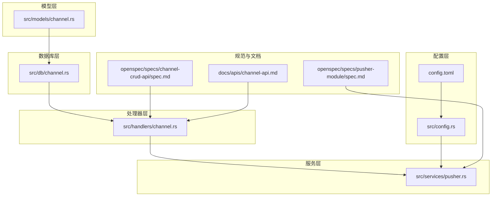
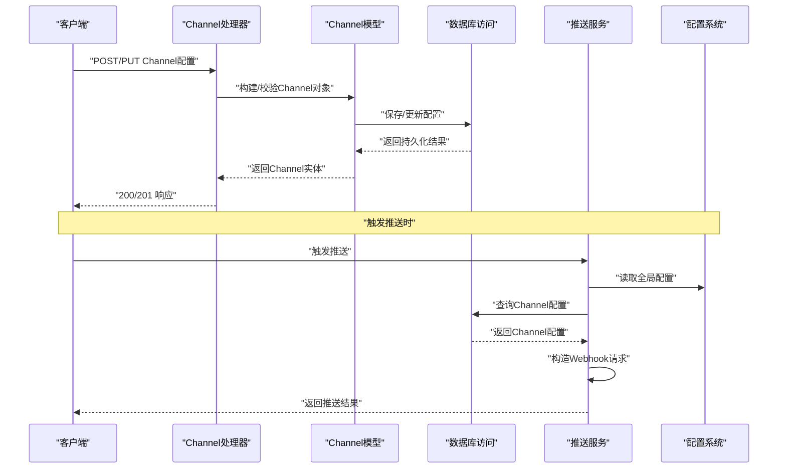
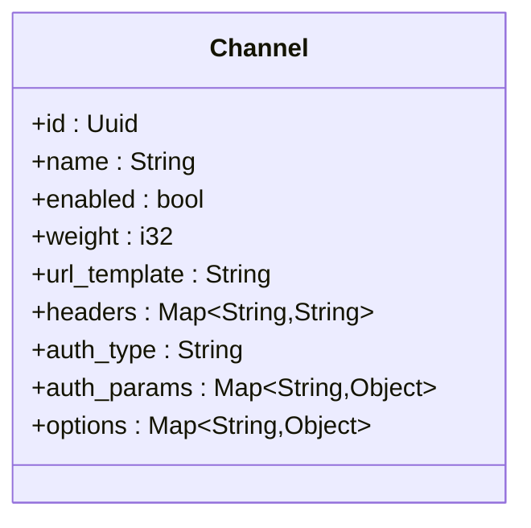
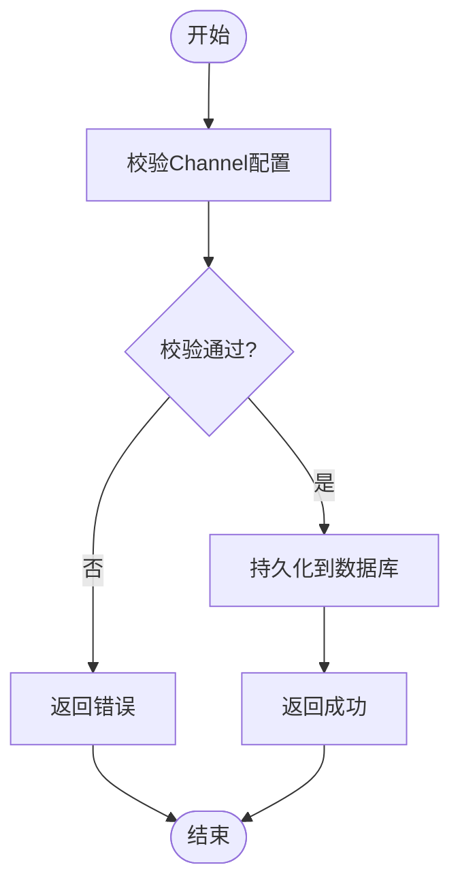
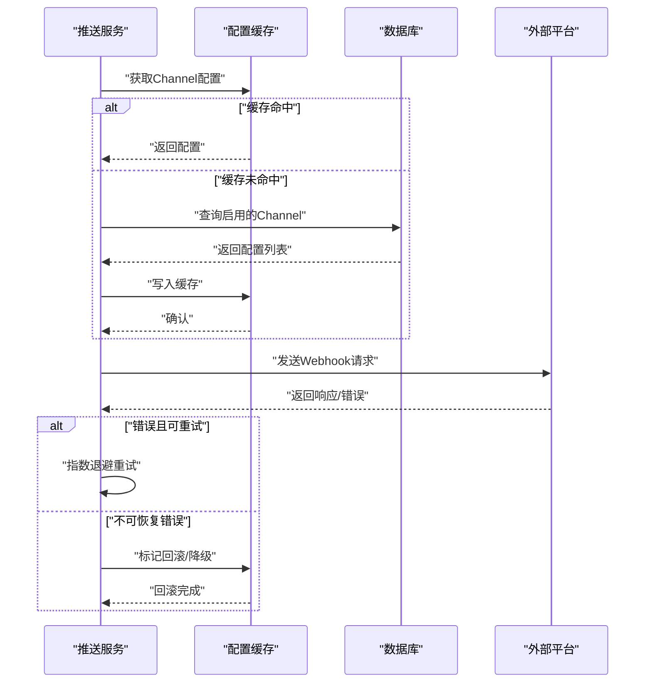
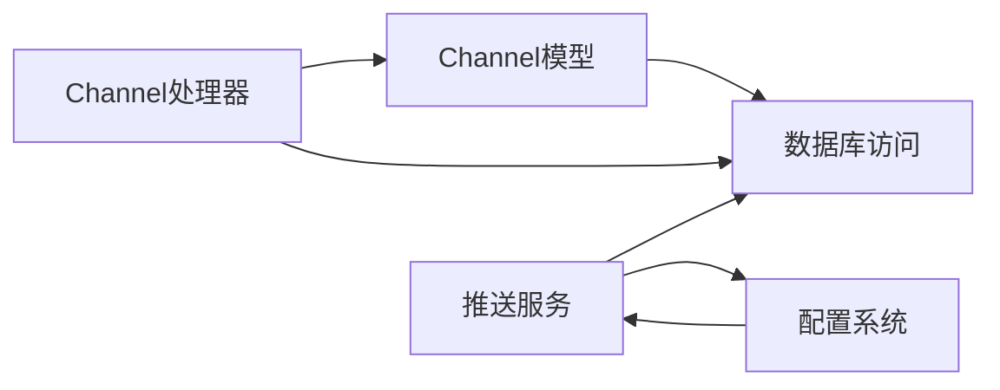

# 推送渠道配置

<cite>
**本文引用的文件**
- [src/models/channel.rs](file://src/models/channel.rs)
- [src/db/channel.rs](file://src/db/channel.rs)
- [src/handlers/channel.rs](file://src/handlers/channel.rs)
- [src/services/pusher.rs](file://src/services/pusher.rs)
- [docs/apis/channel-api.md](file://docs/apis/channel-api.md)
- [openspec/specs/channel-crud-api/spec.md](file://openspec/specs/channel-crud-api/spec.md)
- [openspec/specs/pusher-module/spec.md](file://openspec/specs/pusher-module/spec.md)
- [config.toml](file://config.toml)
- [src/config.rs](file://src/config.rs)
</cite>

## 目录
1. [简介](#简介)
2. [项目结构](#项目结构)
3. [核心组件](#核心组件)
4. [架构总览](#架构总览)
5. [详细组件分析](#详细组件分析)
6. [依赖关系分析](#依赖关系分析)
7. [性能考虑](#性能考虑)
8. [故障排查指南](#故障排查指南)
9. [结论](#结论)
10. [附录](#附录)

## 简介
本技术文档围绕“推送渠道配置”主题，系统性梳理后端在数据库层、模型层、处理器层与推送服务层之间的协作关系，重点解释Channel数据模型的结构设计（配置字段定义、URL模板格式、认证参数设置）、配置文件的JSON结构（必需字段验证、可选参数处理与默认值）、不同推送渠道的配置差异（Webhook URL格式、请求头设置、认证方式选择），以及配置动态加载与热更新机制（验证、错误处理与回滚策略）。同时提供企业微信、钉钉、Slack等平台的集成方法与最佳实践。

## 项目结构
该仓库采用Rust后端工程，按职责分层组织：models（领域模型）、db（数据库访问）、handlers（HTTP处理器）、services（业务服务）、config（全局配置）；同时通过openspec与docs目录沉淀API规范与变更记录。与推送渠道配置直接相关的关键文件如下图所示：

**图表来源**
- [src/models/channel.rs](file://src/models/channel.rs)
- [src/db/channel.rs](file://src/db/channel.rs)
- [src/handlers/channel.rs](file://src/handlers/channel.rs)
- [src/services/pusher.rs](file://src/services/pusher.rs)
- [config.toml](file://config.toml)
- [src/config.rs](file://src/config.rs)
- [openspec/specs/channel-crud-api/spec.md](file://openspec/specs/channel-crud-api/spec.md)
- [openspec/specs/pusher-module/spec.md](file://openspec/specs/pusher-module/spec.md)
- [docs/apis/channel-api.md](file://docs/apis/channel-api.md)

**章节来源**
- [src/models/channel.rs](file://src/models/channel.rs)
- [src/db/channel.rs](file://src/db/channel.rs)
- [src/handlers/channel.rs](file://src/handlers/channel.rs)
- [src/services/pusher.rs](file://src/services/pusher.rs)
- [config.toml](file://config.toml)
- [src/config.rs](file://src/config.rs)
- [openspec/specs/channel-crud-api/spec.md](file://openspec/specs/channel-crud-api/spec.md)
- [openspec/specs/pusher-module/spec.md](file://openspec/specs/pusher-module/spec.md)
- [docs/apis/channel-api.md](file://docs/apis/channel-api.md)

## 核心组件
- Channel数据模型：定义推送渠道的配置字段、URL模板与认证参数，作为数据库持久化与API交互的基础结构。
- 数据库访问：封装Channel的增删改查操作，支持分页查询与条件过滤。
- 处理器层：暴露Channel CRUD的HTTP接口，负责请求解析、参数校验与响应格式化。
- 推送服务：根据Channel配置构造Webhook请求，执行发送逻辑，并处理失败重试与回滚策略。
- 配置系统：从config.toml加载全局配置，结合运行时环境变量进行动态覆盖。

**章节来源**
- [src/models/channel.rs](file://src/models/channel.rs)
- [src/db/channel.rs](file://src/db/channel.rs)
- [src/handlers/channel.rs](file://src/handlers/channel.rs)
- [src/services/pusher.rs](file://src/services/pusher.rs)
- [config.toml](file://config.toml)
- [src/config.rs](file://src/config.rs)

## 架构总览
下图展示了从HTTP请求到推送执行的完整链路，以及配置在其中的作用点：

**图表来源**
- [src/handlers/channel.rs](file://src/handlers/channel.rs)
- [src/models/channel.rs](file://src/models/channel.rs)
- [src/db/channel.rs](file://src/db/channel.rs)
- [src/services/pusher.rs](file://src/services/pusher.rs)
- [src/config.rs](file://src/config.rs)
- [config.toml](file://config.toml)

## 详细组件分析

### Channel数据模型与配置字段
- 字段设计目标：统一描述不同推送渠道的URL模板、请求头、认证方式与可选参数，确保推送服务能够以最小适配成本支持多平台。
- 关键字段类别：
  - 基础信息：名称、启用状态、排序权重等。
  - URL模板：包含占位符的Webhook地址，支持动态替换如{tenant_id}、{channel_id}等。
  - 请求头：固定或动态生成的头部键值对，如Content-Type、Authorization等。
  - 认证参数：支持多种认证方式（如签名、Token、Basic等）及其参数（密钥、算法、过期时间等）。
  - 可选参数：超时、重试次数、并发限制、日志级别等。
- 默认值与约束：未显式提供的可选参数应有明确默认值；必填字段需在模型层与处理器层共同保证校验通过。

**图表来源**
- [src/models/channel.rs](file://src/models/channel.rs)

**章节来源**
- [src/models/channel.rs](file://src/models/channel.rs)

### 数据库访问与CRUD接口
- 数据库表结构：包含Channel的核心字段，支持索引优化（如启用状态、权重）。
- 查询能力：分页查询、按启用状态筛选、按权重排序、模糊匹配名称等。
- 写入流程：插入与更新均需经过模型校验与事务控制，避免脏数据进入生产环境。
- 并发控制：写入冲突时采用乐观锁或唯一约束，保障一致性。

**图表来源**
- [src/db/channel.rs](file://src/db/channel.rs)
- [src/models/channel.rs](file://src/models/channel.rs)

**章节来源**
- [src/db/channel.rs](file://src/db/channel.rs)
- [src/handlers/channel.rs](file://src/handlers/channel.rs)

### 处理器层：Channel CRUD API
- 路由与方法：提供创建、读取、更新、删除与列表查询接口，遵循REST风格。
- 参数解析：从请求体解析JSON，转换为Channel对象；对URL模板与认证参数进行格式校验。
- 校验规则：必填字段缺失、URL模板语法错误、认证参数类型不匹配等均需返回明确错误。
- 响应格式：统一的JSON响应结构，包含状态码、消息与数据体。

**章节来源**
- [src/handlers/channel.rs](file://src/handlers/channel.rs)
- [docs/apis/channel-api.md](file://docs/apis/channel-api.md)
- [openspec/specs/channel-crud-api/spec.md](file://openspec/specs/channel-crud-api/spec.md)

### 推送服务：动态加载与热更新
- 动态加载：启动时从数据库加载所有启用的Channel配置，缓存于内存；定时任务或事件驱动刷新缓存。
- 热更新：监听配置变更事件，原子性替换内存中的Channel集合；旧配置在新配置生效前继续服务，确保无单点停机。
- 验证与回滚：新配置在落库前完成严格校验；若校验失败，保留旧配置不变；若运行中发现异常，快速回滚至上一个稳定版本。
- 错误处理：网络超时、认证失败、平台限流等场景均有明确的重试策略与熔断保护。

**图表来源**
- [src/services/pusher.rs](file://src/services/pusher.rs)
- [src/db/channel.rs](file://src/db/channel.rs)

**章节来源**
- [src/services/pusher.rs](file://src/services/pusher.rs)
- [openspec/specs/pusher-module/spec.md](file://openspec/specs/pusher-module/spec.md)

### 配置文件与动态加载
- 配置来源：config.toml定义全局参数（如数据库连接、日志级别、推送并发上限等）；运行时可通过环境变量覆盖。
- 加载顺序：优先读取config.toml，再应用环境变量覆盖；启动阶段完成初始化并注入到各模块。
- 热更新：支持部分配置的热更新（如日志级别、并发阈值），不涉及数据库Schema变更的配置项可即时生效。

**章节来源**
- [config.toml](file://config.toml)
- [src/config.rs](file://src/config.rs)

### 不同推送渠道的配置差异
- Webhook URL格式：
  - 通用模板：包含协议、域名、路径与必要的路径参数占位符。
  - 平台特例：企业微信、钉钉、Slack等平台可能要求特定路径段或查询参数。
- 请求头设置：
  - Content-Type：常见为application/json。
  - 认证头：如Authorization、X-Signature等，依据平台要求而定。
- 认证方式选择：
  - Token类：携带令牌的Bearer或自定义方案。
  - 签名类：基于密钥与算法生成签名，包含时间戳与随机数等参数。
  - Basic类：用户名/密码组合，适用于部分内部网关。
- 可选参数：
  - 超时：建议设置合理的连接与读取超时。
  - 重试：指数退避策略，最大重试次数与最大等待时间。
  - 并发：限制每通道并发度，避免平台限流。
  - 日志：区分调试与生产日志级别，避免敏感信息泄露。

**章节来源**
- [src/models/channel.rs](file://src/models/channel.rs)
- [src/services/pusher.rs](file://src/services/pusher.rs)

### JSON配置结构与校验
- 必需字段：
  - 名称、启用状态、URL模板、认证类型。
- 可选字段与默认值：
  - 权重、请求头、认证参数、选项（超时、重试、并发、日志级别）。
- 校验规则：
  - URL模板必须可被解析为有效URL并包含必要占位符。
  - 认证参数需与认证类型匹配（如签名需要密钥与算法）。
  - 数值型字段需在合理范围内（如超时、重试次数）。
- 错误处理：
  - 返回明确的错误码与错误信息，便于前端与运维定位问题。

**章节来源**
- [src/models/channel.rs](file://src/models/channel.rs)
- [src/handlers/channel.rs](file://src/handlers/channel.rs)

### 各平台集成示例与最佳实践
- 企业微信：
  - URL模板：包含企业ID与应用ID的路径段。
  - 认证方式：通常使用Token或签名；签名需包含时间戳、随机数与消息体摘要。
  - 请求头：Content-Type为application/json；可附加Authorization。
- 钉钉：
  - URL模板：包含机器人或群会话的标识。
  - 认证方式：支持加签（timestamp+secret）与Token两种模式。
  - 请求头：Content-Type为application/json。
- Slack：
  - URL模板：指向Incoming Webhooks的URL。
  - 认证方式：URL内嵌Token或通过Authorization头传递。
  - 请求头：Content-Type为application/json；可选添加Slack特有的头字段。
- 最佳实践：
  - 使用占位符模板化URL，避免硬编码。
  - 对敏感参数（如密钥、Token）进行加密存储与最小权限管理。
  - 设置合理的超时与重试策略，避免雪崩效应。
  - 开启结构化日志，区分请求上下文与错误堆栈。

**章节来源**
- [src/models/channel.rs](file://src/models/channel.rs)
- [src/services/pusher.rs](file://src/services/pusher.rs)

## 依赖关系分析
- 模型依赖：Channel模型依赖数据库访问层提供的CRUD能力。
- 处理器依赖：Channel处理器依赖模型与数据库访问层，同时受API规范约束。
- 服务依赖：推送服务依赖配置系统与数据库访问层，用于动态加载与执行。
- 配置依赖：配置系统为服务层提供运行参数，影响并发、超时与日志行为。

**图表来源**
- [src/models/channel.rs](file://src/models/channel.rs)
- [src/db/channel.rs](file://src/db/channel.rs)
- [src/handlers/channel.rs](file://src/handlers/channel.rs)
- [src/services/pusher.rs](file://src/services/pusher.rs)
- [src/config.rs](file://src/config.rs)

**章节来源**
- [src/models/channel.rs](file://src/models/channel.rs)
- [src/db/channel.rs](file://src/db/channel.rs)
- [src/handlers/channel.rs](file://src/handlers/channel.rs)
- [src/services/pusher.rs](file://src/services/pusher.rs)
- [src/config.rs](file://src/config.rs)

## 性能考虑
- 缓存策略：将启用的Channel配置缓存于内存，减少数据库压力；定期刷新与事件驱动更新相结合。
- 并发控制：限制每通道并发度，避免平台限流与自身资源耗尽。
- 超时与重试：合理设置连接与读取超时，采用指数退避重试，避免抖动放大。
- 日志与监控：区分日志级别，避免生产环境产生过多I/O；结合指标埋点评估延迟与失败率。

## 故障排查指南
- 常见问题：
  - URL模板无效：检查占位符是否齐全、协议与域名是否正确。
  - 认证失败：核对Token/密钥是否过期、签名算法与参数是否匹配。
  - 超时与重试：调整超时与重试策略，观察平台限流情况。
  - 并发过高：降低并发度或增加重试间隔，避免触发平台风控。
- 回滚策略：当新配置导致大规模失败时，立即回滚至上一稳定版本；同时关闭相关通道，防止进一步影响。
- 日志定位：开启结构化日志，记录请求ID、通道ID、平台响应码与错误堆栈，便于快速定位。

**章节来源**
- [src/services/pusher.rs](file://src/services/pusher.rs)
- [src/handlers/channel.rs](file://src/handlers/channel.rs)

## 结论
通过将Channel配置抽象为统一的数据模型，并在处理器层与服务层分别承担“校验与接口”、“动态加载与执行”的职责，系统实现了对多平台推送渠道的高扩展性与高可用性。配合严格的配置校验、热更新与回滚策略，能够在不影响线上服务的前提下平滑演进推送能力。建议在生产环境中持续完善监控与告警体系，确保配置变更的可观测性与可追溯性。

## 附录
- API参考：详见Channel CRUD API文档与OpenSpec规范。
- 配置样例：参考config.toml与运行时环境变量覆盖方式。

**章节来源**
- [docs/apis/channel-api.md](file://docs/apis/channel-api.md)
- [openspec/specs/channel-crud-api/spec.md](file://openspec/specs/channel-crud-api/spec.md)
- [openspec/specs/pusher-module/spec.md](file://openspec/specs/pusher-module/spec.md)
- [config.toml](file://config.toml)
- [src/config.rs](file://src/config.rs)