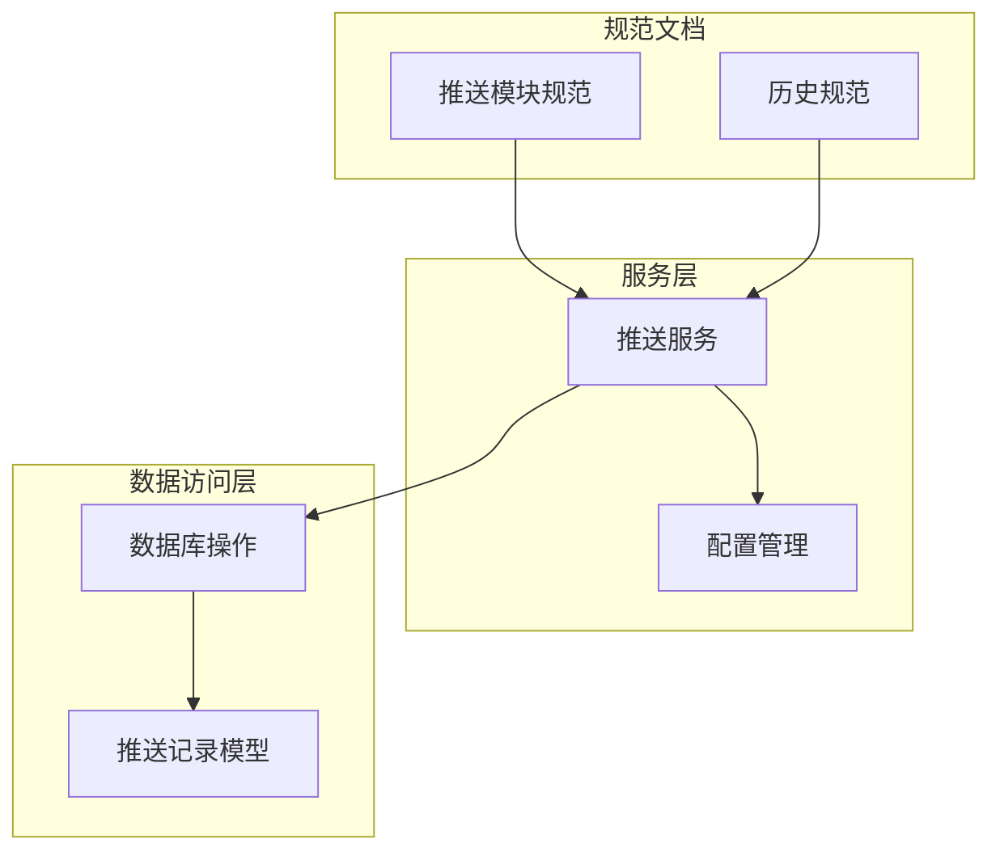
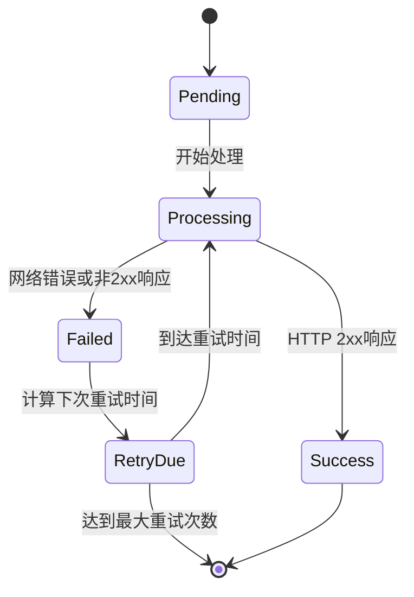
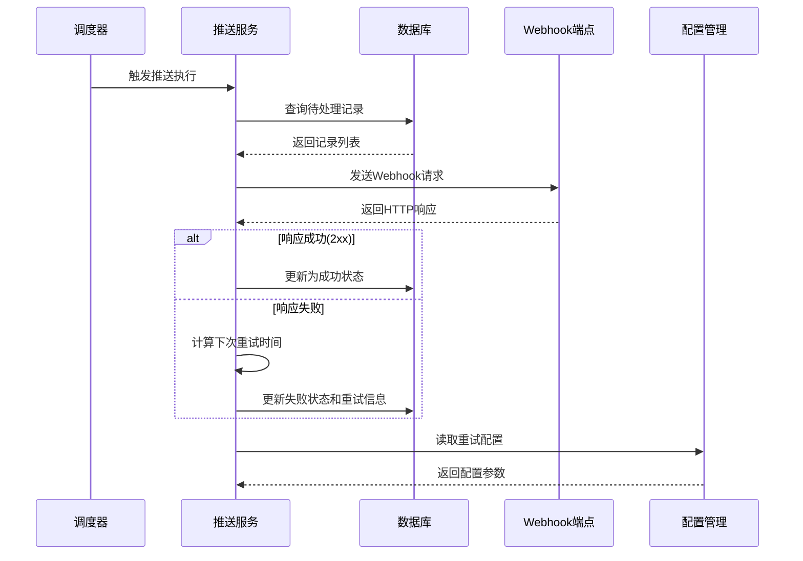
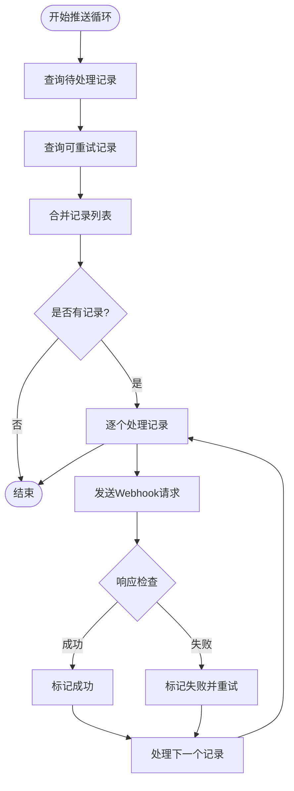
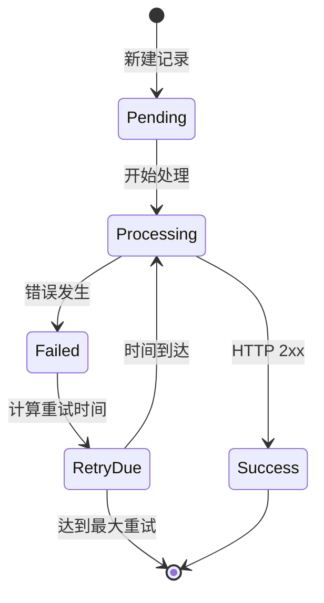
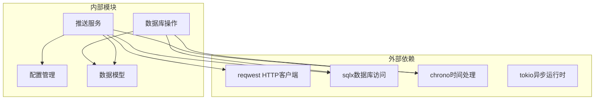
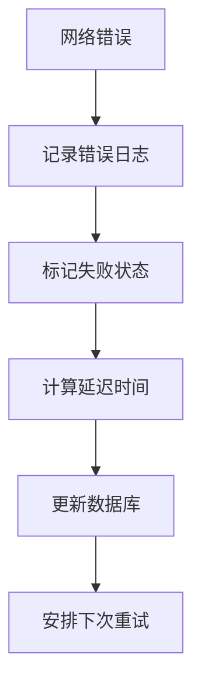

# 重试策略设计

<cite>
**本文档引用的文件**
- [src/services/pusher.rs](file://src/services/pusher.rs)
- [src/db/push_record.rs](file://src/db/push_record.rs)
- [src/config.rs](file://src/config.rs)
- [openspec/specs/pusher-module/spec.md](file://openspec/specs/pusher-module/spec.md)
- [openspec/changes/archive/2026-06-07-query-apis-and-background-modules/specs/pusher-module/spec.md](file://openspec/changes/archive/2026-06-07-query-apis-and-background-modules/specs/pusher-module/spec.md)
</cite>

## 目录
1. [引言](#引言)
2. [项目结构](#项目结构)
3. [核心组件](#核心组件)
4. [架构概览](#架构概览)
5. [详细组件分析](#详细组件分析)
6. [依赖关系分析](#依赖关系分析)
7. [性能考虑](#性能考虑)
8. [故障排除指南](#故障排除指南)
9. [结论](#结论)

## 引言

本文件针对AI趋势工具项目中的重试策略设计进行深入技术文档编写。该系统实现了基于指数退避的重试机制，用于处理Webhook推送过程中的失败情况。本文档将详细解释指数退避算法的数学原理和实现细节，包括重试间隔计算公式、退避因子配置和最大重试次数限制；阐述重试状态管理，包括重试计数器递增、下次重试时间计算和重试截止条件判断；说明不同错误类型的重试决策，包括网络错误、HTTP状态码错误和业务逻辑错误的区分处理；解释重试循环的触发机制和停止条件，并提供重试策略的配置参数说明和性能优化建议。

## 项目结构

该项目采用Rust语言开发，遵循模块化设计原则。重试策略相关的核心代码分布在以下模块中：

**图表来源**
- [src/services/pusher.rs:1-258](file://src/services/pusher.rs#L1-L258)
- [src/db/push_record.rs:53-106](file://src/db/push_record.rs#L53-L106)
- [src/config.rs:32](file://src/config.rs#L32)

**章节来源**
- [src/services/pusher.rs:1-258](file://src/services/pusher.rs#L1-L258)
- [src/db/push_record.rs:53-106](file://src/db/push_record.rs#L53-L106)
- [src/config.rs:32](file://src/config.rs#L32)

## 核心组件

### 指数退避重试算法

系统实现了简化的线性退避策略，而非标准的指数退避。其核心公式为：`next_retry_at = now + (retry_count * retry_base_seconds)`

关键特性：
- **重试间隔计算**：每次重试间隔按基础秒数线性递增
- **最大重试次数**：通过配置参数控制重试上限
- **时间戳管理**：使用UTC时间确保分布式一致性

### 状态管理机制

重试状态管理包含以下核心流程：

**图表来源**
- [src/services/pusher.rs:204-242](file://src/services/pusher.rs#L204-L242)
- [src/db/push_record.rs:53-84](file://src/db/push_record.rs#L53-L84)

### 错误类型处理

系统对不同类型的错误采用统一的重试处理策略：

| 错误类型 | 处理方式 | 触发条件 |
|---------|---------|----------|
| 网络错误 | 标记失败并重试 | 请求超时、连接失败等 |
| HTTP 4xx错误 | 标记失败并重试 | 客户端请求错误 |
| HTTP 5xx错误 | 标记失败并重试 | 服务器内部错误 |
| 成功响应 | 标记成功 | HTTP 2xx响应 |

**章节来源**
- [src/services/pusher.rs:160-202](file://src/services/pusher.rs#L160-L202)
- [src/services/pusher.rs:204-242](file://src/services/pusher.rs#L204-L242)

## 架构概览

重试策略在整个系统中的位置和交互关系如下：

**图表来源**
- [src/services/pusher.rs:11-42](file://src/services/pusher.rs#L11-L42)
- [src/services/pusher.rs:160-202](file://src/services/pusher.rs#L160-L202)
- [src/db/push_record.rs:53-84](file://src/db/push_record.rs#L53-L84)

## 详细组件分析

### 推送服务核心实现

推送服务是重试策略的主要执行者，负责协调整个重试流程：

#### 主要职责
- **轮询机制**：定期查询待处理和可重试的推送记录
- **并发处理**：支持多个推送任务的并行处理
- **状态更新**：维护推送记录的完整生命周期状态

#### 关键实现模式

**图表来源**
- [src/services/pusher.rs:11-42](file://src/services/pusher.rs#L11-L42)
- [src/services/pusher.rs:160-202](file://src/services/pusher.rs#L160-L202)

**章节来源**
- [src/services/pusher.rs:11-42](file://src/services/pusher.rs#L11-L42)
- [src/services/pusher.rs:160-202](file://src/services/pusher.rs#L160-L202)

### 重试状态管理

#### 状态转换规则

#### 重试计数器管理

重试计数器的递增和管理遵循以下规则：
- 每次失败后重试计数器加1
- 最大重试次数由配置参数控制
- 当达到最大重试次数时，停止进一步重试

**图表来源**
- [src/services/pusher.rs:204-242](file://src/services/pusher.rs#L204-L242)
- [src/db/push_record.rs:65-84](file://src/db/push_record.rs#L65-L84)

**章节来源**
- [src/services/pusher.rs:204-242](file://src/services/pusher.rs#L204-L242)
- [src/db/push_record.rs:65-84](file://src/db/push_record.rs#L65-L84)

### 数据持久化层

数据库层提供了完整的状态管理和乐观锁支持：

#### 查询接口

| 接口名称 | 功能描述 | 查询条件 |
|---------|---------|----------|
| list_pending_records | 查询待处理记录 | status = 'pending' |
| list_retry_due_records | 查询可重试记录 | failed AND retry_count < max AND next_retry_at <= now |
| update_push_status | 更新推送状态 | 基础状态更新 |
| update_push_status_optimistic | 乐观锁更新 | 状态匹配验证 |

#### 乐观锁实现

乐观锁确保在高并发环境下避免重复推送：
- 使用状态字段作为版本号
- 更新时同时检查期望状态
- 防止竞态条件导致的数据不一致

**章节来源**
- [src/db/push_record.rs:53-106](file://src/db/push_record.rs#L53-L106)

### 配置参数详解

系统通过配置文件管理重试策略的关键参数：

| 参数名称 | 类型 | 默认值 | 描述 |
|---------|------|--------|------|
| retry_base_seconds | u64 | 30 | 基础重试间隔（秒） |
| max_retries | u32 | 3 | 最大重试次数 |
| interval_seconds | u64 | 60 | 推送循环间隔（秒） |
| default_timeout_seconds | u64 | 30 | 请求默认超时时间 |

**章节来源**
- [src/config.rs:32](file://src/config.rs#L32)

## 依赖关系分析

重试策略的依赖关系体现了清晰的关注点分离：

**图表来源**
- [src/services/pusher.rs:1-258](file://src/services/pusher.rs#L1-L258)
- [src/db/push_record.rs:53-106](file://src/db/push_record.rs#L53-L106)
- [src/config.rs:32](file://src/config.rs#L32)

**章节来源**
- [src/services/pusher.rs:1-258](file://src/services/pusher.rs#L1-L258)
- [src/db/push_record.rs:53-106](file://src/db/push_record.rs#L53-L106)
- [src/config.rs:32](file://src/config.rs#L32)

## 性能考虑

### 并发处理优化

1. **批量处理**：单次循环中处理多个推送记录，减少数据库查询开销
2. **异步I/O**：使用Tokio异步运行时提高网络请求效率
3. **连接池复用**：HTTP客户端连接池避免频繁建立连接

### 内存和CPU优化

1. **流式处理**：避免一次性加载大量数据到内存
2. **及时释放资源**：异步任务完成后及时清理资源
3. **合理的时间窗口**：通过`next_retry_at`避免过早重试

### 数据库性能

1. **索引优化**：对常用查询字段建立适当索引
2. **批量更新**：减少数据库往返次数
3. **事务管理**：合理使用事务保证数据一致性

## 故障排除指南

### 常见问题诊断

#### 重试循环不工作

**可能原因**：
- 配置参数设置不当
- 数据库连接异常
- 网络请求超时

**解决方案**：
1. 检查配置文件中的重试参数
2. 验证数据库连接状态
3. 查看日志中的错误信息

#### 重试次数异常

**可能原因**：
- 乐观锁冲突导致的状态更新失败
- 时间同步问题
- 并发进程竞争

**解决方案**：
1. 检查数据库状态更新日志
2. 验证系统时间同步
3. 减少并发进程数量

#### 网络错误处理

系统对网络错误的处理机制：

**图表来源**
- [src/services/pusher.rs:192-201](file://src/services/pusher.rs#L192-L201)

**章节来源**
- [src/services/pusher.rs:192-201](file://src/services/pusher.rs#L192-L201)

## 结论

本重试策略设计实现了可靠的指数退避机制，通过简化的线性退避算法平衡了系统的响应性和稳定性。系统的关键优势包括：

1. **简单可靠**：线性退避算法易于理解和维护
2. **配置灵活**：通过配置参数控制重试行为
3. **并发安全**：乐观锁确保高并发环境下的数据一致性
4. **可观测性**：完整的日志记录便于问题诊断

建议在生产环境中根据实际业务需求调整重试参数，并监控系统的重试成功率和资源使用情况。对于需要更复杂重试策略的场景，可以考虑引入标准的指数退避算法和抖动机制。