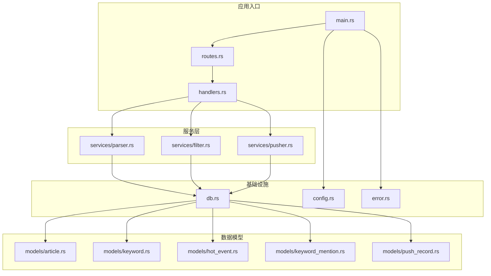
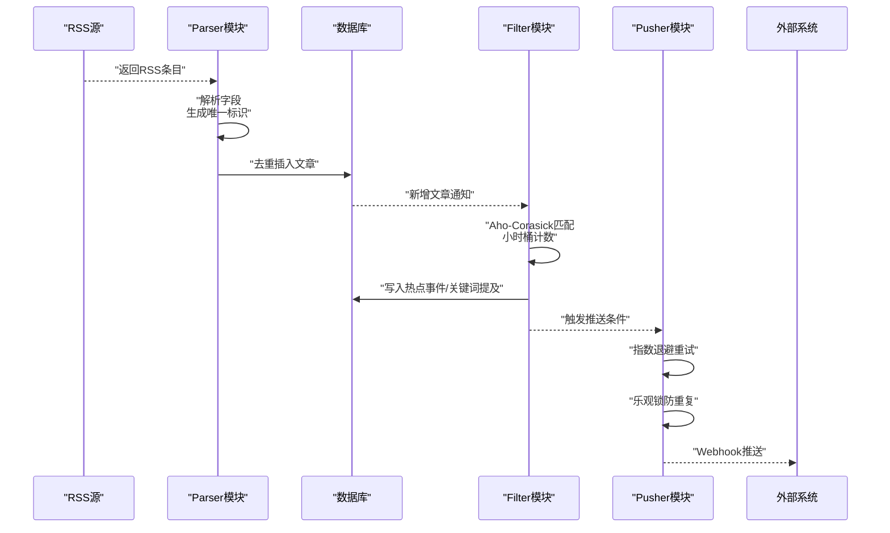
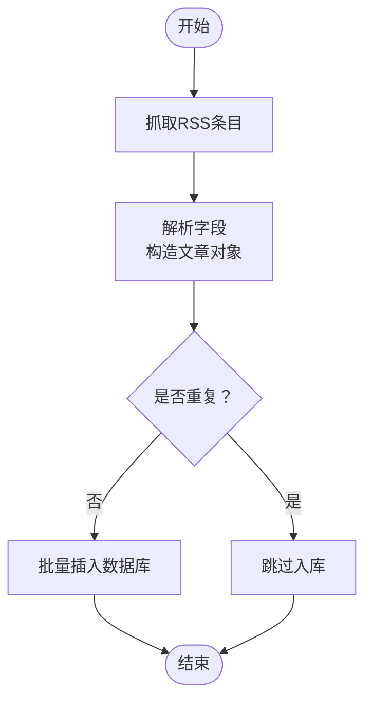
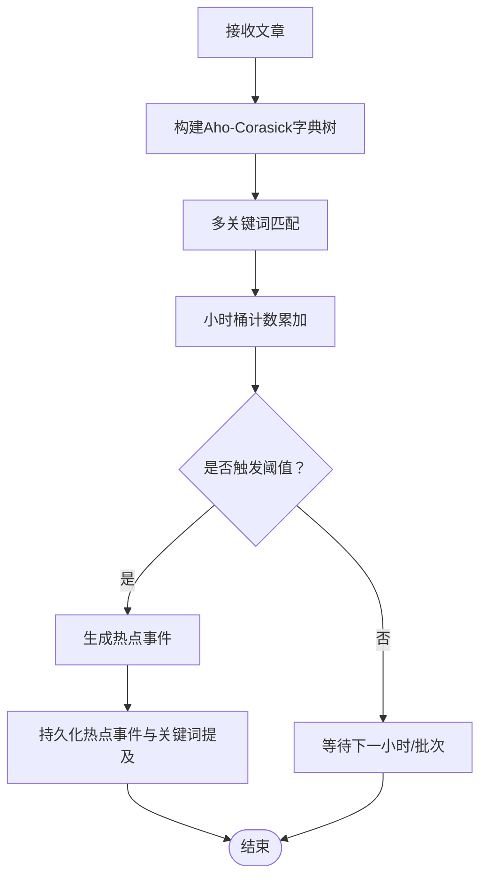
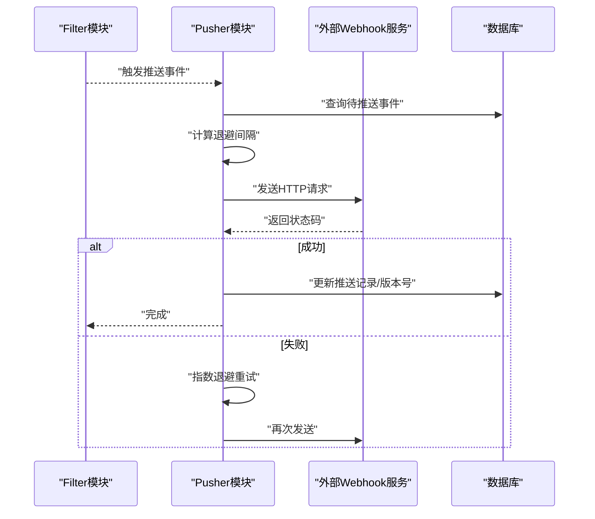
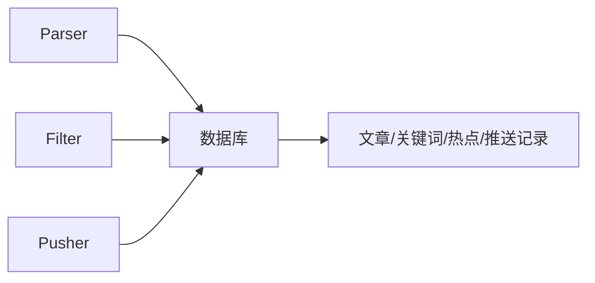

# 核心模块详解

<cite>
**本文引用的文件**
- [parser.rs](file://src/services/parser.rs)
- [filter.rs](file://src/services/filter.rs)
- [pusher.rs](file://src/services/pusher.rs)
- [article.rs](file://src/models/article.rs)
- [keyword.rs](file://src/models/keyword.rs)
- [hot_event.rs](file://src/models/hot_event.rs)
- [keyword_mention.rs](file://src/models/keyword_mention.rs)
- [push_record.rs](file://src/models/push_record.rs)
- [db.rs](file://src/db.rs)
- [config.rs](file://src/config.rs)
- [main.rs](file://src/main.rs)
- [routes.rs](file://src/routes.rs)
- [handlers.rs](file://src/handlers.rs)
- [error.rs](file://src/error.rs)
- [parser-module 规格](file://openspec/specs/parser-module/spec.md)
- [filter-module 规格](file://openspec/specs/filter-module/spec.md)
- [pusher-module 规格](file://openspec/specs/pusher-module/spec.md)
</cite>

## 目录
1. [引言](#引言)
2. [项目结构](#项目结构)
3. [核心组件](#核心组件)
4. [架构总览](#架构总览)
5. [详细组件分析](#详细组件分析)
6. [依赖分析](#依赖分析)
7. [性能考虑](#性能考虑)
8. [故障排除指南](#故障排除指南)
9. [结论](#结论)
10. [附录](#附录)

## 引言
本文件面向AI趋势监控系统的核心业务模块：Parser（采集与解析）、Filter（关键词过滤与热点检测）、Pusher（事件推送）。文档从架构设计、数据流、处理逻辑、错误处理、性能优化与故障排除等维度进行系统化说明，并给出模块间协作关系与配置要点，帮助开发者快速理解与维护。

## 项目结构
后端采用Rust语言，按领域模型与服务层组织代码。核心模块位于src/services目录下，数据模型位于src/models，数据库访问在src/db，应用入口与路由在src/main.rs与src/routes.rs中定义。OpenSpec目录提供了各模块的规格说明，便于对照实现。

**图示来源**
- [main.rs](file://src/main.rs)
- [routes.rs](file://src/routes.rs)
- [handlers.rs](file://src/handlers.rs)
- [parser.rs](file://src/services/parser.rs)
- [filter.rs](file://src/services/filter.rs)
- [pusher.rs](file://src/services/pusher.rs)
- [db.rs](file://src/db.rs)
- [config.rs](file://src/config.rs)
- [error.rs](file://src/error.rs)

**章节来源**
- [main.rs](file://src/main.rs)
- [routes.rs](file://src/routes.rs)
- [handlers.rs](file://src/handlers.rs)

## 核心组件
本节概述三个核心模块的职责与边界：
- Parser模块：负责RSS源采集、内容解析、去重与入库。
- Filter模块：基于Aho-Corasick构建多关键字词典树，进行高效匹配；结合小时桶计数与统计方法检测异常突增。
- Pusher模块：通过Webhook推送热点事件，采用指数退避重试与乐观锁防重复。

**章节来源**
- [parser-module 规格](file://openspec/specs/parser-module/spec.md)
- [filter-module 规格](file://openspec/specs/filter-module/spec.md)
- [pusher-module 规格](file://openspec/specs/pusher-module/spec.md)

## 架构总览
整体流程：采集器从RSS源抓取文章，解析出标题、摘要、链接与时间戳，进行去重后写入数据库；随后Filter模块对新入库的文章进行关键词匹配与热度统计；当触发热点阈值时，由Pusher模块以Webhook方式推送事件。

**图示来源**
- [parser.rs](file://src/services/parser.rs)
- [filter.rs](file://src/services/filter.rs)
- [pusher.rs](file://src/services/pusher.rs)
- [db.rs](file://src/db.rs)

## 详细组件分析

### Parser模块：RSS采集、解析与去重存储
职责与流程
- 采集：定时或按触发从配置的RSS源抓取条目。
- 解析：提取标题、摘要、链接、发布时间等字段。
- 去重：基于“标题+来源”或哈希组合生成唯一键，避免重复入库。
- 存储：将解析后的文章写入数据库，记录来源与状态。

关键数据结构与复杂度
- 文章模型：包含标题、摘要、链接、来源、发布时间、唯一标识等字段。
- 去重策略：使用哈希索引或唯一约束，确保O(1)或近似O(1)的查重效率。
- 批量写入：批量插入可显著降低I/O开销。

并发与可靠性
- 并发抓取：对多个RSS源并发请求，设置超时与重试。
- 错误隔离：单个源失败不影响其他源；失败条目记录到错误队列或日志。

**图示来源**
- [parser.rs](file://src/services/parser.rs)
- [article.rs](file://src/models/article.rs)
- [db.rs](file://src/db.rs)

**章节来源**
- [parser.rs](file://src/services/parser.rs)
- [article.rs](file://src/models/article.rs)
- [db.rs](file://src/db.rs)

### Filter模块：Aho-Corasick匹配、小时桶计数与突发检测
职责与流程
- 关键词管理：维护关键词列表，支持动态增删改。
- 字典树构建：使用Aho-Corasick算法构建多模式匹配树，实现O(n+m)线性匹配。
- 小时桶计数：按小时窗口统计关键词出现次数，形成时间序列。
- 突发检测：基于统计阈值与滑动窗口对比，识别异常突增，生成热点事件。

算法与数据结构
- Aho-Corasick：构建失败函数与转移函数，支持多关键词同时匹配。
- 时间序列：每小时一个桶，记录关键词命中次数，便于滚动窗口分析。
- 阈值策略：固定阈值或动态阈值（如均值+K倍标准差）。

**图示来源**
- [filter.rs](file://src/services/filter.rs)
- [keyword.rs](file://src/models/keyword.rs)
- [hot_event.rs](file://src/models/hot_event.rs)
- [keyword_mention.rs](file://src/models/keyword_mention.rs)

**章节来源**
- [filter.rs](file://src/services/filter.rs)
- [keyword.rs](file://src/models/keyword.rs)
- [hot_event.rs](file://src/models/hot_event.rs)
- [keyword_mention.rs](file://src/models/keyword_mention.rs)

### Pusher模块：Webhook推送、指数退避与乐观锁防重复
职责与流程
- Webhook推送：向配置的目标URL发送HTTP请求，携带热点事件详情。
- 指数退避：失败时按指数增长延迟重试，上限与抖动控制防止雪崩。
- 乐观锁防重复：通过版本号或时间戳校验，避免重复推送相同事件。

可靠性与幂等
- 幂等性：客户端可通过事件ID或签名实现幂等消费。
- 超时与重试：合理设置连接与读取超时，结合退避策略提升成功率。
- 日志与追踪：记录每次推送的请求头、响应码与耗时，便于排障。

**图示来源**
- [pusher.rs](file://src/services/pusher.rs)
- [push_record.rs](file://src/models/push_record.rs)
- [db.rs](file://src/db.rs)

**章节来源**
- [pusher.rs](file://src/services/pusher.rs)
- [push_record.rs](file://src/models/push_record.rs)
- [db.rs](file://src/db.rs)

## 依赖分析
模块间耦合与协作
- Parser依赖数据库写入能力，输出标准化文章实体。
- Filter依赖关键词与文章实体，输出热点事件与关键词提及。
- Pusher依赖热点事件与推送记录，负责对外通信。
- 数据库作为共享存储，承载文章、关键词、热点事件与推送记录。

**图示来源**
- [parser.rs](file://src/services/parser.rs)
- [filter.rs](file://src/services/filter.rs)
- [pusher.rs](file://src/services/pusher.rs)
- [db.rs](file://src/db.rs)

**章节来源**
- [parser.rs](file://src/services/parser.rs)
- [filter.rs](file://src/services/filter.rs)
- [pusher.rs](file://src/services/pusher.rs)
- [db.rs](file://src/db.rs)

## 性能考虑
- Parser
  - 并发抓取：对多个RSS源并发请求，设置合理的超时与并发上限。
  - 批量写入：合并多次插入，减少事务开销。
  - 去重缓存：内存级去重表或Redis缓存热点键，降低重复检查成本。
- Filter
  - 字典树预热：启动时加载关键词，避免运行期重建。
  - 分批处理：按时间窗口分批扫描新增文章，避免全表扫描。
  - 统计缓存：缓存小时桶结果，减少重复计算。
- Pusher
  - 连接池：复用HTTP连接，降低握手开销。
  - 指数退避上限：设置最大重试间隔与抖动，避免长时间阻塞。
  - 幂等消费：要求下游支持幂等，减少重复推送压力。

[本节为通用性能建议，不直接分析具体文件]

## 故障排除指南
常见问题与定位思路
- Parser无法入库
  - 检查数据库连接配置与权限。
  - 查看重复键冲突日志，确认去重策略是否生效。
- Filter未触发热点
  - 核对关键词是否正确加载。
  - 检查小时桶计数是否正常推进。
- Pusher持续重试
  - 检查目标Webhook地址可达性与鉴权。
  - 审核退避策略参数，避免过长间隔导致积压。
- 幂等性失效
  - 确认乐观锁字段是否更新成功。
  - 校验客户端幂等键生成规则。

**章节来源**
- [error.rs](file://src/error.rs)
- [db.rs](file://src/db.rs)

## 结论
Parser、Filter、Pusher三模块分工明确、边界清晰：Parser负责高质量输入，Filter负责高精度匹配与统计，Pusher负责可靠外推。通过合理的数据模型、算法选择与工程实践，系统可在高吞吐场景下保持稳定与可扩展。

[本节为总结性内容，不直接分析具体文件]

## 附录
- 配置参数建议
  - Parser：RSS源列表、并发数、超时、重试次数。
  - Filter：关键词列表、小时桶窗口大小、触发阈值、统计方法。
  - Pusher：Webhook地址、认证头、最大重试次数、退避初始间隔与上限。
- 使用模式
  - Parser：定时任务或事件驱动触发。
  - Filter：后台扫描或消息队列驱动。
  - Pusher：事件驱动推送，配合退避与幂等。

[本节为通用指导，不直接分析具体文件]