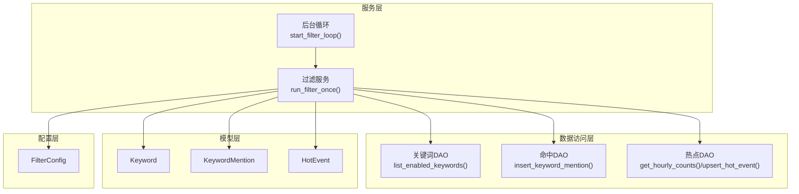
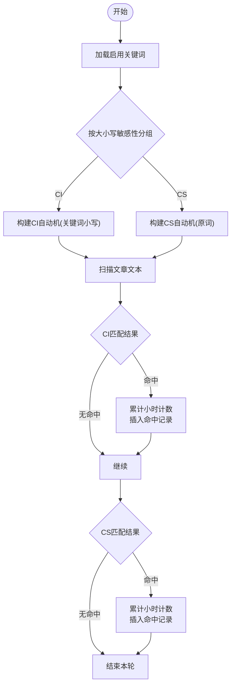
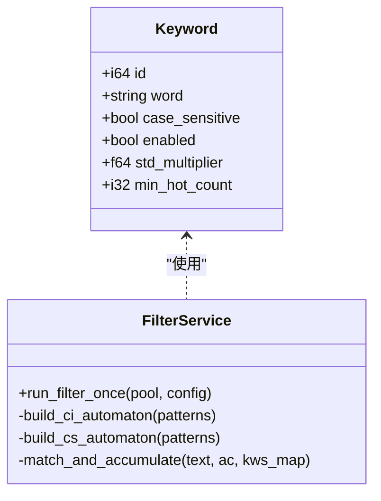
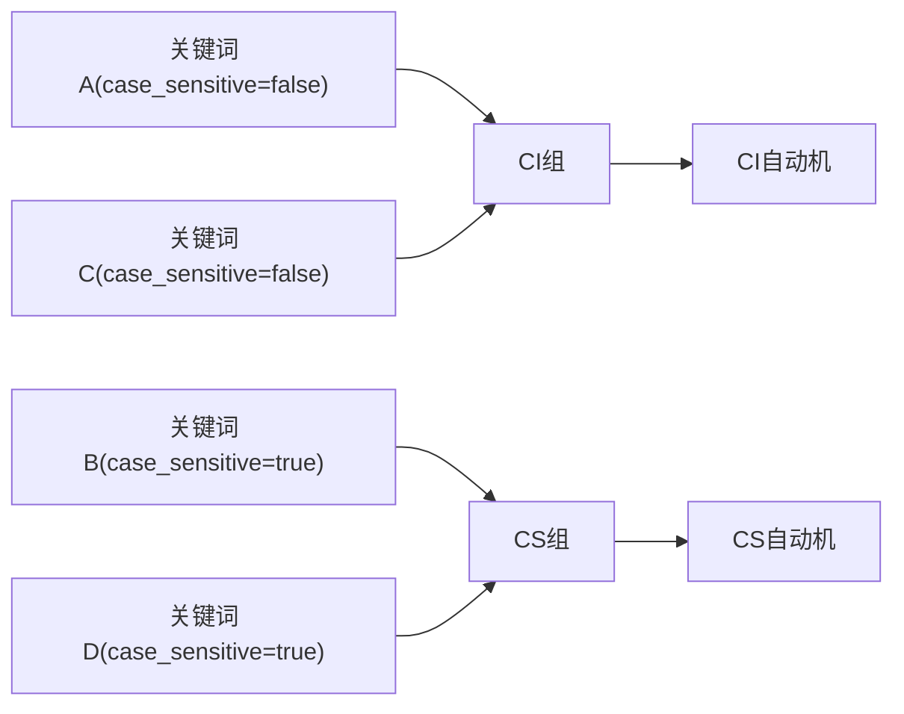
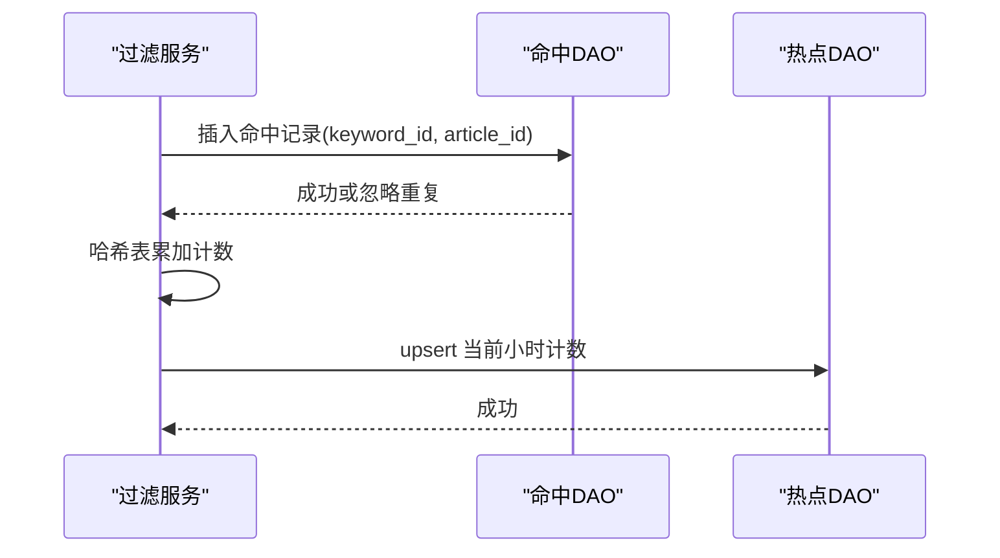
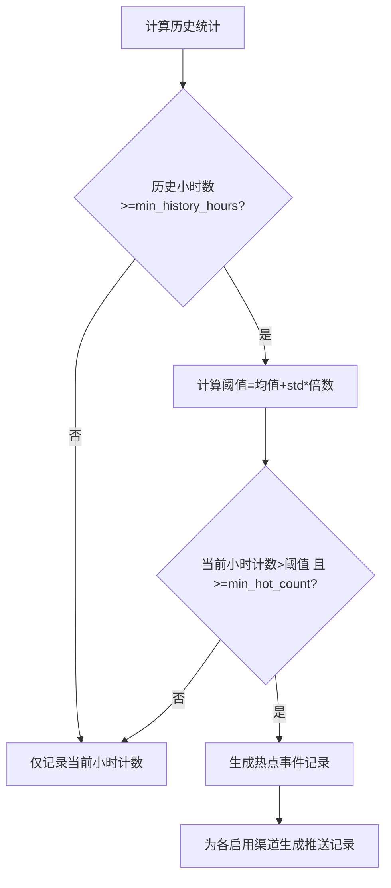
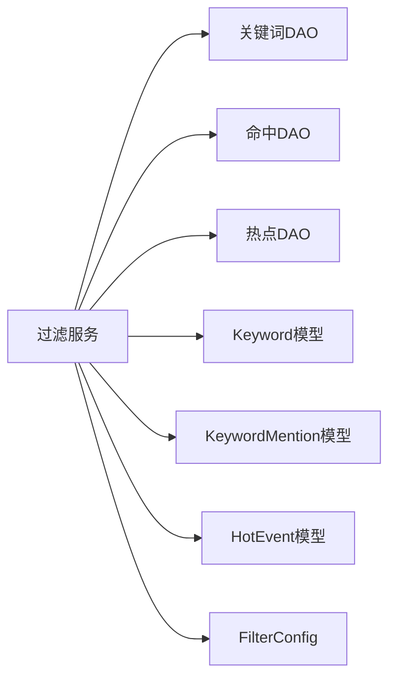

# 关键词匹配算法

<cite>
**本文引用的文件**
- [src/services/filter.rs](file://src/services/filter.rs)
- [src/models/keyword.rs](file://src/models/keyword.rs)
- [src/db/keyword.rs](file://src/db/keyword.rs)
- [src/db/keyword_mention.rs](file://src/db/keyword_mention.rs)
- [src/models/keyword_mention.rs](file://src/models/keyword_mention.rs)
- [src/models/hot_event.rs](file://src/models/hot_event.rs)
- [src/db/hot_event.rs](file://src/db/hot_event.rs)
- [src/config.rs](file://src/config.rs)
- [openspec/specs/filter-module/spec.md](file://openspec/specs/filter-module/spec.md)
- [docs/plans/05-query-apis-and-background-modules.md](file://docs/plans/05-query-apis-and-background-modules.md)
</cite>

## 目录
1. [引言](#引言)
2. [项目结构](#项目结构)
3. [核心组件](#核心组件)
4. [架构总览](#架构总览)
5. [详细组件分析](#详细组件分析)
6. [依赖关系分析](#依赖关系分析)
7. [性能考量](#性能考量)
8. [故障排查指南](#故障排查指南)
9. [结论](#结论)
10. [附录](#附录)

## 引言
本技术文档围绕关键词匹配与热点检测模块展开，重点阐述基于 Aho-Corasick 多模式匹配算法在本项目中的实现与优化。内容涵盖自动机构建、状态转移机制、大小写敏感与不敏感两种匹配模式的差异、关键词分组策略、匹配结果处理流程（命中记录、计数聚合、重复命中处理）、复杂度分析、内存优化建议以及性能测试方法与配置参数说明。

## 项目结构
关键词匹配与热点检测功能主要由以下模块协同完成：
- 过滤服务：负责加载未处理文章、加载启用关键词、构建 Aho-Corasick 自动机、执行匹配、统计小时计数、进行突发检测、生成推送记录、标记文章已处理。
- 数据访问层：提供关键词、关键词命中、热点事件等表的读写接口。
- 模型层：定义关键词、关键词命中、热点事件等数据结构。
- 配置层：定义过滤器运行参数（批大小、时间间隔、历史窗口等）。



**图表来源**
- [src/services/filter.rs:13-208](file://src/services/filter.rs#L13-L208)
- [src/db/keyword.rs:27-31](file://src/db/keyword.rs#L27-L31)
- [src/db/keyword_mention.rs:5-16](file://src/db/keyword_mention.rs#L5-L16)
- [src/db/hot_event.rs:105-123](file://src/db/hot_event.rs#L105-L123)
- [src/models/keyword.rs:5-14](file://src/models/keyword.rs#L5-L14)
- [src/models/keyword_mention.rs:5-11](file://src/models/keyword_mention.rs#L5-L11)
- [src/models/hot_event.rs:5-14](file://src/models/hot_event.rs#L5-L14)
- [src/config.rs:36-42](file://src/config.rs#L36-L42)

**章节来源**
- [src/services/filter.rs:13-208](file://src/services/filter.rs#L13-L208)
- [src/config.rs:36-42](file://src/config.rs#L36-L42)

## 核心组件
- 过滤服务 run_filter_once：主流程控制，包含加载文章、加载关键词、构建自动机、匹配与计数、突发检测、生成推送记录、批量标记已处理。
- 关键词模型 Keyword：包含关键词文本、大小写敏感标志、启用状态、突发检测阈值参数等。
- 命中模型 KeywordMention：记录关键词与文章的匹配关系。
- 热点模型 HotEvent：记录关键词每小时计数及历史统计信息。
- DAO 层：提供关键词、命中、热点事件的数据库操作。
- 配置 FilterConfig：控制批大小、轮询间隔、历史窗口等。

**章节来源**
- [src/services/filter.rs:13-208](file://src/services/filter.rs#L13-L208)
- [src/models/keyword.rs:5-14](file://src/models/keyword.rs#L5-L14)
- [src/models/keyword_mention.rs:5-11](file://src/models/keyword_mention.rs#L5-L11)
- [src/models/hot_event.rs:5-14](file://src/models/hot_event.rs#L5-L14)
- [src/db/keyword.rs:27-31](file://src/db/keyword.rs#L27-L31)
- [src/db/keyword_mention.rs:5-16](file://src/db/keyword_mention.rs#L5-L16)
- [src/db/hot_event.rs:105-123](file://src/db/hot_event.rs#L105-L123)
- [src/config.rs:36-42](file://src/config.rs#L36-L42)

## 架构总览
下图展示一次过滤运行的端到端流程：从加载未处理文章开始，到构建两类 Aho-Corasick 自动机（大小写敏感与不敏感），对文章标题与摘要进行匹配，累计每小时计数，计算历史统计并进行突发检测，最后批量标记文章已处理。

```mermaid
sequenceDiagram
participant Loop as "后台循环"
participant Svc as "过滤服务.run_filter_once"
participant DBK as "关键词DAO"
participant DBA as "文章DAO"
participant DBM as "命中DAO"
participant DBH as "热点DAO"
Loop->>Svc : 触发一次过滤
Svc->>DBA : 加载未处理文章(批大小)
Svc->>DBK : 加载启用关键词
alt 无关键词
Svc->>DBA : 批量标记已处理
Svc-->>Loop : 返回
else 有关键词
Svc->>Svc : 分组：大小写敏感/不敏感
Svc->>Svc : 构建两类AC自动机
loop 遍历文章
Svc->>Svc : 组合标题+摘要
Svc->>Svc : CI匹配(ASCII不区分大小写)
Svc->>DBM : 插入命中记录
Svc->>Svc : CS匹配(区分大小写)
Svc->>DBM : 插入命中记录
end
Svc->>DBH : 计算历史均值与方差
Svc->>DBH : upsert 当前小时计数
Svc->>DBH : 若达到阈值则生成推送记录
Svc->>DBA : 批量标记已处理(100条/批)
end
```

**图表来源**
- [src/services/filter.rs:13-208](file://src/services/filter.rs#L13-L208)
- [src/db/keyword.rs:27-31](file://src/db/keyword.rs#L27-L31)
- [src/db/keyword_mention.rs:5-16](file://src/db/keyword_mention.rs#L5-L16)
- [src/db/hot_event.rs:105-123](file://src/db/hot_event.rs#L105-L123)

## 详细组件分析

### Aho-Corasick 自动机与状态转移
- 自动机构建
  - 将启用关键词按大小写敏感性分为两组：CI 组与 CS 组。
  - CI 组将关键词转换为小写后构建自动机；CS 组保持原样构建自动机。
  - 使用 ASCII 不区分大小写模式构建 CI 自动机，确保匹配时忽略大小写。
- 状态转移机制
  - 文本扫描过程中，自动机根据当前字符在状态图上进行转移，当到达终结态时产生匹配。
  - 匹配结果包含模式索引（即关键词在构建向量中的序号），通过索引回查关键词与 ID。
- 匹配效率优化
  - 预处理阶段统一将 CI 关键词转为小写，避免运行时重复转换。
  - 对文章文本仅进行一次拼接与一次遍历，减少字符串操作开销。
  - 使用哈希表累积每小时计数，避免重复查询数据库。



**图表来源**
- [src/services/filter.rs:48-83](file://src/services/filter.rs#L48-L83)
- [src/services/filter.rs:94-129](file://src/services/filter.rs#L94-L129)

**章节来源**
- [src/services/filter.rs:48-83](file://src/services/filter.rs#L48-L83)
- [src/services/filter.rs:94-129](file://src/services/filter.rs#L94-L129)

### 大小写敏感与大小写不敏感匹配模式
- 预处理策略
  - CI 模式：关键词入库时保存原文，构建自动机前统一转为小写；运行时对文章文本也转为小写进行匹配。
  - CS 模式：关键词与文章文本均保持原样，严格区分大小写。
- 性能考虑
  - CI 模式通过 ASCII 不区分大小写模式与预小写，降低运行时比较成本。
  - CS 模式避免额外的小写化步骤，适合对大小写有强约束的场景。
- 实现差异
  - CI 自动机使用 ASCII 不区分大小写构建；CS 自动机使用默认区分大小写构建。
  - 匹配完成后，通过模式索引定位原始关键词，保证命中记录与关键词 ID 正确关联。



**图表来源**
- [src/models/keyword.rs:5-14](file://src/models/keyword.rs#L5-L14)
- [src/services/filter.rs:48-83](file://src/services/filter.rs#L48-L83)

**章节来源**
- [src/models/keyword.rs:5-14](file://src/models/keyword.rs#L5-L14)
- [src/services/filter.rs:48-83](file://src/services/filter.rs#L48-L83)

### 关键词分组机制
- 分组依据：关键词的大小写敏感标志。
- 分组结果：
  - CI 组：用于构建 ASCII 不区分大小写的自动机。
  - CS 组：用于构建区分大小写的自动机。
- 分组优势：
  - 减少自动机数量，提升匹配效率。
  - 避免在同一自动机中混合大小写规则带来的复杂度。



**图表来源**
- [src/services/filter.rs:49-59](file://src/services/filter.rs#L49-L59)

**章节来源**
- [src/services/filter.rs:49-59](file://src/services/filter.rs#L49-L59)

### 匹配结果处理流程
- 命中记录
  - 每次匹配成功后，插入一条关键词命中记录，包含关键词 ID 与文章 ID。
  - 使用“忽略重复”策略，避免重复命中导致的异常。
- 计数累加
  - 使用哈希表按关键词 ID 累加当前小时的命中次数。
  - 每小时计数最终 upsert 到热点表，作为后续突发检测的数据源。
- 重复匹配处理
  - 命中去重通过数据库层的“忽略重复”策略实现。
  - 同一关键词在同一文章内的多次命中仅插入一次命中记录，但计数仍会累加。



**图表来源**
- [src/db/keyword_mention.rs:5-16](file://src/db/keyword_mention.rs#L5-L16)
- [src/services/filter.rs:96-109](file://src/services/filter.rs#L96-L109)
- [src/services/filter.rs:150-165](file://src/services/filter.rs#L150-L165)

**章节来源**
- [src/db/keyword_mention.rs:5-16](file://src/db/keyword_mention.rs#L5-L16)
- [src/services/filter.rs:96-109](file://src/services/filter.rs#L96-L109)
- [src/services/filter.rs:150-165](file://src/services/filter.rs#L150-L165)

### 突发检测与热点事件
- 统计计算
  - 从热点表按最近 N 小时聚合每小时计数，计算均值与标准差。
- 阈值判断
  - 阈值 = 均值 + 关键词标准差倍数 × 标准差。
  - 当当前小时计数超过阈值且不低于最小热点计数时，判定为热点。
- 结果落地
  - upsert 热点事件记录，包含历史均值与标准差。
  - 为所有启用的推送渠道生成待推送记录。



**图表来源**
- [src/services/filter.rs:147-202](file://src/services/filter.rs#L147-L202)
- [src/db/hot_event.rs:105-123](file://src/db/hot_event.rs#L105-L123)

**章节来源**
- [src/services/filter.rs:147-202](file://src/services/filter.rs#L147-L202)
- [src/db/hot_event.rs:105-123](file://src/db/hot_event.rs#L105-L123)

### 算法复杂度分析
- 时间复杂度
  - 构建自动机：O(sum(|P_i|))，其中 P_i 为各关键词长度之和。
  - 文本扫描：O(n + z)，其中 n 为文本长度，z 为匹配总数。
  - 每篇文章匹配：O(文章长度 + 匹配数)。
  - 批量处理：假设批大小为 B，则总时间为 O(B × (文章长度 + 匹配数))。
- 空间复杂度
  - 自动机存储：与关键词集合与字符集大小相关，通常线性于关键词总长度。
  - 哈希表计数：O(k)，k 为当前批内命中的关键词种类数。
- 性能影响因素
  - 关键词数量与长度、大小写敏感分组策略、文章文本长度、批大小与轮询间隔。

[本节为通用复杂度讨论，无需特定文件引用]

### 内存使用优化
- 关键词预处理：CI 模式提前小写化，减少运行时字符串转换。
- 自动机复用：同一过滤周期内复用已构建的两类自动机，避免重复构建。
- 批量数据库操作：命中记录与文章已处理标记采用分批写入，降低内存峰值。
- 历史统计缓存：热点表按小时聚合，避免重复计算。

**章节来源**
- [src/services/filter.rs:64-83](file://src/services/filter.rs#L64-L83)
- [src/services/filter.rs:204-207](file://src/services/filter.rs#L204-L207)

### 实际匹配性能测试建议
- 测试指标
  - 单批处理耗时、每秒处理文章数、每秒匹配次数、内存占用峰值。
- 测试场景
  - 不同批大小（如 10、50、100、500）对比。
  - 不同关键词数量与长度分布（短词 vs 长词、高重复 vs 低重复）。
  - 大小写敏感与不敏感模式对比。
- 测试方法
  - 使用基准测试框架（如 criterion）对 run_filter_once 进行基准测试。
  - 在不同硬件与数据库配置下重复测试，记录稳定指标。

[本节为通用测试建议，无需特定文件引用]

## 依赖关系分析
- 组件耦合
  - 过滤服务依赖 DAO 层进行数据读写，依赖模型层进行数据传输。
  - 自动机构建与匹配逻辑集中在服务层，便于扩展与测试。
- 外部依赖
  - Aho-Corasick 库提供高效的多模式匹配能力。
  - SQLx 提供异步数据库访问。
- 接口契约
  - DAO 方法返回 Result 类型，调用方需妥善处理错误。
  - 热点表 upsert 保证幂等性，避免重复小时桶冲突。



**图表来源**
- [src/services/filter.rs:13-208](file://src/services/filter.rs#L13-L208)
- [src/db/keyword.rs:27-31](file://src/db/keyword.rs#L27-L31)
- [src/db/keyword_mention.rs:5-16](file://src/db/keyword_mention.rs#L5-L16)
- [src/db/hot_event.rs:105-123](file://src/db/hot_event.rs#L105-L123)
- [src/models/keyword.rs:5-14](file://src/models/keyword.rs#L5-L14)
- [src/models/keyword_mention.rs:5-11](file://src/models/keyword_mention.rs#L5-L11)
- [src/models/hot_event.rs:5-14](file://src/models/hot_event.rs#L5-L14)
- [src/config.rs:36-42](file://src/config.rs#L36-L42)

**章节来源**
- [src/services/filter.rs:13-208](file://src/services/filter.rs#L13-L208)
- [src/config.rs:36-42](file://src/config.rs#L36-L42)

## 性能考量
- 扫描策略
  - 对文章标题与摘要进行一次拼接后统一扫描，避免重复遍历。
- 自动机选择
  - 将大小写敏感与不敏感关键词分离，减少自动机规模与状态转移复杂度。
- 数据库写入
  - 命中记录与文章已处理标记采用分批写入，降低事务压力与内存占用。
- 统计计算
  - 历史统计按小时聚合，避免全量扫描，提高突发检测效率。

**章节来源**
- [src/services/filter.rs:90-129](file://src/services/filter.rs#L90-L129)
- [src/services/filter.rs:204-207](file://src/services/filter.rs#L204-L207)
- [src/db/hot_event.rs:105-123](file://src/db/hot_event.rs#L105-L123)

## 故障排查指南
- 常见问题
  - 无启用关键词：系统将直接标记所有未处理文章为已处理。
  - 数据库连接失败：检查连接池初始化与权限。
  - 自动机构建失败：检查关键词合法性与字符集。
  - 命中重复：确认数据库层“忽略重复”策略生效。
- 日志与监控
  - 关键路径均有日志输出，便于定位问题。
  - 突发检测阈值与计数可从热点表查询验证。

**章节来源**
- [src/services/filter.rs:18-26](file://src/services/filter.rs#L18-L26)
- [src/services/filter.rs:102-108](file://src/services/filter.rs#L102-L108)
- [src/services/filter.rs:191-199](file://src/services/filter.rs#L191-L199)

## 结论
本项目采用 Aho-Corasick 多模式匹配算法，结合大小写敏感与不敏感分组策略，在保证匹配精度的同时显著提升了性能。通过小时级计数与历史统计的突发检测机制，系统能够及时发现热点事件并触发推送。整体设计具备良好的可扩展性与可维护性，适合在持续增长的关键词与文章规模下稳定运行。

## 附录

### 配置参数说明
- FilterConfig
  - batch_size：每次处理的文章数量上限。
  - interval_seconds：后台轮询间隔。
  - history_hours：用于计算历史统计的小时窗口。
  - min_history_hours：进行突发检测所需的最少历史小时数。

**章节来源**
- [src/config.rs:36-42](file://src/config.rs#L36-L42)

### 关键词模型字段说明
- Keyword
  - id：关键词唯一标识。
  - word：关键词文本。
  - case_sensitive：是否区分大小写。
  - enabled：是否启用。
  - std_multiplier：突发检测的标准差倍数。
  - min_hot_count：触发热点的最小计数。
  - created_at：创建时间。

**章节来源**
- [src/models/keyword.rs:5-14](file://src/models/keyword.rs#L5-L14)

### API 与规范参考
- 关键词 CRUD API 行为与约束参见关键词处理器与规范文档。
- 过滤模块规范明确了大小写不敏感匹配、命中记录、小时计数、突发检测与文章已处理标记等需求。

**章节来源**
- [src/handlers/keyword.rs:12-41](file://src/handlers/keyword.rs#L12-L41)
- [openspec/specs/filter-module/spec.md:47-103](file://openspec/specs/filter-module/spec.md#L47-L103)