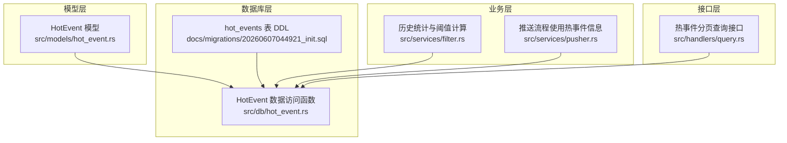
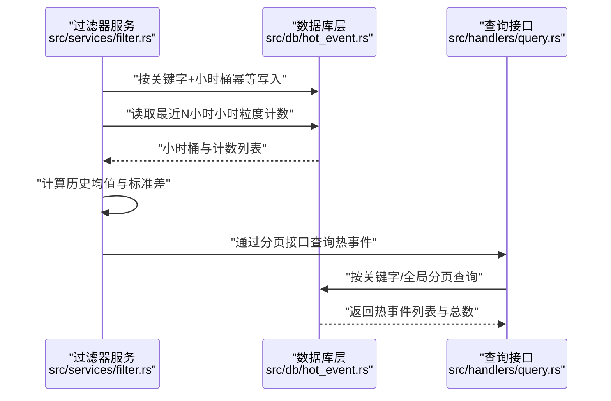
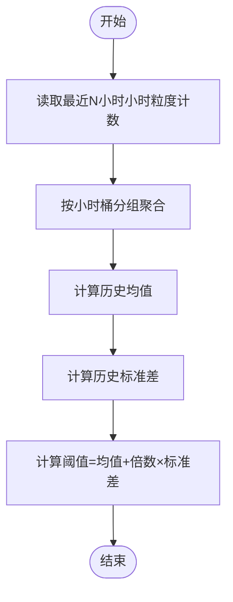
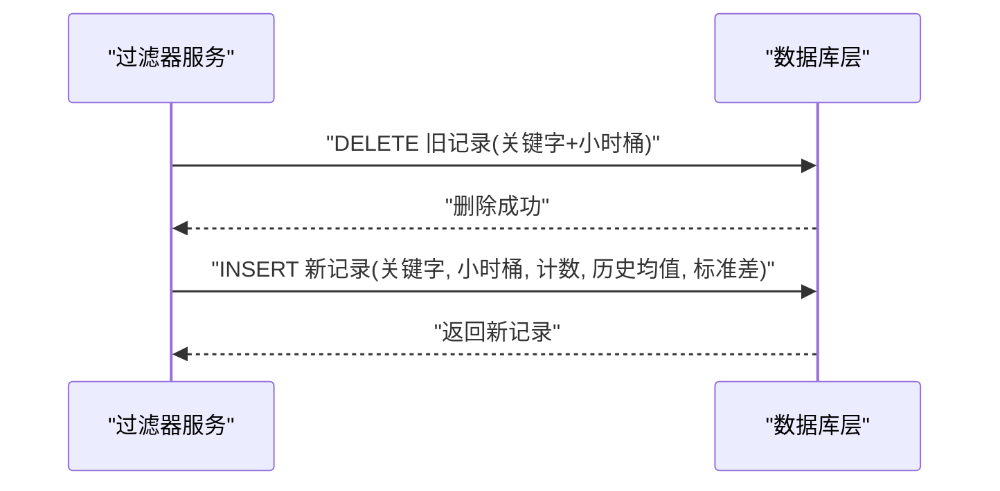
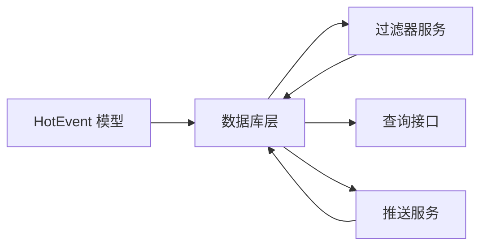

# 热事件数据模型

<cite>
**本文引用的文件**
- [hot_event.rs](file://src/models/hot_event.rs)
- [hot_event.rs](file://src/db/hot_event.rs)
- [filter.rs](file://src/services/filter.rs)
- [pusher.rs](file://src/services/pusher.rs)
- [query.rs](file://src/handlers/query.rs)
- [20260607044921_init.sql](file://docs/migrations/20260607044921_init.sql)
- [02-database-migrations.md](file://docs/plans/02-database-migrations.md)
- [05-query-apis-and-background-modules.md](file://docs/plans/05-query-apis-and-background-modules.md)
- [database-schema.spec.md](file://openspec/specs/database-schema/spec.md)
</cite>

## 目录
1. [简介](#简介)
2. [项目结构](#项目结构)
3. [核心组件](#核心组件)
4. [架构总览](#架构总览)
5. [详细组件分析](#详细组件分析)
6. [依赖关系分析](#依赖关系分析)
7. [性能考量](#性能考量)
8. [故障排查指南](#故障排查指南)
9. [结论](#结论)
10. [附录](#附录)

## 简介
本文件围绕“热事件”数据模型进行系统化技术文档编制，重点解释 HotEvent 模型的字段设计与业务含义、小时桶时间戳格式与时区处理、历史统计的存储与查询优化、数据库索引与性能考量、数据完整性约束与并发一致性保障，并提供具体的数据访问模式与 SQL 查询示例路径。

## 项目结构
热事件数据模型位于后端 Rust 代码中，涉及模型定义、数据库访问层、业务服务层与查询接口层。核心文件分布如下：
- 模型层：HotEvent 结构体定义
- 数据库层：hot_events 表的增删查改与分页统计
- 业务层：热点阈值计算、历史统计聚合、热事件写入
- 接口层：分页查询热事件列表
- 迁移与规范：hot_events 表结构、索引与约束定义

**图表来源**
- [hot_event.rs:1-14](file://src/models/hot_event.rs#L1-L14)
- [hot_event.rs:1-123](file://src/db/hot_event.rs#L1-L123)
- [filter.rs:147-256](file://src/services/filter.rs#L147-L256)
- [pusher.rs:73-113](file://src/services/pusher.rs#L73-L113)
- [query.rs:74-95](file://src/handlers/query.rs#L74-L95)
- [20260607044921_init.sql:105-117](file://docs/migrations/20260607044921_init.sql#L105-L117)

**章节来源**
- [hot_event.rs:1-14](file://src/models/hot_event.rs#L1-L14)
- [hot_event.rs:1-123](file://src/db/hot_event.rs#L1-L123)
- [filter.rs:147-256](file://src/services/filter.rs#L147-L256)
- [pusher.rs:73-113](file://src/services/pusher.rs#L73-L113)
- [query.rs:74-95](file://src/handlers/query.rs#L74-L95)
- [20260607044921_init.sql:105-117](file://docs/migrations/20260607044921_init.sql#L105-L117)

## 核心组件
- HotEvent 模型：承载单条热事件记录，包含关键字 ID、小时桶、计数、历史均值与标准差、创建时间等字段。
- hot_events 表：持久化存储热事件记录，具备关键字外键、历史均值与标准差字段、创建时间默认值，以及针对关键字与小时桶的索引。
- 历史统计服务：基于最近 N 小时的小时粒度计数，计算均值与标准差，用于热点阈值判断。
- 写入策略：按关键字+小时桶进行幂等写入（先删除旧记录再插入），避免重复键冲突。
- 查询接口：支持按关键字过滤、分页排序的热事件列表查询。

**章节来源**
- [hot_event.rs:5-14](file://src/models/hot_event.rs#L5-L14)
- [hot_event.rs:1-48](file://src/db/hot_event.rs#L1-L48)
- [filter.rs:210-256](file://src/services/filter.rs#L210-L256)
- [query.rs:74-95](file://src/handlers/query.rs#L74-L95)

## 架构总览
下图展示从关键词匹配到热事件入库、阈值计算与查询的整体流程。

**图表来源**
- [filter.rs:147-177](file://src/services/filter.rs#L147-L177)
- [filter.rs:210-256](file://src/services/filter.rs#L210-L256)
- [hot_event.rs:105-123](file://src/db/hot_event.rs#L105-L123)
- [query.rs:74-95](file://src/handlers/query.rs#L74-L95)

## 详细组件分析

### HotEvent 数据模型与字段语义
- 字段设计
  - id：自增主键
  - keyword_id：外键关联 keywords 表，标识该热事件对应的关键字
  - hour_bucket：小时桶字符串，格式为 YYYYMMDDHH，用于按小时聚合与去重
  - count：当前小时的匹配计数
  - mean_historical：历史均值（最近 N 小时）
  - stddev_historical：历史标准差（最近 N 小时）
  - created_at：记录创建时间，默认当前时间

- 业务含义
  - hour_bucket：以整点小时为单位的时间片，便于滚动窗口统计与幂等写入
  - count：当前小时的增量计数，用于与历史统计对比
  - mean_historical/stddev_historical：用于计算阈值，识别异常高增长的热点事件
  - keyword_id：将热事件与监控关键字绑定，支持多关键字独立统计

**章节来源**
- [hot_event.rs:5-14](file://src/models/hot_event.rs#L5-L14)
- [20260607044921_init.sql:105-113](file://docs/migrations/20260607044921_init.sql#L105-L113)

### 小时桶时间戳格式与时区处理
- 时间戳格式：YYYYMMDDHH（8 位日期 + 2 位小时）
- 存储与时区：数据库使用 SQLite 的 datetime 默认值；服务端使用无时区感知的 NaiveDateTime
- 设计考量：单机部署场景下，统一使用 UTC 合理；若需跨时区或多实例部署，建议迁移到带时区的 DATETIME 或以秒为单位的整数时间戳

**章节来源**
- [20260607044921_init.sql:108-112](file://docs/migrations/20260607044921_init.sql#L108-L112)
- [database-schema.spec.md:83-84](file://openspec/specs/database-schema/spec.md#L83-L84)

### 历史统计数据的存储结构与查询优化
- 存储结构
  - 每条记录代表一个关键字在一个小时桶内的计数与历史统计
  - 历史统计由最近 N 小时的小时粒度计数组成，用于计算均值与标准差
- 查询优化
  - 聚合查询：按关键字分组小时桶，对每小时计数求和，限制返回最近 N 小时
  - 索引：对 keyword_id 与 hour_bucket 建立索引，加速按关键字与时间范围的检索
  - 分页：结合 created_at 倒序与 LIMIT/OFFSET 实现高效分页

**图表来源**
- [hot_event.rs:105-123](file://src/db/hot_event.rs#L105-L123)
- [filter.rs:210-240](file://src/services/filter.rs#L210-L240)

**章节来源**
- [hot_event.rs:105-123](file://src/db/hot_event.rs#L105-L123)
- [filter.rs:210-240](file://src/services/filter.rs#L210-L240)

### 热事件记录的生命周期管理
- 创建：过滤器服务根据当前小时桶与关键字计数，调用幂等写入函数创建或更新记录
- 更新：按关键字+小时桶进行删除后插入，确保同一时间片只保留一条记录
- 归档策略：当前未见显式归档逻辑；建议通过定期清理历史数据或按关键字维度设置保留周期（例如仅保留最近 7 天）

**图表来源**
- [filter.rs:242-256](file://src/services/filter.rs#L242-L256)
- [hot_event.rs:1-24](file://src/db/hot_event.rs#L1-L24)

**章节来源**
- [filter.rs:147-177](file://src/services/filter.rs#L147-L177)
- [filter.rs:242-256](file://src/services/filter.rs#L242-L256)
- [hot_event.rs:1-24](file://src/db/hot_event.rs#L1-L24)

### 数据库索引设计与性能考量
- 索引
  - idx_hot_events_keyword：加速按关键字过滤
  - idx_hot_events_bucket：加速按小时桶范围查询
  - idx_push_records_status：加速推送状态查询（与热事件相关联）
- 性能考量
  - 使用分页查询与倒序索引，避免全表扫描
  - 聚合查询按小时桶分组，限制小时数，避免大范围扫描
  - 幂等写入减少重复键冲突带来的额外开销

**章节来源**
- [20260607044921_init.sql:115-116](file://docs/migrations/20260607044921_init.sql#L115-L116)
- [database-schema.spec.md:160-161](file://openspec/specs/database-schema/spec.md#L160-L161)

### 数据完整性约束与并发一致性
- 外键约束：hot_events.keyword_id 引用 keywords.id，启用级联删除保证数据一致性
- 唯一性：按关键字+小时桶进行幂等写入，避免重复键
- 并发控制：SQLite 默认不强制外键，需在连接池初始化时启用外键检查；幂等写入在单次写入内通过 DELETE+INSERT 保证原子性（同一次写入内）
- 时区一致性：服务端使用无时区时间类型，数据库使用 UTC 默认值，避免跨时区歧义

**章节来源**
- [20260607044921_init.sql:107-112](file://docs/migrations/20260607044921_init.sql#L107-L112)
- [filter.rs:242-256](file://src/services/filter.rs#L242-L256)
- [database-schema.spec.md:81-82](file://openspec/specs/database-schema/spec.md#L81-L82)

### 数据访问模式与 SQL 查询示例路径
- 插入/更新热事件
  - 示例路径：[插入热事件:5-24](file://src/db/hot_event.rs#L5-L24)
  - 幂等写入（删除+插入）：[幂等写入:242-256](file://src/services/filter.rs#L242-L256)
- 按关键字分页查询
  - 示例路径：[分页查询:60-85](file://src/db/hot_event.rs#L60-L85)，[接口实现:74-95](file://src/handlers/query.rs#L74-L95)
- 统计查询（最近 N 小时小时粒度计数）
  - 示例路径：[小时粒度聚合:105-123](file://src/db/hot_event.rs#L105-L123)
- 历史统计计算
  - 示例路径：[历史统计计算:210-240](file://src/services/filter.rs#L210-L240)

**章节来源**
- [hot_event.rs:5-123](file://src/db/hot_event.rs#L5-L123)
- [query.rs:74-95](file://src/handlers/query.rs#L74-L95)
- [filter.rs:210-256](file://src/services/filter.rs#L210-L256)

## 依赖关系分析
- 模型依赖：HotEvent 模型被数据库层与接口层广泛使用
- 数据库依赖：hot_events 表依赖 keywords 表的外键；查询依赖索引
- 业务依赖：过滤器服务依赖数据库层进行统计与写入；推送服务依赖热事件与关键字信息

**图表来源**
- [hot_event.rs:5-14](file://src/models/hot_event.rs#L5-L14)
- [hot_event.rs:1-123](file://src/db/hot_event.rs#L1-L123)
- [filter.rs:147-177](file://src/services/filter.rs#L147-L177)
- [pusher.rs:73-113](file://src/services/pusher.rs#L73-L113)
- [query.rs:74-95](file://src/handlers/query.rs#L74-L95)

**章节来源**
- [hot_event.rs:1-123](file://src/db/hot_event.rs#L1-L123)
- [filter.rs:147-177](file://src/services/filter.rs#L147-L177)
- [pusher.rs:73-113](file://src/services/pusher.rs#L73-L113)
- [query.rs:74-95](file://src/handlers/query.rs#L74-L95)

## 性能考量
- 索引策略：为高频过滤字段建立索引，避免全表扫描
- 查询优化：限制历史小时数与分页大小，降低聚合成本
- 写入优化：幂等写入在单次事务内完成，减少重复键冲突
- 存储格式：小时桶字符串便于排序与范围查询；如需更高效可考虑数值化时间戳

[本节为通用性能建议，无需特定文件引用]

## 故障排查指南
- 热点阈值异常
  - 检查历史小时数是否充足：[历史小时数校验:168-172](file://src/services/filter.rs#L168-L172)
  - 检查历史统计计算是否成功：[历史统计计算:210-240](file://src/services/filter.rs#L210-L240)
- 写入失败或重复
  - 核对关键字+小时桶唯一性与幂等写入逻辑：[幂等写入:242-256](file://src/services/filter.rs#L242-L256)
- 查询结果为空
  - 核对关键字过滤参数与分页参数：[分页查询:60-85](file://src/db/hot_event.rs#L60-L85)，[接口实现:74-95](file://src/handlers/query.rs#L74-L95)
- 外键约束问题
  - 确认 SQLite 外键已启用：[风险与权衡说明:81-82](file://openspec/specs/database-schema/spec.md#L81-L82)

**章节来源**
- [filter.rs:168-172](file://src/services/filter.rs#L168-L172)
- [filter.rs:210-240](file://src/services/filter.rs#L210-L240)
- [filter.rs:242-256](file://src/services/filter.rs#L242-L256)
- [hot_event.rs:60-85](file://src/db/hot_event.rs#L60-L85)
- [query.rs:74-95](file://src/handlers/query.rs#L74-L95)
- [database-schema.spec.md:81-82](file://openspec/specs/database-schema/spec.md#L81-L82)

## 结论
HotEvent 数据模型通过小时桶与历史统计实现了高效的热点检测与可视化展示。模型设计简洁、索引覆盖合理、查询路径清晰。建议在生产环境中关注外键启用、幂等写入的一致性与历史数据的归档策略，以进一步提升稳定性与可维护性。

[本节为总结性内容，无需特定文件引用]

## 附录
- 参考迁移脚本与规范
  - [hot_events 表 DDL 与索引:105-117](file://docs/migrations/20260607044921_init.sql#L105-L117)
  - [数据库设计与风险说明:81-82](file://openspec/specs/database-schema/spec.md#L81-L82)
- 查询与接口参考
  - [分页查询实现:74-95](file://src/handlers/query.rs#L74-L95)
  - [历史统计查询:105-123](file://src/db/hot_event.rs#L105-L123)

**章节来源**
- [20260607044921_init.sql:105-117](file://docs/migrations/20260607044921_init.sql#L105-L117)
- [database-schema.spec.md:81-82](file://openspec/specs/database-schema/spec.md#L81-L82)
- [query.rs:74-95](file://src/handlers/query.rs#L74-L95)
- [hot_event.rs:105-123](file://src/db/hot_event.rs#L105-L123)