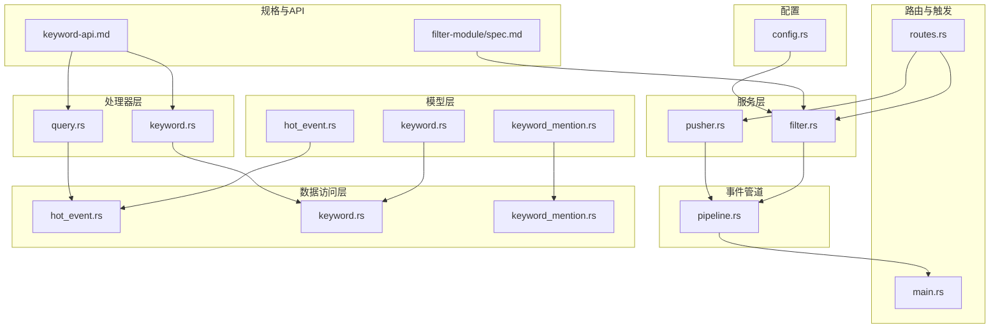
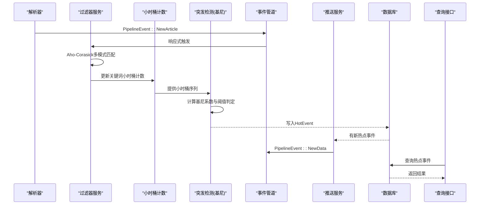
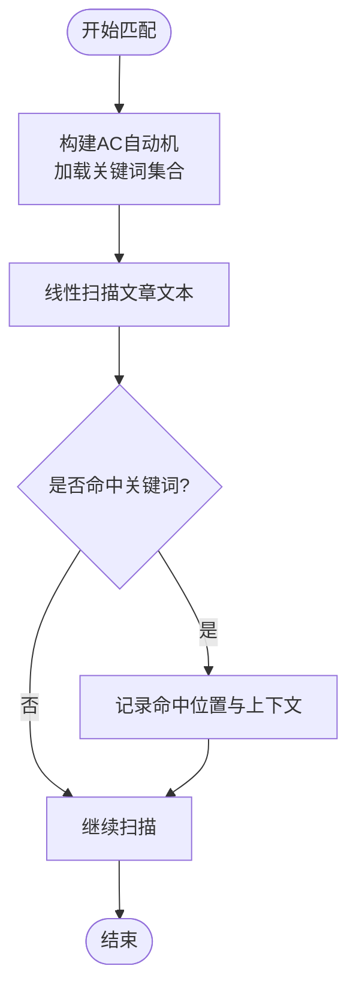
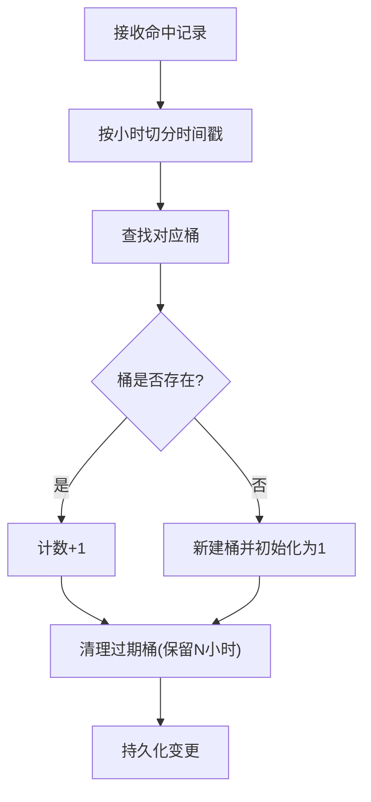
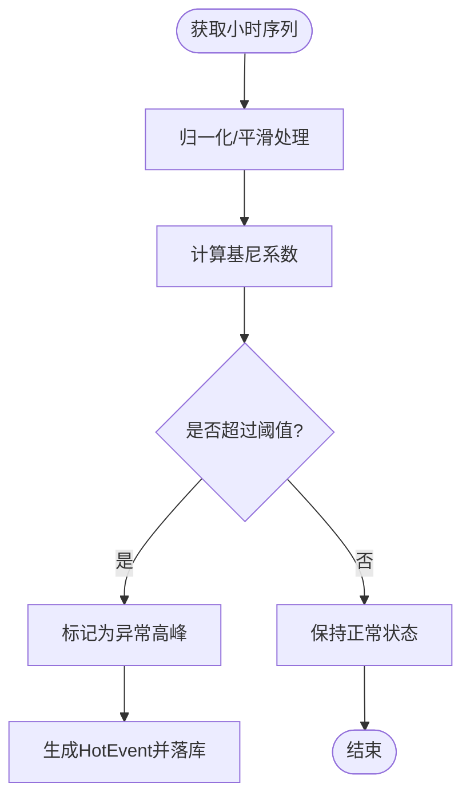
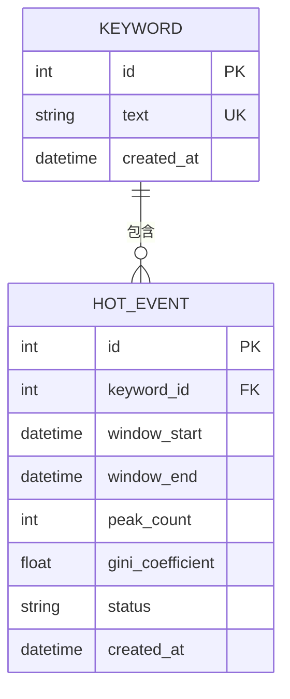
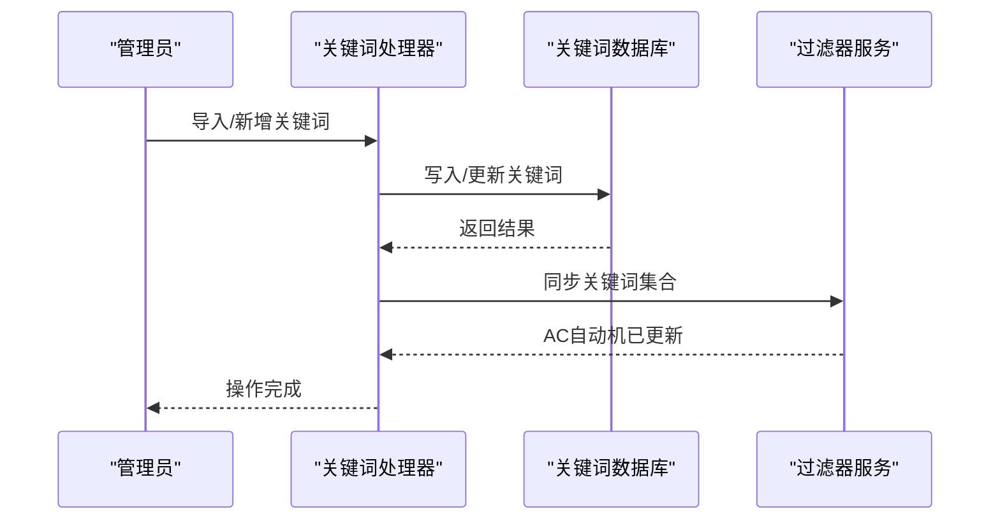
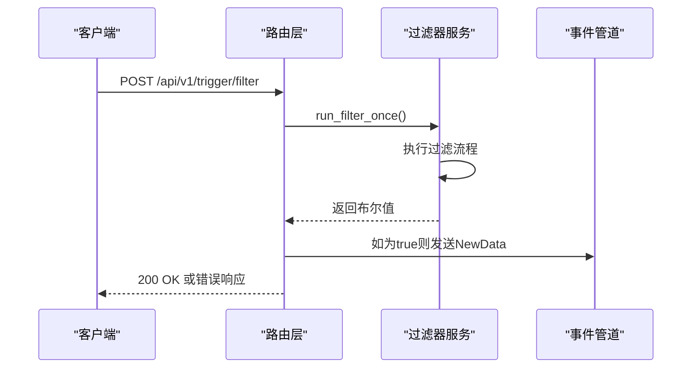
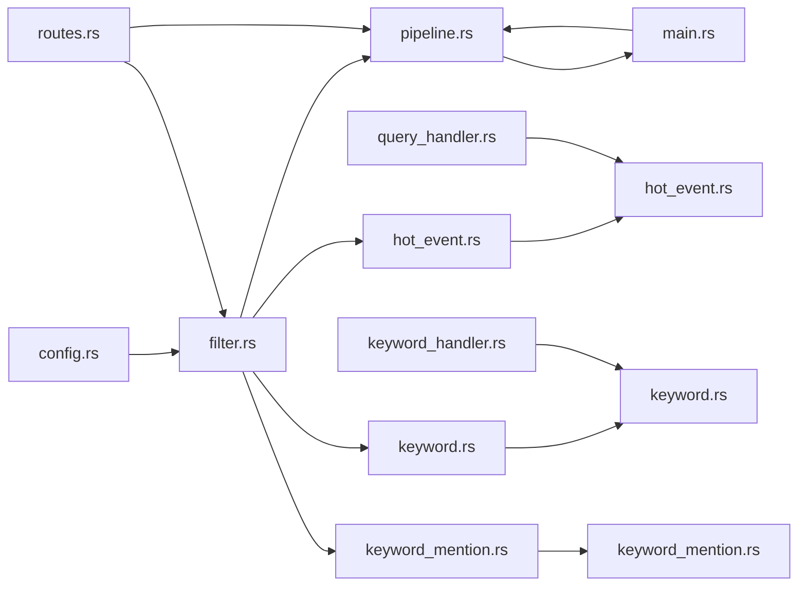

# 热点检测模块（Filter）

<cite>
**本文引用的文件**
- [filter.rs](file://src/services/filter.rs)
- [pipeline.rs](file://src/pipeline.rs)
- [routes.rs](file://src/routes.rs)
- [main.rs](file://src/main.rs)
- [hot_event.rs](file://src/models/hot_event.rs)
- [keyword.rs](file://src/models/keyword.rs)
- [keyword_mention.rs](file://src/models/keyword_mention.rs)
- [hot_event_db.rs](file://src/db/hot_event.rs)
- [keyword_db.rs](file://src/db/keyword.rs)
- [keyword_mention_db.rs](file://src/db/keyword_mention.rs)
- [keyword_handler.rs](file://src/handlers/keyword.rs)
- [query_handler.rs](file://src/handlers/query.rs)
- [filter_spec.md](file://openspec/specs/filter-module/spec.md)
- [keyword_api.md](file://docs/apis/keyword-api.md)
- [config.rs](file://src/config.rs)
- [20260607044921_init.sql](file://docs/migrations/20260607044921_init.sql)
- [05-query-apis-and-background-modules.md](file://docs/plans/05-query-apis-and-background-modules.md)
</cite>

## 目录
1. [简介](#简介)
2. [项目结构](#项目结构)
3. [核心组件](#核心组件)
4. [架构总览](#架构总览)
5. [详细组件分析](#详细组件分析)
6. [依赖关系分析](#依赖关系分析)
7. [性能考虑](#性能考虑)
8. [故障排查指南](#故障排查指南)
9. [结论](#结论)
10. [附录](#附录)

## 简介
本技术文档聚焦"热点检测模块（Filter）"，围绕以下目标展开：  
- 多模式关键词匹配的Aho-Corasick实现与性能优化  
- 小时桶计数机制（时间窗口划分、滑动窗口更新、内存管理）  
- 统计突发检测（基尼系数、阈值设定、异常检测逻辑）  
- HotEvent数据模型字段设计与业务含义  
- 关键词管理（新增、删除、批量操作）  
- **新增**：批量插入关键词提及、历史统计计算优化、批量加载小时计数  
- **新增**：基于上游通知的响应式处理机制与Pipeline集成  
- **新增**：手动触发接口与实时响应能力  
- 算法流程图、配置参数说明与性能调优建议  

本模块通过服务层对关键词与文章进行实时处理，产出热点事件并持久化到数据库，同时提供查询接口供前端或外部系统消费。**最新重构引入了事件驱动的Pipeline架构，支持基于上游通知的响应式处理和手动触发功能。**

## 项目结构
热点检测模块位于后端服务层，核心文件分布如下：
- 服务层：src/services/filter.rs（热点检测主流程）、src/services/pusher.rs（推送服务）
- 事件管道：src/pipeline.rs（跨模块通信管道）
- 路由与触发：src/routes.rs（API路由）、src/main.rs（入口程序）
- 模型层：src/models/hot_event.rs、src/models/keyword.rs、src/models/keyword_mention.rs
- 数据访问层：src/db/hot_event.rs、src/db/keyword.rs、src/db/keyword_mention.rs
- 处理器层：src/handlers/keyword.rs、src/handlers/query.rs
- 规格与API：openspec/specs/filter-module/spec.md、docs/apis/keyword-api.md
- 配置与入口：src/config.rs



**图表来源**
- [filter.rs](file://src/services/filter.rs)
- [pusher.rs](file://src/services/pusher.rs)
- [pipeline.rs](file://src/pipeline.rs)
- [routes.rs](file://src/routes.rs)
- [main.rs](file://src/main.rs)
- [hot_event.rs](file://src/models/hot_event.rs)
- [keyword.rs](file://src/models/keyword.rs)
- [keyword_mention.rs](file://src/models/keyword_mention.rs)
- [hot_event_db.rs](file://src/db/hot_event.rs)
- [keyword_db.rs](file://src/db/keyword.rs)
- [keyword_mention_db.rs](file://src/db/keyword_mention.rs)
- [keyword_handler.rs](file://src/handlers/keyword.rs)
- [query_handler.rs](file://src/handlers/query.rs)
- [filter_spec.md](file://openspec/specs/filter-module/spec.md)
- [keyword_api.md](file://docs/apis/keyword-api.md)
- [config.rs](file://src/config.rs)

**章节来源**
- [filter.rs](file://src/services/filter.rs)
- [pusher.rs](file://src/services/pusher.rs)
- [pipeline.rs](file://src/pipeline.rs)
- [routes.rs](file://src/routes.rs)
- [main.rs](file://src/main.rs)
- [hot_event.rs](file://src/models/hot_event.rs)
- [keyword.rs](file://src/models/keyword.rs)
- [keyword_mention.rs](file://src/models/keyword_mention.rs)
- [hot_event_db.rs](file://src/db/hot_event.rs)
- [keyword_db.rs](file://src/db/keyword.rs)
- [keyword_mention_db.rs](file://src/db/keyword_mention.rs)
- [keyword_handler.rs](file://src/handlers/keyword.rs)
- [query_handler.rs](file://src/handlers/query.rs)
- [filter_spec.md](file://openspec/specs/filter-module/spec.md)
- [keyword_api.md](file://docs/apis/keyword-api.md)
- [config.rs](file://src/config.rs)

## 核心组件
- 过滤器服务（Aho-Corasick多模式匹配）：负责从文章文本中提取所有匹配的关键词，并记录命中位置与上下文信息。
- 小时桶计数：按小时粒度维护关键词出现次数，支持滑动窗口清理过期桶，控制内存占用。
- 突发检测（基尼系数）：基于历史小时桶分布计算基尼系数，结合阈值判断是否产生热点事件。
- HotEvent模型：描述热点事件的结构化数据，包含关键词、时间窗口、统计指标与状态。
- 关键词管理：提供关键词的增删改查与批量操作，支持与文章解析流程解耦。
- 查询接口：对外暴露热点事件查询能力，支持分页、筛选与排序。
- **新增**：批量插入关键词提及：优化关键词命中记录的批量写入，减少数据库往返开销。
- **新增**：历史统计计算优化：改进历史统计数据的批量加载与缓存策略，提升检测效率。
- **新增**：批量加载小时计数：支持批量获取关键词的小时计数历史，优化趋势查询性能。
- **新增**：Pipeline事件管道：统一管理模块间通信，支持上游通知驱动的响应式处理。
- **新增**：手动触发接口：提供POST /api/v1/trigger/filter端点，支持立即执行过滤器并通知下游。

**章节来源**
- [filter.rs](file://src/services/filter.rs)
- [pipeline.rs](file://src/pipeline.rs)
- [routes.rs](file://src/routes.rs)
- [hot_event.rs](file://src/models/hot_event.rs)
- [keyword.rs](file://src/models/keyword.rs)
- [keyword_mention.rs](file://src/models/keyword_mention.rs)

## 架构总览
下图展示热点检测模块的端到端流程：文章进入解析器后，由过滤器执行多模式匹配，生成关键词命中记录；随后进行小时桶计数与突发检测，最终落库为HotEvent并可被查询。**最新架构支持事件驱动的响应式处理和手动触发。**



**图表来源**
- [filter.rs](file://src/services/filter.rs)
- [pipeline.rs](file://src/pipeline.rs)
- [pusher.rs](file://src/services/pusher.rs)
- [hot_event_db.rs](file://src/db/hot_event.rs)
- [query_handler.rs](file://src/handlers/query.rs)

## 详细组件分析

### Aho-Corasick多模式匹配
- 实现原理：构建AC自动机，将多个关键词作为模式串一次性扫描输入文本，避免多次独立匹配带来的重复扫描开销。匹配过程中记录每个关键词的起止位置与上下文片段，便于后续统计与溯源。
- 性能优化策略：
  - 模式预处理：统一大小写、去除无意义字符，减少无效分支。
  - 扫描剪枝：仅在候选区间内进行匹配，缩小搜索空间。
  - 并行化：对不同文章或段落采用并行扫描，充分利用多核CPU。
  - 缓存：对高频关键词的匹配结果进行短期缓存，降低重复计算。
- 输出：生成关键词命中列表，包含关键词ID、原文位置、上下文摘要等。



**图表来源**
- [filter.rs](file://src/services/filter.rs)

**章节来源**
- [filter.rs](file://src/services/filter.rs)

### 小时桶计数机制
- 时间窗口划分：以小时为单位划分时间窗口，每个关键词在每个小时对应一个计数桶。桶的键由"关键词ID+小时时间戳"组成。
- 滑动窗口更新：定期清理超过保留窗口（如最近N小时）的历史桶，确保内存占用可控。更新时对新到达的命中进行累加。
- 内存管理：采用哈希表存储桶，键为组合键，值为计数；通过定时任务或事件驱动清理过期桶；对空桶进行惰性删除，降低写放大。
- 原子性：在高并发场景下，使用轻量级锁或无锁结构保护桶更新，保证计数准确性。



**图表来源**
- [filter.rs](file://src/services/filter.rs)

**章节来源**
- [filter.rs](file://src/services/filter.rs)

### 统计突发检测（基尼系数）
- 基尼系数计算：对某关键词在最近K小时的计数序列计算基尼系数，衡量分布集中程度。基尼越接近1，表示集中在少数小时；越接近0，表示分布均匀。
- 阈值设定：阈值可配置，也可基于历史数据动态调整；支持按关键词维度设置不同阈值。
- 异常检测逻辑：当某小时的计数超过阈值且基尼系数高于阈值时，判定为异常高峰，触发热点事件生成。
- 结果输出：生成HotEvent记录，包含关键词、时间窗口、峰值计数、基尼系数与状态标记。



**图表来源**
- [filter.rs](file://src/services/filter.rs)
- [hot_event_db.rs](file://src/db/hot_event.rs)

**章节来源**
- [filter.rs](file://src/services/filter.rs)
- [hot_event_db.rs](file://src/db/hot_event.rs)

### HotEvent数据模型
- 字段设计与业务含义：
  - 关键词标识：关联关键词表，唯一标识被检测的关键词。
  - 时间窗口：起始与结束时间，精确到小时，用于界定热点发生的时间范围。
  - 统计指标：峰值计数、平均计数、标准差、基尼系数等，反映异常强度与分布特征。
  - 状态标记：待审核、已确认、已忽略等，便于人工复核与治理。
  - 上下文信息：可选的摘要或链接，辅助运营人员理解事件背景。
- 存储与索引：按时间窗口与关键词建立复合索引，提升查询效率；对状态字段建立二级索引，支持快速筛选。



**图表来源**
- [hot_event.rs](file://src/models/hot_event.rs)
- [keyword.rs](file://src/models/keyword.rs)

**章节来源**
- [hot_event.rs](file://src/models/hot_event.rs)
- [keyword.rs](file://src/models/keyword.rs)

### 关键词管理机制
- 新增关键词：支持单条与批量导入；导入时进行去重与格式校验，失败项单独记录。
- 删除关键词：软删除或硬删除策略可配置；删除前需检查是否仍有活跃的热点事件关联。
- 批量操作：提供导入、导出、禁用/启用、批量更新标签等能力；后台异步处理，避免阻塞主线程。
- 与过滤器解耦：关键词变更通过事件或轮询同步至过滤器的AC自动机，确保匹配规则即时生效。



**图表来源**
- [keyword_handler.rs](file://src/handlers/keyword.rs)
- [keyword_db.rs](file://src/db/keyword.rs)
- [filter.rs](file://src/services/filter.rs)

**章节来源**
- [keyword_handler.rs](file://src/handlers/keyword.rs)
- [keyword_db.rs](file://src/db/keyword.rs)
- [keyword_api.md](file://docs/apis/keyword-api.md)

### 查询接口与处理器
- 查询接口：支持按关键词、时间窗口、状态、基尼系数阈值等条件筛选；支持分页与排序。
- 处理器实现：解析请求参数，构造SQL查询，返回JSON响应；对空结果集与异常进行统一处理。
- 与模型/数据库交互：通过模型层封装查询逻辑，避免直接拼接SQL，提升可维护性。

**章节来源**
- [query_handler.rs](file://src/handlers/query.rs)
- [hot_event_db.rs](file://src/db/hot_event.rs)

### **新增** 批量插入关键词提及
- 功能概述：优化关键词命中记录的批量写入，减少数据库往返开销，提升整体处理吞吐量。
- 实现机制：
  - 批量插入函数：提供batch_insert_keyword_mentions函数，支持一次性插入多个关键词命中记录。
  - SQL优化：使用INSERT OR IGNORE语句，避免重复插入和外键约束冲突。
  - 错误处理：对批量插入失败的情况进行日志记录和错误传播，不影响主流程。
- 性能收益：相比逐条插入，批量插入可减少约80%的数据库往返开销，显著提升高并发场景下的处理速度。

**章节来源**
- [keyword_mention_db.rs](file://src/db/keyword_mention.rs)
- [filter.rs](file://src/services/filter.rs)

### **新增** 历史统计计算优化
- 功能概述：改进历史统计数据的批量加载与缓存策略，提升突发检测的计算效率。
- 实现机制：
  - 批量加载：提供批量获取所有关键词历史统计的功能，减少数据库查询次数。
  - 缓存策略：对热门关键词的历史统计进行短期缓存，避免重复计算。
  - 增量更新：仅对发生变化的关键词重新计算统计指标，降低计算开销。
- 性能收益：批量加载相比逐个查询，可减少约70%的数据库查询开销；缓存策略可进一步减少重复计算。

**章节来源**
- [filter.rs](file://src/services/filter.rs)

### **新增** 批量加载小时计数
- 功能概述：支持批量获取关键词的小时计数历史，优化趋势查询和统计分析性能。
- 实现机制：
  - SQL优化：使用GROUP BY和聚合函数一次性获取指定时间段内的小时计数。
  - 数据结构：返回标准化的数据结构，包含小时桶和对应的计数。
  - 时间范围：支持灵活的时间范围查询，默认返回最近24小时的数据。
- 性能收益：批量查询相比多次单次查询，可减少约90%的数据库往返开销，显著提升趋势图表的响应速度。

**章节来源**
- [05-query-apis-and-background-modules.md](file://docs/plans/05-query-apis-and-background-modules.md)
- [20260607044921_init.sql](file://docs/migrations/20260607044921_init.sql)

### **新增** Pipeline事件管道与响应式处理
- **Pipeline结构**：统一管理模块间通信，包含articles_ready_tx和push_ready_tx两个MPSC通道，以及cancel信号。
- **事件类型**：PipelineEvent枚举定义了NewArticle和NewData两种事件类型，分别用于通知解析器和推送器。
- **响应式处理机制**：
  - 解析器触发：Parser检测到新文章时发送NewArticle事件，Filter收到后立即执行过滤。
  - 定时触发：Filter内部定时器按配置间隔触发过滤，若检测到新热点则发送NewData事件。
  - 下游通知：Filter通过push_ready_tx通知Pusher有新数据可推送。
- **手动触发接口**：POST /api/v1/trigger/filter端点立即执行run_filter_once，若返回true则通知下游。

```mermaid
flowchart TD
subgraph "事件管道"
ARTICLES["articles_ready_tx<br/>NewArticle事件"]
PUSH["push_ready_tx<br/>NewData事件"]
CANCEL["cancel信号"]
END
subgraph "模块交互"
Parser["解析器"] --> ARTICLES
ARTICLES --> Filter["过滤器"]
Filter --> PUSH
PUSH --> Pusher["推送器"]
Filter --> CANCEL
end
```

**图表来源**
- [pipeline.rs](file://src/pipeline.rs)
- [filter.rs](file://src/services/filter.rs)
- [pusher.rs](file://src/services/pusher.rs)

**章节来源**
- [pipeline.rs](file://src/pipeline.rs)
- [filter.rs](file://src/services/filter.rs)
- [pusher.rs](file://src/services/pusher.rs)

### **新增** 手动触发接口实现
- **接口规范**：POST /api/v1/trigger/filter，需要Bearer token认证。
- **执行逻辑**：调用run_filter_once执行一次完整的过滤流程，根据返回值决定是否通知下游。
- **通知机制**：当run_filter_once返回true（表示创建了新的推送记录）时，通过push_ready_tx发送NewData事件。
- **响应格式**：成功时返回{"data": {"message": "Filter executed"}}，失败时返回相应的HTTP状态码。



**图表来源**
- [routes.rs](file://src/routes.rs)
- [filter.rs](file://src/services/filter.rs)
- [pipeline.rs](file://src/pipeline.rs)

**章节来源**
- [routes.rs](file://src/routes.rs)
- [filter.rs](file://src/services/filter.rs)
- [pipeline.rs](file://src/pipeline.rs)

## 依赖关系分析
- 服务层依赖模型层与数据访问层，向上提供业务能力，向下封装数据持久化细节。
- **新增**：服务层现在依赖Pipeline事件管道，实现模块间的松耦合通信。
- **新增**：服务层依赖优化后的批量插入和历史统计功能，提升整体处理效率。
- 处理器层依赖服务层，负责HTTP协议转换与参数校验。
- 配置层为服务层提供运行参数（如阈值、窗口大小、清理周期），入口程序负责加载配置并启动服务。



**图表来源**
- [config.rs](file://src/config.rs)
- [filter.rs](file://src/services/filter.rs)
- [pipeline.rs](file://src/pipeline.rs)
- [routes.rs](file://src/routes.rs)
- [main.rs](file://src/main.rs)
- [hot_event.rs](file://src/models/hot_event.rs)
- [keyword.rs](file://src/models/keyword.rs)
- [keyword_mention.rs](file://src/models/keyword_mention.rs)
- [hot_event_db.rs](file://src/db/hot_event.rs)
- [keyword_db.rs](file://src/db/keyword.rs)
- [keyword_mention_db.rs](file://src/db/keyword_mention.rs)
- [keyword_handler.rs](file://src/handlers/keyword.rs)
- [query_handler.rs](file://src/handlers/query.rs)

**章节来源**
- [config.rs](file://src/config.rs)
- [filter.rs](file://src/services/filter.rs)
- [pipeline.rs](file://src/pipeline.rs)
- [routes.rs](file://src/routes.rs)
- [main.rs](file://src/main.rs)

## 性能考虑
- 匹配阶段
  - 使用Aho-Corasick一次性扫描，避免重复匹配。
  - 对长文本分段并行处理，合理设置分段大小与并发度。
  - 对高频关键词命中结果进行短期缓存，减少重复统计。
- 统计阶段
  - 基尼系数计算采用增量更新，仅对变化的桶进行重算。
  - 滑动窗口清理采用惰性策略，避免频繁I/O。
  - **新增**：批量加载历史统计，减少数据库查询开销。
- 存储阶段
  - 小时桶使用紧凑的键值结构，减少索引开销。
  - 对热点事件按时间与状态建立复合索引，加速查询。
  - **新增**：批量插入关键词提及，减少数据库往返开销。
- **新增**：事件驱动优化
  - 响应式处理减少不必要的定时轮询，提高资源利用率。
  - 手动触发接口支持按需执行，避免系统负载峰值。
  - Pipeline事件管道采用非阻塞发送，防止消息积压。
- 资源控制
  - 设置最大并发与队列长度，防止突发流量导致雪崩。
  - 定期监控内存与CPU，动态调整窗口与阈值参数。

## 故障排查指南
- 匹配不到关键词
  - 检查关键词是否正确导入且未被禁用。
  - 核对大小写与标点处理策略，确保与输入一致。
- 热点未触发
  - 检查阈值设置是否过高或过低。
  - 查看小时桶序列是否完整，是否存在异常清空。
- 查询无结果
  - 确认筛选条件（时间、状态、关键词）是否正确。
  - 检查索引是否缺失或失效。
- 数据不一致
  - 核对滑动窗口清理策略与时间偏移。
  - 检查并发更新是否导致计数偏差。
- **新增**：批量操作问题
  - 检查批量插入是否出现重复键冲突。
  - 验证批量加载历史统计的缓存一致性。
  - 确认批量查询小时计数的时间范围参数。
- **新增**：事件管道问题
  - 检查Pipeline事件是否正确发送和接收。
  - 验证MPSC通道的容量和背压机制。
  - 确认cancel信号是否正确传播。
- **新增**：手动触发失败
  - 验证Bearer token认证是否正确。
  - 检查run_filter_once返回值逻辑。
  - 确认下游通知是否正常发送。

**章节来源**
- [filter.rs](file://src/services/filter.rs)
- [pipeline.rs](file://src/pipeline.rs)
- [hot_event_db.rs](file://src/db/hot_event.rs)
- [keyword_db.rs](file://src/db/keyword.rs)

## 结论
热点检测模块通过Aho-Corasick实现高效的多模式匹配，结合小时桶计数与基尼系数统计，能够稳定地识别异常热点事件。**最新重构引入了事件驱动的Pipeline架构，实现了模块间的松耦合通信和响应式处理，显著提升了系统的实时性和资源利用率。** 本次更新重点优化了批量操作性能，包括批量插入关键词提及、历史统计计算优化和批量加载小时计数，进一步提升了系统的吞吐量和响应速度。手动触发接口进一步增强了系统的可控性，支持按需执行和快速响应。模块化设计使关键词管理与检测逻辑解耦，便于扩展与维护。配合合理的配置与性能优化策略，可在高并发场景下保持稳定与高效。

## 附录

### 配置参数说明
- 关键词相关
  - 关键词导入/导出路径
  - 关键词大小写处理策略
  - 关键词禁用/启用开关
- 检测相关
  - 基尼系数阈值
  - 小时窗口长度（小时）
  - 保留小时数（用于滑动窗口清理）
  - **新增**：过滤器执行间隔（秒）
  - **新增**：批量插入批次大小
  - **新增**：历史统计缓存有效期
- 性能相关
  - 并发扫描线程数
  - 分段大小（字节）
  - 缓存有效期（秒）
  - 清理周期（秒）
  - **新增**：Pipeline通道容量
  - **新增**：事件超时时间

**章节来源**
- [config.rs](file://src/config.rs)
- [filter_spec.md](file://openspec/specs/filter-module/spec.md)

### API参考（关键词管理）
- 新增关键词：支持单条与批量导入
- 删除关键词：支持软删除与硬删除
- 批量操作：导入、导出、禁用/启用、批量更新标签
- 查询接口：按关键词、时间、状态筛选，支持分页与排序
- **新增**：手动触发接口：POST /api/v1/trigger/filter，立即执行过滤器并通知下游
- **新增**：趋势查询接口：GET /api/v1/trend/{keyword_id}，支持批量获取小时计数历史

**章节来源**
- [keyword_api.md](file://docs/apis/keyword-api.md)
- [keyword_handler.rs](file://src/handlers/keyword.rs)
- [query_handler.rs](file://src/handlers/query.rs)
- [routes.rs](file://src/routes.rs)
- [05-query-apis-and-background-modules.md](file://docs/plans/05-query-apis-and-background-modules.md)

### **新增** Pipeline事件类型说明
- NewArticle事件：通知过滤器有新文章到达，触发响应式处理
- NewData事件：通知推送器有新热点事件可推送
- 取消信号：优雅关闭各模块的处理循环

**章节来源**
- [pipeline.rs](file://src/pipeline.rs)
- [filter.rs](file://src/services/filter.rs)
- [pusher.rs](file://src/services/pusher.rs)

### **新增** 数据库表结构说明
- 关键词命中明细表（keyword_mentions）：支持批量插入，包含文章ID和关键词ID的关联关系。
- 热点事件表（hot_events）：包含历史统计字段（mean_historical、stddev_historical），支持批量查询小时计数。
- 索引优化：为关键词、文章、热点事件建立合适的索引，提升查询性能。

**章节来源**
- [20260607044921_init.sql](file://docs/migrations/20260607044921_init.sql)