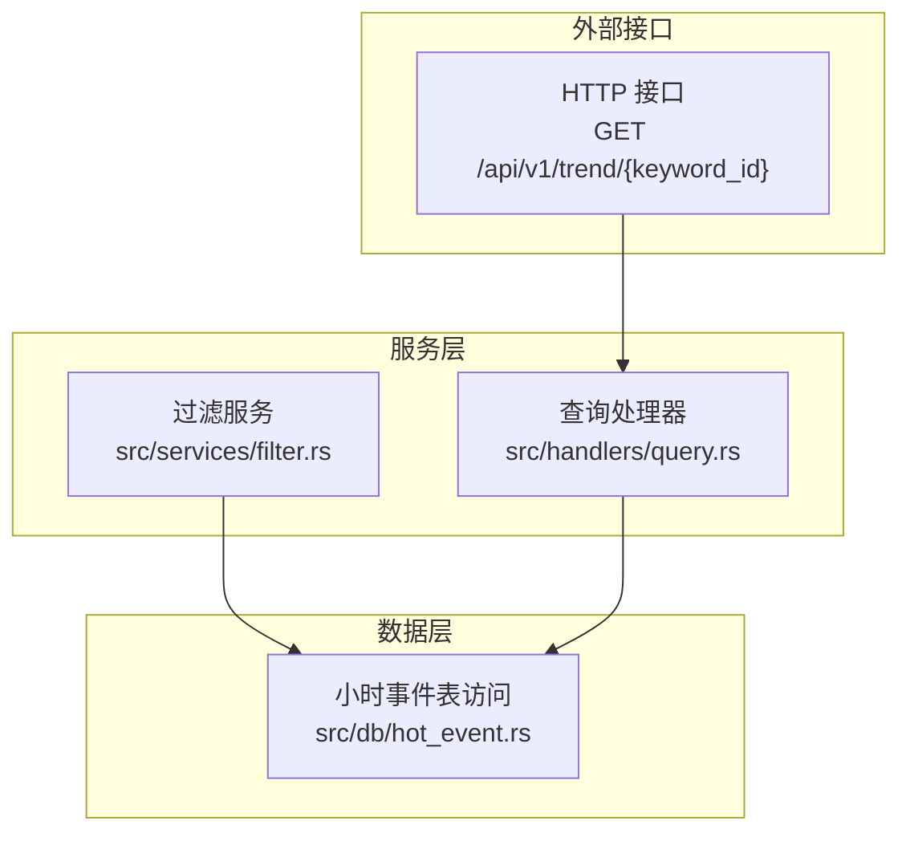
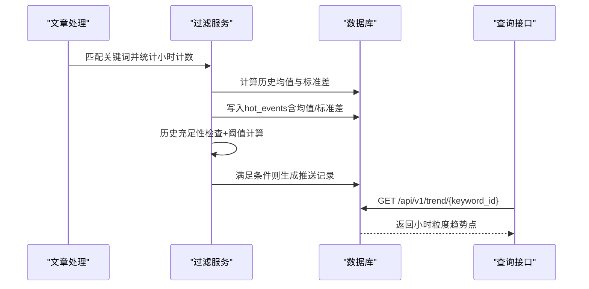
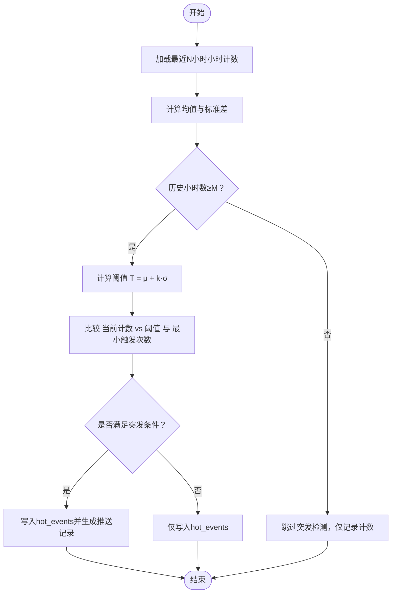
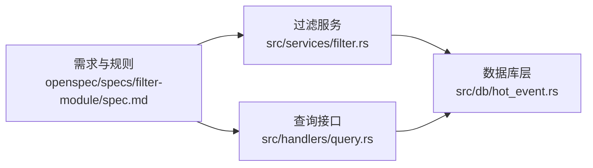

# 突发检测算法

<cite>
**本文引用的文件**
- [filter.rs](file://src/services/filter.rs)
- [hot_event.rs](file://src/db/hot_event.rs)
- [query.rs](file://src/handlers/query.rs)
- [spec.md](file://openspec/specs/filter-module/spec.md)
</cite>

## 目录
1. [引言](#引言)
2. [项目结构](#项目结构)
3. [核心组件](#核心组件)
4. [架构总览](#架构总览)
5. [详细组件分析](#详细组件分析)
6. [依赖关系分析](#依赖关系分析)
7. [性能考虑](#性能考虑)
8. [故障排查指南](#故障排查指南)
9. [结论](#结论)
10. [附录](#附录)

## 引言
本技术文档围绕“突发检测算法”展开，聚焦于基于统计学的异常检测流程与实现细节。系统采用Z-score思想（以均值加减若干倍标准差作为阈值）进行小时级突发判定，并结合历史数据充足性检验、最小触发次数限制等策略，平衡误报与漏报。同时，文档提供标准差倍数乘法器的调优方法、不同场景下的阈值配置建议（高基数关键词与低频关键词差异化处理）、算法效果评估指标与性能优化策略，并给出实际案例分析思路。

## 项目结构
本项目采用后端服务架构，突发检测位于过滤模块中，通过数据库层聚合小时级事件，再由查询接口对外提供趋势数据。关键文件如下：
- 过滤与突发检测：src/services/filter.rs
- 小时计数查询：src/db/hot_event.rs
- 趋势查询接口：src/handlers/query.rs
- 需求与规则说明：openspec/specs/filter-module/spec.md

**图表来源**
- [filter.rs:112-177](file://src/services/filter.rs#L112-L177)
- [hot_event.rs:105-123](file://src/db/hot_event.rs#L105-L123)
- [query.rs:121-146](file://src/handlers/query.rs#L121-L146)

**章节来源**
- [filter.rs:112-177](file://src/services/filter.rs#L112-L177)
- [hot_event.rs:105-123](file://src/db/hot_event.rs#L105-L123)
- [query.rs:121-146](file://src/handlers/query.rs#L121-L146)
- [spec.md:85-103](file://openspec/specs/filter-module/spec.md#L85-L103)

## 核心组件
- 历史统计计算：对关键词最近N小时的小时计数计算均值与标准差，用于构建Z-score阈值。
- 历史数据充足性检验：要求至少M小时的历史记录才启用突发检测。
- 最小触发次数限制：当前小时计数需不低于阈值且不低于min_hot_count，才视为突发。
- 小时事件记录：将每小时计数写入hot_events表，包含均值与标准差字段，便于后续趋势展示与复盘。
- 查询接口：提供按关键词小时粒度的趋势查询，支持hours参数控制返回范围。

**章节来源**
- [filter.rs:147-177](file://src/services/filter.rs#L147-L177)
- [hot_event.rs:105-123](file://src/db/hot_event.rs#L105-L123)
- [query.rs:121-146](file://src/handlers/query.rs#L121-L146)
- [spec.md:90-93](file://openspec/specs/filter-module/spec.md#L90-L93)

## 架构总览
突发检测贯穿“匹配—统计—判定—记录—查询”的完整链路。下图展示了从文章处理到趋势查询的关键交互：

**图表来源**
- [filter.rs:112-177](file://src/services/filter.rs#L112-L177)
- [hot_event.rs:105-123](file://src/db/hot_event.rs#L105-L123)
- [query.rs:121-146](file://src/handlers/query.rs#L121-L146)

## 详细组件分析

### 统计学基础与Z-score阈值
- 思想来源：以历史小时计数的均值μ与标准差σ为基础，设定阈值T = μ + k·σ，其中k为“标准差倍数乘法器”，用于衡量偏离程度。
- 实现要点：
  - 历史窗口：默认使用最近N小时的小时计数，N由配置决定。
  - 阈值计算：T = μ + k·σ；仅当历史充足时启用。
  - 判定条件：当前小时计数C满足 C > T 且 C ≥ min_hot_count 时，标记为突发。

**图表来源**
- [filter.rs:147-177](file://src/services/filter.rs#L147-L177)
- [hot_event.rs:105-123](file://src/db/hot_event.rs#L105-L123)
- [spec.md:90-93](file://openspec/specs/filter-module/spec.md#L90-L93)

**章节来源**
- [filter.rs:147-177](file://src/services/filter.rs#L147-L177)
- [hot_event.rs:105-123](file://src/db/hot_event.rs#L105-L123)
- [spec.md:85-93](file://openspec/specs/filter-module/spec.md#L85-L93)

### 多因子综合判断机制
- 历史数据充足性检验：通过查询最近min_history_hours小时的记录数量，确保统计稳健性。
- 阈值计算：在历史充足前提下，使用均值与标准差计算Z-score阈值。
- 最小触发次数限制：即使超过阈值，若当前计数仍低于min_hot_count，则不触发，避免噪声干扰。
- 结果记录：无论是否触发，都会将当前小时计数与统计量写入hot_events，支撑后续趋势分析与复盘。

**章节来源**
- [filter.rs:167-177](file://src/services/filter.rs#L167-L177)
- [hot_event.rs:105-123](file://src/db/hot_event.rs#L105-L123)
- [spec.md:90-93](file://openspec/specs/filter-module/spec.md#L90-L93)

### 业务逻辑与误报/漏报平衡
- 误报控制：通过“历史充足性检验”和“最小触发次数限制”双因子约束，降低短期波动导致的误报。
- 漏报控制：通过“标准差倍数乘法器k”调节敏感度；k越大越保守，k越小越敏感。
- 平衡策略：在业务初期采用较保守的k与较高的min_hot_count，随着模型验证逐步下调阈值，维持稳定召回率与精确率。

**章节来源**
- [filter.rs:167-177](file://src/services/filter.rs#L167-L177)
- [spec.md:85-93](file://openspec/specs/filter-module/spec.md#L85-L93)

### 标准差倍数乘法器的作用与调优
- 作用：k决定阈值的保守程度。k增大提高阈值，降低误报但可能漏报；k减小降低阈值，提升召回但可能误报。
- 调优方法：
  - 周期性回溯分析：选取一段时间的历史hot_events，统计阈值命中率与误报率，绘制ROC曲线或PR曲线，选择最优k。
  - 分位数校准：根据历史小时计数分布的分位数（如P95/P99）反推k，使阈值与业务容忍度一致。
  - A/B对比：对不同k值运行并行实验，观察推送量与后续热度变化，选择综合收益最佳的k。

**章节来源**
- [filter.rs:174-177](file://src/services/filter.rs#L174-L177)

### 不同场景下的阈值配置建议
- 高基数关键词（高频出现）：
  - 特征：小时计数波动大，标准差较高。
  - 建议：适当提高min_hot_count，降低k，以捕捉更显著的异常增长。
- 低频关键词（低频出现）：
  - 特征：小时计数稀疏，标准差相对较小。
  - 建议：降低min_hot_count，适度提高k，避免因少量异常即触发。
- 通用策略：结合业务目标动态调整，优先保障召回，再逐步收紧阈值。

**章节来源**
- [filter.rs:174-177](file://src/services/filter.rs#L174-L177)

### 算法效果评估指标
- 指标体系：
  - 准确率/精确率：触发为突发的比例。
  - 召回率：真实突发被正确识别的比例。
  - F1分数：精确率与召回率的调和平均。
  - 误报率：非突发时段的触发比例。
  - 周期性稳定性：连续N天的触发频率与阈值一致性。
- 数据来源：hot_events表中的小时计数与触发状态，结合后续热度追踪（可扩展）。

**章节来源**
- [hot_event.rs:105-123](file://src/db/hot_event.rs#L105-L123)

### 实际案例分析
- 案例1：某热点事件在凌晨突发，小时计数远超历史均值与标准差，经历史充足性检验与阈值计算后触发推送。
- 案例2：某低频关键词偶发一次，未达min_hot_count，不触发推送，仅记录小时计数。
- 案例3：高基数关键词在工作日早高峰出现小幅上升，未达阈值，避免误报。

**章节来源**
- [filter.rs:167-177](file://src/services/filter.rs#L167-L177)
- [spec.md:85-93](file://openspec/specs/filter-module/spec.md#L85-L93)

## 依赖关系分析
- 过滤服务依赖数据库层提供的历史小时计数查询能力，用于统计与判定。
- 查询接口依赖数据库层的小时计数聚合查询，提供趋势可视化。
- 规格文档定义了历史数据不足时的处理策略与阈值判定规则，指导实现行为。

**图表来源**
- [filter.rs:112-177](file://src/services/filter.rs#L112-L177)
- [hot_event.rs:105-123](file://src/db/hot_event.rs#L105-L123)
- [query.rs:121-146](file://src/handlers/query.rs#L121-L146)
- [spec.md:85-103](file://openspec/specs/filter-module/spec.md#L85-L103)

**章节来源**
- [filter.rs:112-177](file://src/services/filter.rs#L112-L177)
- [hot_event.rs:105-123](file://src/db/hot_event.rs#L105-L123)
- [query.rs:121-146](file://src/handlers/query.rs#L121-L146)
- [spec.md:85-103](file://openspec/specs/filter-module/spec.md#L85-L103)

## 性能考虑
- 批量更新：在批量处理文章后，按批更新已处理文章标记，减少事务开销。
- 分页与限流：查询趋势时限制返回小时点数量，避免单次响应过大。
- 缓存策略：对热点关键词的近期统计结果进行缓存，降低重复计算成本。
- 数据库索引：确保hot_events表按keyword_id与hour_bucket建立合适索引，加速聚合查询。
- 异步处理：将突发检测与推送生成解耦，采用消息队列或后台任务异步执行，保证主流程吞吐。

[本节为通用性能建议，不直接分析具体文件，故无章节来源]

## 故障排查指南
- 现象：突发检测未触发
  - 检查历史小时数是否达到min_history_hours。
  - 检查当前小时计数是否低于min_hot_count。
  - 检查标准差倍数乘法器k设置是否过高。
- 现象：误报频繁
  - 降低k或提高min_hot_count。
  - 增加min_history_hours，提升统计稳健性。
- 现象：趋势查询为空
  - 确认keyword_id存在且有对应小时计数。
  - 检查hours参数是否过大导致无数据返回。

**章节来源**
- [filter.rs:167-177](file://src/services/filter.rs#L167-L177)
- [hot_event.rs:105-123](file://src/db/hot_event.rs#L105-L123)
- [query.rs:121-146](file://src/handlers/query.rs#L121-L146)
- [spec.md:85-93](file://openspec/specs/filter-module/spec.md#L85-L93)

## 结论
本突发检测算法以统计学为基础，结合历史数据充足性检验与最小触发次数限制，形成稳健的Z-score阈值判定流程。通过标准差倍数乘法器与min_hot_count的协同调优，可在不同业务场景下平衡误报与漏报。配合完善的评估指标与性能优化策略，系统能够持续迭代，适应不断变化的业务需求。

[本节为总结性内容，不直接分析具体文件，故无章节来源]

## 附录
- 关键配置项
  - history_hours：用于统计的历史小时数窗口
  - min_history_hours：启用突发检测所需的最少小时数
  - std_multiplier：标准差倍数乘法器k
  - min_hot_count：最小触发次数
- 数据模型要点
  - hot_events表包含keyword_id、hour_bucket、count、mean、stddev等字段，支持趋势与阈值复盘

**章节来源**
- [filter.rs:147-177](file://src/services/filter.rs#L147-L177)
- [hot_event.rs:105-123](file://src/db/hot_event.rs#L105-L123)
- [query.rs:121-146](file://src/handlers/query.rs#L121-L146)