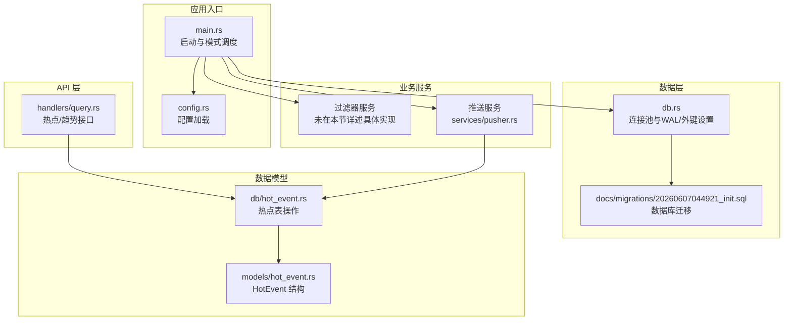
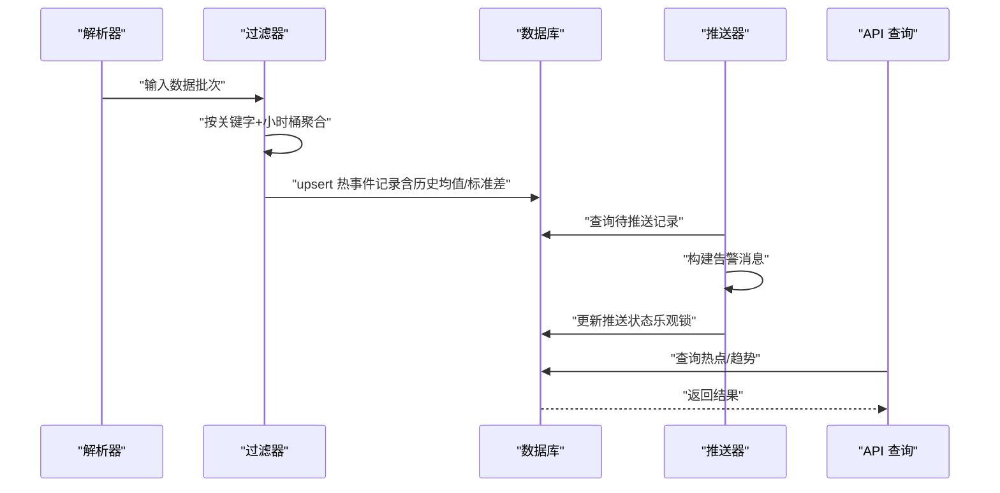
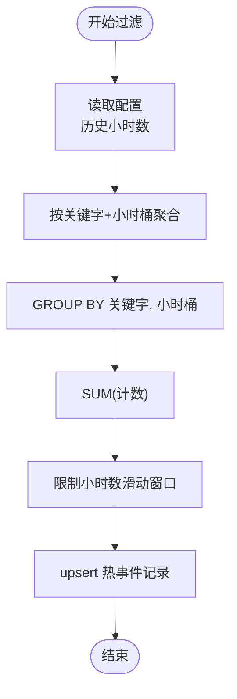
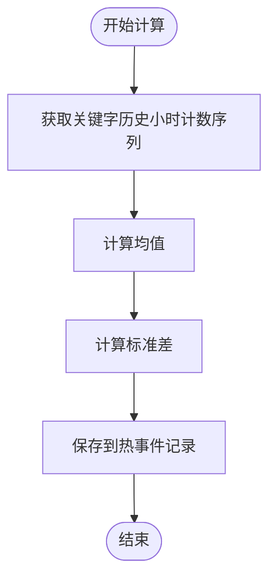
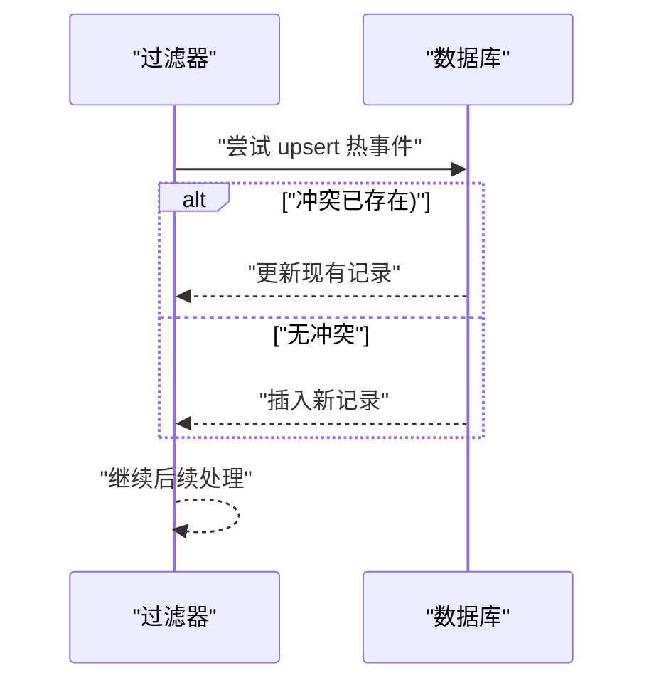
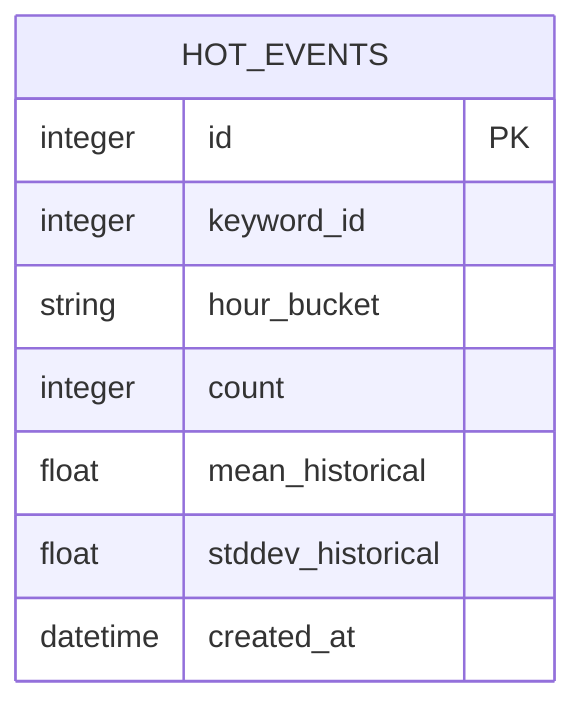
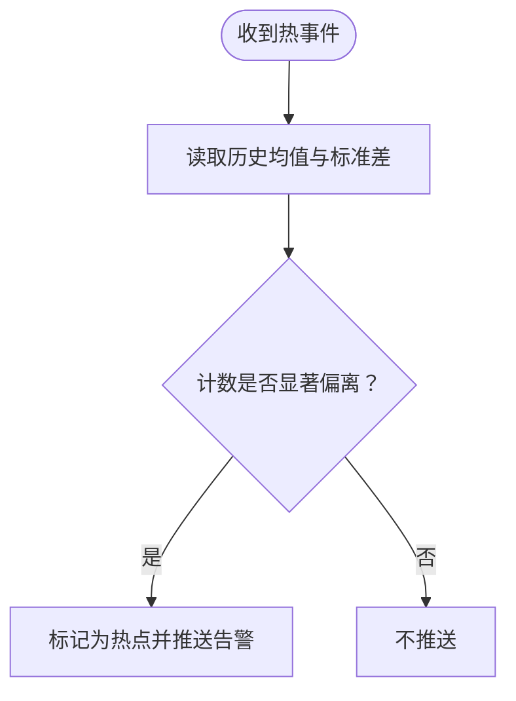
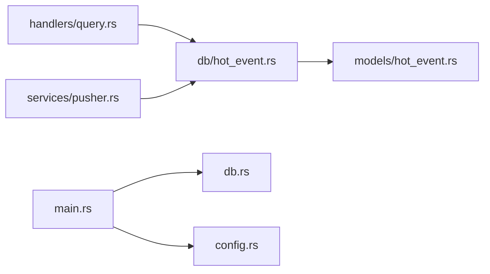

# 统计分析机制

<cite>
**本文引用的文件**
- [main.rs](file://src/main.rs)
- [config.rs](file://src/config.rs)
- [db.rs](file://src/db.rs)
- [handlers/query.rs](file://src/handlers/query.rs)
- [services/pusher.rs](file://src/services/pusher.rs)
- [db/hot_event.rs](file://src/db/hot_event.rs)
- [models/hot_event.rs](file://src/models/hot_event.rs)
- [docs/migrations/20260607044921_init.sql](file://docs/migrations/20260607044921_init.sql)
</cite>

## 目录
1. [引言](#引言)
2. [项目结构](#项目结构)
3. [核心组件](#核心组件)
4. [架构总览](#架构总览)
5. [详细组件分析](#详细组件分析)
6. [依赖关系分析](#依赖关系分析)
7. [性能考量](#性能考量)
8. [故障排查指南](#故障排查指南)
9. [结论](#结论)
10. [附录](#附录)

## 引言
本文件聚焦于系统中的“统计分析机制”，围绕以下目标展开：小时桶计数设计与滑动窗口更新、历史统计数据（均值与标准差）的实时计算、upsert 热事件记录的一致性与幂等性、历史数据存储结构与查询优化、以及如何基于统计指标识别异常波动。文档同时给出计算公式、性能基准建议与配置参数调优思路。

## 项目结构
系统采用模块化分层组织，统计分析相关的关键模块如下：
- 配置层：集中定义服务运行参数，如过滤器的历史窗口、批处理大小、推送器重试策略等。
- 数据访问层：封装 SQLite 访问与迁移初始化，启用 WAL 模式与外键约束。
- 业务服务层：过滤器负责聚合与统计、推送器负责告警推送。
- API 层：提供热点列表、趋势查询等接口；支持手动触发过滤与推送。
- 数据模型层：定义热事件实体及其字段（含历史均值与标准差）。

**图表来源**
- [main.rs:64-160](file://src/main.rs#L64-L160)
- [config.rs:51-58](file://src/config.rs#L51-L58)
- [db.rs:10-27](file://src/db.rs#L10-L27)
- [docs/migrations/20260607044921_init.sql](file://docs/migrations/20260607044921_init.sql)
- [handlers/query.rs:73-146](file://src/handlers/query.rs#L73-L146)
- [services/pusher.rs:11-259](file://src/services/pusher.rs#L11-L259)
- [models/hot_event.rs:5-15](file://src/models/hot_event.rs#L5-L15)
- [db/hot_event.rs:1-124](file://src/db/hot_event.rs#L1-L124)

**章节来源**
- [main.rs:64-160](file://src/main.rs#L64-L160)
- [config.rs:51-58](file://src/config.rs#L51-L58)
- [db.rs:10-27](file://src/db.rs#L10-L27)
- [handlers/query.rs:73-146](file://src/handlers/query.rs#L73-L146)
- [services/pusher.rs:11-259](file://src/services/pusher.rs#L11-L259)
- [models/hot_event.rs:5-15](file://src/models/hot_event.rs#L5-L15)
- [db/hot_event.rs:1-124](file://src/db/hot_event.rs#L1-L124)

## 核心组件
- 小时桶计数与滑动窗口
  - 时间窗口划分：以“小时桶”字符串标识（例如“YYYY-MM-DD HH”），作为聚合键。
  - 聚合逻辑：按关键字与小时桶进行分组求和，得到每小时计数。
  - 历史窗口：过滤器配置中包含历史小时数参数，用于限定统计范围。
- 历史统计（均值与标准差）
  - 实时计算：对每个关键字在历史窗口内的小时计数序列，维护滚动均值与标准差。
  - 存储：将均值与标准差随热事件记录一并入库，便于后续告警与查询。
- upsert 热事件记录
  - 幂等性：通过唯一性约束或条件更新，避免重复写入。
  - 一致性：在事务或乐观锁保障下更新状态，确保并发安全。
- 历史数据存储与查询
  - 表结构：热点表包含关键字、小时桶、计数、历史均值、标准差、创建时间等字段。
  - 查询优化：按关键字与时间倒序分页查询；按小时桶分组汇总；必要时建立索引。
- 异常检测
  - 告警规则：当前实现以“计数显著偏离历史均值”为核心，结合标准差阈值进行判定。

**章节来源**
- [db/hot_event.rs:105-123](file://src/db/hot_event.rs#L105-L123)
- [config.rs:36-49](file://src/config.rs#L36-L49)
- [models/hot_event.rs:5-15](file://src/models/hot_event.rs#L5-L15)
- [handlers/query.rs:121-146](file://src/handlers/query.rs#L121-L146)
- [services/pusher.rs:131-143](file://src/services/pusher.rs#L131-L143)

## 架构总览
系统通过后台任务驱动统计与告警流程：解析器抓取内容，过滤器进行聚合与统计，生成热事件并持久化；推送器周期性拉取待推送记录并发送告警。API 提供查询与手动触发能力。

**图表来源**
- [main.rs:87-110](file://src/main.rs#L87-L110)
- [services/pusher.rs:11-202](file://src/services/pusher.rs#L11-L202)
- [handlers/query.rs:73-146](file://src/handlers/query.rs#L73-L146)
- [db/hot_event.rs:1-124](file://src/db/hot_event.rs#L1-L124)

## 详细组件分析

### 小时桶计数与滑动窗口
- 时间窗口划分策略
  - 使用“年-月-日 时”的小时桶字符串作为时间维度键，便于按小时聚合与展示。
  - 聚合 SQL 对关键字与小时桶进行分组，并对计数求和。
- 滑动窗口更新逻辑
  - 历史窗口由配置项控制，过滤器在每次迭代中仅考虑最近 N 小时的数据。
  - 通过限制查询的小时数量，实现“滑动窗口”的效果。
- 内存管理方案
  - 聚合过程以流式批处理为主，避免一次性加载全部历史数据。
  - 使用分页查询与 LIMIT 控制单次返回量，降低内存峰值。

**图表来源**
- [config.rs:36-42](file://src/config.rs#L36-L42)
- [db/hot_event.rs:105-123](file://src/db/hot_event.rs#L105-L123)

**章节来源**
- [config.rs:36-42](file://src/config.rs#L36-L42)
- [db/hot_event.rs:105-123](file://src/db/hot_event.rs#L105-L123)

### 历史统计数据（均值与标准差）实时计算
- 计算对象
  - 对每个关键字在历史窗口内的小时计数序列，计算滚动均值与标准差。
- 存储位置
  - 将均值与标准差随热事件记录一起保存，便于后续查询与告警。
- 推送端使用
  - 推送器在构建告警消息时，直接从热事件记录读取均值与标准差，形成可读的告警文本。

**图表来源**
- [services/pusher.rs:131-143](file://src/services/pusher.rs#L131-L143)
- [models/hot_event.rs:5-15](file://src/models/hot_event.rs#L5-L15)

**章节来源**
- [services/pusher.rs:131-143](file://src/services/pusher.rs#L131-L143)
- [models/hot_event.rs:5-15](file://src/models/hot_event.rs#L5-L15)

### upsert 热事件记录的实现机制
- upsert 语义
  - 通过“插入并返回”或条件更新的方式，确保同一关键字+小时桶的记录只保留一条最新版本。
- 幂等性保证
  - 若并发写入同一键，upsert 应保持最终一致性；若需要更强一致性，可在数据库层面引入唯一索引或使用事务。
- 数据库一致性处理
  - 使用 SQLite 连接池与 WAL 模式，提升并发写入性能与可靠性。
  - 外键约束开启，确保关联数据完整性。

**图表来源**
- [db/hot_event.rs:13-24](file://src/db/hot_event.rs#L13-L24)
- [db.rs:10-27](file://src/db.rs#L10-L27)

**章节来源**
- [db/hot_event.rs:13-24](file://src/db/hot_event.rs#L13-L24)
- [db.rs:10-27](file://src/db.rs#L10-L27)

### 历史数据的存储结构与查询优化
- 存储结构
  - 热点表包含关键字 ID、小时桶、计数、历史均值、标准差、创建时间等字段。
- 查询路径
  - 列表与分页：按创建时间倒序，支持关键字过滤。
  - 最近热点：全局最近若干条。
  - 趋势查询：按小时桶分组汇总，返回最近 N 小时的计数序列。
- 查询优化建议
  - 在关键字与小时桶上建立复合索引，加速分组与过滤。
  - 在创建时间上建立索引，优化倒序分页。
  - 对趋势查询限制小时数上限，避免大范围扫描。

**图表来源**
- [models/hot_event.rs:5-15](file://src/models/hot_event.rs#L5-L15)
- [docs/migrations/20260607044921_init.sql](file://docs/migrations/20260607044921_init.sql)

**章节来源**
- [models/hot_event.rs:5-15](file://src/models/hot_event.rs#L5-L15)
- [db/hot_event.rs:26-123](file://src/db/hot_event.rs#L26-L123)
- [handlers/query.rs:73-146](file://src/handlers/query.rs#L73-L146)

### 统计指标的业务含义与异常判断
- 指标含义
  - 计数：单位小时内关键词出现频次。
  - 历史均值与标准差：反映该关键词在历史上的稳定水平与波动幅度。
- 异常判断
  - 当前实现以“计数显著偏离历史均值”为核心，结合标准差阈值进行判定。
  - 推送器在告警消息中直接展示均值与标准差，辅助人工判断。

**图表来源**
- [services/pusher.rs:131-143](file://src/services/pusher.rs#L131-L143)
- [models/hot_event.rs:5-15](file://src/models/hot_event.rs#L5-L15)

**章节来源**
- [services/pusher.rs:131-143](file://src/services/pusher.rs#L131-L143)
- [models/hot_event.rs:5-15](file://src/models/hot_event.rs#L5-L15)

## 依赖关系分析
- 组件耦合
  - API 层依赖数据访问层；数据访问层依赖模型层；业务服务层依赖数据访问层。
- 外部依赖
  - SQLite 连接池、WAL 模式、外键约束。
  - HTTP 客户端用于推送 Webhook。
- 可能的循环依赖
  - 当前模块划分清晰，未见循环导入迹象。

**图表来源**
- [handlers/query.rs:73-146](file://src/handlers/query.rs#L73-L146)
- [db/hot_event.rs:1-124](file://src/db/hot_event.rs#L1-L124)
- [models/hot_event.rs:5-15](file://src/models/hot_event.rs#L5-L15)
- [services/pusher.rs:11-259](file://src/services/pusher.rs#L11-L259)
- [main.rs:64-160](file://src/main.rs#L64-L160)
- [config.rs:51-58](file://src/config.rs#L51-L58)

**章节来源**
- [handlers/query.rs:73-146](file://src/handlers/query.rs#L73-L146)
- [db/hot_event.rs:1-124](file://src/db/hot_event.rs#L1-L124)
- [models/hot_event.rs:5-15](file://src/models/hot_event.rs#L5-L15)
- [services/pusher.rs:11-259](file://src/services/pusher.rs#L11-L259)
- [main.rs:64-160](file://src/main.rs#L64-L160)
- [config.rs:51-58](file://src/config.rs#L51-L58)

## 性能考量
- 并发与吞吐
  - 使用连接池与 WAL 模式提升并发写入性能；合理设置最大连接数。
- 批处理与分页
  - 过滤器与推送器均采用批处理与分页策略，避免一次性处理大量数据。
- 查询优化
  - 限制趋势查询小时数；在高频查询字段上建立索引。
- 配置调优建议
  - 历史小时数：根据业务波动周期设定，过小易误报，过大影响实时性。
  - 批大小：平衡吞吐与延迟，避免过大导致内存压力。
  - 推送间隔与重试：根据下游系统负载调整推送频率与重试策略。

[本节为通用指导，无需特定文件引用]

## 故障排查指南
- 数据库连接问题
  - 检查数据库路径与权限；确认 WAL 模式与外键约束已启用。
- 热点未生成
  - 确认过滤器配置的历史小时数与批大小；检查关键字是否存在且有数据。
- 告警未推送
  - 检查通道配置 JSON 是否包含有效 URL；查看推送记录状态与重试次数。
- 查询性能差
  - 为关键字、小时桶、创建时间建立索引；减少趋势查询的小时数。

**章节来源**
- [db.rs:10-27](file://src/db.rs#L10-L27)
- [config.rs:36-49](file://src/config.rs#L36-L49)
- [services/pusher.rs:11-259](file://src/services/pusher.rs#L11-L259)
- [handlers/query.rs:73-146](file://src/handlers/query.rs#L73-L146)

## 结论
本统计分析机制以小时桶为时间粒度，结合滑动窗口与实时均值/标准差，实现了对关键词热度的动态监控与告警。通过 upsert 保证幂等性与一致性，配合合理的查询与索引策略，满足了高并发下的稳定性与可扩展性。未来可在异常检测规则、索引策略与配置参数方面持续优化。

[本节为总结，无需特定文件引用]

## 附录
- 关键配置项
  - 过滤器：历史小时数、最小历史小时数、批大小、轮询间隔。
  - 推送器：轮询间隔、最大重试次数、基础重试秒数。
- 数据库迁移
  - 初始化脚本定义了热点表结构，包含关键字、小时桶、计数、历史统计与时间戳等字段。

**章节来源**
- [config.rs:36-49](file://src/config.rs#L36-L49)
- [docs/migrations/20260607044921_init.sql](file://docs/migrations/20260607044921_init.sql)