# 管道模块规范

<cite>
**本文档引用的文件**
- [pipeline.rs](file://src/pipeline.rs)
- [services.rs](file://src/services.rs)
- [filter.rs](file://src/services/filter.rs)
- [parser.rs](file://src/services/parser.rs)
- [pusher.rs](file://src/services/pusher.rs)
- [channel.rs](file://src/handlers/channel.rs)
- [keyword.rs](file://src/handlers/keyword.rs)
- [source.rs](file://src/handlers/source.rs)
- [query.rs](file://src/handlers/query.rs)
- [token.rs](file://src/handlers/token.rs)
- [db.rs](file://src/db.rs)
- [models.rs](file://src/models.rs)
- [channel.rs](file://src/models/channel.rs)
- [keyword.rs](file://src/models/keyword.rs)
- [source.rs](file://src/models/source.rs)
- [article.rs](file://src/models/article.rs)
- [hot_event.rs](file://src/models/hot_event.rs)
- [keyword_mention.rs](file://src/models/keyword_mention.rs)
- [push_record.rs](file://src/models/push_record.rs)
- [token.rs](file://src/models/token.rs)
- [routes.rs](file://src/routes.rs)
- [main.rs](file://src/main.rs)
- [config.rs](file://src/config.rs)
- [error.rs](file://src/error.rs)
- [auth.rs](file://src/middleware/auth.rs)
- [channel-api.md](file://docs/apis/channel-api.md)
- [keyword-api.md](file://docs/apis/keyword-api.md)
- [source-api.md](file://docs/apis/source-api.md)
- [token-api.md](file://docs/apis/token-api.md)
- [event-driven-pipeline.md](file://docs/plans/09-event-driven-pipeline.md)
- [event-driven-pipeline/spec.md](file://openspec/specs/event-driven-pipeline/spec.md)
</cite>

## 目录
1. [简介](#简介)
2. [项目结构](#项目结构)
3. [核心组件](#核心组件)
4. [架构概览](#架构概览)
5. [详细组件分析](#详细组件分析)
6. [依赖关系分析](#依赖关系分析)
7. [性能考虑](#性能考虑)
8. [故障排除指南](#故障排除指南)
9. [结论](#结论)

## 简介

AI趋势工具是一个基于事件驱动架构的数据处理管道系统，专门用于收集、处理和分析AI领域的新闻文章。该系统通过多层处理管道将原始数据转换为可消费的洞察信息，支持实时推送和查询功能。

管道模块是整个系统的核心，负责协调各个服务组件之间的数据流转，确保数据从采集到展示的完整生命周期管理。系统采用Rust语言开发，结合了现代Web技术栈，提供了高性能、可扩展的数据处理能力。

## 项目结构

该项目采用模块化设计，主要分为以下几个核心层次：

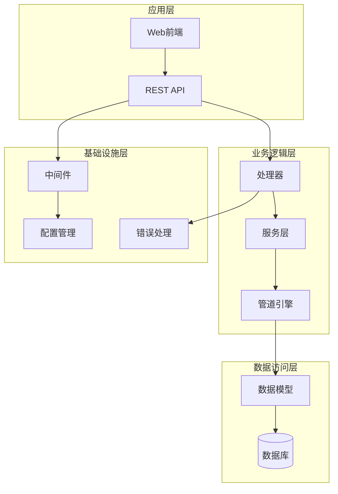

**图表来源**
- [main.rs:1-50](file://src/main.rs#L1-L50)
- [routes.rs:1-40](file://src/routes.rs#L1-L40)
- [services.rs:1-30](file://src/services.rs#L1-L30)

**章节来源**
- [main.rs:1-100](file://src/main.rs#L1-L100)
- [routes.rs:1-80](file://src/routes.rs#L1-L80)
- [config.rs:1-60](file://src/config.rs#L1-L60)

## 核心组件

### 管道引擎 (Pipeline Engine)

管道引擎是整个系统的中枢，负责协调各个处理阶段的执行顺序和数据流转。它实现了事件驱动的异步处理机制，确保数据能够在各个组件之间高效传递。

### 服务层 (Services Layer)

服务层包含三个核心处理服务：

1. **解析器服务 (Parser Service)**：负责解析原始数据格式，提取结构化信息
2. **过滤器服务 (Filter Service)**：对解析后的数据进行质量检查和内容过滤
3. **推送器服务 (Pusher Service)**：将处理完成的数据推送到目标系统或客户端

### 数据模型 (Data Models)

系统定义了完整的数据模型体系，包括：
- 渠道 (Channel)：信息源分类
- 关键词 (Keyword)：分析的主题标签
- 来源 (Source)：数据采集来源
- 文章 (Article)：具体的新闻条目
- 热点事件 (HotEvent)：聚合分析结果
- 推送记录 (PushRecord)：推送历史跟踪

**章节来源**
- [pipeline.rs:1-80](file://src/pipeline.rs#L1-L80)
- [services.rs:1-50](file://src/services.rs#L1-L50)
- [models.rs:1-100](file://src/models.rs#L1-L100)

## 架构概览

系统采用分层架构设计，每层都有明确的职责分工：

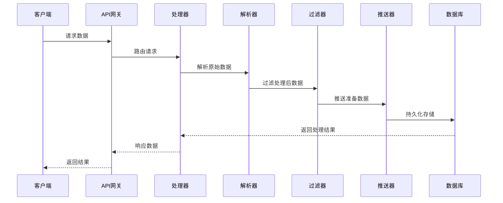

**图表来源**
- [pipeline.rs:20-80](file://src/pipeline.rs#L20-L80)
- [parser.rs:1-60](file://src/services/parser.rs#L1-L60)
- [filter.rs:1-60](file://src/services/filter.rs#L1-L60)
- [pusher.rs:1-60](file://src/services/pusher.rs#L1-L60)

### 数据流架构

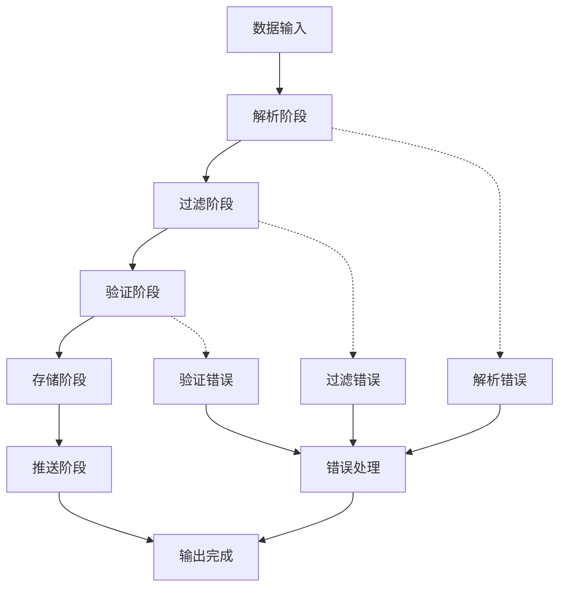

**图表来源**
- [pipeline.rs:1-80](file://src/pipeline.rs#L1-L80)
- [error.rs:1-50](file://src/error.rs#L1-L50)

## 详细组件分析

### 管道引擎组件

管道引擎实现了完整的事件驱动处理流程，具有以下特性：

#### 核心功能
- 异步任务调度
- 错误恢复机制
- 性能监控
- 资源管理

#### 处理流程

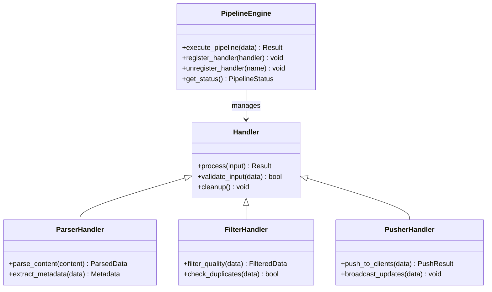

**图表来源**
- [pipeline.rs:1-80](file://src/pipeline.rs#L1-L80)
- [services.rs:1-50](file://src/services.rs#L1-L50)

**章节来源**
- [pipeline.rs:1-120](file://src/pipeline.rs#L1-L120)

### 解析器服务组件

解析器服务负责将原始数据转换为结构化的数据格式：

#### 主要职责
- 内容解析和提取
- 元数据识别
- 格式标准化
- 错误检测

#### 解析策略

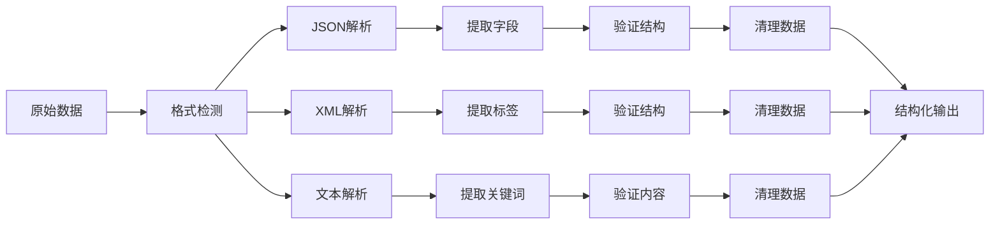

**图表来源**
- [parser.rs:1-80](file://src/services/parser.rs#L1-L80)

**章节来源**
- [parser.rs:1-100](file://src/services/parser.rs#L1-L100)

### 过滤器服务组件

过滤器服务确保只有高质量的数据进入系统：

#### 过滤规则
- 内容质量检查
- 重复数据检测
- 风险内容识别
- 格式完整性验证

#### 过滤流程

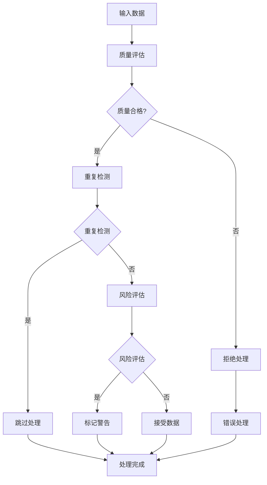

**图表来源**
- [filter.rs:1-80](file://src/services/filter.rs#L1-L80)

**章节来源**
- [filter.rs:1-100](file://src/services/filter.rs#L1-L100)

### 推送器服务组件

推送器服务负责将处理完成的数据分发给客户端：

#### 推送机制
- 实时推送
- 批量处理
- 错误重试
- 连接管理

#### 推送策略

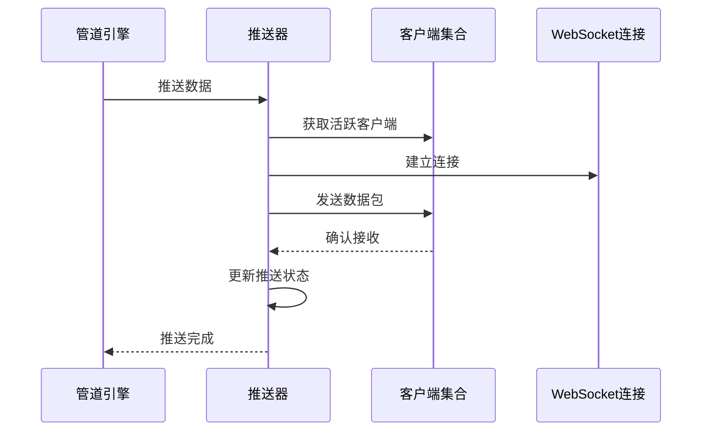

**图表来源**
- [pusher.rs:1-80](file://src/services/pusher.rs#L1-L80)

**章节来源**
- [pusher.rs:1-100](file://src/services/pusher.rs#L1-L100)

### 数据模型组件

系统定义了完整的数据模型体系，支持复杂的关系查询和分析：

#### 核心数据模型

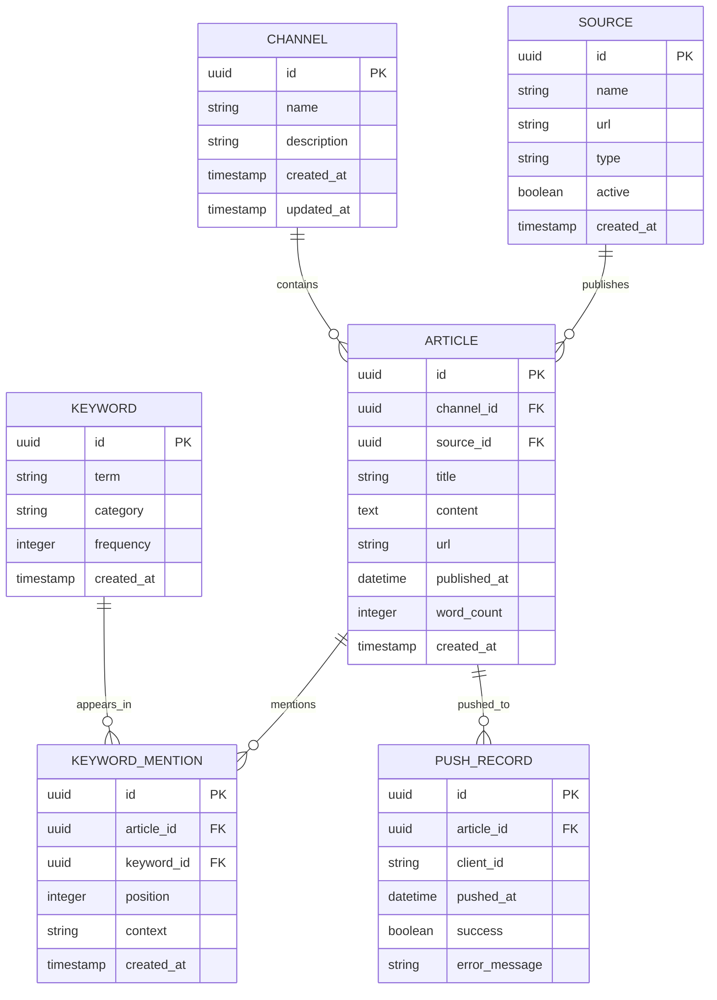

**图表来源**
- [models.rs:1-150](file://src/models.rs#L1-L150)
- [channel.rs:1-80](file://src/models/channel.rs#L1-L80)
- [keyword.rs:1-80](file://src/models/keyword.rs#L1-L80)
- [source.rs:1-80](file://src/models/source.rs#L1-L80)
- [article.rs:1-120](file://src/models/article.rs#L1-L120)
- [keyword_mention.rs:1-80](file://src/models/keyword_mention.rs#L1-L80)
- [push_record.rs:1-80](file://src/models/push_record.rs#L1-L80)

**章节来源**
- [models.rs:1-200](file://src/models.rs#L1-L200)

## 依赖关系分析

系统采用模块化依赖设计，各组件之间保持松耦合：

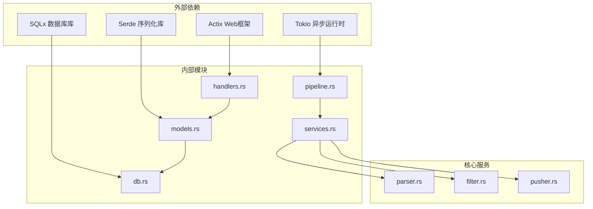

**图表来源**
- [Cargo.toml:1-50](file://Cargo.toml#L1-L50)
- [main.rs:1-50](file://src/main.rs#L1-L50)

### 组件间交互

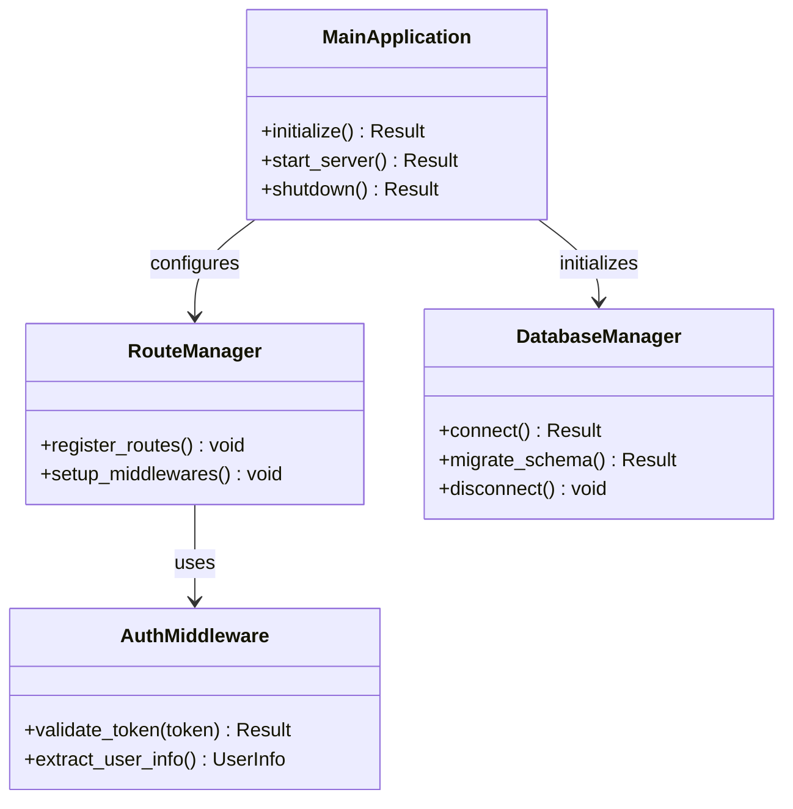

**图表来源**
- [main.rs:1-100](file://src/main.rs#L1-L100)
- [routes.rs:1-80](file://src/routes.rs#L1-L80)
- [auth.rs:1-80](file://src/middleware/auth.rs#L1-L80)

**章节来源**
- [Cargo.toml:1-80](file://Cargo.toml#L1-L80)
- [main.rs:1-150](file://src/main.rs#L1-L150)

## 性能考虑

### 异步处理优化

系统采用Tokio异步运行时，通过非阻塞I/O操作提升并发处理能力：

- **异步数据库操作**：使用SQLx的异步接口
- **并行任务调度**：支持多核CPU资源利用
- **内存池管理**：减少频繁的内存分配开销

### 缓存策略

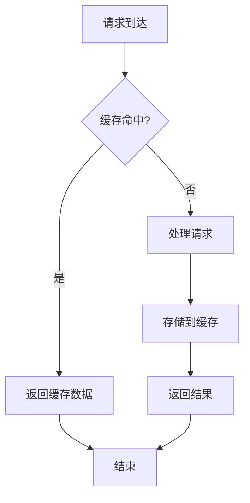

### 监控指标

系统提供全面的性能监控指标：
- 处理延迟时间
- 并发请求数
- 内存使用情况
- 数据库连接池状态

## 故障排除指南

### 常见问题诊断

#### 管道处理异常

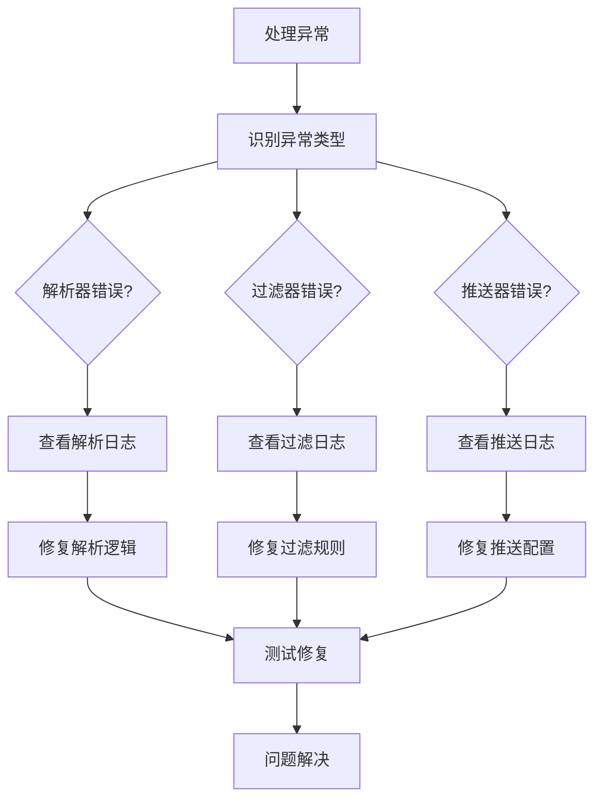

#### 数据库连接问题

**章节来源**
- [error.rs:1-100](file://src/error.rs#L1-L100)
- [db.rs:1-80](file://src/db.rs#L1-L80)

### 错误处理策略

系统实现了多层次的错误处理机制：

1. **输入验证错误**：立即返回用户友好的错误信息
2. **处理过程错误**：记录详细日志并尝试自动恢复
3. **系统级错误**：触发优雅降级模式

## 结论

AI趋势工具的管道模块规范体现了现代数据处理系统的设计理念，通过事件驱动架构实现了高可用、高性能的数据处理能力。系统的关键优势包括：

- **模块化设计**：清晰的职责分离和松耦合架构
- **异步处理**：充分利用现代硬件资源提升吞吐量
- **可扩展性**：支持水平扩展和垂直扩展
- **可靠性**：完善的错误处理和监控机制

该管道模块为AI领域的新闻聚合和分析提供了坚实的技术基础，能够满足大规模数据处理的需求，并为未来的功能扩展预留了充足的空间。