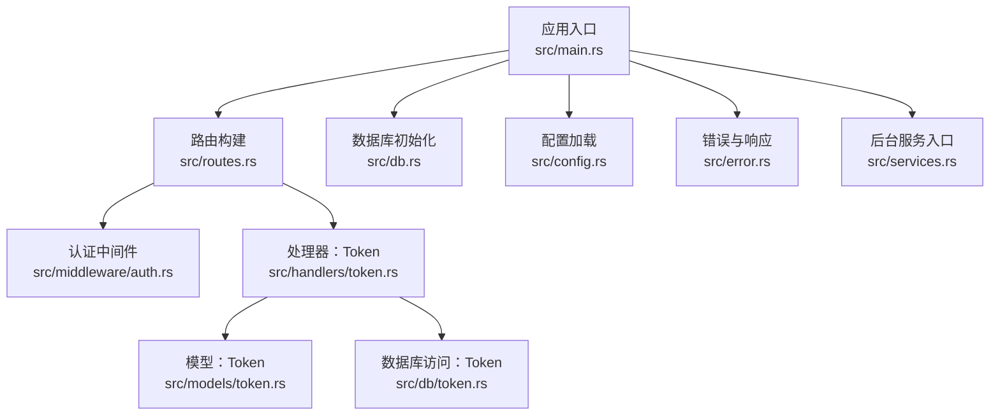
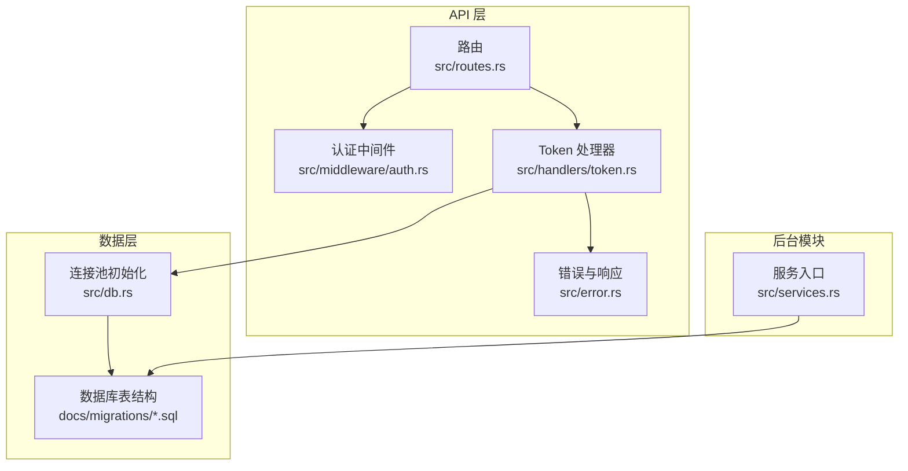
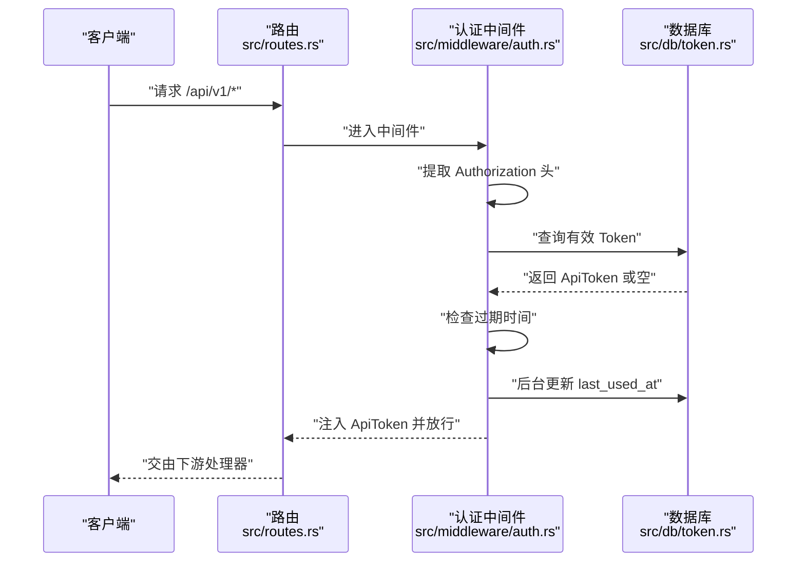
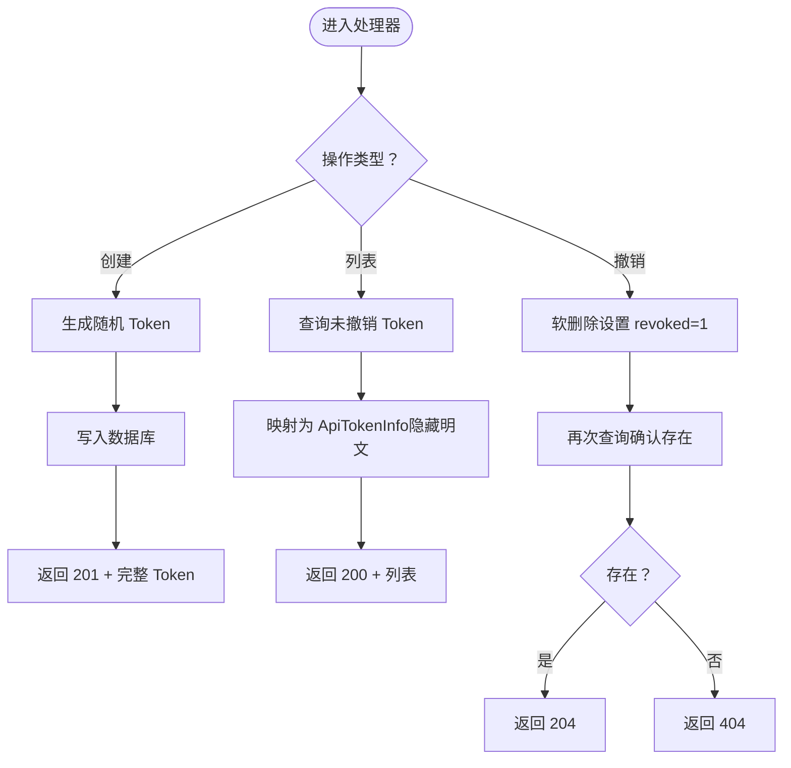
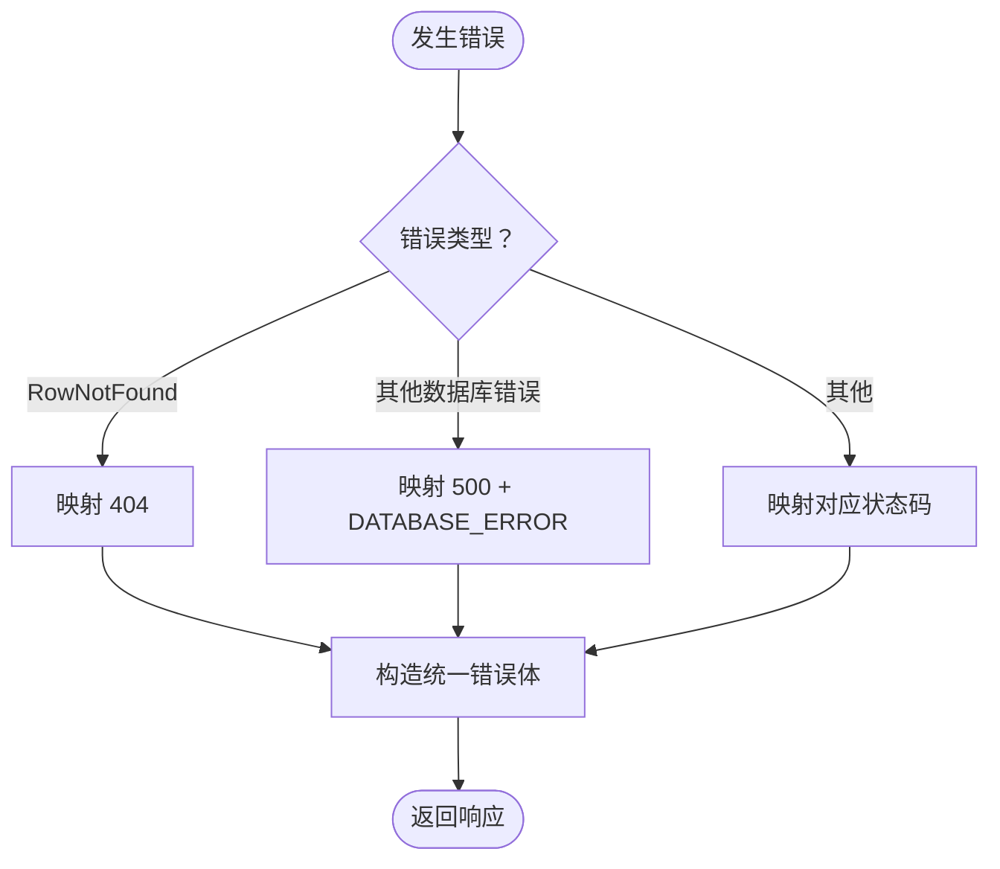
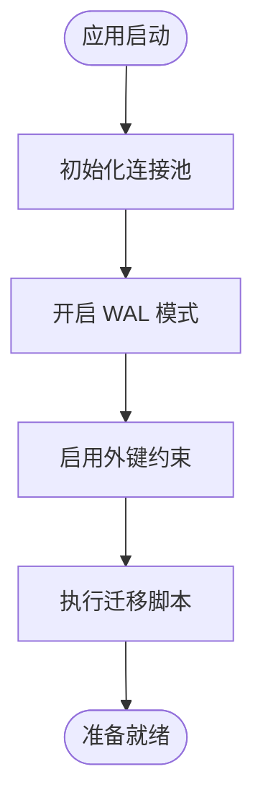
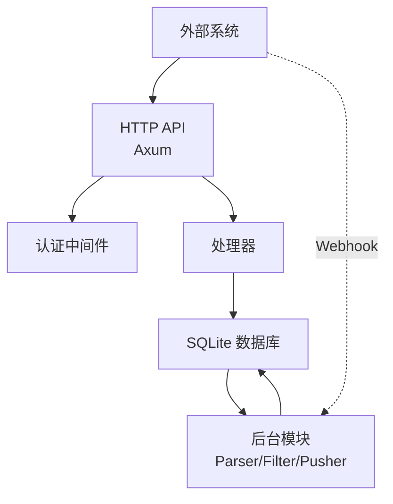
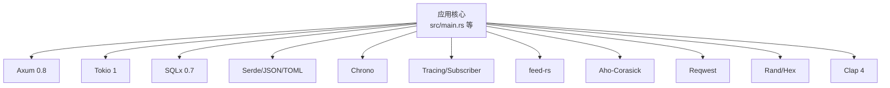

# 系统架构

<cite>
**本文引用的文件**
- [Cargo.toml](file://Cargo.toml)
- [README.md](file://README.md)
- [src/main.rs](file://src/main.rs)
- [src/config.rs](file://src/config.rs)
- [src/db.rs](file://src/db.rs)
- [src/routes.rs](file://src/routes.rs)
- [src/middleware.rs](file://src/middleware.rs)
- [src/middleware/auth.rs](file://src/middleware/auth.rs)
- [src/error.rs](file://src/error.rs)
- [src/handlers.rs](file://src/handlers.rs)
- [src/handlers/token.rs](file://src/handlers/token.rs)
- [src/models.rs](file://src/models.rs)
- [src/models/token.rs](file://src/models/token.rs)
- [src/db/token.rs](file://src/db/token.rs)
- [src/services.rs](file://src/services.rs)
- [docs/migrations/20260607044921_init.sql](file://docs/migrations/20260607044921_init.sql)
- [config.toml](file://config.toml)
</cite>

## 目录
1. [引言](#引言)
2. [项目结构](#项目结构)
3. [核心组件](#核心组件)
4. [架构总览](#架构总览)
5. [详细组件分析](#详细组件分析)
6. [依赖分析](#依赖分析)
7. [性能考虑](#性能考虑)
8. [故障排查指南](#故障排查指南)
9. [结论](#结论)
10. [附录](#附录)

## 引言
本系统是一个基于 Rust 的 AI 热点监控平台，采用模块化设计与管道式后台任务，结合 Axum Web 框架提供受令牌保护的 REST API，并以 SQLite 作为本地存储。系统支持 RSS 采集、关键词匹配与统计突发检测、以及 Webhook 推送等能力，具备良好的扩展性与可运维性。

## 项目结构
项目采用“分层 + 功能模块”相结合的组织方式：
- 应用入口与控制流：main.rs
- 配置解析：config.rs
- 数据库连接池与迁移：db.rs + docs/migrations/*.sql
- 路由与中间件：routes.rs + middleware/auth.rs
- API 处理器：handlers/token.rs
- 统一错误与响应：error.rs
- 数据模型与数据库访问：models/* 与 db/* 子模块
- 后台服务模块：services.rs（parser/filter/pusher 待实现）
- 文档与规范：README.md、openspec/ 与 docs/apis、docs/plans

图表来源
- [src/main.rs:63-96](file://src/main.rs#L63-L96)
- [src/routes.rs:14-48](file://src/routes.rs#L14-L48)
- [src/middleware/auth.rs:18-60](file://src/middleware/auth.rs#L18-L60)
- [src/handlers/token.rs:18-66](file://src/handlers/token.rs#L18-L66)
- [src/db.rs:11-26](file://src/db.rs#L11-L26)
- [src/config.rs:52-59](file://src/config.rs#L52-L59)
- [src/error.rs:8-79](file://src/error.rs#L8-L79)
- [src/models/token.rs:5-46](file://src/models/token.rs#L5-L46)
- [src/db/token.rs:6-107](file://src/db/token.rs#L6-L107)
- [src/services.rs:1-6](file://src/services.rs#L1-L6)

章节来源
- [README.md:216-257](file://README.md#L216-L257)
- [src/main.rs:1-96](file://src/main.rs#L1-L96)
- [src/routes.rs:14-48](file://src/routes.rs#L14-L48)
- [src/db.rs:11-26](file://src/db.rs#L11-L26)
- [src/config.rs:52-59](file://src/config.rs#L52-L59)
- [src/error.rs:8-79](file://src/error.rs#L8-L79)
- [src/models/token.rs:5-46](file://src/models/token.rs#L5-L46)
- [src/db/token.rs:6-107](file://src/db/token.rs#L6-L107)
- [src/services.rs:1-6](file://src/services.rs#L1-L6)

## 核心组件
- 应用入口与生命周期
  - 初始化日志、解析 CLI、加载配置、创建数据库目录、建立连接池、执行迁移、确保初始 Token、构建路由、启动服务器。
- 配置系统
  - 通过 TOML 文件加载，包含服务监听、数据库路径、认证初始 Token、采集/过滤/推送等运行参数。
- 路由与中间件
  - 使用 Axum 路由注册，全局启用 CORS；对 /api/v1/* 应用认证中间件。
- 认证中间件
  - 提取 Authorization 头、校验 Bearer Token、检查撤销与过期、异步更新最近使用时间、注入令牌信息至请求上下文。
- Token 管理 API
  - 支持创建（返回明文一次）、列表（隐藏明文）、撤销（软删除）。
- 统一错误与响应
  - 定义错误类型与 HTTP 映射，统一错误响应体；提供成功响应工具方法。
- 数据模型与数据库访问
  - Token 模型与 DTO、数据库访问函数（创建、查询、撤销、计数、插入初始 Token 等）。
- 数据库与迁移
  - SQLite 连接池初始化（WAL、外键约束），迁移脚本定义表结构与索引。

章节来源
- [src/main.rs:63-96](file://src/main.rs#L63-L96)
- [src/config.rs:4-59](file://src/config.rs#L4-L59)
- [config.toml:1-27](file://config.toml#L1-L27)
- [src/routes.rs:14-48](file://src/routes.rs#L14-L48)
- [src/middleware/auth.rs:18-60](file://src/middleware/auth.rs#L18-L60)
- [src/handlers/token.rs:18-66](file://src/handlers/token.rs#L18-L66)
- [src/error.rs:8-79](file://src/error.rs#L8-L79)
- [src/models/token.rs:5-46](file://src/models/token.rs#L5-L46)
- [src/db/token.rs:6-107](file://src/db/token.rs#L6-L107)
- [src/db.rs:11-26](file://src/db.rs#L11-L26)
- [docs/migrations/20260607044921_init.sql:4-118](file://docs/migrations/20260607044921_init.sql#L4-L118)

## 架构总览
系统采用“管道模式”的后台任务与“REST API + 中间件”的前端交互相结合的整体架构。API 层负责令牌管理与健康检查；后台模块（Parser/Filter/Pusher）独立运行，通过共享数据库进行数据流转。

图表来源
- [src/routes.rs:14-48](file://src/routes.rs#L14-L48)
- [src/middleware/auth.rs:18-60](file://src/middleware/auth.rs#L18-L60)
- [src/handlers/token.rs:18-66](file://src/handlers/token.rs#L18-L66)
- [src/error.rs:8-79](file://src/error.rs#L8-L79)
- [src/db.rs:11-26](file://src/db.rs#L11-L26)
- [docs/migrations/20260607044921_init.sql:4-118](file://docs/migrations/20260607044921_init.sql#L4-L118)
- [src/services.rs:1-6](file://src/services.rs#L1-L6)

## 详细组件分析

### 组件：认证中间件
- 职责
  - 从请求头提取 Bearer Token，查询数据库校验有效性（未撤销），检查过期时间，后台异步更新最近使用时间，将令牌对象注入请求上下文供后续处理器使用。
- 关键流程

图表来源
- [src/middleware/auth.rs:18-60](file://src/middleware/auth.rs#L18-L60)
- [src/db/token.rs:40-59](file://src/db/token.rs#L40-L59)

章节来源
- [src/middleware/auth.rs:18-60](file://src/middleware/auth.rs#L18-L60)
- [src/db/token.rs:40-59](file://src/db/token.rs#L40-L59)

### 组件：Token 管理处理器
- 职责
  - 创建 Token（一次性返回明文）、列出 Token（隐藏明文）、撤销 Token（软删除）。
- 关键流程

图表来源
- [src/handlers/token.rs:18-66](file://src/handlers/token.rs#L18-L66)
- [src/db/token.rs:6-107](file://src/db/token.rs#L6-L107)
- [src/models/token.rs:16-38](file://src/models/token.rs#L16-L38)

章节来源
- [src/handlers/token.rs:18-66](file://src/handlers/token.rs#L18-L66)
- [src/db/token.rs:6-107](file://src/db/token.rs#L6-L107)
- [src/models/token.rs:16-38](file://src/models/token.rs#L16-L38)

### 组件：统一错误与响应
- 职责
  - 定义错误枚举与 HTTP 状态码映射，统一错误响应体；提供成功响应工具方法（200/201/204）。
- 关键流程

图表来源
- [src/error.rs:8-79](file://src/error.rs#L8-L79)

章节来源
- [src/error.rs:8-79](file://src/error.rs#L8-L79)

### 组件：数据库与迁移
- 职责
  - 初始化 SQLite 连接池（WAL 模式、外键约束），执行迁移脚本，提供 Token 相关的数据库操作。
- 关键流程

图表来源
- [src/db.rs:11-26](file://src/db.rs#L11-L26)
- [docs/migrations/20260607044921_init.sql:4-118](file://docs/migrations/20260607044921_init.sql#L4-L118)

章节来源
- [src/db.rs:11-26](file://src/db.rs#L11-L26)
- [docs/migrations/20260607044921_init.sql:4-118](file://docs/migrations/20260607044921_init.sql#L4-L118)

### 组件：系统边界与集成模式
- 系统边界
  - 外部接口：HTTP REST API（Axum）、SQLite 数据库、Webhook 推送目标。
  - 内部模块：API 层（路由/中间件/处理器）、数据层（模型/数据库访问）、后台服务（Parser/Filter/Pusher）。
- 集成模式
  - REST API：/health 健康检查；/api/v1/tokens 管理。
  - 数据库：通过 sqlx 与迁移脚本管理 Schema。
  - 后台模块：独立进程/线程运行，共享数据库状态。

图表来源
- [src/routes.rs:14-48](file://src/routes.rs#L14-L48)
- [src/middleware/auth.rs:18-60](file://src/middleware/auth.rs#L18-L60)
- [src/handlers/token.rs:18-66](file://src/handlers/token.rs#L18-L66)
- [src/db.rs:11-26](file://src/db.rs#L11-L26)
- [src/services.rs:1-6](file://src/services.rs#L1-L6)

## 依赖分析
- 框架与运行时
  - Web：Axum 0.8 + Tower/Tower-HTTP（CORS、Trace）
  - 并发：Tokio 1（full）
  - 序列化：Serde/serde_json/toml
  - 时间：Chrono
  - 日志：Tracing/Subscriber
  - 数据库：SQLx 0.7（SQLite，含 migrate）
  - RSS 解析：feed-rs（用于后续 Parser 模块）
  - 关键词匹配：Aho-Corasick（用于后续 Filter 模块）
  - HTTP 客户端：reqwest（用于后续 Pusher 模块）
  - 随机与编码：rand/hex
  - CLI：clap 4

图表来源
- [Cargo.toml:6-44](file://Cargo.toml#L6-L44)
- [src/main.rs:9-12](file://src/main.rs#L9-L12)

章节来源
- [Cargo.toml:6-44](file://Cargo.toml#L6-L44)
- [src/main.rs:9-12](file://src/main.rs#L9-L12)

## 性能考虑
- 并发与 I/O
  - 使用 Tokio 全功能运行时，Axum 基于异步 IO，适合高并发请求场景。
- 数据库性能
  - SQLite 连接池最大连接数限制为 5，建议在单机部署场景下满足需求；WAL 模式提升并发读写性能。
  - 迁移脚本中为高频查询字段建立索引（如 articles 的 processed_at/source/fetched_at、hot_events 的 keyword/bucket、push_records 的 status）。
- 序列化与日志
  - 使用 Serde/JSON 减少序列化开销；Tracing/Subscriber 提供结构化日志与环境过滤。
- 后台模块
  - Parser/Filter/Pusher 采用独立进程/线程，避免阻塞 API；通过配置项控制批量大小、轮询间隔与重试策略。

章节来源
- [src/db.rs:11-26](file://src/db.rs#L11-L26)
- [docs/migrations/20260607044921_init.sql:45-118](file://docs/migrations/20260607044921_init.sql#L45-L118)
- [README.md:27-36](file://README.md#L27-L36)

## 故障排查指南
- 认证失败
  - 检查 Authorization 头格式是否为 Bearer；确认 Token 未撤销且未过期；查看中间件日志。
- 数据库错误
  - 查看统一错误响应中的 DATABASE_ERROR；核对迁移是否成功执行；检查 WAL 与外键设置。
- Token 管理异常
  - 创建后仅一次可见明文；撤销后应无法再使用；确认软删除生效。
- 健康检查
  - 访问 /health 返回 {"status":"ok"} 表示服务正常。

章节来源
- [src/middleware/auth.rs:18-60](file://src/middleware/auth.rs#L18-L60)
- [src/error.rs:8-79](file://src/error.rs#L8-L79)
- [src/handlers/token.rs:18-66](file://src/handlers/token.rs#L18-L66)
- [src/routes.rs:39-41](file://src/routes.rs#L39-L41)

## 结论
本系统以 Rust 与 Axum 为基础，结合模块化设计与管道式后台任务，实现了轻量、可扩展的热点监控平台。通过统一的认证中间件、清晰的错误与响应体系、以及完善的数据库迁移与索引策略，系统在易用性与可维护性方面具备良好基础。后续可在 CRUD API、Parser/Filter/Pusher 三大后台模块上持续增强，进一步完善数据治理与可视化能力。

## 附录
- 配置文件示例与说明参见 [config.toml:1-27](file://config.toml#L1-L27) 与 [README.md:91-122](file://README.md#L91-L122)。
- 数据库表结构与索引参见 [docs/migrations/20260607044921_init.sql:4-118](file://docs/migrations/20260607044921_init.sql#L4-L118)。
- 依赖清单参见 [Cargo.toml:6-44](file://Cargo.toml#L6-L44)。