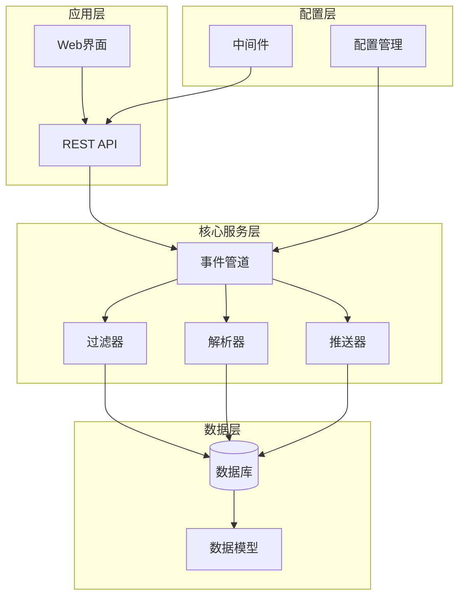
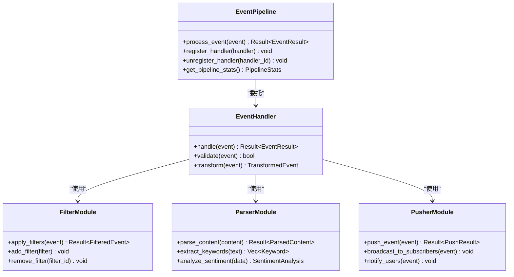
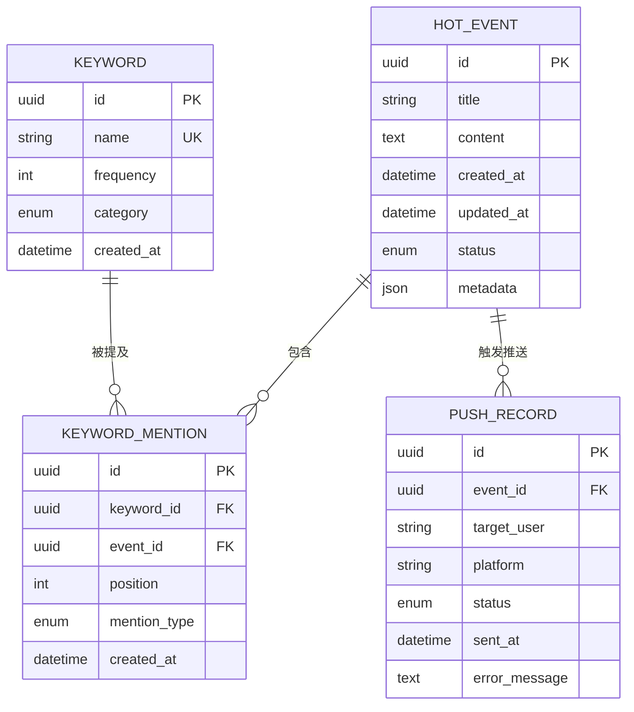
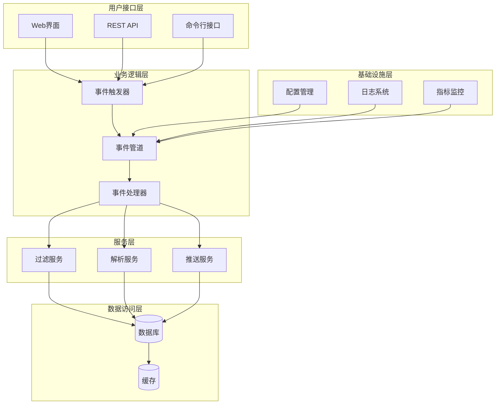
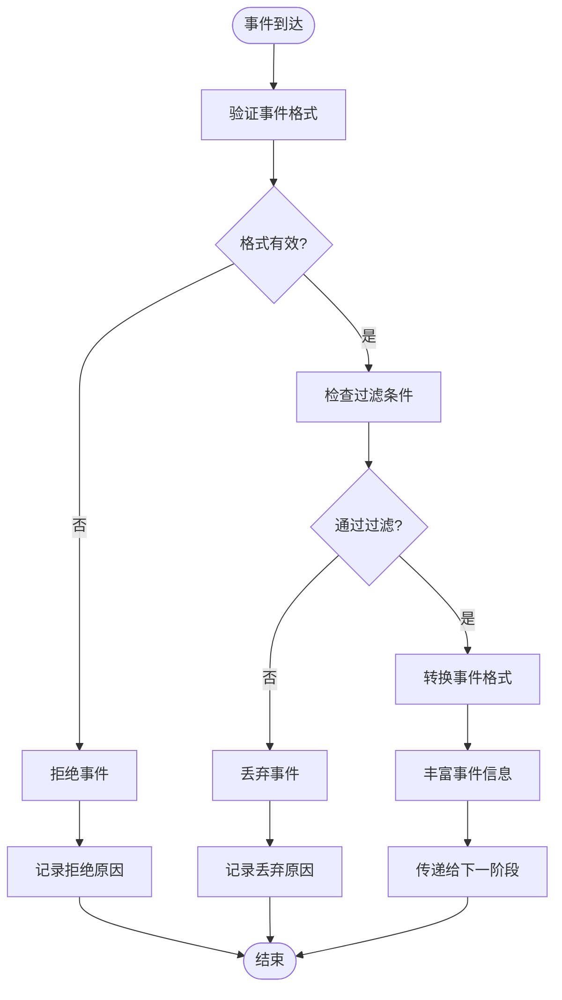
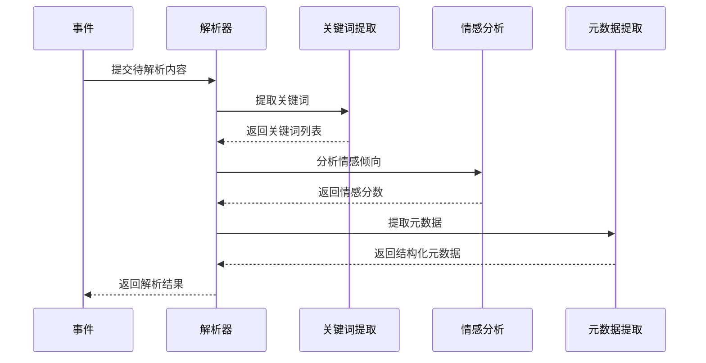
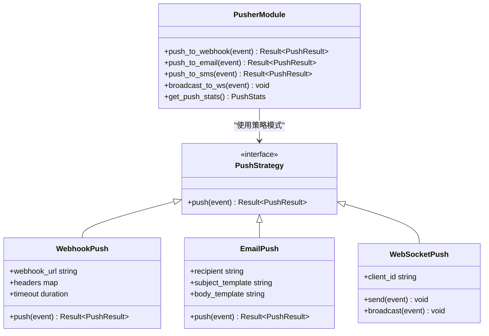
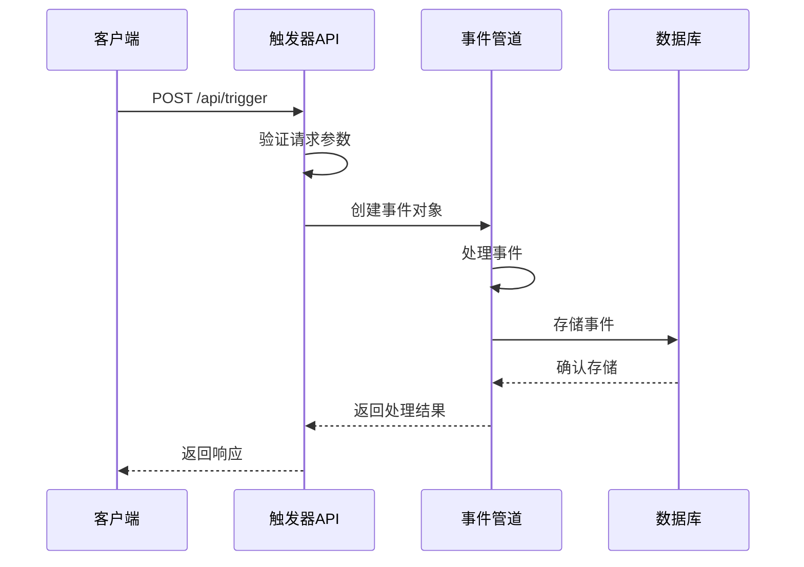
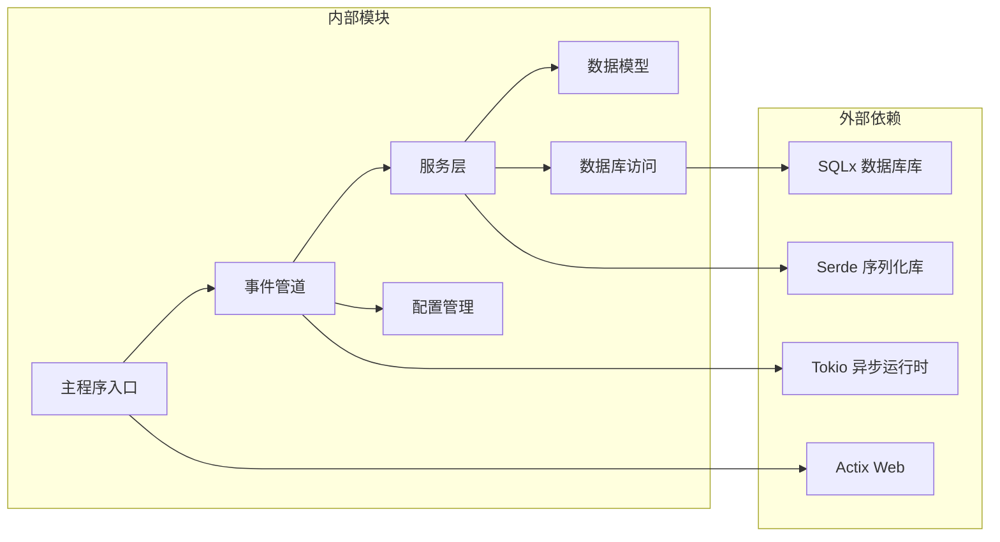

# 事件驱动管道系统

<cite>
**本文档引用的文件**
- [pipeline.rs](file://src/pipeline.rs)
- [main.rs](file://src/main.rs)
- [db.rs](file://src/db.rs)
- [config.rs](file://src/config.rs)
- [hot_event.rs](file://src/models/hot_event.rs)
- [hot_event_db.rs](file://src/db/hot_event.rs)
- [filter.rs](file://src/services/filter.rs)
- [parser.rs](file://src/services/parser.rs)
- [pusher.rs](file://src/services/pusher.rs)
- [09-event-driven-pipeline.md](file://docs/plans/09-event-driven-pipeline.md)
- [event-driven-pipeline.spec.md](file://openspec/changes/event-driven-pipeline/specs/event-driven-pipeline/spec.md)
- [filter-module.spec.md](file://openspec/changes/event-driven-pipeline/specs/filter-module/spec.md)
- [parser-module.spec.md](file://openspec/changes/event-driven-pipeline/specs/parser-module/spec.md)
- [pusher-module.spec.md](file://openspec/changes/event-driven-pipeline/specs/pusher-module/spec.md)
- [graceful-shutdown.spec.md](file://openspec/changes/event-driven-pipeline/specs/graceful-shutdown/spec.md)
- [trigger-apis.spec.md](file://openspec/changes/event-driven-pipeline/specs/trigger-apis/spec.md)
</cite>

## 目录
1. [简介](#简介)
2. [项目结构](#项目结构)
3. [核心组件](#核心组件)
4. [架构概览](#架构概览)
5. [详细组件分析](#详细组件分析)
6. [依赖关系分析](#依赖关系分析)
7. [性能考虑](#性能考虑)
8. [故障排除指南](#故障排除指南)
9. [结论](#结论)

## 简介

事件驱动管道系统是一个基于 Rust 的高性能数据处理平台，专门设计用于实时处理和分析热点事件。该系统采用事件驱动架构，通过多层处理管道实现从数据采集到事件推送的完整流程。

系统的核心特点包括：
- 基于事件驱动的异步处理模型
- 多阶段数据过滤和解析
- 实时事件推送机制
- 完善的错误处理和优雅关闭
- 可扩展的服务架构

## 项目结构

该项目采用模块化组织方式，主要分为以下几个核心部分：

**图表来源**
- [main.rs:1-50](file://src/main.rs#L1-L50)
- [pipeline.rs:1-80](file://src/pipeline.rs#L1-L80)

**章节来源**
- [main.rs:1-100](file://src/main.rs#L1-L100)
- [config.rs:1-80](file://src/config.rs#L1-L80)

## 核心组件

### 事件管道引擎

事件管道是整个系统的核心，负责协调各个处理阶段的工作流程。它实现了完整的事件生命周期管理，包括事件接收、处理、转发和结果返回。

**图表来源**
- [pipeline.rs:1-150](file://src/pipeline.rs#L1-L150)
- [filter.rs:1-80](file://src/services/filter.rs#L1-L80)
- [parser.rs:1-80](file://src/services/parser.rs#L1-L80)
- [pusher.rs:1-80](file://src/services/pusher.rs#L1-L80)

### 数据模型系统

系统使用强类型的数据模型来确保数据的一致性和完整性。每个数据实体都有明确的结构定义和验证规则。

**图表来源**
- [hot_event.rs:1-120](file://src/models/hot_event.rs#L1-L120)
- [hot_event_db.rs:1-100](file://src/db/hot_event.rs#L1-L100)

**章节来源**
- [hot_event.rs:1-150](file://src/models/hot_event.rs#L1-L150)
- [hot_event_db.rs:1-120](file://src/db/hot_event.rs#L1-L120)

## 架构概览

事件驱动管道系统采用分层架构设计，每层都有明确的职责分工：

**图表来源**
- [main.rs:1-80](file://src/main.rs#L1-L80)
- [pipeline.rs:1-120](file://src/pipeline.rs#L1-L120)

## 详细组件分析

### 过滤模块

过滤模块负责对输入事件进行预处理和筛选，确保只有符合要求的事件才能进入后续处理阶段。

**图表来源**
- [filter.rs:1-120](file://src/services/filter.rs#L1-L120)

**章节来源**
- [filter-module.spec.md:1-80](file://openspec/changes/event-driven-pipeline/specs/filter-module/spec.md#L1-L80)
- [filter.rs:1-150](file://src/services/filter.rs#L1-L150)

### 解析模块

解析模块负责从事件内容中提取有用信息，包括关键词识别、情感分析和元数据提取。

**图表来源**
- [parser.rs:1-100](file://src/services/parser.rs#L1-L100)

**章节来源**
- [parser-module.spec.md:1-80](file://openspec/changes/event-driven-pipeline/specs/parser-module/spec.md#L1-L80)
- [parser.rs:1-120](file://src/services/parser.rs#L1-L120)

### 推送模块

推送模块负责将处理后的事件推送给订阅者，支持多种推送渠道和通知方式。

**图表来源**
- [pusher.rs:1-120](file://src/services/pusher.rs#L1-L120)

**章节来源**
- [pusher-module.spec.md:1-80](file://openspec/changes/event-driven-pipeline/specs/pusher-module/spec.md#L1-L80)
- [pusher.rs:1-150](file://src/services/pusher.rs#L1-L150)

### 触发器API

触发器API提供了外部系统与事件管道集成的接口，支持手动触发和批量处理。

**图表来源**
- [trigger-apis.spec.md:1-60](file://openspec/changes/event-driven-pipeline/specs/trigger-apis/spec.md#L1-L60)

**章节来源**
- [trigger-apis.spec.md:1-100](file://openspec/changes/event-driven-pipeline/specs/trigger-apis/spec.md#L1-L100)

## 依赖关系分析

系统采用清晰的依赖层次结构，确保模块间的松耦合和高内聚。

**图表来源**
- [Cargo.toml:1-50](file://Cargo.toml#L1-L50)
- [main.rs:1-60](file://src/main.rs#L1-L60)

**章节来源**
- [Cargo.toml:1-80](file://Cargo.toml#L1-L80)
- [main.rs:1-80](file://src/main.rs#L1-L80)

## 性能考虑

事件驱动管道系统在设计时充分考虑了性能优化：

### 异步处理
- 使用 Tokio 运行时实现非阻塞 I/O
- 事件处理采用异步流式处理模式
- 内存池和对象复用减少 GC 压力

### 缓存策略
- 关键查询结果缓存
- 频繁访问的数据驻留内存
- 分布式缓存支持（可选）

### 并发控制
- 有界通道防止内存溢出
- 任务调度器动态调整并发度
- 资源限制和熔断机制

## 故障排除指南

### 常见问题诊断

**事件处理失败**
- 检查过滤器配置是否正确
- 验证解析器依赖服务可用性
- 查看推送目标配置有效性

**性能问题**
- 监控事件积压情况
- 检查数据库连接池状态
- 分析内存使用趋势

**系统稳定性**
- 查看优雅关闭日志
- 检查资源清理完整性
- 验证错误恢复机制

**章节来源**
- [graceful-shutdown.spec.md:1-60](file://openspec/changes/event-driven-pipeline/specs/graceful-shutdown/spec.md#L1-L60)
- [error.rs:1-80](file://src/error.rs#L1-L80)

### 日志分析

系统提供多层次的日志记录，便于问题定位和性能分析：

- **调试日志**: 详细的操作步骤和变量值
- **信息日志**: 正常操作的确认信息
- **警告日志**: 可能的问题但不影响功能
- **错误日志**: 影响功能的异常情况

## 结论

事件驱动管道系统通过精心设计的架构和实现，为实时事件处理提供了高效、可靠的解决方案。系统的主要优势包括：

1. **高可扩展性**: 模块化设计支持功能扩展和性能提升
2. **高可靠性**: 完善的错误处理和恢复机制
3. **高性能**: 异步处理和优化的内存管理
4. **易维护性**: 清晰的代码结构和完善的文档

该系统适用于需要实时处理大量事件的应用场景，如监控告警、数据分析、实时推荐等。通过合理的配置和调优，可以满足各种性能和可靠性要求。