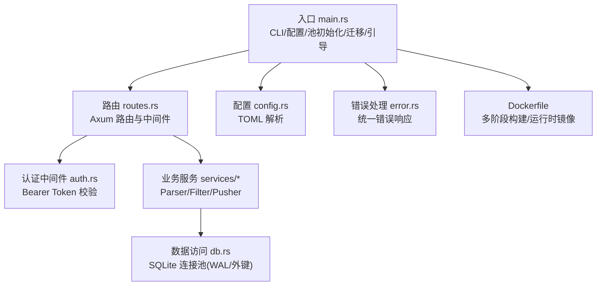
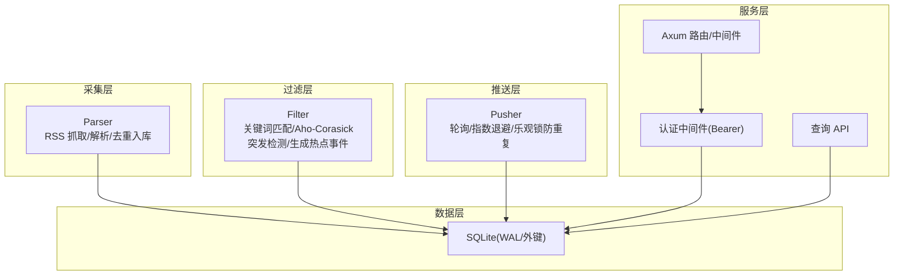
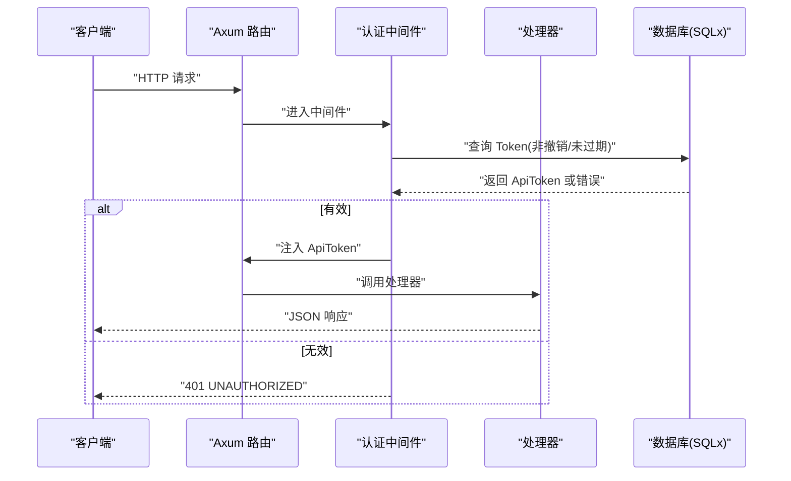
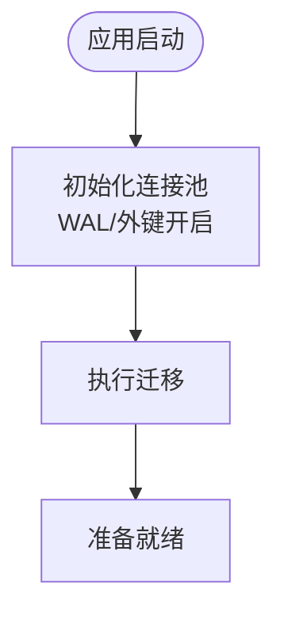
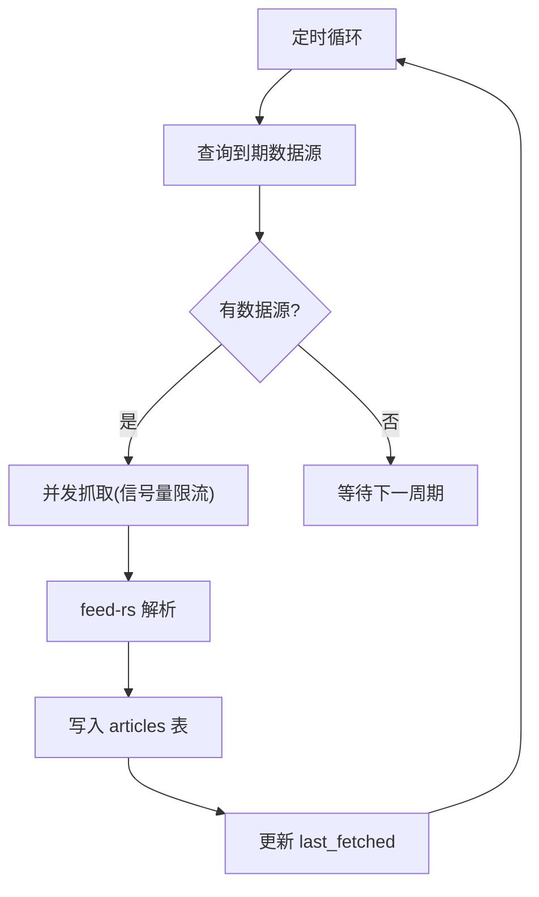
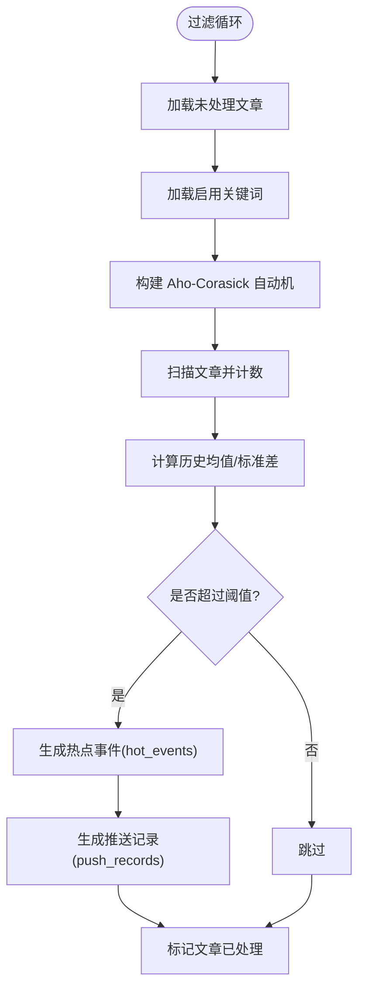
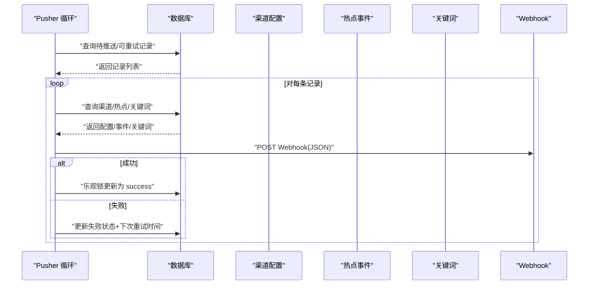
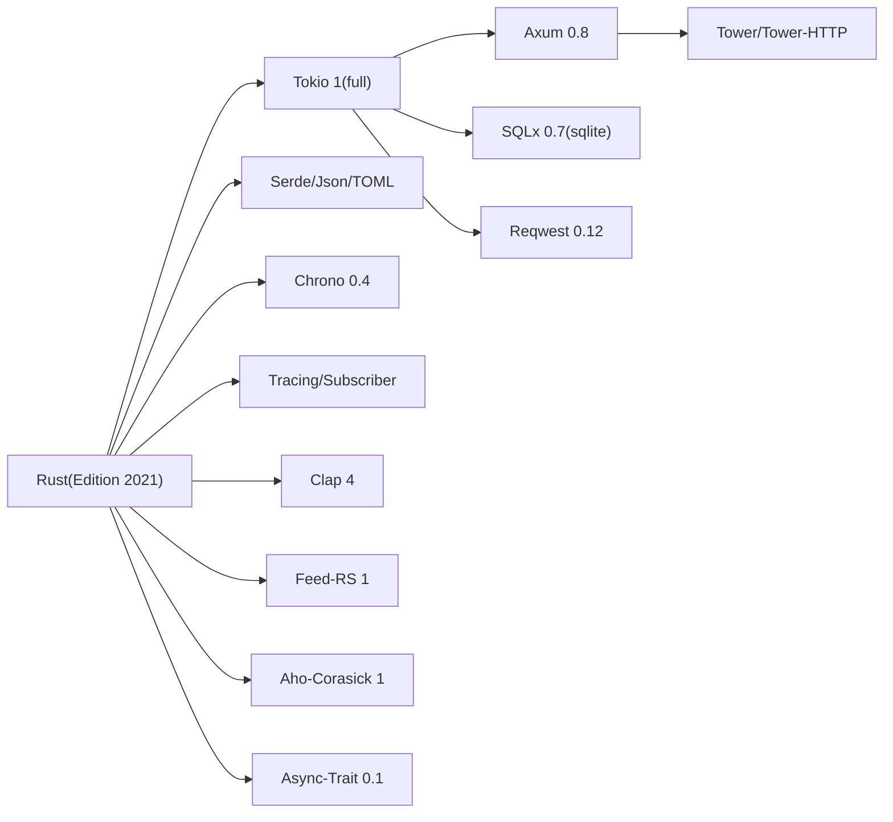

# 技术栈说明

<cite>
**本文引用的文件**
- [Cargo.toml](file://Cargo.toml)
- [README.md](file://README.md)
- [Dockerfile](file://Dockerfile)
- [src/main.rs](file://src/main.rs)
- [src/db.rs](file://src/db.rs)
- [src/config.rs](file://src/config.rs)
- [src/routes.rs](file://src/routes.rs)
- [src/middleware/auth.rs](file://src/middleware/auth.rs)
- [src/error.rs](file://src/error.rs)
- [src/services/parser.rs](file://src/services/parser.rs)
- [src/services/filter.rs](file://src/services/filter.rs)
- [src/services/pusher.rs](file://src/services/pusher.rs)
- [config.toml](file://config.toml)
</cite>

## 目录
1. [引言](#引言)
2. [项目结构](#项目结构)
3. [核心组件](#核心组件)
4. [架构总览](#架构总览)
5. [详细组件分析](#详细组件分析)
6. [依赖关系分析](#依赖关系分析)
7. [性能考量](#性能考量)
8. [故障排查指南](#故障排查指南)
9. [结论](#结论)
10. [附录](#附录)

## 引言
本技术栈说明面向“AI趋势监控系统”，聚焦于系统采用的核心技术与框架：Rust 编程语言、Axum Web 框架、SQLx 数据库访问库、Tokio 异步运行时、feed-rs RSS 解析库、Aho-Corasick 关键词匹配、reqwest HTTP 客户端、Serde 序列化、Tracing 日志、Clap CLI 等。文档从技术选型原因、优势与适用场景出发，结合代码实现与配置文件，给出版本兼容性、依赖关系、升级路径、异步编程模型、内存安全特性、性能优化策略、开发与测试工具链、扩展性与未来演进方向，并进行技术栈对比与替代方案评估。

## 项目结构
系统采用模块化分层组织：
- 入口与控制流：main.rs 负责 CLI、配置加载、数据库连接池初始化、迁移、初始 Token 引导、路由构建与服务启动；并根据运行模式选择性启动后台任务（Parser/Filter/Pusher）。
- 配置层：config.rs 提供结构化配置解析（TOML → 结构体），支持服务器、数据库、认证、采集、过滤、推送等配置段。
- 中间件：auth.rs 实现 Bearer Token 认证中间件，负责头部解析、数据库校验、过期检查、后台更新 last_used_at，并注入 ApiToken 到请求上下文。
- 路由层：routes.rs 使用 Axum 路由注册与中间件层，暴露健康检查与 API v1 路由，统一 CORS。
- 业务服务层：services/parser.rs（RSS 采集与解析）、services/filter.rs（关键词匹配与突发检测）、services/pusher.rs（Webhook 推送与指数退避重试）。
- 数据访问层：db.rs 初始化 SQLite 连接池并启用 WAL 与外键约束；各模块下的 db 子模块封装具体表操作。
- 错误处理：error.rs 定义统一错误类型与响应格式，自动将 sqlx::Error 映射为合适的 HTTP 状态码。
- 配置文件：config.toml 提供默认运行参数，Dockerfile 提供多阶段构建与运行时镜像。

图表来源
- [src/main.rs:64-164](file://src/main.rs#L64-L164)
- [src/routes.rs:14-70](file://src/routes.rs#L14-L70)
- [src/middleware/auth.rs:18-58](file://src/middleware/auth.rs#L18-L58)
- [src/db.rs:12-27](file://src/db.rs#L12-L27)
- [src/config.rs:51-58](file://src/config.rs#L51-L58)
- [src/error.rs:8-79](file://src/error.rs#L8-L79)
- [Dockerfile:1-61](file://Dockerfile#L1-L61)

章节来源
- [README.md:25-37](file://README.md#L25-L37)
- [src/main.rs:64-164](file://src/main.rs#L64-L164)
- [src/config.rs:51-58](file://src/config.rs#L51-L58)
- [src/routes.rs:14-70](file://src/routes.rs#L14-L70)
- [src/db.rs:12-27](file://src/db.rs#L12-L27)
- [Dockerfile:1-61](file://Dockerfile#L1-L61)

## 核心组件
- Rust（Edition 2021）：系统语言，强调内存安全、零成本抽象与高性能，适合高并发与长生命周期服务。
- Axum（0.8）+ Tower：高性能 Web 框架与中间件栈，提供类型安全路由与可组合中间件。
- SQLx（0.7）+ SQLite：异步数据库访问库，支持编译期 SQL 检查与运行时迁移，SQLite 适配本地部署与单机场景。
- Tokio（1）+ async-trait：异步运行时与 trait 对象抽象，支撑 Parser 的可扩展接口设计与并发控制。
- feed-rs（1）：RSS/Atom 解析库，用于从数据源抓取并解析条目。
- Aho-Corasick（1）：多模式字符串匹配，用于关键词快速匹配。
- reqwest（0.12）：HTTP 客户端，用于 RSS 抓取与 Webhook 推送。
- Serde/serde_json/toml：序列化与配置解析，统一数据交换格式。
- Tracing/tracing-subscriber：结构化日志与环境过滤，便于生产可观测性。
- Clap（4）：命令行解析，支持子命令与参数。
- Dockerfile：多阶段构建，最小化运行时镜像。

章节来源
- [Cargo.toml:6-46](file://Cargo.toml#L6-L46)
- [README.md:25-37](file://README.md#L25-L37)
- [Dockerfile:1-61](file://Dockerfile#L1-L61)

## 架构总览
系统采用“管道模式（Pipeline）”：Parser → Filter → Pusher 三段式后台任务，配合 Axum API 服务与 SQLite 数据存储。Parser 并发抓取 RSS，Filter 周期性进行关键词匹配与突发检测，Pusher 轮询并推送 Webhook，同时具备指数退避与乐观锁防重复。

图表来源
- [src/services/parser.rs:94-185](file://src/services/parser.rs#L94-L185)
- [src/services/filter.rs:269-277](file://src/services/filter.rs#L269-L277)
- [src/services/pusher.rs:251-259](file://src/services/pusher.rs#L251-L259)
- [src/routes.rs:14-70](file://src/routes.rs#L14-L70)
- [src/middleware/auth.rs:18-58](file://src/middleware/auth.rs#L18-L58)
- [src/db.rs:12-27](file://src/db.rs#L12-L27)

## 详细组件分析

### Rust 与异步运行时（Tokio）
- 异步模型：Tokio::main 标注 main 函数为异步入口，后台任务通过 tokio::spawn 并发执行，Parser 使用信号量限制并发抓取，Filter/Pusher 使用定时循环与 sleep 控制节奏。
- 内存安全：Rust 类型系统与所有权保证并发安全，避免数据竞争；SQLx 查询在编译期绑定参数，减少运行时错误。
- 性能特征：Release 配置启用 LTO、单代码生成单元、符号剥离与 panic abort，追求极致性能与二进制体积。

章节来源
- [src/main.rs:64-164](file://src/main.rs#L64-L164)
- [src/services/parser.rs:94-185](file://src/services/parser.rs#L94-L185)
- [src/services/filter.rs:269-277](file://src/services/filter.rs#L269-L277)
- [src/services/pusher.rs:251-259](file://src/services/pusher.rs#L251-L259)
- [Cargo.toml:48-67](file://Cargo.toml#L48-L67)

### Web 框架（Axum + Tower）
- 路由与中间件：Axum 提供类型安全路由与中间件注入；CORS 层统一跨域；认证中间件在进入处理器前完成 Token 校验与上下文注入。
- 错误处理：统一 AppError → IntoResponse，自动映射常见错误码，数据库错误统一为 INTERNAL_ERROR 并记录日志。

图表来源
- [src/routes.rs:14-70](file://src/routes.rs#L14-L70)
- [src/middleware/auth.rs:18-58](file://src/middleware/auth.rs#L18-L58)
- [src/error.rs:23-50](file://src/error.rs#L23-L50)

章节来源
- [src/routes.rs:14-70](file://src/routes.rs#L14-L70)
- [src/middleware/auth.rs:18-58](file://src/middleware/auth.rs#L18-L58)
- [src/error.rs:8-79](file://src/error.rs#L8-L79)

### 数据库访问（SQLx + SQLite）
- 连接池：SqlitePoolOptions 设置最大连接数，初始化时启用 WAL 模式与外键约束，提升并发与一致性。
- 迁移：启动时执行迁移目录下的 SQL，确保表结构一致。
- 查询：使用 SQLx 的查询宏与参数绑定，避免 SQL 注入风险。

图表来源
- [src/db.rs:12-27](file://src/db.rs#L12-L27)
- [src/main.rs:80-84](file://src/main.rs#L80-L84)

章节来源
- [src/db.rs:12-27](file://src/db.rs#L12-L27)
- [src/main.rs:80-84](file://src/main.rs#L80-L84)

### RSS 解析（feed-rs）
- Parser 实现：RssParser 基于 feed-rs 解析 RSS/Atom 条目，使用 reqwest 发起 HTTP 请求，设置 User-Agent 与超时；解析后提取标题、摘要、内容与发布时间。
- 并发控制：使用信号量限制并发抓取数量，避免对上游源造成压力。
- 错误处理：抓取失败与插入失败分别记录日志并更新 last_fetched，避免无限重试。

图表来源
- [src/services/parser.rs:94-185](file://src/services/parser.rs#L94-L185)

章节来源
- [src/services/parser.rs:32-88](file://src/services/parser.rs#L32-L88)
- [src/services/parser.rs:94-185](file://src/services/parser.rs#L94-L185)

### 关键词匹配与突发检测（Aho-Corasick + 统计方法）
- 匹配策略：分离大小写敏感与大小写不敏感关键词，分别构建 Aho-Corasick 自动机，批量扫描未处理文章，累计小时桶计数并记录关键词提及。
- 突发检测：基于滑动窗口（默认 24 小时）计算均值与标准差，当前小时计数超过阈值（均值 + 多倍标准差）且达到最小热点计数时，判定为热点。
- 去重与幂等：按 keyword_id + hour_bucket 去重插入 hot_events，避免重复热点事件。

图表来源
- [src/services/filter.rs:13-208](file://src/services/filter.rs#L13-L208)
- [src/services/filter.rs:210-277](file://src/services/filter.rs#L210-L277)

章节来源
- [src/services/filter.rs:13-208](file://src/services/filter.rs#L13-L208)
- [src/services/filter.rs:210-277](file://src/services/filter.rs#L210-L277)

### Webhook 推送与重试（指数退避 + 乐观锁）
- 轮询策略：按配置周期轮询 pending 与 retry_due 的推送记录。
- 幂等与防重：使用乐观锁（WHERE 状态=期望值 AND retry_count<阈值）更新状态，避免并发重复推送。
- 指数退避：失败时按 retry_count 计算下次重试时间，超过最大重试则放弃并清空下次重试时间。

图表来源
- [src/services/pusher.rs:11-202](file://src/services/pusher.rs#L11-L202)
- [src/services/pusher.rs:207-242](file://src/services/pusher.rs#L207-L242)

章节来源
- [src/services/pusher.rs:11-202](file://src/services/pusher.rs#L11-L202)
- [src/services/pusher.rs:207-242](file://src/services/pusher.rs#L207-L242)

### 配置与运行模式
- 配置解析：TOML 文件映射到 AppConfig/子配置结构，支持服务器、数据库、认证、采集、过滤、推送等段落。
- 运行模式：支持 all/api/parser/filter/pusher，all 模式下同时启动后台任务与 API 服务；api 模式仅启动 API 服务。

章节来源
- [src/config.rs:51-58](file://src/config.rs#L51-L58)
- [config.toml:1-27](file://config.toml#L1-L27)
- [src/main.rs:86-160](file://src/main.rs#L86-L160)

## 依赖关系分析
- 语言与运行时：Rust 2021 + Tokio 1（full 特性）。
- Web 与中间件：Axum 0.8 + axum-extra + tower + tower-http（CORS/trace）。
- 数据库：SQLx 0.7（runtime-tokio/sqlite/chrono/migrate）。
- 解析与匹配：feed-rs 1（RSS）、Aho-Corasick 1（关键词）。
- HTTP 客户端：reqwest 0.12（json 特性）。
- 序列化与时间：Serde/serde_json/toml + chrono 0.4。
- 日志与 CLI：tracing/tracing-subscriber + clap 4。
- 异步抽象：async-trait 0.1。

图表来源
- [Cargo.toml:6-46](file://Cargo.toml#L6-L46)

章节来源
- [Cargo.toml:6-46](file://Cargo.toml#L6-L46)

## 性能考量
- 编译优化：Release 配置启用 LTO、单代码生成单元、符号剥离、panic abort、禁用增量与溢出检查，追求极致性能与更小二进制体积。
- 异步并发：Parser 使用信号量限制并发抓取；Filter/Pusher 使用定时循环，避免忙轮询；Tokio spawn 后台任务。
- 数据库优化：SQLite WAL 模式提升并发读写；外键约束保障一致性；批量插入与幂等 upsert。
- 算法优化：Aho-Corasick 多模式匹配；小时桶计数与滑动窗口统计，降低每次处理的数据量。
- 网络优化：统一 User-Agent 与超时设置；指数退避与乐观锁减少重复推送与网络抖动影响。

章节来源
- [Cargo.toml:48-67](file://Cargo.toml#L48-L67)
- [src/services/parser.rs:94-185](file://src/services/parser.rs#L94-L185)
- [src/services/filter.rs:269-277](file://src/services/filter.rs#L269-L277)
- [src/services/pusher.rs:251-259](file://src/services/pusher.rs#L251-L259)
- [src/db.rs:12-27](file://src/db.rs#L12-L27)

## 故障排查指南
- 认证失败：检查 Authorization 头格式与 Token 是否存在、未撤销、未过期；确认中间件注入的 ApiToken 是否正确。
- 数据库错误：查看统一错误响应中的 DATABASE_ERROR，结合日志定位具体 SQL 语句与参数。
- Parser 失败：关注抓取超时、上游源不可达、feed-rs 解析异常；检查并发限制与信号量。
- Filter 未触发热点：确认关键词启用状态、历史窗口长度、阈值参数；检查小时桶 upsert 是否幂等。
- Pusher 重试过多：检查目标 Webhook 地址有效性、网络连通性、响应状态码；核对指数退避与乐观锁更新。

章节来源
- [src/middleware/auth.rs:18-58](file://src/middleware/auth.rs#L18-L58)
- [src/error.rs:8-79](file://src/error.rs#L8-L79)
- [src/services/parser.rs:101-182](file://src/services/parser.rs#L101-L182)
- [src/services/filter.rs:131-208](file://src/services/filter.rs#L131-L208)
- [src/services/pusher.rs:146-202](file://src/services/pusher.rs#L146-L202)

## 结论
该技术栈以 Rust 为核心，结合 Tokio 异步运行时、Axum Web 框架、SQLx 数据库访问与 feed-rs、Aho-Corasick 等专用库，构建了高并发、内存安全、可观测性强的 AI 趋势监控系统。通过管道模式的后台任务与统一的认证中间件，系统实现了从 RSS 采集、关键词匹配与突发检测到 Webhook 推送的完整闭环。配置驱动与多阶段容器化进一步提升了可维护性与可移植性。未来可在保持现有异步与内存安全优势的前提下，逐步引入更丰富的可视化与分布式能力。

## 附录

### 版本兼容性与升级路径
- Rust：项目使用 Edition 2021，建议保持与稳定版 Rust 兼容；升级时优先验证 Tokio、SQLx、Axum 的兼容矩阵。
- Tokio：1.x 系列向后兼容良好，注意新版本对 spawn 策略与调度行为的微调。
- SQLx：0.7 支持 SQLite/WAL/迁移，升级时关注查询宏与参数绑定的变更。
- Axum：0.8 与 0.7 差异较小，注意中间件与路由语法细节。
- feed-rs：1.x 稳定版本，升级时关注解析行为与字段映射变化。
- Aho-Corasick：1.x 稳定版本，升级时关注匹配性能与内存占用。
- reqwest：0.12 提升了 JSON 支持与连接复用，升级时关注超时与重试策略。
- Serde/chrono/tracing/clap：均为活跃生态库，建议按季度同步次要版本。

章节来源
- [Cargo.toml:6-46](file://Cargo.toml#L6-L46)
- [README.md:42-43](file://README.md#L42-L43)

### 开发工具链与测试框架
- 开发工具链：Rust 工具链（rustup/cargo）、IDE 插件（如 rust-analyzer）、格式化（rustfmt）、静态检查（clippy）。
- 测试框架：建议引入单元测试与集成测试（mock 数据库/HTTP），结合 tracing 输出进行日志验证。
- 调试工具：RUST_LOG 环境变量配合 tracing-subscriber 的 env-filter；使用断点与日志双通道定位问题。

章节来源
- [Cargo.toml:26-27](file://Cargo.toml#L26-L27)
- [src/main.rs:66](file://src/main.rs#L66)

### 扩展性与未来演进方向
- 扩展性：模块化设计便于新增数据源类型（如 Atom、JSON Feed）、替换匹配算法（如正则/模糊匹配）、扩展推送渠道（Slack/Discord/Webhook）。
- 未来演进：引入分布式消息队列（如 Kafka/RabbitMQ）解耦后台任务；采用 Postgres 替代 SQLite 以支持更大规模；增加前端可视化与仪表盘；引入指标采集（Prometheus/OpenTelemetry）与分布式追踪。

章节来源
- [README.md:25-37](file://README.md#L25-L37)
- [src/services/parser.rs:21-30](file://src/services/parser.rs#L21-L30)

### 技术栈对比与替代方案评估
- Web 框架：Axum 相较于 Rocket/Actix 更强调中间件组合与类型安全；若追求极简路由可考虑 Warp，但生态与中间件丰富度不及 Axum。
- 数据库：SQLx 在 Rust 生态中优势明显，SQLite 适合单机部署；若需水平扩展可考虑 PostgreSQL/MySQL，代价是复杂度上升。
- RSS 解析：feed-rs 专注 RSS/Atom；若需更广泛的 Feed 格式可评估 rss-parser 或自研解析器。
- 匹配算法：Aho-Corasick 在多模式匹配上性能优异；若需模糊匹配可引入模糊库（如 fuzzy-matching），但会牺牲性能。
- HTTP 客户端：reqwest 功能完备；若需更高性能可评估 hyper/bytes，但需要自行处理更多细节。
- 日志：Tracing 生态完善；若需集中式日志可接入 OpenTelemetry 或 Loki。

章节来源
- [README.md:25-37](file://README.md#L25-L37)
- [Cargo.toml:6-46](file://Cargo.toml#L6-L46)