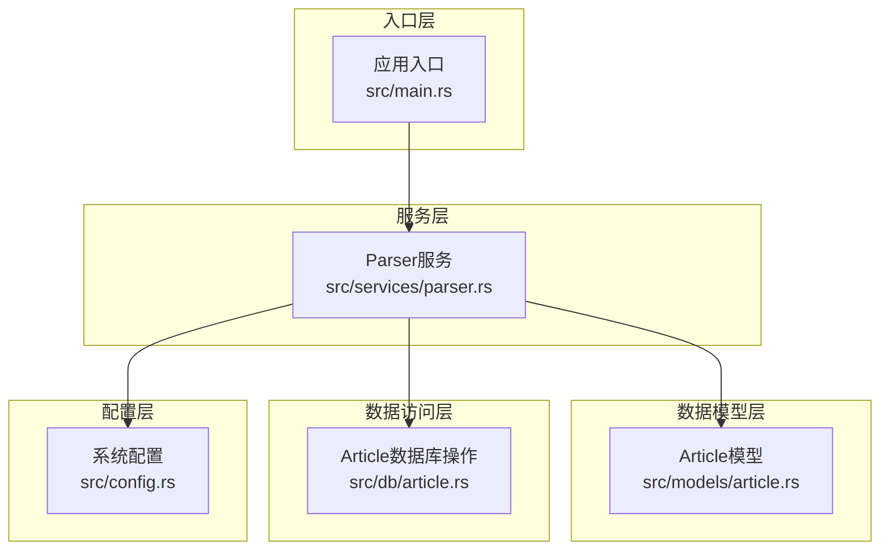
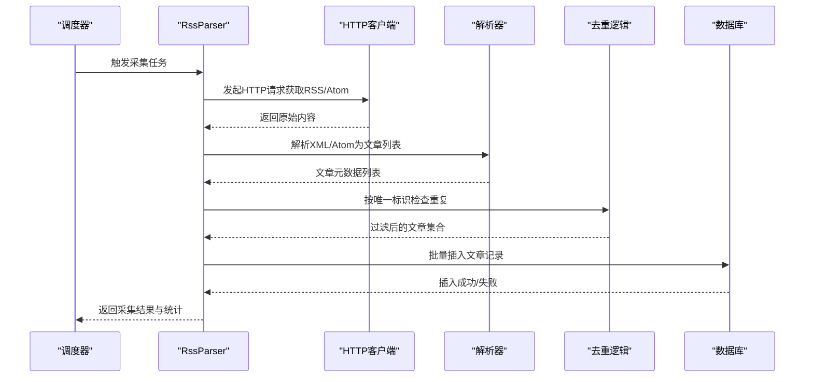
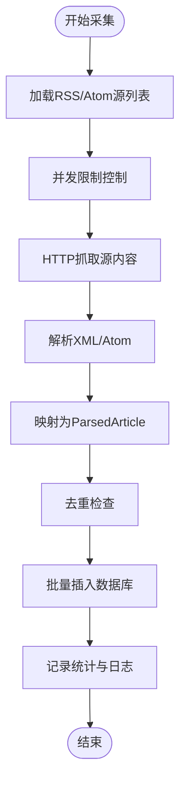
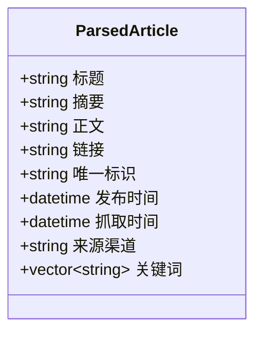
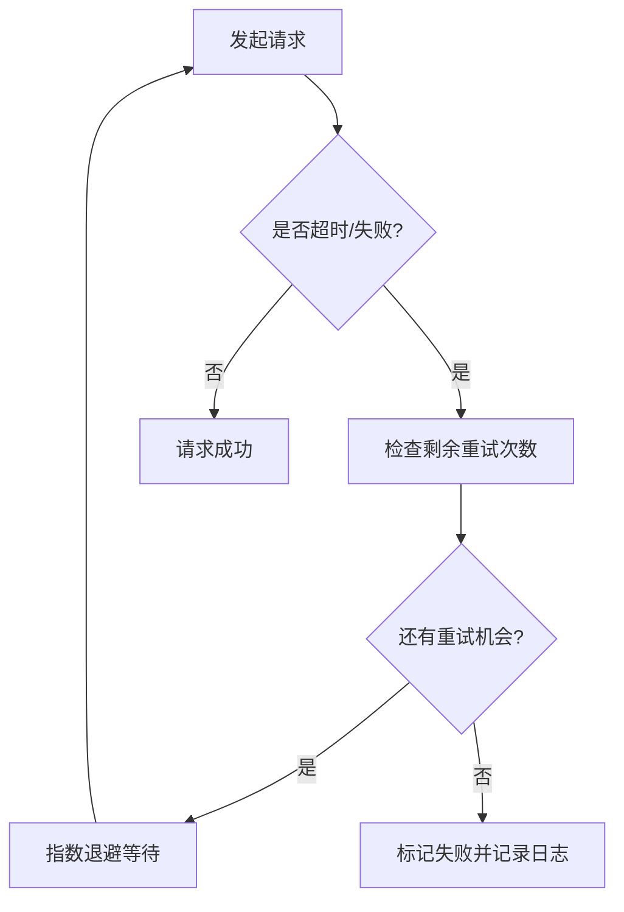
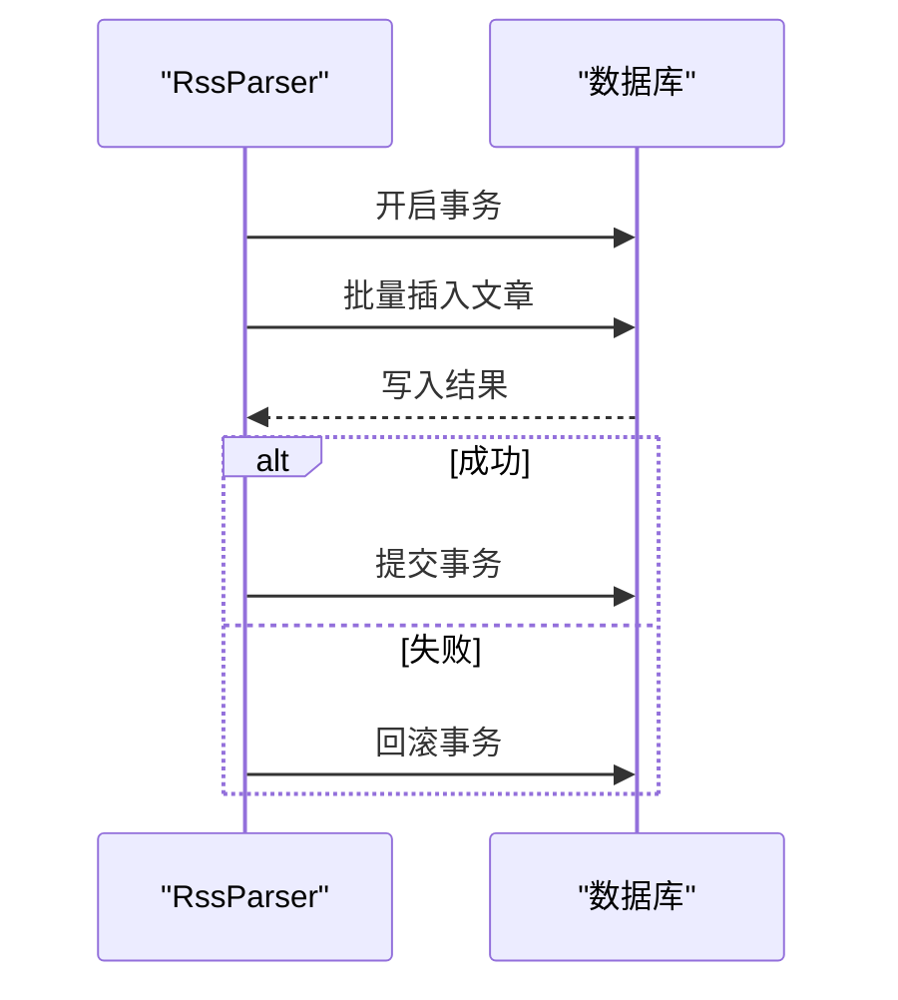
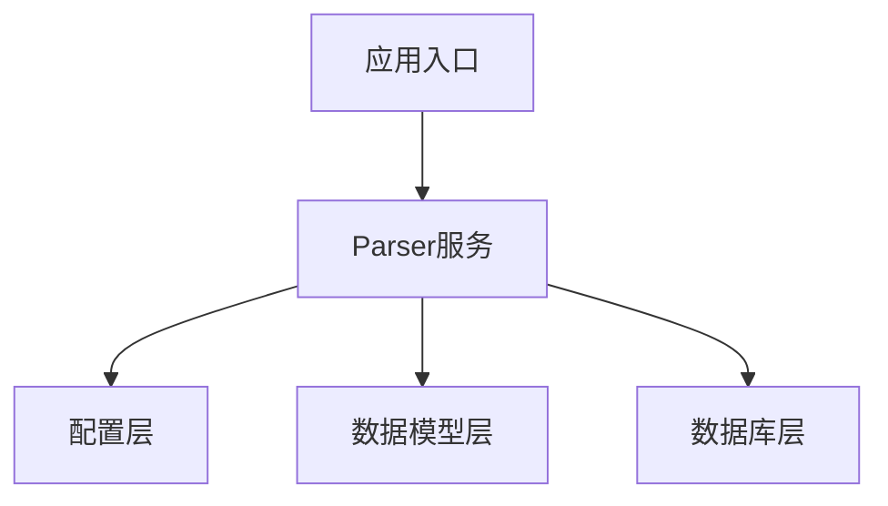

# RSS数据采集流程

<cite>
**本文档引用的文件**
- [parser.rs](file://src/services/parser.rs)
- [article.rs](file://src/db/article.rs)
- [article.rs](file://src/models/article.rs)
- [config.rs](file://src/config.rs)
- [main.rs](file://src/main.rs)
</cite>

## 目录
1. [简介](#简介)
2. [项目结构](#项目结构)
3. [核心组件](#核心组件)
4. [架构概览](#架构概览)
5. [详细组件分析](#详细组件分析)
6. [依赖关系分析](#依赖关系分析)
7. [性能考虑](#性能考虑)
8. [故障排除指南](#故障排除指南)
9. [结论](#结论)

## 简介
本文件详细说明RSS/Atom数据采集流程的技术实现，重点涵盖Parser模块的网络请求处理、内容解析、并发控制与错误处理机制。文档将深入解释RssParser实现、ParsedArticle数据结构、并发获取限制与重试策略，并阐述数据采集的时间调度机制、去重逻辑与存储流程。同时提供配置参数说明、性能优化建议以及与数据库交互的插入策略、事务处理与错误恢复机制。

## 项目结构
RSS数据采集相关的核心代码位于以下模块：
- 服务层：Parser服务负责从RSS/Atom源抓取并解析文章
- 数据模型层：Article模型定义文章的数据结构
- 数据访问层：Article数据库操作封装
- 配置层：系统运行参数与限流配置
- 入口层：应用启动与任务调度入口

**图表来源**
- [parser.rs](file://src/services/parser.rs)
- [article.rs](file://src/models/article.rs)
- [article.rs](file://src/db/article.rs)
- [config.rs](file://src/config.rs)
- [main.rs](file://src/main.rs)

**章节来源**
- [parser.rs](file://src/services/parser.rs)
- [article.rs](file://src/models/article.rs)
- [article.rs](file://src/db/article.rs)
- [config.rs](file://src/config.rs)
- [main.rs](file://src/main.rs)

## 核心组件
- RssParser：负责从RSS/Atom源抓取、解析与入库的主控制器
- ParsedArticle：解析后的文章数据结构，包含标题、摘要、链接、发布时间等字段
- 并发控制：通过信号量或限流器限制同时进行的抓取任务数量
- 错误处理：对网络异常、解析失败、数据库写入失败等情况进行分类处理与重试
- 存储流程：将解析后的文章写入数据库，包含去重逻辑（基于唯一标识）
- 时间调度：周期性触发采集任务，支持配置间隔与批量执行

**章节来源**
- [parser.rs](file://src/services/parser.rs)
- [article.rs](file://src/models/article.rs)
- [article.rs](file://src/db/article.rs)
- [config.rs](file://src/config.rs)

## 架构概览
RSS采集的整体流程如下：
- 应用启动后，定时器按配置周期触发采集任务
- Parser服务从RSS/Atom源发起HTTP请求
- 解析器解析XML/Atom内容，提取文章元信息
- 将解析结果转换为ParsedArticle对象
- 去重检查（基于唯一标识），过滤重复条目
- 批量写入数据库，采用事务保证一致性
- 记录统计与错误日志，必要时进行重试

**图表来源**
- [parser.rs](file://src/services/parser.rs)
- [article.rs](file://src/db/article.rs)

## 详细组件分析

### RssParser实现
- 职责
  - 从RSS/Atom源拉取内容
  - 解析XML/Atom为文章实体
  - 执行去重与批量入库
  - 统计采集结果与错误
- 关键流程
  - 获取RSS/Atom源列表
  - 限流并发抓取
  - 解析与映射到ParsedArticle
  - 去重过滤
  - 批量插入数据库
  - 记录日志与指标

**图表来源**
- [parser.rs](file://src/services/parser.rs)

**章节来源**
- [parser.rs](file://src/services/parser.rs)

### ParsedArticle数据结构
- 字段设计
  - 标题、摘要、正文（可选）
  - 原文链接、唯一标识符
  - 发布时间、抓取时间
  - 来源渠道、关键词标记（可选）
- 设计要点
  - 唯一标识用于去重
  - 时间字段便于排序与过期清理
  - 可扩展字段支持后续增强

**图表来源**
- [article.rs](file://src/models/article.rs)

**章节来源**
- [article.rs](file://src/models/article.rs)

### 并发获取限制与重试策略
- 并发控制
  - 使用信号量或限流器限制同时进行的抓取任务数量
  - 避免对目标站点造成过大压力
- 重试策略
  - 对网络超时、HTTP 5xx等可恢复错误进行指数退避重试
  - 对解析失败与数据库写入失败进行有限次数重试
  - 区分致命错误（如404）与可恢复错误

**图表来源**
- [parser.rs](file://src/services/parser.rs)

**章节来源**
- [parser.rs](file://src/services/parser.rs)

### 数据采集的时间调度机制
- 定时触发
  - 应用启动后按配置的采集间隔周期性触发
  - 支持批量处理多个RSS/Atom源
- 任务隔离
  - 每次采集作为一个独立任务，避免阻塞其他任务
  - 可配置最大并发数与单次采集源数量上限

**章节来源**
- [main.rs](file://src/main.rs)
- [config.rs](file://src/config.rs)

### 去重逻辑
- 去重依据
  - 使用文章的唯一标识（如GUID或链接哈希）进行去重
- 实现方式
  - 在入库前查询数据库中是否存在相同唯一标识
  - 过滤掉已存在的条目，仅保留新条目
- 性能优化
  - 为唯一标识建立索引，提升查询效率
  - 批量查询减少数据库往返

**章节来源**
- [article.rs](file://src/db/article.rs)
- [article.rs](file://src/models/article.rs)

### 存储流程与数据库交互
- 插入策略
  - 将过滤后的文章集合按批次写入数据库
  - 使用事务确保一批文章要么全部成功，要么全部回滚
- 事务处理
  - 失败时回滚事务，避免部分写入导致的数据不一致
- 错误恢复
  - 记录失败原因与受影响的文章集合
  - 后续重试或人工介入处理

**图表来源**
- [parser.rs](file://src/services/parser.rs)
- [article.rs](file://src/db/article.rs)

**章节来源**
- [parser.rs](file://src/services/parser.rs)
- [article.rs](file://src/db/article.rs)

## 依赖关系分析
- Parser服务依赖配置层以获取采集间隔、并发限制等参数
- Parser服务依赖数据模型层进行数据结构定义
- Parser服务依赖数据库层进行批量写入与事务控制
- 应用入口负责启动定时器与调度采集任务

**图表来源**
- [parser.rs](file://src/services/parser.rs)
- [config.rs](file://src/config.rs)
- [article.rs](file://src/models/article.rs)
- [article.rs](file://src/db/article.rs)
- [main.rs](file://src/main.rs)

**章节来源**
- [parser.rs](file://src/services/parser.rs)
- [config.rs](file://src/config.rs)
- [article.rs](file://src/models/article.rs)
- [article.rs](file://src/db/article.rs)
- [main.rs](file://src/main.rs)

## 性能考虑
- 并发与限流
  - 合理设置最大并发数，避免对RSS源造成过大压力
  - 为每个源设置独立的速率限制
- 批量写入
  - 使用批量插入减少数据库往返
  - 控制每批大小以平衡内存占用与吞吐量
- 缓存与索引
  - 为唯一标识建立索引，加速去重查询
  - 对热点源内容进行短期缓存（需谨慎处理时效性）
- 超时与重试
  - 设置合理的连接与读取超时
  - 指数退避重试，避免雪崩效应
- 监控与告警
  - 记录采集成功率、平均耗时、失败原因
  - 对异常波动及时告警

## 故障排除指南
- 常见问题
  - 网络超时：检查网络连通性与代理设置；增加超时时间或调整重试策略
  - 解析失败：确认RSS/Atom格式是否符合预期；对异常源进行白名单管理
  - 数据库写入失败：检查数据库连接与权限；确认事务未被长时间占用
  - 去重失效：确认唯一标识生成规则是否稳定；重建索引
- 排查步骤
  - 查看采集日志与错误统计
  - 验证配置参数是否正确
  - 对失败源进行单独测试
  - 检查数据库状态与索引完整性

**章节来源**
- [parser.rs](file://src/services/parser.rs)
- [article.rs](file://src/db/article.rs)

## 结论
RSS数据采集流程通过RssParser实现从源抓取、解析、去重与入库的完整闭环。配合合理的并发控制、重试策略与事务处理，能够在保证数据质量的同时提升整体吞吐。建议在生产环境中结合监控与告警体系，持续优化并发与批处理策略，确保系统的稳定性与可维护性。