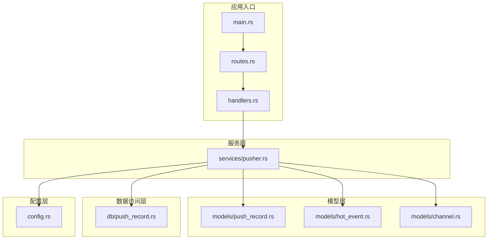
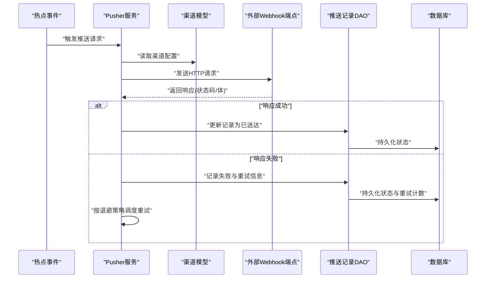
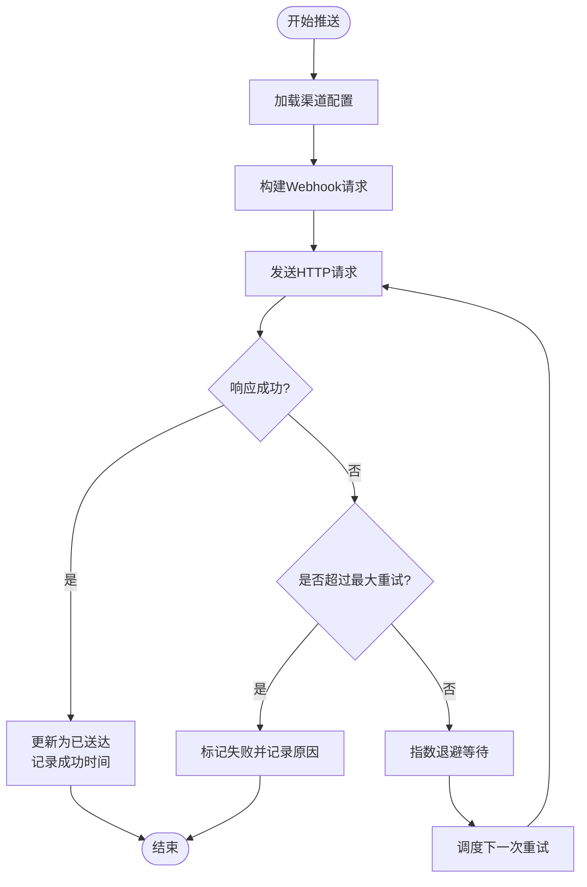
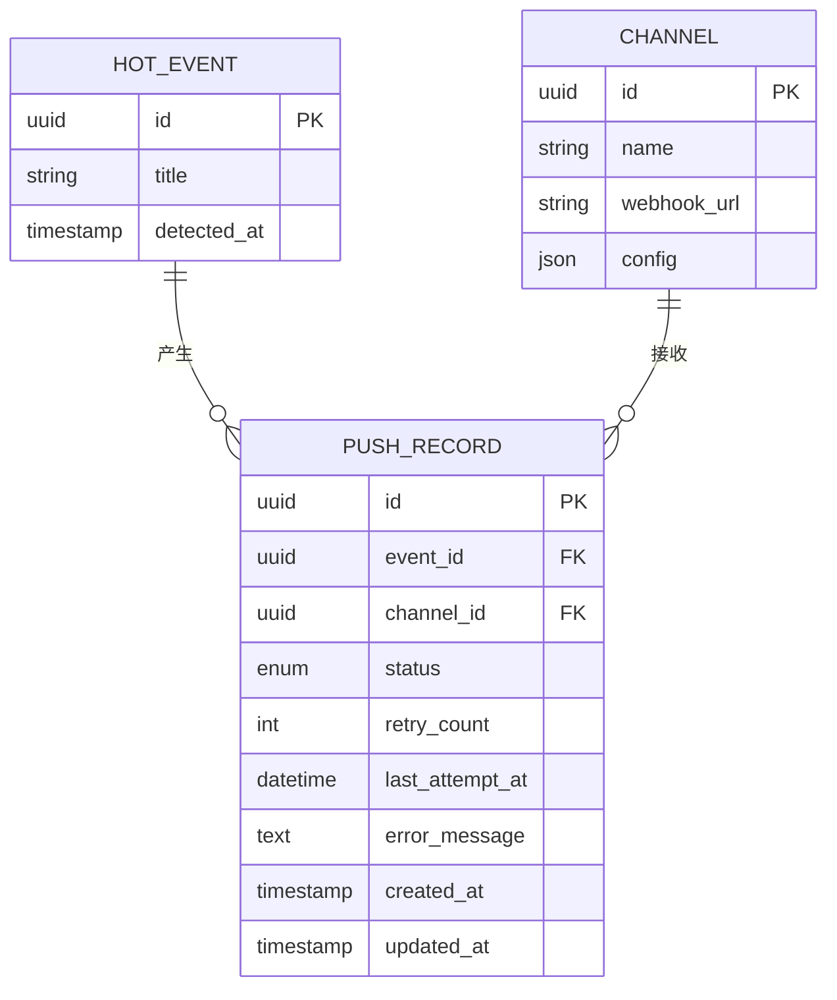
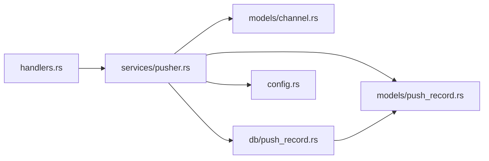

# 事件推送与交付流程

<cite>
**本文档引用的文件**
- [pusher.rs](file://src/services/pusher.rs)
- [push_record.rs（模型）](file://src/models/push_record.rs)
- [push_record.rs（数据库）](file://src/db/push_record.rs)
- [main.rs](file://src/main.rs)
- [config.rs](file://src/config.rs)
- [handlers.rs](file://src/handlers.rs)
- [routes.rs](file://src/routes.rs)
- [hot_event.rs](file://src/models/hot_event.rs)
- [channel.rs](file://src/models/channel.rs)
- [error.rs](file://src/error.rs)
</cite>

## 目录
1. [简介](#简介)
2. [项目结构](#项目结构)
3. [核心组件](#核心组件)
4. [架构总览](#架构总览)
5. [详细组件分析](#详细组件分析)
6. [依赖关系分析](#依赖关系分析)
7. [性能考虑](#性能考虑)
8. [故障排除指南](#故障排除指南)
9. [结论](#结论)
10. [附录](#附录)

## 简介
本文件面向“事件推送与交付流程”的技术文档，聚焦于Pusher模块如何将识别的热点事件推送到指定渠道，涵盖以下关键主题：
- 推送渠道选择与Webhook调用
- 失败重试机制与状态跟踪
- 推送记录管理与幂等性保障
- 并发推送控制、退避算法与错误处理
- 渠道配置、消息格式与响应验证
- 推送流程图、监控指标与故障排除

该文档以代码库中的实际实现为依据，避免臆测，通过分层讲解帮助读者快速理解系统行为。

## 项目结构
与事件推送相关的核心文件分布如下：
- 服务层：推送逻辑位于服务模块中
- 模型层：推送记录的数据模型定义
- 数据访问层：推送记录的数据库操作
- 配置层：系统配置与通道配置
- 入口与路由：应用启动与HTTP接口入口
- 错误处理：统一错误类型与处理策略

**图表来源**
- [main.rs](file://src/main.rs)
- [routes.rs](file://src/routes.rs)
- [handlers.rs](file://src/handlers.rs)
- [pusher.rs](file://src/services/pusher.rs)
- [push_record.rs（模型）](file://src/models/push_record.rs)
- [push_record.rs（数据库）](file://src/db/push_record.rs)
- [config.rs](file://src/config.rs)

**章节来源**
- [main.rs](file://src/main.rs)
- [routes.rs](file://src/routes.rs)
- [handlers.rs](file://src/handlers.rs)

## 核心组件
- Pusher服务：负责热点事件到目标渠道的推送、重试、状态更新与记录管理
- 推送记录模型与DAO：定义推送记录的数据结构、查询与持久化
- 渠道模型：描述推送目标渠道的配置与元信息
- 配置模块：提供系统级配置与通道配置读取能力
- 错误处理：统一错误类型与错误传播策略

**章节来源**
- [pusher.rs](file://src/services/pusher.rs)
- [push_record.rs（模型）](file://src/models/push_record.rs)
- [push_record.rs（数据库）](file://src/db/push_record.rs)
- [config.rs](file://src/config.rs)
- [error.rs](file://src/error.rs)

## 架构总览
事件推送的整体流程从热点事件识别开始，经由Pusher服务选择目标渠道，执行Webhook调用，并在成功或失败后更新推送记录的状态与元数据。系统通过数据库记录与状态字段实现幂等性与可追踪性。

**图表来源**
- [pusher.rs](file://src/services/pusher.rs)
- [push_record.rs（数据库）](file://src/db/push_record.rs)
- [channel.rs](file://src/models/channel.rs)

## 详细组件分析

### Pusher服务（事件推送核心）
职责与流程要点：
- 事件接收：从上游热点事件生成器获取事件对象
- 渠道解析：根据事件关联的渠道ID读取渠道配置（URL、认证头、超时等）
- Webhook调用：构造HTTP请求并发送至目标端点
- 响应处理：解析状态码与响应体，判定成功/失败
- 状态更新：根据结果更新推送记录的状态、时间戳与重试信息
- 重试调度：对失败事件按指数退避策略进行重试，限制最大重试次数
- 幂等性：通过唯一标识（如事件ID+渠道ID）避免重复推送
- 并发控制：限制同时推送的任务数量，避免资源争用

**图表来源**
- [pusher.rs](file://src/services/pusher.rs)

**章节来源**
- [pusher.rs](file://src/services/pusher.rs)

### 推送记录模型与DAO
- 数据模型：包含事件ID、渠道ID、状态（待推送/已送达/失败）、重试次数、最后尝试时间、错误信息等字段
- 查询接口：按状态筛选待重试任务、按事件ID+渠道ID去重查询
- 持久化：支持插入新记录、更新状态与元数据、批量更新重试计数

**图表来源**
- [push_record.rs（模型）](file://src/models/push_record.rs)
- [hot_event.rs](file://src/models/hot_event.rs)
- [channel.rs](file://src/models/channel.rs)

**章节来源**
- [push_record.rs（模型）](file://src/models/push_record.rs)
- [push_record.rs（数据库）](file://src/db/push_record.rs)

### 渠道配置与消息格式
- 渠道配置：包含Webhook URL、认证头、超时、重试上限、退避参数等
- 消息格式：建议采用JSON结构，包含事件元数据、时间戳、签名（可选）等字段
- 响应验证：校验HTTP状态码范围、响应体结构与业务状态字段

**章节来源**
- [config.rs](file://src/config.rs)
- [channel.rs](file://src/models/channel.rs)

### 错误处理与幂等性
- 错误分类：网络异常、HTTP错误、解析失败、业务拒绝
- 幂等性：通过事件ID+渠道ID作为唯一键，避免重复投递
- 状态隔离：失败与重试状态独立存储，便于审计与重放

**章节来源**
- [error.rs](file://src/error.rs)
- [pusher.rs](file://src/services/pusher.rs)

## 依赖关系分析
- Pusher服务依赖渠道模型、推送记录模型与DAO、配置模块
- DAO依赖数据库连接与SQL映射
- Handler通过路由调用Pusher服务
- 错误类型贯穿各层，确保一致的错误传播

**图表来源**
- [handlers.rs](file://src/handlers.rs)
- [pusher.rs](file://src/services/pusher.rs)
- [push_record.rs（模型）](file://src/models/push_record.rs)
- [push_record.rs（数据库）](file://src/db/push_record.rs)
- [channel.rs](file://src/models/channel.rs)
- [config.rs](file://src/config.rs)

**章节来源**
- [handlers.rs](file://src/handlers.rs)
- [pusher.rs](file://src/services/pusher.rs)

## 性能考虑
- 并发限制：限制同时进行的推送任务数量，防止下游过载
- 退避策略：指数退避+抖动，避免雪崩效应
- 批量重试：按时间窗口聚合重试任务，减少频繁I/O
- 超时设置：合理设置连接与读写超时，避免线程阻塞
- 缓存配置：对常用渠道配置进行缓存，降低查询开销

[本节为通用性能指导，不直接分析具体文件]

## 故障排除指南
常见问题与排查步骤：
- Webhook无响应
  - 检查渠道URL与认证头配置
  - 查看最近推送记录的错误信息字段
  - 使用curl或Postman复现请求
- 重试过多仍未送达
  - 确认最大重试次数与退避上限
  - 检查下游服务健康状态
- 幂等性冲突
  - 核对事件ID+渠道ID是否重复
  - 清理历史重复记录后重试
- 并发阻塞
  - 降低并发度或增加队列容量
  - 监控数据库锁等待与慢查询

**章节来源**
- [push_record.rs（数据库）](file://src/db/push_record.rs)
- [pusher.rs](file://src/services/pusher.rs)

## 结论
本系统通过清晰的服务分层、完善的记录模型与DAO、严格的错误处理与幂等性设计，实现了高可靠、可观测的事件推送与交付流程。结合退避重试与并发控制，能够在复杂网络环境下稳定运行，并为后续扩展（如多渠道广播、优先级队列）提供良好基础。

## 附录
- 监控指标建议
  - 推送成功率、失败率、平均响应时间
  - 重试次数分布、重试延迟分布
  - 并发任务数、队列长度
  - 下游服务可用性与错误类型统计
- 最佳实践
  - 为每个渠道配置独立的超时与重试策略
  - 对关键事件启用更严格的幂等与审计
  - 定期清理历史失败记录，避免堆积