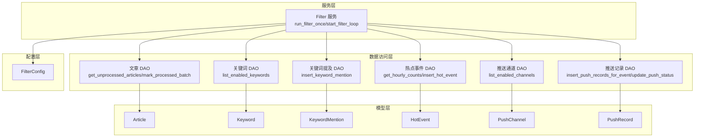
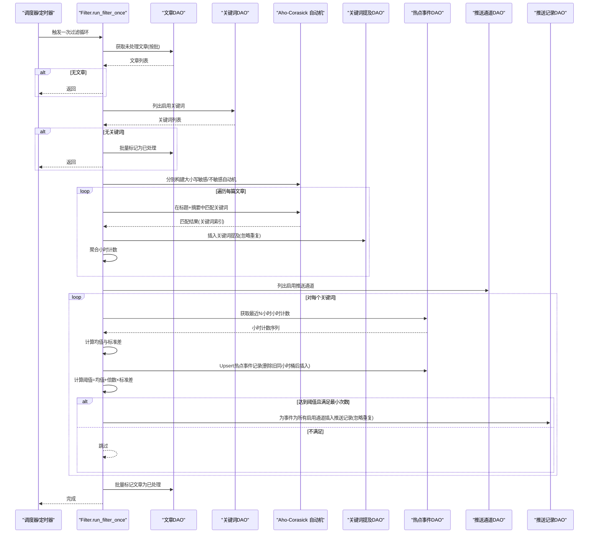
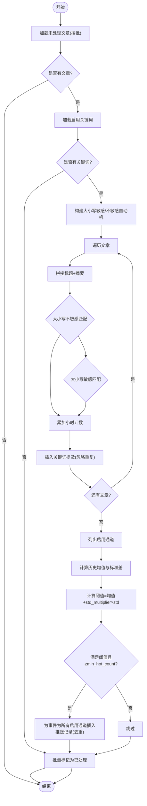
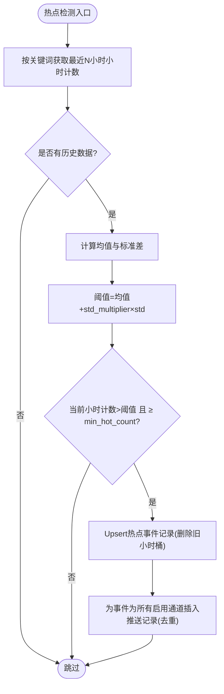
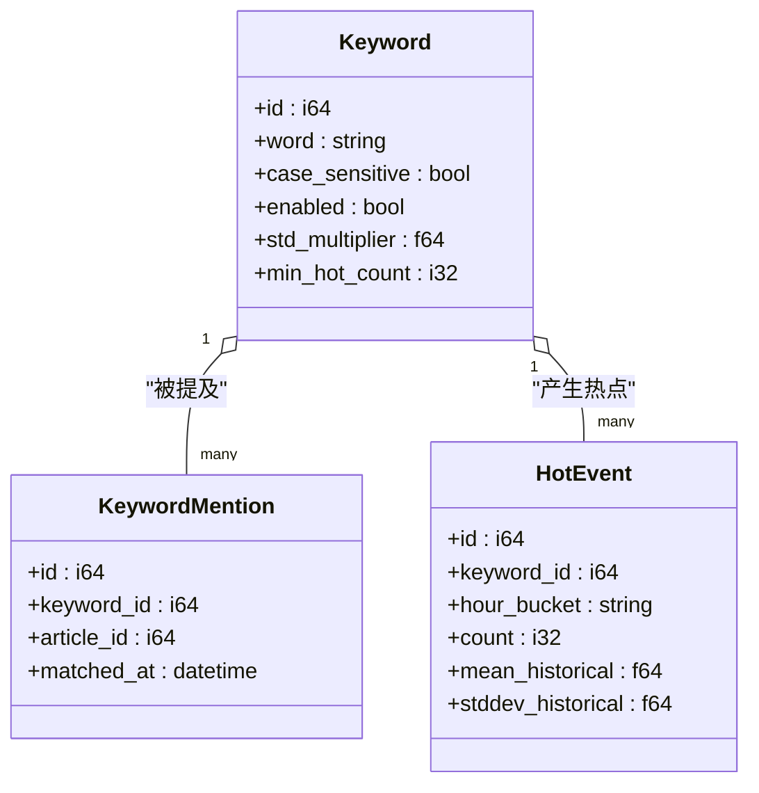
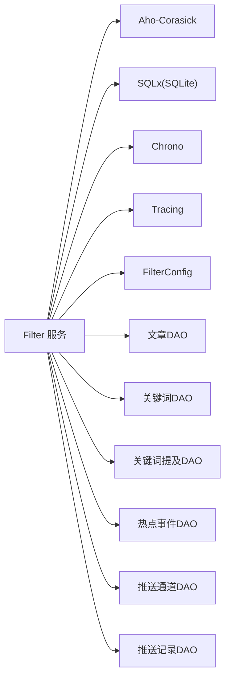

# 内容处理与分析流程

<cite>
**本文引用的文件**
- [src/services/filter.rs](file://src/services/filter.rs)
- [src/db/article.rs](file://src/db/article.rs)
- [src/db/keyword.rs](file://src/db/keyword.rs)
- [src/db/keyword_mention.rs](file://src/db/keyword_mention.rs)
- [src/db/hot_event.rs](file://src/db/hot_event.rs)
- [src/db/channel.rs](file://src/db/channel.rs)
- [src/db/push_record.rs](file://src/db/push_record.rs)
- [src/models/article.rs](file://src/models/article.rs)
- [src/models/keyword.rs](file://src/models/keyword.rs)
- [src/models/keyword_mention.rs](file://src/models/keyword_mention.rs)
- [src/models/hot_event.rs](file://src/models/hot_event.rs)
- [src/models/channel.rs](file://src/models/channel.rs)
- [src/config.rs](file://src/config.rs)
- [src/db.rs](file://src/db.rs)
- [Cargo.toml](file://Cargo.toml)
</cite>

## 目录
1. [引言](#引言)
2. [项目结构](#项目结构)
3. [核心组件](#核心组件)
4. [架构总览](#架构总览)
5. [详细组件分析](#详细组件分析)
6. [依赖关系分析](#依赖关系分析)
7. [性能考虑](#性能考虑)
8. [故障排查指南](#故障排查指南)
9. [结论](#结论)
10. [附录](#附录)

## 引言
本技术文档围绕内容处理与分析流程中的Filter模块展开，系统性阐述其如何对采集的文章进行AI关键词匹配、统计分析与热点事件识别。重点包括：
- Aho-Corasick算法在批量关键词匹配中的应用与策略（大小写敏感与大小写不敏感分离构建）。
- 文本预处理与匹配流程（标题+摘要拼接）。
- 热点检测算法（历史均值与标准差计算、时间窗口聚合、突发性阈值判断）。
- 关键词管理、提及记录与统计计算的实现细节。
- 具体的分析流程图、算法复杂度分析与性能调优建议。

## 项目结构
该系统采用分层架构：服务层负责业务流程编排（如Filter），数据访问层封装SQL查询，模型层定义数据结构，配置层提供运行参数。Filter模块位于服务层，协调数据库读取、关键词匹配、热点检测与推送记录生成。

图表来源
- [src/services/filter.rs:13-276](file://src/services/filter.rs#L13-L276)
- [src/db/article.rs:104-140](file://src/db/article.rs#L104-L140)
- [src/db/keyword.rs:27-31](file://src/db/keyword.rs#L27-L31)
- [src/db/keyword_mention.rs:5-16](file://src/db/keyword_mention.rs#L5-L16)
- [src/db/hot_event.rs:106-123](file://src/db/hot_event.rs#L106-L123)
- [src/db/channel.rs:26-30](file://src/db/channel.rs#L26-L30)
- [src/db/push_record.rs:20-43](file://src/db/push_record.rs#L20-L43)
- [src/models/article.rs:5-16](file://src/models/article.rs#L5-L16)
- [src/models/keyword.rs:5-14](file://src/models/keyword.rs#L5-L14)
- [src/models/keyword_mention.rs:5-11](file://src/models/keyword_mention.rs#L5-L11)
- [src/models/hot_event.rs:5-14](file://src/models/hot_event.rs#L5-L14)
- [src/models/channel.rs:4-11](file://src/models/channel.rs#L4-L11)
- [src/config.rs:36-42](file://src/config.rs#L36-L42)

章节来源
- [src/services/filter.rs:13-276](file://src/services/filter.rs#L13-L276)
- [src/db.rs:1-27](file://src/db.rs#L1-L27)

## 核心组件
- Filter服务：执行一次过滤循环，加载未处理文章、构建关键词自动机、匹配关键词并统计小时计数、计算历史统计、检测热点并生成推送记录，最后批量标记文章为已处理。
- 数据访问层：提供文章、关键词、关键词提及、热点事件、推送通道与推送记录的数据库操作。
- 模型层：定义各实体的数据结构，用于序列化与数据库映射。
- 配置层：提供Filter批大小、轮询间隔、历史窗口等参数。

章节来源
- [src/services/filter.rs:13-276](file://src/services/filter.rs#L13-L276)
- [src/db/article.rs:104-140](file://src/db/article.rs#L104-L140)
- [src/db/keyword.rs:27-31](file://src/db/keyword.rs#L27-L31)
- [src/db/keyword_mention.rs:5-16](file://src/db/keyword_mention.rs#L5-L16)
- [src/db/hot_event.rs:106-123](file://src/db/hot_event.rs#L106-L123)
- [src/db/channel.rs:26-30](file://src/db/channel.rs#L26-L30)
- [src/db/push_record.rs:20-43](file://src/db/push_record.rs#L20-L43)
- [src/models/article.rs:5-16](file://src/models/article.rs#L5-L16)
- [src/models/keyword.rs:5-14](file://src/models/keyword.rs#L5-L14)
- [src/models/keyword_mention.rs:5-11](file://src/models/keyword_mention.rs#L5-L11)
- [src/models/hot_event.rs:5-14](file://src/models/hot_event.rs#L5-L14)
- [src/models/channel.rs:4-11](file://src/models/channel.rs#L4-L11)
- [src/config.rs:36-42](file://src/config.rs#L36-L42)

## 架构总览
Filter模块的主流程由“加载未处理文章 → 加载启用关键词 → 构建Aho-Corasick自动机 → 匹配与统计 → 历史统计与热点检测 → 生成推送记录 → 批量标记已处理”构成。下图展示了端到端的时序交互：

图表来源
- [src/services/filter.rs:13-208](file://src/services/filter.rs#L13-L208)
- [src/db/article.rs:104-140](file://src/db/article.rs#L104-L140)
- [src/db/keyword.rs:27-31](file://src/db/keyword.rs#L27-L31)
- [src/db/keyword_mention.rs:5-16](file://src/db/keyword_mention.rs#L5-L16)
- [src/db/hot_event.rs:106-123](file://src/db/hot_event.rs#L106-L123)
- [src/db/channel.rs:26-30](file://src/db/channel.rs#L26-L30)
- [src/db/push_record.rs:20-43](file://src/db/push_record.rs#L20-L43)

## 详细组件分析

### Filter模块：关键词匹配与热点检测
- 文章加载与批处理：从数据库获取未处理文章，按配置的批大小限制数量；若无文章则直接返回。
- 关键词加载：仅加载启用状态的关键词，避免无效匹配。
- 自动机构建与匹配：
  - 将关键词分为大小写敏感与大小写不敏感两类，分别构建Aho-Corasick自动机。
  - 对每篇文章，使用“标题+摘要”的拼接文本进行匹配，累加每小时的关键词出现次数。
  - 每次匹配成功即插入关键词提及记录（忽略重复），确保可追溯性。
- 历史统计与热点检测：
  - 以当前小时为时间桶，计算关键词在最近N小时内的均值与标准差。
  - 使用阈值公式：阈值 = 历史均值 + 关键词配置的标准差倍数 × 历史标准差。
  - 当前小时计数需同时满足“达到阈值”和“不低于最小热点次数”才判定为热点。
  - 若满足热点条件，为该热点事件为所有启用通道生成推送记录（去重插入）。
- 批量标记：完成全部处理后，批量更新文章的已处理时间戳。

图表来源
- [src/services/filter.rs:13-208](file://src/services/filter.rs#L13-L208)
- [src/db/keyword_mention.rs:5-16](file://src/db/keyword_mention.rs#L5-L16)
- [src/db/push_record.rs:20-43](file://src/db/push_record.rs#L20-L43)

章节来源
- [src/services/filter.rs:13-208](file://src/services/filter.rs#L13-L208)

### Aho-Corasick算法与匹配策略
- 分类构建：根据关键词的大小写敏感标志，将关键词分为两组，分别构建自动机，减少不必要的大小写转换开销。
- 文本预处理：对大小写不敏感模式，统一转为小写；大小写敏感模式保持原文，提升匹配精度。
- 匹配过程：对每篇文章的拼接文本进行多模式匹配，定位所有出现的关键词，并通过模式索引映射回原始关键词对象，累加小时计数与插入提及记录。
- 性能优势：Aho-Corasick在多模式匹配场景具有线性时间复杂度，适合大规模关键词集合与大批量文章处理。

章节来源
- [src/services/filter.rs:48-129](file://src/services/filter.rs#L48-L129)
- [Cargo.toml](file://Cargo.toml#L33)

### 热点检测算法与时间窗口分析
- 时间窗口：以“年月日小时”为粒度的时间桶，将每小时的关键词计数聚合存储于热点事件表。
- 统计计算：从热点事件表中拉取最近N小时的小时计数，计算均值与标准差，作为历史基线。
- 突发性判断：当前小时计数超过阈值且不低于最小热点次数，则判定为热点事件。
- 去重与幂等：热点事件记录采用“删除旧同小时桶后插入”的方式，保证同一小时桶内仅保留最新统计，避免重复计数。

图表来源
- [src/services/filter.rs:131-202](file://src/services/filter.rs#L131-L202)
- [src/db/hot_event.rs:106-123](file://src/db/hot_event.rs#L106-L123)
- [src/db/push_record.rs:20-43](file://src/db/push_record.rs#L20-L43)

章节来源
- [src/services/filter.rs:131-202](file://src/services/filter.rs#L131-L202)
- [src/db/hot_event.rs:106-123](file://src/db/hot_event.rs#L106-L123)

### 关键词管理、提及记录与统计计算
- 关键词管理：支持创建、查询、更新、删除与启用状态控制；更新接口采用动态SQL拼接，仅更新提供的字段。
- 提及记录：每次匹配成功即插入关键词提及记录，使用“忽略重复”策略，确保唯一性约束下的幂等插入。
- 统计计算：小时计数聚合在内存中完成，热点事件表保存每小时的计数、历史均值与标准差，便于后续查询与展示。

图表来源
- [src/models/keyword.rs:5-14](file://src/models/keyword.rs#L5-L14)
- [src/models/keyword_mention.rs:5-11](file://src/models/keyword_mention.rs#L5-L11)
- [src/models/hot_event.rs:5-14](file://src/models/hot_event.rs#L5-L14)

章节来源
- [src/db/keyword.rs:5-107](file://src/db/keyword.rs#L5-L107)
- [src/db/keyword_mention.rs:5-16](file://src/db/keyword_mention.rs#L5-L16)
- [src/db/hot_event.rs:5-24](file://src/db/hot_event.rs#L5-L24)

### 推送通道与记录
- 推送通道：支持创建、查询、更新、删除与启用状态控制；通道类型默认为webhook，配置为JSON字符串。
- 推送记录：为热点事件为所有启用通道插入推送记录，使用“插入忽略重复”策略；支持查询待推送与可重试记录，并提供乐观锁更新接口。

章节来源
- [src/db/channel.rs:5-87](file://src/db/channel.rs#L5-L87)
- [src/db/push_record.rs:6-154](file://src/db/push_record.rs#L6-L154)
- [src/models/channel.rs:4-11](file://src/models/channel.rs#L4-L11)

## 依赖关系分析
- 运行时依赖：Aho-Corasick用于多模式匹配；SQLx用于SQLite访问；Chrono用于时间处理；Tracing用于日志。
- 模块耦合：Filter服务对DAO层存在直接依赖，DAO层对模型层有映射依赖；配置层为Filter提供参数注入。
- 外部集成：推送通道通过HTTP客户端进行Webhook推送（由推送模块负责，Filter模块触发记录生成）。

图表来源
- [src/services/filter.rs:1-10](file://src/services/filter.rs#L1-L10)
- [Cargo.toml](file://Cargo.toml#L33)
- [src/db.rs:1-8](file://src/db.rs#L1-L8)

章节来源
- [Cargo.toml](file://Cargo.toml#L33)
- [src/db.rs:1-8](file://src/db.rs#L1-L8)

## 性能考虑
- 关键词匹配性能
  - Aho-Corasick在多模式匹配场景具备线性时间复杂度，适合大规模关键词集合。
  - 分离大小写敏感与大小写不敏感关键词，避免在匹配阶段进行额外转换。
- 文本处理优化
  - 仅对标题与摘要进行拼接，减少无关内容的匹配成本。
  - 批量插入关键词提及与批量更新文章处理状态，降低数据库往返次数。
- 数据库访问优化
  - 使用WAL模式与外键强制，提升并发与一致性。
  - 批量更新采用分片（每批最多100个ID），规避SQLite变量上限问题。
- 统计计算优化
  - 历史均值与标准差在内存中计算，热点事件表按小时桶聚合，查询简单高效。
- 并发与资源
  - 过滤循环按固定间隔执行，避免高负载；可通过调整批大小与轮询间隔平衡吞吐与延迟。

章节来源
- [src/services/filter.rs:48-129](file://src/services/filter.rs#L48-L129)
- [src/db/article.rs:124-140](file://src/db/article.rs#L124-L140)
- [src/db.rs:19-26](file://src/db.rs#L19-L26)

## 故障排查指南
- 关键词匹配失败
  - 检查关键词是否启用；确认大小写敏感设置是否符合预期。
  - 查看匹配日志与错误输出，定位自动机构建或匹配阶段的问题。
- 提及记录异常
  - 确认唯一性约束与“忽略重复”策略是否生效；检查数据库连接与事务状态。
- 热点事件统计异常
  - 核对历史小时桶数据是否存在；检查历史小时数配置与统计计算逻辑。
- 推送记录未生成
  - 确认启用通道列表非空；检查推送记录插入是否被唯一约束忽略；查看推送状态与重试逻辑。
- 批量处理失败
  - 检查分片大小与数据库连接池配置；关注超时与并发限制。

章节来源
- [src/services/filter.rs:18-22](file://src/services/filter.rs#L18-L22)
- [src/db/keyword_mention.rs:5-16](file://src/db/keyword_mention.rs#L5-L16)
- [src/db/push_record.rs:20-43](file://src/db/push_record.rs#L20-L43)

## 结论
Filter模块通过Aho-Corasick实现高效的多关键词匹配，结合基于历史统计的突发性检测机制，实现了对采集文章的自动化关键词标注、计数与热点事件识别。配合关键词管理、提及记录与推送记录的完整闭环，系统能够稳定地支撑内容趋势监控与告警分发。通过合理的批处理、分片更新与统计聚合策略，系统在性能与可靠性之间取得良好平衡。

## 附录
- 配置项说明
  - 批大小：控制单次处理的文章数量。
  - 轮询间隔：控制过滤循环的执行频率。
  - 历史小时数：用于计算历史均值与标准差的时间窗口长度。
  - 最小历史小时数：判定是否具备足够历史数据的阈值。

章节来源
- [src/config.rs:36-42](file://src/config.rs#L36-L42)