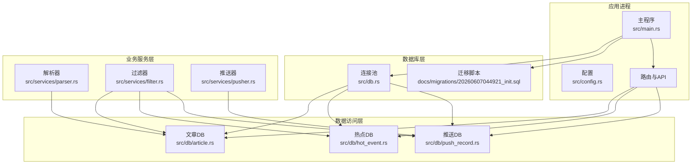
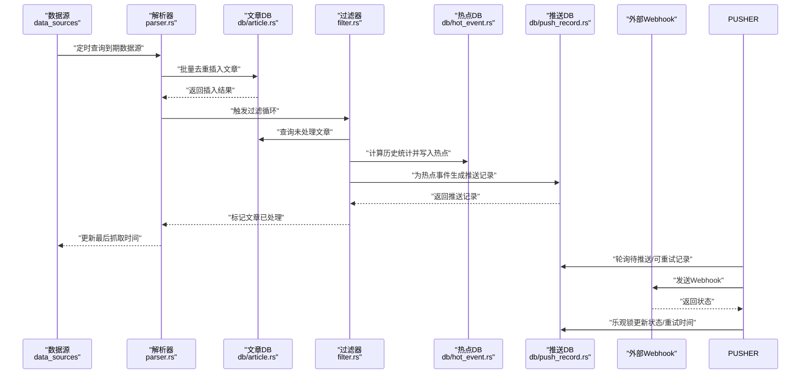
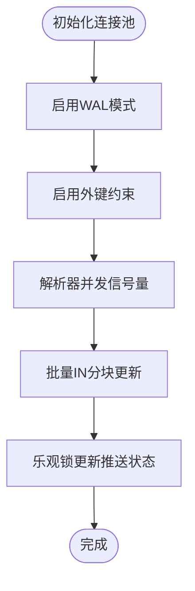
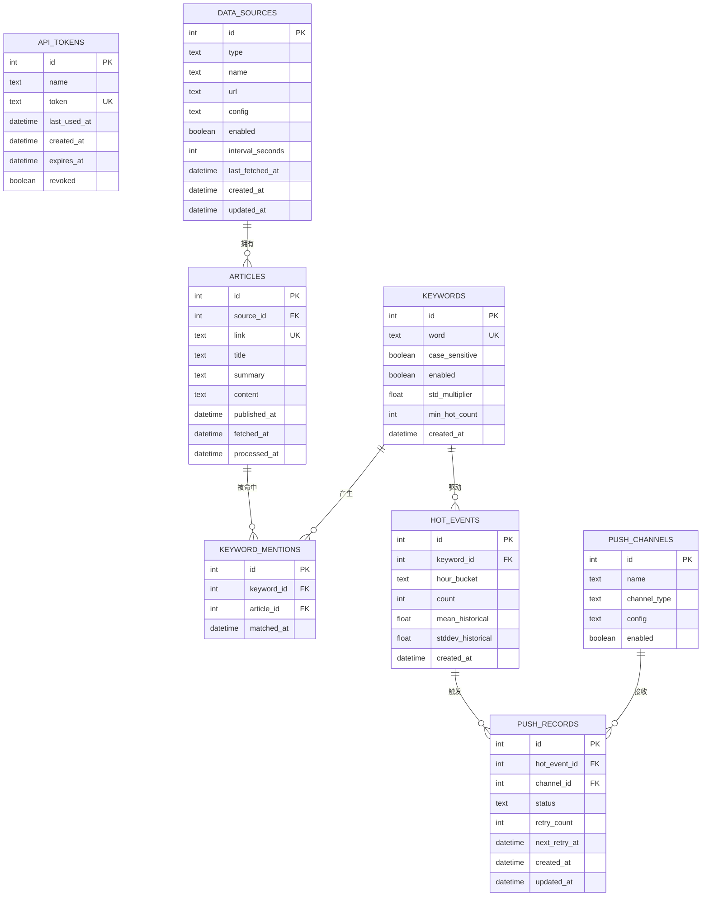
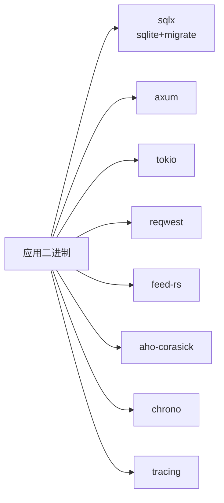

# 数据库存储与集成

<cite>
**本文引用的文件**
- [src/db.rs](file://src/db.rs)
- [src/main.rs](file://src/main.rs)
- [docs/migrations/20260607044921_init.sql](file://docs/migrations/20260607044921_init.sql)
- [src/models/article.rs](file://src/models/article.rs)
- [src/models/hot_event.rs](file://src/models/hot_event.rs)
- [src/models/push_record.rs](file://src/models/push_record.rs)
- [src/db/article.rs](file://src/db/article.rs)
- [src/db/hot_event.rs](file://src/db/hot_event.rs)
- [src/db/push_record.rs](file://src/db/push_record.rs)
- [src/services/filter.rs](file://src/services/filter.rs)
- [src/services/pusher.rs](file://src/services/pusher.rs)
- [src/services/parser.rs](file://src/services/parser.rs)
- [src/config.rs](file://src/config.rs)
- [Cargo.toml](file://Cargo.toml)
</cite>

## 目录
1. [简介](#简介)
2. [项目结构](#项目结构)
3. [核心组件](#核心组件)
4. [架构总览](#架构总览)
5. [详细组件分析](#详细组件分析)
6. [依赖分析](#依赖分析)
7. [性能考虑](#性能考虑)
8. [故障排查指南](#故障排查指南)
9. [结论](#结论)
10. [附录](#附录)

## 简介
本文件面向数据库存储与集成，围绕以下目标展开：  
- 连接池管理、事务处理与并发控制策略  
- 数据模型关系设计、索引优化与查询性能  
- 文章存储、热点事件记录与推送状态的数据结构设计  
- 数据库迁移管理、版本控制与数据完整性保障  
- ER 图、SQL 查询示例路径与性能优化建议  
- 备份策略与恢复流程  

## 项目结构
后端采用 Rust + SQLx + SQLite 的轻量方案，核心模块如下：  
- 配置层：读取应用配置（数据库路径、服务端口等）  
- 数据访问层：按实体拆分的数据库模块（文章、关键词、热点事件、推送记录等）  
- 业务服务层：解析器（抓取与解析）、过滤器（关键词匹配与热点检测）、推送器（Webhook 推送）  
- 迁移与初始化：启动时执行迁移脚本，启用 WAL 模式与外键约束  
- 主程序：根据模式参数选择性启动 API 与后台任务

图表来源
- [src/main.rs:77-81](file://src/main.rs#L77-L81)
- [src/db.rs:12-26](file://src/db.rs#L12-L26)
- [docs/migrations/20260607044921_init.sql:1-118](file://docs/migrations/20260607044921_init.sql#L1-L118)
- [src/services/parser.rs:94-184](file://src/services/parser.rs#L94-L184)
- [src/services/filter.rs:13-208](file://src/services/filter.rs#L13-L208)
- [src/services/pusher.rs:11-43](file://src/services/pusher.rs#L11-L43)

章节来源
- [src/main.rs:64-164](file://src/main.rs#L64-L164)
- [src/db.rs:10-27](file://src/db.rs#L10-L27)
- [docs/migrations/20260607044921_init.sql:1-118](file://docs/migrations/20260607044921_init.sql#L1-L118)

## 核心组件
- 连接池与初始化：使用 SQLx 的 SqlitePoolOptions 创建连接池，设置最大连接数，并在启动时启用 WAL 模式与外键约束。  
- 迁移与版本控制：通过 sqlx::migrate! 在运行时加载迁移目录，确保数据库结构与代码一致。  
- 并发控制：解析器使用信号量限制并发抓取；热点检测与推送使用乐观锁避免竞争条件。  
- 数据完整性：外键约束、唯一约束、触发器式 upsert（删除旧记录再插入）等策略保障一致性。

章节来源
- [src/db.rs:12-26](file://src/db.rs#L12-L26)
- [src/main.rs:80-81](file://src/main.rs#L80-L81)
- [src/services/parser.rs:94-96](file://src/services/parser.rs#L94-L96)
- [src/services/pusher.rs:87-109](file://src/services/pusher.rs#L87-L109)
- [src/db/hot_event.rs:243-267](file://src/db/hot_event.rs#L243-L267)

## 架构总览
下图展示从“抓取 → 过滤 → 推送”的端到端数据流与数据库交互：

图表来源
- [src/services/parser.rs:94-184](file://src/services/parser.rs#L94-L184)
- [src/db/article.rs:7-29](file://src/db/article.rs#L7-L29)
- [src/services/filter.rs:13-208](file://src/services/filter.rs#L13-L208)
- [src/db/hot_event.rs:106-123](file://src/db/hot_event.rs#L106-L123)
- [src/db/push_record.rs:22-43](file://src/db/push_record.rs#L22-L43)
- [src/services/pusher.rs:11-43](file://src/services/pusher.rs#L11-L43)

## 详细组件分析

### 数据库连接池与并发控制
- 连接池初始化：设置最大连接数，使用 WAL 模式提升并发读写能力，开启外键约束保证参照完整性。  
- 并发抓取：解析器使用信号量限制并发请求数，避免对远端源与本地磁盘造成压力。  
- 乐观锁：推送状态更新采用“期望值校验”以避免多实例竞争导致的状态不一致。  
- 批量操作：文章批量标记处理使用分块 IN 子句，规避 SQLite 参数上限问题。

图表来源
- [src/db.rs:12-26](file://src/db.rs#L12-L26)
- [src/services/parser.rs:94-96](file://src/services/parser.rs#L94-L96)
- [src/db/article.rs:126-140](file://src/db/article.rs#L126-L140)
- [src/services/pusher.rs:87-109](file://src/services/pusher.rs#L87-L109)

章节来源
- [src/db.rs:12-26](file://src/db.rs#L12-L26)
- [src/services/parser.rs:94-96](file://src/services/parser.rs#L94-L96)
- [src/db/article.rs:126-140](file://src/db/article.rs#L126-L140)
- [src/services/pusher.rs:87-109](file://src/services/pusher.rs#L87-L109)

### 数据模型与ER关系
- 实体与字段概览（摘自迁移脚本）：API令牌、数据源、文章、关键词、关键词命中、热点事件、推送渠道、推送记录。  
- 关系设计：文章由数据源外键关联；关键词命中关联文章与关键词；热点事件关联关键词；推送记录关联热点事件与推送渠道，并有唯一约束防止重复推送。  
- 索引设计：文章按处理时间、来源、抓取时间建立索引；关键词命中按关键词与文章建立索引；热点事件按关键词与小时桶建立索引；推送记录按状态建立索引。

图表来源
- [docs/migrations/20260607044921_init.sql:4-118](file://docs/migrations/20260607044921_init.sql#L4-L118)

章节来源
- [docs/migrations/20260607044921_init.sql:4-118](file://docs/migrations/20260607044921_init.sql#L4-L118)

### 文章存储与查询
- 去重插入：基于链接唯一性使用冲突忽略策略，避免重复文章入库。  
- 分页与过滤：支持按来源与处理状态过滤，动态拼接 WHERE 条件，限制每页数量并分页查询。  
- 统计与批量处理：提供文章计数接口与批量标记处理接口，后者按 100 个一组分块执行以规避变量上限。  
- 时间序列：文章按抓取时间倒序排列，便于最新内容优先展示。

章节来源
- [src/db/article.rs:7-29](file://src/db/article.rs#L7-L29)
- [src/db/article.rs:31-75](file://src/db/article.rs#L31-L75)
- [src/db/article.rs:104-140](file://src/db/article.rs#L104-L140)
- [src/models/article.rs:5-25](file://src/models/article.rs#L5-L25)

### 热点事件记录与阈值检测
- 小时桶聚合：热点事件按“年月日时”格式的小时桶进行聚合计数。  
- 历史统计：从最近 N 小时的小时计数中计算均值与标准差，作为阈值依据。  
- 上游 upsert：每次检测前先删除该关键词+小时桶的旧记录，再插入新记录，保证幂等。  
- 列表与查询：支持按关键词或全局列出最近热点事件，并提供小时计数查询用于可视化。

章节来源
- [src/db/hot_event.rs:5-48](file://src/db/hot_event.rs#L5-L48)
- [src/db/hot_event.rs:61-85](file://src/db/hot_event.rs#L61-L85)
- [src/db/hot_event.rs:88-103](file://src/db/hot_event.rs#L88-L103)
- [src/db/hot_event.rs:106-123](file://src/db/hot_event.rs#L106-L123)
- [src/services/filter.rs:210-267](file://src/services/filter.rs#L210-L267)

### 推送状态与重试机制
- 记录生成：热点事件触发后，为每个启用的推送渠道生成一条推送记录（唯一约束避免重复）。  
- 轮询策略：分别查询“待推送”和“可重试”的记录，合并后顺序处理。  
- 成功/失败处理：成功则乐观锁更新为成功；失败则指数回退计算下次重试时间，达到最大重试次数后放弃。  
- 详情查询：支持按热点事件 ID 查询带渠道名称的推送记录详情。

章节来源
- [src/db/push_record.rs:6-43](file://src/db/push_record.rs#L6-L43)
- [src/db/push_record.rs:45-84](file://src/db/push_record.rs#L45-L84)
- [src/db/push_record.rs:87-109](file://src/db/push_record.rs#L87-L109)
- [src/db/push_record.rs:126-141](file://src/db/push_record.rs#L126-L141)
- [src/services/pusher.rs:11-43](file://src/services/pusher.rs#L11-L43)
- [src/services/pusher.rs:207-242](file://src/services/pusher.rs#L207-L242)

### 解析器与抓取并发
- 定时调度：每 30 秒查询到期数据源，避免频繁请求。  
- 并发限制：通过信号量限制最大并发抓取数，避免资源争用。  
- 结果处理：逐条调用文章去重插入，成功后更新数据源最后抓取时间。

章节来源
- [src/services/parser.rs:94-184](file://src/services/parser.rs#L94-L184)
- [src/db/article.rs:7-29](file://src/db/article.rs#L7-L29)

### 过滤器与关键词匹配
- 自动机构建：区分大小写与大小写不敏感关键词，分别构建 Aho-Corasick 自动机。  
- 匹配与计数：遍历文章标题与摘要，累加每关键词的小时命中计数。  
- 命中记录：将每次匹配写入关键词命中明细表，便于后续审计与分析。  
- 热点检测：结合历史统计与阈值判断是否为热点，若为热点则生成推送记录并标记文章已处理。

章节来源
- [src/services/filter.rs:13-208](file://src/services/filter.rs#L13-L208)
- [src/db/hot_event.rs:106-123](file://src/db/hot_event.rs#L106-L123)
- [src/db/push_record.rs:22-43](file://src/db/push_record.rs#L22-L43)
- [src/db/article.rs:126-140](file://src/db/article.rs#L126-L140)

## 依赖分析
- 运行时依赖：SQLx（含 sqlite、migrate 功能）、Axum（HTTP）、Tokio（异步）、Reqwest（HTTP）、Feed-RS（RSS/Atom 解析）、Aho-Corasick（字符串匹配）、Tracing（日志）。  
- 构建配置：生产环境启用 LTO、单代码生成单元、剥离符号等优化选项，开发环境保持增量编译与调试信息。

图表来源
- [Cargo.toml:6-47](file://Cargo.toml#L6-L47)

章节来源
- [Cargo.toml:6-47](file://Cargo.toml#L6-L47)

## 性能考虑
- 连接池与并发  
  - 最大连接数：当前为 5，适合单机 SQLite 场景；如需更高吞吐，可评估增加但需结合磁盘 I/O 与 CPU 能力。  
  - 并发抓取：解析器通过信号量限制并发，请根据上游源限速与网络状况调整。  
- 索引与查询  
  - 文章：按 processed_at、source_id、fetched_at 建立索引，有利于列表与分页查询。  
  - 关键词命中：按 keyword_id 与 article_id 建立索引，支持快速统计与关联查询。  
  - 热点事件：按 keyword_id 与 hour_bucket 建立索引，支持按关键词与时间范围检索。  
  - 推送记录：按 status 建立索引，有利于轮询待处理与可重试记录。  
- 批量与分块  
  - 文章批量标记处理按 100 个一组分块，避免 SQLite 变量上限；建议在高吞吐场景下保持此策略。  
- 写入模式  
  - WAL 模式显著提升并发读写性能；配合外键约束确保参照完整性。  
- 查询示例路径（不展示具体 SQL）  
  - 文章列表与过滤：[src/db/article.rs:31-75](file://src/db/article.rs#L31-L75)  
  - 热点事件分页与计数：[src/db/hot_event.rs:61-103](file://src/db/hot_event.rs#L61-L103)  
  - 推送记录乐观更新：[src/db/push_record.rs:87-109](file://src/db/push_record.rs#L87-L109)

章节来源
- [src/db.rs:12-26](file://src/db.rs#L12-L26)
- [src/db/article.rs:31-75](file://src/db/article.rs#L31-L75)
- [src/db/hot_event.rs:61-103](file://src/db/hot_event.rs#L61-L103)
- [src/db/push_record.rs:87-109](file://src/db/push_record.rs#L87-L109)

## 故障排查指南
- 启动阶段  
  - 数据库迁移失败：检查迁移脚本路径与权限，确认迁移目录存在且可读。  
  - 连接池初始化错误：确认数据库文件路径存在且可写，WAL 模式与外键约束语句无语法错误。  
- 抓取阶段  
  - 并发过高导致超时：降低解析器并发数或提高超时时间。  
  - 插入失败：检查链接唯一性与文章字段长度限制。  
- 过滤阶段  
  - 关键词匹配异常：确认关键词大小写设置与文本预处理逻辑。  
  - 热点检测无输出：检查历史小时数配置与最小历史小时数阈值。  
- 推送阶段  
  - 乐观锁更新失败：多个实例同时更新同一记录，属正常竞争；可通过重试机制自动解决。  
  - Webhook 失败：检查渠道配置 JSON 中的 URL 字段，确认网络连通性与目标服务可用性。  
- 日志定位  
  - 使用 tracing 输出详细错误堆栈，定位具体模块与函数位置。

章节来源
- [src/main.rs:80-81](file://src/main.rs#L80-L81)
- [src/services/parser.rs:101-184](file://src/services/parser.rs#L101-L184)
- [src/services/filter.rs:13-208](file://src/services/filter.rs#L13-L208)
- [src/services/pusher.rs:11-242](file://src/services/pusher.rs#L11-L242)

## 结论
本项目以 SQLite 为核心，结合 SQLx 的连接池与迁移能力，实现了从数据抓取、关键词匹配、热点检测到推送通知的完整链路。通过 WAL 模式、外键约束、索引与批处理等手段，在单机环境下兼顾了性能与可靠性。建议在生产部署时关注并发参数与监控告警，持续优化热点检测阈值与推送重试策略。

## 附录

### 数据库迁移与版本控制
- 迁移脚本：位于 docs/migrations/20260607044921_init.sql，包含所有表定义、索引与约束。  
- 版本控制：通过 sqlx::migrate! 在运行时加载迁移目录，确保数据库结构与代码一致。  
- 初始化流程：启动时自动执行迁移，无需手动干预。

章节来源
- [docs/migrations/20260607044921_init.sql:1-118](file://docs/migrations/20260607044921_init.sql#L1-L118)
- [src/main.rs:80-81](file://src/main.rs#L80-L81)

### 数据备份与恢复
- 备份策略  
  - 文件级备份：直接复制 SQLite 数据库文件（建议在关闭服务后进行）。  
  - 定期快照：结合 WAL 模式，可在空闲时段进行备份，减少锁竞争。  
- 恢复流程  
  - 停止服务 → 备份现有数据库 → 恢复目标数据库文件 → 启动服务 → 验证迁移与功能。  
- 注意事项  
  - 确保备份文件权限正确，恢复后验证迁移是否成功执行。

[本节为通用实践说明，不直接分析具体文件]