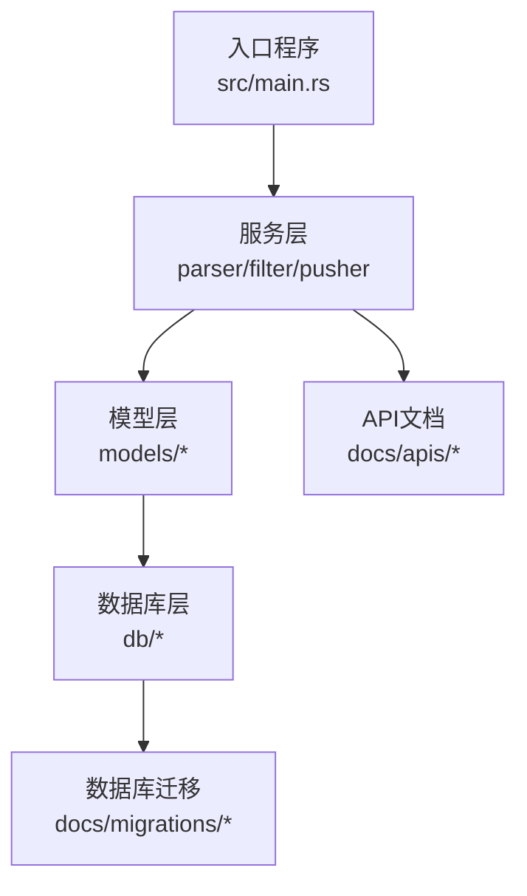
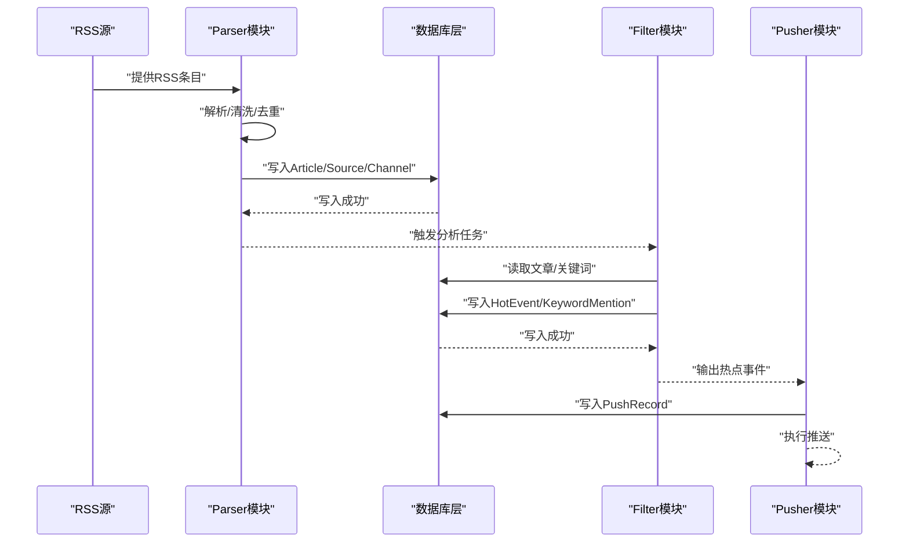
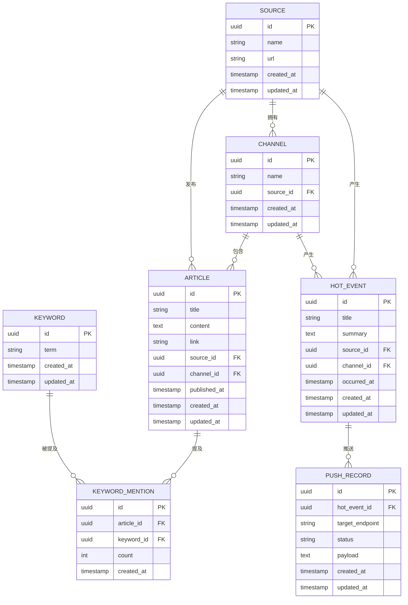
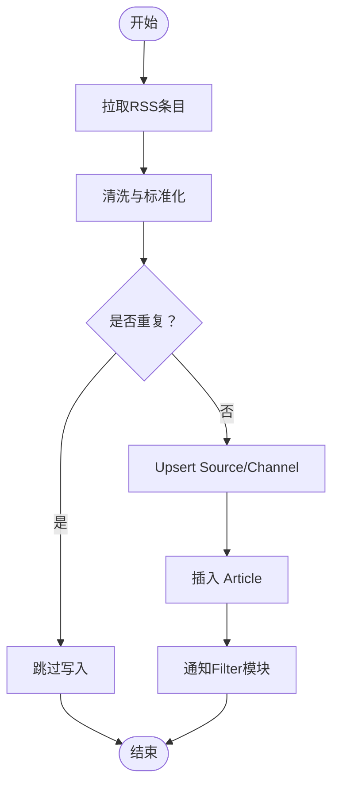
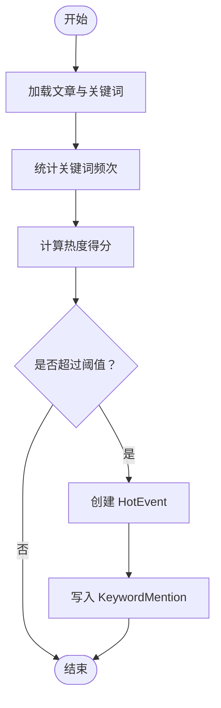
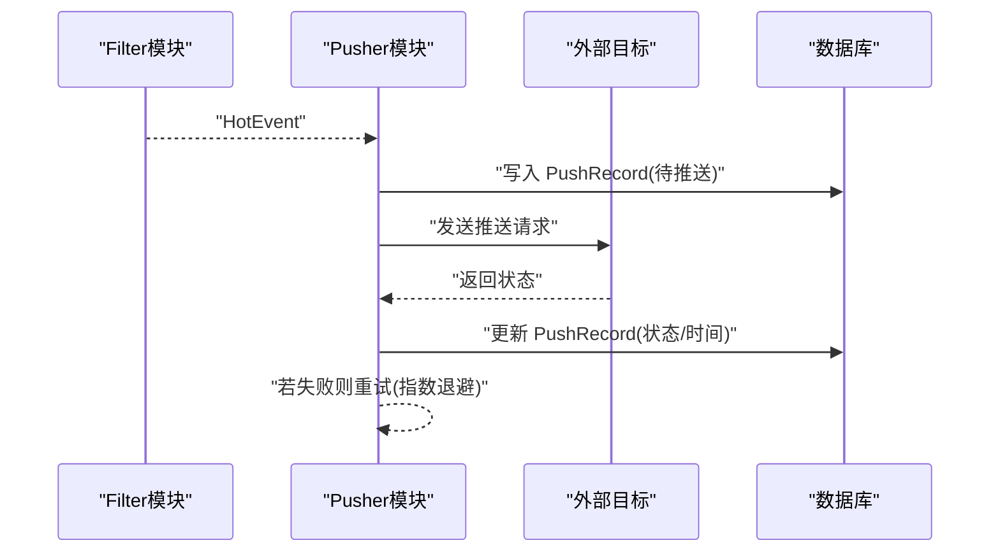
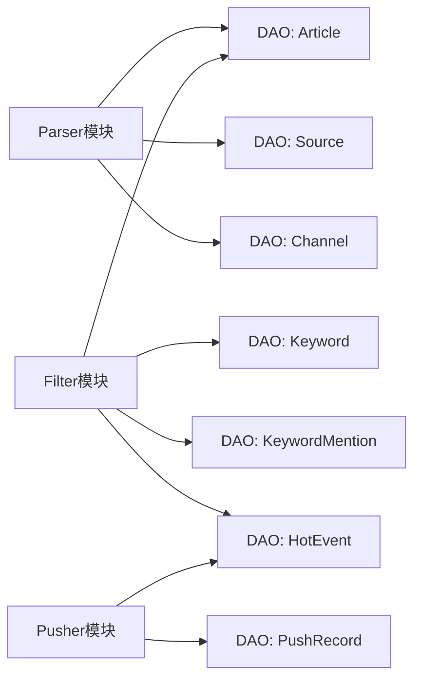

# 数据流设计

<cite>
**本文引用的文件**
- [src/main.rs](file://src/main.rs)
- [src/services/parser.rs](file://src/services/parser.rs)
- [src/services/filter.rs](file://src/services/filter.rs)
- [src/services/pusher.rs](file://src/services/pusher.rs)
- [src/models/article.rs](file://src/models/article.rs)
- [src/models/source.rs](file://src/models/source.rs)
- [src/models/channel.rs](file://src/models/channel.rs)
- [src/models/keyword.rs](file://src/models/keyword.rs)
- [src/models/keyword_mention.rs](file://src/models/keyword_mention.rs)
- [src/models/hot_event.rs](file://src/models/hot_event.rs)
- [src/models/push_record.rs](file://src/models/push_record.rs)
- [src/db.rs](file://src/db.rs)
- [src/db/article.rs](file://src/db/article.rs)
- [src/db/source.rs](file://src/db/source.rs)
- [src/db/channel.rs](file://src/db/channel.rs)
- [src/db/keyword.rs](file://src/db/keyword.rs)
- [src/db/keyword_mention.rs](file://src/db/keyword_mention.rs)
- [src/db/hot_event.rs](file://src/db/hot_event.rs)
- [src/db/push_record.rs](file://src/db/push_record.rs)
- [docs/migrations/20260607044921_init.sql](file://docs/migrations/20260607044921_init.sql)
- [docs/apis/source-api.md](file://docs/apis/source-api.md)
- [docs/apis/keyword-api.md](file://docs/apis/keyword-api.md)
- [docs/apis/channel-api.md](file://docs/apis/channel-api.md)
- [docs/apis/token-api.md](file://docs/apis/token-api.md)
</cite>

## 目录
1. [引言](#引言)
2. [项目结构](#项目结构)
3. [核心组件](#核心组件)
4. [架构总览](#架构总览)
5. [详细组件分析](#详细组件分析)
6. [依赖分析](#依赖分析)
7. [性能考虑](#性能考虑)
8. [故障排查指南](#故障排查指南)
9. [结论](#结论)
10. [附录](#附录)

## 引言
本设计文档面向AI趋势监控系统，聚焦“数据流”的全生命周期设计与实现。目标是清晰描述从RSS源采集到热点事件推送的完整数据流转过程，包括三模块间的数据传递机制、转换规则与存储策略；给出数据模型定义、表关系设计与数据完整性保障；并覆盖缓存策略、批量处理与实时处理流程，以及一致性、事务管理与并发控制方案。

## 项目结构
系统采用分层与模块化组织方式：
- 入口与路由：入口程序负责初始化配置、数据库连接与路由注册，随后由各模块服务处理业务逻辑。
- 服务层：parser（解析器）、filter（过滤器）、pusher（推送器）分别承担采集、分析与推送职责。
- 模型与数据库：models 定义领域模型，db 定义DAO与查询封装，配合迁移脚本完成数据库演进。
- 文档与API：通过OpenSpec规范与API文档明确接口契约与数据交互。

**图示来源**
- [src/main.rs](file://src/main.rs)
- [src/services/parser.rs](file://src/services/parser.rs)
- [src/services/filter.rs](file://src/services/filter.rs)
- [src/services/pusher.rs](file://src/services/pusher.rs)
- [src/models/article.rs](file://src/models/article.rs)
- [src/db.rs](file://src/db.rs)
- [docs/migrations/20260607044921_init.sql](file://docs/migrations/20260607044921_init.sql)
- [docs/apis/source-api.md](file://docs/apis/source-api.md)

**章节来源**
- [src/main.rs](file://src/main.rs)
- [src/services/parser.rs](file://src/services/parser.rs)
- [src/services/filter.rs](file://src/services/filter.rs)
- [src/services/pusher.rs](file://src/services/pusher.rs)
- [src/db.rs](file://src/db.rs)
- [docs/migrations/20260607044921_init.sql](file://docs/migrations/20260607044921_init.sql)
- [docs/apis/source-api.md](file://docs/apis/source-api.md)

## 核心组件
- Parser模块：负责RSS源采集与预处理，生成标准化文章实体，写入数据库。
- Filter模块：基于关键词与热度阈值进行热点识别，构建热点事件与关键词提及记录。
- Pusher模块：根据推送策略与通道配置，执行外部推送并记录推送结果与状态。
- 数据模型与DAO：Article、Source、Channel、Keyword、KeywordMention、HotEvent、PushRecord等，支撑上述流程的持久化与查询。

**章节来源**
- [src/services/parser.rs](file://src/services/parser.rs)
- [src/services/filter.rs](file://src/services/filter.rs)
- [src/services/pusher.rs](file://src/services/pusher.rs)
- [src/models/article.rs](file://src/models/article.rs)
- [src/models/source.rs](file://src/models/source.rs)
- [src/models/channel.rs](file://src/models/channel.rs)
- [src/models/keyword.rs](file://src/models/keyword.rs)
- [src/models/keyword_mention.rs](file://src/models/keyword_mention.rs)
- [src/models/hot_event.rs](file://src/models/hot_event.rs)
- [src/models/push_record.rs](file://src/models/push_record.rs)

## 架构总览
下图展示从RSS源采集到热点事件推送的端到端数据流：

**图示来源**
- [src/services/parser.rs](file://src/services/parser.rs)
- [src/services/filter.rs](file://src/services/filter.rs)
- [src/services/pusher.rs](file://src/services/pusher.rs)
- [src/db/article.rs](file://src/db/article.rs)
- [src/db/source.rs](file://src/db/source.rs)
- [src/db/channel.rs](file://src/db/channel.rs)
- [src/db/keyword.rs](file://src/db/keyword.rs)
- [src/db/keyword_mention.rs](file://src/db/keyword_mention.rs)
- [src/db/hot_event.rs](file://src/db/hot_event.rs)
- [src/db/push_record.rs](file://src/db/push_record.rs)

## 详细组件分析

### 数据模型与表关系
系统围绕“文章-源-频道-关键词-热点事件-推送记录”建立核心数据模型，并通过外键约束保证参照完整性。

**图示来源**
- [src/models/source.rs](file://src/models/source.rs)
- [src/models/channel.rs](file://src/models/channel.rs)
- [src/models/article.rs](file://src/models/article.rs)
- [src/models/keyword.rs](file://src/models/keyword.rs)
- [src/models/keyword_mention.rs](file://src/models/keyword_mention.rs)
- [src/models/hot_event.rs](file://src/models/hot_event.rs)
- [src/models/push_record.rs](file://src/models/push_record.rs)
- [docs/migrations/20260607044921_init.sql](file://docs/migrations/20260607044921_init.sql)

**章节来源**
- [src/models/source.rs](file://src/models/source.rs)
- [src/models/channel.rs](file://src/models/channel.rs)
- [src/models/article.rs](file://src/models/article.rs)
- [src/models/keyword.rs](file://src/models/keyword.rs)
- [src/models/keyword_mention.rs](file://src/models/keyword_mention.rs)
- [src/models/hot_event.rs](file://src/models/hot_event.rs)
- [src/models/push_record.rs](file://src/models/push_record.rs)
- [docs/migrations/20260607044921_init.sql](file://docs/migrations/20260607044921_init.sql)

### Parser模块：采集与预处理
- 输入：来自RSS源的条目集合。
- 预处理：标题清洗、正文抽取、URL规范化、重复性检测（基于标题/链接去重）。
- 写入：将Source/Channel/Article写入数据库，确保外键存在性与唯一性约束。
- 批量策略：按批次写入，失败回滚，重试上限与退避策略。
- 实时性：解析完成后立即触发后续分析流程。

**图示来源**
- [src/services/parser.rs](file://src/services/parser.rs)
- [src/db/source.rs](file://src/db/source.rs)
- [src/db/channel.rs](file://src/db/channel.rs)
- [src/db/article.rs](file://src/db/article.rs)

**章节来源**
- [src/services/parser.rs](file://src/services/parser.rs)
- [src/db/source.rs](file://src/db/source.rs)
- [src/db/channel.rs](file://src/db/channel.rs)
- [src/db/article.rs](file://src/db/article.rs)

### Filter模块：分析与热点识别
- 输入：Article与Keyword集合。
- 分析：统计关键词在文章中的出现频次，计算热度得分（可结合时间衰减、权重因子）。
- 热点判定：超过阈值则创建HotEvent，并记录KeywordMention。
- 批量策略：按时间窗口聚合，批量写入热点事件与提及记录。
- 幂等性：基于热点标题与时间窗口去重，避免重复事件。

**图示来源**
- [src/services/filter.rs](file://src/services/filter.rs)
- [src/db/keyword_mention.rs](file://src/db/keyword_mention.rs)
- [src/db/hot_event.rs](file://src/db/hot_event.rs)

**章节来源**
- [src/services/filter.rs](file://src/services/filter.rs)
- [src/db/keyword_mention.rs](file://src/db/keyword_mention.rs)
- [src/db/hot_event.rs](file://src/db/hot_event.rs)

### Pusher模块：推送与状态跟踪
- 输入：HotEvent与关联信息。
- 推送：根据通道配置调用外部推送接口，支持多种目标（如Webhook、IM群组等）。
- 状态：记录PushRecord，包含目标地址、状态码、响应体摘要、重试次数等。
- 重试：指数退避重试至上限，超限后标记失败并告警。
- 幂等：基于事件ID与目标地址去重，避免重复推送。

**图示来源**
- [src/services/pusher.rs](file://src/services/pusher.rs)
- [src/db/push_record.rs](file://src/db/push_record.rs)

**章节来源**
- [src/services/pusher.rs](file://src/services/pusher.rs)
- [src/db/push_record.rs](file://src/db/push_record.rs)

### 数据缓存策略
- 关键字与源信息：短期缓存于内存，定期刷新，降低重复查询开销。
- 热点候选：基于滑动窗口缓存近期文章与关键词频次，减少重复计算。
- 推送幂等：以事件ID+目标地址作为缓存Key，避免重复推送。

[本节为通用策略说明，不直接分析具体文件，故无“章节来源”]

### 批量处理机制
- Parser：按N条为一批写入，失败整批回滚，重试最多K次。
- Filter：按T分钟窗口聚合，批量计算与写入。
- Pusher：批量读取待推送记录，分批调用外部接口，统一记录状态。

[本节为通用机制说明，不直接分析具体文件，故无“章节来源”]

### 实时处理流程
- Parser完成写入后立即触发分析任务，Filter在后台周期性扫描新文章。
- Pusher监听热点事件变更，异步发起推送并更新状态。
- 所有写入均通过数据库事务保证原子性，异常时回滚并记录错误。

[本节为通用流程说明，不直接分析具体文件，故无“章节来源”]

## 依赖分析
- 组件耦合：Parser仅依赖Source/Channel/Article的DAO；Filter依赖Article与Keyword的DAO；Pusher依赖HotEvent与PushRecord的DAO。
- 外部依赖：HTTP客户端用于RSS抓取与外部推送；数据库驱动用于持久化。
- 循环依赖：未发现循环导入或循环依赖。

**图示来源**
- [src/services/parser.rs](file://src/services/parser.rs)
- [src/services/filter.rs](file://src/services/filter.rs)
- [src/services/pusher.rs](file://src/services/pusher.rs)
- [src/db/article.rs](file://src/db/article.rs)
- [src/db/source.rs](file://src/db/source.rs)
- [src/db/channel.rs](file://src/db/channel.rs)
- [src/db/keyword.rs](file://src/db/keyword.rs)
- [src/db/keyword_mention.rs](file://src/db/keyword_mention.rs)
- [src/db/hot_event.rs](file://src/db/hot_event.rs)
- [src/db/push_record.rs](file://src/db/push_record.rs)

**章节来源**
- [src/services/parser.rs](file://src/services/parser.rs)
- [src/services/filter.rs](file://src/services/filter.rs)
- [src/services/pusher.rs](file://src/services/pusher.rs)
- [src/db.rs](file://src/db.rs)

## 性能考虑
- 查询优化：为高频查询字段建立索引（如Article.published_at、Keyword.term、PushRecord.status等）。
- 写入优化：批量写入与事务合并，减少IO与锁竞争。
- 缓存命中：热点关键字与源信息缓存，降低数据库压力。
- 并发控制：使用数据库行级锁与乐观并发控制，避免写入冲突。
- 资源隔离：Parser、Filter、Pusher各自独立线程/进程池，避免相互阻塞。

[本节为通用性能建议，不直接分析具体文件，故无“章节来源”]

## 故障排查指南
- Parser失败：检查RSS源可达性、网络超时、解析异常日志；确认去重策略与唯一约束。
- Filter异常：核对关键词权重与阈值配置，检查时间窗口与聚合逻辑；验证外键是否存在。
- Pusher失败：检查目标接口可用性、认证令牌、重试上限；查看PushRecord状态与错误摘要。
- 数据不一致：核查事务边界与回滚逻辑；确认幂等键与去重策略。

**章节来源**
- [src/services/parser.rs](file://src/services/parser.rs)
- [src/services/filter.rs](file://src/services/filter.rs)
- [src/services/pusher.rs](file://src/services/pusher.rs)
- [src/db/push_record.rs](file://src/db/push_record.rs)

## 结论
该数据流设计以“采集-分析-推送”为主线，通过清晰的模块边界、完善的模型与DAO、严格的事务与幂等策略，实现了从RSS源到热点事件的高效流转。配合缓存、批量与实时处理机制，系统在准确性、一致性与性能之间取得平衡。后续可在监控埋点、告警策略与扩展更多推送通道方面持续增强。

## 附录
- API参考：源管理、关键词管理、频道管理与令牌API详见对应文档。
- 迁移脚本：初始数据库结构与字段定义见迁移脚本。

**章节来源**
- [docs/apis/source-api.md](file://docs/apis/source-api.md)
- [docs/apis/keyword-api.md](file://docs/apis/keyword-api.md)
- [docs/apis/channel-api.md](file://docs/apis/channel-api.md)
- [docs/apis/token-api.md](file://docs/apis/token-api.md)
- [docs/migrations/20260607044921_init.sql](file://docs/migrations/20260607044921_init.sql)