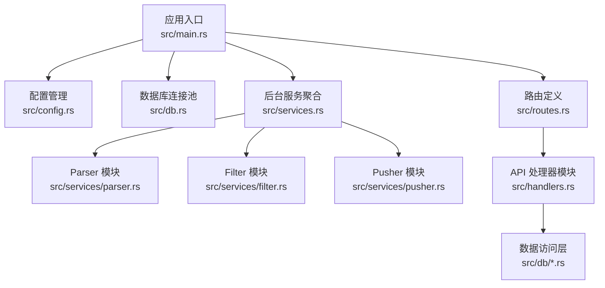
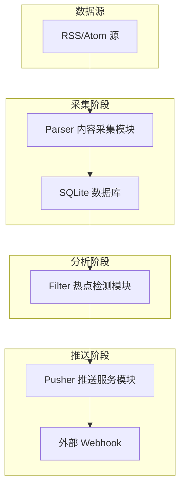
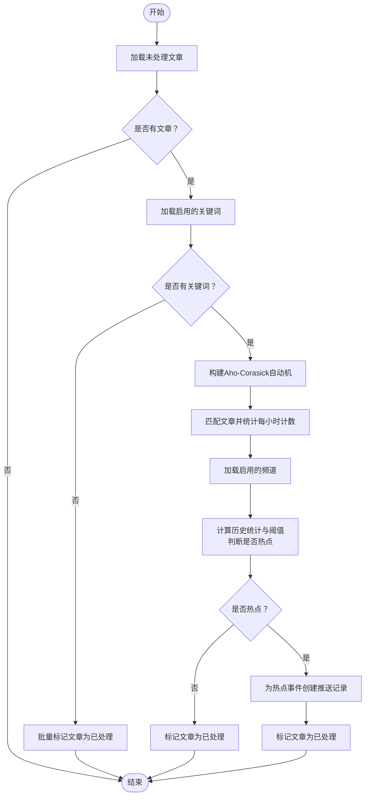
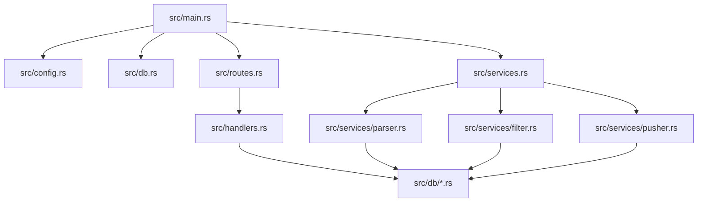
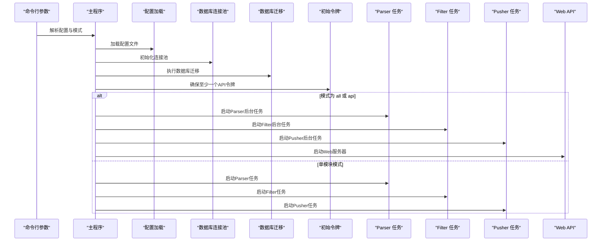

# 整体架构概览

<cite>
**本文档引用的文件**
- [src/main.rs](file://src/main.rs)
- [src/config.rs](file://src/config.rs)
- [src/db.rs](file://src/db.rs)
- [src/services.rs](file://src/services.rs)
- [src/routes.rs](file://src/routes.rs)
- [src/services/parser.rs](file://src/services/parser.rs)
- [src/services/filter.rs](file://src/services/filter.rs)
- [src/services/pusher.rs](file://src/services/pusher.rs)
- [config.toml](file://config.toml)
- [Cargo.toml](file://Cargo.toml)
- [src/db/article.rs](file://src/db/article.rs)
- [src/db/source.rs](file://src/db/source.rs)
- [src/db/keyword.rs](file://src/db/keyword.rs)
</cite>

## 目录
1. [简介](#简介)
2. [项目结构](#项目结构)
3. [核心组件](#核心组件)
4. [架构总览](#架构总览)
5. [详细组件分析](#详细组件分析)
6. [依赖关系分析](#依赖关系分析)
7. [性能考虑](#性能考虑)
8. [故障排除指南](#故障排除指南)
9. [结论](#结论)
10. [附录](#附录)

## 简介
本系统是一个基于管道模式（Pipeline）的AI趋势监控平台，采用模块化后台任务与Web API并存的架构设计。系统通过三个核心后台模块协同工作：Parser内容采集模块负责从RSS/Atom源抓取文章；Filter热点检测模块对文章进行关键词匹配与突发检测；Pusher推送服务模块将热点事件推送到外部Webhook。系统提供多种运行模式（all、api、parser、filter、pusher），支持独立部署与组合运行，满足不同场景下的监控需求。

## 项目结构
系统采用按功能域分层的模块组织方式，主要目录与职责如下：
- src/main.rs：应用入口，解析命令行参数，初始化配置、数据库连接池与迁移，根据运行模式启动相应后台任务与Web服务器。
- src/config.rs：定义应用配置结构体，包括服务器、数据库、认证、Parser、Filter、Pusher等配置项。
- src/db.rs：数据库连接池初始化与SQLite WAL模式设置。
- src/services.rs：后台服务模块聚合，包含parser、filter、pusher三个子模块。
- src/routes.rs：Web路由定义，包含令牌管理、数据源、关键词、频道、查询接口以及系统控制端点。
- src/services/parser.rs：内容采集模块，实现RSS/Atom解析器与并发抓取循环。
- src/services/filter.rs：热点检测模块，实现关键词匹配、突发检测与热点事件记录。
- src/services/pusher.rs：推送服务模块，实现Webhook推送与重试机制。
- config.toml：默认配置文件，定义各模块运行参数。
- Cargo.toml：依赖声明与构建配置。



**图表来源**
- [src/main.rs:64-164](file://src/main.rs#L64-L164)
- [src/config.rs:1-58](file://src/config.rs#L1-L58)
- [src/db.rs:10-27](file://src/db.rs#L10-L27)
- [src/routes.rs:14-70](file://src/routes.rs#L14-L70)
- [src/services.rs:1-4](file://src/services.rs#L1-L4)

**章节来源**
- [src/main.rs:64-164](file://src/main.rs#L64-L164)
- [src/config.rs:1-58](file://src/config.rs#L1-L58)
- [src/db.rs:10-27](file://src/db.rs#L10-L27)
- [src/routes.rs:14-70](file://src/routes.rs#L14-L70)
- [src/services.rs:1-4](file://src/services.rs#L1-L4)

## 核心组件
- 配置管理系统：集中管理服务器、数据库、认证、Parser、Filter、Pusher等配置，支持从配置文件加载与运行时读取。
- 数据库连接池：使用SQLite，启用WAL模式与外键约束，提供高并发读写能力。
- Web服务器：基于Axum框架，提供RESTful API与CORS支持，内置健康检查端点。
- 后台服务模块：Parser、Filter、Pusher三模块各自独立运行，通过数据库状态流转衔接。
- 运行模式：all（默认）、api、parser、filter、pusher五种模式，支持单模块或全量运行。

**章节来源**
- [src/config.rs:1-58](file://src/config.rs#L1-L58)
- [src/db.rs:10-27](file://src/db.rs#L10-L27)
- [src/routes.rs:14-70](file://src/routes.rs#L14-L70)
- [src/main.rs:87-160](file://src/main.rs#L87-L160)

## 架构总览
系统采用管道模式（Pipeline）架构，数据在Parser、Filter、Pusher三个阶段依次处理：
- Parser阶段：从数据源抓取文章，去重后写入数据库。
- Filter阶段：从数据库读取未处理文章，进行关键词匹配与突发检测，生成热点事件并创建推送记录。
- Pusher阶段：从数据库读取待推送记录，调用外部Webhook，失败时按指数退避重试。



**图表来源**
- [src/services/parser.rs:94-185](file://src/services/parser.rs#L94-L185)
- [src/services/filter.rs:13-277](file://src/services/filter.rs#L13-L277)
- [src/services/pusher.rs:11-259](file://src/services/pusher.rs#L11-L259)

## 详细组件分析

### Parser 内容采集模块
- 职责：定时查询到期的数据源，使用并发信号量限制抓取并发度，解析RSS/Atom内容，去重插入文章表，并更新数据源最后抓取时间。
- 关键特性：
  - 基于feed-rs解析RSS/Atom，提取标题、摘要、正文与发布时间。
  - 使用Tokio信号量控制最大并发抓取数。
  - 文章按链接去重，避免重复入库。
  - 失败时仍更新最后抓取时间，防止频繁重试。
- 并发与性能：通过信号量限制并发，结合异步IO提升吞吐。

```mermaid
sequenceDiagram
participant Loop as "Parser 循环"
participant DB as "数据库"
participant Parser as "RSS 解析器"
participant Pool as "连接池"
Loop->>DB : 查询到期数据源
DB-->>Loop : 返回待抓取源列表
loop 对每个数据源
Loop->>Parser : fetch_and_parse(源)
Parser->>Pool : 发起HTTP请求
Pool-->>Parser : 返回响应
Parser-->>Loop : 解析结果(文章列表)
Loop->>DB : 插入文章(去重)
DB-->>Loop : 成功/跳过
Loop->>DB : 更新最后抓取时间
end
```

**图表来源**
- [src/services/parser.rs:94-185](file://src/services/parser.rs#L94-L185)
- [src/db/source.rs:119-133](file://src/db/source.rs#L119-L133)
- [src/db/article.rs:6-29](file://src/db/article.rs#L6-L29)

**章节来源**
- [src/services/parser.rs:94-185](file://src/services/parser.rs#L94-L185)
- [src/db/source.rs:119-133](file://src/db/source.rs#L119-L133)
- [src/db/article.rs:6-29](file://src/db/article.rs#L6-L29)

### Filter 热点检测模块
- 职责：周期性扫描未处理文章，构建Aho-Corasick自动机进行关键词匹配，统计每小时计数，计算历史均值与标准差，触发突发检测，创建热点事件与推送记录，并标记文章已处理。
- 关键特性：
  - 支持大小写敏感与不敏感两种关键词匹配策略。
  - 历史统计基于最近N小时的小时级计数，动态计算阈值。
  - 热点事件以“关键字+小时桶”唯一标识，UPSERT保证幂等。
  - 无关键词时批量标记文章为已处理。
- 算法流程：



**图表来源**
- [src/services/filter.rs:13-208](file://src/services/filter.rs#L13-L208)

**章节来源**
- [src/services/filter.rs:13-277](file://src/services/filter.rs#L13-L277)

### Pusher 推送服务模块
- 职责：轮询待推送与可重试的推送记录，根据频道配置提取Webhook地址，构造消息体并发送HTTP请求，成功则乐观锁更新状态，失败按指数退避重试，超过最大次数后放弃。
- 关键特性：
  - 支持JSON配置中的URL字段提取。
  - 消息体包含关键词、计数、小时桶、历史均值与标准差。
  - 乐观锁更新避免并发冲突。
  - 指数退避：下次重试时间=当前时间+(重试次数×基础秒数)。
- 流程图：

```mermaid
sequenceDiagram
participant Loop as "Pusher 循环"
participant DB as "数据库"
participant Client as "HTTP 客户端"
participant Channel as "频道配置"
participant Event as "热点事件"
participant Keyword as "关键词"
Loop->>DB : 查询待推送与可重试记录
DB-->>Loop : 返回可推送记录列表
loop 对每条记录
Loop->>DB : 查询频道配置
DB-->>Loop : 返回频道
Loop->>DB : 查询热点事件与关键词
DB-->>Loop : 返回事件与关键词
Loop->>Channel : 提取Webhook URL
Channel-->>Loop : 返回URL
Loop->>Client : POST 消息体
alt 成功
Client-->>Loop : 2xx
Loop->>DB : 乐观锁更新为成功
else 失败
Client-->>Loop : 非2xx或网络错误
Loop->>DB : 指数退避更新为失败
end
end
```

**图表来源**
- [src/services/pusher.rs:11-259](file://src/services/pusher.rs#L11-L259)

**章节来源**
- [src/services/pusher.rs:11-259](file://src/services/pusher.rs#L11-L259)

### Web服务器与路由
- 路由组织：健康检查、令牌管理、数据源管理、关键词管理、频道管理、查询接口与系统控制端点。
- 中间件：统一鉴权中间件，所有业务API均受保护。
- CORS：允许跨域访问，便于前端集成。

**章节来源**
- [src/routes.rs:14-70](file://src/routes.rs#L14-L70)

### 数据库与模型
- 连接池：SQLite，WAL模式，外键约束，最大连接数5。
- 主要实体：数据源、文章、关键词、关键词提及、热点事件、推送记录、令牌。
- 关键查询：文章去重插入、未处理文章批量标记、到期数据源查询、历史小时计数统计等。

**章节来源**
- [src/db.rs:10-27](file://src/db.rs#L10-L27)
- [src/db/article.rs:6-29](file://src/db/article.rs#L6-L29)
- [src/db/source.rs:119-133](file://src/db/source.rs#L119-L133)

## 依赖关系分析
系统依赖关系清晰，模块间耦合度低，通过数据库作为共享状态存储实现解耦：
- 应用入口依赖配置、数据库、路由与服务模块。
- 服务模块依赖数据库访问层与配置。
- 路由依赖处理器模块与中间件。
- 数据库访问层依赖SQLx与模型定义。



**图表来源**
- [src/main.rs:64-164](file://src/main.rs#L64-L164)
- [src/services.rs:1-4](file://src/services.rs#L1-L4)
- [src/routes.rs:14-70](file://src/routes.rs#L14-L70)

**章节来源**
- [src/main.rs:64-164](file://src/main.rs#L64-L164)
- [src/services.rs:1-4](file://src/services.rs#L1-L4)
- [src/routes.rs:14-70](file://src/routes.rs#L14-L70)

## 性能考虑
- 并发控制：Parser使用信号量限制并发抓取，避免资源争用；Filter与Pusher使用固定间隔轮询，避免CPU空转。
- 批量操作：Filter批量标记文章处理状态，减少事务开销；文章批量插入使用分片更新，规避SQLite变量上限。
- 数据库优化：SQLite启用WAL模式与外键约束，提升并发读写稳定性；索引建议：按需在高频查询列上建立索引（如文章processed_at、数据源last_fetched_at）。
- 网络与超时：Parser与Pusher分别配置默认超时与用户代理，避免长时间阻塞。
- 配置优化：根据硬件与业务规模调整Parser并发数、Filter批大小与历史窗口、Pusher重试次数与基础延迟。

## 故障排除指南
- 初始令牌问题：首次启动若数据库中无令牌，系统会自动生成初始令牌并打印到日志；可通过配置文件设置初始令牌。
- 数据库迁移：启动时自动执行迁移脚本，确保表结构一致。
- Parser失败：抓取失败会记录错误并更新最后抓取时间，避免立即重试；检查数据源URL与网络连通性。
- Filter无关键词：无启用关键词时，系统会批量标记未处理文章为已处理；确认关键词已启用。
- Pusher推送失败：按指数退避重试，超过最大次数后放弃；检查频道配置JSON中的URL字段与外部Webhook可用性。
- API鉴权：所有业务API需携带有效令牌，检查令牌有效性与中间件配置。

**章节来源**
- [src/main.rs:27-62](file://src/main.rs#L27-L62)
- [src/main.rs:80-81](file://src/main.rs#L80-L81)
- [src/services/parser.rs:170-181](file://src/services/parser.rs#L170-L181)
- [src/services/filter.rs:39-46](file://src/services/filter.rs#L39-L46)
- [src/services/pusher.rs:212-242](file://src/services/pusher.rs#L212-L242)

## 结论
本系统通过管道模式实现了内容采集、热点检测与推送服务的解耦与可扩展架构。配置驱动的设计使系统具备良好的可运维性与可移植性；模块化架构便于独立部署与演进。通过合理的并发控制、批量操作与数据库优化，系统能够在中小规模场景下稳定运行，并可根据需要扩展至更大规模。

## 附录

### 运行模式与应用场景
- all：默认模式，同时运行Parser、Filter、Pusher与Web API，适合完整监控场景。
- api：仅启动Web API，适合只使用管理与查询接口的场景。
- parser：仅运行内容采集，适合将采集与分析分离的分布式部署。
- filter：仅运行热点检测，适合独立分析与审计场景。
- pusher：仅运行推送服务，适合独立推送与告警场景。

**章节来源**
- [src/main.rs:87-160](file://src/main.rs#L87-L160)

### 系统启动序列图


**图表来源**
- [src/main.rs:64-164](file://src/main.rs#L64-L164)

### 配置驱动与模块化优势
- 配置驱动：通过config.toml集中管理各模块参数，支持热切换与环境差异化配置。
- 模块化：Parser、Filter、Pusher独立运行，便于扩展新模块与替换实现。
- 可观测性：模块内广泛使用tracing日志，便于问题定位与性能分析。
- 可测试性：模块职责单一，易于单元测试与集成测试。

**章节来源**
- [config.toml:1-27](file://config.toml#L1-L27)
- [src/config.rs:51-58](file://src/config.rs#L51-L58)