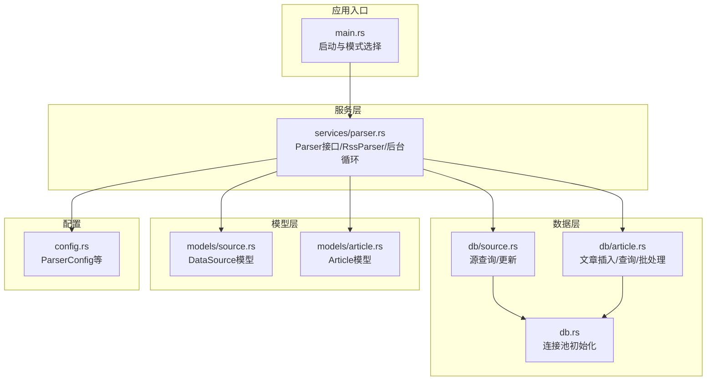
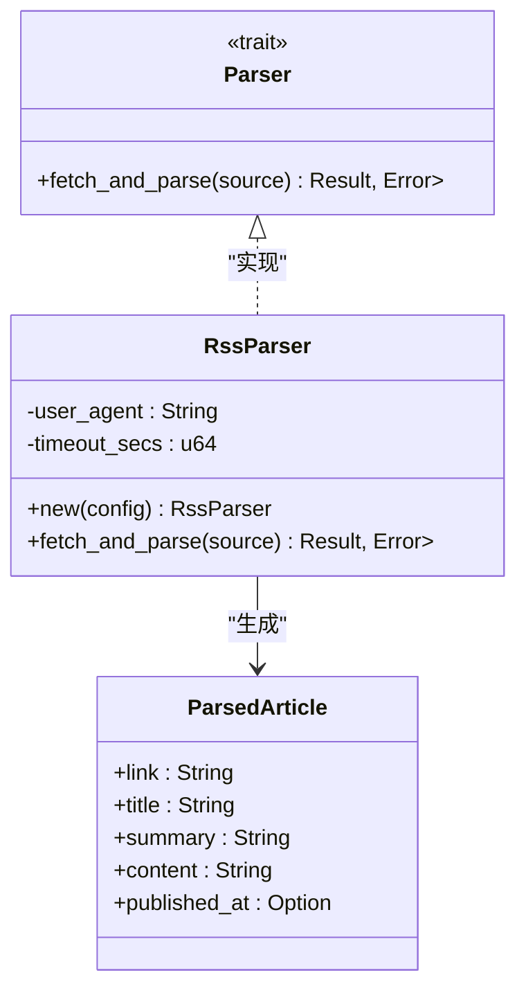
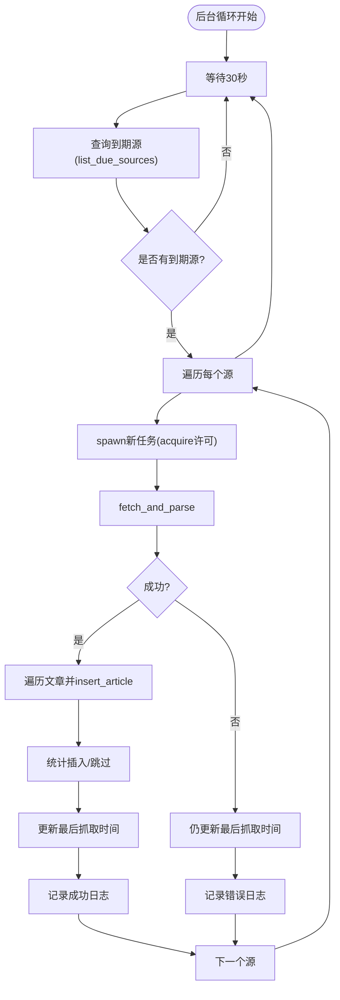
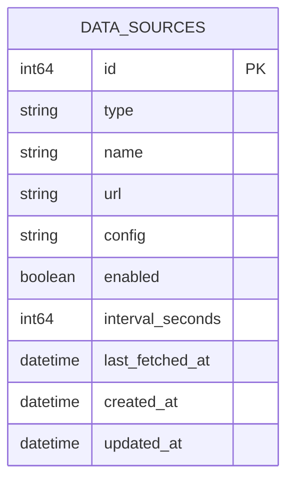
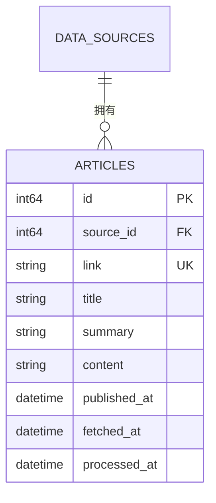
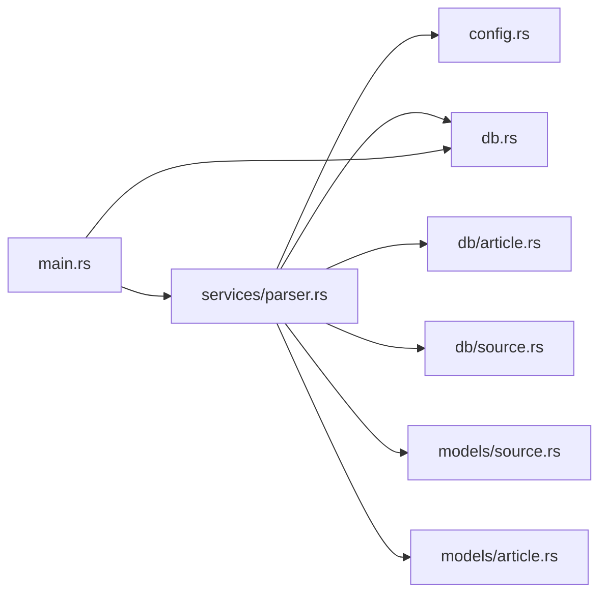

# 内容采集模块（Parser）

<cite>
**本文档引用的文件**
- [src/services/parser.rs](file://src/services/parser.rs)
- [src/models/article.rs](file://src/models/article.rs)
- [src/models/source.rs](file://src/models/source.rs)
- [src/db.rs](file://src/db.rs)
- [src/db/source.rs](file://src/db/source.rs)
- [src/db/article.rs](file://src/db/article.rs)
- [src/config.rs](file://src/config.rs)
- [src/main.rs](file://src/main.rs)
- [Cargo.toml](file://Cargo.toml)
</cite>

## 目录
1. [简介](#简介)
2. [项目结构](#项目结构)
3. [核心组件](#核心组件)
4. [架构总览](#架构总览)
5. [详细组件分析](#详细组件分析)
6. [依赖关系分析](#依赖关系分析)
7. [性能考虑](#性能考虑)
8. [故障排查指南](#故障排查指南)
9. [结论](#结论)
10. [附录](#附录)

## 简介
本文件为内容采集模块（Parser）的详细技术文档，聚焦于RSS/Atom内容采集、解析、去重与存储的完整链路。文档覆盖以下关键点：
- Parser模块职责：RSS内容采集、XML/Atom格式解析、内容去重和存储机制
- RSS源管理：启用状态、轮询间隔、最后抓取时间等元数据
- 内容提取算法：从feed条目中抽取标题、摘要、正文、发布时间等字段
- 文本清洗与标准化：统一时间格式、清理空值、保证字段一致性
- 数据交互：与Source模型的数据交互、Article模型的存储策略
- 数据库连接池：SQLite连接池初始化与WAL模式、外键约束
- 错误处理：网络超时、解析失败、数据库写入异常的处理策略
- 并发与性能：信号量限流、后台循环调度、批量更新优化
- 代码示例路径：提供可定位到具体实现的文件与行号，便于进一步阅读

## 项目结构
Parser模块位于服务层，围绕“解析器接口 + 具体实现 + 后台循环 + 数据访问”组织代码；数据模型与数据库操作分别在models与db子模块中定义。



图表来源
- [src/main.rs:64-164](file://src/main.rs#L64-L164)
- [src/services/parser.rs:1-185](file://src/services/parser.rs#L1-L185)
- [src/db.rs:10-26](file://src/db.rs#L10-L26)
- [src/db/source.rs:1-133](file://src/db/source.rs#L1-L133)
- [src/db/article.rs:1-162](file://src/db/article.rs#L1-L162)
- [src/models/source.rs:1-39](file://src/models/source.rs#L1-L39)
- [src/models/article.rs:1-25](file://src/models/article.rs#L1-L25)
- [src/config.rs:29-34](file://src/config.rs#L29-L34)

章节来源
- [src/main.rs:64-164](file://src/main.rs#L64-L164)
- [src/services/parser.rs:1-185](file://src/services/parser.rs#L1-L185)
- [src/db.rs:10-26](file://src/db.rs#L10-L26)
- [src/db/source.rs:1-133](file://src/db/source.rs#L1-L133)
- [src/db/article.rs:1-162](file://src/db/article.rs#L1-L162)
- [src/models/source.rs:1-39](file://src/models/source.rs#L1-L39)
- [src/models/article.rs:1-25](file://src/models/article.rs#L1-L25)
- [src/config.rs:29-34](file://src/config.rs#L29-L34)

## 核心组件
- Parser接口与RssParser实现：定义异步抓取与解析协议，并通过feed-rs解析RSS/Atom，提取条目字段。
- 后台循环：定时查询到期的RSS源，按并发上限分发抓取任务，完成去重入库与最后抓取时间更新。
- 源管理：DataSource模型承载源信息；list_due_sources根据last_fetched_at与interval_seconds判断是否到期。
- 文章存储：Article模型承载文章字段；insert_article基于link进行去重（ON CONFLICT DO NOTHING），返回插入结果或跳过。
- 连接池：SQLite连接池初始化，启用WAL与外键约束，限制最大连接数。
- 配置：ParserConfig提供用户代理、默认超时、最大并发等参数。

章节来源
- [src/services/parser.rs:21-88](file://src/services/parser.rs#L21-L88)
- [src/services/parser.rs:90-185](file://src/services/parser.rs#L90-L185)
- [src/db/source.rs:119-132](file://src/db/source.rs#L119-L132)
- [src/db/article.rs:6-29](file://src/db/article.rs#L6-L29)
- [src/db.rs:10-26](file://src/db.rs#L10-L26)
- [src/config.rs:29-34](file://src/config.rs#L29-L34)

## 架构总览
Parser模块采用“接口抽象 + 具体实现 + 后台调度 + 数据持久化”的分层设计。整体流程如下：

```mermaid
sequenceDiagram
participant Main as "主程序(main.rs)"
participant Loop as "后台循环(start_parser_loop)"
participant DBSrc as "源数据库(db/source.rs)"
participant Parser as "解析器(RssParser)"
participant Net as "HTTP客户端(reqwest)"
participant Feed as "解析器(feed-rs)"
participant DBArt as "文章数据库(db/article.rs)"
Main->>Loop : 启动后台循环
Loop->>DBSrc : 查询到期源(list_due_sources)
DBSrc-->>Loop : 返回待抓取源列表
loop 对每个源
Loop->>Parser : fetch_and_parse(source)
Parser->>Net : GET 源URL(带UA/超时)
Net-->>Parser : 响应字节流
Parser->>Feed : 解析RSS/Atom
Feed-->>Parser : 条目集合(entries)
Parser-->>Loop : 提取后的文章列表
loop 对每篇文章
Loop->>DBArt : insert_article(基于link去重)
DBArt-->>Loop : 插入成功/已存在
end
Loop->>DBSrc : 更新最后抓取时间(update_source_last_fetched)
end
```

图表来源
- [src/main.rs:87-110](file://src/main.rs#L87-L110)
- [src/services/parser.rs:94-185](file://src/services/parser.rs#L94-L185)
- [src/db/source.rs:119-132](file://src/db/source.rs#L119-L132)
- [src/db/article.rs:6-29](file://src/db/article.rs#L6-L29)

## 详细组件分析

### Parser接口与RssParser实现
- 接口职责：定义fetch_and_parse方法，接收DataSource并返回ParsedArticle向量，错误以Box<dyn Error>形式返回。
- RssParser实现要点：
  - 使用reqwest构建HTTP客户端，设置User-Agent与超时。
  - 发送GET请求，读取响应字节流。
  - 使用feed-rs解析为feed对象，遍历entries提取字段。
  - 时间字段优先使用published，否则回退到updated，转换为NaiveDateTime。



图表来源
- [src/services/parser.rs:21-88](file://src/services/parser.rs#L21-L88)

章节来源
- [src/services/parser.rs:21-88](file://src/services/parser.rs#L21-L88)

### 后台循环与并发控制
- 调度周期：每30秒执行一次。
- 并发控制：使用tokio::sync::Semaphore限制最大并发抓取数。
- 任务分发：对每个到期源创建独立任务，内部先获取许可再发起抓取。
- 结果处理：
  - 成功：逐条调用insert_article进行去重插入；统计插入数与跳过数；更新最后抓取时间。
  - 失败：记录错误日志；仍尝试更新最后抓取时间，避免立即重试。
- 日志输出：包含源ID、名称、插入数量、跳过数量等信息。



图表来源
- [src/services/parser.rs:94-185](file://src/services/parser.rs#L94-L185)
- [src/db/source.rs:119-132](file://src/db/source.rs#L119-L132)
- [src/db/article.rs:6-29](file://src/db/article.rs#L6-L29)

章节来源
- [src/services/parser.rs:94-185](file://src/services/parser.rs#L94-L185)

### RSS源管理与到期判定
- DataSource模型包含类型、名称、URL、配置JSON、启用状态、轮询间隔、最后抓取时间等字段。
- 到期判定逻辑：enabled为真，且last_fetched_at为空或距离上次抓取超过interval_seconds。
- 最后抓取时间更新：无论成功与否均尝试更新，确保不会立即重复抓取。



图表来源
- [src/models/source.rs:5-19](file://src/models/source.rs#L5-L19)
- [src/db/source.rs:119-132](file://src/db/source.rs#L119-L132)

章节来源
- [src/models/source.rs:1-39](file://src/models/source.rs#L1-L39)
- [src/db/source.rs:119-132](file://src/db/source.rs#L119-L132)

### 文章存储与去重策略
- Article模型包含source_id、link、title、summary、content、published_at、fetched_at、processed_at等字段。
- 去重策略：insert_article使用ON CONFLICT(link) DO NOTHING，仅当link不存在时插入，返回Some(Article)表示插入成功，None表示重复被跳过。
- 批量处理：mark_processed_batch支持按ID批量标记processed_at，采用分块（每批最多100个ID）避免SQLite变量上限问题。



图表来源
- [src/models/article.rs:5-16](file://src/models/article.rs#L5-L16)
- [src/db/article.rs:6-29](file://src/db/article.rs#L6-L29)

章节来源
- [src/models/article.rs:1-25](file://src/models/article.rs#L1-L25)
- [src/db/article.rs:6-29](file://src/db/article.rs#L6-L29)
- [src/db/article.rs:124-140](file://src/db/article.rs#L124-L140)

### 数据库连接池与初始化
- 连接池初始化：SqlitePoolOptions设置最大连接数为5，数据库URL采用rwc模式。
- WAL模式与外键：启动时执行PRAGMA journal_mode=WAL与PRAGMA foreign_keys=ON。
- 迁移：启动时自动应用迁移脚本。

章节来源
- [src/db.rs:10-26](file://src/db.rs#L10-L26)
- [src/main.rs:80-81](file://src/main.rs#L80-L81)

### 配置与运行模式
- ParserConfig：包含max_concurrent_fetches、default_user_agent、default_timeout_seconds。
- 运行模式：支持all、api、parser、filter、pusher五种模式，parser模式仅运行后台采集循环。

章节来源
- [src/config.rs:29-34](file://src/config.rs#L29-L34)
- [src/main.rs:87-160](file://src/main.rs#L87-L160)

## 依赖关系分析
- 外部依赖：reqwest用于HTTP抓取，feed-rs用于RSS/Atom解析，chrono用于时间处理，tokio::sync::Semaphore用于并发控制。
- 内部模块：services/parser.rs依赖config、db、models；db子模块提供数据访问；models提供数据结构。



图表来源
- [src/services/parser.rs:1-10](file://src/services/parser.rs#L1-L10)
- [src/main.rs:1-8](file://src/main.rs#L1-L8)
- [src/db.rs:1-8](file://src/db.rs#L1-L8)

章节来源
- [src/services/parser.rs:1-10](file://src/services/parser.rs#L1-L10)
- [src/main.rs:1-8](file://src/main.rs#L1-L8)
- [src/db.rs:1-8](file://src/db.rs#L1-L8)

## 性能考虑
- 并发控制：通过Semaphore限制最大并发抓取数，避免对远端源造成过大压力。
- 轮询调度：固定30秒间隔查询到期源，平衡实时性与资源消耗。
- 去重策略：基于link的唯一约束与ON CONFLICT DO NOTHING，减少重复写入。
- 批量更新：mark_processed_batch分块更新processed_at，避免SQL变量过多导致的性能问题。
- 连接池：最大连接数限制为5，结合WAL模式提升并发写入性能。
- 超时控制：HTTP请求超时由ParserConfig提供，防止长时间阻塞。

章节来源
- [src/services/parser.rs:94-185](file://src/services/parser.rs#L94-L185)
- [src/db/article.rs:124-140](file://src/db/article.rs#L124-L140)
- [src/db.rs:10-26](file://src/db.rs#L10-L26)
- [src/config.rs:29-34](file://src/config.rs#L29-L34)

## 故障排查指南
- 抓取失败
  - 现象：日志出现“failed to fetch source ...”。
  - 可能原因：网络超时、目标站点不可达、HTTP状态码异常。
  - 处理建议：检查超时配置、网络连通性、目标站点可用性；确认User-Agent未被屏蔽。
- 解析失败
  - 现象：日志出现“failed to parse feed”或类似错误。
  - 可能原因：非标准RSS/Atom格式、编码问题、响应体为空。
  - 处理建议：验证源URL有效性与内容类型；检查响应字节流是否完整。
- 存储失败
  - 现象：日志出现“failed to insert article ...”。
  - 可能原因：数据库连接异常、约束冲突、磁盘空间不足。
  - 处理建议：检查数据库连接池状态、磁盘配额；查看具体SQL错误。
- 并发过高
  - 现象：抓取延迟增大、数据库写入卡顿。
  - 处理建议：降低max_concurrent_fetches；检查数据库性能与WAL写入速度。
- 重复抓取
  - 现象：大量重复文章入库。
  - 处理建议：确认link字段唯一性与去重逻辑；检查源URL是否变化但link未变。

章节来源
- [src/services/parser.rs:101-185](file://src/services/parser.rs#L101-L185)
- [src/db/article.rs:6-29](file://src/db/article.rs#L6-L29)

## 结论
Parser模块通过清晰的接口抽象与后台循环调度，实现了对RSS/Atom源的稳定抓取与高效存储。其并发控制、去重策略与批量更新机制共同保障了系统的可靠性与性能。配合SQLite连接池与WAL模式，能够在单机环境下满足持续采集与查询需求。后续可扩展更多解析器类型（如JSON Feed），并在现有Parser接口上无缝集成。

## 附录
- 代码示例路径（不直接展示代码内容）：
  - RSS采集流程：[src/services/parser.rs:94-185](file://src/services/parser.rs#L94-L185)
  - 内容解析过程：[src/services/parser.rs:48-88](file://src/services/parser.rs#L48-L88)
  - 数据库写入操作：[src/db/article.rs:6-29](file://src/db/article.rs#L6-L29)
  - 源到期查询：[src/db/source.rs:119-132](file://src/db/source.rs#L119-L132)
  - 连接池初始化：[src/db.rs:10-26](file://src/db.rs#L10-L26)
  - 配置加载：[src/config.rs:29-34](file://src/config.rs#L29-L34)
  - 应用入口与模式：[src/main.rs:87-160](file://src/main.rs#L87-L160)