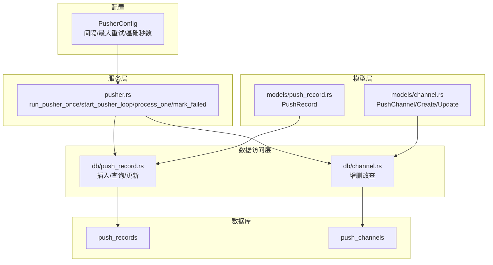
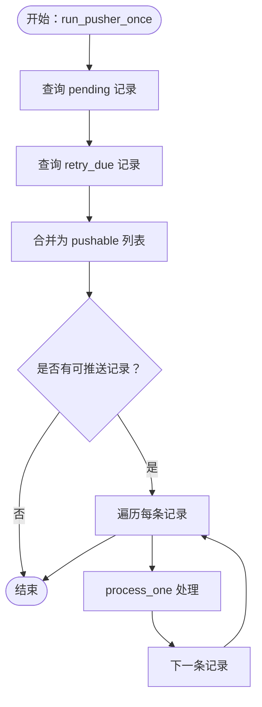
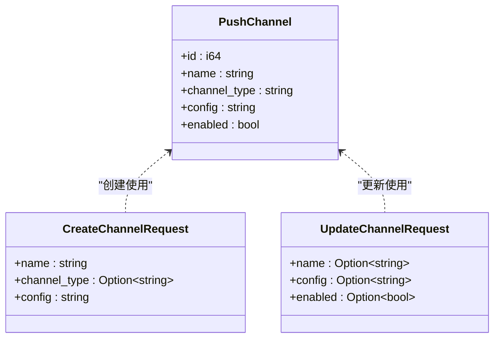
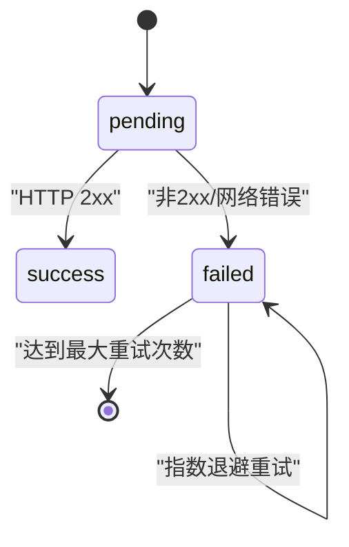
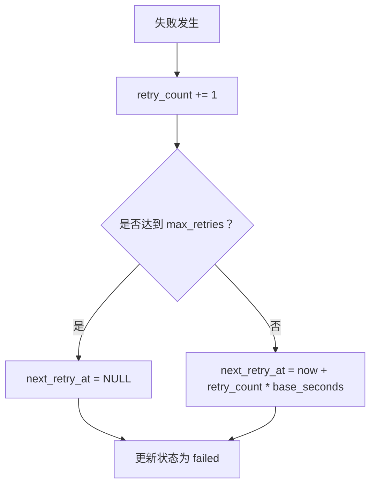
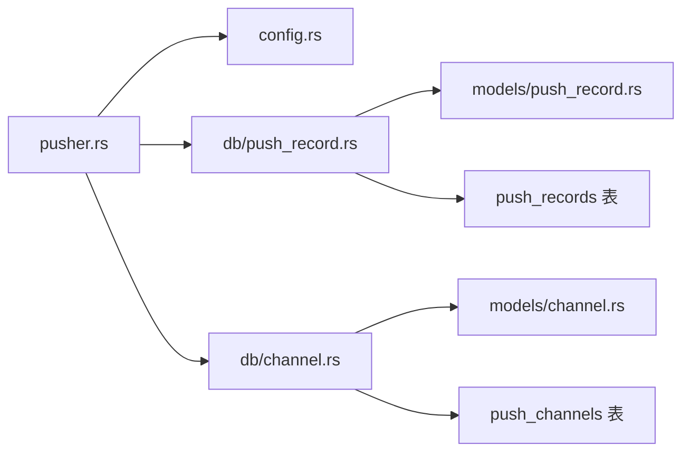

# 推送服务模块（Pusher）

<cite>
**本文引用的文件**
- [src/services/pusher.rs](file://src/services/pusher.rs)
- [src/models/push_record.rs](file://src/models/push_record.rs)
- [src/models/channel.rs](file://src/models/channel.rs)
- [src/db/push_record.rs](file://src/db/push_record.rs)
- [src/db/channel.rs](file://src/db/channel.rs)
- [src/config.rs](file://src/config.rs)
- [docs/migrations/20260607044921_init.sql](file://docs/migrations/20260607044921_init.sql)
- [src/main.rs](file://src/main.rs)
- [openspec/specs/pusher-module/spec.md](file://openspec/specs/pusher-module/spec.md)
- [openspec/specs/database-schema/spec.md](file://openspec/specs/database-schema/spec.md)
</cite>

## 目录
1. [简介](#简介)
2. [项目结构](#项目结构)
3. [核心组件](#核心组件)
4. [架构总览](#架构总览)
5. [组件详解](#组件详解)
6. [依赖关系分析](#依赖关系分析)
7. [性能与并发](#性能与并发)
8. [故障排查指南](#故障排查指南)
9. [结论](#结论)
10. [附录](#附录)

## 简介
本文件面向“推送服务模块（Pusher）”的实现文档，聚焦以下目标：
- Webhook 推送机制：从数据库拉取待推送记录，解析渠道配置，构建消息体并发送 HTTP 请求。
- 重试策略与退避算法：基于指数退避的失败重试，最大重试次数控制，以及下次重试时间计算。
- 状态管理：记录状态（pending/success/failed）、重试计数与下次重试时间，并通过乐观锁避免并发重复推送。
- Channel 模型与 PushRecord 模型：配置管理、状态跟踪与历史记录查询。
- HTTP 请求构建与响应处理：消息体构造、网络错误与非 2xx 响应的处理。
- 并发推送能力与队列管理：后台循环、间隔调度与并发安全。
- 监控与日志：关键路径的日志记录与可观测性。
- 故障恢复：最大重试后放弃、记录状态回写与异常处理。

## 项目结构
推送服务模块位于后端服务层，围绕数据库表 push_records 与 push_channels 展开，配合配置项进行周期性推送与失败重试。



图表来源
- [src/services/pusher.rs:1-259](file://src/services/pusher.rs#L1-L259)
- [src/db/push_record.rs:1-154](file://src/db/push_record.rs#L1-L154)
- [src/db/channel.rs:1-88](file://src/db/channel.rs#L1-L88)
- [src/models/push_record.rs:1-16](file://src/models/push_record.rs#L1-L16)
- [src/models/channel.rs:1-26](file://src/models/channel.rs#L1-L26)
- [docs/migrations/20260607044921_init.sql:92-118](file://docs/migrations/20260607044921_init.sql#L92-L118)

章节来源
- [src/services/pusher.rs:1-259](file://src/services/pusher.rs#L1-L259)
- [src/db/push_record.rs:1-154](file://src/db/push_record.rs#L1-L154)
- [src/db/channel.rs:1-88](file://src/db/channel.rs#L1-L88)
- [src/models/push_record.rs:1-16](file://src/models/push_record.rs#L1-L16)
- [src/models/channel.rs:1-26](file://src/models/channel.rs#L1-L26)
- [docs/migrations/20260607044921_init.sql:92-118](file://docs/migrations/20260607044921_init.sql#L92-L118)

## 核心组件
- Pusher 配置（PusherConfig）：包含推送间隔、最大重试次数、基础退避秒数。
- 推送记录（PushRecord）：承载一次推送任务的状态、重试计数与下次重试时间。
- 渠道模型（PushChannel）：承载渠道类型、启用状态与配置（JSON 字符串，包含 webhook URL）。
- 数据库接口（db/push_record.rs、db/channel.rs）：提供插入、查询、更新与乐观锁更新。
- 服务实现（pusher.rs）：单次执行、后台循环、单条记录处理、失败标记与退避计算。

章节来源
- [src/config.rs:44-49](file://src/config.rs#L44-L49)
- [src/models/push_record.rs:5-15](file://src/models/push_record.rs#L5-L15)
- [src/models/channel.rs:4-11](file://src/models/channel.rs#L4-L11)
- [src/db/push_record.rs:6-154](file://src/db/push_record.rs#L6-L154)
- [src/db/channel.rs:5-88](file://src/db/channel.rs#L5-L88)
- [src/services/pusher.rs:11-259](file://src/services/pusher.rs#L11-L259)

## 架构总览
推送服务采用“后台循环 + 单次执行”的架构：
- 后台循环按配置间隔触发单次执行。
- 单次执行拉取待推送与可重试记录，逐条处理。
- 处理流程：读取渠道配置 → 读取热点事件与关键词 → 构建消息体 → 发送 HTTP 请求 → 成功则乐观锁更新为成功；失败则指数退避更新为失败并设置下次重试时间。
- 最大重试次数到达后不再安排下次重试。

```mermaid
sequenceDiagram
participant Loop as "后台循环"
participant Once as "run_pusher_once"
participant DB as "数据库"
participant Svc as "process_one"
participant HTTP as "HTTP客户端"
participant Ch as "渠道配置"
Loop->>Once : 触发一次推送
Once->>DB : 查询 pending 与 retry_due 记录
DB-->>Once : 返回可推送记录集
Once->>Svc : 逐条处理记录
Svc->>DB : 读取渠道配置
DB-->>Svc : 渠道对象
Svc->>Ch : 解析配置 JSON 提取 URL
alt URL 缺失
Svc->>DB : 更新为 failed无下次重试
else URL 存在
Svc->>DB : 读取热点事件与关键词
Svc->>HTTP : POST 消息体到 webhook
alt 2xx 成功
Svc->>DB : 乐观锁更新为 success
else 非2xx或网络错误
Svc->>DB : 指数退避更新为 failed
end
end
```

图表来源
- [src/services/pusher.rs:11-259](file://src/services/pusher.rs#L11-L259)
- [src/db/push_record.rs:45-109](file://src/db/push_record.rs#L45-L109)
- [src/db/channel.rs:32-40](file://src/db/channel.rs#L32-L40)

## 组件详解

### Pusher 服务（推送执行与循环）
- 单次执行（run_pusher_once）：拉取状态为 pending 的记录，以及状态为 failed 且满足重试条件（重试次数小于阈值、next_retry_at 已到达或为空）的记录，合并后逐条处理。
- 后台循环（start_pusher_loop）：按配置间隔睡眠后调用单次执行。
- 单条处理（process_one）：读取渠道、热点事件与关键词，提取 webhook URL，构建消息体并发送 HTTP 请求；根据响应结果更新状态。
- 失败标记（mark_failed）：计算新的重试计数与下次重试时间（指数退避），若达到最大重试则清空下次重试时间。



图表来源
- [src/services/pusher.rs:11-43](file://src/services/pusher.rs#L11-L43)

章节来源
- [src/services/pusher.rs:11-259](file://src/services/pusher.rs#L11-L259)

### Channel 模型与配置管理
- PushChannel：包含 id、name、channel_type、config（JSON 字符串）、enabled。
- CreateChannelRequest/UpdateChannelRequest：用于创建与更新时的请求体定义。
- 配置解析：从 JSON 中提取 webhook URL；若不存在则直接标记失败并跳过该记录。



图表来源
- [src/models/channel.rs:4-25](file://src/models/channel.rs#L4-L25)

章节来源
- [src/models/channel.rs:1-26](file://src/models/channel.rs#L1-L26)
- [src/db/channel.rs:5-88](file://src/db/channel.rs#L5-L88)

### PushRecord 模型与状态跟踪
- PushRecord：包含 id、hot_event_id、channel_id、status、retry_count、next_retry_at、created_at、updated_at。
- 状态流转：pending → success 或 failed；failed 可再次被调度重试，直到达到最大重试次数。
- 乐观锁更新：仅当当前状态与期望状态一致时才更新，避免并发重复推送。



图表来源
- [src/models/push_record.rs:5-15](file://src/models/push_record.rs#L5-L15)
- [src/db/push_record.rs:87-109](file://src/db/push_record.rs#L87-L109)

章节来源
- [src/models/push_record.rs:1-16](file://src/models/push_record.rs#L1-L16)
- [src/db/push_record.rs:65-109](file://src/db/push_record.rs#L65-L109)

### HTTP 请求构建与响应处理
- 消息体构建：包含消息类型与文本内容，文本内容由关键词、计数、小时桶、历史均值与标准差组成。
- 发送方式：使用 HTTP 客户端 POST 到解析出的 webhook URL。
- 响应处理：
  - 2xx：记录成功并乐观锁更新。
  - 非 2xx 或网络错误：记录失败并指数退避更新。
- 认证头：当前实现未显式添加认证头；如需认证，请在渠道配置中使用支持的 webhook 方式或在上游网关处理。

章节来源
- [src/services/pusher.rs:131-202](file://src/services/pusher.rs#L131-L202)

### 重试策略与退避算法
- 指数退避：下次重试时间 = 当前时间 + retry_count × retry_base_seconds。
- 最大重试：达到 max_retries 后不再安排下次重试（next_retry_at 设为 NULL）。
- 调度条件：failed 且 retry_count < max_retries 且 next_retry_at 已到达或为空。



图表来源
- [src/services/pusher.rs:207-242](file://src/services/pusher.rs#L207-L242)
- [src/db/push_record.rs:53-63](file://src/db/push_record.rs#L53-L63)

章节来源
- [src/services/pusher.rs:207-242](file://src/services/pusher.rs#L207-L242)
- [src/db/push_record.rs:53-63](file://src/db/push_record.rs#L53-L63)

### 并发推送与队列管理
- 并发模型：后台循环在独立任务中运行，每次单次执行内对记录进行顺序处理。
- 并发安全：使用乐观锁更新成功状态，避免多个进程同时将同一记录标记为成功。
- 队列管理：通过数据库状态字段与索引实现“待推送/可重试”的自然队列；无需外部消息队列。
- 资源限制：当前实现未引入连接池或并发限流，建议在生产环境结合部署规模评估并发与数据库压力。

章节来源
- [src/services/pusher.rs:40-42](file://src/services/pusher.rs#L40-L42)
- [src/db/push_record.rs:87-109](file://src/db/push_record.rs#L87-L109)
- [src/main.rs:140-151](file://src/main.rs#L140-L151)

### 监控指标、日志与可观测性
- 日志级别：
  - info：开始推送、推送数量、成功情况。
  - warn：失败情况、达到最大重试、乐观锁更新未生效。
  - error：数据库查询失败、网络错误、无法找到渠道/热点事件/关键词等。
- 指标建议：可基于日志统计成功率、失败率、平均重试次数、最大重试耗时等，作为 Prometheus 指标采集的基础。

章节来源
- [src/services/pusher.rs:16-18, 24-26, 35, 56-70, 84-91, 105-112, 148-154, 183-189, 192-199, 215-219, 236-241:16-241](file://src/services/pusher.rs#L16-L241)

## 依赖关系分析
- 服务层依赖配置层（PusherConfig）与数据库层（db/push_record.rs、db/channel.rs）。
- 数据库层依赖模型层（models/push_record.rs、models/channel.rs）。
- 数据库表 push_records 与 push_channels 通过外键关联，形成完整的推送生命周期闭环。



图表来源
- [src/services/pusher.rs:1-259](file://src/services/pusher.rs#L1-L259)
- [src/config.rs:44-49](file://src/config.rs#L44-L49)
- [src/db/push_record.rs:1-154](file://src/db/push_record.rs#L1-L154)
- [src/db/channel.rs:1-88](file://src/db/channel.rs#L1-L88)
- [src/models/push_record.rs:1-16](file://src/models/push_record.rs#L1-L16)
- [src/models/channel.rs:1-26](file://src/models/channel.rs#L1-L26)
- [docs/migrations/20260607044921_init.sql:92-118](file://docs/migrations/20260607044921_init.sql#L92-L118)

章节来源
- [src/services/pusher.rs:1-259](file://src/services/pusher.rs#L1-L259)
- [src/db/push_record.rs:1-154](file://src/db/push_record.rs#L1-L154)
- [src/db/channel.rs:1-88](file://src/db/channel.rs#L1-L88)
- [src/models/push_record.rs:1-16](file://src/models/push_record.rs#L1-L16)
- [src/models/channel.rs:1-26](file://src/models/channel.rs#L1-L26)
- [docs/migrations/20260607044921_init.sql:92-118](file://docs/migrations/20260607044921_init.sql#L92-L118)

## 性能与并发
- 单次执行复杂度：O(N)，N 为可推送记录数；主要为数据库查询与顺序 HTTP 发送。
- 并发执行：后台循环在独立任务中运行，避免阻塞主服务；单次执行内部顺序处理，降低竞争。
- 乐观锁：减少重复推送与状态竞态，提升一致性。
- 建议优化：
  - 引入连接池与并发 HTTP 客户端，控制并发请求数量。
  - 对热点事件与关键词查询增加缓存，减少数据库压力。
  - 在高负载场景下考虑拆分推送任务或引入外部消息队列。

[本节为通用性能讨论，不直接分析具体文件]

## 故障排查指南
- 渠道配置缺失 URL：
  - 现象：记录被标记为 failed，日志输出错误。
  - 处理：检查渠道配置 JSON 是否包含 url 字段。
- 数据库查询失败：
  - 现象：日志输出“failed to list ... records”。
  - 处理：检查数据库连接、权限与表结构。
- 网络错误或非 2xx 响应：
  - 现象：记录被标记为 failed，日志输出网络错误或状态码。
  - 处理：检查 webhook 地址可用性、鉴权与目标服务状态。
- 乐观锁更新未生效：
  - 现象：日志提示“已被其他进程更新，跳过”。
  - 处理：确认并发进程数量与数据库事务隔离级别。
- 达到最大重试次数：
  - 现象：记录不再安排下次重试。
  - 处理：检查配置 max_retries 设置与目标服务健康状况。

章节来源
- [src/services/pusher.rs:16-18, 24-26, 56-70, 84-91, 105-112, 192-199, 215-219, 236-241:16-241](file://src/services/pusher.rs#L16-L241)
- [src/db/push_record.rs:87-109](file://src/db/push_record.rs#L87-L109)

## 结论
推送服务模块通过简洁的数据库驱动与指数退避策略，实现了可靠的 Webhook 推送与失败恢复。其核心特性包括：
- 明确的状态机与乐观锁保障一致性。
- 可配置的重试策略与最大重试次数控制。
- 清晰的日志与可观测性，便于问题定位。
建议在生产环境中结合并发与资源限制进行优化，并补充认证头与外部队列等扩展能力。

[本节为总结性内容，不直接分析具体文件]

## 附录

### 数据库表结构与索引
- push_channels：存储渠道信息（名称、类型、配置 JSON、启用状态）。
- push_records：存储推送记录（外键关联热点事件与渠道，状态、重试计数、下次重试时间）。
- 索引：按状态建立索引，加速查询 pending 与 retry_due 记录。

章节来源
- [docs/migrations/20260607044921_init.sql:92-118](file://docs/migrations/20260607044921_init.sql#L92-L118)

### 配置项说明
- interval_seconds：后台循环间隔。
- max_retries：最大重试次数。
- retry_base_seconds：指数退避基础秒数。

章节来源
- [src/config.rs:44-49](file://src/config.rs#L44-L49)

### 开放规范与需求映射
- 推送成功/失败与指数退避要求来自开放规范。
- 乐观锁更新用于防止重复推送。

章节来源
- [openspec/specs/pusher-module/spec.md:48-89](file://openspec/specs/pusher-module/spec.md#L48-L89)
- [openspec/specs/database-schema/spec.md:94-129](file://openspec/specs/database-schema/spec.md#L94-L129)