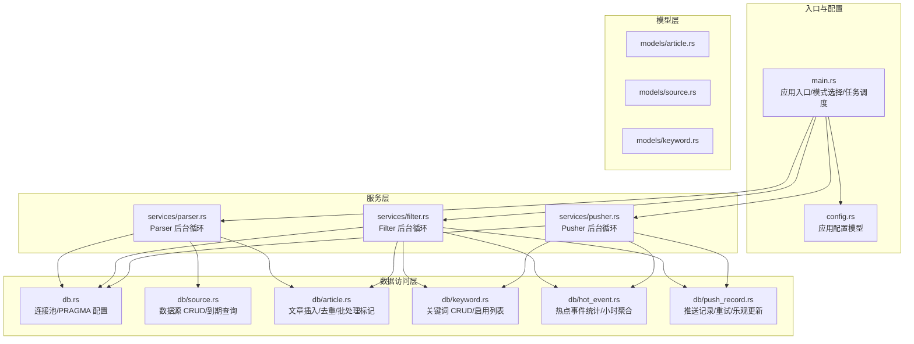
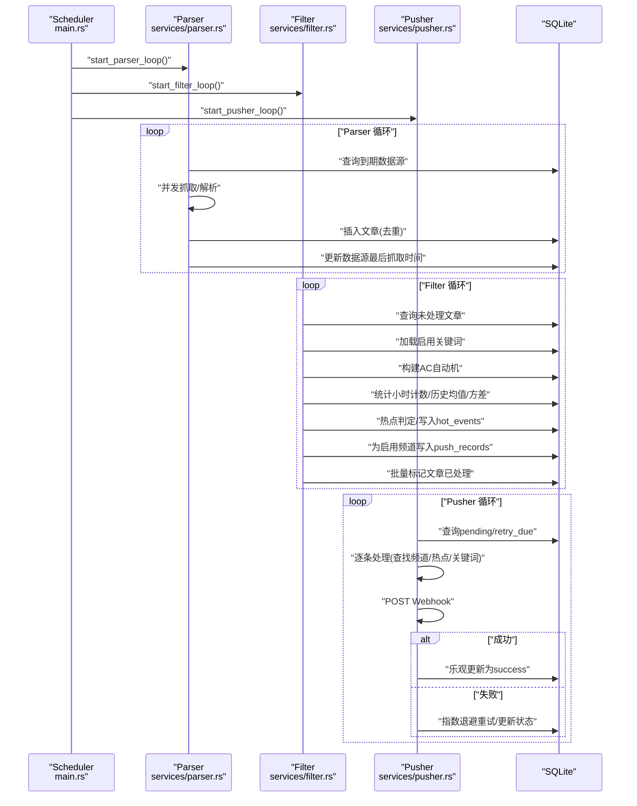
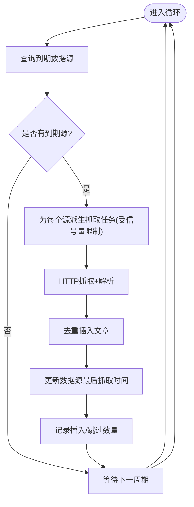
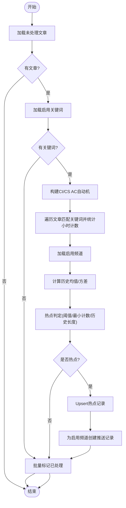
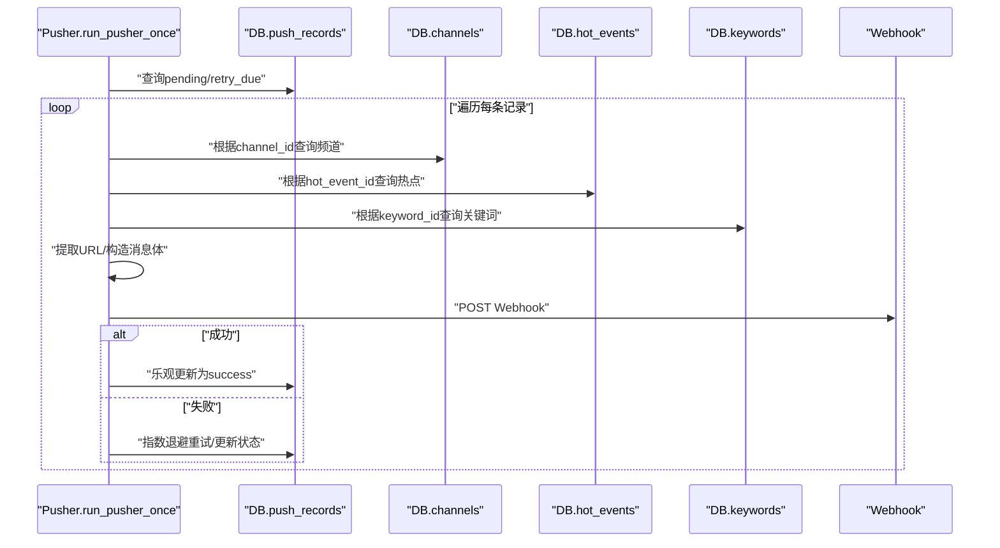
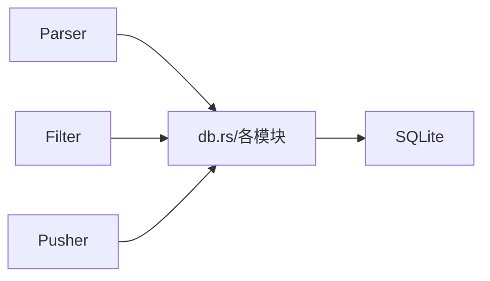

# 模块设计

<cite>
**本文引用的文件**
- [src/main.rs](file://src/main.rs)
- [src/config.rs](file://src/config.rs)
- [src/services.rs](file://src/services.rs)
- [src/services/parser.rs](file://src/services/parser.rs)
- [src/services/filter.rs](file://src/services/filter.rs)
- [src/services/pusher.rs](file://src/services/pusher.rs)
- [src/db.rs](file://src/db.rs)
- [src/db/source.rs](file://src/db/source.rs)
- [src/db/article.rs](file://src/db/article.rs)
- [src/db/keyword.rs](file://src/db/keyword.rs)
- [src/db/hot_event.rs](file://src/db/hot_event.rs)
- [src/db/push_record.rs](file://src/db/push_record.rs)
- [src/models/article.rs](file://src/models/article.rs)
- [src/models/source.rs](file://src/models/source.rs)
- [src/models/keyword.rs](file://src/models/keyword.rs)
</cite>

## 目录
1. [简介](#简介)
2. [项目结构](#项目结构)
3. [核心组件](#核心组件)
4. [架构总览](#架构总览)
5. [详细组件分析](#详细组件分析)
6. [依赖分析](#依赖分析)
7. [性能考虑](#性能考虑)
8. [故障排查指南](#故障排查指南)
9. [结论](#结论)
10. [附录](#附录)

## 简介
本文件面向“AI趋势监控系统”的后台模块，围绕 Parser（采集与解析）、Filter（关键词匹配与热点检测）、Pusher（实时推送）三大模块进行模块级设计说明。文档从职责边界、内部结构、数据处理流程、模块间交互、生命周期与错误处理、性能优化与资源管理等维度展开，并给出启动顺序、状态管理与可扩展性建议。

## 项目结构
系统采用分层与按功能域划分的组织方式：
- 入口与配置：main 负责 CLI 解析、初始化数据库、迁移、API 服务与后台任务调度；config 提供应用配置模型。
- 服务层：services 下的 parser、filter、pusher 实现后台循环任务与业务逻辑。
- 数据访问层：db 子模块封装各实体的 CRUD 与聚合查询。
- 模型层：models 定义数据库实体与 API 请求/响应结构。
- 路由与处理器：routes 与 handlers 提供 REST API，支持手动触发 Parser/Filter/Pusher 的一次性执行。

图表来源
- [src/main.rs:86-160](file://src/main.rs#L86-L160)
- [src/config.rs:1-58](file://src/config.rs#L1-L58)
- [src/services.rs:1-4](file://src/services.rs#L1-L4)
- [src/services/parser.rs:94-184](file://src/services/parser.rs#L94-L184)
- [src/services/filter.rs:269-277](file://src/services/filter.rs#L269-L277)
- [src/services/pusher.rs:251-259](file://src/services/pusher.rs#L251-L259)
- [src/db.rs:10-27](file://src/db.rs#L10-L27)
- [src/db/source.rs:119-132](file://src/db/source.rs#L119-L132)
- [src/db/article.rs:6-29](file://src/db/article.rs#L6-L29)
- [src/db/keyword.rs:27-31](file://src/db/keyword.rs#L27-L31)
- [src/db/hot_event.rs:105-123](file://src/db/hot_event.rs#L105-L123)
- [src/db/push_record.rs:45-63](file://src/db/push_record.rs#L45-L63)

章节来源
- [src/main.rs:64-164](file://src/main.rs#L64-L164)
- [src/config.rs:1-58](file://src/config.rs#L1-L58)
- [src/services.rs:1-4](file://src/services.rs#L1-L4)

## 核心组件
- Parser 模块
  - 职责：定时拉取 RSS/Atom 源，解析为统一结构，去重入库，维护数据源最后抓取时间。
  - 关键点：并发抓取限流、失败回退、日志与指标。
- Filter 模块
  - 职责：加载未处理文章，构建关键词 AC 自动机，统计小时计数，计算历史均值与方差，触发热点检测，生成推送记录，标记文章已处理。
  - 关键点：批量处理、Aho-Corasick 双模式（大小写敏感/不敏感）、热点阈值与最小计数。
- Pusher 模块
  - 职责：轮询待推送与可重试记录，调用外部 Webhook，基于指数退避重试，乐观锁更新状态。
  - 关键点：重试上限、下一次重试时间、乐观锁避免竞态。

章节来源
- [src/services/parser.rs:94-184](file://src/services/parser.rs#L94-L184)
- [src/services/filter.rs:13-208](file://src/services/filter.rs#L13-L208)
- [src/services/pusher.rs:11-202](file://src/services/pusher.rs#L11-L202)

## 架构总览
三模块通过共享的 SQLite 连接池与统一的数据库表进行数据交换，形成“采集—过滤—推送”的流水线。Parser 写入文章，Filter 读取文章并产出热点与推送记录，Pusher 读取推送记录并对外发送。

图表来源
- [src/main.rs:87-110](file://src/main.rs#L87-L110)
- [src/services/parser.rs:94-184](file://src/services/parser.rs#L94-L184)
- [src/services/filter.rs:13-208](file://src/services/filter.rs#L13-L208)
- [src/services/pusher.rs:11-202](file://src/services/pusher.rs#L11-L202)

## 详细组件分析

### Parser 模块
- 设计理念
  - 基于 trait 的可扩展解析器接口，当前实现为 RSS/Atom 解析器。
  - 使用信号量限制并发抓取，避免对上游源造成压力。
  - 抓取后进行去重插入，失败也更新最后抓取时间以避免立即重试。
- 内部结构
  - 结构体与 trait：Parser、RssParser、ParsedArticle。
  - 后台循环：start_parser_loop，周期性查询到期数据源并并发抓取。
- 数据处理流程
  - 查询到期数据源 → 并发抓取 → 解析为 ParsedArticle → 批量去重插入 → 更新数据源最后抓取时间。
- 与其他模块交互
  - 读取数据源信息（db/source），写入文章（db/article）。
- 生命周期与错误处理
  - 失败时记录错误并更新 last_fetched，保证不会在短期内重复尝试。
- 性能与资源
  - 并发抓取上限由配置控制；请求超时与 UA 可配置；使用轻量解析库减少 CPU 开销。

图表来源
- [src/services/parser.rs:94-184](file://src/services/parser.rs#L94-L184)
- [src/db/source.rs:119-132](file://src/db/source.rs#L119-L132)
- [src/db/article.rs:6-29](file://src/db/article.rs#L6-L29)

章节来源
- [src/services/parser.rs:11-88](file://src/services/parser.rs#L11-L88)
- [src/services/parser.rs:94-184](file://src/services/parser.rs#L94-L184)
- [src/db/source.rs:119-132](file://src/db/source.rs#L119-L132)
- [src/db/article.rs:6-29](file://src/db/article.rs#L6-L29)

### Filter 模块
- 设计理念
  - 小批量处理，降低内存占用；双 AC 自动机分别处理大小写敏感/不敏感关键词。
  - 基于历史小时计数的统计方法进行突发检测，结合阈值与最小计数。
- 内部结构
  - run_filter_once：单次迭代主流程；start_filter_loop：定时循环。
  - 统计函数：compute_historical_stats；热点记录：upsert_hot_event_record。
- 数据处理流程
  - 加载未处理文章 → 加载启用关键词 → 构建 AC 自动机 → 统计小时计数 → 计算历史均值/方差 → 热点判定 → 生成推送记录 → 标记文章已处理。
- 与其他模块交互
  - 读取文章（db/article）、关键词（db/keyword）、历史热点（db/hot_event）；写入关键词提及（db/keyword_mention）与推送记录（db/push_record）。
- 生命周期与错误处理
  - 单次失败不影响后续批次；无关键词时直接标记文章已处理；历史统计异常时返回零统计并继续。
- 性能与资源
  - 批量处理与分块更新；AC 自动机提升多关键词匹配效率；小时聚合减少重复计算。

图表来源
- [src/services/filter.rs:13-208](file://src/services/filter.rs#L13-L208)
- [src/db/article.rs:104-114](file://src/db/article.rs#L104-L114)
- [src/db/keyword.rs:27-31](file://src/db/keyword.rs#L27-L31)
- [src/db/hot_event.rs:105-123](file://src/db/hot_event.rs#L105-L123)
- [src/db/push_record.rs:20-43](file://src/db/push_record.rs#L20-L43)

章节来源
- [src/services/filter.rs:9-208](file://src/services/filter.rs#L9-L208)
- [src/db/article.rs:104-140](file://src/db/article.rs#L104-L140)
- [src/db/keyword.rs:27-31](file://src/db/keyword.rs#L27-L31)
- [src/db/hot_event.rs:105-123](file://src/db/hot_event.rs#L105-L123)
- [src/db/push_record.rs:20-43](file://src/db/push_record.rs#L20-L43)

### Pusher 模块
- 设计理念
  - 优先处理 pending，再处理 retry_due；失败后按指数退避重试，达到上限后放弃。
  - 使用乐观锁更新状态，避免并发更新冲突。
- 内部结构
  - run_pusher_once：单次迭代；start_pusher_loop：定时循环；process_one：单条记录处理；mark_failed：失败重试策略。
- 数据处理流程
  - 查询待推送与可重试记录 → 逐条查找频道/热点/关键词 → 提取 Webhook URL → 构造消息体 → 发送 HTTP 请求 → 成功则乐观更新为 success，失败则指数退避重试。
- 与其他模块交互
  - 读取推送记录（db/push_record）、热点事件（db/hot_event）、关键词（db/keyword）、频道（db/channel）；写入推送记录状态。
- 生命周期与错误处理
  - 缺失必要字段或网络错误均计入失败并重试；达到最大重试次数后停止重试。
- 性能与资源
  - 单条处理串行化，避免对下游 Webhook 造成过大压力；使用轻量 HTTP 客户端。

图表来源
- [src/services/pusher.rs:11-202](file://src/services/pusher.rs#L11-L202)
- [src/db/push_record.rs:45-63](file://src/db/push_record.rs#L45-L63)
- [src/db/push_record.rs:87-109](file://src/db/push_record.rs#L87-L109)
- [src/db/hot_event.rs:50-58](file://src/db/hot_event.rs#L50-L58)
- [src/db/keyword.rs:33-38](file://src/db/keyword.rs#L33-L38)

章节来源
- [src/services/pusher.rs:7-202](file://src/services/pusher.rs#L7-L202)
- [src/db/push_record.rs:45-109](file://src/db/push_record.rs#L45-L109)
- [src/db/hot_event.rs:50-58](file://src/db/hot_event.rs#L50-L58)
- [src/db/keyword.rs:33-38](file://src/db/keyword.rs#L33-L38)

## 依赖分析
- 模块内聚与耦合
  - Parser/Filter/Pusher 各自职责清晰，内部通过 db 层访问数据库，彼此无直接调用，耦合度低。
- 外部依赖
  - HTTP 客户端、RSS 解析库、SQLite 连接池、日志框架、JSON 序列化。
- 接口契约
  - 三模块均通过统一的 SqlitePool 访问数据库，遵循相同的 PRAGMA 设置（WAL、外键）。
- 数据一致性
  - 乐观锁用于推送状态更新；热点记录 Upsert 保证幂等；文章插入使用 ON CONFLICT(link) DO NOTHING 去重。

图表来源
- [src/db.rs:10-27](file://src/db.rs#L10-L27)
- [src/services/parser.rs:94-184](file://src/services/parser.rs#L94-L184)
- [src/services/filter.rs:13-208](file://src/services/filter.rs#L13-L208)
- [src/services/pusher.rs:11-202](file://src/services/pusher.rs#L11-L202)

章节来源
- [src/db.rs:10-27](file://src/db.rs#L10-L27)

## 性能考虑
- 并发与限流
  - Parser 使用信号量限制并发抓取；Filter 批量处理与分块更新；Pusher 单条串行处理。
- I/O 与解析
  - RSS 解析与 HTTP 请求均设置超时；Parser 使用统一 UA；Pusher 使用轻量客户端。
- 数据库优化
  - WAL 模式提升并发写入；外键开启保障一致性；文章插入去重避免重复索引。
- 统计与算法
  - AC 自动机加速多关键词匹配；小时聚合减少重复统计；历史均值/方差按需计算。

[本节为通用指导，无需具体文件引用]

## 故障排查指南
- Parser
  - 症状：抓取失败、未更新 last_fetched。
  - 排查：检查上游源可达性、UA/超时配置；确认日志中的错误信息；验证数据源启用状态与间隔。
- Filter
  - 症状：无热点、关键词未命中、历史统计异常。
  - 排查：确认关键词启用状态与大小写设置；检查文章是否已标记已处理；查看历史小时聚合数据。
- Pusher
  - 症状：推送失败、重试过多、状态未更新。
  - 排查：检查频道配置 JSON 是否包含有效 URL；确认网络连通性；查看乐观锁冲突日志；核对最大重试次数。

章节来源
- [src/services/parser.rs:101-181](file://src/services/parser.rs#L101-L181)
- [src/services/filter.rs:18-207](file://src/services/filter.rs#L18-L207)
- [src/services/pusher.rs:15-242](file://src/services/pusher.rs#L15-L242)

## 结论
本系统通过 Parser、Filter、Pusher 三个后台模块实现了“采集—过滤—推送”的完整链路。模块边界清晰、解耦良好，具备良好的可扩展性与可维护性。通过合理的并发控制、批处理与统计方法，系统在资源有限的情况下仍能稳定运行并及时响应热点事件。

## 附录
- 启动顺序与模式
  - 支持 all/api、parser、filter、pusher 四种模式；all 模式同时启动三类后台任务并启动 API 服务器。
- 配置项
  - Parser：最大并发抓取、默认 UA、默认超时秒。
  - Filter：批大小、循环间隔、历史小时、最小历史小时。
  - Pusher：循环间隔、最大重试次数、基础重试秒。
- 数据模型要点
  - 文章：去重依据链接；处理状态用于过滤未处理文章。
  - 关键词：大小写敏感、标准差倍数、最小热点计数。
  - 热点事件：按小时桶聚合，保存历史均值与方差。
  - 推送记录：状态、重试次数、下次重试时间。

章节来源
- [src/main.rs:87-160](file://src/main.rs#L87-L160)
- [src/config.rs:29-49](file://src/config.rs#L29-L49)
- [src/models/article.rs:5-16](file://src/models/article.rs#L5-L16)
- [src/models/keyword.rs:5-14](file://src/models/keyword.rs#L5-L14)
- [src/db/article.rs:6-29](file://src/db/article.rs#L6-L29)
- [src/db/keyword.rs:27-31](file://src/db/keyword.rs#L27-L31)
- [src/db/hot_event.rs:105-123](file://src/db/hot_event.rs#L105-L123)
- [src/db/push_record.rs:45-63](file://src/db/push_record.rs#L45-L63)