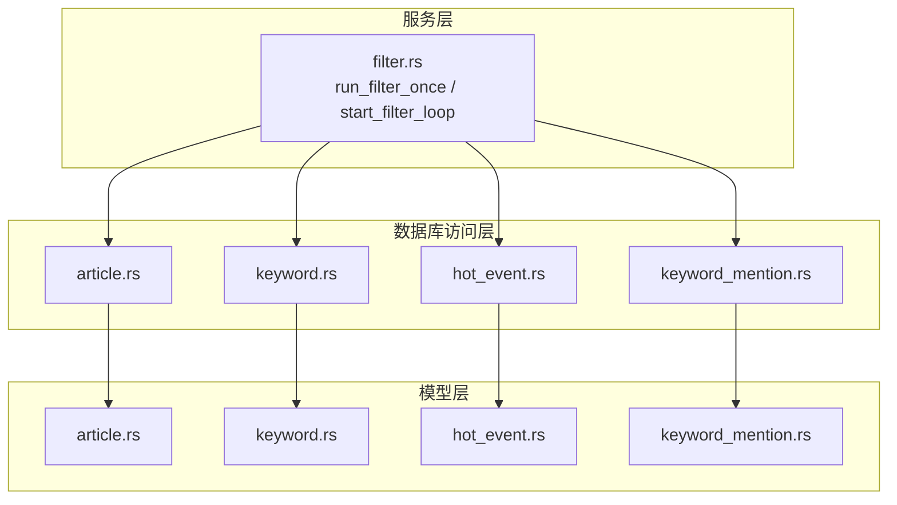
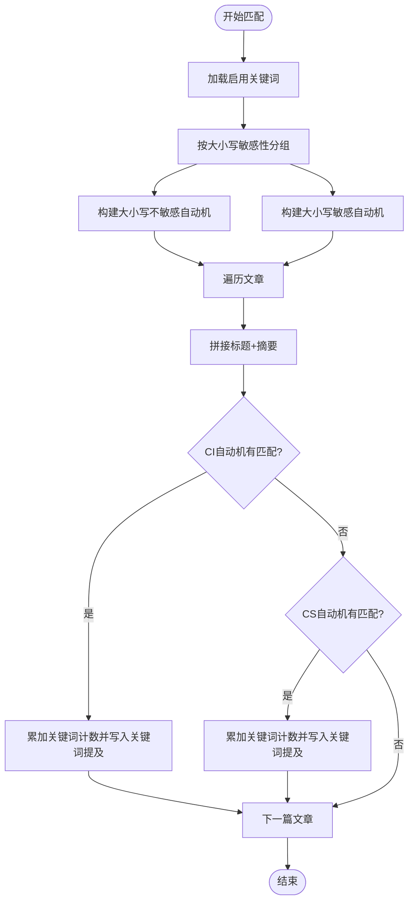
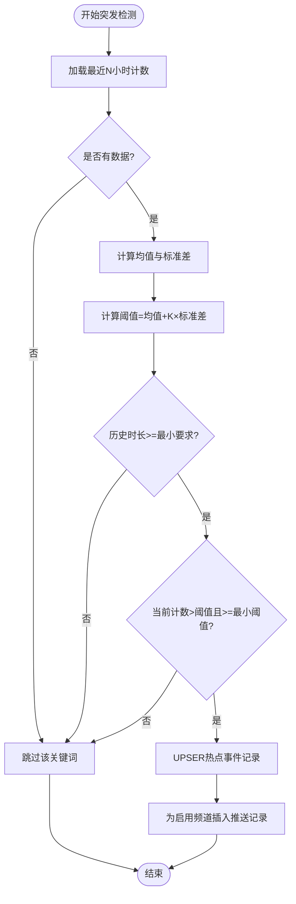
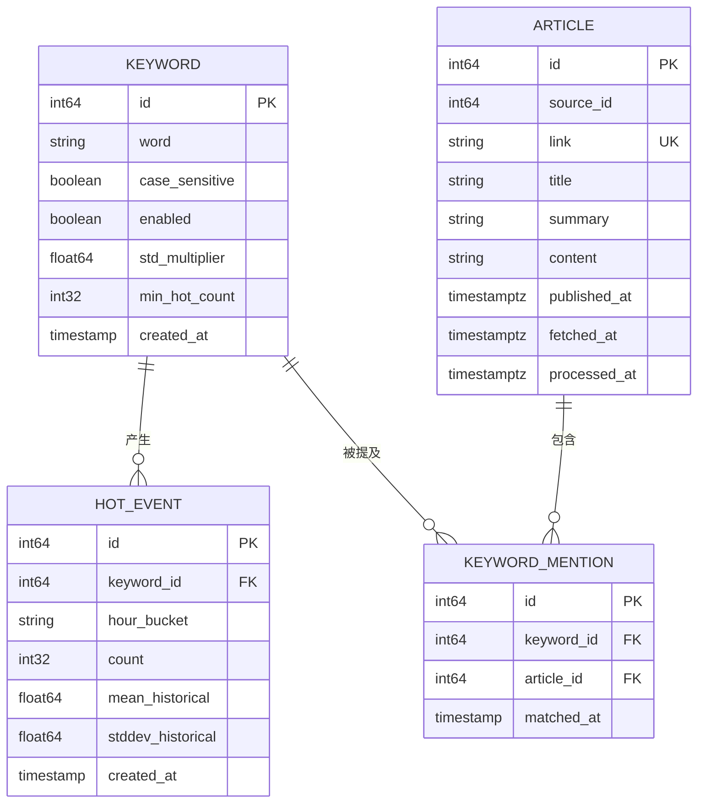
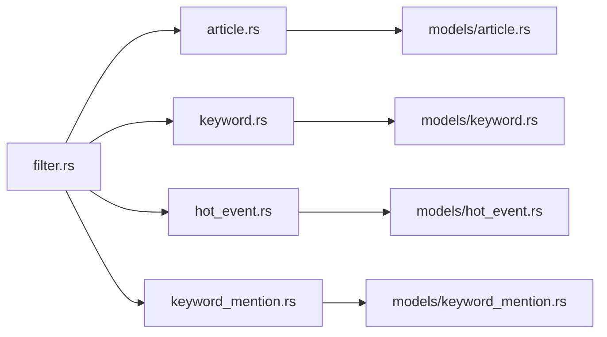

# 热点检测模块（Filter）

<cite>
**本文引用的文件**
- [src/services/filter.rs](file://src/services/filter.rs)
- [src/db/hot_event.rs](file://src/db/hot_event.rs)
- [src/models/hot_event.rs](file://src/models/hot_event.rs)
- [src/db/keyword.rs](file://src/db/keyword.rs)
- [src/models/keyword.rs](file://src/models/keyword.rs)
- [src/db/keyword_mention.rs](file://src/db/keyword_mention.rs)
- [src/models/keyword_mention.rs](file://src/models/keyword_mention.rs)
- [src/db/article.rs](file://src/db/article.rs)
- [src/models/article.rs](file://src/models/article.rs)
- [src/config.rs](file://src/config.rs)
</cite>

## 目录
1. [简介](#简介)
2. [项目结构](#项目结构)
3. [核心组件](#核心组件)
4. [架构总览](#架构总览)
5. [详细组件分析](#详细组件分析)
6. [依赖分析](#依赖分析)
7. [性能考量](#性能考量)
8. [故障排查指南](#故障排查指南)
9. [结论](#结论)
10. [附录](#附录)

## 简介
本文件为“热点检测模块（Filter）”的全面技术文档，聚焦于以下目标：
- 深入解析Filter模块的核心算法：AI关键词匹配、统计分析与突发事件检测
- 详解Aho-Corasick算法在本模块中的实现、关键词索引构建与多模式匹配机制
- 解释热点事件的计算逻辑、时间窗口分析与阈值判断算法
- 阐述Keyword、HotEvent、KeywordMention模型之间的关系与数据流转
- 说明关键词权重计算、事件评分机制与结果排序策略
- 提供具体代码示例路径，展示关键词匹配过程、事件检测算法与数据库查询优化
- 解释模块的实时处理能力与批处理模式的性能考量

## 项目结构
Filter模块位于后端服务层，围绕数据库访问层与模型层协作完成：
- 服务层：负责加载未处理文章、构建关键词自动机、执行多模式匹配、统计与突发检测、写入热点记录与推送记录，并标记文章已处理
- 数据库访问层：封装对文章、关键词、热点事件、关键词提及等表的增删查操作
- 模型层：定义各实体的数据结构与序列化特性
- 配置层：提供Filter运行参数（批大小、轮询间隔、历史窗口等）



**图表来源**
- [src/services/filter.rs:1-277](file://src/services/filter.rs#L1-L277)
- [src/db/article.rs:1-162](file://src/db/article.rs#L1-L162)
- [src/db/keyword.rs:1-108](file://src/db/keyword.rs#L1-L108)
- [src/db/hot_event.rs:1-124](file://src/db/hot_event.rs#L1-L124)
- [src/db/keyword_mention.rs:1-17](file://src/db/keyword_mention.rs#L1-L17)
- [src/models/article.rs:1-25](file://src/models/article.rs#L1-L25)
- [src/models/keyword.rs:1-32](file://src/models/keyword.rs#L1-L32)
- [src/models/hot_event.rs:1-15](file://src/models/hot_event.rs#L1-L15)
- [src/models/keyword_mention.rs:1-12](file://src/models/keyword_mention.rs#L1-L12)

**章节来源**
- [src/services/filter.rs:1-277](file://src/services/filter.rs#L1-L277)
- [src/db/article.rs:1-162](file://src/db/article.rs#L1-L162)
- [src/db/keyword.rs:1-108](file://src/db/keyword.rs#L1-L108)
- [src/db/hot_event.rs:1-124](file://src/db/hot_event.rs#L1-L124)
- [src/db/keyword_mention.rs:1-17](file://src/db/keyword_mention.rs#L1-L17)
- [src/models/article.rs:1-25](file://src/models/article.rs#L1-L25)
- [src/models/keyword.rs:1-32](file://src/models/keyword.rs#L1-L32)
- [src/models/hot_event.rs:1-15](file://src/models/hot_event.rs#L1-L15)
- [src/models/keyword_mention.rs:1-12](file://src/models/keyword_mention.rs#L1-L12)

## 核心组件
- 过滤器主流程：run_filter_once
  - 加载未处理文章
  - 加载启用的关键词
  - 构建大小写敏感/不敏感两套Aho-Corasick自动机
  - 对每篇文章进行多模式匹配，累计关键词在当前小时的出现次数
  - 计算历史均值与标准差，进行突发检测，生成热点事件记录并触发推送
  - 批量标记文章为已处理
- 历史统计与突发检测：compute_historical_stats、upsert_hot_event_record
  - 从热点事件表按关键字聚合最近N小时的计数，计算均值与标准差
  - 使用阈值=均值+标准差×倍数，结合最小阈值，判定是否为热点
- 自动机与多模式匹配：AhoCorasickBuilder
  - 将关键词分为大小写敏感与不敏感两类，分别构建自动机
  - 在文章标题与摘要上执行匹配，记录命中并写入关键词提及表
- 实时循环：start_filter_loop
  - 基于配置的轮询间隔周期性调用run_filter_once

**章节来源**
- [src/services/filter.rs:9-208](file://src/services/filter.rs#L9-L208)
- [src/services/filter.rs:210-240](file://src/services/filter.rs#L210-L240)
- [src/services/filter.rs:242-267](file://src/services/filter.rs#L242-L267)
- [src/services/filter.rs:269-277](file://src/services/filter.rs#L269-L277)

## 架构总览
Filter模块的处理链路如下：
- 输入：未处理的文章集合
- 处理：关键词自动机构建与匹配、统计分析、突发检测
- 输出：热点事件记录、关键词提及记录、推送记录；文章标记为已处理

```mermaid
sequenceDiagram
participant Loop as "过滤循环"
participant Service as "run_filter_once"
participant DB_Art as "文章DB"
participant DB_KW as "关键词DB"
participant AC as "Aho-Corasick"
participant DB_Mention as "关键词提及DB"
participant DB_Stats as "热点事件DB"
participant DB_Push as "推送记录DB"
Loop->>Service : 触发一次过滤
Service->>DB_Art : 查询未处理文章
DB_Art-->>Service : 文章列表
Service->>DB_KW : 查询启用关键词
DB_KW-->>Service : 关键词列表
Service->>AC : 构建CI/CS自动机
loop 遍历文章
Service->>AC : 在标题+摘要中匹配
AC-->>Service : 命中关键词ID
Service->>DB_Mention : 插入关键词提及
end
Service->>DB_Stats : 计算历史统计并UPSER
Service->>Service : 阈值判断均值+K*标准差
alt 是热点
Service->>DB_Push : 为每个启用频道插入推送记录
end
Service->>DB_Art : 批量标记文章已处理
```

**图表来源**
- [src/services/filter.rs:13-208](file://src/services/filter.rs#L13-L208)
- [src/db/article.rs:104-140](file://src/db/article.rs#L104-L140)
- [src/db/keyword.rs:27-31](file://src/db/keyword.rs#L27-L31)
- [src/db/keyword_mention.rs:5-16](file://src/db/keyword_mention.rs#L5-L16)
- [src/db/hot_event.rs:105-123](file://src/db/hot_event.rs#L105-L123)
- [src/db/push_record.rs:1-200](file://src/db/push_record.rs#L1-L200)

**章节来源**
- [src/services/filter.rs:13-208](file://src/services/filter.rs#L13-L208)

## 详细组件分析

### Aho-Corasick自动机构建与多模式匹配
- 关键词分组：根据case_sensitive字段将关键词分为大小写敏感与不敏感两组
- 自动机构建：使用AhoCorasickBuilder分别构建CI/CS自动机
- 匹配策略：对每篇文章的标题与摘要拼接后的文本执行find_iter，遍历所有匹配位置
- 命中处理：通过匹配模式索引定位原始关键词，累加当前小时计数并插入关键词提及记录
- 性能要点：将关键词转换为小写用于CI自动机，避免重复转换；匹配完成后统一批量写入关键词提及



**图表来源**
- [src/services/filter.rs:48-129](file://src/services/filter.rs#L48-L129)

**章节来源**
- [src/services/filter.rs:48-129](file://src/services/filter.rs#L48-L129)

### 统计分析与突发检测
- 历史统计：从热点事件表按关键字与小时桶聚合最近N小时的计数，计算均值与标准差
- 突发检测：仅当满足“历史时长足够”“当前计数超过阈值”“不低于最小阈值”三个条件时，判定为热点
- 阈值公式：threshold = mean + std_multiplier × stddev
- 结果持久化：先删除同关键字+小时桶的旧记录，再插入新记录，保证幂等



**图表来源**
- [src/services/filter.rs:131-202](file://src/services/filter.rs#L131-L202)
- [src/services/filter.rs:210-240](file://src/services/filter.rs#L210-L240)
- [src/services/filter.rs:242-267](file://src/services/filter.rs#L242-L267)
- [src/db/hot_event.rs:105-123](file://src/db/hot_event.rs#L105-L123)

**章节来源**
- [src/services/filter.rs:131-202](file://src/services/filter.rs#L131-L202)
- [src/services/filter.rs:210-240](file://src/services/filter.rs#L210-L240)
- [src/services/filter.rs:242-267](file://src/services/filter.rs#L242-L267)
- [src/db/hot_event.rs:105-123](file://src/db/hot_event.rs#L105-L123)

### 数据模型与关系
- Keyword：关键词实体，包含word、大小写敏感标志、启用状态、标准差倍数、最小热点计数等
- HotEvent：热点事件实体，记录关键字、小时桶、计数、历史均值与标准差
- KeywordMention：关键词提及实体，记录关键词与文章的关联
- Article：文章实体，包含来源、链接、标题、摘要、内容、发布时间与处理状态



**图表来源**
- [src/models/keyword.rs:5-14](file://src/models/keyword.rs#L5-L14)
- [src/models/article.rs:5-16](file://src/models/article.rs#L5-L16)
- [src/models/hot_event.rs:5-14](file://src/models/hot_event.rs#L5-L14)
- [src/models/keyword_mention.rs:5-11](file://src/models/keyword_mention.rs#L5-L11)

**章节来源**
- [src/models/keyword.rs:1-32](file://src/models/keyword.rs#L1-L32)
- [src/models/article.rs:1-25](file://src/models/article.rs#L1-L25)
- [src/models/hot_event.rs:1-15](file://src/models/hot_event.rs#L1-L15)
- [src/models/keyword_mention.rs:1-12](file://src/models/keyword_mention.rs#L1-L12)

### 关键词权重与事件评分
- 权重来源：关键词实体包含std_multiplier与min_hot_count两个参数，分别控制阈值灵敏度与最低门槛
- 评分机制：当前小时计数作为基础评分；若满足阈值与历史要求，则判定为热点事件
- 排序策略：热点事件查询支持按创建时间倒序；可按关键字过滤以实现分组排序

**章节来源**
- [src/models/keyword.rs:11-12](file://src/models/keyword.rs#L11-L12)
- [src/db/hot_event.rs:61-84](file://src/db/hot_event.rs#L61-L84)

### 代码示例路径（不含代码内容）
- 关键词匹配与多模式匹配
  - [构建自动机与匹配流程:48-129](file://src/services/filter.rs#L48-L129)
- 突发检测与阈值判断
  - [历史统计与UPSER热点事件:131-202](file://src/services/filter.rs#L131-L202)
  - [统计函数实现:210-240](file://src/services/filter.rs#L210-L240)
  - [UPSER热点事件记录:242-267](file://src/services/filter.rs#L242-L267)
- 数据库查询优化
  - [批量更新文章处理状态:124-140](file://src/db/article.rs#L124-L140)
  - [按小时桶聚合历史计数:105-123](file://src/db/hot_event.rs#L105-L123)
  - [关键词提及去重插入:5-16](file://src/db/keyword_mention.rs#L5-L16)

**章节来源**
- [src/services/filter.rs:48-202](file://src/services/filter.rs#L48-L202)
- [src/db/article.rs:124-140](file://src/db/article.rs#L124-L140)
- [src/db/hot_event.rs:105-123](file://src/db/hot_event.rs#L105-L123)
- [src/db/keyword_mention.rs:5-16](file://src/db/keyword_mention.rs#L5-L16)

## 依赖分析
- 服务层依赖数据库访问层与模型层，形成清晰的分层
- 关键词与文章的查询接口由数据库访问层提供，服务层仅负责编排
- 突发检测依赖热点事件表的历史计数，形成闭环



**图表来源**
- [src/services/filter.rs:1-277](file://src/services/filter.rs#L1-L277)
- [src/db/article.rs:1-162](file://src/db/article.rs#L1-L162)
- [src/db/keyword.rs:1-108](file://src/db/keyword.rs#L1-L108)
- [src/db/hot_event.rs:1-124](file://src/db/hot_event.rs#L1-L124)
- [src/db/keyword_mention.rs:1-17](file://src/db/keyword_mention.rs#L1-L17)
- [src/models/article.rs:1-25](file://src/models/article.rs#L1-L25)
- [src/models/keyword.rs:1-32](file://src/models/keyword.rs#L1-L32)
- [src/models/hot_event.rs:1-15](file://src/models/hot_event.rs#L1-L15)
- [src/models/keyword_mention.rs:1-12](file://src/models/keyword_mention.rs#L1-L12)

**章节来源**
- [src/services/filter.rs:1-277](file://src/services/filter.rs#L1-L277)
- [src/db/article.rs:1-162](file://src/db/article.rs#L1-L162)
- [src/db/keyword.rs:1-108](file://src/db/keyword.rs#L1-L108)
- [src/db/hot_event.rs:1-124](file://src/db/hot_event.rs#L1-L124)
- [src/db/keyword_mention.rs:1-17](file://src/db/keyword_mention.rs#L1-L17)

## 性能考量
- 批处理与批量更新
  - 文章处理状态采用分块批量更新，避免SQLite参数上限问题
  - 关键词提及采用“插入忽略重复”，减少冲突开销
- 自动机匹配效率
  - 将关键词按大小写敏感性拆分，分别构建自动机，降低匹配复杂度
  - 文本预处理仅做拼接，避免额外字符串转换
- 统计与查询
  - 历史统计直接基于小时桶聚合，避免复杂窗口计算
  - 热点事件UPSER通过删除后再插入的方式保证幂等，减少并发冲突
- 实时性
  - 支持后台循环与手动触发两种方式；循环间隔可配置，兼顾吞吐与延迟

**章节来源**
- [src/db/article.rs:124-140](file://src/db/article.rs#L124-L140)
- [src/db/keyword_mention.rs:5-16](file://src/db/keyword_mention.rs#L5-L16)
- [src/services/filter.rs:48-83](file://src/services/filter.rs#L48-L83)
- [src/services/filter.rs:242-267](file://src/services/filter.rs#L242-L267)
- [src/config.rs:36-42](file://src/config.rs#L36-L42)

## 故障排查指南
- 关键词匹配失败
  - 检查关键词是否启用；确认大小写敏感设置是否符合预期
  - 查看自动机构建日志与匹配错误信息
- 突发检测未触发
  - 确认历史时长是否达到最小要求；检查均值与标准差计算是否返回有效值
  - 调整std_multiplier与min_hot_count参数
- 数据持久化异常
  - 关键词提及插入失败通常为重复键；检查去重逻辑
  - 热点事件UPSER失败时，检查小时桶唯一性与并发写入情况
- 文章处理状态未更新
  - 检查批量更新分块逻辑与SQL变量数量限制

**章节来源**
- [src/services/filter.rs:18-46](file://src/services/filter.rs#L18-L46)
- [src/services/filter.rs:132-202](file://src/services/filter.rs#L132-L202)
- [src/db/keyword_mention.rs:5-16](file://src/db/keyword_mention.rs#L5-L16)
- [src/db/article.rs:124-140](file://src/db/article.rs#L124-L140)

## 结论
Filter模块通过Aho-Corasick多模式匹配与基于历史统计的突发检测，实现了对关键词热度的高效识别与响应。其设计强调：
- 可靠性：幂等的热点事件记录与批量更新机制
- 可扩展性：参数化的阈值与历史窗口，便于调优
- 可维护性：清晰的服务-数据库-模型分层与明确的职责边界

## 附录
- 配置项说明
  - batch_size：单次处理的文章数量
  - interval_seconds：后台循环间隔
  - history_hours：统计历史窗口（小时）
  - min_history_hours：触发检测所需的最少历史小时数

**章节来源**
- [src/config.rs:36-42](file://src/config.rs#L36-L42)