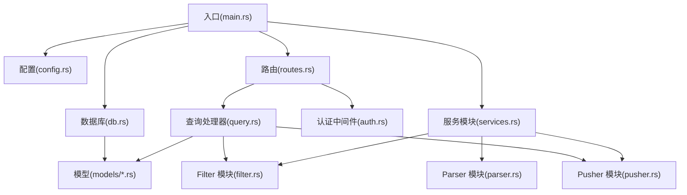
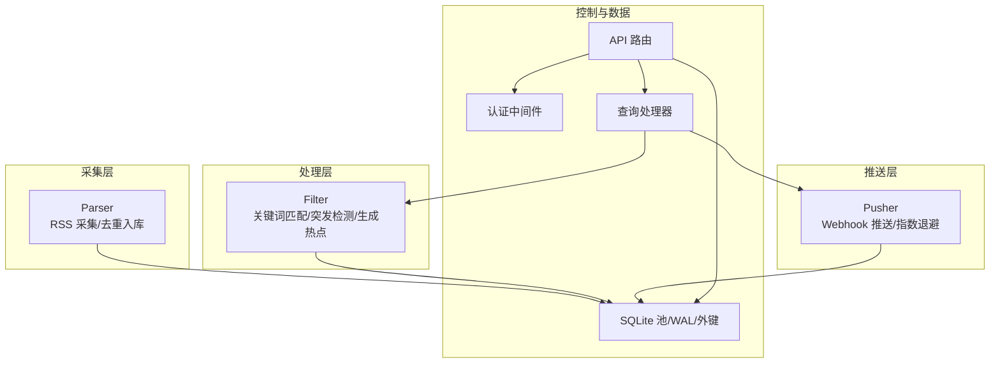
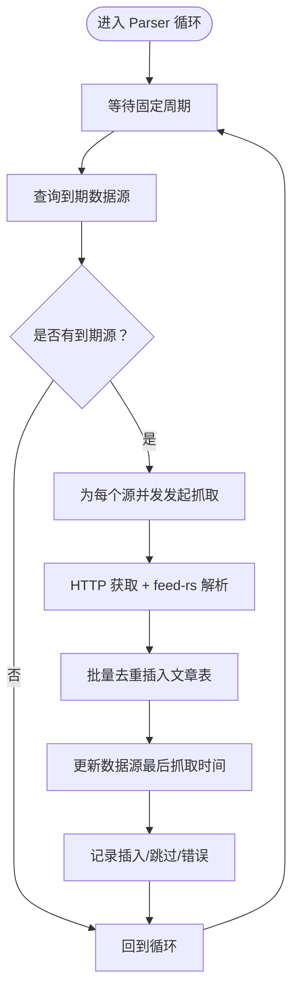
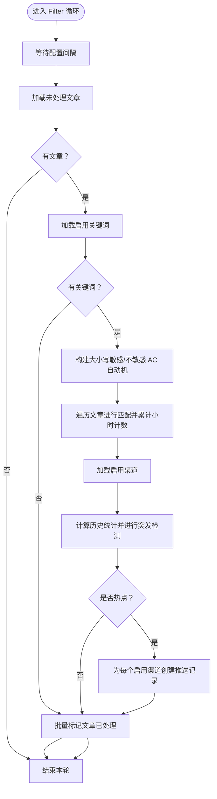
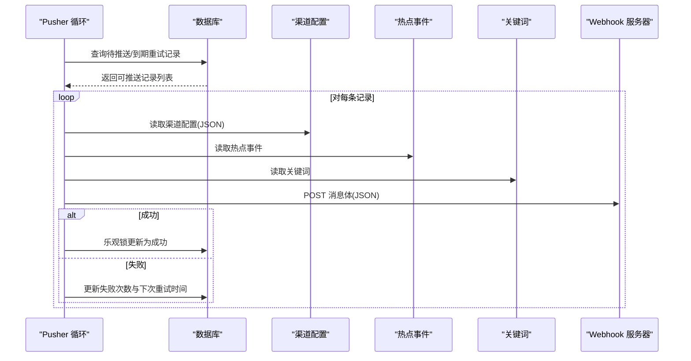
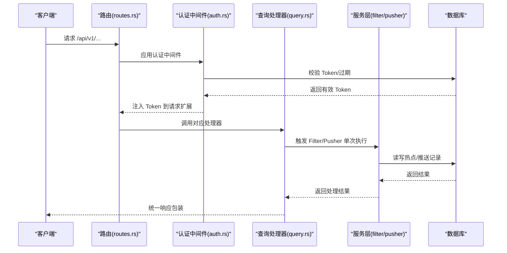
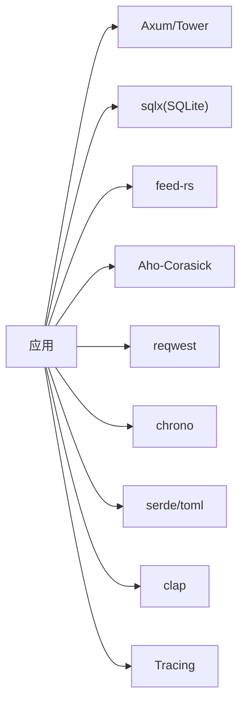
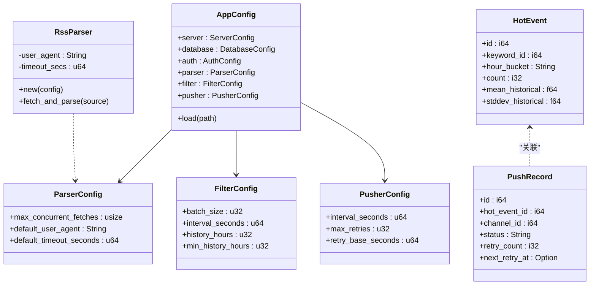

# 系统架构设计

<cite>
**本文引用的文件**
- [README.md](file://README.md)
- [Cargo.toml](file://Cargo.toml)
- [Dockerfile](file://Dockerfile)
- [src/main.rs](file://src/main.rs)
- [src/config.rs](file://src/config.rs)
- [src/db.rs](file://src/db.rs)
- [src/routes.rs](file://src/routes.rs)
- [src/services.rs](file://src/services.rs)
- [src/services/parser.rs](file://src/services/parser.rs)
- [src/services/filter.rs](file://src/services/filter.rs)
- [src/services/pusher.rs](file://src/services/pusher.rs)
- [src/models/article.rs](file://src/models/article.rs)
- [src/models/hot_event.rs](file://src/models/hot_event.rs)
- [src/models/push_record.rs](file://src/models/push_record.rs)
- [src/handlers/query.rs](file://src/handlers/query.rs)
- [src/middleware/auth.rs](file://src/middleware/auth.rs)
</cite>

## 目录
1. [引言](#引言)
2. [项目结构](#项目结构)
3. [核心组件](#核心组件)
4. [架构总览](#架构总览)
5. [详细组件分析](#详细组件分析)
6. [依赖分析](#依赖分析)
7. [性能考量](#性能考量)
8. [故障排查指南](#故障排查指南)
9. [结论](#结论)
10. [附录](#附录)

## 引言
本文件为“AI趋势监控系统”的架构设计文档，聚焦于管道模式（Pipeline）的整体架构与三个独立后台模块的职责划分、运行机制与交互关系。系统以 Rust 语言构建，采用 Axum + Tokio 的异步后端框架，SQLite 作为数据存储，通过 RSS 采集、关键词匹配与统计突发检测识别热点，并以 Webhook 方式推送告警。文档同时覆盖基础设施需求、可扩展性、部署拓扑、安全与监控、灾难恢复、配置管理与模块组织等横切关注点。

## 项目结构
系统采用“入口点 + 配置 + 中间件 + 路由 + 业务服务 + 数据访问 + 模型”的分层组织方式，模块边界清晰，便于独立运行与扩展。



图表来源
- [src/main.rs:64-164](file://src/main.rs#L64-L164)
- [src/config.rs:1-58](file://src/config.rs#L1-L58)
- [src/db.rs:1-27](file://src/db.rs#L1-L27)
- [src/routes.rs:14-70](file://src/routes.rs#L14-L70)
- [src/services.rs:1-4](file://src/services.rs#L1-L4)
- [src/services/parser.rs:90-185](file://src/services/parser.rs#L90-L185)
- [src/services/filter.rs:269-277](file://src/services/filter.rs#L269-L277)
- [src/services/pusher.rs:251-259](file://src/services/pusher.rs#L251-L259)
- [src/middleware/auth.rs:14-58](file://src/middleware/auth.rs#L14-L58)
- [src/handlers/query.rs:47-165](file://src/handlers/query.rs#L47-L165)

章节来源
- [README.md:216-257](file://README.md#L216-L257)
- [src/main.rs:64-164](file://src/main.rs#L64-L164)
- [src/routes.rs:14-70](file://src/routes.rs#L14-L70)

## 核心组件
- 管道三模块
  - Parser：按配置周期从 RSS 源抓取内容，去重写入文章表。
  - Filter：周期性运行，进行关键词匹配与统计突发检测，生成热点事件与推送记录。
  - Pusher：周期性轮询待推送记录，调用 Webhook 并进行指数退避重试。
- API 层
  - 提供健康检查、Token 管理、数据源/关键词/渠道管理、热点查询与手动触发接口。
- 认证与中间件
  - Bearer Token 认证，支持过期检查与最后使用时间更新。
- 数据层
  - SQLite 连接池、WAL 模式、外键约束；统一的数据库操作模块与模型定义。

章节来源
- [README.md:7-24](file://README.md#L7-L24)
- [src/services/parser.rs:90-185](file://src/services/parser.rs#L90-L185)
- [src/services/filter.rs:269-277](file://src/services/filter.rs#L269-L277)
- [src/services/pusher.rs:251-259](file://src/services/pusher.rs#L251-L259)
- [src/routes.rs:20-59](file://src/routes.rs#L20-L59)
- [src/middleware/auth.rs:14-58](file://src/middleware/auth.rs#L14-L58)
- [src/db.rs:10-27](file://src/db.rs#L10-L27)

## 架构总览
系统采用“管道模式”，三个后台模块彼此解耦，既可并行运行，也可单独启用。API 服务与后台任务共享同一数据库连接池与配置对象，确保一致性与可观测性。



图表来源
- [src/services/parser.rs:90-185](file://src/services/parser.rs#L90-L185)
- [src/services/filter.rs:269-277](file://src/services/filter.rs#L269-L277)
- [src/services/pusher.rs:251-259](file://src/services/pusher.rs#L251-L259)
- [src/routes.rs:14-70](file://src/routes.rs#L14-L70)
- [src/middleware/auth.rs:14-58](file://src/middleware/auth.rs#L14-L58)
- [src/db.rs:10-27](file://src/db.rs#L10-L27)

## 详细组件分析

### Parser 模块（RSS 采集）
- 职责
  - 查询到期的数据源，限制并发抓取数量，解析 RSS/Atom，抽取文章字段，去重写入文章表，更新最后抓取时间。
- 关键特性
  - 并发控制：信号量限制最大并发抓取数。
  - 错误处理：抓取失败仍更新最后抓取时间，避免频繁重试。
  - 日志：对插入/跳过/错误进行分级记录。
- 运行机制
  - 后台循环，固定休眠周期后查询到期源并并发处理。



图表来源
- [src/services/parser.rs:90-185](file://src/services/parser.rs#L90-L185)

章节来源
- [src/services/parser.rs:90-185](file://src/services/parser.rs#L90-L185)

### Filter 模块（关键词匹配与突发检测）
- 职责
  - 加载未处理文章，构建大小写敏感/不敏感的 Aho-Corasick 自动机，统计小时级计数，计算历史均值与标准差，进行突发阈值判断，生成热点事件与推送记录，标记文章已处理。
- 关键特性
  - 双通道关键词匹配：分别处理大小写敏感与不敏感模式。
  - 历史统计：滑动窗口计算均值与标准差，结合关键词阈值参数决定是否热点。
  - 去重热点：同一关键词同一小时仅保留一条热点记录。
- 运行机制
  - 后台循环，按配置间隔执行一次性过滤逻辑。



图表来源
- [src/services/filter.rs:9-208](file://src/services/filter.rs#L9-L208)

章节来源
- [src/services/filter.rs:9-208](file://src/services/filter.rs#L9-L208)

### Pusher 模块（Webhook 推送与重试）
- 职责
  - 轮询待推送与到期重试记录，构造钉钉/飞书风格消息体，调用 Webhook，根据结果更新状态，采用指数退避策略重试，最终成功或放弃。
- 关键特性
  - 乐观锁：更新状态时使用期望值校验，避免并发重复推送。
  - 指数退避：按重试次数线性增加延迟，超过最大次数则放弃。
  - 失败兜底：网络错误与非 2xx 均计入失败并重试。
- 运行机制
  - 后台循环，按配置间隔执行一次性推送逻辑。



图表来源
- [src/services/pusher.rs:7-202](file://src/services/pusher.rs#L7-L202)

章节来源
- [src/services/pusher.rs:7-202](file://src/services/pusher.rs#L7-L202)

### API 与认证
- 路由与中间件
  - 除健康检查外，所有 /api/v1/* 路由均受认证中间件保护。
  - 支持 CORS，便于前端跨域访问。
- 认证流程
  - 提取 Bearer Token → 数据库校验（非撤销）→ 过期检查 → 异步更新最后使用时间 → 注入请求上下文。
- 查询接口
  - 支持文章分页、热点分页、按关键词筛选、趋势曲线、手动触发 Filter/Pusher。



图表来源
- [src/routes.rs:14-70](file://src/routes.rs#L14-L70)
- [src/middleware/auth.rs:14-58](file://src/middleware/auth.rs#L14-L58)
- [src/handlers/query.rs:148-165](file://src/handlers/query.rs#L148-L165)
- [src/services/filter.rs:269-277](file://src/services/filter.rs#L269-L277)
- [src/services/pusher.rs:251-259](file://src/services/pusher.rs#L251-L259)

章节来源
- [src/routes.rs:14-70](file://src/routes.rs#L14-L70)
- [src/middleware/auth.rs:14-58](file://src/middleware/auth.rs#L14-L58)
- [src/handlers/query.rs:47-165](file://src/handlers/query.rs#L47-L165)

## 依赖分析
- 语言与运行时
  - Rust 2021 Edition，Tokio 全功能运行时，Axum + Tower，Tracing 日志。
- 数据库与 ORM
  - SQLite + sqlx 0.7（WAL 模式 + 外键），迁移自动执行。
- 第三方库
  - RSS 解析：feed-rs
  - 多模式字符串匹配：Aho-Corasick
  - HTTP 客户端：reqwest（Webhook 推送）
  - 时间：chrono
  - 序列化：serde/serde_json/toml
  - CLI：clap
- 构建与发布
  - 生产构建启用 LTO、单代码生成单元、符号裁剪、panic abort，禁用溢出检查以提升性能。



图表来源
- [Cargo.toml:6-46](file://Cargo.toml#L6-L46)

章节来源
- [Cargo.toml:6-46](file://Cargo.toml#L6-L46)
- [src/db.rs:10-27](file://src/db.rs#L10-L27)

## 性能考量
- 并发与吞吐
  - Parser 使用信号量限制并发抓取，避免对上游 RSS 源造成压力。
  - Filter 批量处理文章，减少数据库往返；AC 自动机在内存中完成多模式匹配，降低 IO。
  - Pusher 并行处理多个待推送记录，但受数据库乐观锁与重试策略约束。
- 存储与索引
  - SQLite WAL 模式提升并发读写能力；外键约束保证数据一致性。
  - 建议在高频查询字段上建立索引（如文章 processed_at、热点事件 hour_bucket 等），以优化分页与趋势查询。
- 资源与内存
  - 生产配置关闭溢出检查与增量编译，启用 LTO 与符号裁剪，减小二进制体积并提升运行时性能。
- 可观测性
  - Tracing 输出关键事件日志，便于定位瓶颈与异常。

[本节为通用性能建议，无需特定文件引用]

## 故障排查指南
- 认证失败
  - 确认 Authorization 头格式为 Bearer Token，Token 未被撤销且未过期；查看中间件日志。
- 数据库问题
  - 确认 SQLite 文件路径存在且可写；检查 WAL 与外键设置；确认迁移已执行。
- Parser 无法抓取
  - 检查网络连通性、User-Agent 与超时配置；查看抓取错误日志与最后抓取时间更新情况。
- Filter 未产生热点
  - 确认关键词启用且配置了合理的 std_multiplier 与 min_hot_count；检查历史窗口与最小历史小时数；查看小时计数与统计结果。
- Pusher 推送失败
  - 检查渠道配置 JSON 是否包含 url 字段；查看网络错误与 HTTP 状态码；确认重试次数与下次重试时间；必要时手动触发推送。

章节来源
- [src/middleware/auth.rs:14-58](file://src/middleware/auth.rs#L14-L58)
- [src/db.rs:10-27](file://src/db.rs#L10-L27)
- [src/services/parser.rs:101-182](file://src/services/parser.rs#L101-L182)
- [src/services/filter.rs:132-202](file://src/services/filter.rs#L132-L202)
- [src/services/pusher.rs:53-202](file://src/services/pusher.rs#L53-L202)

## 结论
该系统以管道模式实现了从 RSS 采集到热点检测再到告警推送的完整链路，模块职责清晰、运行机制稳定。通过 SQLite+WAL、AC 自动机与指数退避等技术选择，在保证实时性的同时兼顾了资源占用与可靠性。建议在生产环境中配合索引优化、监控告警与灾备策略，持续提升稳定性与可维护性。

[本节为总结性内容，无需特定文件引用]

## 附录

### 系统上下文图
```mermaid
graph TB
subgraph "外部系统"
SRC["RSS 源"]
WEB["钉钉/飞书 Webhook"]
end
subgraph "AI 趋势监控系统"
API["API 服务(Axum)"]
AUTH["认证中间件"]
PARSER["Parser"]
FILTER["Filter"]
PUSHER["Pusher"]
DB["SQLite(WAL/外键)"]
end
SRC --> PARSER
PARSER --> DB
FILTER --> DB
PUSHER --> DB
API --> AUTH
AUTH --> FILTER
AUTH --> PUSHER
API --> DB
WEB <-- PUSHER
```

图表来源
- [src/main.rs:86-160](file://src/main.rs#L86-L160)
- [src/routes.rs:14-70](file://src/routes.rs#L14-L70)
- [src/services/parser.rs:90-185](file://src/services/parser.rs#L90-L185)
- [src/services/filter.rs:269-277](file://src/services/filter.rs#L269-L277)
- [src/services/pusher.rs:251-259](file://src/services/pusher.rs#L251-L259)
- [src/db.rs:10-27](file://src/db.rs#L10-L27)

### 组件分解图（代码级）


图表来源
- [src/config.rs:3-57](file://src/config.rs#L3-L57)
- [src/services/parser.rs:33-88](file://src/services/parser.rs#L33-L88)
- [src/models/hot_event.rs:5-15](file://src/models/hot_event.rs#L5-L15)
- [src/models/push_record.rs:5-16](file://src/models/push_record.rs#L5-L16)

### 部署拓扑与基础设施
- 单机部署
  - 使用 Dockerfile 构建镜像，暴露服务端口，挂载 SQLite 数据目录实现持久化。
- 可扩展性
  - 当前实现为单实例；若需水平扩展，建议引入外部消息队列或分布式调度，将 Parser/Filter/Pusher 解耦为独立服务。
- 安全
  - 使用 Bearer Token 认证；建议在生产环境启用 HTTPS、限制来源 IP、定期轮换 Token。
- 监控与日志
  - 使用 Tracing 输出结构化日志；建议接入集中式日志与指标系统（如 Prometheus + Grafana）。
- 灾难恢复
  - 定期备份 SQLite 数据文件；利用 WAL 模式提升崩溃恢复能力；在容器层面使用持久卷。

章节来源
- [Dockerfile:1-61](file://Dockerfile#L1-L61)
- [src/db.rs:10-27](file://src/db.rs#L10-L27)
- [src/middleware/auth.rs:14-58](file://src/middleware/auth.rs#L14-L58)

### 配置管理与版本兼容
- 配置项
  - server/host, server/port, database/path, auth/initial_token, parser/*, filter/*, pusher/*。
- 版本兼容
  - Rust 1.75+，Axum 0.8，sqlx 0.7，reqwest 0.12，feed-rs 1，aho-corasick 1。
- 模块组织
  - 入口 main.rs 负责 CLI、初始化、模式分发；routes.rs 负责路由与中间件；services/* 实现后台任务；db/* 与 models/* 提供数据访问与模型。

章节来源
- [README.md:91-122](file://README.md#L91-L122)
- [Cargo.toml:1-67](file://Cargo.toml#L1-L67)
- [src/main.rs:64-164](file://src/main.rs#L64-L164)
- [src/routes.rs:14-70](file://src/routes.rs#L14-L70)
- [src/services.rs:1-4](file://src/services.rs#L1-L4)