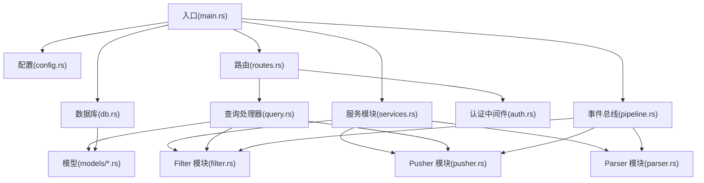
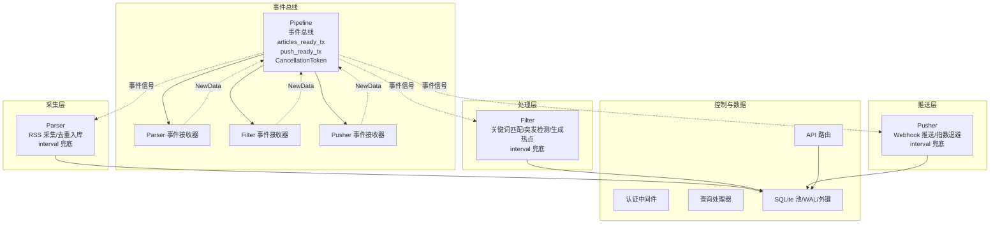
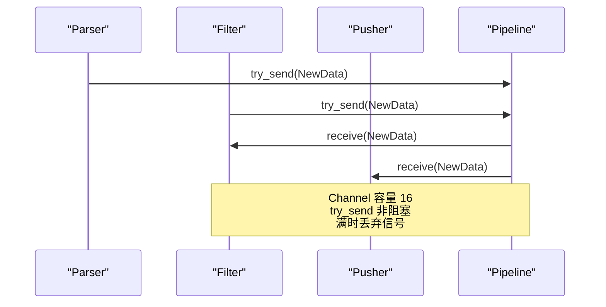
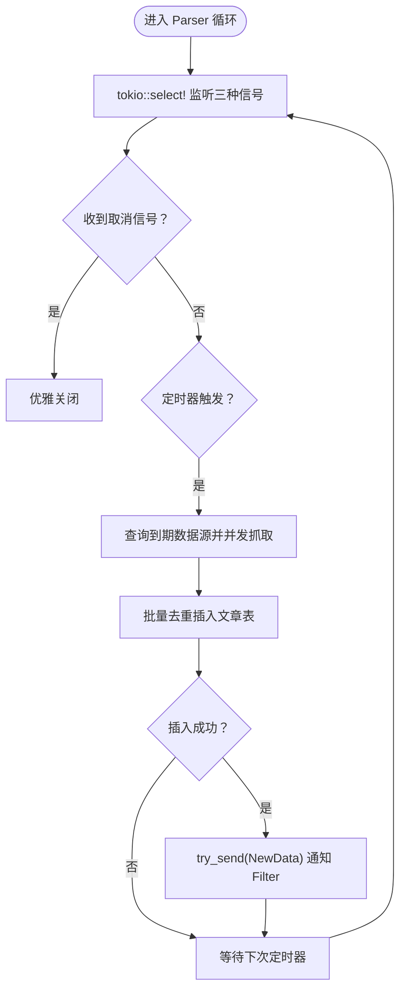
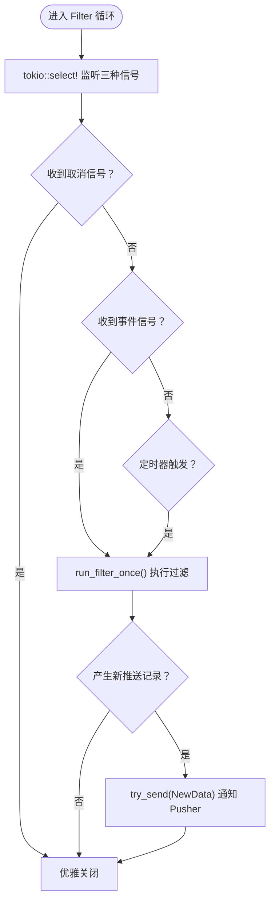
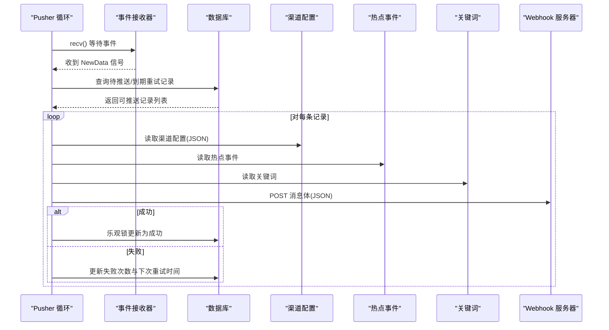
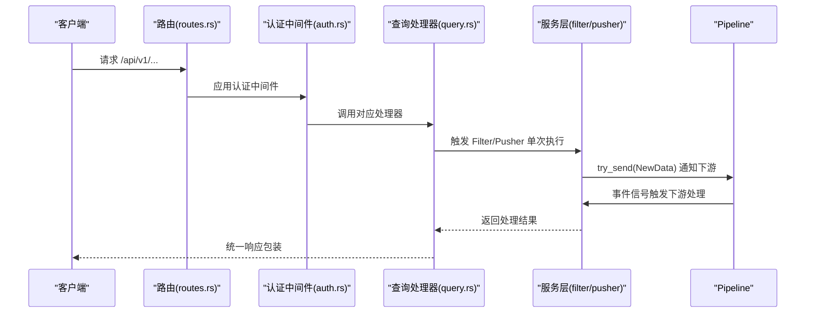
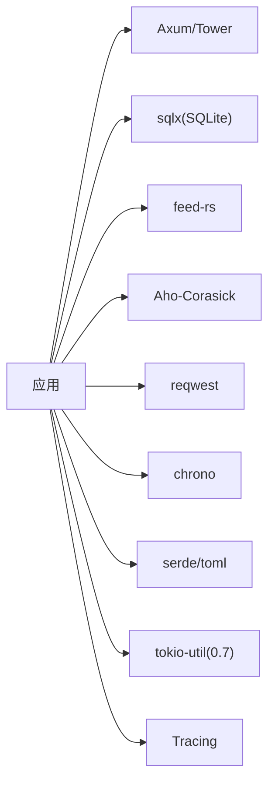
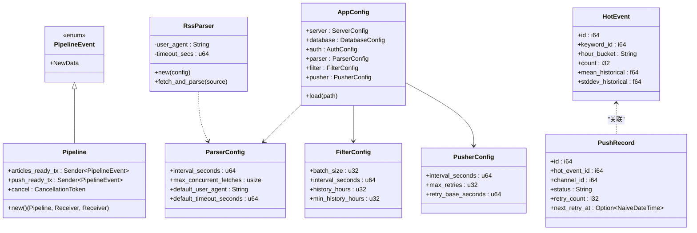

# 系统架构设计

<cite>
**本文引用的文件**
- [README.md](file://README.md)
- [Cargo.toml](file://Cargo.toml)
- [Dockerfile](file://Dockerfile)
- [src/main.rs](file://src/main.rs)
- [src/config.rs](file://src/config.rs)
- [src/db.rs](file://src/db.rs)
- [src/routes.rs](file://src/routes.rs)
- [src/services.rs](file://src/services.rs)
- [src/services/parser.rs](file://src/services/parser.rs)
- [src/services/filter.rs](file://src/services/filter.rs)
- [src/services/pusher.rs](file://src/services/pusher.rs)
- [src/pipeline.rs](file://src/pipeline.rs)
- [src/models/article.rs](file://src/models/article.rs)
- [src/models/hot_event.rs](file://src/models/hot_event.rs)
- [src/models/push_record.rs](file://src/models/push_record.rs)
- [src/handlers/query.rs](file://src/handlers/query.rs)
- [src/middleware/auth.rs](file://src/middleware/auth.rs)
- [openspec/changes/event-driven-pipeline/specs/event-driven-pipeline/spec.md](file://openspec/changes/event-driven-pipeline/specs/event-driven-pipeline/spec.md)
- [docs/plans/09-event-driven-pipeline.md](file://docs/plans/09-event-driven-pipeline.md)
</cite>

## 更新摘要
**所做更改**
- 新增事件驱动管道系统的整体架构图和模块交互模式
- 移除旧的轮询架构描述，替换为基于 mpsc 通道的事件驱动模式
- 更新核心组件分析，反映 Pipeline 事件总线的设计
- 新增 Pipeline 事件总线的详细技术规范
- 更新系统上下文图和组件分解图以反映新的架构

## 目录
1. [引言](#引言)
2. [项目结构](#项目结构)
3. [核心组件](#核心组件)
4. [架构总览](#架构总览)
5. [详细组件分析](#详细组件分析)
6. [依赖分析](#依赖分析)
7. [性能考量](#性能考量)
8. [故障排查指南](#故障排查指南)
9. [结论](#结论)
10. [附录](#附录)

## 引言
本文件为"AI趋势监控系统"的架构设计文档，聚焦于全新的事件驱动管道系统架构与三个独立后台模块的职责划分、运行机制与交互关系。系统采用 Rust 语言构建，基于 Tokio 异步运行时，通过事件驱动的 mpsc 通道实现模块间的松耦合通信，替代了原有的轮询架构。系统以 SQLite 作为数据存储，通过 RSS 采集、关键词匹配与统计突发检测识别热点，并以 Webhook 方式推送告警。文档同时覆盖基础设施需求、可扩展性、部署拓扑、安全与监控、灾难恢复、配置管理与模块组织等横切关注点。

## 项目结构
系统采用"入口点 + 配置 + 中间件 + 路由 + 事件总线 + 业务服务 + 数据访问 + 模型"的分层组织方式，新增的 Pipeline 模块作为事件总线承载跨模块通信。



**章节来源**
- [src/main.rs:1-126](file://src/main.rs#L1-L126)
- [src/pipeline.rs:1-45](file://src/pipeline.rs#L1-L45)
- [src/routes.rs:14-70](file://src/routes.rs#L14-L70)

## 核心组件
- **事件总线（Pipeline）**
  - 轻量级事件信号：`PipelineEvent::NewData`，用于通知下游模块有新数据需要处理
  - 两个 mpsc 通道：`articles_ready_tx`（Parser→Filter）、`push_ready_tx`（Filter→Pusher）
  - 共享取消令牌：`CancellationToken` 支持优雅关闭
- **管道三模块**
  - **Parser**：按配置周期从 RSS 源抓取内容，去重写入文章表，成功后通过事件总线通知 Filter
  - **Filter**：监听事件信号和兜底定时器，进行关键词匹配与统计突发检测，生成热点事件与推送记录，通知 Pusher
  - **Pusher**：监听事件信号和兜底定时器，轮询待推送记录，调用 Webhook 并进行指数退避重试
- **API 层**
  - 提供健康检查、Token 管理、数据源/关键词/渠道管理、热点查询与手动触发接口
- **认证与中间件**
  - Bearer Token 认证，支持过期检查与最后使用时间更新
- **数据层**
  - SQLite 连接池、WAL 模式、外键约束；统一的数据库操作模块与模型定义

**章节来源**
- [src/pipeline.rs:4-44](file://src/pipeline.rs#L4-L44)
- [openspec/changes/event-driven-pipeline/specs/event-driven-pipeline/spec.md:19-38](file://openspec/changes/event-driven-pipeline/specs/event-driven-pipeline/spec.md#L19-L38)
- [docs/plans/09-event-driven-pipeline.md:116-168](file://docs/plans/09-event-driven-pipeline.md#L116-L168)

## 架构总览
系统采用全新的事件驱动管道架构，三个后台模块通过 Pipeline 事件总线实现松耦合通信。每个模块同时监听三种信号源：事件通知（近实时）、兜底定时器（保证最终一致性）、取消信号（优雅关闭）。



**图表来源**
- [src/pipeline.rs:11-44](file://src/pipeline.rs#L11-L44)
- [docs/plans/09-event-driven-pipeline.md:74-111](file://docs/plans/09-event-driven-pipeline.md#L74-L111)

**章节来源**
- [docs/plans/09-event-driven-pipeline.md:48-111](file://docs/plans/09-event-driven-pipeline.md#L48-L111)
- [src/pipeline.rs:11-44](file://src/pipeline.rs#L11-L44)

## 详细组件分析

### Pipeline 事件总线（事件驱动核心）
- **职责**
  - 作为跨模块通信的中央枢纽，承载事件信号和共享状态
  - 提供轻量级的 `PipelineEvent::NewData` 信号，通知下游模块有新数据需要处理
  - 管理全局取消令牌，支持优雅关闭
- **关键特性**
  - 两个容量为16的 mpsc 通道，避免阻塞发送
  - `CancellationToken` 支持克隆，各模块持有独立的取消令牌
  - Receiver 不在 Pipeline 结构中，通过工厂方法返回给调用者
- **运行机制**
  - `Pipeline::new()` 创建事件总线并返回 (Pipeline, articles_rx, push_rx)
  - 模块通过 `try_send` 发送事件信号，避免阻塞
  - 通道满时采用非阻塞策略，依靠兜底定时器保证最终处理



**图表来源**
- [src/pipeline.rs:22-44](file://src/pipeline.rs#L22-L44)
- [openspec/changes/event-driven-pipeline/specs/event-driven-pipeline/spec.md:33-38](file://openspec/changes/event-driven-pipeline/specs/event-driven-pipeline/spec.md#L33-L38)

**章节来源**
- [src/pipeline.rs:4-44](file://src/pipeline.rs#L4-L44)
- [openspec/changes/event-driven-pipeline/specs/event-driven-pipeline/spec.md:3-38](file://openspec/changes/event-driven-pipeline/specs/event-driven-pipeline/spec.md#L3-L38)

### Parser 模块（RSS 采集）
- **职责**
  - 按配置周期从 RSS 源抓取内容，解析 RSS/Atom，抽取文章字段，去重写入文章表，更新最后抓取时间
  - 成功插入文章后通过事件总线通知 Filter
- **关键特性**
  - 使用 `tokio::time::interval` 替代硬编码 `sleep`，避免时间漂移
  - 并发控制：信号量限制最大并发抓取数
  - 错误处理：抓取失败仍更新最后抓取时间，避免频繁重试
  - 事件驱动：成功插入后发送 `NewData` 信号，实现近实时处理
- **运行机制**
  - 同时监听：事件信号、兜底定时器、取消信号
  - 事件信号触发立即执行抓取逻辑
  - 定时器作为兜底，确保即使信号丢失也能定期处理



**图表来源**
- [docs/plans/09-event-driven-pipeline.md:209-243](file://docs/plans/09-event-driven-pipeline.md#L209-L243)

**章节来源**
- [docs/plans/09-event-driven-pipeline.md:197-243](file://docs/plans/09-event-driven-pipeline.md#L197-L243)

### Filter 模块（关键词匹配与突发检测）
- **职责**
  - 监听 Parser 的事件信号和兜底定时器，加载未处理文章，构建 Aho-Corasick 自动机，统计小时级计数，计算历史均值与标准差，进行突发阈值判断，生成热点事件与推送记录，标记文章已处理
  - 成功创建推送记录后通过事件总线通知 Pusher
- **关键特性**
  - 双通道关键词匹配：分别处理大小写敏感与不敏感模式
  - 历史统计：滑动窗口计算均值与标准差，结合关键词阈值参数决定是否热点
  - 去重热点：同一关键词同一小时仅保留一条热点记录
  - 事件驱动：收到信号后立即执行，或在定时器触发时兜底处理
- **运行机制**
  - 同时监听：Parser 事件信号、自身事件接收器、兜底定时器、取消信号
  - 事件信号触发立即执行过滤逻辑
  - 返回值指示是否产生新的推送记录



**图表来源**
- [docs/plans/09-event-driven-pipeline.md:275-310](file://docs/plans/09-event-driven-pipeline.md#L275-L310)

**章节来源**
- [docs/plans/09-event-driven-pipeline.md:246-336](file://docs/plans/09-event-driven-pipeline.md#L246-L336)

### Pusher 模块（Webhook 推送与重试）
- **职责**
  - 监听 Filter 的事件信号和兜底定时器，轮询待推送与到期重试记录，构造钉钉/飞书风格消息体，调用 Webhook，根据结果更新状态，采用指数退避策略重试，最终成功或放弃
- **关键特性**
  - 乐观锁：更新状态时使用期望值校验，避免并发重复推送
  - 指数退避：按重试次数线性增加延迟，超过最大次数则放弃
  - 失败兜底：网络错误与非 2xx 均计入失败并重试
  - 事件驱动：收到信号后立即执行推送逻辑
- **运行机制**
  - 同时监听：Filter 事件信号、自身事件接收器、兜底定时器、取消信号
  - 事件信号触发立即执行推送逻辑
  - 定时器作为兜底，确保即使信号丢失也能定期处理



**图表来源**
- [docs/plans/09-event-driven-pipeline.md:357-387](file://docs/plans/09-event-driven-pipeline.md#L357-L387)

**章节来源**
- [docs/plans/09-event-driven-pipeline.md:340-387](file://docs/plans/09-event-driven-pipeline.md#L340-L387)

### API 与认证
- **路由与中间件**
  - 除健康检查外，所有 /api/v1/* 路由均受认证中间件保护
  - 支持 CORS，便于前端跨域访问
- **认证流程**
  - 提取 Bearer Token → 数据库校验（非撤销）→ 过期检查 → 异步更新最后使用时间 → 注入请求上下文
- **查询接口**
  - 支持文章分页、热点分页、按关键词筛选、趋势曲线、手动触发 Filter/Pusher
  - 手动触发会通过事件总线通知相应的下游模块



**图表来源**
- [src/routes.rs:14-70](file://src/routes.rs#L14-L70)
- [src/middleware/auth.rs:14-58](file://src/middleware/auth.rs#L14-L58)
- [src/handlers/query.rs:501-510](file://src/handlers/query.rs#L501-L510)

**章节来源**
- [src/routes.rs:14-70](file://src/routes.rs#L14-L70)
- [src/middleware/auth.rs:14-58](file://src/middleware/auth.rs#L14-L58)
- [src/handlers/query.rs:496-510](file://src/handlers/query.rs#L496-L510)

## 依赖分析
- **语言与运行时**
  - Rust 2021 Edition，Tokio 全功能运行时，Axum + Tower，Tracing 日志
- **数据库与 ORM**
  - SQLite + sqlx 0.7（WAL 模式 + 外键），迁移自动执行
- **第三方库**
  - RSS 解析：feed-rs
  - 多模式字符串匹配：Aho-Corasick
  - HTTP 客户端：reqwest（Webhook 推送）
  - 时间：chrono
  - 序列化：serde/serde_json/toml
  - **新增**：tokio-util 0.7（提供 CancellationToken）
- **构建与发布**
  - 生产构建启用 LTO、单代码生成单元、符号裁剪、panic abort，禁用溢出检查以提升性能



**图表来源**
- [Cargo.toml:6-46](file://Cargo.toml#L6-L46)

**章节来源**
- [Cargo.toml:6-46](file://Cargo.toml#L6-L46)
- [src/db.rs:10-27](file://src/db.rs#L10-L27)

## 性能考量
- **并发与吞吐**
  - Parser 使用信号量限制并发抓取，避免对上游 RSS 源造成压力
  - Filter 批量处理文章，减少数据库往返；AC 自动机在内存中完成多模式匹配，降低 IO
  - Pusher 并行处理多个待推送记录，但受数据库乐观锁与重试策略约束
  - **新增**：事件驱动模式消除了盲目轮询，CPU 和 I/O 资源得到更高效利用
- **存储与索引**
  - SQLite WAL 模式提升并发读写能力；外键约束保证数据一致性
  - 建议在高频查询字段上建立索引（如文章 processed_at、热点事件 hour_bucket 等），以优化分页与趋势查询
- **资源与内存**
  - 生产配置关闭溢出检查与增量编译，启用 LTO 与符号裁剪，减小二进制体积并提升运行时性能
  - **新增**：Channel 容量 16 足够满足信号传输需求，避免内存过度占用
- **可观测性**
  - Tracing 输出关键事件日志，便于定位瓶颈与异常
  - **新增**：事件总线的信号流转可通过日志追踪，便于调试和监控

## 故障排查指南
- **认证失败**
  - 确认 Authorization 头格式为 Bearer Token，Token 未被撤销且未过期；查看中间件日志
- **数据库问题**
  - 确认 SQLite 文件路径存在且可写；检查 WAL 与外键设置；确认迁移已执行
- **Parser 无法抓取**
  - 检查网络连通性、User-Agent 与超时配置；查看抓取错误日志与最后抓取时间更新情况
  - **新增**：检查事件总线是否正常工作，Parser 是否能成功发送 `NewData` 信号
- **Filter 未产生热点**
  - 确认关键词启用且配置了合理的 std_multiplier 与 min_hot_count；检查历史窗口与最小历史小时数；查看小时计数与统计结果
  - **新增**：检查 Parser 是否正确发送事件信号，Filter 是否能接收到信号
- **Pusher 推送失败**
  - 检查渠道配置 JSON 是否包含 url 字段；查看网络错误与 HTTP 状态码；确认重试次数与下次重试时间；必要时手动触发推送
  - **新增**：检查 Filter 是否正确发送事件信号，Pusher 是否能接收到信号
- **事件总线问题**
  - **新增**：检查 Pipeline::new() 是否正确创建，通道是否正常；确认 CancellationToken 是否正确传播
  - 检查 `try_send` 是否返回 `TrySendError::Full`，这表示信号丢失但系统仍会通过定时器兜底处理

**章节来源**
- [src/middleware/auth.rs:14-58](file://src/middleware/auth.rs#L14-L58)
- [src/db.rs:10-27](file://src/db.rs#L10-L27)
- [src/pipeline.rs:22-44](file://src/pipeline.rs#L22-L44)

## 结论
该系统通过事件驱动管道架构实现了从 RSS 采集到热点检测再到告警推送的完整链路。新的架构以 Pipeline 事件总线为核心，消除了盲目轮询，实现了近实时的模块间通信，同时保持了优雅关闭和兜底定时器的可靠性保障。通过 SQLite+WAL、AC 自动机与指数退避等技术选择，在保证实时性的同时兼顾了资源占用与可靠性。建议在生产环境中配合索引优化、监控告警与灾备策略，持续提升稳定性与可维护性。

## 附录

### 系统上下文图
```mermaid
graph TB
subgraph "外部系统"
SRC["RSS 源"]
WEB["钉钉/飞书 Webhook"]
end
subgraph "AI 趋势监控系统"
API["API 服务(Axum)"]
AUTH["认证中间件"]
PIPE["Pipeline 事件总线"]
PARSER["Parser"]
FILTER["Filter"]
PUSHER["Pusher"]
DB["SQLite(WAL/外键)"]
end
SRC --> PARSER
PARSER --> DB
PARSER -.->|"NewData 信号"| PIPE
PIPE --> FILTER
FILTER --> DB
FILTER -.->|"NewData 信号"| PIPE
PIPE --> PUSHER
PUSHER --> DB
API --> AUTH
AUTH --> PIPE
PIPE --> API
WEB <-- PUSHER
```

**图表来源**
- [src/main.rs:80-121](file://src/main.rs#L80-L121)
- [src/pipeline.rs:11-44](file://src/pipeline.rs#L11-L44)

### 组件分解图（代码级）


**图表来源**
- [src/pipeline.rs:4-44](file://src/pipeline.rs#L4-L44)
- [src/config.rs:3-57](file://src/config.rs#L3-L57)
- [src/services/parser.rs:33-88](file://src/services/parser.rs#L33-L88)
- [src/models/hot_event.rs:5-15](file://src/models/hot_event.rs#L5-L15)
- [src/models/push_record.rs:5-16](file://src/models/push_record.rs#L5-L16)

### 部署拓扑与基础设施
- **单机部署**
  - 使用 Dockerfile 构建镜像，暴露服务端口，挂载 SQLite 数据目录实现持久化
- **可扩展性**
  - 当前实现为单实例；若需水平扩展，建议引入外部消息队列或分布式调度，将 Parser/Filter/Pusher 解耦为独立服务
  - **新增**：事件总线设计支持多实例部署，可通过外部消息代理实现跨实例通信
- **安全**
  - 使用 Bearer Token 认证；建议在生产环境启用 HTTPS、限制来源 IP、定期轮换 Token
- **监控与日志**
  - 使用 Tracing 输出结构化日志；建议接入集中式日志与指标系统（如 Prometheus + Grafana）
  - **新增**：可监控事件信号的发送和接收情况，以及 Channel 的缓冲状态
- **灾难恢复**
  - 定期备份 SQLite 数据文件；利用 WAL 模式提升崩溃恢复能力；在容器层面使用持久卷
  - **新增**：事件总线状态可通过外部存储恢复，支持系统重启后的状态重建

**章节来源**
- [Dockerfile:1-61](file://Dockerfile#L1-L61)
- [src/db.rs:10-27](file://src/db.rs#L10-L27)
- [src/middleware/auth.rs:14-58](file://src/middleware/auth.rs#L14-L58)

### 配置管理与版本兼容
- **配置项**
  - server/host, server/port, database/path, auth/initial_token, parser/*（新增 interval_seconds 字段）, filter/*, pusher/*
- **版本兼容**
  - Rust 1.75+，Axum 0.8，sqlx 0.7，reqwest 0.12，feed-rs 1，aho-corasick 1，**tokio-util 0.7**
- **模块组织**
  - 入口 main.rs 负责 CLI、初始化、事件总线创建与优雅关闭；routes.rs 负责路由与中间件；services/* 实现后台任务；db/* 与 models/* 提供数据访问与模型；**新增**：pipeline.rs 提供事件总线核心功能

**章节来源**
- [README.md:91-122](file://README.md#L91-L122)
- [Cargo.toml:1-67](file://Cargo.toml#L1-L67)
- [src/main.rs:55-125](file://src/main.rs#L55-L125)
- [src/routes.rs:14-70](file://src/routes.rs#L14-L70)
- [src/services.rs:1-4](file://src/services.rs#L1-L4)
- [src/pipeline.rs:1-45](file://src/pipeline.rs#L1-L45)

### 事件驱动架构技术规范
- **事件信号规范**
  - `PipelineEvent::NewData`：轻量级信号，不携带数据载荷
  - 仅用于通知下游模块有新数据需要处理
- **通道设计规范**
  - Channel 容量：16（足够满足信号传输需求）
  - 发送方式：`try_send`（非阻塞，避免死锁）
  - 接收方式：`recv()`（阻塞等待）
- **取消机制规范**
  - 使用 `CancellationToken` 实现优雅关闭
  - 支持克隆，各模块持有独立的取消令牌
  - 通过 `cancelled()` 和 `cancelled_owned()` 提供不同的取消等待方式
- **兜底策略规范**
  - 每个模块同时监听事件信号、定时器和取消信号
  - 定时器作为兜底，确保即使信号丢失也能定期处理
  - 采用 `tokio::time::interval` 替代 `sleep`，避免时间漂移

**章节来源**
- [openspec/changes/event-driven-pipeline/specs/event-driven-pipeline/spec.md:1-38](file://openspec/changes/event-driven-pipeline/specs/event-driven-pipeline/spec.md#L1-L38)
- [docs/plans/09-event-driven-pipeline.md:58-71](file://docs/plans/09-event-driven-pipeline.md#L58-L71)