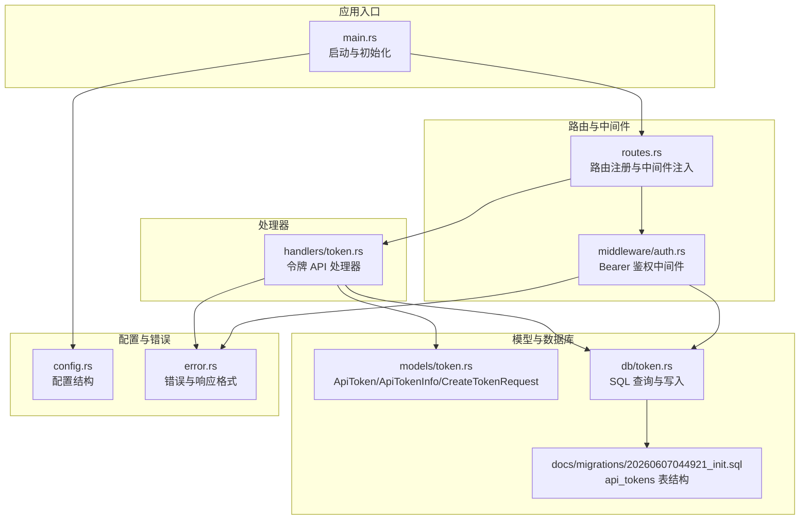
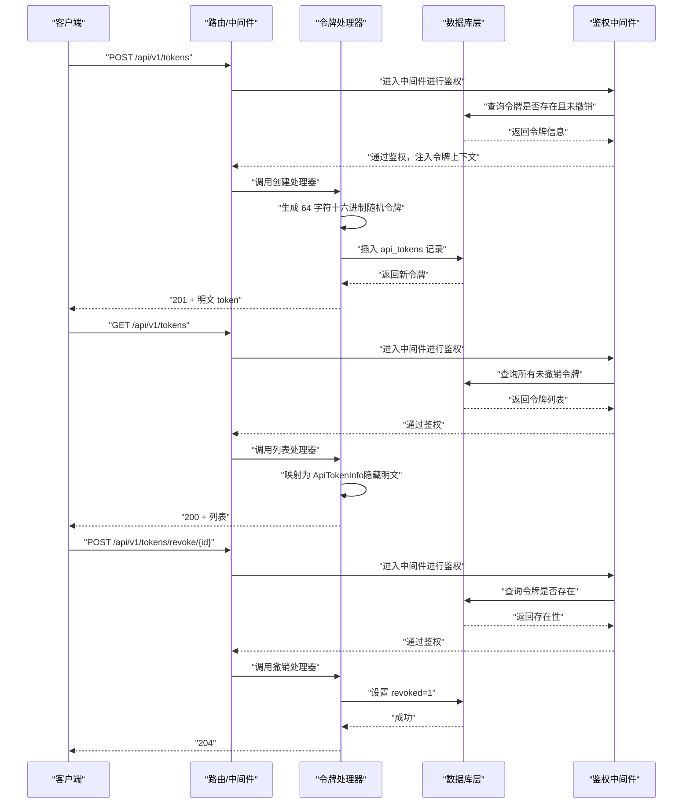
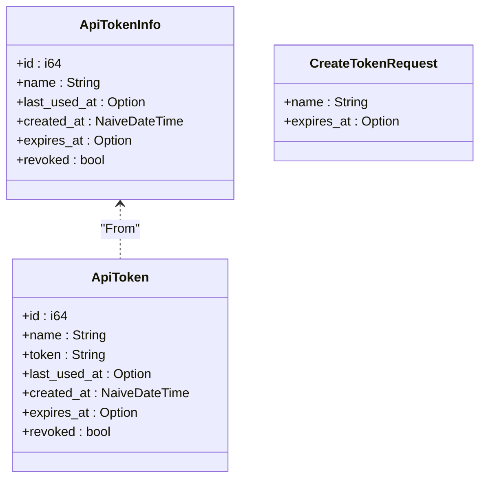
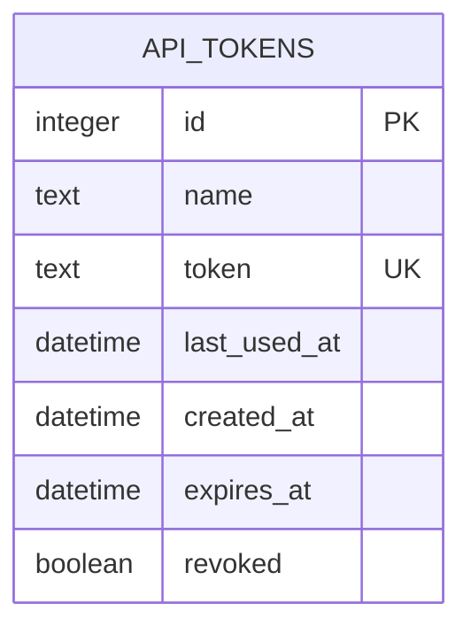
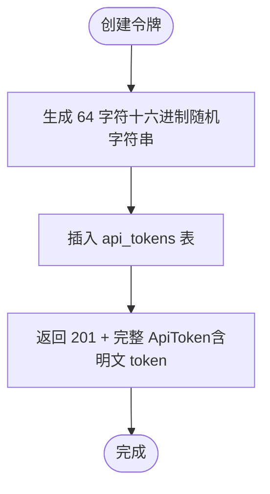
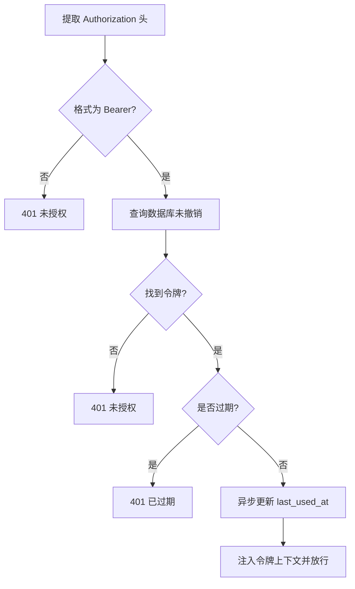
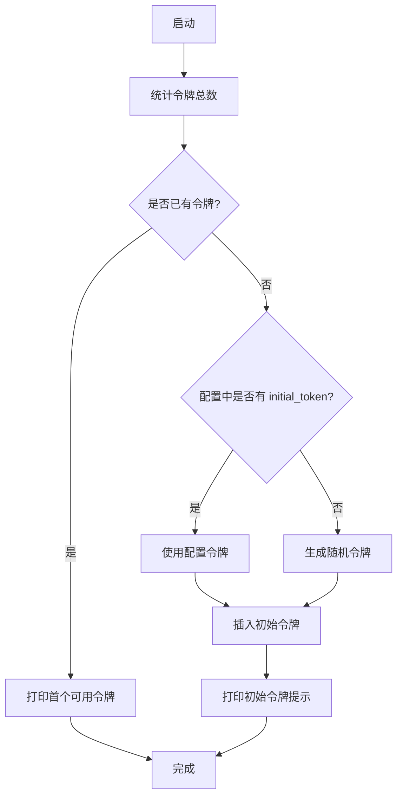
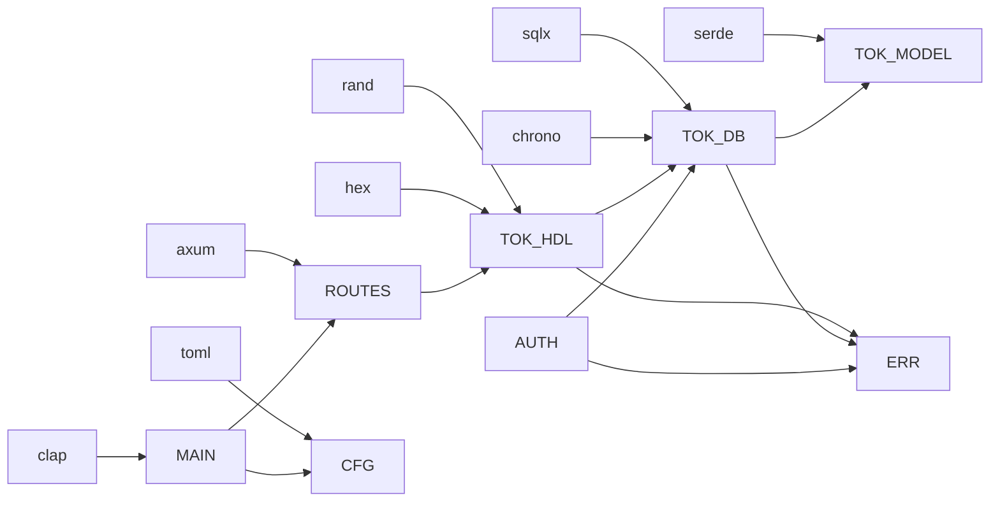

# 令牌管理

<cite>
**本文引用的文件**
- [src/models/token.rs](file://src/models/token.rs)
- [src/db/token.rs](file://src/db/token.rs)
- [src/handlers/token.rs](file://src/handlers/token.rs)
- [src/middleware/auth.rs](file://src/middleware/auth.rs)
- [src/routes.rs](file://src/routes.rs)
- [src/main.rs](file://src/main.rs)
- [src/error.rs](file://src/error.rs)
- [src/config.rs](file://src/config.rs)
- [docs/apis/token-api.md](file://docs/apis/token-api.md)
- [docs/migrations/20260607044921_init.sql](file://docs/migrations/20260607044921_init.sql)
- [openspec/specs/token-api/spec.md](file://openspec/specs/token-api/spec.md)
- [Cargo.toml](file://Cargo.toml)
</cite>

## 目录
1. [简介](#简介)
2. [项目结构](#项目结构)
3. [核心组件](#核心组件)
4. [架构总览](#架构总览)
5. [详细组件分析](#详细组件分析)
6. [依赖关系分析](#依赖关系分析)
7. [性能考量](#性能考量)
8. [故障排查指南](#故障排查指南)
9. [结论](#结论)
10. [附录](#附录)

## 简介
本文件系统化阐述 AI-Trend-Tool 的令牌管理系统：数据模型与数据库结构、API 接口规范、令牌生成与生命周期管理（含过期机制）、安全存储与访问控制、状态管理与审计日志、以及异常处理与集成示例。目标是帮助开发者快速理解并正确使用该系统，同时为后续扩展提供清晰的参考。

## 项目结构
围绕令牌管理的关键模块与文件如下：
- 模型层：定义令牌实体、列表信息与创建请求体
- 数据库层：封装对 api_tokens 表的增删改查与统计
- 处理器层：暴露创建、列出、撤销等 API
- 中间件层：统一鉴权、校验与最后使用时间更新
- 路由层：挂载 API 并注入中间件
- 启动流程：确保首次启动存在初始令牌并打印提示
- 规范与文档：OpenSpec 规格与 API 文档

图表来源
- [src/main.rs:1-96](file://src/main.rs#L1-L96)
- [src/routes.rs:14-48](file://src/routes.rs#L14-L48)
- [src/middleware/auth.rs:18-60](file://src/middleware/auth.rs#L18-L60)
- [src/handlers/token.rs:13-66](file://src/handlers/token.rs#L13-L66)
- [src/db/token.rs:6-107](file://src/db/token.rs#L6-L107)
- [docs/migrations/20260607044921_init.sql:4-12](file://docs/migrations/20260607044921_init.sql#L4-L12)
- [src/config.rs:4-59](file://src/config.rs#L4-L59)
- [src/error.rs:8-79](file://src/error.rs#L8-L79)

章节来源
- [src/main.rs:26-61](file://src/main.rs#L26-L61)
- [src/routes.rs:14-37](file://src/routes.rs#L14-L37)
- [src/middleware/auth.rs:18-60](file://src/middleware/auth.rs#L18-L60)
- [src/handlers/token.rs:13-66](file://src/handlers/token.rs#L13-L66)
- [src/db/token.rs:6-107](file://src/db/token.rs#L6-L107)
- [docs/migrations/20260607044921_init.sql:4-12](file://docs/migrations/20260607044921_init.sql#L4-L12)
- [src/config.rs:26-28](file://src/config.rs#L26-L28)
- [src/error.rs:8-79](file://src/error.rs#L8-L79)

## 核心组件
- 令牌数据模型
  - ApiToken：完整令牌实体，包含标识、名称、密钥值、最后使用时间、创建时间、过期时间与撤销标记
  - ApiTokenInfo：列表响应模型，不包含明文 token 字段
  - CreateTokenRequest：创建请求体，包含 name 与可选 expires_at
- 数据库表结构
  - api_tokens：唯一 token 值、支持过期时间与软删除（revoked）
- API 接口
  - POST /api/v1/tokens：创建令牌（返回明文 token）
  - GET /api/v1/tokens：列出令牌（隐藏明文 token）
  - POST /api/v1/tokens/revoke/{id}：撤销令牌（软删除）
- 鉴权中间件
  - 提取 Bearer 头、查询数据库、检查撤销与过期、异步更新最后使用时间、注入令牌上下文
- 启动引导
  - 首次启动时若无令牌则自动生成或使用配置中的初始令牌，并打印提示

章节来源
- [src/models/token.rs:5-46](file://src/models/token.rs#L5-L46)
- [docs/migrations/20260607044921_init.sql:4-12](file://docs/migrations/20260607044921_init.sql#L4-L12)
- [docs/apis/token-api.md:62-198](file://docs/apis/token-api.md#L62-L198)
- [src/middleware/auth.rs:18-60](file://src/middleware/auth.rs#L18-L60)
- [src/main.rs:26-61](file://src/main.rs#L26-L61)

## 架构总览
下图展示了从客户端到数据库的端到端调用链路，以及令牌生成、鉴权与审计更新的交互。

图表来源
- [src/routes.rs:21-31](file://src/routes.rs#L21-L31)
- [src/middleware/auth.rs:18-60](file://src/middleware/auth.rs#L18-L60)
- [src/handlers/token.rs:18-66](file://src/handlers/token.rs#L18-L66)
- [src/db/token.rs:6-107](file://src/db/token.rs#L6-L107)

## 详细组件分析

### 数据模型与序列化
- ApiToken：用于创建与查询的完整令牌对象，包含明文 token 字段
- ApiTokenInfo：仅用于列表响应，避免泄露明文 token
- CreateTokenRequest：创建令牌的输入模型，支持可选过期时间

图表来源
- [src/models/token.rs:5-46](file://src/models/token.rs#L5-L46)

章节来源
- [src/models/token.rs:5-46](file://src/models/token.rs#L5-L46)

### 数据库存储结构
- 表名：api_tokens
- 字段要点：
  - token 唯一约束，保证令牌全局唯一
  - revoked 软删除字段，默认 0
  - expires_at 可为空表示永不过期
  - created_at 默认当前时间
  - last_used_at 用于审计与追踪

图表来源
- [docs/migrations/20260607044921_init.sql:4-12](file://docs/migrations/20260607044921_init.sql#L4-L12)

章节来源
- [docs/migrations/20260607044921_init.sql:4-12](file://docs/migrations/20260607044921_init.sql#L4-L12)

### API 接口实现
- POST /api/v1/tokens
  - 功能：生成 64 字符十六进制随机令牌，插入数据库，返回完整 ApiToken（包含明文 token）
  - 安全注意：明文仅在此处返回一次，后续列表接口返回 ApiTokenInfo
- GET /api/v1/tokens
  - 功能：列出所有未撤销令牌，按创建时间倒序排列，隐藏明文 token
- POST /api/v1/tokens/revoke/{id}
  - 功能：将指定令牌标记为已撤销（软删除），返回 204

图表来源
- [src/handlers/token.rs:18-30](file://src/handlers/token.rs#L18-L30)

章节来源
- [src/handlers/token.rs:13-66](file://src/handlers/token.rs#L13-L66)
- [docs/apis/token-api.md:62-198](file://docs/apis/token-api.md#L62-L198)

### 鉴权中间件与生命周期管理
- 鉴权流程
  - 提取 Authorization 头并校验 Bearer 格式
  - 查询数据库获取非撤销令牌
  - 校验过期时间（如存在）
  - 异步更新 last_used_at
  - 将令牌注入请求扩展供下游使用
- 生命周期与审计
  - 创建：生成随机令牌并入库
  - 使用：每次通过鉴权后异步更新 last_used_at
  - 过期：若 expires_at 存在且小于当前 UTC，则拒绝
  - 撤销：软删除，后续校验失败

图表来源
- [src/middleware/auth.rs:23-59](file://src/middleware/auth.rs#L23-L59)

章节来源
- [src/middleware/auth.rs:18-60](file://src/middleware/auth.rs#L18-L60)

### 启动引导与初始令牌
- 首次启动检测令牌数量
- 若已有令牌：打印首个可用令牌以便复制
- 若无令牌：优先使用配置中的 initial_token，否则自动生成 64 字符随机令牌并插入数据库，同时打印提示

图表来源
- [src/main.rs:29-61](file://src/main.rs#L29-L61)

章节来源
- [src/main.rs:26-61](file://src/main.rs#L26-L61)
- [src/config.rs:26-28](file://src/config.rs#L26-L28)

### 安全存储策略与加密方法
- 明文存储策略
  - 令牌明文仅在创建时返回给调用方，后续列表响应中以 ApiTokenInfo 返回，不包含 token 字段
- 加密与哈希
  - 当前实现未对明文 token 进行二次哈希存储；令牌值直接存入数据库
  - 建议在生产环境中考虑对敏感字段进行单向哈希存储并在需要时进行比对，以降低泄露风险
- 访问控制
  - 所有 /api/v1/* 路径均需 Bearer 令牌鉴权
  - 鉴权中间件会拒绝无效、已撤销或已过期的令牌

章节来源
- [src/handlers/token.rs:18-30](file://src/handlers/token.rs#L18-L30)
- [src/middleware/auth.rs:18-60](file://src/middleware/auth.rs#L18-L60)
- [docs/apis/token-api.md:5-13](file://docs/apis/token-api.md#L5-L13)

### 状态管理与审计日志
- 状态字段
  - revoked：软删除标记
  - last_used_at：最近使用时间，用于审计与追踪
  - expires_at：过期时间，为空表示永不过期
- 审计更新
  - 鉴权中间件在请求放行后异步更新 last_used_at，避免阻塞主流程
- 日志记录
  - 错误与数据库异常通过统一错误处理返回标准格式
  - 启动阶段打印初始令牌提示，便于运维与安全审计

章节来源
- [src/db/token.rs:50-59](file://src/db/token.rs#L50-L59)
- [src/middleware/auth.rs:48-53](file://src/middleware/auth.rs#L48-L53)
- [src/error.rs:23-49](file://src/error.rs#L23-L49)
- [src/main.rs:57-60](file://src/main.rs#L57-L60)

### 异常处理机制
- 统一错误响应
  - AppError 定义了常见错误类型（400/401/404/409/500）
  - 错误转为标准化 JSON 结构，包含 code 与 message
- 数据库异常转换
  - RowNotFound 自动映射为 404
  - 其他数据库错误映射为 500 DATABASE_ERROR
- API 响应包装
  - ApiResponse 提供 ok/created/no_content 等便捷方法

章节来源
- [src/error.rs:8-79](file://src/error.rs#L8-L79)
- [src/handlers/token.rs:29](file://src/handlers/token.rs#L29)

## 依赖关系分析
- 外部依赖
  - axum/tower_http：Web 框架与中间件
  - sqlx：SQLite 连接池与迁移
  - chrono：时间与时区处理
  - rand/hex：随机字节生成与十六进制编码
  - serde/toml/clap：序列化、配置解析与 CLI
- 内部模块耦合
  - handlers 依赖 models 与 db
  - middleware 依赖 db 与 models
  - routes 组织 handlers 与中间件
  - main 负责初始化、迁移与引导

图表来源
- [Cargo.toml:6-44](file://Cargo.toml#L6-L44)
- [src/routes.rs:14-37](file://src/routes.rs#L14-L37)
- [src/handlers/token.rs:18-30](file://src/handlers/token.rs#L18-L30)
- [src/db/token.rs:6-107](file://src/db/token.rs#L6-L107)
- [src/middleware/auth.rs:18-60](file://src/middleware/auth.rs#L18-L60)
- [src/error.rs:8-79](file://src/error.rs#L8-L79)
- [src/config.rs:52-59](file://src/config.rs#L52-L59)
- [src/main.rs:63-96](file://src/main.rs#L63-L96)

章节来源
- [Cargo.toml:6-44](file://Cargo.toml#L6-L44)
- [src/routes.rs:14-37](file://src/routes.rs#L14-L37)
- [src/handlers/token.rs:18-30](file://src/handlers/token.rs#L18-L30)
- [src/db/token.rs:6-107](file://src/db/token.rs#L6-L107)
- [src/middleware/auth.rs:18-60](file://src/middleware/auth.rs#L18-L60)
- [src/error.rs:8-79](file://src/error.rs#L8-L79)
- [src/config.rs:52-59](file://src/config.rs#L52-L59)
- [src/main.rs:63-96](file://src/main.rs#L63-L96)

## 性能考量
- 异步更新 last_used_at：在鉴权通过后以 fire-and-forget 方式更新，避免阻塞请求路径
- 数据库索引：建议在 api_tokens 上建立必要的索引（如 token 唯一索引、revoked 查询索引、按创建时间排序的索引），以提升查询与排序性能
- 迁移与连接池：使用 sqlx 迁移与连接池，减少启动与运行时开销
- 随机生成：使用线程本地随机数生成器，避免锁竞争

[本节为通用性能建议，不直接分析具体文件]

## 故障排查指南
- 401 未授权
  - 缺失 Authorization 头或格式不正确
  - 令牌不存在、已被撤销或已过期
- 404 未找到
  - 撤销接口传入的 id 不存在
- 500 数据库错误
  - 数据库异常会被转换为统一错误响应，查看服务日志定位问题
- 初始令牌未生成
  - 确认配置项 initial_token 是否为空，或允许自动生成逻辑执行

章节来源
- [src/middleware/auth.rs:23-46](file://src/middleware/auth.rs#L23-L46)
- [src/handlers/token.rs:53-65](file://src/handlers/token.rs#L53-L65)
- [src/error.rs:23-49](file://src/error.rs#L23-L49)
- [src/main.rs:29-61](file://src/main.rs#L29-L61)

## 结论
AI-Trend-Tool 的令牌管理系统以简洁明确的方式实现了令牌的生成、存储、鉴权与生命周期管理。通过 Bearer 鉴权中间件统一拦截、数据库软删除与过期时间控制、以及异步审计更新，系统在安全性与可用性之间取得了平衡。建议在生产环境中进一步强化令牌存储安全（如哈希存储）与数据库索引优化，以满足更高的安全与性能要求。

## 附录

### API 规范摘要
- Base URL：http://localhost:8080
- 认证方式：Authorization: Bearer <token>
- 端点
  - POST /api/v1/tokens：创建令牌（返回明文 token）
  - GET /api/v1/tokens：列出令牌（隐藏明文 token）
  - POST /api/v1/tokens/revoke/{id}：撤销令牌（软删除）

章节来源
- [docs/apis/token-api.md:3-13](file://docs/apis/token-api.md#L3-L13)
- [docs/apis/token-api.md:62-198](file://docs/apis/token-api.md#L62-L198)

### OpenSpec 规格要点
- 令牌创建：生成 64 字符十六进制随机字符串，插入 api_tokens，返回完整对象
- 列表接口：返回 ApiTokenInfo，不包含 token 字段
- 撤销接口：软删除，设置 revoked=1
- 鉴权要求：所有 /api/v1/* 需要有效 Bearer 令牌

章节来源
- [openspec/specs/token-api/spec.md:9-66](file://openspec/specs/token-api/spec.md#L9-L66)

### 集成示例（步骤说明）
- 获取初始令牌
  - 首次启动后，服务会在日志中打印初始令牌，请妥善保存
- 创建新令牌
  - 使用任意有效令牌调用 POST /api/v1/tokens，携带 name 与可选 expires_at
  - 保存返回的明文 token
- 列出令牌
  - 使用任意有效令牌调用 GET /api/v1/tokens，查看令牌列表（不包含明文）
- 撤销令牌
  - 使用任意有效令牌调用 POST /api/v1/tokens/revoke/{id}，使该令牌失效

章节来源
- [src/main.rs:57-60](file://src/main.rs#L57-L60)
- [src/handlers/token.rs:18-66](file://src/handlers/token.rs#L18-L66)
- [docs/apis/token-api.md:62-198](file://docs/apis/token-api.md#L62-L198)