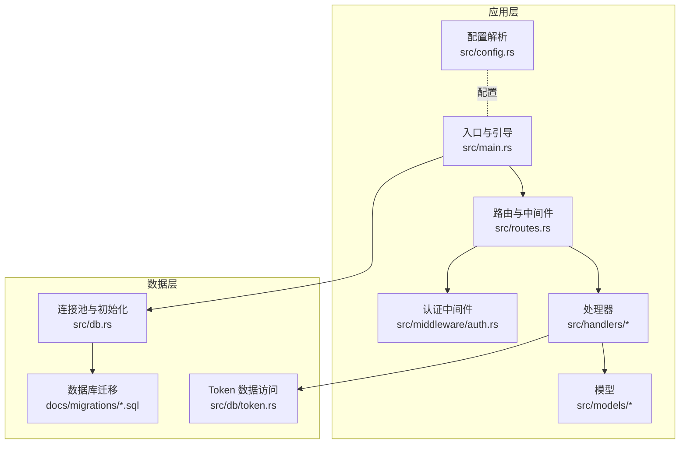
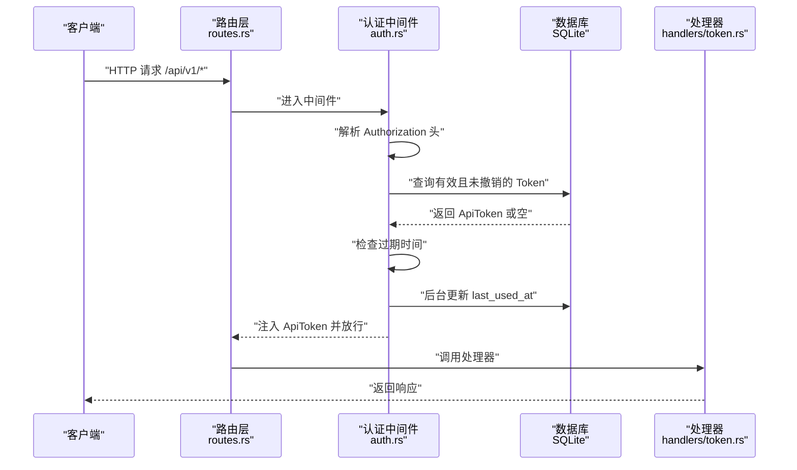
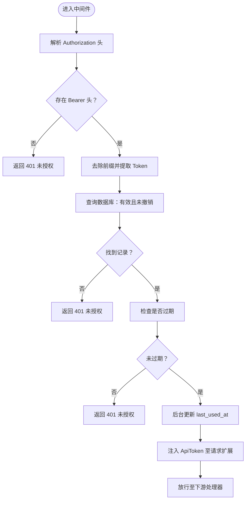
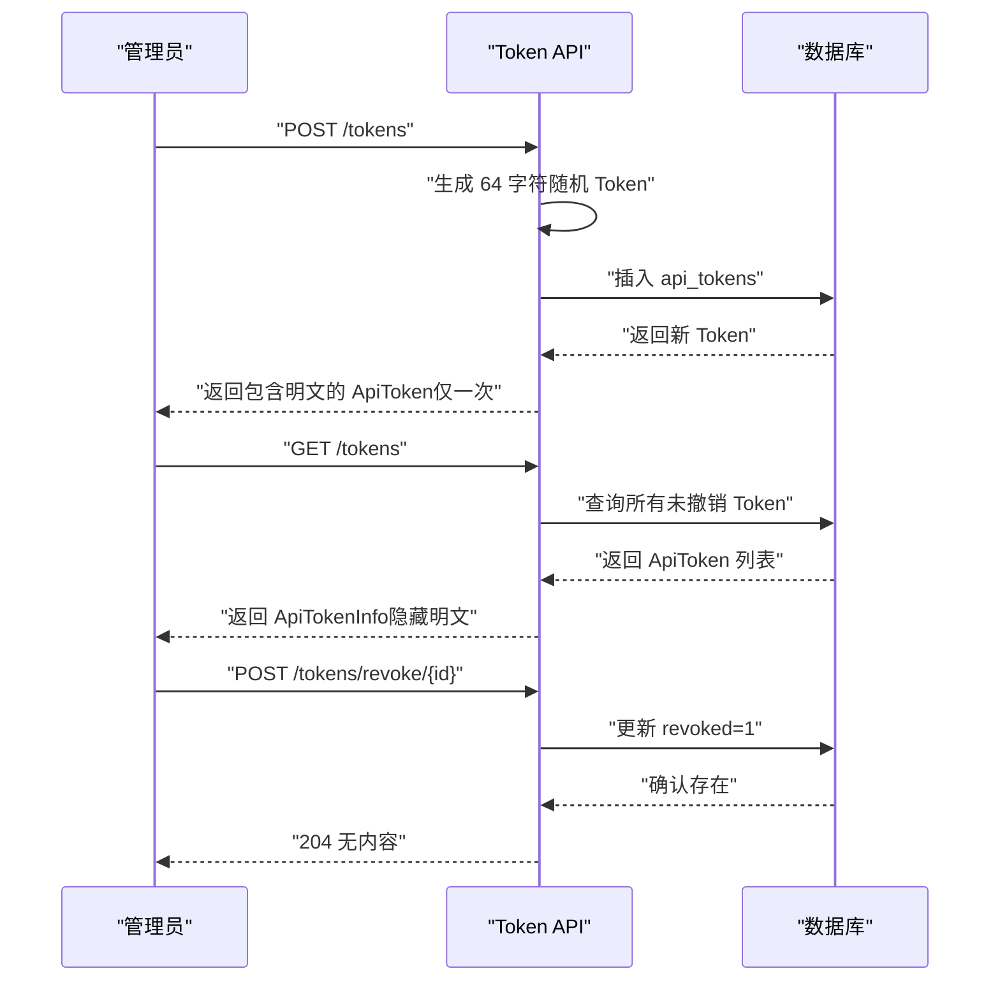
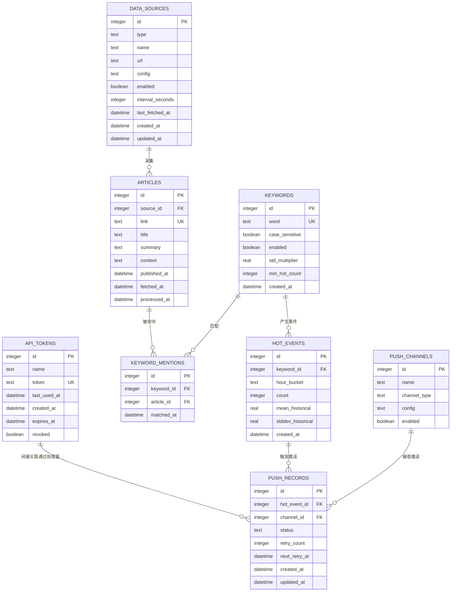
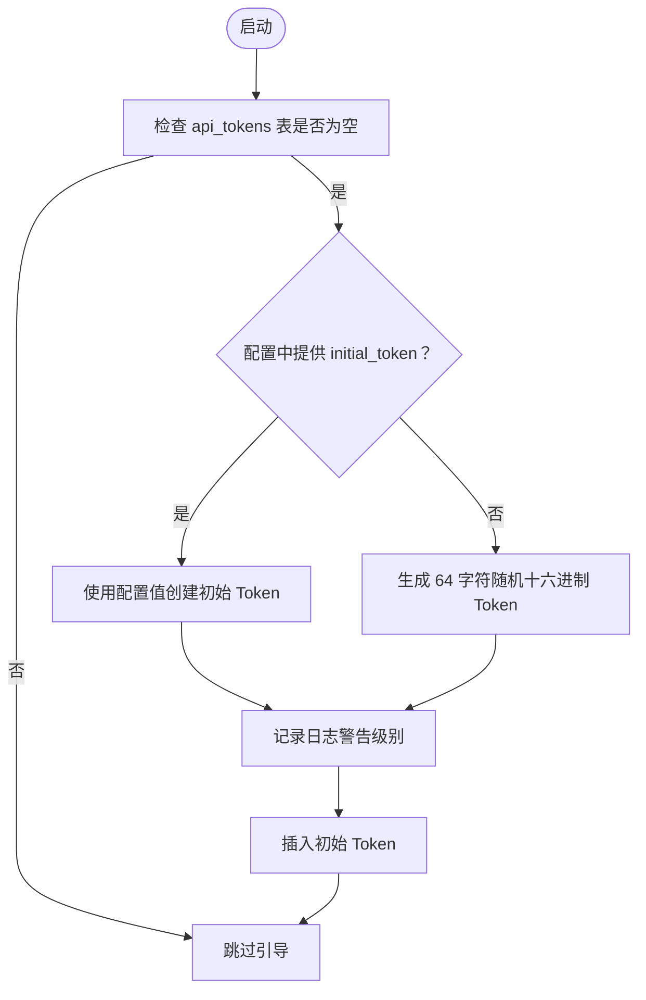
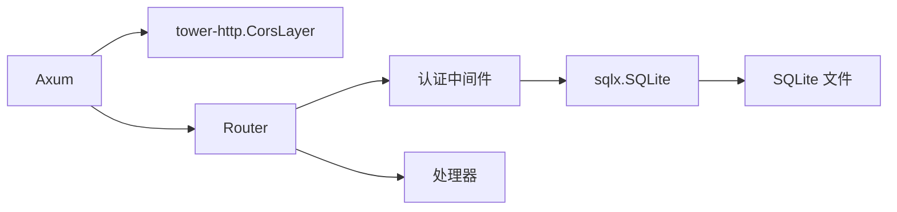

# 安全策略

<cite>
**本文引用的文件**
- [src/main.rs](file://src/main.rs)
- [src/config.rs](file://src/config.rs)
- [src/db.rs](file://src/db.rs)
- [src/error.rs](file://src/error.rs)
- [src/routes.rs](file://src/routes.rs)
- [src/middleware/auth.rs](file://src/middleware/auth.rs)
- [src/models/token.rs](file://src/models/token.rs)
- [src/handlers/token.rs](file://src/handlers/token.rs)
- [src/db/token.rs](file://src/db/token.rs)
- [docs/migrations/20260607044921_init.sql](file://docs/migrations/20260607044921_init.sql)
- [config.toml](file://config.toml)
- [Cargo.toml](file://Cargo.toml)
- [README.md](file://README.md)
- [openspec/specs/initial-token-bootstrap/spec.md](file://openspec/specs/initial-token-bootstrap/spec.md)
- [openspec/changes/archive/2026-06-07-backend-project-setup/design.md](file://openspec/changes/archive/2026-06-07-backend-project-setup/design.md)
</cite>

## 目录
1. [引言](#引言)
2. [项目结构](#项目结构)
3. [核心组件](#核心组件)
4. [架构总览](#架构总览)
5. [详细组件分析](#详细组件分析)
6. [依赖关系分析](#依赖关系分析)
7. [性能与安全权衡](#性能与安全权衡)
8. [故障排查指南](#故障排查指南)
9. [结论](#结论)
10. [附录](#附录)

## 引言
本文件面向“AI-Trend-Tool”项目，提供一套系统化的安全策略文档。内容覆盖整体安全架构、威胁模型与防护措施，密码学与数据/传输安全策略，访问控制矩阵与权限分级，最小权限原则应用，安全配置指南，漏洞扫描与渗透测试建议，日志审计与监控告警，事件响应流程，合规与隐私保护，以及安全更新与补丁管理策略。目标是帮助运维与开发团队在保障功能完整性的同时，建立可落地、可审计、可持续的安全体系。

## 项目结构
从安全视角审视项目结构，后端以 Axum 作为 Web 框架，SQLite 作为本地持久化存储，采用迁移脚本初始化数据库结构；认证采用 Bearer Token，中间件负责统一鉴权；配置通过 TOML 文件集中管理；模块化设计便于分层隔离与最小权限实施。

图表来源
- [src/main.rs:63-96](file://src/main.rs#L63-L96)
- [src/routes.rs:14-50](file://src/routes.rs#L14-L50)
- [src/middleware/auth.rs:14-59](file://src/middleware/auth.rs#L14-L59)
- [src/db.rs:9-25](file://src/db.rs#L9-L25)
- [docs/migrations/20260607044921_init.sql:1-118](file://docs/migrations/20260607044921_init.sql#L1-L118)

章节来源
- [src/main.rs:1-96](file://src/main.rs#L1-L96)
- [src/routes.rs:14-50](file://src/routes.rs#L14-L50)
- [src/db.rs:9-25](file://src/db.rs#L9-L25)
- [docs/migrations/20260607044921_init.sql:1-118](file://docs/migrations/20260607044921_init.sql#L1-L118)

## 核心组件
- 应用入口与引导：负责初始化日志、加载配置、创建数据库目录、建立连接池、执行迁移、确保初始 Token 存在，并启动 HTTP 服务器。
- 路由与中间件：统一挂载认证中间件，对 /api/v1/* 路由进行 Bearer Token 鉴权；健康检查 /health 不受保护。
- 认证中间件：从 Authorization 头提取 Bearer Token，查询数据库校验有效性与撤销状态，检查过期时间，异步更新最近使用时间，注入 ApiToken 至请求扩展。
- Token 管理：提供创建、列表（隐藏明文）、撤销接口；Token 为一次性明文返回，后续仅返回摘要信息。
- 数据库与迁移：SQLite 连接池启用 WAL 模式与外键约束；迁移脚本定义 api_tokens 等核心表结构。
- 配置：TOML 配置包含 server、database、auth、parser、filter、pusher 等段落，支持初始 Token 配置。

章节来源
- [src/main.rs:26-61](file://src/main.rs#L26-L61)
- [src/routes.rs:14-50](file://src/routes.rs#L14-L50)
- [src/middleware/auth.rs:14-59](file://src/middleware/auth.rs#L14-L59)
- [src/handlers/token.rs:13-66](file://src/handlers/token.rs#L13-L66)
- [src/db.rs:9-25](file://src/db.rs#L9-L25)
- [docs/migrations/20260607044921_init.sql:4-12](file://docs/migrations/20260607044921_init.sql#L4-L12)
- [src/config.rs:4-59](file://src/config.rs#L4-L59)

## 架构总览
下图展示安全相关组件的交互关系：客户端通过 HTTP 访问 API；路由层挂载认证中间件；中间件调用数据库校验 Token 并更新使用情况；处理器读取请求扩展中的 ApiToken；数据库层通过连接池访问 SQLite。

图表来源
- [src/routes.rs:44](file://src/routes.rs#L44)
- [src/middleware/auth.rs:18-59](file://src/middleware/auth.rs#L18-L59)
- [src/db/token.rs:40-48](file://src/db/token.rs#L40-L48)
- [src/handlers/token.rs:18-30](file://src/handlers/token.rs#L18-L30)

## 详细组件分析

### 认证与授权中间件
- 提取与校验：从 Authorization 头提取 Bearer Token，校验格式与存在性；查询数据库确认未撤销；检查过期时间；后台异步更新最近使用时间；将 ApiToken 注入请求扩展。
- 风险控制：未提供 Token、格式错误、Token 无效或已撤销、过期均返回 401；数据库错误统一转换为 500。
- 最小权限：中间件仅负责鉴权，不参与业务逻辑，降低耦合与攻击面。

图表来源
- [src/middleware/auth.rs:18-59](file://src/middleware/auth.rs#L18-L59)
- [src/db/token.rs:40-48](file://src/db/token.rs#L40-L48)

章节来源
- [src/middleware/auth.rs:14-59](file://src/middleware/auth.rs#L14-L59)
- [src/error.rs:8-50](file://src/error.rs#L8-L50)

### Token 管理 API
- 创建：生成 64 字符十六进制随机字符串作为 Token，插入数据库并返回完整对象（含明文 Token，仅首次返回）。
- 列表：返回 ApiTokenInfo，隐藏明文字段，避免泄露。
- 撤销：软删除（设置 revoked=1），后续认证中间件会拒绝该 Token。

图表来源
- [src/handlers/token.rs:18-66](file://src/handlers/token.rs#L18-L66)
- [src/db/token.rs:6-28](file://src/db/token.rs#L6-L28)
- [src/db/token.rs:61-67](file://src/db/token.rs#L61-L67)

章节来源
- [src/handlers/token.rs:13-66](file://src/handlers/token.rs#L13-L66)
- [src/db/token.rs:6-107](file://src/db/token.rs#L6-L107)
- [src/models/token.rs:5-46](file://src/models/token.rs#L5-L46)

### 数据库与迁移
- 连接池：启用 WAL 模式与外键约束，提升并发与一致性；最大连接数限制为 5。
- 迁移：api_tokens 表包含唯一 token、撤销标记、过期时间、最后使用时间等字段；其他业务表用于数据采集、关键词匹配、热点事件与推送记录。
- 安全要点：Token 唯一性防止重复；撤销标记支持快速禁用；过期时间支持短期令牌；last_used_at 支持审计追踪。

图表来源
- [docs/migrations/20260607044921_init.sql:4-118](file://docs/migrations/20260607044921_init.sql#L4-L118)

章节来源
- [src/db.rs:9-25](file://src/db.rs#L9-L25)
- [docs/migrations/20260607044921_init.sql:4-118](file://docs/migrations/20260607044921_init.sql#L4-L118)

### 初始 Token 引导
- 首次启动：当 api_tokens 表为空时，系统自动生成初始管理员 Token 或使用配置项；生成的 Token 通过日志警告级别输出，提示保存。
- 安全要点：Token 仅在首次启动且表为空时生成；支持配置覆盖；生成算法满足熵要求；日志输出避免硬编码在生产环境。

图表来源
- [src/main.rs:29-61](file://src/main.rs#L29-L61)
- [openspec/specs/initial-token-bootstrap/spec.md:1-32](file://openspec/specs/initial-token-bootstrap/spec.md#L1-L32)

章节来源
- [src/main.rs:26-61](file://src/main.rs#L26-L61)
- [openspec/specs/initial-token-bootstrap/spec.md:1-32](file://openspec/specs/initial-token-bootstrap/spec.md#L1-L32)

### 错误与响应
- 统一错误响应：根据错误类型映射为标准 HTTP 状态码与错误码；数据库错误统一转为 500。
- 安全要点：不泄露内部错误细节；错误码与消息标准化，便于日志与监控。

章节来源
- [src/error.rs:8-79](file://src/error.rs#L8-L79)

## 依赖关系分析
- Web 框架与中间件：Axum + Tower + tower-http（CORS 层为宽松策略）。
- 数据库：sqlx + SQLite，启用 WAL 与外键。
- 时间与时序：chrono。
- 日志：tracing + tracing-subscriber。
- 随机与编码：rand + hex。
- HTTP 客户端：reqwest（用于推送模块，不在本安全文档讨论范围内）。

图表来源
- [Cargo.toml:8-44](file://Cargo.toml#L8-L44)
- [src/routes.rs:8](file://src/routes.rs#L8)
- [src/db.rs:9-25](file://src/db.rs#L9-L25)

章节来源
- [Cargo.toml:6-44](file://Cargo.toml#L6-L44)
- [src/routes.rs:8](file://src/routes.rs#L8)
- [src/db.rs:9-25](file://src/db.rs#L9-L25)

## 性能与安全权衡
- 连接池与并发：SQLite 默认连接池上限为 5，WAL 模式提升并发读写能力；在高并发 webhook 推送场景下可能出现忙锁（SQLITE_BUSY），应结合实际压测评估。
- CORS 策略：当前为宽松策略，建议在生产环境中收紧为具体来源白名单，降低跨域风险。
- 日志级别：默认 info，建议在生产环境通过环境变量调整，避免泄露敏感信息。

章节来源
- [src/db.rs:13-25](file://src/db.rs#L13-L25)
- [openspec/changes/archive/2026-06-07-backend-project-setup/design.md:83-94](file://openspec/changes/archive/2026-06-07-backend-project-setup/design.md#L83-L94)
- [src/routes.rs:49](file://src/routes.rs#L49)

## 故障排查指南
- 401 未授权
  - 检查请求头是否包含正确的 Bearer Token。
  - 确认 Token 未被撤销且未过期。
  - 查看数据库中 api_tokens 对应记录。
- 500 内部错误
  - 关注日志中的数据库错误条目，定位具体 SQL 语句与表结构。
- Token 管理异常
  - 创建 Token 后仅首次返回明文，请妥善保存。
  - 列表接口不会返回明文，如需再次查看请重新创建。
- CORS 问题
  - 若浏览器跨域失败，检查 CORS 层配置，必要时改为严格来源白名单。

章节来源
- [src/error.rs:23-50](file://src/error.rs#L23-L50)
- [src/middleware/auth.rs:23-46](file://src/middleware/auth.rs#L23-L46)
- [src/db/token.rs:40-48](file://src/db/token.rs#L40-L48)
- [src/routes.rs:49](file://src/routes.rs#L49)

## 结论
本项目在认证与授权方面采用 Bearer Token 与统一中间件，配合数据库层面的唯一性、撤销与过期控制，形成基础但有效的访问控制闭环。建议在生产环境中进一步强化网络边界（CORS 白名单）、传输安全（HTTPS/代理）、日志与监控告警、以及定期的安全评估与补丁管理，以满足更严格的安全部署要求。

## 附录

### 威胁模型与防护措施
- 威胁
  - 未授权访问：缺少或错误的 Bearer Token。
  - Token 泄露：明文 Token 在首次创建时返回。
  - 撤销滞后：Token 被撤销后仍可能短暂生效。
  - CORS 放宽：跨域策略过于宽松导致 CSRF 或信息泄露。
  - 数据库并发：高并发下可能出现忙锁。
- 防护
  - 使用强随机 Token，严格最小权限与过期策略。
  - 仅在首次创建时暴露明文，后续通过摘要列表管理。
  - 中间件严格校验撤销与过期，后台异步更新 last_used_at。
  - 生产环境收紧 CORS，明确允许来源。
  - 结合压测评估连接池与 WAL 模式下的并发表现。

章节来源
- [src/middleware/auth.rs:14-59](file://src/middleware/auth.rs#L14-L59)
- [src/handlers/token.rs:18-30](file://src/handlers/token.rs#L18-L30)
- [src/routes.rs:49](file://src/routes.rs#L49)
- [src/db.rs:13-25](file://src/db.rs#L13-L25)

### 密码学与数据/传输安全
- Token 生成：使用 32 字节随机源并通过十六进制编码生成 64 字符 Token，满足足够熵。
- 数据存储：SQLite 文件存放于配置指定路径；建议对数据库文件进行访问控制与备份加密。
- 传输安全：建议通过反向代理（如 Nginx/Caddy）启用 TLS 终止，确保 API 通道加密。
- 日志安全：避免在生产环境输出明文 Token；使用环境变量控制日志级别。

章节来源
- [src/handlers/token.rs:22-24](file://src/handlers/token.rs#L22-L24)
- [src/main.rs:56-59](file://src/main.rs#L56-L59)
- [config.toml:5-6](file://config.toml#L5-L6)
- [Cargo.toml:35-40](file://Cargo.toml#L35-L40)

### 访问控制矩阵与权限分级
- 角色与权限
  - 管理员：可创建、列出、撤销 Token；可管理数据源、关键词、推送渠道（待实现）。
  - 普通用户：仅持有短期 Token，按需访问受限接口。
- 最小权限原则
  - Token 仅授予完成任务所需的最小权限集合；定期轮换与撤销不再使用的 Token。
  - 通过过期时间与撤销标记实现即时失效。

章节来源
- [src/handlers/token.rs:13-66](file://src/handlers/token.rs#L13-L66)
- [docs/migrations/20260607044921_init.sql:4-12](file://docs/migrations/20260607044921_init.sql#L4-L12)

### 安全配置指南
- 配置项
  - server：监听地址与端口，建议仅内网或通过反向代理暴露。
  - database：SQLite 路径，确保文件权限仅允许运行账户访问。
  - auth：initial_token 可选，建议在首次部署时设置并妥善保管。
  - parser/filter/pusher：并发与重试参数需结合实际负载压测调整。
- 建议
  - 生产环境启用 HTTPS 终止与严格 CORS。
  - 使用只读账户运行数据库文件，限制写权限。
  - 定期轮换 initial_token 与业务 Token。

章节来源
- [config.toml:1-27](file://config.toml#L1-L27)
- [src/config.rs:4-59](file://src/config.rs#L4-L59)

### 漏洞扫描与渗透测试建议
- 静态分析
  - 使用 clippy 检查潜在安全问题；关注未处理的错误与资源泄漏。
- 动态测试
  - 使用 OWASP ZAP 或 Burp Suite 对 /api/v1/* 进行自动化扫描与手工渗透。
  - 验证 CORS、CSRF、敏感信息泄露、暴力破解、越权访问等场景。
- 数据库安全
  - 检查 SQLite 文件权限与备份策略；避免将数据库文件置于可公开访问目录。

章节来源
- [Cargo.toml:43](file://Cargo.toml#L43)
- [README.md:123-194](file://README.md#L123-L194)

### 日志审计、监控告警与事件响应
- 日志
  - 使用 tracing 输出结构化日志；区分 info/warn/error 级别。
  - 记录认证失败、Token 过期、数据库错误等关键事件。
- 监控
  - 指标：请求量、响应时间、错误率、数据库连接池使用率。
  - 告警：针对 401/403/5xx 高频、数据库忙锁、磁盘空间不足等阈值告警。
- 事件响应
  - 发现异常：立即检查日志与数据库状态；临时撤销可疑 Token；回滚变更。
  - 恢复：修复问题后恢复服务，持续观察指标与告警。

章节来源
- [src/error.rs:31-38](file://src/error.rs#L31-L38)
- [src/main.rs:65](file://src/main.rs#L65)

### 合规性、隐私与数据安全最佳实践
- 合规
  - 数据最小化：仅保留必要的 Token 与审计日志。
  - 数据主体权利：提供删除与导出接口（待实现）。
- 隐私
  - 不收集无关用户数据；Token 与日志中避免存储明文敏感信息。
- 最佳实践
  - 定期备份数据库文件；对备份进行加密与访问控制。
  - 使用只读挂载数据库文件，减少写入风险。

章节来源
- [docs/migrations/20260607044921_init.sql:4-12](file://docs/migrations/20260607044921_init.sql#L4-L12)
- [README.md:204-215](file://README.md#L204-L215)

### 安全更新与补丁管理策略
- 依赖更新
  - 定期更新 Cargo 依赖；优先升级安全相关包（sqlx、axum、tower-http、tracing 等）。
- 发布流程
  - 代码审查与安全扫描；CI 中集成 clippy 与单元测试；发布前进行回归测试。
- 应急响应
  - 建立补丁发布与回滚预案；对高危漏洞立即发布修复版本并通知用户。

章节来源
- [Cargo.toml:6-44](file://Cargo.toml#L6-L44)
- [README.md:260-272](file://README.md#L260-L272)