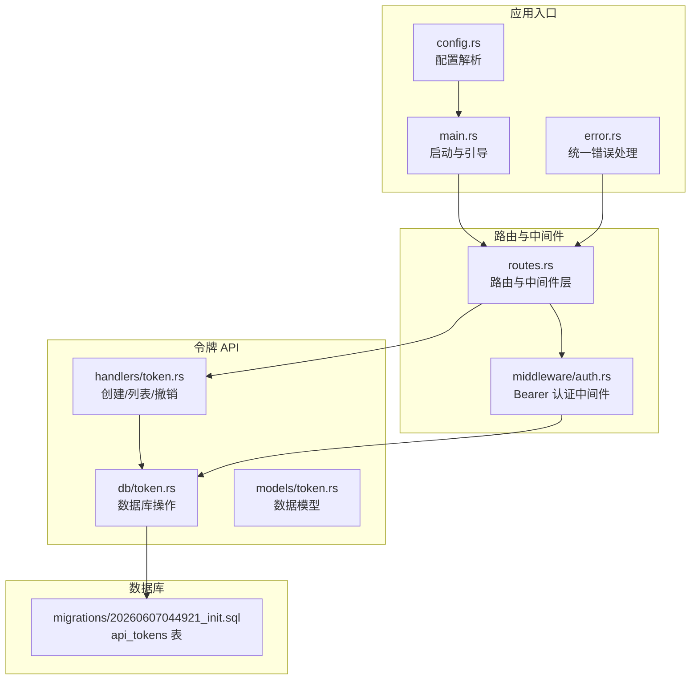
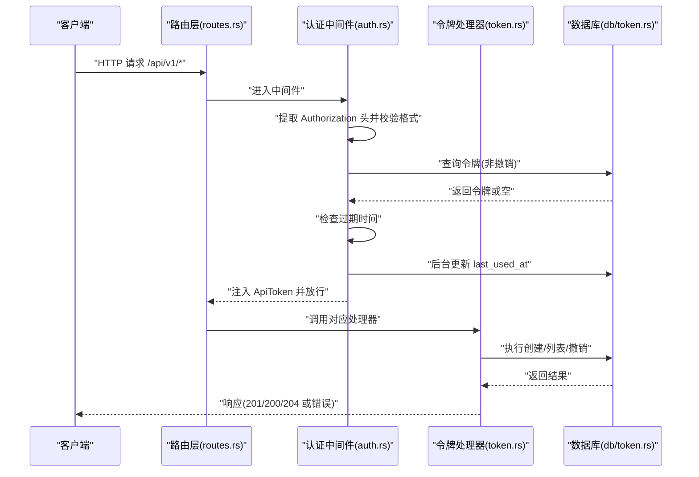
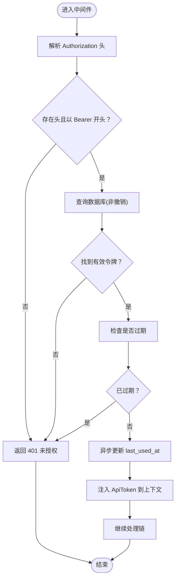
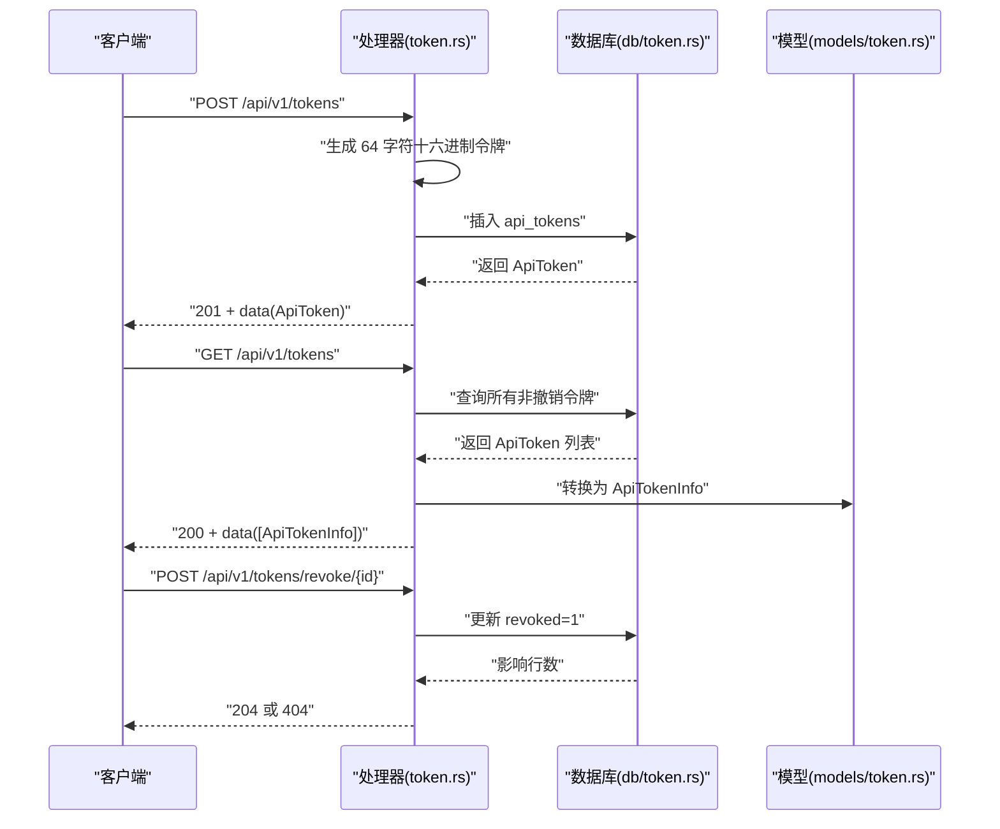
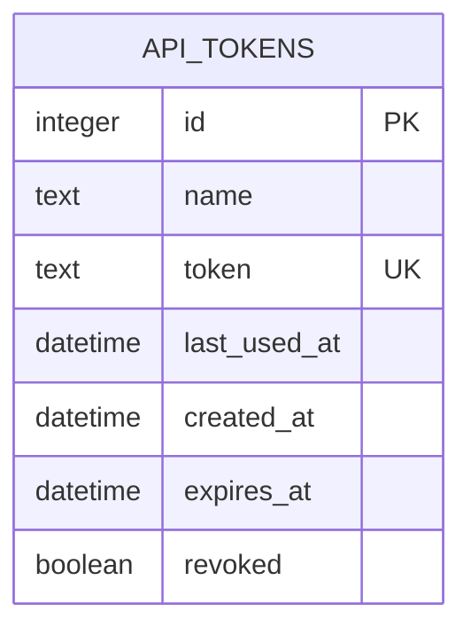
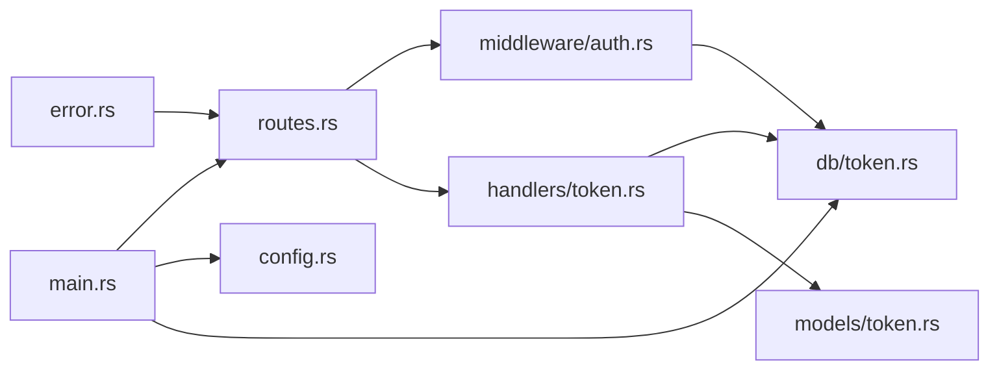

# 认证与授权

<cite>
**本文引用的文件**
- [src/middleware/auth.rs](file://src/middleware/auth.rs)
- [src/handlers/token.rs](file://src/handlers/token.rs)
- [src/models/token.rs](file://src/models/token.rs)
- [src/db/token.rs](file://src/db/token.rs)
- [src/routes.rs](file://src/routes.rs)
- [src/main.rs](file://src/main.rs)
- [docs/apis/token-api.md](file://docs/apis/token-api.md)
- [docs/migrations/20260607044921_init.sql](file://docs/migrations/20260607044921_init.sql)
- [config.toml](file://config.toml)
- [src/error.rs](file://src/error.rs)
- [src/config.rs](file://src/config.rs)
- [Cargo.toml](file://Cargo.toml)
- [src/handlers.rs](file://src/handlers.rs)
- [src/middleware.rs](file://src/middleware.rs)
- [README.md](file://README.md)
</cite>

## 目录
1. [简介](#简介)
2. [项目结构](#项目结构)
3. [核心组件](#核心组件)
4. [架构总览](#架构总览)
5. [详细组件分析](#详细组件分析)
6. [依赖关系分析](#依赖关系分析)
7. [性能考量](#性能考量)
8. [故障排查指南](#故障排查指南)
9. [结论](#结论)
10. [附录](#附录)

## 简介
本文件面向“AI-Trend-Tool”后端的认证与授权体系，聚焦以下主题：
- 令牌认证机制：基于 Bearer Token 的认证流程与中间件实现
- 中间件工作原理：如何从请求头提取令牌、查询数据库、校验撤销与过期、异步更新使用时间、注入上下文
- 权限控制策略：受保护的 API 路由组与错误处理
- 令牌生命周期：创建、列表（隐藏明文）、撤销（软删除）
- 会话管理与令牌存储：数据库表结构与字段语义
- 安全传输与最佳实践：建议的安全措施与审计思路
- 常见威胁防护：令牌泄露、暴力破解、越权访问等
- 令牌 API 使用示例与错误处理参考

## 项目结构
认证与授权相关的关键文件组织如下：
- 中间件：src/middleware/auth.rs
- 路由与状态：src/routes.rs
- 令牌 API 处理器：src/handlers/token.rs
- 数据模型与 DTO：src/models/token.rs
- 数据库操作：src/db/token.rs
- 应用入口与初始令牌引导：src/main.rs
- 配置与错误处理：config.toml、src/config.rs、src/error.rs
- API 文档：docs/apis/token-api.md
- 数据库迁移：docs/migrations/20260607044921_init.sql
- 模块声明：src/handlers.rs、src/middleware.rs
- 顶层说明：README.md、Cargo.toml

**图表来源**
- [src/main.rs:63-96](file://src/main.rs#L63-L96)
- [src/config.rs:52-59](file://src/config.rs#L52-L59)
- [src/error.rs:23-50](file://src/error.rs#L23-L50)
- [src/routes.rs:14-48](file://src/routes.rs#L14-L48)
- [src/middleware/auth.rs:18-59](file://src/middleware/auth.rs#L18-L59)
- [src/handlers/token.rs:18-66](file://src/handlers/token.rs#L18-L66)
- [src/db/token.rs:6-107](file://src/db/token.rs#L6-L107)
- [docs/migrations/20260607044921_init.sql:4-12](file://docs/migrations/20260607044921_init.sql#L4-L12)

**章节来源**
- [src/main.rs:63-96](file://src/main.rs#L63-L96)
- [src/routes.rs:14-48](file://src/routes.rs#L14-L48)
- [src/middleware/auth.rs:18-59](file://src/middleware/auth.rs#L18-L59)
- [src/handlers/token.rs:18-66](file://src/handlers/token.rs#L18-L66)
- [src/db/token.rs:6-107](file://src/db/token.rs#L6-L107)
- [docs/migrations/20260607044921_init.sql:4-12](file://docs/migrations/20260607044921_init.sql#L4-L12)
- [src/error.rs:23-50](file://src/error.rs#L23-L50)
- [src/config.rs:52-59](file://src/config.rs#L52-L50)
- [config.toml:8-11](file://config.toml#L8-L11)

## 核心组件
- 认证中间件：从 Authorization 头提取 Bearer 令牌，查询数据库验证非撤销状态，检查过期时间，异步更新 last_used_at，将 ApiToken 注入请求扩展，供下游处理器使用。
- 令牌 API：提供创建、列表（隐藏明文）、撤销（软删除）三个端点；创建时生成 64 字符十六进制令牌，仅在创建响应中返回一次。
- 数据模型：ApiToken 包含标识、名称、令牌值、最后使用时间、创建时间、过期时间、撤销标记；ApiTokenInfo 用于列表响应，不包含明文 token。
- 数据库层：围绕 api_tokens 表进行插入、查询、更新（撤销/最后使用时间）、计数与初始令牌插入。
- 路由与状态：将认证中间件应用于 /api/v1 路由组，全局启用 CORS；通过 AppState 注入数据库连接池与配置。
- 应用引导：首次启动时确保至少存在一个有效令牌，支持从配置读取或自动生成。

**章节来源**
- [src/middleware/auth.rs:18-59](file://src/middleware/auth.rs#L18-L59)
- [src/handlers/token.rs:18-66](file://src/handlers/token.rs#L18-L66)
- [src/models/token.rs:5-46](file://src/models/token.rs#L5-L46)
- [src/db/token.rs:6-107](file://src/db/token.rs#L6-L107)
- [src/routes.rs:14-48](file://src/routes.rs#L14-L48)
- [src/main.rs:29-61](file://src/main.rs#L29-L61)

## 架构总览
下图展示认证与授权的整体交互：客户端发起受保护请求，中间件拦截并验证令牌，通过后进入处理器，数据库层执行相应操作。

**图表来源**
- [src/routes.rs:14-48](file://src/routes.rs#L14-L48)
- [src/middleware/auth.rs:23-56](file://src/middleware/auth.rs#L23-L56)
- [src/handlers/token.rs:18-66](file://src/handlers/token.rs#L18-L66)
- [src/db/token.rs:40-67](file://src/db/token.rs#L40-L67)

## 详细组件分析

### 认证中间件（Bearer Token）
- 请求头解析：从 Authorization 头提取 Bearer 前缀，若缺失或格式不正确则返回 401。
- 数据库校验：按令牌值查询 api_tokens，要求 revoked=0；若不存在或被撤销则 401。
- 过期检查：若设置 expires_at 且已过期则 401。
- 异步更新：使用 fire-and-forget 方式更新 last_used_at，避免阻塞主响应路径。
- 上下文注入：将 ApiToken 注入 request.extensions，供后续处理器读取。

**图表来源**
- [src/middleware/auth.rs:23-56](file://src/middleware/auth.rs#L23-L56)

**章节来源**
- [src/middleware/auth.rs:18-59](file://src/middleware/auth.rs#L18-L59)

### 令牌 API（Token CRUD）
- POST /api/v1/tokens
  - 功能：创建新令牌，生成 64 字符十六进制字符串，仅在创建响应中返回明文 token。
  - 返回：201，包含完整 ApiToken。
- GET /api/v1/tokens
  - 功能：列出所有令牌，隐藏明文 token，返回 ApiTokenInfo 数组，按创建时间倒序。
- POST /api/v1/tokens/revoke/{id}
  - 功能：撤销指定令牌（软删除），设置 revoked=1；若不存在返回 404。

**图表来源**
- [src/handlers/token.rs:18-66](file://src/handlers/token.rs#L18-L66)
- [src/db/token.rs:6-67](file://src/db/token.rs#L6-L67)
- [src/models/token.rs:17-38](file://src/models/token.rs#L17-L38)

**章节来源**
- [src/handlers/token.rs:18-66](file://src/handlers/token.rs#L18-L66)
- [src/db/token.rs:6-67](file://src/db/token.rs#L6-L67)
- [src/models/token.rs:5-46](file://src/models/token.rs#L5-L46)
- [docs/apis/token-api.md:62-198](file://docs/apis/token-api.md#L62-L198)

### 数据模型与数据库层
- ApiToken 字段：id、name、token、last_used_at、created_at、expires_at、revoked。
- ApiTokenInfo：用于列表响应，不含 token 明文。
- 数据库操作：创建、列表、按 id 查询、按值查询、更新 last_used_at、撤销、计数、插入初始令牌、删除。

**图表来源**
- [docs/migrations/20260607044921_init.sql:4-12](file://docs/migrations/20260607044921_init.sql#L4-L12)
- [src/models/token.rs:5-25](file://src/models/token.rs#L5-L25)

**章节来源**
- [src/models/token.rs:5-46](file://src/models/token.rs#L5-L46)
- [src/db/token.rs:6-107](file://src/db/token.rs#L6-L107)
- [docs/migrations/20260607044921_init.sql:4-12](file://docs/migrations/20260607044921_init.sql#L4-L12)

### 路由与状态（AppState）
- 将认证中间件应用于 /api/v1 路由组，使用 from_fn_with_state 注入 AppState（包含数据库连接池与配置）。
- 全局启用宽松 CORS，便于前端调试。

**章节来源**
- [src/routes.rs:14-48](file://src/routes.rs#L14-L48)

### 应用引导与初始令牌
- 首次启动：若 api_tokens 表为空，优先使用配置中的 auth.initial_token，否则自动生成 64 字符十六进制令牌并通过日志警告输出（仅一次）。
- 启动后打印当前活跃令牌数量与首个可用令牌，便于复制使用。

**章节来源**
- [src/main.rs:29-61](file://src/main.rs#L29-L61)
- [config.toml:8-11](file://config.toml#L8-L11)
- [README.md:78-90](file://README.md#L78-L90)

## 依赖关系分析
- 中间件依赖：从请求头提取令牌、查询数据库、时间比较、异步任务。
- 处理器依赖：模型转换、数据库操作、统一响应封装。
- 路由依赖：中间件层、状态注入、CORS。
- 应用入口依赖：配置加载、数据库连接池、迁移执行、初始令牌引导。
- 错误处理：统一 AppError 与 ApiResponse，保证错误格式一致。

**图表来源**
- [src/middleware/auth.rs:18-59](file://src/middleware/auth.rs#L18-L59)
- [src/handlers/token.rs:18-66](file://src/handlers/token.rs#L18-L66)
- [src/db/token.rs:6-107](file://src/db/token.rs#L6-L107)
- [src/models/token.rs:5-46](file://src/models/token.rs#L5-L46)
- [src/routes.rs:14-48](file://src/routes.rs#L14-L48)
- [src/main.rs:63-96](file://src/main.rs#L63-L96)
- [src/error.rs:23-50](file://src/error.rs#L23-L50)

**章节来源**
- [src/middleware/auth.rs:18-59](file://src/middleware/auth.rs#L18-L59)
- [src/handlers/token.rs:18-66](file://src/handlers/token.rs#L18-L66)
- [src/db/token.rs:6-107](file://src/db/token.rs#L6-L107)
- [src/models/token.rs:5-46](file://src/models/token.rs#L5-L46)
- [src/routes.rs:14-48](file://src/routes.rs#L14-L48)
- [src/main.rs:63-96](file://src/main.rs#L63-L96)
- [src/error.rs:23-50](file://src/error.rs#L23-L50)

## 性能考量
- 异步更新 last_used_at：使用 tokio::spawn 后台更新，避免阻塞主响应路径，降低延迟。
- 数据库索引：api_tokens 表的 token 字段唯一索引与撤销标记配合查询，减少扫描成本。
- 路由中间件层：仅对 /api/v1 路由组应用中间件，避免对 /health 等公开接口产生额外开销。
- 令牌生成：使用随机字节生成 64 字符十六进制令牌，熵足够高，适合生产使用。

**章节来源**
- [src/middleware/auth.rs:48-53](file://src/middleware/auth.rs#L48-L53)
- [docs/migrations/20260607044921_init.sql:7](file://docs/migrations/20260607044921_init.sql#L7)
- [src/handlers/token.rs:22-24](file://src/handlers/token.rs#L22-L24)

## 故障排查指南
- 401 未授权
  - 缺失 Authorization 头或格式错误：检查请求头是否为 Bearer <token>。
  - 令牌无效或已被撤销：确认令牌存在于 api_tokens 且 revoked=0。
  - 令牌已过期：检查 expires_at 是否早于当前时间。
- 404 未找到
  - 撤销接口传入不存在的 id：确认目标令牌是否存在。
- 500 内部错误
  - 数据库异常：查看日志中的 DATABASE_ERROR，定位具体 SQL 问题。
- 常见问题定位
  - 初始令牌未生成：确认首次启动日志是否输出 INITIAL TOKEN。
  - CORS 问题：确认已启用宽松 CORS，或根据需要调整策略。

**章节来源**
- [src/middleware/auth.rs:23-46](file://src/middleware/auth.rs#L23-L46)
- [src/handlers/token.rs:53-62](file://src/handlers/token.rs#L53-L62)
- [src/error.rs:23-50](file://src/error.rs#L23-L50)
- [src/main.rs:57-59](file://src/main.rs#L57-L59)

## 结论
本认证与授权方案以 Bearer Token 为核心，结合中间件拦截、数据库校验、异步更新与统一错误处理，实现了简洁可靠的访问控制。通过初始令牌引导与三端令牌 API，满足了系统启动与日常运维需求。建议在生产环境中配合 HTTPS、最小权限原则、定期轮换与审计日志进一步强化安全。

## 附录

### JWT 说明与替代建议
- 当前实现使用“API 密钥式令牌”，而非 JWT。其优势在于简单、易审计、撤销即时生效；缺点是缺少内置声明与跨域签发能力。
- 若未来需要引入 JWT：
  - 生成：使用密钥签名，包含 exp、iat、sub 等必要声明。
  - 验证：校验签名、过期时间、发行方与受众。
  - 刷新：采用短期访问令牌 + 长期刷新令牌的双令牌模型，刷新令牌存储于安全介质并限制刷新频率。
  - 存储：前端仅保存访问令牌，刷新令牌不落地或加密存储；服务端严格校验刷新令牌来源与使用次数。
  - 传输：必须使用 HTTPS，禁止明文传输；Cookie 设置 SameSite、HttpOnly、Secure。
  - 审计：记录登录、登出、令牌刷新、撤销等关键事件，保留日志以便追溯。

### 令牌 API 使用示例与错误处理
- 获取健康状态（无需认证）
  - curl http://localhost:8080/health
- 使用初始令牌创建新令牌
  - curl -X POST http://localhost:8080/api/v1/tokens \
    -H "Authorization: Bearer <initial-token>" \
    -H "Content-Type: application/json" \
    -d '{"name": "My API Token"}'
- 列出所有令牌（隐藏明文）
  - curl http://localhost:8080/api/v1/tokens -H "Authorization: Bearer <token>"
- 撤销指定令牌
  - curl -X POST http://localhost:8080/api/v1/tokens/revoke/1 -H "Authorization: Bearer <token>"
- 错误格式
  - 统一返回 { "error": { "code": "...", "message": "..." } }，状态码与错误码参见 API 文档。

**章节来源**
- [docs/apis/token-api.md:42-198](file://docs/apis/token-api.md#L42-L198)
- [README.md:123-203](file://README.md#L123-L203)

### 安全考虑与最佳实践
- 传输安全
  - 强制使用 HTTPS，禁用明文 HTTP。
  - 对外暴露的 API 仅在受信网络内开放，或通过反向代理统一接入。
- 令牌管理
  - 令牌长度足够（当前 64 字符十六进制），建议定期轮换。
  - 撤销立即生效（revoked=1），避免缓存导致的延迟。
  - 不在日志中打印明文令牌；如需记录，仅记录摘要或部分片段。
- 权限与最小权限
  - 为不同用途创建专用令牌，限制过期时间与使用范围。
  - 对敏感操作（如创建/撤销）使用更高权限令牌。
- 审计与监控
  - 记录每次认证尝试（成功/失败）、令牌使用、撤销与创建事件。
  - 监控异常模式（频繁失败、短时间大量请求、来自同一 IP 的批量撤销）。
- 防护措施
  - 防爆破：速率限制、IP 黑名单、验证码（可选）。
  - 防越权：严格区分令牌用途与权限边界，避免共享高权限令牌。
  - 防泄露：前端不存储明文令牌，服务端不落盘明文；必要时使用硬件安全模块（HSM）或密钥管理系统（KMS）。

### 会话管理与令牌存储
- 会话：本实现不维护服务端会话，采用无状态令牌验证。
- 令牌存储：api_tokens 表存储明文 token（仅创建时可见），配合撤销标记与过期时间实现控制。
- 建议：生产环境可考虑对明文 token 进行哈希存储并在查询时比对摘要，但当前实现已通过“仅创建时可见”的设计降低泄露面。

**章节来源**
- [docs/migrations/20260607044921_init.sql:4-12](file://docs/migrations/20260607044921_init.sql#L4-L12)
- [src/handlers/token.rs:22-29](file://src/handlers/token.rs#L22-L29)