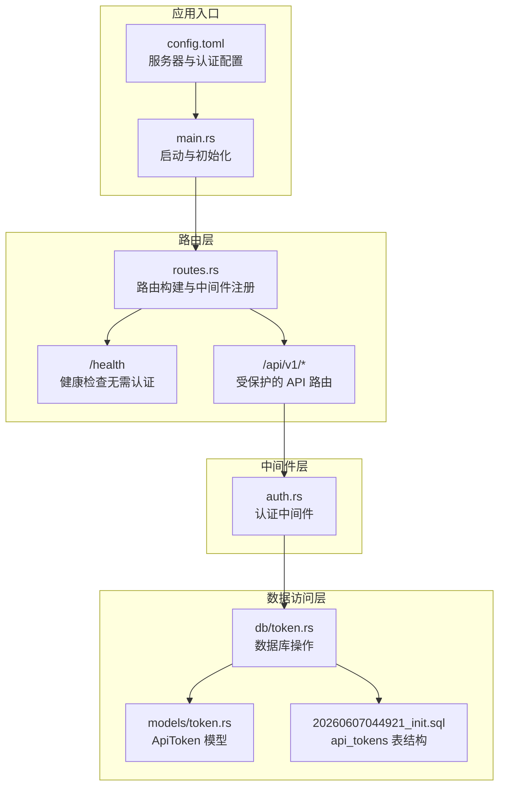
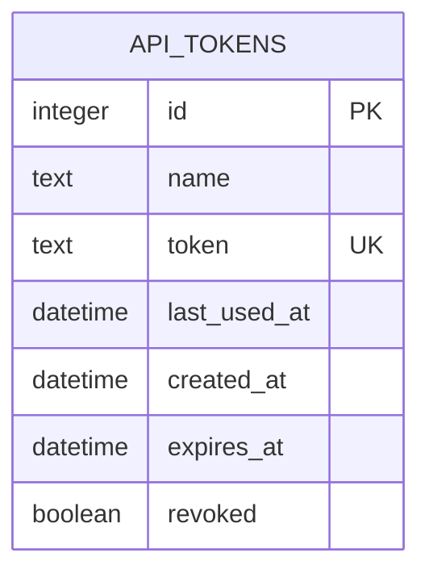
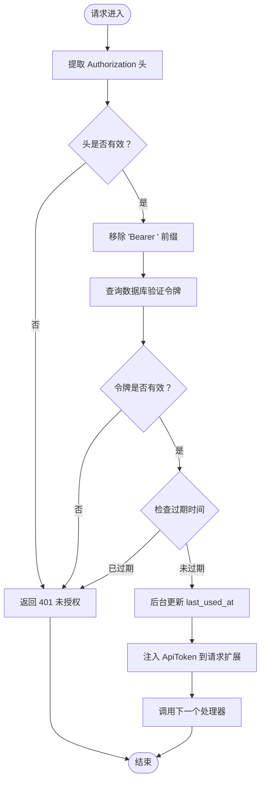
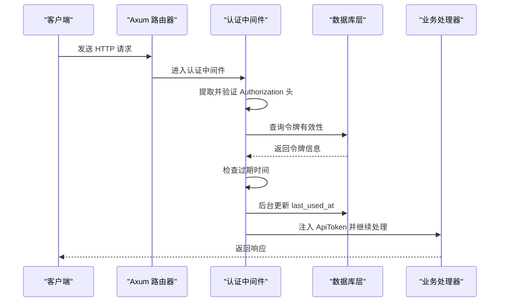
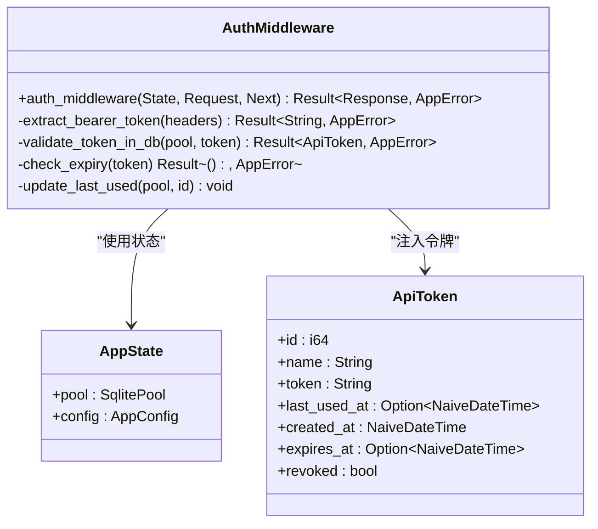
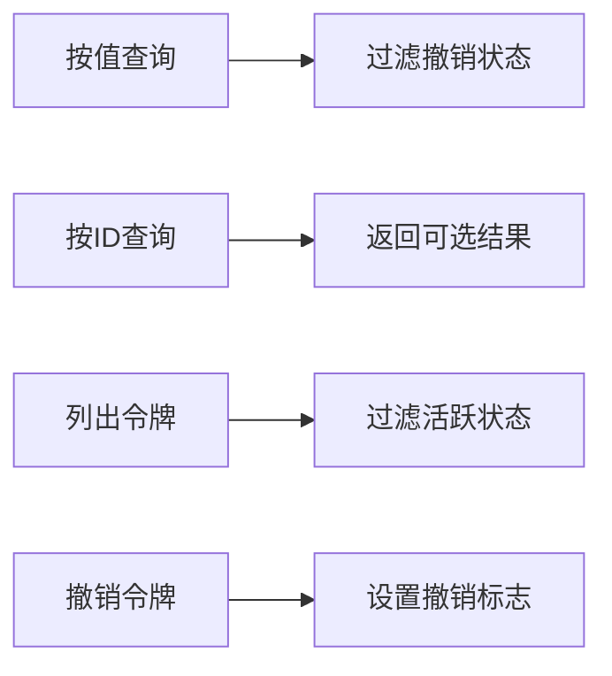
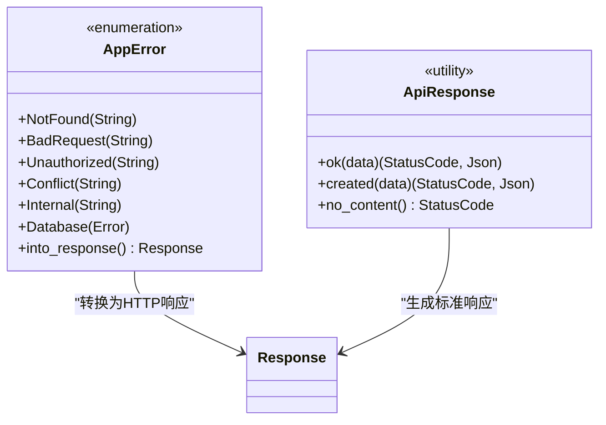
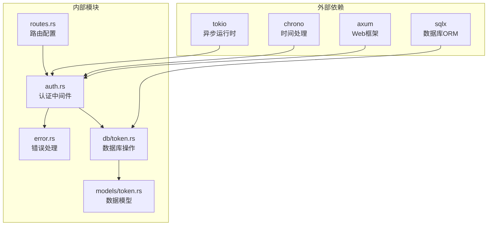

# 认证中间件

<cite>
**本文档引用的文件**
- [src/middleware/auth.rs](file://src/middleware/auth.rs)
- [src/middleware.rs](file://src/middleware.rs)
- [src/routes.rs](file://src/routes.rs)
- [src/error.rs](file://src/error.rs)
- [src/db/token.rs](file://src/db/token.rs)
- [src/models/token.rs](file://src/models/token.rs)
- [src/main.rs](file://src/main.rs)
- [config.toml](file://config.toml)
- [Cargo.toml](file://Cargo.toml)
- [docs/migrations/20260607044921_init.sql](file://docs/migrations/20260607044921_init.sql)
- [openspec/specs/auth-middleware/spec.md](file://openspec/specs/auth-middleware/spec.md)
- [docs/apis/token-api.md](file://docs/apis/token-api.md)
</cite>

## 目录
1. [简介](#简介)
2. [项目结构](#项目结构)
3. [核心组件](#核心组件)
4. [架构概览](#架构概览)
5. [详细组件分析](#详细组件分析)
6. [依赖分析](#依赖分析)
7. [性能考虑](#性能考虑)
8. [故障排除指南](#故障排除指南)
9. [结论](#结论)
10. [附录](#附录)

## 简介
本文件为 AI-Trend-Tool 认证中间件的详细技术文档，深入解释中间件的实现原理、请求拦截机制和身份验证流程。文档涵盖以下关键主题：
- JWT 令牌的解析、验证和用户信息提取过程（在本项目中使用自定义 API Token）
- 中间件的配置选项、错误处理策略和性能优化技巧
- 中间件集成的最佳实践和常见问题解决方案
- 与其他中间件的协作关系和执行顺序
- 安全考虑事项，包括 CSRF 防护、XSS 防范和会话劫持防护

## 项目结构
AI-Trend-Tool 采用模块化设计，认证中间件位于 `src/middleware/auth.rs`，并通过路由层注册到 `/api/v1/*` 路由组。整体结构如下：

**图表来源**
- [src/main.rs:63-96](file://src/main.rs#L63-L96)
- [src/routes.rs:14-50](file://src/routes.rs#L14-L50)
- [src/middleware/auth.rs:18-59](file://src/middleware/auth.rs#L18-L59)
- [src/db/token.rs:40-48](file://src/db/token.rs#L40-L48)
- [docs/migrations/20260607044921_init.sql:4-12](file://docs/migrations/20260607044921_init.sql#L4-L12)

**章节来源**
- [src/main.rs:63-96](file://src/main.rs#L63-L96)
- [src/routes.rs:14-50](file://src/routes.rs#L14-L50)
- [src/middleware.rs:1-3](file://src/middleware.rs#L1-L3)

## 核心组件
本节对认证中间件的关键组件进行深入分析，包括数据模型、数据库操作和中间件逻辑。

### 数据模型与数据库结构
系统使用 SQLite 存储 API Token，核心数据结构如下：

**图表来源**
- [docs/migrations/20260607044921_init.sql:4-12](file://docs/migrations/20260607044921_init.sql#L4-L12)
- [src/models/token.rs:5-14](file://src/models/token.rs#L5-L14)

### 认证中间件核心流程
认证中间件的执行流程如下：

**图表来源**
- [src/middleware/auth.rs:23-59](file://src/middleware/auth.rs#L23-L59)
- [src/db/token.rs:40-48](file://src/db/token.rs#L40-L48)

**章节来源**
- [src/models/token.rs:5-46](file://src/models/token.rs#L5-L46)
- [src/db/token.rs:40-67](file://src/db/token.rs#L40-L67)
- [src/middleware/auth.rs:18-59](file://src/middleware/auth.rs#L18-L59)

## 架构概览
认证中间件在整个系统中的位置和交互关系如下：

**图表来源**
- [src/routes.rs:44-44](file://src/routes.rs#L44-L44)
- [src/middleware/auth.rs:23-59](file://src/middleware/auth.rs#L23-L59)
- [src/db/token.rs:50-59](file://src/db/token.rs#L50-L59)

## 详细组件分析

### 认证中间件实现
认证中间件实现了严格的令牌验证流程，确保每个请求都经过有效的身份验证。

#### 请求拦截机制
中间件通过 Axum 的 `from_fn_with_state` 机制注册到路由层，对 `/api/v1/*` 路由组生效：

**图表来源**
- [src/middleware/auth.rs:18-59](file://src/middleware/auth.rs#L18-L59)
- [src/routes.rs:56-60](file://src/routes.rs#L56-L60)
- [src/models/token.rs:5-14](file://src/models/token.rs#L5-L14)

#### 身份验证流程详解
身份验证流程包含五个关键步骤：

1. **令牌提取**：从 Authorization 头部提取 Bearer 令牌
2. **数据库验证**：查询 api_tokens 表验证令牌存在且未被撤销
3. **过期检查**：比较 expires_at 与当前时间
4. **后台更新**：异步更新 last_used_at 字段
5. **令牌注入**：将完整 ApiToken 结构体注入到请求扩展中

**章节来源**
- [src/middleware/auth.rs:23-59](file://src/middleware/auth.rs#L23-L59)
- [openspec/specs/auth-middleware/spec.md:9-68](file://openspec/specs/auth-middleware/spec.md#L9-L68)

### 数据库操作层
数据库层提供了完整的令牌管理功能，包括创建、查询、更新和撤销操作。

#### 令牌查询操作

**图表来源**
- [src/db/token.rs:40-48](file://src/db/token.rs#L40-L48)
- [src/db/token.rs:30-38](file://src/db/token.rs#L30-L38)
- [src/db/token.rs:22-28](file://src/db/token.rs#L22-L28)
- [src/db/token.rs:61-67](file://src/db/token.rs#L61-L67)

**章节来源**
- [src/db/token.rs:6-107](file://src/db/token.rs#L6-L107)

### 错误处理策略
系统采用统一的错误处理机制，所有错误都转换为标准的 JSON 响应格式：

**图表来源**
- [src/error.rs:8-50](file://src/error.rs#L8-L50)
- [src/error.rs:61-79](file://src/error.rs#L61-L79)

**章节来源**
- [src/error.rs:8-79](file://src/error.rs#L8-L79)

## 依赖分析
认证中间件的依赖关系清晰明确，遵循单一职责原则：

**图表来源**
- [Cargo.toml:6-44](file://Cargo.toml#L6-L44)
- [src/middleware/auth.rs:1-12](file://src/middleware/auth.rs#L1-L12)
- [src/routes.rs:1-12](file://src/routes.rs#L1-L12)

**章节来源**
- [Cargo.toml:6-44](file://Cargo.toml#L6-L44)
- [src/middleware/auth.rs:1-12](file://src/middleware/auth.rs#L1-L12)

## 性能考虑
认证中间件在保证安全性的同时，采用了多项性能优化措施：

### 异步后台更新
- 使用 `tokio::spawn` 异步更新 last_used_at，避免阻塞主请求响应
- 更新操作采用 fire-and-forget 模式，即使失败也不会影响请求处理

### 数据库查询优化
- 使用参数化查询防止 SQL 注入
- 通过索引优化令牌查询性能
- 仅查询必要的字段，减少网络传输

### 内存管理
- 使用 `clone()` 创建轻量级连接池副本
- 避免不必要的数据拷贝和字符串操作

## 故障排除指南
本节提供常见问题的诊断和解决方法：

### 常见错误场景
1. **缺少 Authorization 头**
   - 现象：返回 401 未授权
   - 解决：确保请求头包含正确的 Bearer 令牌

2. **无效或已撤销的令牌**
   - 现象：返回 401 未授权
   - 解决：检查令牌是否存在于数据库且未被撤销

3. **令牌过期**
   - 现象：返回 401 未授权
   - 解决：生成新的令牌或延长有效期

### 调试建议
- 启用详细的日志记录以跟踪认证流程
- 检查数据库连接状态和查询性能
- 验证时间同步和时区设置

**章节来源**
- [src/error.rs:23-50](file://src/error.rs#L23-L50)
- [openspec/specs/auth-middleware/spec.md:13-49](file://openspec/specs/auth-middleware/spec.md#L13-L49)

## 结论
AI-Trend-Tool 的认证中间件实现了简洁而高效的身份验证机制。通过严格的令牌验证、异步性能优化和完善的错误处理，该中间件为整个系统的安全运行提供了坚实基础。其模块化设计使得代码易于维护和扩展，同时保持了良好的性能表现。

## 附录

### 配置选项
- **服务器配置**：主机地址、端口号
- **数据库配置**：SQLite 文件路径
- **认证配置**：初始令牌设置

### API 规范
- **健康检查**：`GET /health` - 无需认证
- **令牌管理**：`POST /api/v1/tokens` - 创建新令牌
- **令牌列表**：`GET /api/v1/tokens` - 查看所有令牌
- **令牌撤销**：`POST /api/v1/tokens/revoke/{id}` - 撤销指定令牌

### 安全最佳实践
- 使用 HTTPS 传输令牌
- 定期轮换令牌
- 实施适当的速率限制
- 监控异常访问模式

**章节来源**
- [config.toml:1-27](file://config.toml#L1-L27)
- [docs/apis/token-api.md:42-198](file://docs/apis/token-api.md#L42-L198)