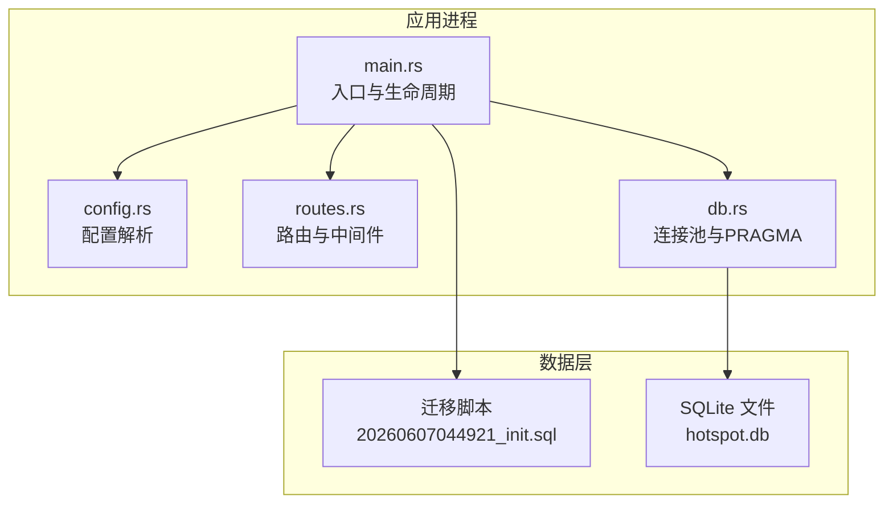
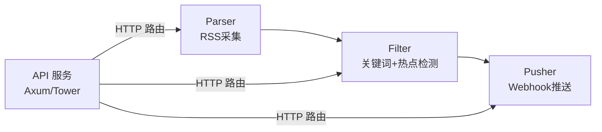
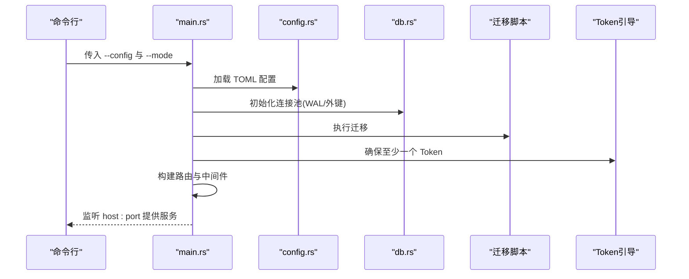
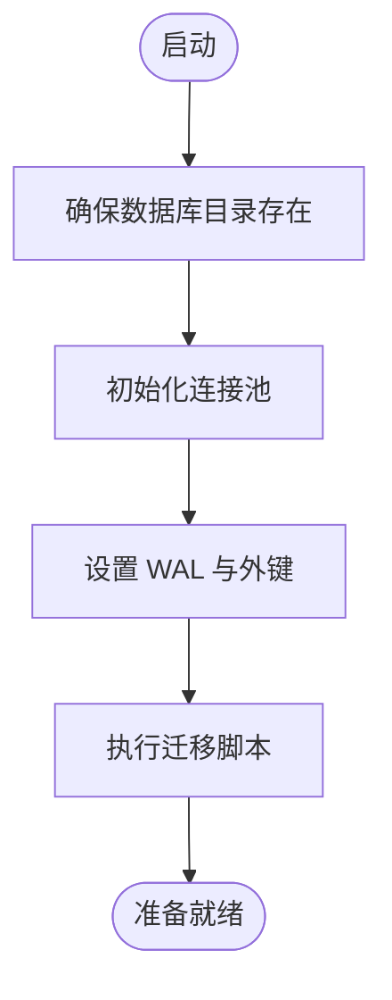
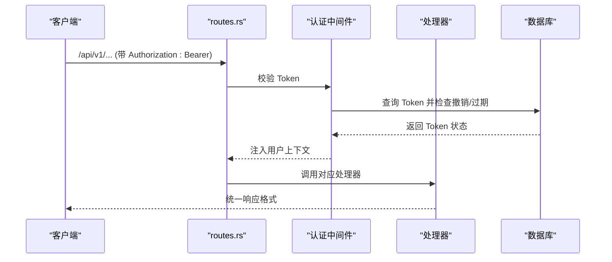
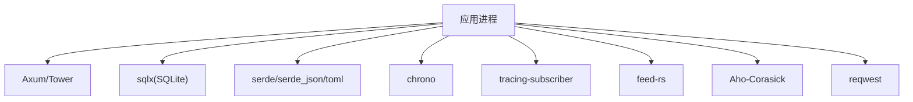

# 部署与运维

<cite>
**本文引用的文件**
- [README.md](file://README.md)
- [Cargo.toml](file://Cargo.toml)
- [config.toml](file://config.toml)
- [src/main.rs](file://src/main.rs)
- [src/config.rs](file://src/config.rs)
- [src/routes.rs](file://src/routes.rs)
- [src/db.rs](file://src/db.rs)
- [docs/migrations/20260607044921_init.sql](file://docs/migrations/20260607044921_init.sql)
- [openspec/changes/archive/2026-06-07-backend-project-setup/specs/backend-project-scaffold/spec.md](file://openspec/changes/archive/2026-06-07-backend-project-setup/specs/backend-project-scaffold/spec.md)
- [openspec/changes/archive/2026-06-07-backend-project-setup/design.md](file://openspec/changes/archive/2026-06-07-backend-project-setup/design.md)
- [docs/Live-Artifact/template.html](file://docs/Live-Artifact/template.html)
</cite>

## 目录
1. [简介](#简介)
2. [项目结构](#项目结构)
3. [核心组件](#核心组件)
4. [架构总览](#架构总览)
5. [详细组件分析](#详细组件分析)
6. [依赖关系分析](#依赖关系分析)
7. [性能考虑](#性能考虑)
8. [故障排除指南](#故障排除指南)
9. [结论](#结论)
10. [附录](#附录)

## 简介
本指南面向运维与开发团队，提供 AI 热点监控系统（TrendAITool）的完整部署与运维实践，涵盖系统要求、依赖安装、构建配置、服务配置、多环境差异、进程管理、服务监控与健康检查、性能调优、资源监控与容量规划、故障排除、备份恢复与灾难恢复，以及自动化部署与 CI/CD 集成建议。

## 项目结构
系统采用 Rust + Axum 的后端架构，模块化组织如下：
- 配置层：解析 TOML 配置文件，封装各子系统参数
- 数据访问层：基于 sqlx 初始化 SQLite 连接池，启用 WAL 与外键约束
- 路由与中间件：注册 API 路由与认证中间件，提供健康检查
- 业务服务层：后台模块（Parser/Filter/Pusher）在后续版本中逐步实现
- 文档与规格：迁移脚本、OpenSpec 规格与实施计划

**图表来源**
- [src/main.rs:63-95](file://src/main.rs#L63-L95)
- [src/config.rs:52-59](file://src/config.rs#L52-L59)
- [src/routes.rs:14-50](file://src/routes.rs#L14-L50)
- [src/db.rs:11-25](file://src/db.rs#L11-L25)
- [docs/migrations/20260607044921_init.sql:1-118](file://docs/migrations/20260607044921_init.sql#L1-L118)

**章节来源**
- [README.md:216-257](file://README.md#L216-L257)
- [src/main.rs:63-95](file://src/main.rs#L63-L95)
- [src/config.rs:52-59](file://src/config.rs#L52-L59)
- [src/routes.rs:14-50](file://src/routes.rs#L14-L50)
- [src/db.rs:11-25](file://src/db.rs#L11-L25)
- [docs/migrations/20260607044921_init.sql:1-118](file://docs/migrations/20260607044921_init.sql#L1-L118)

## 核心组件
- 配置系统：支持 server、database、auth、parser、filter、pusher 等段落，通过 TOML 加载
- 数据库：SQLite，WAL 模式 + 外键约束；自动迁移
- 认证与 Token：Bearer Token，支持创建、列表、撤销
- 健康检查：/health 返回结构化 JSON
- 后台模块：Parser/Filter/Pusher（按 README 描述，当前处于逐步实现阶段）

**章节来源**
- [config.toml:1-27](file://config.toml#L1-L27)
- [src/config.rs:4-51](file://src/config.rs#L4-L51)
- [src/routes.rs:46-54](file://src/routes.rs#L46-L54)
- [README.md:91-121](file://README.md#L91-L121)

## 架构总览
系统采用“管道模式”的后台任务架构，三类后台模块独立运行，支持按需组合启动：
- Parser：周期性抓取 RSS，去重入库
- Filter：关键词匹配与统计突发检测，生成热点事件与推送记录
- Pusher：轮询待推送记录，指数退避重试并乐观锁防重复

**图表来源**
- [README.md:7-23](file://README.md#L7-L23)

**章节来源**
- [README.md:7-23](file://README.md#L7-L23)

## 详细组件分析

### 配置与启动流程
- CLI 参数：--config 指定配置文件路径；--mode 指定运行模式（all/api/parser/filter/pusher）
- 初始化顺序：读取配置 → 确保数据库目录存在 → 初始化连接池（WAL + 外键）→ 执行迁移 → 确保至少一个 Token 存在（首次启动自动生成或从配置注入）→ 构建路由 → 启动 HTTP 服务

**图表来源**
- [src/main.rs:63-95](file://src/main.rs#L63-L95)
- [src/config.rs:52-59](file://src/config.rs#L52-L59)
- [src/db.rs:11-25](file://src/db.rs#L11-L25)
- [docs/migrations/20260607044921_init.sql:1-118](file://docs/migrations/20260607044921_init.sql#L1-L118)

**章节来源**
- [src/main.rs:63-95](file://src/main.rs#L63-L95)
- [src/config.rs:52-59](file://src/config.rs#L52-L59)
- [src/db.rs:11-25](file://src/db.rs#L11-L25)
- [docs/migrations/20260607044921_init.sql:1-118](file://docs/migrations/20260607044921_init.sql#L1-L118)

### 数据库与迁移
- 连接池：最大连接数 5，SQLite URL 使用只读写模式
- PRAGMA：开启 WAL 日志模式与外键约束
- 迁移：首次启动自动执行，创建 api_tokens、data_sources、articles、keywords、hot_events、push_channels、push_records 等表，并建立必要索引

**图表来源**
- [src/db.rs:11-25](file://src/db.rs#L11-L25)
- [docs/migrations/20260607044921_init.sql:1-118](file://docs/migrations/20260607044921_init.sql#L1-L118)

**章节来源**
- [src/db.rs:11-25](file://src/db.rs#L11-L25)
- [docs/migrations/20260607044921_init.sql:1-118](file://docs/migrations/20260607044921_init.sql#L1-L118)

### API 与认证
- 路由：/health 健康检查；/api/v1 下挂载 Token、数据源、关键词、推送渠道等管理接口
- 中间件：Bearer Token 认证，校验 Token 是否存在、是否撤销、是否过期，并更新最后使用时间
- 统一错误/成功响应：错误响应包含 code 与 message；成功响应为 { "data": ... } 或 204

**图表来源**
- [src/routes.rs:14-50](file://src/routes.rs#L14-L50)
- [README.md:125-142](file://README.md#L125-L142)

**章节来源**
- [src/routes.rs:14-50](file://src/routes.rs#L14-L50)
- [README.md:125-142](file://README.md#L125-L142)

### 健康检查机制
- /health 返回结构化 JSON {"status":"ok"}
- 建议在负载均衡/容器编排中作为存活探针与就绪探针使用

**章节来源**
- [src/routes.rs:52-54](file://src/routes.rs#L52-L54)
- [README.md:166-171](file://README.md#L166-L171)

## 依赖关系分析
- 语言与框架：Rust 1.75+、Tokio 运行时、Axum/Tower、sqlx
- 数据库：SQLite（WAL 模式）、外键约束
- 序列化：serde/serde_json/toml
- 时间与时序：chrono
- 日志：tracing/tracing-subscriber
- 其他：feed-rs（RSS）、Aho-Corasick（关键词匹配）、reqwest（Webhook）

**图表来源**
- [Cargo.toml:6-44](file://Cargo.toml#L6-L44)

**章节来源**
- [Cargo.toml:6-44](file://Cargo.toml#L6-L44)

## 性能考虑
- 连接池与并发
  - 当前最大连接数为 5；在高并发推送场景下可能出现 SQLITE_BUSY。建议根据压测结果适度提升连接数
  - Parser/Filter/Pusher 的并发度可通过配置项控制（如 Parser 最大并发抓取数）
- 数据库优化
  - WAL 模式与外键约束已启用；建议定期分析热点查询与索引覆盖情况
  - 对 articles、hot_events、push_records 等高频表的索引进行监控
- 网络与外部服务
  - Parser 默认超时与 UA 可配置；Pusher 指数退避与最大重试次数可调
- 日志与可观测性
  - 使用 env-filter 控制日志级别；建议在生产环境调整为 info 或 warn

**章节来源**
- [openspec/changes/archive/2026-06-07-backend-project-setup/design.md:83-88](file://openspec/changes/archive/2026-06-07-backend-project-setup/design.md#L83-L88)
- [src/db.rs:14-16](file://src/db.rs#L14-L16)
- [config.toml:12-27](file://config.toml#L12-L27)

## 故障排除指南
- 启动失败（配置加载）
  - 现象：启动时报配置解析错误或缺失
  - 排查：确认 config.toml 路径正确、字段类型匹配；参考规格文档对配置的要求
- 数据库无法打开/迁移失败
  - 现象：提示数据库文件不可写或迁移失败
  - 排查：确认数据库文件所在目录存在且可写；检查 WAL/外键 PRAGMA 是否生效
- SQLITE_BUSY（高并发推送）
  - 现象：出现 SQLITE_BUSY 错误
  - 排查：降低并发或提升连接池上限；检查是否存在长时间事务阻塞
- 认证失败
  - 现象：401/404/409/500 等错误
  - 排查：确认 Token 是否存在、是否撤销、是否过期；核对请求头 Authorization
- 健康检查异常
  - 现象：/health 返回非 200
  - 排查：检查服务监听地址与端口、防火墙、反向代理配置

**章节来源**
- [openspec/changes/archive/2026-06-07-backend-project-setup/specs/backend-project-scaffold/spec.md:13-31](file://openspec/changes/archive/2026-06-07-backend-project-setup/specs/backend-project-scaffold/spec.md#L13-L31)
- [src/db.rs:18-22](file://src/db.rs#L18-L22)
- [openspec/changes/archive/2026-06-07-backend-project-setup/design.md:83-88](file://openspec/changes/archive/2026-06-07-backend-project-setup/design.md#L83-L88)
- [README.md:186-194](file://README.md#L186-L194)

## 结论
本指南提供了从系统要求、构建配置、服务启动到多环境部署、性能调优与故障排除的全栈运维实践。建议在生产环境中结合负载测试与容量规划，持续优化数据库与并发参数，并完善自动化监控与告警体系。

## 附录

### 系统要求与依赖安装
- Rust 工具链（1.75+）
- SQLite 3
- 依赖管理：Cargo

**章节来源**
- [README.md:40-44](file://README.md#L40-L44)

### 构建与运行
- 构建：cargo build --release
- 运行：cargo run -- --config config.toml all
- 单独模块：parser/filter/pusher

**章节来源**
- [README.md:45-72](file://README.md#L45-L72)

### 配置文件与多环境差异
- 开发环境
  - 监听本地回环或内网地址，端口可设为 3000
  - 数据库存放于 docs/data/hotspot.db
  - 日志级别可设为 debug
- 测试环境
  - 与开发类似，但数据库可使用独立文件，便于隔离
  - Token 可配置或自动生成
- 生产环境
  - 监听 0.0.0.0 或指定内网地址，端口 8080
  - 数据库路径指向持久化卷
  - 日志级别为 info/warn，开启健康检查与外部监控
  - 配置 initial_token 或通过数据库初始化

**章节来源**
- [config.toml:1-27](file://config.toml#L1-L27)
- [README.md:91-121](file://README.md#L91-L121)

### 进程管理与服务监控
- 进程管理：建议使用 systemd（Linux）或容器编排（Kubernetes/Docker Swarm）
- 健康检查：/health 作为存活/就绪探针
- 监控指标：CPU/内存/IO、数据库连接数、请求延迟与错误率、推送成功率与重试次数
- 日志：stdout/stderr 输出，结合集中式日志收集

**章节来源**
- [src/routes.rs:52-54](file://src/routes.rs#L52-L54)
- [README.md:166-171](file://README.md#L166-L171)

### 性能调优与容量规划
- 连接池：根据并发与数据库承载能力调整最大连接数
- 并发参数：Parser 最大并发抓取数、Filter 批处理大小、Pusher 轮询间隔与重试策略
- 数据库：定期维护索引、监控慢查询、评估 WAL 写放大
- 网络：合理设置 Parser 超时与 UA，避免被目标站点限流

**章节来源**
- [src/db.rs:14-16](file://src/db.rs#L14-L16)
- [config.toml:12-27](file://config.toml#L12-L27)
- [openspec/changes/archive/2026-06-07-backend-project-setup/design.md:83-88](file://openspec/changes/archive/2026-06-07-backend-project-setup/design.md#L83-L88)

### 备份与灾难恢复
- 备份策略
  - 数据库：定期复制 hotspot.db 文件；在 WAL 模式下可考虑一致性快照
  - 配置：备份 config.toml 与迁移脚本
- 恢复流程
  - 停止服务 → 恢复数据库与配置 → 启动服务 → 健康检查
- 灾难恢复
  - 多副本/异地容灾；自动化演练与切换预案

**章节来源**
- [docs/migrations/20260607044921_init.sql:1-118](file://docs/migrations/20260607044921_init.sql#L1-L118)
- [src/db.rs:11-25](file://src/db.rs#L11-L25)

### 自动化部署与 CI/CD 集成
- 构建流水线
  - 拉取代码 → cargo build --release → 产出二进制
- 部署流水线
  - 传输二进制与 config.toml → 启动服务 → 运行 /health 验证
- 容器化建议
  - 使用最小镜像（如 alpine），将 config.toml 与数据库目录映射为卷
- 监控与告警
  - 集成 Prometheus/Grafana 与告警规则（健康检查失败、数据库错误、推送失败）

**章节来源**
- [README.md:45-72](file://README.md#L45-L72)
- [docs/Live-Artifact/template.html:676-700](file://docs/Live-Artifact/template.html#L676-L700)