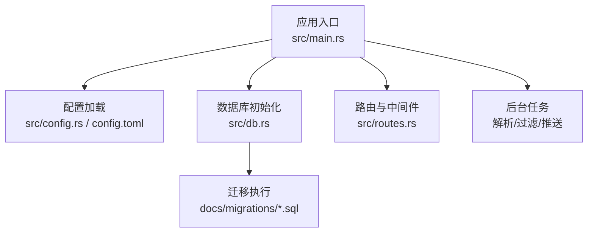
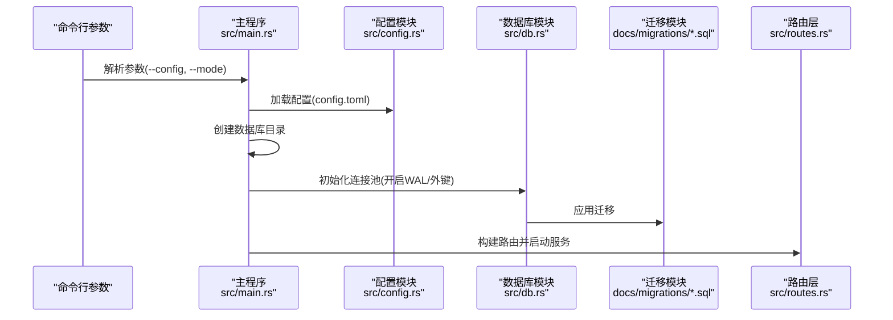
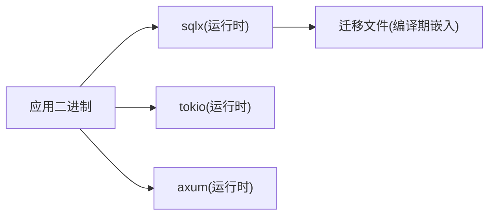
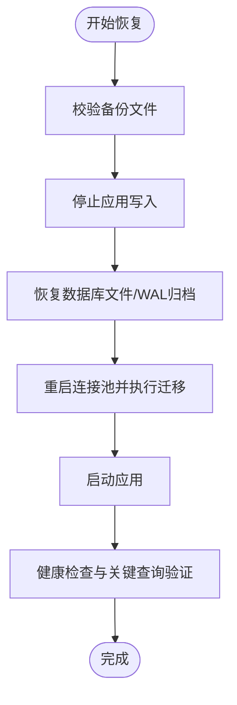

# 备份与恢复

<cite>
**本文引用的文件**
- [src/main.rs](file://src/main.rs)
- [src/db.rs](file://src/db.rs)
- [src/config.rs](file://src/config.rs)
- [config.toml](file://config.toml)
- [Cargo.toml](file://Cargo.toml)
- [docs/migrations/20260607044921_init.sql](file://docs/migrations/20260607044921_init.sql)
- [src/routes.rs](file://src/routes.rs)
- [src/db/token.rs](file://src/db/token.rs)
- [src/db/push_record.rs](file://src/db/push_record.rs)
- [openspec/specs/backend-project-scaffold/spec.md](file://openspec/specs/backend-project-scaffold/spec.md)
- [openspec/changes/archive/2026-06-07-db-migrations-and-models/design.md](file://openspec/changes/archive/2026-06-07-db-migrations-and-models/design.md)
- [openspec/changes/archive/2026-06-07-query-apis-and-background-modules/design.md](file://openspec/changes/archive/2026-06-07-query-apis-and-background-modules/design.md)
</cite>

## 目录
1. [简介](#简介)
2. [项目结构](#项目结构)
3. [核心组件](#核心组件)
4. [架构总览](#架构总览)
5. [详细组件分析](#详细组件分析)
6. [依赖关系分析](#依赖关系分析)
7. [性能考量](#性能考量)
8. [故障场景与恢复策略](#故障场景与恢复策略)
9. [备份与恢复策略](#备份与恢复策略)
10. [自动化备份与调度](#自动化备份与调度)
11. [恢复流程与验证](#恢复流程与验证)
12. [灾难恢复计划与演练](#灾难恢复计划与演练)
13. [结论](#结论)
14. [附录](#附录)

## 简介
本文件面向“AI趋势监控系统”的数据库备份与恢复，围绕SQLite数据库提供在线备份、离线备份与增量备份策略；记录数据迁移最佳实践（版本升级、兼容性处理）；制定灾难恢复计划（RTO/RPO目标）、备份数据的存储位置与访问控制建议；给出自动化备份脚本与调度配置思路；并提供恢复流程验证与数据完整性检查方法，覆盖硬件故障、数据损坏与人为误操作等典型场景。

## 项目结构
系统采用Rust + Axum + SQLite架构，数据库通过连接池管理，启动时自动创建数据库文件并应用迁移。配置项中明确指定数据库路径，迁移文件定义了完整的Schema与索引。

图表来源
- [src/main.rs:64-164](file://src/main.rs#L64-L164)
- [src/db.rs:12-27](file://src/db.rs#L12-L27)
- [config.toml:5-6](file://config.toml#L5-L6)
- [docs/migrations/20260607044921_init.sql:1-118](file://docs/migrations/20260607044921_init.sql#L1-L118)

章节来源
- [src/main.rs:64-164](file://src/main.rs#L64-L164)
- [src/db.rs:12-27](file://src/db.rs#L12-L27)
- [src/config.rs:19-22](file://src/config.rs#L19-L22)
- [config.toml:5-6](file://config.toml#L5-L6)
- [docs/migrations/20260607044921_init.sql:1-118](file://docs/migrations/20260607044921_init.sql#L1-L118)

## 核心组件
- 数据库连接池与WAL模式：应用启动时初始化SQLite连接池，并启用WAL模式与外键约束，确保并发写入与参照完整性。
- 配置驱动：数据库路径由配置文件提供，应用启动时确保目录存在并创建数据库文件。
- 迁移机制：编译期嵌入迁移文件，运行时自动执行迁移，保证Schema一致性。
- 路由与中间件：提供健康检查与受认证保护的API端点，便于运维与监控。

章节来源
- [src/db.rs:12-27](file://src/db.rs#L12-L27)
- [src/main.rs:71-84](file://src/main.rs#L71-L84)
- [Cargo.toml:14-15](file://Cargo.toml#L14-L15)
- [src/routes.rs:14-70](file://src/routes.rs#L14-L70)

## 架构总览
系统以Axum作为HTTP框架，SQLite作为本地存储，通过连接池与迁移工具保障数据一致性。应用启动流程如下：

图表来源
- [src/main.rs:64-164](file://src/main.rs#L64-L164)
- [src/db.rs:12-27](file://src/db.rs#L12-L27)
- [config.toml:1-27](file://config.toml#L1-L27)
- [docs/migrations/20260607044921_init.sql:1-118](file://docs/migrations/20260607044921_init.sql#L1-L118)

## 详细组件分析

### 数据库初始化与迁移
- 连接池初始化：设置WAL模式与外键约束，提升并发写入能力与数据一致性。
- 迁移执行：编译期嵌入迁移文件，运行时自动执行，避免Schema漂移。
- 首次启动：若数据库文件不存在，自动创建；同时确保目录存在。

章节来源
- [src/db.rs:12-27](file://src/db.rs#L12-L27)
- [src/main.rs:71-84](file://src/main.rs#L71-L84)
- [openspec/specs/backend-project-scaffold/spec.md:32-41](file://openspec/specs/backend-project-scaffold/spec.md#L32-L41)

### Schema与索引设计
- 主要表：API令牌、数据源、文章、关键词、关键词命中、热点事件、推送渠道、推送记录。
- 索引：对高频查询字段建立索引，优化查询性能。
- 外键与级联：使用外键约束与级联删除，保证参照完整性。

章节来源
- [docs/migrations/20260607044921_init.sql:1-118](file://docs/migrations/20260607044921_init.sql#L1-L118)

### 并发写入与冲突处理
- 设计风险：多后台任务并发写入，可能遇到SQLite繁忙锁。
- 缓解措施：连接池最大连接数限制、WAL模式、推送器重试逻辑。

章节来源
- [openspec/changes/archive/2026-06-07-query-apis-and-background-modules/design.md:70-76](file://openspec/changes/archive/2026-06-07-query-apis-and-background-modules/design.md#L70-L76)

## 依赖关系分析
- 运行时依赖：sqlx提供SQLite连接池与迁移支持；Tokio提供异步运行时；Axum提供Web框架。
- 编译期依赖：迁移文件在编译阶段被sqlx嵌入，确保Schema变更在构建期即被发现。

图表来源
- [Cargo.toml:14-15](file://Cargo.toml#L14-L15)
- [src/main.rs:80-81](file://src/main.rs#L80-L81)

章节来源
- [Cargo.toml:14-15](file://Cargo.toml#L14-L15)
- [src/main.rs:80-81](file://src/main.rs#L80-L81)

## 性能考量
- WAL模式：提升并发读写性能，降低写入阻塞概率。
- 连接池：限制最大连接数，避免过度竞争。
- 查询索引：针对高频查询字段建立索引，减少全表扫描。
- 后台任务节奏：解析、过滤、推送按固定间隔运行，避免瞬时高负载。

章节来源
- [src/db.rs:19-23](file://src/db.rs#L19-L23)
- [openspec/changes/archive/2026-06-07-query-apis-and-background-modules/design.md:70-76](file://openspec/changes/archive/2026-06-07-query-apis-and-background-modules/design.md#L70-L76)

## 故障场景与恢复策略
- 硬件故障：磁盘损坏或服务器宕机。策略：定期离线备份至安全介质，结合在线备份实现RPO最小化。
- 数据损坏：数据库文件损坏或校验失败。策略：使用备份恢复；若无法恢复，重建Schema后导入增量数据。
- 人为误操作：误删数据或错误迁移。策略：启用增量备份与时间点恢复；严格权限控制与变更审批。

## 备份与恢复策略

### 在线备份（WAL模式）
- 基于WAL的热备份：SQLite在WAL模式下允许读取与写入并发进行，可直接复制数据库文件实现在线备份。
- 操作要点：
  - 确认WAL模式已启用（已在连接池初始化中设置）。
  - 备份期间允许应用继续运行，但需避免同时进行VACUUM等重写操作。
  - 建议在低峰时段进行文件级复制，确保一致性。

章节来源
- [src/db.rs:19-23](file://src/db.rs#L19-L23)

### 离线备份（文件级）
- 适用场景：需要稳定一致性的完整快照，适合生产环境每日全量备份。
- 操作要点：
  - 停止应用或确保无写入（推荐优雅关闭）。
  - 复制数据库文件到备份存储（本地磁盘/网络存储/云对象存储）。
  - 对备份文件进行校验与归档标记。

### 增量备份策略
- 基于WAL日志：SQLite WAL模式下，可周期性归档WAL文件实现近实时增量备份。
- 时间点恢复：结合WAL归档与数据库文件，实现RPO接近实时的时间点恢复。
- 注意事项：
  - 定期清理过期WAL文件，防止无限增长。
  - WAL归档需与文件级备份配合，确保全量+增量双保险。

### 数据迁移最佳实践
- 版本升级与Schema演进：
  - 使用独立迁移文件，遵循“新增不破坏旧结构”的原则。
  - 迁移前先做离线备份，迁移后验证数据完整性与查询性能。
- 兼容性处理：
  - 对可空字段与默认值进行显式声明，避免未来变更导致的兼容问题。
  - 对索引与约束进行版本化管理，确保回滚时能恢复到正确状态。

章节来源
- [openspec/changes/archive/2026-06-07-db-migrations-and-models/design.md:79-90](file://openspec/changes/archive/2026-06-07-db-migrations-and-models/design.md#L79-L90)
- [docs/migrations/20260607044921_init.sql:1-118](file://docs/migrations/20260607044921_init.sql#L1-L118)

## 自动化备份与调度
- 备份脚本建议：
  - 文件级备份：在停机窗口内执行数据库文件复制与校验。
  - WAL归档：定时复制WAL文件并清理旧日志。
  - 通知与告警：备份完成后发送结果邮件/消息；失败时触发告警。
- 调度配置：
  - 使用系统计划任务（Linux cron 或 Windows任务计划程序）或容器编排的CronJob。
  - 分层调度：每日全量+每小时增量，保留N天全量与M个WAL周期。

## 恢复流程与验证

### 恢复流程步骤
- 步骤一：确认备份可用性（校验文件完整性与可读性）。
- 步骤二：停止应用写入，准备恢复环境。
- 步骤三：恢复数据库文件（离线备份）或应用WAL归档（增量备份）。
- 步骤四：重新初始化数据库连接池（WAL与外键），执行迁移。
- 步骤五：启动应用，运行健康检查与关键查询验证。

### 数据完整性检查
- 结构一致性：核对表与索引是否存在且与迁移文件一致。
- 数据一致性：抽样比对关键统计（如热点事件数量、关键词命中数）。
- 查询验证：执行代表性查询（分页、聚合、关联查询）验证性能与正确性。

章节来源
- [src/main.rs:80-81](file://src/main.rs#L80-L81)
- [src/routes.rs:61-63](file://src/routes.rs#L61-L63)

## 灾难恢复计划与演练

### RTO/RPO目标设定
- RTO（恢复时间目标）：根据业务SLA设定，如“核心功能在30分钟内恢复”。
- RPO（恢复点目标）：结合备份策略设定，如“最多丢失1小时数据”。

### 灾难场景与应对
- 硬件故障：优先从最近备份恢复；若WAL归档齐全，可实现近实时恢复。
- 数据损坏：使用最近一次完整备份恢复；若损坏范围小，可尝试修复或重建相关表。
- 人为误操作：基于时间点恢复（WAL归档）回滚到误操作前的状态。

### 演练流程
- 定期演练：每季度进行一次完整恢复演练，记录耗时与问题。
- 回归验证：恢复后执行健康检查、关键API调用与报表查询。
- 持续改进：根据演练反馈优化备份策略与恢复脚本。

## 结论
通过在线备份（WAL模式）、离线备份与WAL归档相结合的策略，配合严格的迁移与验证流程，可有效保障AI趋势监控系统的数据安全与业务连续性。建议将备份纳入自动化运维体系，并定期开展演练以持续提升恢复能力。

## 附录

### 配置与路径参考
- 数据库路径：来自配置文件中的数据库路径字段，应用启动时会确保父目录存在。
- 迁移文件：位于文档目录下的迁移文件，运行时自动应用。

章节来源
- [src/config.rs:19-22](file://src/config.rs#L19-L22)
- [config.toml:5-6](file://config.toml#L5-L6)
- [src/main.rs:71-84](file://src/main.rs#L71-L84)