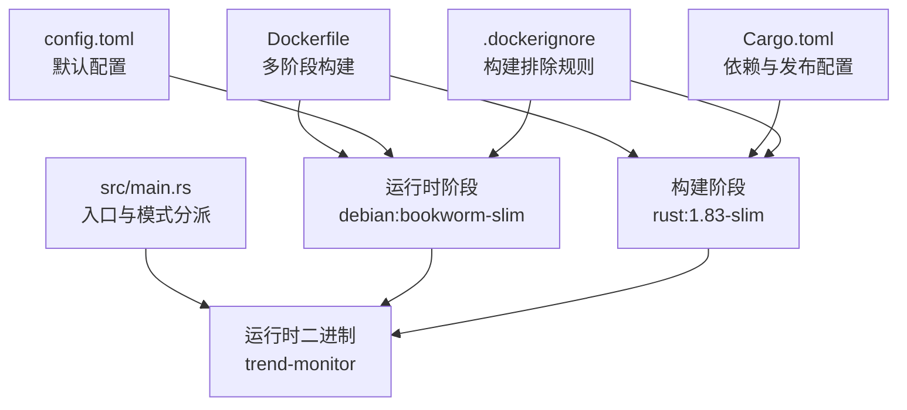
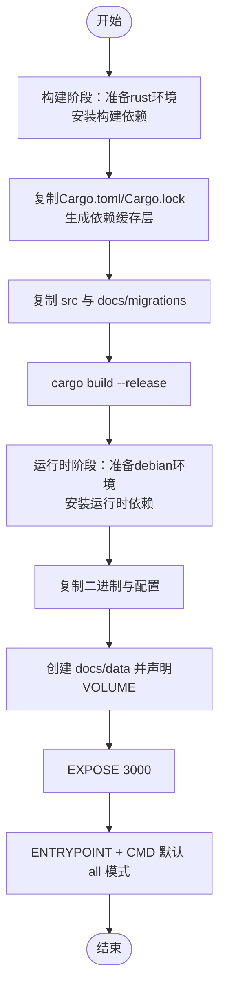
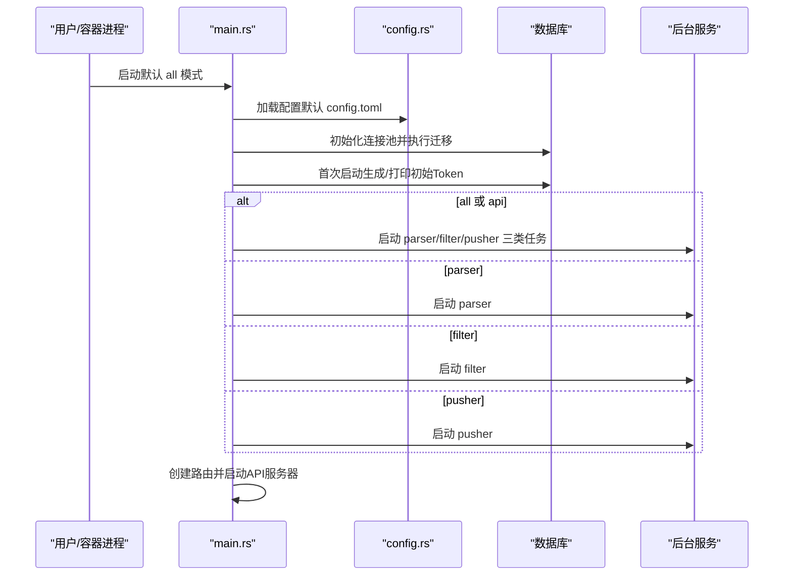
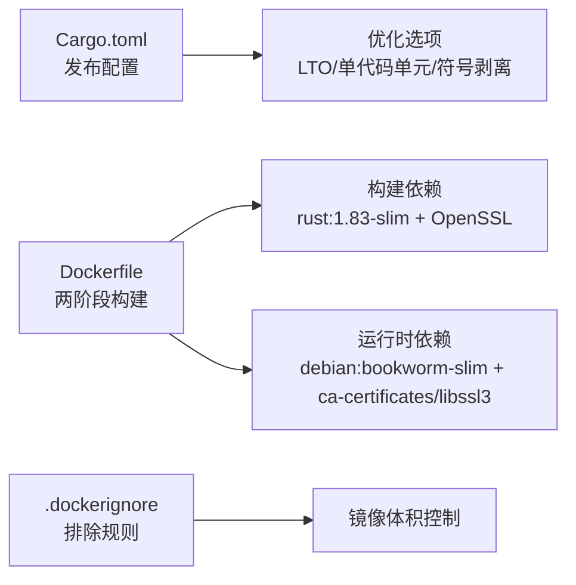

# 容器化部署

<cite>
**本文引用的文件**
- [Dockerfile](file://Dockerfile)
- [.dockerignore](file://.dockerignore)
- [Cargo.toml](file://Cargo.toml)
- [README.md](file://README.md)
- [src/main.rs](file://src/main.rs)
- [src/config.rs](file://src/config.rs)
- [config.toml](file://config.toml)
</cite>

## 目录
1. [简介](#简介)
2. [项目结构](#项目结构)
3. [核心组件](#核心组件)
4. [架构总览](#架构总览)
5. [详细组件分析](#详细组件分析)
6. [依赖关系分析](#依赖关系分析)
7. [性能考量](#性能考量)
8. [故障排查指南](#故障排查指南)
9. [结论](#结论)
10. [附录](#附录)

## 简介
本指南面向AI趋势监控系统（Rust后端 + SQLite）的容器化部署，围绕Docker多阶段构建展开，覆盖从Rust编译环境配置到最终二进制镜像生成的全过程；同时提供容器运行、端口映射、卷挂载、环境变量、健康检查、资源限制与性能调优建议，并给出常见问题排查思路。

## 项目结构
该仓库采用Rust单体应用结构，核心入口为src/main.rs，配置解析在src/config.rs中完成，Dockerfile定义了两阶段构建流程，.dockerignore用于排除构建无关文件，config.toml为默认运行配置。



图表来源
- [Dockerfile:1-61](file://Dockerfile#L1-L61)
- [Cargo.toml:1-67](file://Cargo.toml#L1-L67)
- [src/main.rs:1-164](file://src/main.rs#L1-L164)
- [.dockerignore:1-33](file://.dockerignore#L1-L33)
- [config.toml:1-27](file://config.toml#L1-L27)

章节来源
- [Dockerfile:1-61](file://Dockerfile#L1-L61)
- [Cargo.toml:1-67](file://Cargo.toml#L1-L67)
- [src/main.rs:1-164](file://src/main.rs#L1-L164)
- [.dockerignore:1-33](file://.dockerignore#L1-L33)
- [config.toml:1-27](file://config.toml#L1-L27)

## 核心组件
- 多阶段构建镜像
  - 构建阶段：基于rust:1.83-slim，安装构建依赖，缓存依赖编译，复制源码并编译生成发布版二进制。
  - 运行时阶段：基于debian:bookworm-slim，仅安装运行时依赖，拷贝二进制、配置与迁移文件，暴露端口并声明持久化卷。
- 默认运行模式
  - ENTRYPOINT与CMD组合，默认以“all”模式启动，加载config.toml并运行API与三个后台模块。
- 配置与持久化
  - config.toml提供server、database、auth、parser、filter、pusher等配置项；运行时将docs/data作为持久化目录，便于SQLite数据落盘。

章节来源
- [Dockerfile:1-61](file://Dockerfile#L1-L61)
- [src/config.rs:1-58](file://src/config.rs#L1-L58)
- [config.toml:1-27](file://config.toml#L1-L27)

## 架构总览
下图展示容器镜像构建与运行时交互关系，以及应用内部模式分派与后台任务的运行方式。

```mermaid
graph TB
subgraph "构建阶段"
R["rust:1.83-slim"] --> M["apt-get 安装构建依赖"]
M --> D1["复制 Cargo.toml/Cargo.lock"]
D1 --> D2["生成依赖缓存层"]
D2 --> S1["复制 src 与 docs/migrations"]
S1 --> B1["cargo build --release 生成二进制"]
end
subgraph "运行时阶段"
D["debian:bookworm-slim"] --> N["apt-get 安装运行时依赖"]
N --> CP["复制二进制 trend-monitor"]
CP --> CF["复制 config.toml 与 docs/migrations"]
CF --> MK["mkdir -p docs/data"]
MK --> EX["EXPOSE 3000"]
EX --> VO["VOLUME [\"/app/docs/data\"]"]
VO --> EN["ENTRYPOINT + CMD 默认 all 模式"]
end
B1 --> CP
```

图表来源
- [Dockerfile:1-61](file://Dockerfile#L1-L61)

## 详细组件分析

### Dockerfile 多阶段构建详解
- 构建阶段（builder）
  - 基础镜像：rust:1.83-slim，提供Rust工具链与精简Debian环境。
  - 工作目录：/app。
  - 安装构建依赖：pkg-config、libssl-dev，用于OpenSSL绑定与链接。
  - 依赖缓存：先复制Cargo.toml与Cargo.lock，再创建空main.rs触发依赖编译缓存，随后清理临时src。
  - 源码复制：复制src与docs/migrations，确保迁移SQL随镜像分发。
  - 二进制生成：touch触发缓存失效，执行cargo build --release。
- 运行时阶段（runtime）
  - 基础镜像：debian:bookworm-slim，最小化运行时环境。
  - 工作目录：/app。
  - 安装运行时依赖：ca-certificates、libssl3，满足TLS与证书需求。
  - 文件复制：从builder阶段复制二进制、config.toml与迁移目录。
  - 数据持久化：创建docs/data目录，声明VOLUME以便挂载宿主机目录。
  - 端口与入口：EXPOSE 3000，ENTRYPOINT与CMD组合默认all模式启动。



图表来源
- [Dockerfile:1-61](file://Dockerfile#L1-L61)

章节来源
- [Dockerfile:1-61](file://Dockerfile#L1-L61)

### 应用入口与模式分派（src/main.rs）
- CLI参数
  - --config：指定配置文件路径，默认config.toml。
  - 模式：all | api | parser | filter | pusher，默认all。
- 初始化流程
  - 读取配置并确保数据目录存在。
  - 初始化数据库连接池并执行迁移。
  - 首次启动时自动生成或导入初始Token。
  - 按模式分派：
    - all/api：后台启动parser、filter、pusher三类任务，同时启动API服务器。
    - parser/filter/pusher：仅启动对应模块。
- API服务器
  - 绑定host与port，使用Tokio + Axum监听TCP连接。



图表来源
- [src/main.rs:64-164](file://src/main.rs#L64-L164)
- [src/config.rs:51-58](file://src/config.rs#L51-L58)

章节来源
- [src/main.rs:17-25](file://src/main.rs#L17-L25)
- [src/main.rs:64-164](file://src/main.rs#L64-L164)
- [src/config.rs:1-58](file://src/config.rs#L1-L58)

### 配置体系（config.toml 与 src/config.rs）
- 默认配置项
  - server：host、port（默认0.0.0.0:3000）。
  - database：path（默认docs/data/hotspot.db）。
  - auth：initial_token（可选）。
  - parser：max_concurrent_fetches、default_user_agent、default_timeout_seconds。
  - filter：batch_size、interval_seconds、history_hours、min_history_hours。
  - pusher：interval_seconds、max_retries、retry_base_seconds。
- 配置加载
  - 通过src/config.rs的AppConfig结构体反序列化TOML，支持运行时热更新（如需）。

章节来源
- [config.toml:1-27](file://config.toml#L1-L27)
- [src/config.rs:1-58](file://src/config.rs#L1-L58)

### 构建与运行命令
- 构建镜像
  - 使用Dockerfile在仓库根目录构建，镜像名称可自定义。
  - 示例命令（不含具体代码内容）：[Dockerfile:1-61](file://Dockerfile#L1-L61)
- 运行容器
  - 端口映射：将容器3000端口映射至宿主机端口。
  - 卷挂载：将宿主机目录挂载到/app/docs/data以持久化SQLite数据。
  - 环境变量：可通过-e传入，但默认配置来自config.toml。
  - 健康检查：可结合/health接口进行探针配置。
  - 参考示例（不含具体代码内容）：[README.md:38-72](file://README.md#L38-L72)

章节来源
- [Dockerfile:52-60](file://Dockerfile#L52-L60)
- [README.md:38-72](file://README.md#L38-L72)

### Docker Compose 多容器编排（概念性说明）
- 适用场景
  - 当前仓库未包含compose文件，但可基于Dockerfile与config.toml扩展为多容器编排（例如将数据库迁移到外部容器或引入Nginx代理）。
- 建议结构
  - services：应用容器（基于Dockerfile）、数据库容器（如需）、反向代理（如需）。
  - volumes：持久化docs/data目录。
  - networks：隔离与互联。
  - healthcheck：对应用容器的/health接口进行探针。
- 注意事项
  - 端口冲突与映射一致性。
  - 环境变量与配置文件的优先级与覆盖关系。

（本节为概念性说明，不直接分析具体文件）

## 依赖关系分析
- 构建依赖
  - Rust工具链与OpenSSL开发包（构建阶段）。
  - 发布配置（Cargo.toml）启用LTO、单代码单元、符号剥离等优化，减少二进制体积并提升运行性能。
- 运行时依赖
  - ca-certificates与libssl3（运行时阶段），确保HTTPS与证书校验。
- 镜像大小优化
  - 构建阶段使用rust:1.83-slim，运行时阶段使用debian:bookworm-slim，配合.dockerignore排除无关文件，有效控制镜像体积。



图表来源
- [Cargo.toml:48-57](file://Cargo.toml#L48-L57)
- [Dockerfile:4-12](file://Dockerfile#L4-L12)
- [Dockerfile:32-40](file://Dockerfile#L32-L40)
- [.dockerignore:1-33](file://.dockerignore#L1-L33)

章节来源
- [Cargo.toml:48-57](file://Cargo.toml#L48-L57)
- [Dockerfile:4-12](file://Dockerfile#L4-L12)
- [Dockerfile:32-40](file://Dockerfile#L32-L40)
- [.dockerignore:1-33](file://.dockerignore#L1-L33)

## 性能考量
- 发布构建优化
  - Cargo.toml启用LTO、单代码单元、符号剥离、禁用溢出检查与增量编译，显著提升运行时性能并减小二进制体积。
- 运行时调优
  - 适当增大parser并发与filter批处理规模，平衡吞吐与CPU占用。
  - 调整pusher重试基线与最大重试次数，避免频繁重试导致带宽浪费。
  - 合理设置SQLite WAL与页大小，结合持久化卷保障I/O稳定性。
- 资源限制
  - 在容器层面设置CPU/内存上限，避免后台任务抢占过多资源影响API响应。
- 日志与可观测性
  - 使用tracing-subscriber的env-filter控制日志级别，避免生产环境过度打日志。

章节来源
- [Cargo.toml:48-57](file://Cargo.toml#L48-L57)
- [config.toml:12-27](file://config.toml#L12-L27)

## 故障排查指南
- 无法访问API或健康检查失败
  - 确认容器已映射3000端口且宿主机未被占用。
  - 检查config.toml中的server.host与port是否符合预期。
  - 使用/health接口验证服务可用性。
- 数据未持久化
  - 确认已将/app/docs/data挂载到宿主机目录，且权限正确。
  - 检查容器内docs/data目录是否存在与可写。
- 首次启动无初始Token
  - 首次启动会自动生成初始Token并打印到日志，请在日志中查找并保存。
- 构建失败或镜像过大
  - 检查.dockerignore是否排除了docs/Live-Artifact、docs/plans、openspec、.agents、.claude等目录。
  - 确保构建阶段仅复制必要文件（src与docs/migrations）。
- 运行时依赖缺失
  - 运行时阶段需ca-certificates与libssl3，确认镜像已安装。

章节来源
- [Dockerfile:52-60](file://Dockerfile#L52-L60)
- [config.toml:1-27](file://config.toml#L1-L27)
- [README.md:166-171](file://README.md#L166-L171)

## 结论
通过两阶段Dockerfile与Cargo发布配置的协同，AI趋势监控系统实现了高性能、小体积的容器镜像；配合默认all模式与持久化卷，可在生产环境中快速部署并稳定运行。建议在实际部署中结合健康检查、资源限制与日志策略，持续优化性能与可靠性。

## 附录
- 常用命令参考（不含具体代码内容）
  - 构建镜像：[Dockerfile:1-61](file://Dockerfile#L1-L61)
  - 运行容器（端口映射与卷挂载示例）：[README.md:38-72](file://README.md#L38-L72)
  - 健康检查接口：[README.md:166-171](file://README.md#L166-L171)