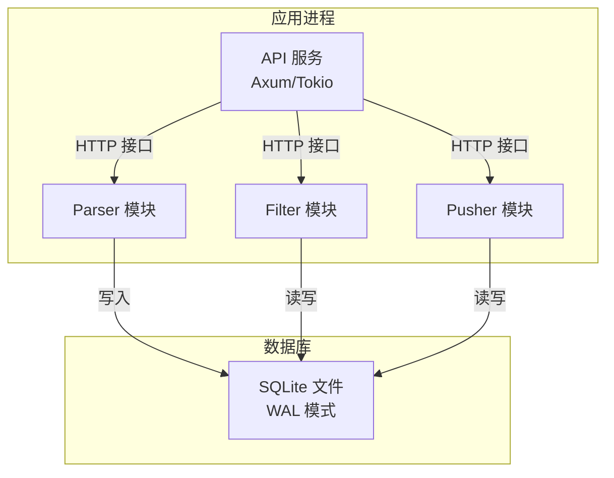
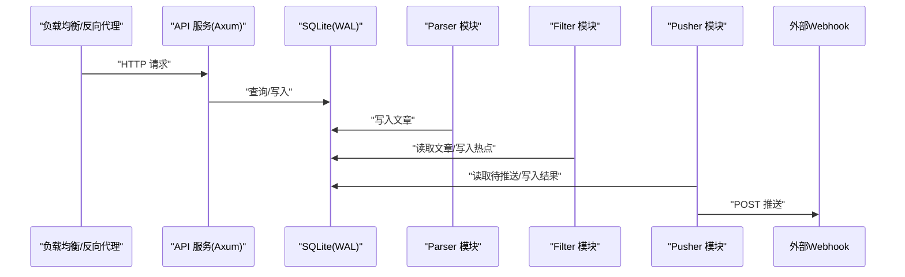
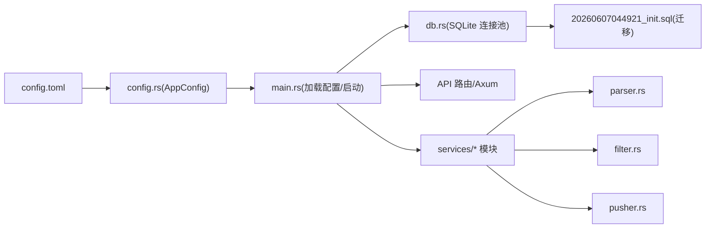

# 生产环境配置

<cite>
**本文引用的文件**
- [config.toml](file://config.toml)
- [config.rs](file://src/config.rs)
- [main.rs](file://src/main.rs)
- [db.rs](file://src/db.rs)
- [parser.rs](file://src/services/parser.rs)
- [filter.rs](file://src/services/filter.rs)
- [pusher.rs](file://src/services/pusher.rs)
- [20260607044921_init.sql](file://docs/migrations/20260607044921_init.sql)
- [Dockerfile](file://Dockerfile)
- [Cargo.toml](file://Cargo.toml)
- [README.md](file://README.md)
</cite>

## 目录
1. [简介](#简介)
2. [项目结构](#项目结构)
3. [核心组件](#核心组件)
4. [架构总览](#架构总览)
5. [详细组件分析](#详细组件分析)
6. [依赖关系分析](#依赖关系分析)
7. [性能考虑](#性能考虑)
8. [故障排查指南](#故障排查指南)
9. [结论](#结论)
10. [附录](#附录)

## 简介
本指南面向生产环境部署 AI 趋势监控系统，围绕 config.toml 配置项进行深入说明，覆盖数据库连接、API 密钥、RSS 源配置与推送渠道设置；提供单机、集群与高可用三种部署场景的配置模板；给出资源建议、性能基准测试方法与关键指标监控；并涵盖负载均衡、反向代理与 SSL 证书配置、安全最佳实践以及环境变量与配置热更新机制。

## 项目结构
系统采用“管道模式”的后台模块组合：Parser（RSS 采集）、Filter（关键词匹配与热点检测）、Pusher（Webhook 推送），并通过 API 提供健康检查与 Token 管理等接口。数据库使用 SQLite（WAL 模式），通过 sqlx 连接池管理并发读写。

图表来源
- [main.rs:87-121](file://src/main.rs#L87-L121)
- [db.rs:12-26](file://src/db.rs#L12-L26)

章节来源
- [README.md:5-24](file://README.md#L5-L24)
- [main.rs:64-164](file://src/main.rs#L64-L164)
- [db.rs:10-27](file://src/db.rs#L10-L27)

## 核心组件
- 配置解析与加载：通过 TOML 文件加载 AppConfig，包含 server、database、auth、parser、filter、pusher 六个段落。
- 数据库连接池：SQLite 使用 WAL 模式与外键约束，连接池最大连接数为 5。
- 后台任务：Parser、Filter、Pusher 三模块分别按配置周期运行，支持独立或组合模式启动。
- API 服务：Axum 提供健康检查与 Token 管理接口，除健康检查外均需 Bearer Token 认证。

章节来源
- [config.rs:3-57](file://src/config.rs#L3-L57)
- [config.toml:1-27](file://config.toml#L1-L27)
- [db.rs:12-26](file://src/db.rs#L12-L26)
- [main.rs:87-160](file://src/main.rs#L87-L160)

## 架构总览
系统以“采集—过滤—推送”流水线为核心，配合 API 服务与数据库，形成完整的趋势监控闭环。生产部署中，建议将 API 服务置于反向代理之后，Parser/Filter/Pusher 在容器内或主机上以独立进程运行，数据库持久化于卷。

图表来源
- [main.rs:87-121](file://src/main.rs#L87-L121)
- [parser.rs:94-184](file://src/services/parser.rs#L94-L184)
- [filter.rs:269-277](file://src/services/filter.rs#L269-L277)
- [pusher.rs:251-259](file://src/services/pusher.rs#L251-L259)

## 详细组件分析

### 配置文件 config.toml 参数详解
- server
  - host：监听地址（建议 0.0.0.0 或具体网卡）
  - port：监听端口（建议 8080/443 透传至反向代理）
- database
  - path：SQLite 数据库文件路径（建议挂载持久卷）
- auth
  - initial_token：初始管理员 Token（首次启动自动生成或从配置注入）
- parser
  - max_concurrent_fetches：最大并发采集数（根据 RSS 源数量与目标吞吐设定）
  - default_user_agent：HTTP UA
  - default_timeout_seconds：采集超时秒数
- filter
  - batch_size：每次处理的文章批大小
  - interval_seconds：过滤轮询间隔（默认 300 秒）
  - history_hours：统计窗口小时数（默认 24）
  - min_history_hours：最少历史数据小时数（默认 6）
- pusher
  - interval_seconds：推送轮询间隔（默认 10 秒）
  - max_retries：最大重试次数（默认 3）
  - retry_base_seconds：指数退避基础秒数（默认 60）

章节来源
- [config.toml:1-27](file://config.toml#L1-L27)
- [config.rs:13-49](file://src/config.rs#L13-L49)
- [README.md:91-122](file://README.md#L91-L122)

### 数据库与表结构
- 初始化迁移：首次启动自动执行迁移，创建 api_tokens、data_sources、articles、keywords、keyword_mentions、hot_events、push_channels、push_records 等表。
- 索引与约束：多处索引提升查询性能；外键约束保证引用完整性；WAL 模式提升并发读写能力。
- 连接池：最大连接数 5，启用 WAL 与外键。

章节来源
- [20260607044921_init.sql:1-118](file://docs/migrations/20260607044921_init.sql#L1-L118)
- [db.rs:12-26](file://src/db.rs#L12-L26)

### 后台模块运行机制
- Parser：每 30 秒查询到期的数据源，受 max_concurrent_fetches 并发限制，成功后更新 last_fetched_at。
- Filter：按 interval_seconds 运行，批量处理未处理文章，Aho-Corasick 匹配关键词，统计突发检测，生成热点事件与推送记录。
- Pusher：按 interval_seconds 轮询待推送记录，POST Webhook，指数退避重试，乐观锁更新状态。

章节来源
- [parser.rs:94-184](file://src/services/parser.rs#L94-L184)
- [filter.rs:269-277](file://src/services/filter.rs#L269-L277)
- [pusher.rs:251-259](file://src/services/pusher.rs#L251-L259)

### API 与认证
- 健康检查：GET /health
- Token 管理：创建、列出、撤销 Token（Bearer 认证）
- 认证流程：提取 Token → 数据库校验（非撤销）→ 过期检查 → 更新 last_used_at → 注入上下文

章节来源
- [README.md:123-142](file://README.md#L123-L142)
- [README.md:166-171](file://README.md#L166-L171)
- [README.md:133-133](file://README.md#L133-L133)

### 配置模板（按部署场景）
- 单机部署（开发/小规模）
  - server.host: 0.0.0.0
  - server.port: 8080
  - database.path: /var/lib/trend-monitor/hotspot.db
  - parser.max_concurrent_fetches: 5
  - filter.batch_size: 500
  - filter.interval_seconds: 300
  - filter.history_hours: 24
  - filter.min_history_hours: 6
  - pusher.interval_seconds: 10
  - pusher.max_retries: 3
  - pusher.retry_base_seconds: 60
- 集群部署（多实例）
  - 使用共享存储挂载 database.path
  - 仅允许一个实例暴露 API（或前置反向代理）
  - Parser/Filter/Pusher 三模块可在多个实例上运行，避免重复推送
- 高可用部署（主备/多活）
  - 使用共享存储 + 数据库高可用方案
  - 反向代理健康检查与自动切换
  - 配置 pusher.max_retries 与 retry_base_seconds 以降低抖动影响

章节来源
- [config.toml:1-27](file://config.toml#L1-L27)
- [db.rs:12-26](file://src/db.rs#L12-L26)

### 负载均衡与反向代理
- 建议使用 Nginx/Caddy/HAProxy 将 80/443 透传至 API 服务端口
- 健康检查路径：/health
- 会话亲和性：本服务无状态，无需粘性会话
- 超时与缓冲：合理设置 proxy_read_timeout、proxy_send_timeout 与 body buffer

（本节为通用实践说明，不直接分析具体文件）

### SSL 证书配置
- 建议使用 Let’s Encrypt 自动签发与续期
- 反向代理终止 TLS，后端 API 服务可使用内网或本地回环监听
- 证书更新后重启反向代理生效

（本节为通用实践说明，不直接分析具体文件）

### 安全配置最佳实践
- 防火墙：仅开放反向代理端口，内部数据库端口仅限内网访问
- 访问控制：API 仅通过 Bearer Token 认证；定期轮换 Token；设置过期时间
- 数据加密：传输层使用 TLS；静态数据可结合文件系统权限与加密盘
- 日志审计：开启 tracing 输出，集中收集与脱敏

章节来源
- [README.md:127-133](file://README.md#L127-L133)
- [README.md:78-90](file://README.md#L78-L90)

### 环境变量与配置热更新
- 环境变量：当前实现通过命令行参数与 config.toml 加载配置，未内置环境变量映射
- 热更新：系统未实现配置热加载；建议通过编排工具（如 systemd/Docker）在配置变更后重启进程

章节来源
- [main.rs:17-25](file://src/main.rs#L17-L25)
- [config.rs:51-57](file://src/config.rs#L51-L57)

## 依赖关系分析

图表来源
- [config.rs:3-57](file://src/config.rs#L3-L57)
- [main.rs:64-164](file://src/main.rs#L64-L164)
- [db.rs:10-27](file://src/db.rs#L10-L27)
- [parser.rs:1-185](file://src/services/parser.rs#L1-L185)
- [filter.rs:1-277](file://src/services/filter.rs#L1-L277)
- [pusher.rs:1-259](file://src/services/pusher.rs#L1-L259)
- [20260607044921_init.sql:1-118](file://docs/migrations/20260607044921_init.sql#L1-L118)

章节来源
- [Cargo.toml:6-47](file://Cargo.toml#L6-L47)
- [Dockerfile:1-61](file://Dockerfile#L1-L61)

## 性能考虑
- CPU
  - Parser/Filter/Pusher 为 CPU 密集型与 IO 密集型混合，建议至少 2 核以上
  - Parser 并发度与 RSS 源数量成正比，避免过高导致源站点限流
- 内存
  - SQLite 默认连接池较小，建议 512MB~1GB 内存起步
  - 关键词匹配使用 Aho-Corasick，内存占用与关键词集合规模相关
- 存储
  - SQLite 文件随时间增长，建议预留 10GB+ 空间并定期清理旧数据
  - 使用 SSD 提升随机读写性能
- 网络
  - Parser 的 default_timeout_seconds 与 max_concurrent_fetches 影响网络带宽占用
  - Pusher 的 retry_base_seconds 与 max_retries 控制对外部 Webhook 的压力

（本节提供通用指导，不直接分析具体文件）

## 故障排查指南
- 数据库无法连接
  - 检查 database.path 是否存在且可写
  - 确认 WAL 模式与外键已启用
- Parser 采集失败
  - 查看日志中的错误堆栈，确认网络超时与 UA 设置
  - 调整 max_concurrent_fetches 与 default_timeout_seconds
- Filter 未产生热点
  - 检查 keywords 是否存在且 enabled
  - 调整 history_hours 与 min_history_hours，确保有足够历史数据
- Pusher 推送失败
  - 检查 push_channels 的 config JSON 中是否包含 url 字段
  - 查看 retry_count 与 next_retry_at，确认指数退避是否生效
- API 认证失败
  - 确认 Bearer Token 是否有效、未撤销、未过期
  - 首次启动会生成初始 Token，可通过日志查看

章节来源
- [db.rs:12-26](file://src/db.rs#L12-L26)
- [parser.rs:101-184](file://src/services/parser.rs#L101-L184)
- [filter.rs:13-208](file://src/services/filter.rs#L13-L208)
- [pusher.rs:11-242](file://src/services/pusher.rs#L11-L242)
- [README.md:78-90](file://README.md#L78-L90)

## 结论
通过合理配置 config.toml、选择合适的部署形态与资源规格，并结合反向代理、负载均衡与安全加固，AI 趋势监控系统可在生产环境中稳定运行。建议在上线前完成性能压测与容量规划，并建立完善的监控与告警体系。

## 附录

### 性能基准测试方法与关键指标
- 基准测试方法
  - 使用 RSS 源模拟器生成大量文章，逐步提高并发与批大小，观察吞吐与延迟
  - 对比不同历史窗口与阈值对热点检测准确率的影响
- 关键指标
  - Parser：采集成功率、平均耗时、并发度利用率
  - Filter：处理吞吐（条/秒）、热点检测延迟、误报率
  - Pusher：推送成功率、重试次数分布、外部 Webhook 响应时间
  - 数据库：连接池命中率、WAL 写入频率、索引扫描效率

（本节为通用指导，不直接分析具体文件）