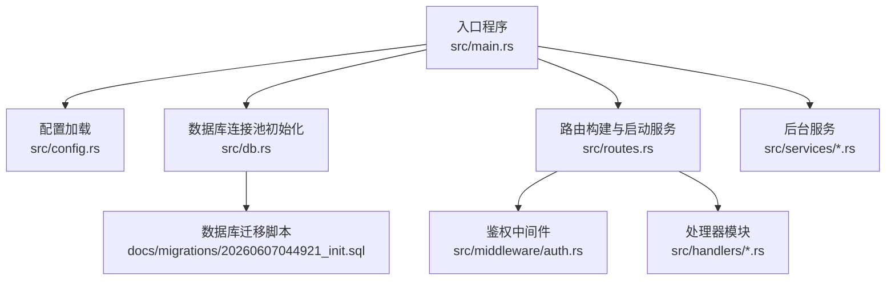
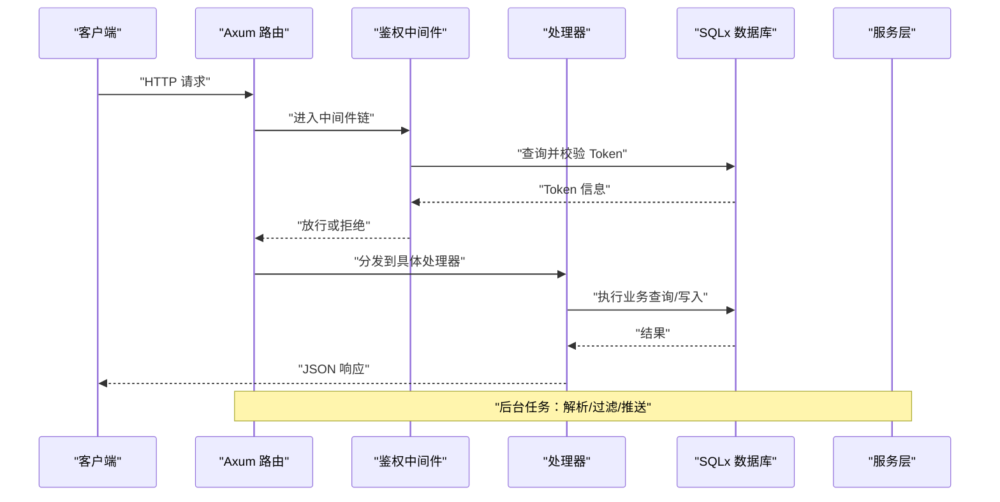
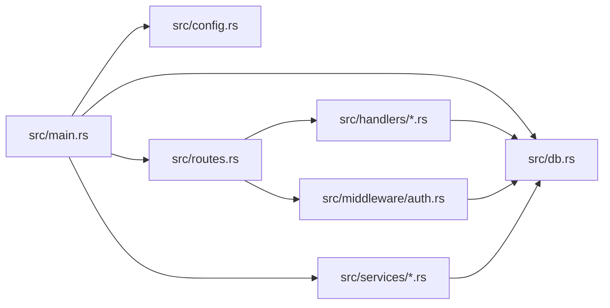

# 监控与日志

<cite>
**本文引用的文件**
- [src/main.rs](file://src/main.rs)
- [src/config.rs](file://src/config.rs)
- [src/db.rs](file://src/db.rs)
- [src/error.rs](file://src/error.rs)
- [src/middleware/auth.rs](file://src/middleware/auth.rs)
- [src/handlers/channel.rs](file://src/handlers/channel.rs)
- [src/handlers/keyword.rs](file://src/handlers/keyword.rs)
- [src/handlers/query.rs](file://src/handlers/query.rs)
- [src/handlers/source.rs](file://src/handlers/source.rs)
- [src/handlers/token.rs](file://src/handlers/token.rs)
- [src/services/parser.rs](file://src/services/parser.rs)
- [src/services/filter.rs](file://src/services/filter.rs)
- [src/services/pusher.rs](file://src/services/pusher.rs)
- [docs/migrations/20260607044921_init.sql](file://docs/migrations/20260607044921_init.sql)
</cite>

## 目录
1. [简介](#简介)
2. [项目结构](#项目结构)
3. [核心组件](#核心组件)
4. [架构总览](#架构总览)
5. [详细组件分析](#详细组件分析)
6. [依赖关系分析](#依赖关系分析)
7. [性能考量](#性能考量)
8. [故障排查指南](#故障排查指南)
9. [结论](#结论)
10. [附录](#附录)

## 简介
本指南面向“AI趋势监控系统”的运维与开发团队，围绕应用级监控与日志管理提供可操作的实践建议。内容涵盖：
- 应用级监控指标采集与展示（请求响应时间、错误率、吞吐量、资源使用）
- 日志级别配置、日志格式规范与日志轮转策略
- Prometheus 监控集成（指标定义与告警规则）
- Grafana 仪表板设置与关键指标可视化
- 健康检查端点配置与外部监控系统集成
- 性能分析工具使用（pprof、火焰图等）
- 故障诊断流程与常见问题的日志分析技巧
- 日志聚合、检索与分析工具推荐

当前代码库以 Rust + Axum + SQLx 为主，采用结构化日志（tracing）与统一错误处理，具备良好的可观测性基础。后续章节将结合现有实现扩展监控与日志体系。

## 项目结构
系统采用模块化组织：入口程序负责初始化配置、数据库连接池、迁移与后台任务；中间件负责鉴权；路由与处理器负责 API；服务层封装解析、过滤与推送逻辑；数据库层通过 SQLx 访问 SQLite。

图表来源
- [src/main.rs:64-164](file://src/main.rs#L64-L164)
- [src/config.rs:51-58](file://src/config.rs#L51-L58)
- [src/db.rs:12-27](file://src/db.rs#L12-L27)
- [src/middleware/auth.rs:18-58](file://src/middleware/auth.rs#L18-L58)

章节来源
- [src/main.rs:64-164](file://src/main.rs#L64-L164)
- [src/config.rs:1-58](file://src/config.rs#L1-L58)
- [src/db.rs:1-27](file://src/db.rs#L1-L27)

## 核心组件
- 入口与生命周期：命令行参数解析、环境变量过滤器初始化、数据库连接池建立、迁移执行、初始令牌确保、后台任务与 API 服务器启动。
- 配置模型：服务器、数据库、鉴权、解析器、过滤器、推送器的配置项。
- 数据库：SQLite 连接池初始化、WAL 模式与外键约束启用。
- 错误处理：统一错误类型与 HTTP 响应映射，数据库错误记录到日志。
- 鉴权中间件：从请求头提取 Bearer Token，校验有效性与过期，注入上下文并异步更新最近使用时间。

章节来源
- [src/main.rs:64-164](file://src/main.rs#L64-L164)
- [src/config.rs:1-58](file://src/config.rs#L1-L58)
- [src/db.rs:12-27](file://src/db.rs#L12-L27)
- [src/error.rs:8-79](file://src/error.rs#L8-L79)
- [src/middleware/auth.rs:18-58](file://src/middleware/auth.rs#L18-L58)

## 架构总览
下图展示了从请求进入至响应返回的关键路径，以及后台任务与数据库交互的关系。

图表来源
- [src/middleware/auth.rs:18-58](file://src/middleware/auth.rs#L18-L58)
- [src/error.rs:23-50](file://src/error.rs#L23-L50)
- [src/db.rs:12-27](file://src/db.rs#L12-L27)

## 详细组件分析

### 日志与错误处理
- 日志：通过 tracing 初始化，支持基于环境变量的过滤器（例如 info 级别）。错误在统一错误类型中被转换为 HTTP 响应，并对数据库错误进行日志记录。
- 建议增强：
  - 在处理器与服务层增加结构化 span 与事件，标注关键耗时与状态。
  - 对鉴权失败、数据库异常、后台任务重试等场景补充更细粒度的日志级别与标签。

章节来源
- [src/main.rs:66](file://src/main.rs#L66)
- [src/error.rs:32](file://src/error.rs#L32)
- [src/error.rs:52-59](file://src/error.rs#L52-L59)

### 鉴权中间件
- 功能要点：从 Authorization 头提取 Bearer Token，查询数据库验证有效性与过期，注入 ApiToken 到请求扩展，后台异步更新最近使用时间。
- 建议增强：
  - 记录鉴权命中/未命中、过期、撤销等事件，便于统计错误率与安全审计。
  - 对无效格式、缺失头、数据库查询失败等情况分别记录不同级别日志。

章节来源
- [src/middleware/auth.rs:18-58](file://src/middleware/auth.rs#L18-L58)

### 数据库连接池与迁移
- 连接池：最大连接数限制、WAL 模式与外键约束开启，提升并发与一致性。
- 迁移：首次启动自动执行迁移脚本，保证模式一致。

章节来源
- [src/db.rs:12-27](file://src/db.rs#L12-L27)
- [src/main.rs:81](file://src/main.rs#L81)
- [docs/migrations/20260607044921_init.sql](file://docs/migrations/20260607044921_init.sql)

### 后台服务（解析/过滤/推送）
- 解析器：并发抓取、默认 UA 与超时控制。
- 过滤器：批大小、轮询间隔、历史窗口。
- 推送器：轮询间隔、最大重试次数、指数退避基秒。
- 建议增强：
  - 为每个服务添加运行状态、处理计数、失败计数、平均耗时等指标。
  - 将服务内部异常与重试纳入日志与指标。

章节来源
- [src/config.rs:29-49](file://src/config.rs#L29-L49)
- [src/main.rs:87-105](file://src/main.rs#L87-L105)

## 依赖关系分析
- 入口依赖配置、数据库、路由与后台服务模块。
- 路由依赖中间件与处理器。
- 处理器依赖数据库访问与模型。
- 中间件依赖数据库访问与错误类型。
- 服务层依赖数据库访问与配置。

图表来源
- [src/main.rs:64-164](file://src/main.rs#L64-L164)
- [src/config.rs:1-58](file://src/config.rs#L1-L58)
- [src/db.rs:1-27](file://src/db.rs#L1-L27)
- [src/middleware/auth.rs:1-58](file://src/middleware/auth.rs#L1-L58)

章节来源
- [src/main.rs:64-164](file://src/main.rs#L64-L164)
- [src/config.rs:1-58](file://src/config.rs#L1-L58)
- [src/db.rs:1-27](file://src/db.rs#L1-L27)
- [src/middleware/auth.rs:1-58](file://src/middleware/auth.rs#L1-L58)

## 性能考量
- 并发与限流：解析器并发抓取受配置控制；建议在上游网关或反向代理层实施速率限制与熔断。
- 数据库：WAL 模式提升写入性能；连接池上限需结合实例规格与负载评估；避免长事务与热点表。
- 内存与 CPU：后台任务批处理与间隔配置影响资源占用；建议启用 pprof 收集 CPU/内存剖析数据，定位热点函数与内存分配。
- I/O：网络抓取超时与重试策略需平衡成功率与资源消耗。

[本节为通用指导，不直接分析具体文件]

## 故障排查指南
- 统一错误响应：所有错误最终映射为标准 JSON 结构，包含错误码与消息，便于前端与监控系统消费。
- 数据库错误：捕获 sqlx 错误并记录详细信息，区分资源不存在与其他内部错误。
- 鉴权失败：检查 Authorization 头格式、Token 是否存在、是否撤销或过期。
- 后台任务异常：关注服务循环中的错误日志与重试次数，必要时降低批大小或延长间隔。
- 日志级别：生产环境建议使用 info 或更高，结合环境变量过滤器动态调整。

章节来源
- [src/error.rs:23-50](file://src/error.rs#L23-L50)
- [src/error.rs:52-59](file://src/error.rs#L52-L59)
- [src/middleware/auth.rs:23-44](file://src/middleware/auth.rs#L23-L44)

## 结论
当前系统已具备可观测性的基础能力（结构化日志、统一错误处理、后台任务与数据库连接池）。建议在此基础上引入应用级指标采集、Prometheus 抓取、Grafana 可视化与健康检查端点，形成闭环的监控与告警体系，并配合 pprof/火焰图等工具进行深度性能分析。

[本节为总结，不直接分析具体文件]

## 附录

### A. 应用级监控指标建议
- 请求级指标
  - 指标名称：http_request_duration_seconds（直方图）、http_requests_total（计数器）
  - 标签：method、path、status、token_type（可选）
  - 来源：在处理器入口与出口记录开始/结束时间，计算耗时并累加计数
- 错误率
  - 指标名称：http_errors_total（计数器）
  - 标签：type（unauthorized/not_found/database/other）、status
- 吞吐量
  - 指标名称：requests_processed_total（计数器），按 handler 分组
- 资源使用
  - 指标名称：process_cpu_seconds_total、process_resident_memory_bytes
  - 来源：操作系统导出或第三方库采集

[本节为通用指导，不直接分析具体文件]

### B. 日志级别与格式规范
- 级别建议
  - 开发：trace/debug/info/warn/error
  - 生产：info/warn/error（可通过环境变量过滤器动态调整）
- 结构化字段
  - 时间戳、级别、模块、消息、线程 ID、span 层级、上下文键值（如 request_id、token_id）
- 日志轮转
  - 基于时间/大小轮转，保留 N 天/文件数量，压缩旧日志，保留最小必要字段

[本节为通用指导，不直接分析具体文件]

### C. Prometheus 集成方案
- 暴露端点
  - 新增 metrics 端点，输出文本格式指标（如 /metrics），由 Prometheus 抓取
- 自定义指标
  - 定义：解析/过滤/推送服务的处理计数、失败计数、平均耗时、队列长度等
  - 更新：在服务循环与关键路径中更新指标
- 告警规则示例
  - 错误率超过阈值持续一段时间
  - 响应时间 P95 超过阈值
  - 后台任务停滞（无新增处理计数）

[本节为通用指导，不直接分析具体文件]

### D. Grafana 仪表板设置
- 数据源：Prometheus
- 关键面板
  - 请求速率与 Pxx 延迟
  - 错误率与错误分布
  - 后台任务处理速率与失败率
  - 数据库连接池使用率与慢查询
- 变换：使用 PromQL 进行聚合与比率计算，设置合适的时间范围与刷新频率

[本节为通用指导，不直接分析具体文件]

### E. 健康检查端点与外部监控集成
- 健康检查
  - GET /health：返回服务可用性（数据库连通性、磁盘空间、关键服务状态）
- 外部系统
  - 与 APM（如 OpenTelemetry）、日志平台（ELK/Splunk/Loki）集成
  - 将结构化日志发送到集中式存储，结合查询语言进行检索与分析

[本节为通用指导，不直接分析具体文件]

### F. 性能分析工具使用
- pprof
  - 启用 HTTP 端口暴露分析接口，定期采样 CPU/内存
  - 生成火焰图定位热点函数与调用栈
- 火焰图
  - 使用 inferno/flamegraph 工具链生成与对比
- 建议流程
  - 选择目标时间段，触发采样 → 下载二进制数据 → 生成火焰图 → 分析热点 → 优化代码/配置

[本节为通用指导，不直接分析具体文件]

### G. 日志聚合、搜索与分析工具推荐
- 日志聚合：Loki（与 Promtail）、ELK（Elasticsearch/Filebeat/Logstash/Kibana）
- 搜索与分析：Kibana 查询 DSL、Loki PromQL、Splunk SPL
- 建议
  - 为每条日志添加统一结构字段（如 service、level、request_id）
  - 对高频错误与异常建立告警与仪表板联动

[本节为通用指导，不直接分析具体文件]