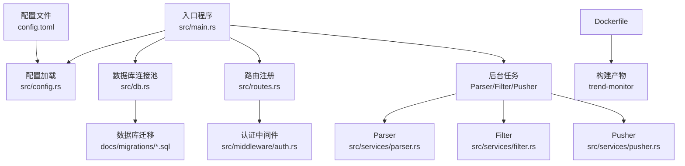
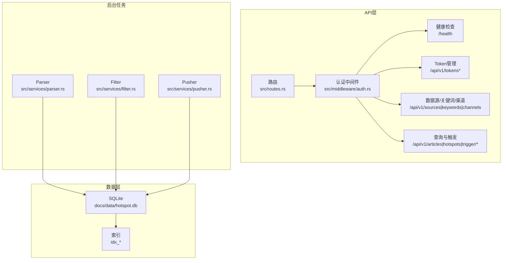
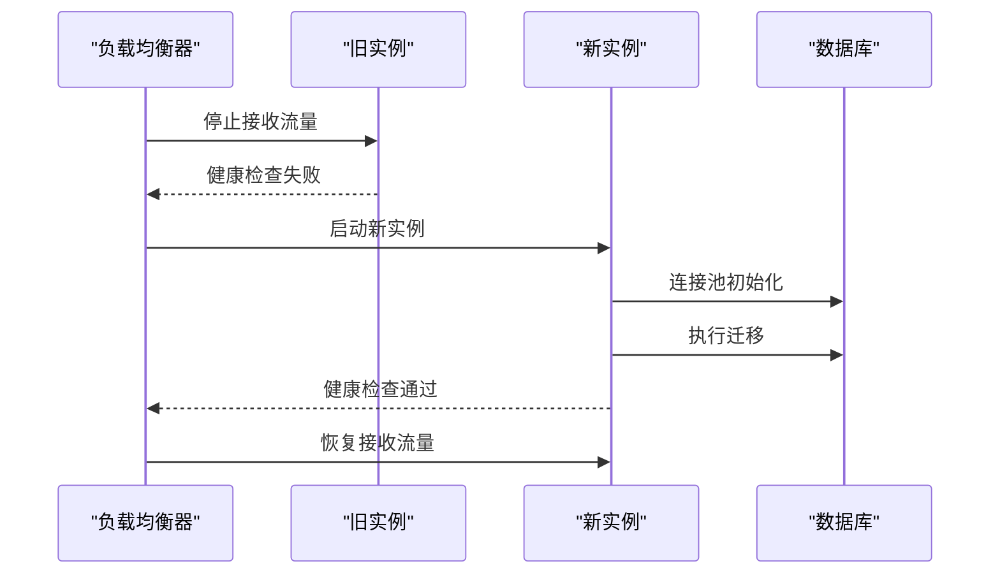
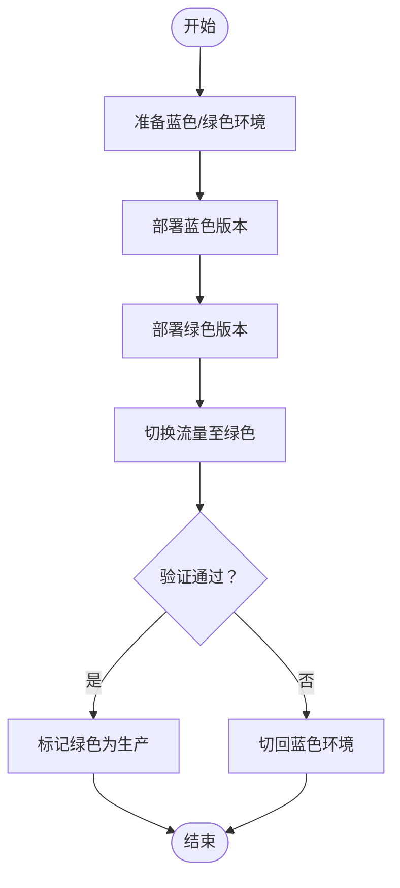
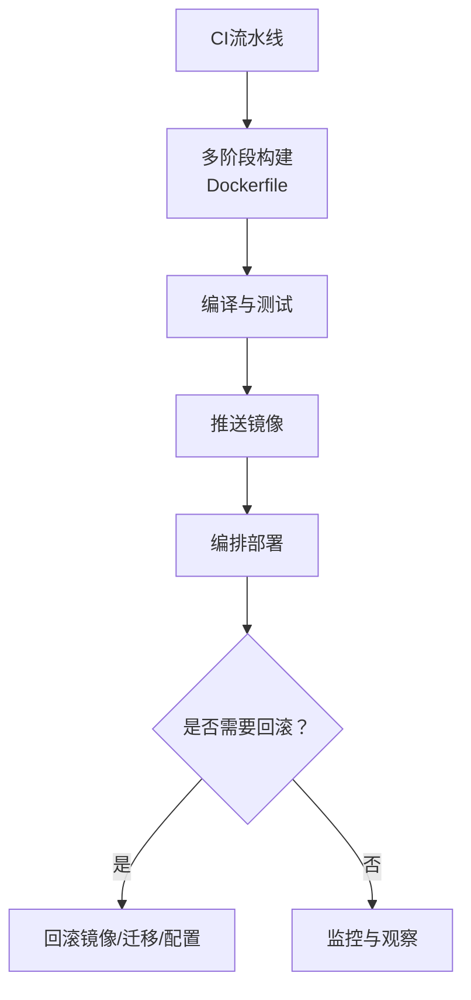
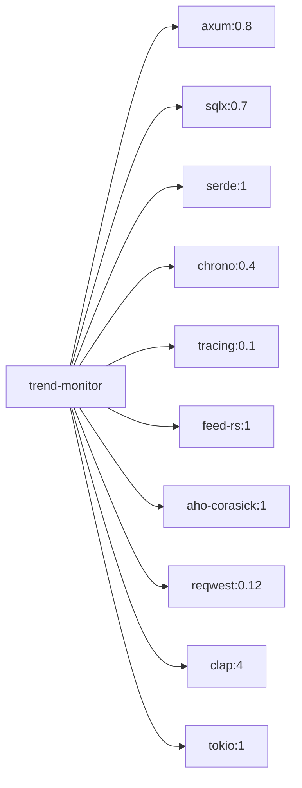

# 系统升级管理指南

<cite>
**本文档引用的文件**
- [README.md](file://README.md)
- [Cargo.toml](file://Cargo.toml)
- [Dockerfile](file://Dockerfile)
- [config.toml](file://config.toml)
- [src/main.rs](file://src/main.rs)
- [src/config.rs](file://src/config.rs)
- [src/db.rs](file://src/db.rs)
- [src/services/parser.rs](file://src/services/parser.rs)
- [src/services/filter.rs](file://src/services/filter.rs)
- [src/services/pusher.rs](file://src/services/pusher.rs)
- [src/routes.rs](file://src/routes.rs)
- [src/middleware/auth.rs](file://src/middleware/auth.rs)
- [docs/migrations/20260607044921_init.sql](file://docs/migrations/20260607044921_init.sql)
- [docs/plans/02-database-migrations.md](file://docs/plans/02-database-migrations.md)
- [docs/apis/token-api.md](file://docs/apis/token-api.md)
</cite>

## 目录
1. [引言](#引言)
2. [项目结构](#项目结构)
3. [核心组件](#核心组件)
4. [架构总览](#架构总览)
5. [详细组件分析](#详细组件分析)
6. [依赖分析](#依赖分析)
7. [性能考量](#性能考量)
8. [故障排查指南](#故障排查指南)
9. [结论](#结论)
10. [附录](#附录)

## 引言
本指南面向AI趋势监控系统的运维与开发团队，提供从准备、执行到验证与回滚的全生命周期升级管理方案。系统采用Rust构建，基于Axum框架与SQLite存储，包含采集（Parser）、过滤（Filter）、推送（Pusher）三类后台任务模块，以及REST API服务。升级涉及依赖更新、数据库迁移、配置变更、容器镜像构建与发布等环节，同时提供滚动升级与蓝绿部署的实施方案，确保升级过程中的服务连续性。

## 项目结构
系统采用模块化组织，核心入口负责加载配置、初始化数据库连接池并执行迁移，随后根据命令行模式启动相应后台任务与API服务。配置文件支持服务监听地址、数据库路径、认证初始令牌、采集/过滤/推送参数等。Dockerfile提供多阶段构建以产出精简运行时镜像。

**图表来源**
- [src/main.rs:64-164](file://src/main.rs#L64-L164)
- [src/config.rs:51-58](file://src/config.rs#L51-L58)
- [src/db.rs:12-27](file://src/db.rs#L12-L27)
- [src/routes.rs:14-70](file://src/routes.rs#L14-L70)
- [src/middleware/auth.rs:18-58](file://src/middleware/auth.rs#L18-L58)
- [src/services/parser.rs:94-185](file://src/services/parser.rs#L94-L185)
- [src/services/filter.rs:269-277](file://src/services/filter.rs#L269-L277)
- [src/services/pusher.rs:251-259](file://src/services/pusher.rs#L251-L259)
- [Dockerfile:1-61](file://Dockerfile#L1-L61)
- [config.toml:1-27](file://config.toml#L1-L27)

**章节来源**
- [README.md:216-257](file://README.md#L216-L257)
- [src/main.rs:64-164](file://src/main.rs#L64-L164)
- [Dockerfile:1-61](file://Dockerfile#L1-L61)
- [config.toml:1-27](file://config.toml#L1-L27)

## 核心组件
- 入口与控制流：负责解析CLI参数、加载配置、初始化数据库连接池、执行迁移、启动后台任务与API服务。
- 配置系统：TOML格式配置映射为结构体，支持服务、数据库、认证、采集、过滤、推送等模块参数。
- 数据库层：SQLite连接池初始化，启用WAL模式与外键约束；迁移文件集中管理。
- 业务服务：Parser负责RSS/Atom抓取与入库；Filter进行关键词匹配与热点检测；Pusher负责Webhook推送与重试。
- API与认证：Axum路由注册，Bearer Token认证中间件，健康检查端点。
- 容器化：多阶段Docker构建，运行时镜像最小化，暴露端口并挂载数据卷。

**章节来源**
- [src/main.rs:64-164](file://src/main.rs#L64-L164)
- [src/config.rs:3-58](file://src/config.rs#L3-L58)
- [src/db.rs:12-27](file://src/db.rs#L12-L27)
- [src/services/parser.rs:94-185](file://src/services/parser.rs#L94-L185)
- [src/services/filter.rs:269-277](file://src/services/filter.rs#L269-L277)
- [src/services/pusher.rs:251-259](file://src/services/pusher.rs#L251-L259)
- [src/routes.rs:14-70](file://src/routes.rs#L14-L70)
- [src/middleware/auth.rs:18-58](file://src/middleware/auth.rs#L18-L58)

## 架构总览
系统采用管道模式的后台任务架构，Parser、Filter、Pusher三者可独立或组合运行。API服务通过Axum提供REST接口，认证中间件保障安全访问。数据库采用SQLite WAL模式，配合索引优化查询性能。

**图表来源**
- [src/routes.rs:14-70](file://src/routes.rs#L14-L70)
- [src/middleware/auth.rs:18-58](file://src/middleware/auth.rs#L18-L58)
- [src/services/parser.rs:94-185](file://src/services/parser.rs#L94-L185)
- [src/services/filter.rs:269-277](file://src/services/filter.rs#L269-L277)
- [src/services/pusher.rs:251-259](file://src/services/pusher.rs#L251-L259)
- [docs/migrations/20260607044921_init.sql:1-118](file://docs/migrations/20260607044921_init.sql#L1-L118)

## 详细组件分析

### 升级流程与注意事项
- 依赖更新：在Cargo.toml中调整版本约束后，先在本地执行编译检查与单元测试，确保兼容性；随后重新构建镜像。
- 数据库迁移：新增或变更表结构时，应在docs/migrations下创建新迁移文件，确保向后兼容；升级前先备份数据库文件。
- 配置变更：在config.toml中调整参数时，需确保与现有数据结构兼容，避免破坏既有索引或约束。
- 服务连续性：利用滚动升级或蓝绿部署策略，保证至少一个实例在线；升级过程中保持健康检查端点可用。

**章节来源**
- [Cargo.toml:1-67](file://Cargo.toml#L1-L67)
- [docs/migrations/20260607044921_init.sql:1-118](file://docs/migrations/20260607044921_init.sql#L1-L118)
- [config.toml:1-27](file://config.toml#L1-L27)

### 滚动升级实施方案
- 目标：逐步替换实例，确保服务持续可用。
- 步骤：
  1) 准备新版本镜像并推送至镜像仓库。
  2) 配置负载均衡器或编排平台，逐批停止旧实例并启动新实例。
  3) 在每次替换后，等待健康检查通过后再进行下一批次。
  4) 监控关键指标（CPU、内存、数据库连接数、推送成功率）。
- 注意事项：确保新旧版本共享同一数据卷，避免数据不一致；在升级前备份数据库。

**图表来源**
- [src/main.rs:77-84](file://src/main.rs#L77-L84)
- [src/db.rs:12-27](file://src/db.rs#L12-L27)
- [src/routes.rs:61-63](file://src/routes.rs#L61-L63)

### 蓝绿部署实施方案
- 目标：零停机切换，快速回滚。
- 步骤：
  1) 预热两套环境（蓝色与绿色），分别指向不同版本。
  2) 将流量切换到绿色环境，验证通过后标记为生产。
  3) 若出现问题，立即切回蓝色环境。
- 注意事项：两套环境共享数据库，需确保迁移脚本幂等；配置文件与数据卷需正确挂载。

**图表来源**
- [Dockerfile:58-61](file://Dockerfile#L58-L61)
- [src/main.rs:77-84](file://src/main.rs#L77-L84)

### 升级前准备工作清单
- 数据备份
  - 备份SQLite数据库文件docs/data/hotspot.db。
  - 导出当前配置文件config.toml。
- 依赖检查
  - 使用cargo check与cargo test验证编译与测试通过。
  - 检查Cargo.toml中各依赖版本范围与兼容性。
- 兼容性验证
  - 在预生产环境执行数据库迁移，确认DDL变更无冲突。
  - 验证配置项变更不影响现有数据结构与索引。
- 回滚预案
  - 准备回滚镜像与配置快照。
  - 确保回滚时能快速恢复数据库到上一个稳定版本。

**章节来源**
- [docs/plans/02-database-migrations.md:408-421](file://docs/plans/02-database-migrations.md#L408-L421)
- [Cargo.toml:1-67](file://Cargo.toml#L1-L67)
- [config.toml:1-27](file://config.toml#L1-L27)

### 升级后验证步骤
- 功能测试
  - 调用/health端点确认服务可用。
  - 通过Token API创建/验证令牌，确保认证中间件正常工作。
  - 触发手动过滤与推送，验证热点检测与Webhook推送流程。
- 性能回归
  - 监控CPU、内存、数据库连接池使用情况。
  - 检查Parser/Filter/Pusher任务的处理延迟与吞吐量。
- 监控指标
  - 关注数据库索引命中率、查询耗时、推送成功率与重试次数。
  - 检查日志中错误与警告级别异常。

**章节来源**
- [src/routes.rs:61-63](file://src/routes.rs#L61-L63)
- [src/middleware/auth.rs:18-58](file://src/middleware/auth.rs#L18-L58)
- [src/services/filter.rs:13-208](file://src/services/filter.rs#L13-L208)
- [src/services/pusher.rs:11-202](file://src/services/pusher.rs#L11-L202)

### 回滚策略与执行
- 策略
  - 若新版本导致数据库结构不兼容，回滚到上一稳定迁移版本。
  - 若配置变更引发异常，回滚到上一版本配置文件。
  - 若服务不可用，回滚到上一稳定镜像。
- 执行
  1) 停止新版本实例，启动旧版本实例。
  2) 恢复数据库到备份点或执行逆向迁移。
  3) 应用旧版配置文件，重启服务。
  4) 验证/health与核心API可用性。

**章节来源**
- [docs/migrations/20260607044921_init.sql:1-118](file://docs/migrations/20260607044921_init.sql#L1-L118)
- [config.toml:1-27](file://config.toml#L1-L27)

### 版本兼容性矩阵与依赖约束
- 语言与框架
  - Rust工具链：1.75+
  - Axum：0.8（含宏特性）
  - Tokio：1（full特性）
  - sqlx：0.7（sqlite、migrate特性）
- 数据库与驱动
  - SQLite：3（WAL模式）
  - OpenSSL：libssl3（运行时依赖）
- 第三方库
  - feed-rs：1（RSS解析）
  - aho-corasick：1（多模式匹配）
  - reqwest：0.12（HTTP客户端）
  - serde系列：1（序列化）
  - chrono：0.4（时间处理）

**章节来源**
- [README.md:40-44](file://README.md#L40-L44)
- [README.md:25-36](file://README.md#L25-L36)
- [Cargo.toml:6-47](file://Cargo.toml#L6-L47)

### 自动化升级脚本与部署流程
- 构建与打包
  - 使用Dockerfile进行多阶段构建，产出精简运行时镜像。
  - 在CI流水线中执行cargo build --release与测试。
- 部署
  - 将镜像推送到镜像仓库，更新编排配置（如Kubernetes Deployment或Docker Compose）。
  - 采用滚动升级策略，设置副本数与就绪探针。
- 回滚
  - 通过编排平台回滚到上一版本镜像标签。
  - 如需数据库回滚，执行逆向迁移脚本并恢复备份。

**图表来源**
- [Dockerfile:1-61](file://Dockerfile#L1-L61)
- [Cargo.toml:48-67](file://Cargo.toml#L48-L67)

**章节来源**
- [Dockerfile:1-61](file://Dockerfile#L1-L61)
- [src/main.rs:77-84](file://src/main.rs#L77-L84)

### 风险评估与应急预案
- 风险
  - 数据库迁移失败导致服务不可用。
  - 新版本配置不兼容导致API异常。
  - 依赖版本升级引入运行时崩溃。
- 应急预案
  - 预先备份数据库与配置，确保可快速恢复。
  - 在预生产环境先行验证迁移与配置变更。
  - 准备回滚镜像与迁移脚本，确保能在分钟级内恢复。

**章节来源**
- [docs/plans/02-database-migrations.md:408-421](file://docs/plans/02-database-migrations.md#L408-L421)
- [src/main.rs:77-84](file://src/main.rs#L77-L84)

## 依赖分析
系统依赖主要集中在Web框架、数据库访问、序列化、时间处理、日志、RSS解析、字符串匹配与HTTP客户端等方面。Dockerfile中明确声明运行时依赖（OpenSSL等），生产构建采用优化配置。

**图表来源**
- [Cargo.toml:6-47](file://Cargo.toml#L6-L47)

**章节来源**
- [Cargo.toml:6-47](file://Cargo.toml#L6-L47)
- [Dockerfile:37-40](file://Dockerfile#L37-L40)

## 性能考量
- 数据库连接池：最大连接数限制为5，建议根据并发需求调整；启用WAL模式提升读写性能。
- 索引设计：针对articles、hot_events、push_records建立必要索引，减少查询成本。
- 任务调度：Parser每30秒检查到期数据源；Filter默认每5分钟运行一次；Pusher每10秒轮询待推送记录。
- 日志与观测：使用tracing子系统输出结构化日志，便于性能分析与问题定位。

**章节来源**
- [src/db.rs:14-26](file://src/db.rs#L14-L26)
- [docs/migrations/20260607044921_init.sql:45-118](file://docs/migrations/20260607044921_init.sql#L45-L118)
- [src/services/parser.rs:98-185](file://src/services/parser.rs#L98-L185)
- [src/services/filter.rs:269-277](file://src/services/filter.rs#L269-L277)
- [src/services/pusher.rs:251-259](file://src/services/pusher.rs#L251-L259)

## 故障排查指南
- 健康检查失败
  - 检查/health端点是否可达，确认监听地址与端口配置正确。
  - 查看日志中数据库连接与迁移执行情况。
- 认证失败
  - 确认Authorization头格式为Bearer Token。
  - 检查令牌是否存在、未撤销且未过期。
- 数据库异常
  - 确认SQLite文件权限与路径正确。
  - 检查迁移是否成功执行，索引是否存在。
- 推送失败
  - 检查Webhook URL配置是否有效。
  - 关注重试次数与下次重试时间，确认网络连通性。

**章节来源**
- [src/routes.rs:61-63](file://src/routes.rs#L61-L63)
- [src/middleware/auth.rs:18-58](file://src/middleware/auth.rs#L18-L58)
- [src/db.rs:12-27](file://src/db.rs#L12-L27)
- [src/services/pusher.rs:11-202](file://src/services/pusher.rs#L11-L202)

## 结论
通过规范化的升级流程、完善的备份与回滚策略、以及滚动/蓝绿部署实践，AI趋势监控系统可在保证服务连续性的前提下安全地进行版本升级。建议在每次升级前进行充分的预生产验证，并在上线后密切监控关键指标，确保系统稳定运行。

## 附录
- 数据库表结构概览
  - api_tokens：API令牌表（可撤销、可选过期时间）
  - data_sources：RSS数据源配置
  - articles：采集文章（去重与处理追踪）
  - keywords：关键词与统计阈值
  - hot_events：小时级热点事件
  - push_channels：推送渠道配置
  - push_records：推送记录与重试追踪

**章节来源**
- [README.md:204-215](file://README.md#L204-L215)
- [docs/migrations/20260607044921_init.sql:4-118](file://docs/migrations/20260607044921_init.sql#L4-L118)