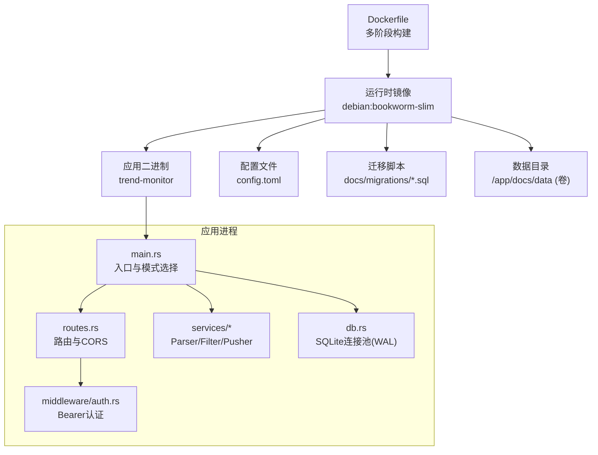
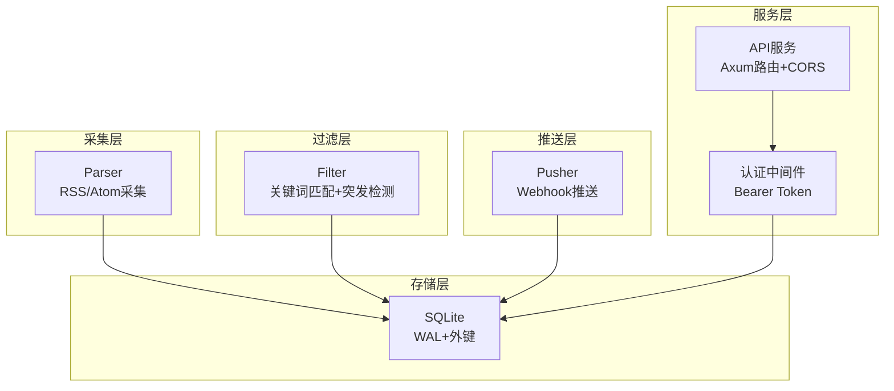
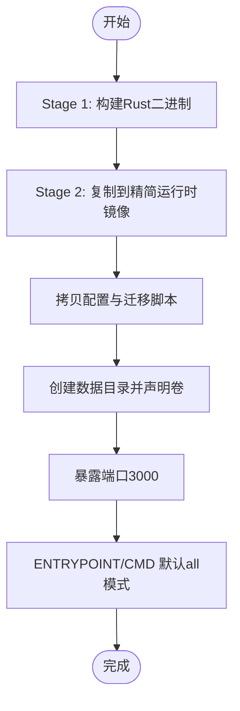
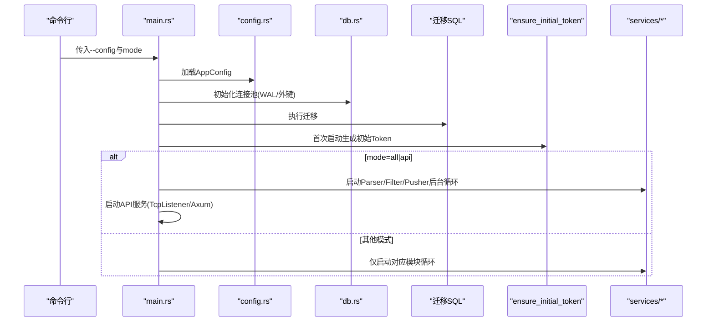
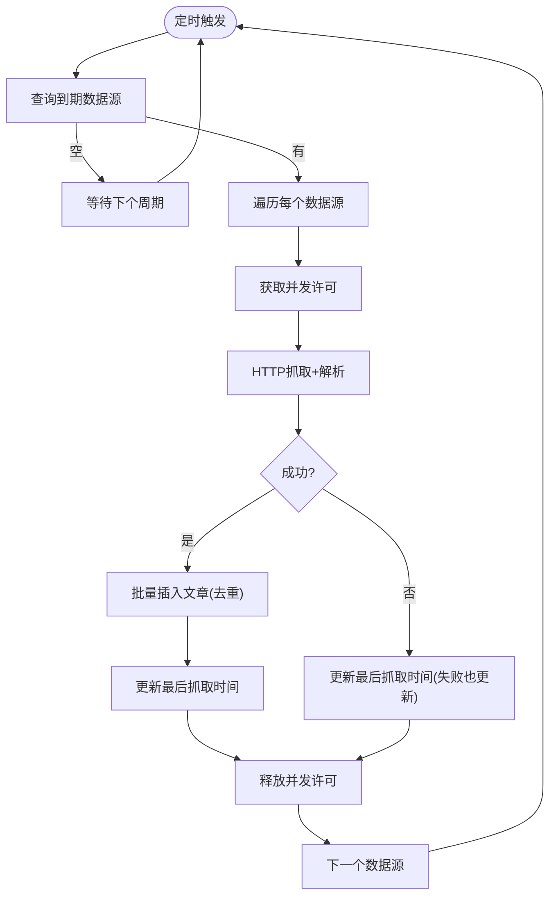
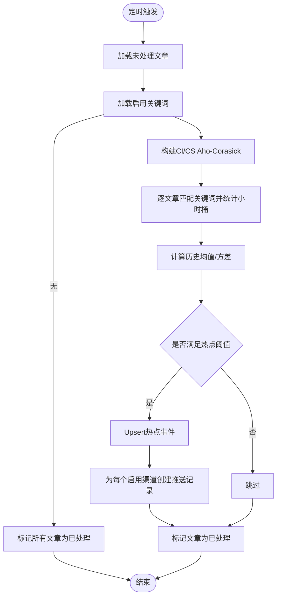
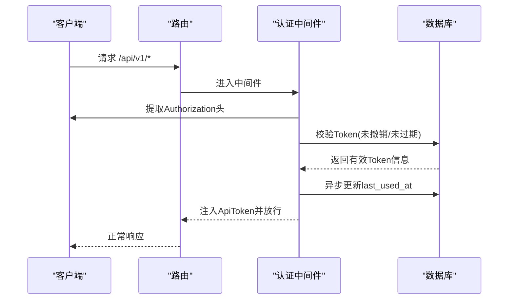
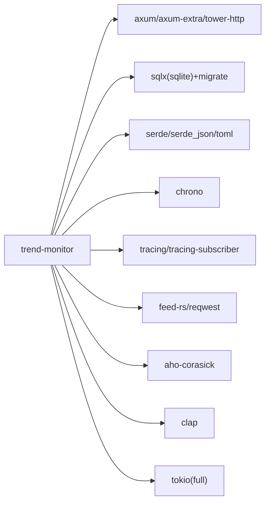

# 部署与运维

<cite>
**本文引用的文件**
- [Dockerfile](file://Dockerfile)
- [Cargo.toml](file://Cargo.toml)
- [config.toml](file://config.toml)
- [src/main.rs](file://src/main.rs)
- [src/config.rs](file://src/config.rs)
- [src/db.rs](file://src/db.rs)
- [src/services/parser.rs](file://src/services/parser.rs)
- [src/services/filter.rs](file://src/services/filter.rs)
- [src/services/pusher.rs](file://src/services/pusher.rs)
- [src/routes.rs](file://src/routes.rs)
- [src/middleware/auth.rs](file://src/middleware/auth.rs)
- [src/handlers/token.rs](file://src/handlers/token.rs)
- [src/models/token.rs](file://src/models/token.rs)
- [docs/migrations/20260607044921_init.sql](file://docs/migrations/20260607044921_init.sql)
- [README.md](file://README.md)
</cite>

## 目录
1. [简介](#简介)
2. [项目结构](#项目结构)
3. [核心组件](#核心组件)
4. [架构总览](#架构总览)
5. [详细组件分析](#详细组件分析)
6. [依赖关系分析](#依赖关系分析)
7. [性能考虑](#性能考虑)
8. [故障排查指南](#故障排查指南)
9. [结论](#结论)
10. [附录](#附录)

## 简介
本指南面向AI趋势监控系统的部署与运维团队，覆盖Docker容器化部署、生产环境系统要求与资源建议、监控指标与日志配置、告警设置、备份与灾难恢复、数据迁移、升级与回滚、扩容缩容与故障切换、以及安全加固与合规要求。系统采用Rust实现，基于SQLite存储，通过管道模式的采集（Parser）、过滤（Filter）、推送（Pusher）三模块协同工作，并提供REST API用于系统管理与查询。

## 项目结构
系统采用模块化组织，核心目录与职责如下：
- config.toml：应用配置（服务器、数据库、认证、采集、过滤、推送）
- Dockerfile：多阶段构建镜像，包含构建阶段与精简运行时阶段
- src/：后端源码，包含入口、配置解析、数据库连接池、路由、中间件、处理器与业务服务
- docs/migrations/：数据库迁移SQL
- README.md：快速开始、架构、API与部署要点



图表来源
- [Dockerfile:1-61](file://Dockerfile#L1-L61)
- [src/main.rs:64-164](file://src/main.rs#L64-L164)
- [src/db.rs:10-27](file://src/db.rs#L10-L27)
- [src/routes.rs:14-70](file://src/routes.rs#L14-L70)
- [src/middleware/auth.rs:14-58](file://src/middleware/auth.rs#L14-L58)

章节来源
- [README.md:216-257](file://README.md#L216-L257)
- [Dockerfile:1-61](file://Dockerfile#L1-L61)
- [src/main.rs:64-164](file://src/main.rs#L64-L164)

## 核心组件
- 应用入口与模式控制：支持all、api、parser、filter、pusher五种运行模式，按需组合启动后台任务与API服务。
- 配置系统：TOML解析为结构化配置，涵盖服务器监听、数据库路径、认证初始令牌、采集并发与超时、过滤批大小与历史窗口、推送轮询与重试。
- 数据库：SQLite连接池，启用WAL与外键约束；首次启动自动执行迁移。
- 业务服务：
  - Parser：RSS/Atom采集，限并发，入库去重，更新最近抓取时间。
  - Filter：Aho-Corasick关键词匹配，小时桶计数，统计突发检测，生成热点事件与推送记录。
  - Pusher：轮询待推送记录，指数退避重试，乐观锁防重复，失败后按策略延时重试。
- API与认证：Axum路由，CORS放行，Bearer Token认证中间件，统一错误/成功响应格式。

章节来源
- [src/main.rs:17-25](file://src/main.rs#L17-L25)
- [src/config.rs:51-58](file://src/config.rs#L51-L58)
- [src/db.rs:12-26](file://src/db.rs#L12-L26)
- [src/services/parser.rs:94-185](file://src/services/parser.rs#L94-L185)
- [src/services/filter.rs:13-277](file://src/services/filter.rs#L13-L277)
- [src/services/pusher.rs:11-259](file://src/services/pusher.rs#L11-L259)
- [src/routes.rs:14-70](file://src/routes.rs#L14-L70)
- [src/middleware/auth.rs:18-57](file://src/middleware/auth.rs#L18-L57)

## 架构总览
系统采用“采集-过滤-推送”的管道模式，三类后台任务可独立或组合运行；API服务提供健康检查、系统控制与数据查询。



图表来源
- [README.md:7-24](file://README.md#L7-L24)
- [src/services/parser.rs:94-185](file://src/services/parser.rs#L94-L185)
- [src/services/filter.rs:269-277](file://src/services/filter.rs#L269-L277)
- [src/services/pusher.rs:251-259](file://src/services/pusher.rs#L251-L259)
- [src/routes.rs:14-70](file://src/routes.rs#L14-L70)
- [src/middleware/auth.rs:18-57](file://src/middleware/auth.rs#L18-L57)
- [src/db.rs:12-26](file://src/db.rs#L12-L26)

## 详细组件分析

### 容器化与镜像构建
- 多阶段构建：第一阶段使用rust:1.83-slim编译Rust二进制，缓存依赖；第二阶段使用debian:bookworm-slim复制二进制与配置，安装运行时证书与SSL库。
- 运行时暴露端口3000，挂载/app/docs/data为持久化卷，ENTRYPOINT默认以“all”模式启动。
- 生产建议：使用只读根文件系统、drop多余权限、限制CPU/内存配额、开启健康检查。



图表来源
- [Dockerfile:1-61](file://Dockerfile#L1-L61)

章节来源
- [Dockerfile:1-61](file://Dockerfile#L1-L61)

### 配置与启动流程
- 配置加载：从config.toml解析为AppConfig，包含server、database、auth、parser、filter、pusher。
- 初始化：确保数据目录存在，建立SQLite连接池（WAL、外键），执行迁移，首次启动生成初始管理员Token。
- 模式选择：根据命令行参数选择运行模式，组合启动Parser/Filter/Pusher与API服务。



图表来源
- [src/main.rs:64-164](file://src/main.rs#L64-L164)
- [src/config.rs:51-58](file://src/config.rs#L51-L58)
- [src/db.rs:12-26](file://src/db.rs#L12-L26)
- [docs/migrations/20260607044921_init.sql:1-118](file://docs/migrations/20260607044921_init.sql#L1-L118)

章节来源
- [src/main.rs:64-164](file://src/main.rs#L64-L164)
- [src/config.rs:51-58](file://src/config.rs#L51-L58)
- [src/db.rs:12-26](file://src/db.rs#L12-L26)
- [docs/migrations/20260607044921_init.sql:1-118](file://docs/migrations/20260607044921_init.sql#L1-L118)

### 采集模块（Parser）
- 并发控制：使用信号量限制最大并发抓取数，避免对上游源造成压力。
- 抓取与入库：按数据源周期查询待抓取源，发起HTTP请求解析RSS/Atom，入库文章并更新最近抓取时间；重复链接跳过。
- 错误处理：抓取失败仍更新最近抓取时间，避免频繁重试。



图表来源
- [src/services/parser.rs:94-185](file://src/services/parser.rs#L94-L185)

章节来源
- [src/services/parser.rs:94-185](file://src/services/parser.rs#L94-L185)

### 过滤模块（Filter）
- 关键词匹配：区分大小写与不区分大小写的关键词，构建Aho-Corasick自动机进行多模式匹配。
- 突发检测：按小时桶统计关键词出现次数，计算滑动窗口均值与标准差，结合阈值与最小计数判定热点。
- 事件与推送：为每个热点事件生成推送记录，标记文章已处理。



图表来源
- [src/services/filter.rs:13-277](file://src/services/filter.rs#L13-L277)

章节来源
- [src/services/filter.rs:13-277](file://src/services/filter.rs#L13-L277)

### 推送模块（Pusher）
- 轮询与重试：按配置周期轮询待推送与到期重试记录，POST Webhook，成功则乐观锁更新状态为success，失败按指数退避更新状态与下次重试时间。
- 配置提取：从渠道配置JSON中提取webhook URL，缺失时直接标记失败并放弃重试。

```mermaid
sequenceDiagram
participant Loop as "Pusher循环"
participant DB as "数据库"
participant Ch as "渠道配置"
participant HE as "热点事件"
participant KW as "关键词"
participant HTTP as "外部Webhook"
Loop->>DB : 查询待推送/到期重试记录
DB-->>Loop : 返回可推送记录列表
loop 对每条记录
Loop->>DB : 查询渠道配置
DB-->>Loop : 返回渠道JSON
Loop->>DB : 查询热点事件与关键词
DB-->>Loop : 返回事件与关键词
Loop->>HTTP : POST JSON负载
alt 成功
HTTP-->>Loop : 2xx
Loop->>DB : 乐观锁更新为success
else 失败/网络错误
HTTP-->>Loop : 非2xx或异常
Loop->>DB : 指数退避更新失败状态与下次重试
end
end
```

图表来源
- [src/services/pusher.rs:11-259](file://src/services/pusher.rs#L11-L259)

章节来源
- [src/services/pusher.rs:11-259](file://src/services/pusher.rs#L11-L259)

### API与认证
- 路由与中间件：除/health外，所有/api/v1/*路由启用Bearer Token认证中间件；CORS放行。
- 认证流程：从Authorization头提取Bearer Token，数据库校验（未撤销、未过期），后台异步更新最近使用时间，注入ApiToken到请求扩展。
- Token管理：创建（返回明文一次）、列表（隐藏明文）、撤销（软删除）。



图表来源
- [src/routes.rs:14-70](file://src/routes.rs#L14-L70)
- [src/middleware/auth.rs:18-57](file://src/middleware/auth.rs#L18-L57)
- [src/handlers/token.rs:18-66](file://src/handlers/token.rs#L18-L66)
- [src/models/token.rs:5-45](file://src/models/token.rs#L5-L45)

章节来源
- [src/routes.rs:14-70](file://src/routes.rs#L14-L70)
- [src/middleware/auth.rs:18-57](file://src/middleware/auth.rs#L18-L57)
- [src/handlers/token.rs:18-66](file://src/handlers/token.rs#L18-L66)
- [src/models/token.rs:5-45](file://src/models/token.rs#L5-L45)

## 依赖关系分析
- 运行时依赖：Rust运行时、ca-certificates、libssl3。
- 构建依赖：rust:1.83-slim、pkg-config、libssl-dev。
- 应用依赖：Axum、sqlx(SQLite)、feed-rs、aho-corasick、reqwest、serde、tokio、clap、tracing等。
- 配置与构建优化：Release配置启用LTO、单代码生成单元、符号剥离、panic abort、关闭溢出检查以获得更优性能。



图表来源
- [Cargo.toml:6-47](file://Cargo.toml#L6-L47)

章节来源
- [Cargo.toml:6-67](file://Cargo.toml#L6-L67)

## 性能考虑
- CPU/内存：Parser并发受max_concurrent_fetches限制；Filter批大小batch_size影响吞吐；Pusher轮询间隔越短延迟越低但CPU占用越高。
- I/O：SQLite WAL模式提升并发读写能力；索引覆盖articles、mentions、hot_events、push_records常用查询字段。
- 网络：Parser默认User-Agent与超时可调；Pusher指数退避减少抖动。
- 构建优化：Release配置已最大化优化，适合生产部署。

章节来源
- [config.toml:12-27](file://config.toml#L12-L27)
- [src/config.rs:29-49](file://src/config.rs#L29-L49)
- [src/db.rs:12-26](file://src/db.rs#L12-L26)
- [docs/migrations/20260607044921_init.sql:45-118](file://docs/migrations/20260607044921_init.sql#L45-L118)
- [Cargo.toml:48-67](file://Cargo.toml#L48-L67)

## 故障排查指南
- 初始Token未保存：首次启动会在日志中输出初始管理员Token，请妥善保存。
- 认证失败：确认Authorization头格式为Bearer <token>，Token未撤销且未过期。
- 数据库连接问题：检查database.path是否存在且可写，确认WAL与外键已启用。
- 采集失败：查看Parser日志中的抓取错误与last_fetched更新情况；适当降低max_concurrent_fetches或提高超时。
- 热点未触发：检查keywords配置（std_multiplier、min_hot_count）、history_hours与min_history_hours是否合理。
- 推送失败：检查渠道配置JSON中url字段、外部Webhook可达性；关注失败记录与重试时间。

章节来源
- [src/main.rs:27-62](file://src/main.rs#L27-L62)
- [src/middleware/auth.rs:18-57](file://src/middleware/auth.rs#L18-L57)
- [src/db.rs:12-26](file://src/db.rs#L12-L26)
- [src/services/parser.rs:101-182](file://src/services/parser.rs#L101-L182)
- [src/services/filter.rs:132-208](file://src/services/filter.rs#L132-L208)
- [src/services/pusher.rs:115-202](file://src/services/pusher.rs#L115-L202)

## 结论
本系统以轻量、可组合的方式实现了RSS采集、关键词匹配与热点检测、Webhook推送的完整闭环。通过Docker容器化与SQLite本地存储，可在单机或小规模集群中稳定运行。建议在生产环境中配合完善的监控、日志与告警体系，制定备份与灾难恢复策略，并严格管理Token与访问控制，确保系统安全与可用。

## 附录

### A. Docker容器化部署流程
- 构建镜像
  - 使用Dockerfile进行多阶段构建，生成运行时镜像。
  - 建议固定镜像标签并启用镜像签名。
- 运行容器
  - 挂载/app/docs/data为持久化卷，映射宿主机端口至容器3000。
  - 设置环境变量（如时区、日志级别）与资源限制。
- 网络配置
  - 使用反向代理（Nginx/Traefik）或容器编排工具（Docker Compose/Kubernetes）统一入口与TLS终止。
  - 仅开放必要端口，内部服务间通过桥接网络通信。

章节来源
- [Dockerfile:1-61](file://Dockerfile#L1-L61)

### B. 生产环境系统要求与资源建议
- 系统要求
  - 操作系统：Linux（Debian Bookworm/Ubuntu LTS推荐）
  - 运行时：Docker Engine或容器运行时
  - 存储：SSD优先，预留足够空间给SQLite WAL与日志
- 资源建议（示例）
  - CPU：2核起步，根据并发采集与过滤需求动态调整
  - 内存：4GB起步，Parser/Filter/Pusher同时运行建议8GB+
  - 存储：容量随历史数据增长，建议开启磁盘配额与清理策略
- 性能基准
  - Parser并发：建议从10起步，观察CPU与上游源限速表现
  - Filter批大小：建议从1000起步，平衡吞吐与内存占用
  - Pusher轮询：建议从10秒起步，兼顾实时性与系统负载

章节来源
- [config.toml:12-27](file://config.toml#L12-L27)
- [src/config.rs:29-49](file://src/config.rs#L29-L49)

### C. 监控指标、日志与告警
- 指标
  - 采集：抓取成功率、平均耗时、并发数、重复链接数
  - 过滤：处理文章数、关键词命中数、热点事件数、处理耗时
  - 推送：成功/失败率、重试次数、平均响应时间
- 日志
  - 使用tracing-subscriber输出结构化日志，按环境设置env-filter
  - 建议集中化收集（如Fluent Bit/Vector + Elasticsearch/OpenSearch）
- 告警
  - 关键阈值：采集失败率、热点检测中断、推送失败率、磁盘空间、CPU/内存使用率
  - 通知渠道：邮件、IM群组、PagerDuty

章节来源
- [src/main.rs:66](file://src/main.rs#L66)
- [src/services/parser.rs:101-182](file://src/services/parser.rs#L101-L182)
- [src/services/filter.rs:132-208](file://src/services/filter.rs#L132-L208)
- [src/services/pusher.rs:115-202](file://src/services/pusher.rs#L115-L202)

### D. 备份策略、灾难恢复与数据迁移
- 备份
  - SQLite数据库文件与docs/data目录定期快照；结合WAL可做在线备份
  - 备份介质：本地/对象存储/异地容灾
- 灾难恢复
  - 快速验证：恢复后执行迁移、启动API与后台任务，健康检查通过
  - 回滚：保留上一版本镜像与配置，回退到最近一次可用备份
- 数据迁移
  - 新旧版本：通过docs/migrations目录的SQL迁移脚本执行
  - 注意：迁移前先备份数据库文件

章节来源
- [docs/migrations/20260607044921_init.sql:1-118](file://docs/migrations/20260607044921_init.sql#L1-L118)
- [src/db.rs:12-26](file://src/db.rs#L12-L26)

### E. 升级、回滚与版本兼容
- 升级流程
  - 构建新镜像并测试；滚动更新或蓝绿发布；更新后验证健康检查与关键指标
- 回滚策略
  - 回退到上一稳定版本镜像；如需数据回滚，使用备份恢复
- 版本兼容
  - 配置项变更：遵循向后兼容或在升级文档中明确迁移步骤
  - 数据库：始终执行迁移脚本，禁止跳过

章节来源
- [Dockerfile:1-61](file://Dockerfile#L1-L61)
- [docs/migrations/20260607044921_init.sql:1-118](file://docs/migrations/20260607044921_init.sql#L1-L118)

### F. 常见运维场景操作手册
- 扩容
  - 增加Parser并发或增加实例副本（注意共享数据库与幂等设计）
- 缩容
  - 平滑停止旧实例，确保无未完成的抓取/推送
- 故障切换
  - 使用反向代理或编排工具的健康检查与自动重启
- 系统控制
  - 通过API触发Filter或Pusher的即时执行，便于调试与应急

章节来源
- [src/routes.rs:46-49](file://src/routes.rs#L46-L49)
- [src/services/filter.rs:269-277](file://src/services/filter.rs#L269-L277)
- [src/services/pusher.rs:251-259](file://src/services/pusher.rs#L251-L259)

### G. 安全加固、访问控制与合规
- 安全加固
  - 仅暴露必要端口；启用只读根文件系统；限制容器能力；使用非root用户运行
- 访问控制
  - 强制Bearer Token认证；定期轮换Token；限制Token有效期；审计Token使用
- 合规
  - 数据最小化与保留策略；日志保留与脱敏；备份加密；审计日志不可抵赖

章节来源
- [src/middleware/auth.rs:18-57](file://src/middleware/auth.rs#L18-L57)
- [src/handlers/token.rs:18-66](file://src/handlers/token.rs#L18-L66)
- [src/models/token.rs:5-45](file://src/models/token.rs#L5-L45)