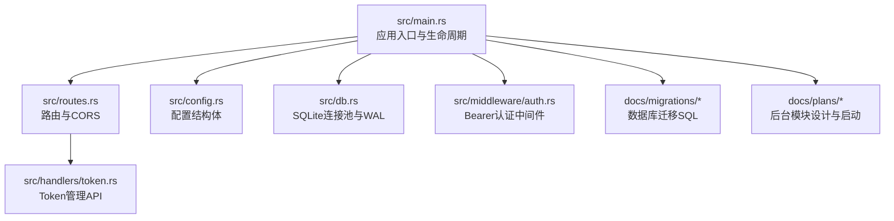
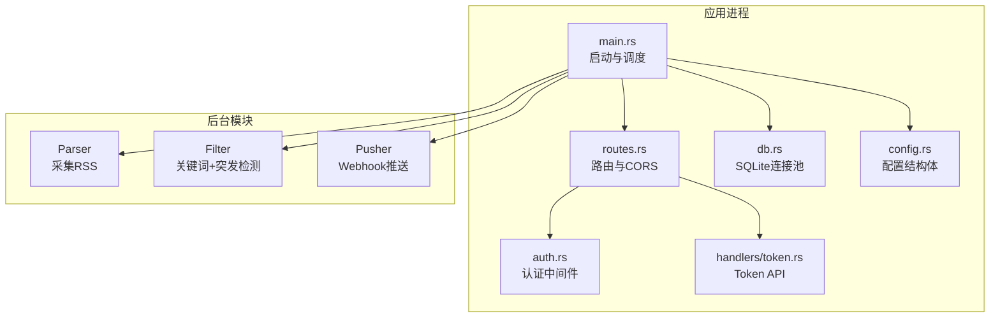
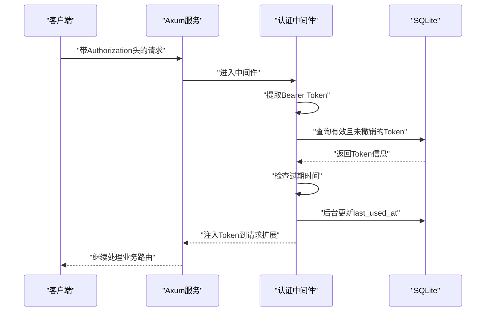
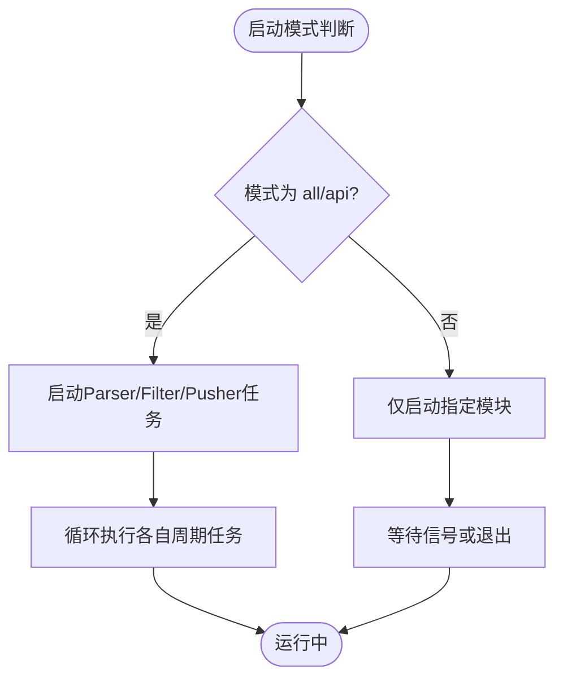
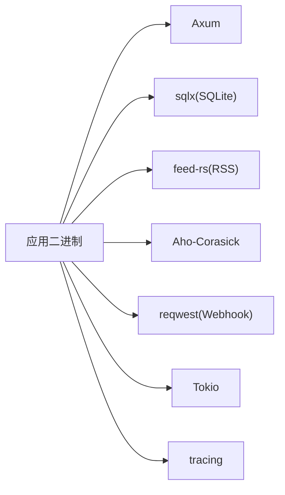

# 部署指南

<cite>
**本文引用的文件**
- [README.md](file://README.md)
- [Cargo.toml](file://Cargo.toml)
- [config.toml](file://config.toml)
- [src/main.rs](file://src/main.rs)
- [src/config.rs](file://src/config.rs)
- [src/routes.rs](file://src/routes.rs)
- [src/db.rs](file://src/db.rs)
- [src/middleware/auth.rs](file://src/middleware/auth.rs)
- [src/handlers/token.rs](file://src/handlers/token.rs)
- [docs/migrations/20260607044921_init.sql](file://docs/migrations/20260607044921_init.sql)
- [docs/plans/05-query-apis-and-background-modules.md](file://docs/plans/05-query-apis-and-background-modules.md)
</cite>

## 目录
1. [简介](#简介)
2. [项目结构](#项目结构)
3. [核心组件](#核心组件)
4. [架构总览](#架构总览)
5. [详细组件分析](#详细组件分析)
6. [依赖关系分析](#依赖关系分析)
7. [性能考虑](#性能考虑)
8. [故障排查指南](#故障排查指南)
9. [结论](#结论)
10. [附录](#附录)

## 简介
本指南面向生产环境部署 AI-Trend-Tool（热点监控系统）。系统基于 Rust 与 Axum 构建，采用 SQLite 存储，提供 Token 认证的 REST API，并内置三类后台模块：采集（Parser）、过滤（Filter）、推送（Pusher）。部署目标包括：
- 单机容器化（Docker）
- Kubernetes 编排
- 云平台部署（含负载均衡、反向代理与 SSL 证书）
- 监控告警、日志管理与性能调优
- 备份恢复、滚动更新与回滚策略
- 常见部署问题诊断与解决

## 项目结构
项目采用“入口程序 + 配置解析 + 路由与中间件 + 数据库连接 + 业务处理器 + 数据迁移 + 后台服务模块”的分层组织方式。

图表来源
- [src/main.rs:63-96](file://src/main.rs#L63-L96)
- [src/routes.rs:14-48](file://src/routes.rs#L14-L48)
- [src/config.rs:52-59](file://src/config.rs#L52-L59)
- [src/db.rs:11-26](file://src/db.rs#L11-L26)
- [src/middleware/auth.rs:18-60](file://src/middleware/auth.rs#L18-L60)
- [src/handlers/token.rs:18-66](file://src/handlers/token.rs#L18-L66)
- [docs/migrations/20260607044921_init.sql:1-118](file://docs/migrations/20260607044921_init.sql#L1-L118)
- [docs/plans/05-query-apis-and-background-modules.md:744-959](file://docs/plans/05-query-apis-and-background-modules.md#L744-L959)

章节来源
- [README.md:216-257](file://README.md#L216-L257)
- [src/main.rs:63-96](file://src/main.rs#L63-L96)
- [src/config.rs:52-59](file://src/config.rs#L52-L59)
- [src/routes.rs:14-48](file://src/routes.rs#L14-L48)
- [src/db.rs:11-26](file://src/db.rs#L11-L26)
- [docs/migrations/20260607044921_init.sql:1-118](file://docs/migrations/20260607044921_init.sql#L1-L118)
- [docs/plans/05-query-apis-and-background-modules.md:744-959](file://docs/plans/05-query-apis-and-background-modules.md#L744-L959)

## 核心组件
- 应用入口与生命周期：负责加载配置、初始化数据库连接池、执行迁移、确保初始 Token、构建路由并启动 HTTP 服务器。
- 配置系统：以 TOML 文件为配置源，映射为结构体，覆盖服务监听、数据库路径、认证、采集、过滤、推送等参数。
- 路由与中间件：提供健康检查与 API 路由，启用 CORS；Token 认证中间件对受保护路由进行鉴权。
- 数据库：SQLite 连接池，开启 WAL 模式与外键约束，迁移脚本定义完整表结构与索引。
- Token 管理：提供创建、列表、撤销接口，返回明文 Token 仅在创建时一次。
- 后台模块：采集、过滤、推送三类异步任务，按配置周期运行，支持按模式选择性启动。

章节来源
- [src/main.rs:26-61](file://src/main.rs#L26-L61)
- [src/main.rs:63-96](file://src/main.rs#L63-L96)
- [src/config.rs:4-59](file://src/config.rs#L4-L59)
- [src/routes.rs:14-48](file://src/routes.rs#L14-L48)
- [src/middleware/auth.rs:18-60](file://src/middleware/auth.rs#L18-L60)
- [src/handlers/token.rs:18-66](file://src/handlers/token.rs#L18-L66)
- [src/db.rs:11-26](file://src/db.rs#L11-L26)
- [docs/migrations/20260607044921_init.sql:4-118](file://docs/migrations/20260607044921_init.sql#L4-L118)

## 架构总览
系统采用“单进程多模块”架构：Axum 提供 HTTP 服务，中间件完成认证，处理器处理业务，数据库持久化，后台模块以 Tokio 任务形式运行。

图表来源
- [src/main.rs:63-96](file://src/main.rs#L63-L96)
- [src/routes.rs:14-48](file://src/routes.rs#L14-L48)
- [src/middleware/auth.rs:18-60](file://src/middleware/auth.rs#L18-L60)
- [src/handlers/token.rs:18-66](file://src/handlers/token.rs#L18-L66)
- [src/db.rs:11-26](file://src/db.rs#L11-L26)
- [src/config.rs:52-59](file://src/config.rs#L52-L59)
- [docs/plans/05-query-apis-and-background-modules.md:744-959](file://docs/plans/05-query-apis-and-background-modules.md#L744-L959)

## 详细组件分析

### 配置管理
- 配置文件：默认路径为 config.toml，包含 server、database、auth、parser、filter、pusher 等段落。
- 加载流程：应用启动时读取 TOML 并反序列化为 AppConfig 结构体。
- 生产建议：
  - 将敏感字段（如 initial_token）置于环境变量或密钥管理服务中，避免硬编码。
  - 使用只读挂载配置文件，避免运行时被意外修改。
  - 对数据库路径设置合适的权限与磁盘配额。

章节来源
- [config.toml:1-27](file://config.toml#L1-L27)
- [src/config.rs:52-59](file://src/config.rs#L52-L59)
- [src/main.rs:67-69](file://src/main.rs#L67-L69)

### 数据库与迁移
- 连接池：SQLite，WAL 模式与外键约束已启用；最大连接数固定为 5。
- 迁移：首次启动自动执行 docs/migrations 下的 SQL 文件，创建所有表与索引。
- 生产建议：
  - 将数据库文件放置在持久化卷上，确保高可用与快照能力。
  - 定期备份数据库文件，保留多个时间点的快照。
  - 监控磁盘空间与 WAL 日志大小，必要时清理或轮转。

章节来源
- [src/db.rs:11-26](file://src/db.rs#L11-L26)
- [docs/migrations/20260607044921_init.sql:1-118](file://docs/migrations/20260607044921_init.sql#L1-L118)
- [src/main.rs:79-81](file://src/main.rs#L79-L81)

### 认证与 Token 管理
- 认证流程：从 Authorization 头提取 Bearer Token，查询数据库校验有效性与是否撤销，检查过期时间，后台异步更新最近使用时间，注入请求上下文。
- Token API：创建（返回明文一次）、列表（隐藏明文）、撤销（软删除）。
- 生产建议：
  - 初始 Token 仅在首次启动且表为空时自动生成或使用配置项；务必妥善保存。
  - 为 API 设置严格的速率限制与访问控制。
  - 使用 HTTPS 传输，避免明文 Token 泄露。

图表来源
- [src/middleware/auth.rs:18-60](file://src/middleware/auth.rs#L18-L60)
- [src/handlers/token.rs:18-66](file://src/handlers/token.rs#L18-L66)

章节来源
- [src/middleware/auth.rs:18-60](file://src/middleware/auth.rs#L18-L60)
- [src/handlers/token.rs:18-66](file://src/handlers/token.rs#L18-L66)
- [README.md:125-142](file://README.md#L125-L142)

### 后台模块（采集/过滤/推送）
- 模块职责与周期：
  - Parser：按数据源各自间隔周期拉取 RSS，去重写入 articles 表。
  - Filter：每 5 分钟运行，关键词匹配与突发检测，生成 hot_events 与推送记录。
  - Pusher：每 10 秒轮询待推送记录，指数退避重试，乐观锁防重复。
- 启动方式：通过命令行模式 all/api/parser/filter/pusher 选择性启动；API 模式下也会启动后台任务。
- 生产建议：
  - 将各模块作为独立进程或容器运行，便于隔离与扩缩容。
  - 为每个模块配置独立资源限制与健康探针。
  - 使用队列或数据库事务保障幂等与一致性。

图表来源
- [docs/plans/05-query-apis-and-background-modules.md:744-959](file://docs/plans/05-query-apis-and-background-modules.md#L744-L959)
- [src/main.rs:924-956](file://src/main.rs#L924-L956)

章节来源
- [docs/plans/05-query-apis-and-background-modules.md:744-959](file://docs/plans/05-query-apis-and-background-modules.md#L744-L959)
- [src/main.rs:924-956](file://src/main.rs#L924-L956)

### API 路由与健康检查
- 路由：
  - /health：健康检查，返回状态。
  - /api/v1/tokens：Token 管理（创建、列表、撤销）。
  - /api/v1/*：受认证中间件保护。
- CORS：启用宽松跨域策略，便于前端联调与跨域访问。
- 生产建议：
  - 在网关层或反向代理中收紧 CORS 策略。
  - 为 /api/v1/* 设置细粒度的速率限制与黑白名单。

章节来源
- [src/routes.rs:14-48](file://src/routes.rs#L14-L48)
- [README.md:166-171](file://README.md#L166-L171)
- [README.md:135-142](file://README.md#L135-L142)

## 依赖关系分析
- 运行时依赖：Tokio（异步运行时）、Axum（Web 框架）、sqlx（SQLite ORM）、feed-rs（RSS 解析）、Aho-Corasick（字符串匹配）、reqwest（HTTP 客户端）、tracing（日志）。
- 构建与打包：Rust 编译为单二进制文件，可通过 Docker 容器化部署。

图表来源
- [Cargo.toml:6-44](file://Cargo.toml#L6-L44)

章节来源
- [Cargo.toml:6-44](file://Cargo.toml#L6-L44)

## 性能考虑
- 数据库：
  - WAL 模式提升并发读写性能；外键约束保证数据一致性。
  - 建议为高频查询列建立索引（已有部分索引）。
- 并发与资源：
  - SQLite 最大连接数固定为 5，建议通过水平扩展（多实例）而非增大连接数。
  - 后台模块采用异步任务，注意 CPU 与 IO 的平衡。
- 网络与超时：
  - Parser 默认超时与用户代理可配置，建议根据外部 RSS 服务性能调整。
- 日志与监控：
  - 使用 env-filter 控制日志级别，生产环境建议 info 或 warn。
  - 结合指标系统（如 Prometheus）暴露健康与性能指标。

章节来源
- [src/db.rs:11-26](file://src/db.rs#L11-L26)
- [config.toml:12-27](file://config.toml#L12-L27)
- [Cargo.toml:25-27](file://Cargo.toml#L25-L27)

## 故障排查指南
- 初次启动无 Token：
  - 若 api_tokens 表为空，系统会生成初始管理员 Token 并打印到日志；请妥善保存。
- 数据库迁移失败：
  - 确认数据库路径存在且可写；确认迁移文件完整。
- 认证失败：
  - 检查 Authorization 头格式是否为 Bearer；确认 Token 未撤销且未过期。
- API 返回 401/404：
  - 核对 Token 是否正确；确认资源是否存在。
- 后台模块未运行：
  - 确认启动模式为 all 或包含对应模块；检查日志中是否有异常。

章节来源
- [src/main.rs:29-61](file://src/main.rs#L29-L61)
- [src/middleware/auth.rs:36-46](file://src/middleware/auth.rs#L36-L46)
- [README.md:186-194](file://README.md#L186-L194)

## 结论
本指南提供了从环境准备、配置管理到服务启动与运维的完整部署路径。结合容器化与 Kubernetes 编排，可在生产环境中实现高可用、可观测与可扩展的热点监控平台。建议在上线前完成安全加固（HTTPS、限流、白名单）、备份策略与演练，并持续优化日志与监控体系。

## 附录

### A. 生产环境部署步骤（通用）
- 环境准备
  - 准备 Linux 服务器，安装 Docker 或 Kubernetes。
  - 准备持久化存储（卷/对象存储），用于数据库文件与日志。
- 配置管理
  - 准备 config.toml，设置 server、database、auth、parser、filter、pusher 参数。
  - 将敏感信息放入环境变量或密钥管理服务。
- 服务启动
  - 构建镜像并推送至私有仓库。
  - 通过 Docker 运行或在 Kubernetes 中部署（Deployment/Job/Service/Ingress）。
  - 启动后执行健康检查与 Token 初始化。
- 监控与日志
  - 配置日志采集（stdout/stderr），接入集中式日志系统。
  - 暴露健康检查端点与关键指标。
- 负载均衡与反向代理
  - 使用 Nginx/Traefik/Ingress 暴露服务，开启 TLS 终止与证书管理。
- 备份与回滚
  - 定期备份数据库文件与配置；制定滚动更新与回滚策略。
- 常见问题
  - 数据库权限不足、迁移失败、Token 未生效、网络超时等，逐一排查配置与网络。

### B. Docker 容器化部署要点
- 构建镜像
  - 使用多阶段构建，产出最小化运行镜像。
- 挂载卷
  - 将数据库文件与配置目录挂载为持久化卷。
- 环境变量
  - 通过环境变量覆盖敏感配置项。
- 健康检查
  - 使用 /health 接口进行存活与就绪探针。
- 重启策略
  - 设置适当的重启策略与资源限制。

### C. Kubernetes 编排要点
- 资源对象
  - Deployment：管理 Pod 副本与滚动更新。
  - Service：暴露 API 服务。
  - ConfigMap：存放 config.toml。
  - Secret：存放敏感信息（如 initial_token）。
  - PersistentVolumeClaim：挂载数据库文件。
  - Ingress/LoadBalancer：对外暴露服务。
- 更新与回滚
  - 使用滚动更新；失败时回滚到上一个版本。
- 策略与安全
  - 设置资源限制与请求；启用网络策略；使用只读根文件系统。

### D. 云平台部署选项
- AWS/GCP/Azure
  - 使用托管容器服务（ECS/EKS/GKE）或虚拟机部署。
  - 使用托管数据库（如云数据库服务）替代本地 SQLite。
- 负载均衡与 SSL
  - 使用平台提供的 LB 与 ACM/证书管理服务。
- 自动化
  - CI/CD 流水线自动化构建、测试与发布。

### E. 监控告警与日志管理
- 指标
  - 健康检查状态、请求延迟与错误率、数据库连接数、后台模块运行状态。
- 日志
  - 结构化日志，区分请求日志与应用日志。
- 告警
  - 基于阈值与异常模式的告警策略。

### F. 备份恢复与滚动更新
- 备份
  - 数据库文件定期快照；配置文件纳入版本管理。
- 恢复
  - 快照回滚与最小停机时间恢复演练。
- 滚动更新
  - 逐步替换 Pod，确保服务连续性；失败时回滚。