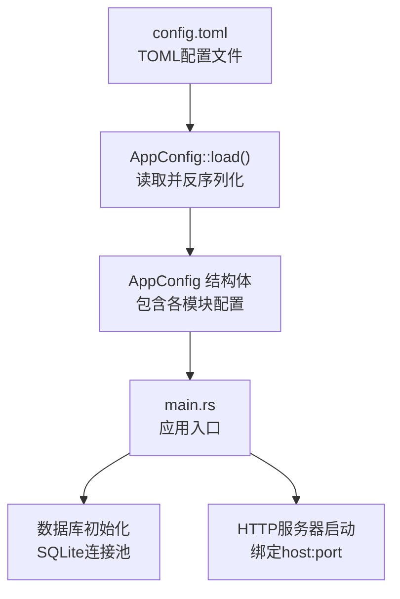
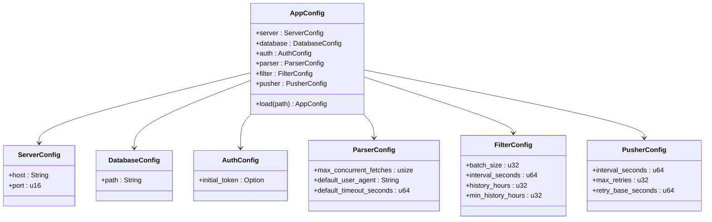
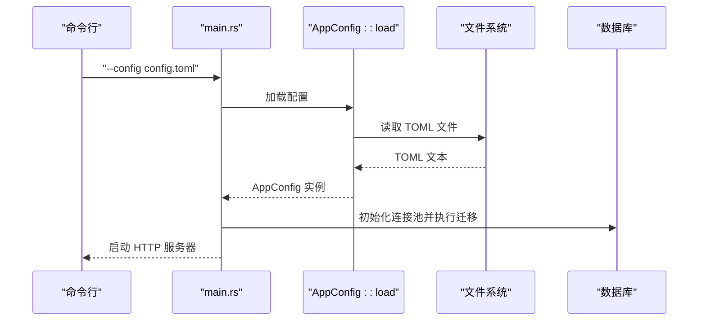
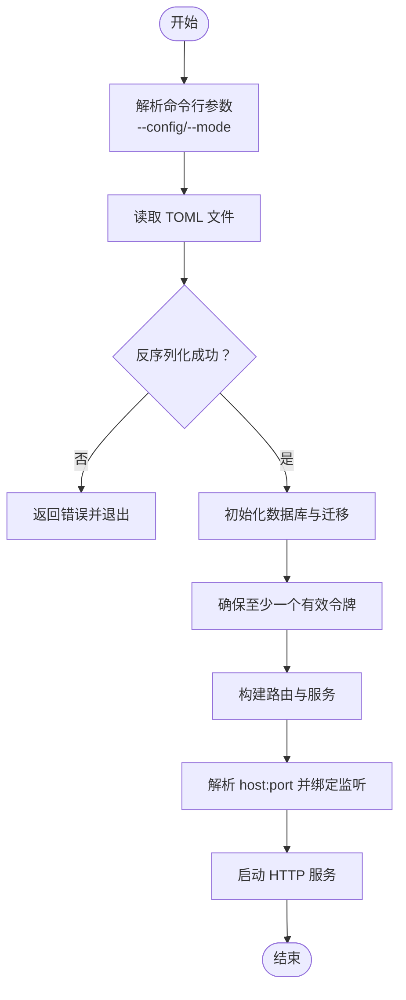

# 配置管理

<cite>
**本文引用的文件**
- [config.toml](file://config.toml)
- [config.rs](file://src/config.rs)
- [main.rs](file://src/main.rs)
- [backend-project-scaffold/spec.md](file://openspec/specs/backend-project-scaffold/spec.md)
- [2026-06-07-backend-project-setup/spec.md](file://openspec/changes/archive/2026-06-07-backend-project-setup/specs/backend-project-scaffold/spec.md)
- [05-query-apis-and-background-modules.md](file://docs/plans/05-query-apis-and-background-modules.md)
</cite>

## 目录
1. [简介](#简介)
2. [项目结构](#项目结构)
3. [核心组件](#核心组件)
4. [架构总览](#架构总览)
5. [详细组件分析](#详细组件分析)
6. [依赖分析](#依赖分析)
7. [性能考量](#性能考量)
8. [故障排查指南](#故障排查指南)
9. [结论](#结论)
10. [附录](#附录)

## 简介
本文件面向“AI趋势监控系统”的配置管理，围绕 config.toml 配置文件展开，系统性说明其完整结构与参数语义，涵盖 server、database、auth、parser、filter、pusher 各部分的字段作用、默认值、取值范围与推荐设置；阐述配置加载机制、错误处理与验证流程；并提供多场景配置模板与最佳实践。同时，结合现有代码与规范文档，明确当前实现中不支持的功能（如环境变量覆盖、配置热更新），以及安全注意事项与敏感信息保护建议。

## 项目结构
- 配置文件位于仓库根目录，采用 TOML 格式，包含 server、database、auth、parser、filter、pusher 六个段落。
- 应用通过命令行参数指定配置文件路径，默认使用 config.toml。
- 配置模型在 src/config.rs 中定义，使用 serde 进行反序列化。
- 主程序在 src/main.rs 中加载配置、初始化数据库、运行迁移并启动 HTTP 服务器。

图表来源
- [config.toml:1-27](file://config.toml#L1-L27)
- [config.rs:52-58](file://src/config.rs#L52-L58)
- [main.rs:63-95](file://src/main.rs#L63-L95)

章节来源
- [config.toml:1-27](file://config.toml#L1-L27)
- [config.rs:1-59](file://src/config.rs#L1-L59)
- [main.rs:16-24](file://src/main.rs#L16-L24)

## 核心组件
- AppConfig：顶层配置容器，聚合 server、database、auth、parser、filter、pusher。
- ServerConfig：HTTP 服务器监听地址与端口。
- DatabaseConfig：SQLite 数据库文件路径。
- AuthConfig：初始管理员令牌配置（可选）。
- ParserConfig：并发抓取、默认UA、超时等解析器参数。
- FilterConfig：批处理大小、检测间隔、历史窗口等过滤器参数。
- PusherConfig：推送间隔、最大重试次数、基础退避秒数等推送器参数。

章节来源
- [config.rs:4-50](file://src/config.rs#L4-L50)

## 架构总览
下图展示从配置文件到运行时配置对象的映射关系，以及主程序如何使用配置启动服务。

图表来源
- [config.rs:4-50](file://src/config.rs#L4-L50)

## 详细组件分析

### server 段
- 字段
  - host：监听地址字符串
  - port：监听端口（u16）
- 默认值与取值范围
  - 默认值：见 config.toml 中的示例值
  - 取值范围：host 为合法 IP 或主机名；port 为 1–65535 的整数
- 推荐设置
  - 开发：host=0.0.0.0，port=3000
  - 生产：限制 host 为内网或特定接口；使用非特权端口（>1024）
- 使用方式
  - 主程序解析 host:port 并绑定 TCP 监听

章节来源
- [config.toml:2-3](file://config.toml#L2-L3)
- [config.rs:14-18](file://src/config.rs#L14-L18)
- [main.rs:88](file://src/main.rs#L88)

### database 段
- 字段
  - path：SQLite 数据库文件绝对或相对路径
- 默认值与取值范围
  - 默认值：见 config.toml 示例
  - 取值范围：可写路径，确保父目录存在
- 推荐设置
  - 生产：使用绝对路径；确保进程对目录具备读写权限
- 行为说明
  - 启动时自动创建父目录；首次启动执行数据库迁移

章节来源
- [config.toml:6](file://config.toml#L6)
- [config.rs:20-23](file://src/config.rs#L20-L23)
- [main.rs:70-74](file://src/main.rs#L70-L74)
- [main.rs:79-80](file://src/main.rs#L79-L80)

### auth 段
- 字段
  - initial_token：初始管理员令牌（可选，字符串）
- 默认值与取值范围
  - 默认值：未配置时为 None
  - 取值范围：任意字符串；空字符串等价于未配置
- 推荐设置
  - 生产：务必设置强随机令牌；避免使用弱口令
- 行为说明
  - 首次启动且令牌表为空时，若配置了 initial_token 则使用该值；否则自动生成并打印提示
  - 若配置为空字符串，行为等同未配置，将自动生成

章节来源
- [config.toml:10](file://config.toml#L10)
- [config.rs:25-28](file://src/config.rs#L25-L28)
- [main.rs:29-61](file://src/main.rs#L29-L61)
- [2026-06-07-backend-project-setup/spec.md:146-151](file://openspec/changes/archive/2026-06-07-backend-project-setup/specs/backend-project-scaffold/spec.md#L146-L151)

### parser 段
- 字段
  - max_concurrent_fetches：并发抓取任务上限（usize）
  - default_user_agent：默认请求 UA（字符串）
  - default_timeout_seconds：默认超时秒数（u64）
- 默认值与取值范围
  - 默认值：见 config.toml 示例
  - 取值范围：并发数与超时应为正数；UA 为合法字符串
- 推荐设置
  - 并发数：依据目标源限速与系统资源设定，避免触发反爬策略
  - 超时：根据网络状况与目标站点响应时间调整
- 使用位置
  - 解析器模块（服务层）会读取该配置用于调度与请求

章节来源
- [config.toml:13-15](file://config.toml#L13-L15)
- [config.rs:30-35](file://src/config.rs#L30-L35)

### filter 段
- 字段
  - batch_size：批处理条目数量（u32）
  - interval_seconds：检测周期秒数（u64）
  - history_hours：热点统计的历史窗口小时数（u32）
  - min_history_hours：最小历史窗口小时数（u32）
- 默认值与取值范围
  - 默认值：见 config.toml 示例
  - 取值范围：均为正数；history_hours ≥ min_history_hours
- 推荐设置
  - 批大小：平衡内存占用与吞吐；通常数百到数千
  - 周期：根据数据更新频率与实时性要求权衡
  - 历史窗口：结合业务需求与存储成本综合选择
- 使用位置
  - 过滤器模块（服务层）会读取该配置进行关键词匹配与热点检测

章节来源
- [config.toml:17-22](file://config.toml#L17-L22)
- [config.rs:37-43](file://src/config.rs#L37-L43)

### pusher 段
- 字段
  - interval_seconds：推送轮询间隔秒数（u64）
  - max_retries：最大重试次数（u32）
  - retry_base_seconds：基础退避秒数（u64）
- 默认值与取值范围
  - 默认值：见 config.toml 示例
  - 取值范围：均为非负整数；建议 max_retries 为较小正数，退避以指数或线性增长
- 推荐设置
  - 间隔：兼顾实时性与下游压力
  - 重试：合理设置最大重试与退避，避免雪崩
- 使用位置
  - 推送器模块（服务层）会读取该配置进行 Webhook 推送与重试

章节来源
- [config.toml:23-27](file://config.toml#L23-L27)
- [config.rs:45-50](file://src/config.rs#L45-L50)

## 依赖分析
- 配置加载链路
  - CLI 参数指定配置文件路径
  - AppConfig::load 读取 TOML 文本并反序列化为结构体
  - 主程序使用配置初始化数据库、迁移、令牌校验与 HTTP 服务
- 外部依赖
  - toml：TOML 解析
  - serde：结构体反序列化
  - sqlx：SQLite 连接池与迁移
  - tokio/axum：异步 HTTP 服务器

图表来源
- [main.rs:16-24](file://src/main.rs#L16-L24)
- [main.rs:63-95](file://src/main.rs#L63-L95)
- [config.rs:52-58](file://src/config.rs#L52-L58)

章节来源
- [main.rs:63-95](file://src/main.rs#L63-L95)
- [config.rs:52-58](file://src/config.rs#L52-L58)

## 性能考量
- 并发与资源
  - parser.max_concurrent_fetches 过高可能导致目标站点限流或自身资源耗尽
  - filter.batch_size 与 interval_seconds 需要与数据库写入能力匹配
- I/O 与延迟
  - pusher.retry_base_seconds 与 max_retries 影响下游压力与失败恢复速度
- 存储与历史窗口
  - filter.history_hours 与 min_history_hours 决定数据保留规模，影响查询性能与磁盘占用

## 故障排查指南
- 配置文件不存在
  - 现象：AppConfig::load 抛出错误
  - 处理：确认 --config 指向正确路径，或使用默认 config.toml
- TOML 语法错误或类型不匹配
  - 现象：反序列化失败
  - 处理：核对字段类型与格式；参考 config.toml 示例
- 数据库初始化失败
  - 现象：无法创建目录或执行迁移
  - 处理：检查 database.path 父目录权限与可写性
- 令牌问题
  - 现象：首次启动未生成初始令牌或行为异常
  - 处理：确认 auth.initial_token 是否为空字符串；空字符串等同未配置

章节来源
- [2026-06-07-backend-project-setup/spec.md:22-30](file://openspec/changes/archive/2026-06-07-backend-project-setup/specs/backend-project-scaffold/spec.md#L22-L30)
- [main.rs:29-61](file://src/main.rs#L29-L61)

## 结论
本配置体系以 TOML 为中心，通过结构化模型将运行时所需参数集中管理。当前实现强调简洁与可验证性：直接加载、严格类型反序列化、启动时一次性初始化。对于需要更灵活运维的场景（如环境变量覆盖、配置热更新），可在现有基础上扩展，但需注意与现有验证与初始化流程的兼容性。

## 附录

### 配置加载与验证流程
- 加载步骤
  - CLI 解析 --config 与 mode
  - 读取 TOML 文件内容
  - 反序列化为 AppConfig
  - 校验必要字段存在且类型正确
- 验证要点
  - 必须包含 server、database、auth、parser、filter、pusher 段
  - 字段类型必须与模型一致
  - 若缺少文件或类型不匹配，立即退出并报告错误

图表来源
- [main.rs:63-95](file://src/main.rs#L63-L95)
- [config.rs:52-58](file://src/config.rs#L52-L58)

章节来源
- [backend-project-scaffold/spec.md:13-34](file://openspec/specs/backend-project-scaffold/spec.md#L13-L34)
- [main.rs:63-95](file://src/main.rs#L63-L95)

### 不支持的功能与扩展建议
- 环境变量覆盖
  - 当前未实现；如需支持，可在 AppConfig::load 前合并环境变量映射
- 配置热更新
  - 当前未实现；如需支持，可引入配置变更监听与状态替换逻辑
- 动态配置管理
  - 可在现有模型上增加配置中心接口，配合只读缓存与版本控制

章节来源
- [config.rs:52-58](file://src/config.rs#L52-L58)

### 安全性与敏感信息保护
- 初始令牌
  - 建议生产环境显式配置强令牌；避免空字符串或弱口令
  - 首次启动会打印令牌，请妥善保存并及时轮换
- 文件与目录权限
  - 确保 config.toml 与 database.path 所在目录仅对运行用户开放
- 最小暴露面
  - 将 server.host 限制为受信网络接口，避免对外暴露不必要的端口

章节来源
- [main.rs:29-61](file://src/main.rs#L29-L61)
- [config.toml:10](file://config.toml#L10)

### 多场景配置模板与最佳实践
- 开发环境
  - server.host：0.0.0.0；server.port：3000
  - database.path：相对路径或临时目录
  - auth.initial_token：自定义强令牌或留空（自动生成）
  - parser：适度并发与较短超时
  - filter：较小历史窗口与较短周期
  - pusher：短周期与低重试
- 生产环境
  - server.host：内网或特定接口；server.port：>1024
  - database.path：绝对路径，确保持久化与备份
  - auth.initial_token：强随机令牌，定期轮换
  - parser：依据目标站点限速与系统资源调优
  - filter：平衡批大小与历史窗口，考虑索引与查询性能
  - pusher：合理退避与重试，避免对下游造成冲击

### 与后台模块的关系
- 规划文档指出系统包含 parser、filter、pusher 三类后台模块，它们将读取相应配置段以驱动定时任务与数据处理流程。当前代码仓库中未包含这些模块的具体实现文件，但配置模型已完备，便于后续扩展。

章节来源
- [05-query-apis-and-background-modules.md:992-994](file://docs/plans/05-query-apis-and-background-modules.md#L992-L994)