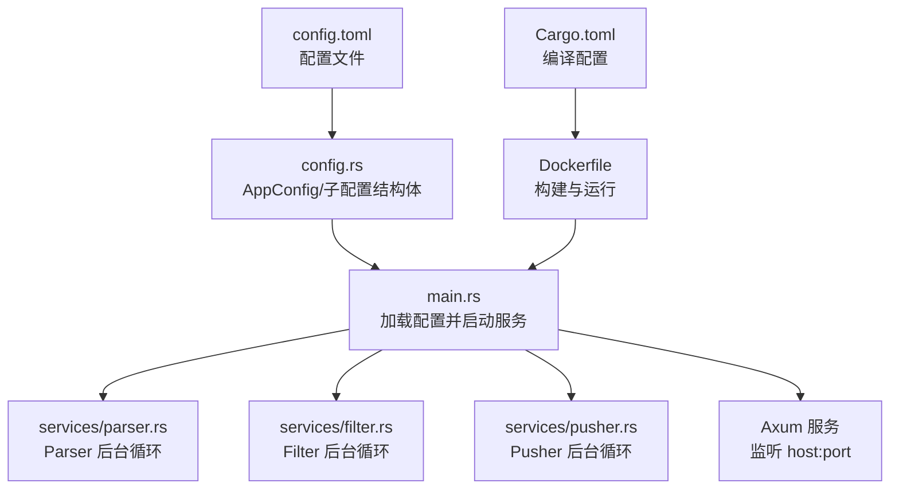
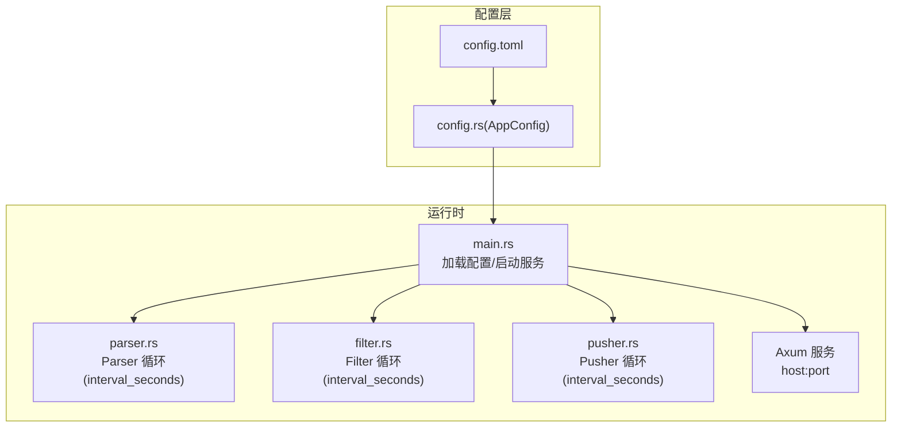
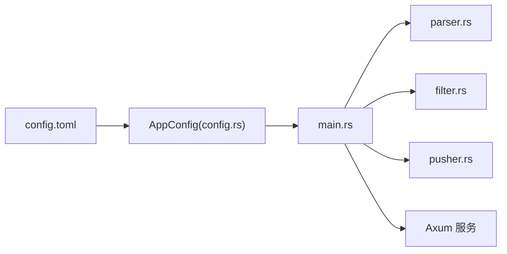

# 配置管理

<cite>
**本文引用的文件**
- [config.toml](file://config.toml)
- [config.rs](file://src/config.rs)
- [main.rs](file://src/main.rs)
- [parser.rs](file://src/services/parser.rs)
- [filter.rs](file://src/services/filter.rs)
- [pusher.rs](file://src/services/pusher.rs)
- [Dockerfile](file://Dockerfile)
- [Cargo.toml](file://Cargo.toml)
- [20260607044921_init.sql](file://docs/migrations/20260607044921_init.sql)
- [README.md](file://README.md)
</cite>

## 目录
1. [简介](#简介)
2. [项目结构](#项目结构)
3. [核心组件](#核心组件)
4. [架构总览](#架构总览)
5. [详细组件分析](#详细组件分析)
6. [依赖关系分析](#依赖关系分析)
7. [性能考量](#性能考量)
8. [故障排查指南](#故障排查指南)
9. [结论](#结论)
10. [附录](#附录)

## 简介
本文件为 AI 趋势监控系统的配置管理文档，围绕 config.toml 配置文件展开，系统性说明各模块参数的含义、作用范围与调优建议，并结合实际代码实现给出最佳实践。内容覆盖：
- 服务器配置（host、port）
- 数据库配置（path）
- 认证配置（initial_token）
- Parser 模块（max_concurrent_fetches、default_user_agent、default_timeout_seconds、interval_seconds）
- Filter 模块（batch_size、interval_seconds、history_hours、min_history_hours）
- Pusher 模块（interval_seconds、max_retries、retry_base_seconds）
- 环境变量与 Docker 容器化部署要点
- 生产环境推荐设置

## 项目结构
系统采用"管道模式"（Parser → Filter → Pusher）的三段式后台任务，配合 Axum 提供的 API 服务。配置文件通过 TOML 解析为强类型结构体，贯穿应用启动、模块初始化与运行。

**图表来源**
- [config.toml:1-28](file://config.toml#L1-L28)
- [config.rs:1-64](file://src/config.rs#L1-L64)
- [main.rs:64-126](file://src/main.rs#L64-L126)
- [parser.rs:96-200](file://src/services/parser.rs#L96-L200)
- [filter.rs:282-310](file://src/services/filter.rs#L282-L310)
- [pusher.rs:255-279](file://src/services/pusher.rs#L255-L279)
- [Dockerfile:1-61](file://Dockerfile#L1-L61)
- [Cargo.toml:48-57](file://Cargo.toml#L48-L57)

**章节来源**
- [config.toml:1-28](file://config.toml#L1-L28)
- [config.rs:1-64](file://src/config.rs#L1-L64)
- [main.rs:64-126](file://src/main.rs#L64-L126)
- [Dockerfile:1-61](file://Dockerfile#L1-L61)
- [Cargo.toml:48-57](file://Cargo.toml#L48-L57)

## 核心组件
本节聚焦 config.toml 的六个配置段落及其在代码中的映射与使用方式。

- 服务器配置（[server]）
  - host：监听地址
  - port：监听端口
  - 用途：决定 API 服务绑定的网络接口与端口
  - 最佳实践：生产环境建议固定内网 IP 或 0.0.0.0 并配合反向代理；端口避免与宿主冲突
  - 参考实现：[main.rs:115-120](file://src/main.rs#L115-L120)

- 数据库配置（[database]）
  - path：SQLite 文件路径
  - 用途：指定数据库文件位置，首次启动会自动创建目录与数据库
  - 最佳实践：将 docs/data 映射为持久卷以保留数据；生产环境建议使用 SSD
  - 参考实现：[main.rs:71-78](file://src/main.rs#L71-L78)、[20260607044921_init.sql:1-118](file://docs/migrations/20260607044921_init.sql#L1-L118)

- 认证配置（[auth]）
  - initial_token：初始管理员 Token（可选）
  - 用途：首次启动时自动创建初始 Token；为空或未配置则自动生成
  - 最佳实践：生产环境务必显式配置并妥善保管；避免空字符串
  - 参考实现：[main.rs:30-62](file://src/main.rs#L30-L62)、[README.md:78-89](file://README.md#L78-L89)

- Parser 模块（[parser]）
  - max_concurrent_fetches：最大并发采集任务数
  - default_user_agent：HTTP 请求 UA
  - default_timeout_seconds：RSS 拉取超时（秒）
  - **interval_seconds**：**新增** Parser 后台循环轮询间隔（秒）
  - 用途：控制采集并发度、伪装请求、超时策略与轮询频率
  - 最佳实践：并发数与目标站点限速能力匹配；超时应覆盖网络抖动；轮询间隔影响采集实时性与系统负载
  - 参考实现：[parser.rs:96-200](file://src/services/parser.rs#L96-L200)、[config.rs:33-40](file://src/config.rs#L33-L40)

- Filter 模块（[filter]）
  - batch_size：单次批量处理的文章条数
  - interval_seconds：过滤循环间隔（秒）
  - history_hours：统计历史窗口（小时）
  - min_history_hours：最少有效历史小时数
  - 用途：控制处理吞吐、检测灵敏度与历史统计稳定性
  - 最佳实践：增大 batch_size 提升吞吐但增加内存占用；history_hours 与 min_history_hours 影响突发检测稳定性
  - 参考实现：[filter.rs:282-310](file://src/services/filter.rs#L282-L310)、[config.rs:42-48](file://src/config.rs#L42-L48)

- Pusher 模块（[pusher]）
  - interval_seconds：轮询间隔（秒）
  - max_retries：最大重试次数
  - retry_base_seconds：退避基础秒数
  - 用途：控制推送轮询频率与失败重试策略
  - 最佳实践：降低轮询间隔提升实时性；合理设置重试次数与退避时间避免对下游造成压力
  - 参考实现：[pusher.rs:255-279](file://src/services/pusher.rs#L255-L279)、[config.rs:50-55](file://src/config.rs#L50-L55)

**章节来源**
- [config.toml:1-28](file://config.toml#L1-L28)
- [config.rs:1-64](file://src/config.rs#L1-L64)
- [main.rs:30-120](file://src/main.rs#L30-L120)
- [parser.rs:96-200](file://src/services/parser.rs#L96-L200)
- [filter.rs:282-310](file://src/services/filter.rs#L282-L310)
- [pusher.rs:255-279](file://src/services/pusher.rs#L255-L279)

## 架构总览
下图展示配置在系统中的流转与影响范围：

**图表来源**
- [config.toml:1-28](file://config.toml#L1-L28)
- [config.rs:1-64](file://src/config.rs#L1-L64)
- [main.rs:64-126](file://src/main.rs#L64-L126)
- [parser.rs:96-200](file://src/services/parser.rs#L96-L200)
- [filter.rs:282-310](file://src/services/filter.rs#L282-L310)
- [pusher.rs:255-279](file://src/services/pusher.rs#L255-L279)

## 详细组件分析

### 服务器配置（host、port）
- 作用：决定 API 服务监听的网络地址与端口
- 使用位置：启动时解析 host:port 并绑定 TCP 监听
- 调优建议：
  - 开发：使用 127.0.0.1:3000 避免防火墙问题
  - 生产：使用 0.0.0.0 或内网 IP，配合反向代理暴露 443/80
  - 端口选择：避开常用端口冲突，确保容器/主机映射正确
- 参考实现：[main.rs:115-120](file://src/main.rs#L115-L120)

**章节来源**
- [main.rs:115-120](file://src/main.rs#L115-L120)

### 数据库配置（path）
- 作用：SQLite 文件路径，首次启动自动创建目录与数据库
- 使用位置：初始化连接池与迁移执行
- 调优建议：
  - 生产环境将 docs/data 映射为持久卷，避免容器重建丢失数据
  - 使用 SSD 提升写入性能；定期备份重要数据
- 参考实现：[main.rs:71-81](file://src/main.rs#L71-L81)、[Dockerfile:55-56](file://Dockerfile#L55-L56)

**章节来源**
- [main.rs:71-81](file://src/main.rs#L71-L81)
- [Dockerfile:55-56](file://Dockerfile#L55-L56)

### 认证配置（initial_token）
- 作用：首次启动时创建初始管理员 Token；为空或未配置则自动生成
- 使用位置：ensure_initial_token 流程
- 调优建议：
  - 生产环境必须显式配置，避免泄露风险
  - 自动生成功能用于开发测试，不适用于生产
- 参考实现：[main.rs:30-62](file://src/main.rs#L30-L62)、[README.md:78-89](file://README.md#L78-L89)

**章节来源**
- [main.rs:30-62](file://src/main.rs#L30-L62)
- [README.md:78-89](file://README.md#L78-L89)

### Parser 模块参数
- max_concurrent_fetches
  - 作用：限制并发采集任务数量，通过信号量控制
  - 性能影响：并发过高可能被源站限速或触发反爬策略；过低导致吞吐不足
  - 调优建议：从 10 开始，观察源站响应与 CPU/IO 占用逐步调整
  - 参考实现：[parser.rs:96-200](file://src/services/parser.rs#L96-L200)

- default_user_agent
  - 作用：HTTP 请求 UA，便于源站识别
  - 调优建议：使用可读性强的 UA，避免过于"机器人化"
  - 参考实现：[parser.rs:39-46](file://src/services/parser.rs#L39-L46)

- default_timeout_seconds
  - 作用：RSS 拉取超时时间
  - 调优建议：根据网络状况与源站延迟设置，避免过短导致频繁失败
  - 参考实现：[parser.rs:39-46](file://src/services/parser.rs#L39-L46)

- **interval_seconds**（**新增**）
  - 作用：Parser 后台循环轮询间隔，控制采集任务的触发频率
  - 性能影响：更短间隔提升采集实时性，但增加数据库查询与网络请求压力；过长间隔导致热点延迟
  - 调优建议：默认 30 秒已较均衡，可根据源站更新频率与系统负载调整；过短可能触发源站限速
  - 参考实现：[parser.rs:96-200](file://src/services/parser.rs#L96-L200)、[config.rs:29-31](file://src/config.rs#L29-L31)

**章节来源**
- [parser.rs:96-200](file://src/services/parser.rs#L96-L200)
- [parser.rs:39-46](file://src/services/parser.rs#L39-L46)
- [config.rs:29-31](file://src/config.rs#L29-L31)

### Filter 模块参数
- batch_size
  - 作用：单次处理的文章批大小
  - 性能影响：增大批次可提升吞吐，但会增加内存占用与单次处理时间
  - 调优建议：从 1000 开始，结合内存与 CPU 调整
  - 参考实现：[filter.rs:18-219](file://src/services/filter.rs#L18-L219)

- interval_seconds
  - 作用：Filter 循环间隔
  - 性能影响：更短间隔提升实时性，但增加数据库与 CPU 压力
  - 调优建议：默认 300 秒已较均衡，可根据热点变化频率调整
  - 参考实现：[filter.rs:282-310](file://src/services/filter.rs#L282-L310)

- history_hours / min_history_hours
  - 作用：统计历史窗口与最少有效历史小时数
  - 性能影响：历史窗口越大越稳定但越慢；最少历史小时数影响阈值计算是否启用
  - 调优建议：history_hours ≥ 6 小时可显著提升稳定性；min_history_hours 建议 ≥ 6
  - 参考实现：[filter.rs:18-219](file://src/services/filter.rs#L18-L219)

**章节来源**
- [filter.rs:18-219](file://src/services/filter.rs#L18-L219)
- [filter.rs:282-310](file://src/services/filter.rs#L282-L310)

### Pusher 模块参数
- interval_seconds
  - 作用：轮询待推送与重试记录的间隔
  - 性能影响：更短间隔提升实时性，但增加数据库查询压力
  - 调优建议：默认 10 秒已较均衡，可根据推送量调整
  - 参考实现：[pusher.rs:255-279](file://src/services/pusher.rs#L255-L279)

- max_retries
  - 作用：最大重试次数
  - 性能影响：过多重试可能放大下游压力；过少可能导致漏推
  - 调优建议：默认 3 次较为稳妥
  - 参考实现：[pusher.rs:209-244](file://src/services/pusher.rs#L209-L244)

- retry_base_seconds
  - 作用：指数退避的基础秒数
  - 性能影响：影响重试等待时间，过大导致恢复慢，过小可能放大压力
  - 调优建议：默认 60 秒可平衡恢复速度与压力
  - 参考实现：[pusher.rs:209-244](file://src/services/pusher.rs#L209-L244)

**章节来源**
- [pusher.rs:209-244](file://src/services/pusher.rs#L209-L244)
- [pusher.rs:255-279](file://src/services/pusher.rs#L255-L279)

## 依赖关系分析
配置文件与模块之间的依赖关系如下：

**图表来源**
- [config.toml:1-28](file://config.toml#L1-L28)
- [config.rs:1-64](file://src/config.rs#L1-L64)
- [main.rs:64-126](file://src/main.rs#L64-L126)
- [parser.rs:96-200](file://src/services/parser.rs#L96-L200)
- [filter.rs:282-310](file://src/services/filter.rs#L282-L310)
- [pusher.rs:255-279](file://src/services/pusher.rs#L255-L279)

**章节来源**
- [config.toml:1-28](file://config.toml#L1-L28)
- [config.rs:1-64](file://src/config.rs#L1-L64)
- [main.rs:64-126](file://src/main.rs#L64-L126)

## 性能考量
- Parser 并发与超时
  - 并发过高易触发源站限速；建议从较低并发起步，结合网络质量与源站响应时间逐步提升
  - 超时应考虑网络波动，避免频繁失败导致重试风暴
  - **轮询间隔**：更短间隔提升采集实时性，但增加系统负载；过长间隔导致热点延迟
- Filter 批处理与历史窗口
  - 批处理越大吞吐越高，但内存与处理时间随之上升；建议结合硬件资源评估
  - 历史窗口越大越稳定，但对新热点的反应变慢；最少历史小时数保证统计有效性
- Pusher 轮询与重试
  - 更短轮询间隔提升实时性，但增加数据库压力；建议根据推送量与下游容量权衡
  - 重试次数与退避时间需平衡恢复速度与对下游的压力
- 数据库与存储
  - SQLite 在单机场景简单可靠；生产建议使用 SSD 并开启 WAL 模式（已在迁移中启用）
  - 将 docs/data 映射为持久卷，避免容器重建丢失数据

## 故障排查指南
- 配置加载失败
  - 现象：启动时报配置解析错误或找不到配置文件
  - 排查：确认 config.toml 路径与权限；字段类型与 TOML 语法正确
  - 参考实现：[config.rs:57-64](file://src/config.rs#L57-L64)

- 初始 Token 未生效
  - 现象：首次启动未生成预期 Token
  - 排查：确认 auth.initial_token 是否为空字符串；为空字符串将自动生成
  - 参考实现：[main.rs:30-62](file://src/main.rs#L30-L62)

- Parser 无法抓取或超时
  - 现象：采集失败或频繁超时
  - 排查：检查 default_timeout_seconds、default_user_agent；适当降低并发或提高超时
  - 参考实现：[parser.rs:39-46](file://src/services/parser.rs#L39-L46)

- **Parser 轮询不工作或过于频繁**
  - 现象：Parser 不按预期时间间隔运行或触发过于频繁
  - 排查：检查 [parser].interval_seconds 配置值；确认数据库源站更新时间设置
  - 参考实现：[parser.rs:96-200](file://src/services/parser.rs#L96-L200)

- Filter 未检测到热点
  - 现象：热点未触发或阈值过高
  - 排查：检查 history_hours 与 min_history_hours 是否过长；std_multiplier 与 min_hot_count 设置
  - 参考实现：[filter.rs:18-219](file://src/services/filter.rs#L18-L219)

- Pusher 推送失败或重试过多
  - 现象：大量失败记录或下游压力过大
  - 排查：检查 max_retries 与 retry_base_seconds；确认下游 Webhook 地址与可达性
  - 参考实现：[pusher.rs:209-244](file://src/services/pusher.rs#L209-L244)

**章节来源**
- [config.rs:57-64](file://src/config.rs#L57-L64)
- [main.rs:30-62](file://src/main.rs#L30-L62)
- [parser.rs:39-46](file://src/services/parser.rs#L39-L46)
- [parser.rs:96-200](file://src/services/parser.rs#L96-L200)
- [filter.rs:18-219](file://src/services/filter.rs#L18-L219)
- [pusher.rs:209-244](file://src/services/pusher.rs#L209-L244)

## 结论
配置管理是系统稳定运行与性能优化的关键。建议：
- 明确区分开发与生产配置，生产环境务必显式配置认证 Token 与服务器参数
- 以默认值为起点，结合实际负载与硬件条件进行参数微调
- **新增** Parser 的 interval_seconds 参数提供了更精细的轮询控制，可根据业务需求灵活调整
- 通过 Docker 持久化数据卷与合理的资源限制保障生产可用性
- 定期回顾与压测，确保配置与业务增长相匹配

## 附录

### 环境变量与 CLI 参数
- CLI 参数
  - --config：指定配置文件路径（默认 config.toml）
  - --mode：运行模式（all、api、parser、filter、pusher）
- 环境变量
  - 日志级别可通过环境变量控制（示例：info），用于调试与生产日志粒度调节
- 参考实现：[main.rs:17-25](file://src/main.rs#L17-L25)、[main.rs:66](file://src/main.rs#L66)

**章节来源**
- [main.rs:17-25](file://src/main.rs#L17-L25)
- [main.rs:66](file://src/main.rs#L66)

### Docker 容器化部署要点
- 构建与运行
  - 多阶段构建，最终镜像仅包含运行时二进制与必要证书
  - 默认暴露 3000 端口，ENTRYPOINT 与 CMD 指定默认配置与运行模式
- 数据持久化
  - VOLUME ["/app/docs/data"] 用于持久化 SQLite 数据
- 参考实现：[Dockerfile:1-61](file://Dockerfile#L1-L61)

**章节来源**
- [Dockerfile:1-61](file://Dockerfile#L1-L61)

### 生产环境推荐设置
- 服务器
  - host：0.0.0.0 或内网 IP
  - port：80/443（配合反向代理）
- 数据库
  - path：指向持久卷路径
  - 存储介质：SSD
- 认证
  - initial_token：显式配置为安全的随机字符串
- Parser
  - max_concurrent_fetches：依据源站限速与网络质量，建议 5–20
  - default_timeout_seconds：建议 30–60
  - **interval_seconds**：**新增** 建议 30 秒，可根据源站更新频率调整
- Filter
  - batch_size：建议 1000
  - interval_seconds：建议 300
  - history_hours：建议 24
  - min_history_hours：建议 6
- Pusher
  - interval_seconds：建议 10
  - max_retries：建议 3
  - retry_base_seconds：建议 60

**章节来源**
- [config.toml:1-28](file://config.toml#L1-L28)
- [README.md:91-122](file://README.md#L91-L122)